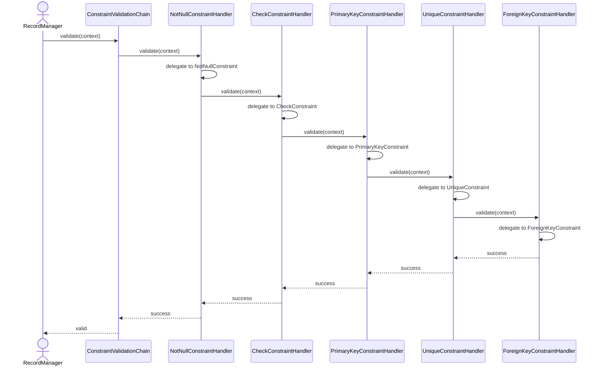

```mermaid
sequenceDiagram
    actor Manager as RecordManager
    participant Chain as ConstraintValidationChain
    participant NN as NotNullConstraintHandler
    participant Check as CheckConstraintHandler
    participant PK as PrimaryKeyConstraintHandler
    participant UQ as UniqueConstraintHandler
    participant FK as ForeignKeyConstraintHandler

    Manager->>Chain: validate(context)
    Chain->>NN: validate(context)

    NN->>NN: delegate to NotNullConstraint
    NN->>Check: validate(context)

    Check->>Check: delegate to CheckConstraint
    Check->>PK: validate(context)

    PK->>PK: delegate to PrimaryKeyConstraint
    PK->>UQ: validate(context)

    UQ->>UQ: delegate to UniqueConstraint
    UQ->>FK: validate(context)

    FK->>FK: delegate to ForeignKeyConstraint
    FK-->>UQ: success
    UQ-->>PK: success
    PK-->>Check: success
    Check-->>NN: success
    NN-->>Chain: success
    Chain-->>Manager: valid
```