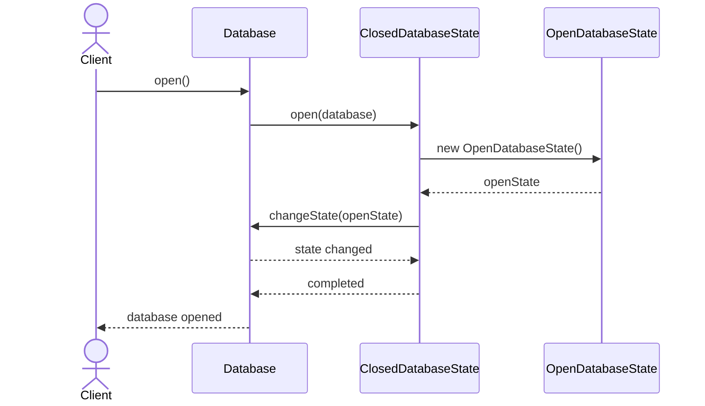
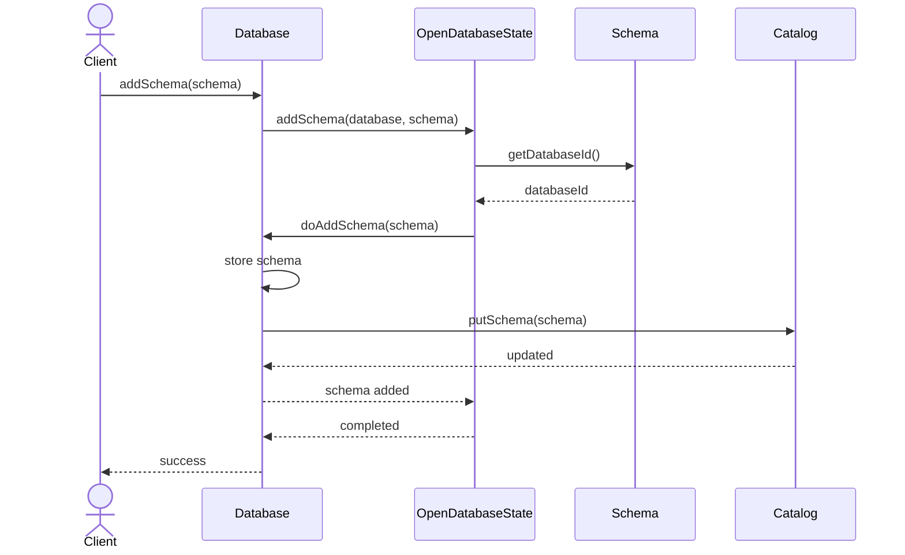
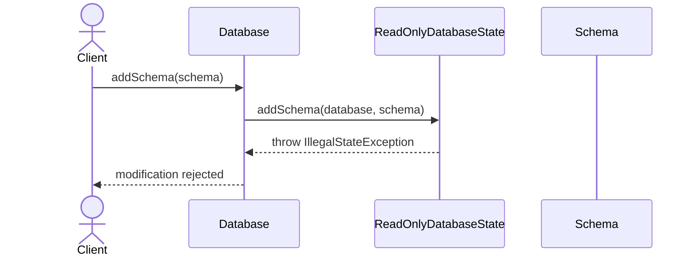

1. Sequence — Open database

```mermaid
sequenceDiagram
    actor Client
    participant DB as Database
    participant Closed as ClosedDatabaseState
    participant Open as OpenDatabaseState

    Client->>DB: open()
    DB->>Closed: open(database)

    Closed->>Open: new OpenDatabaseState()
    Open-->>Closed: openState

    Closed->>DB: changeState(openState)
    DB-->>Closed: state changed

    Closed-->>DB: completed
    DB-->>Client: database opened
```
2. Sequence — Add schema when database is OPEN

```mermaid
sequenceDiagram
    actor Client
    participant DB as Database
    participant State as OpenDatabaseState
    participant Schema
    participant Catalog

    Client->>DB: addSchema(schema)
    DB->>State: addSchema(database, schema)

    State->>Schema: getDatabaseId()
    Schema-->>State: databaseId

    State->>DB: doAddSchema(schema)
    DB->>DB: store schema
    DB->>Catalog: putSchema(schema)
    Catalog-->>DB: updated

    DB-->>State: schema added
    State-->>DB: completed
    DB-->>Client: success
```

3. Sequence — Reject modification when database is READ_ONLY

```mermaid
sequenceDiagram
    actor Client
    participant DB as Database
    participant State as ReadOnlyDatabaseState
    participant Schema

    Client->>DB: addSchema(schema)
    DB->>State: addSchema(database, schema)

    State-->>DB: throw IllegalStateException
    DB-->>Client: modification rejected
```