# DatabaseManager Testing - Main Functional Sequences

---

## 1. Create Database

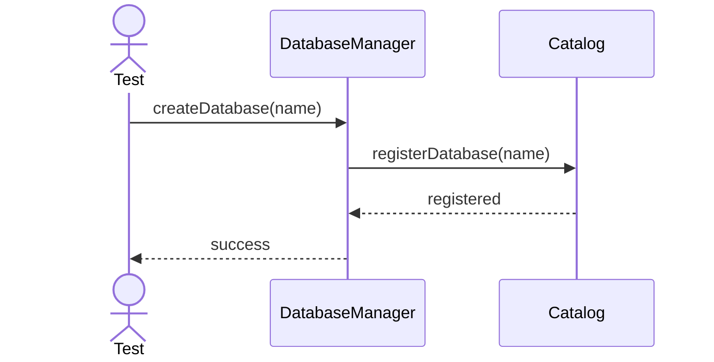
```mermaid
sequenceDiagram
actor Test
participant DatabaseManager
participant Catalog

Test->>DatabaseManager: createDatabase(name)
DatabaseManager->>Catalog: registerDatabase(name)
Catalog-->>DatabaseManager: registered
DatabaseManager-->>Test: success
```

---

## 2. Drop Database

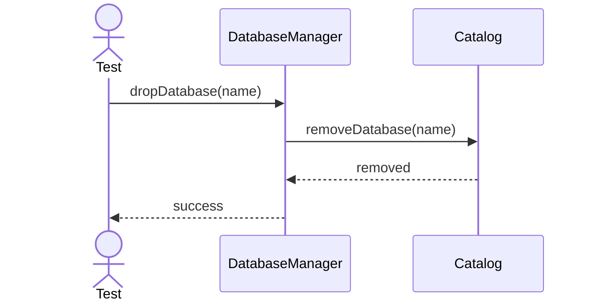
```mermaid
sequenceDiagram
actor Test
participant DatabaseManager
participant Catalog

Test->>DatabaseManager: dropDatabase(name)
DatabaseManager->>Catalog: removeDatabase(name)
Catalog-->>DatabaseManager: removed
DatabaseManager-->>Test: success
```

---

## 3. Rename Database

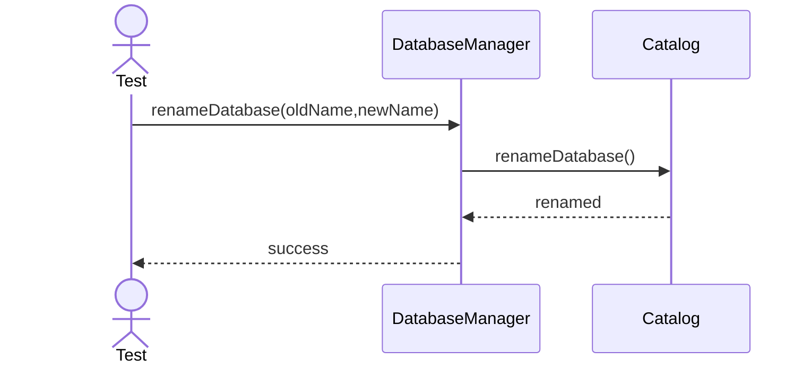
```mermaid
sequenceDiagram
actor Test
participant DatabaseManager
participant Catalog

Test->>DatabaseManager: renameDatabase(oldName,newName)
DatabaseManager->>Catalog: renameDatabase()
Catalog-->>DatabaseManager: renamed
DatabaseManager-->>Test: success
```

---

## 4. Attach Database

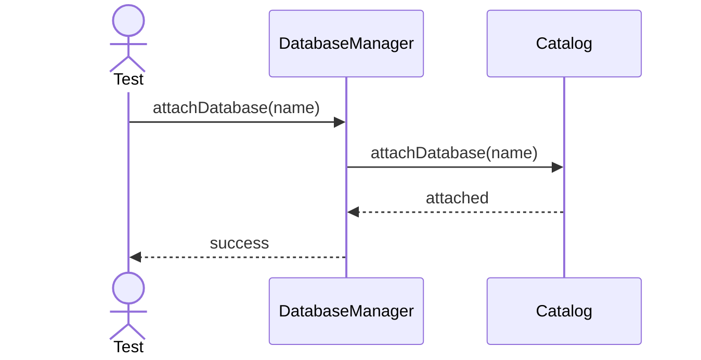
```mermaid
sequenceDiagram
actor Test
participant DatabaseManager
participant Catalog

Test->>DatabaseManager: attachDatabase(name)
DatabaseManager->>Catalog: attachDatabase(name)
Catalog-->>DatabaseManager: attached
DatabaseManager-->>Test: success
```

---

## 5. Detach Database

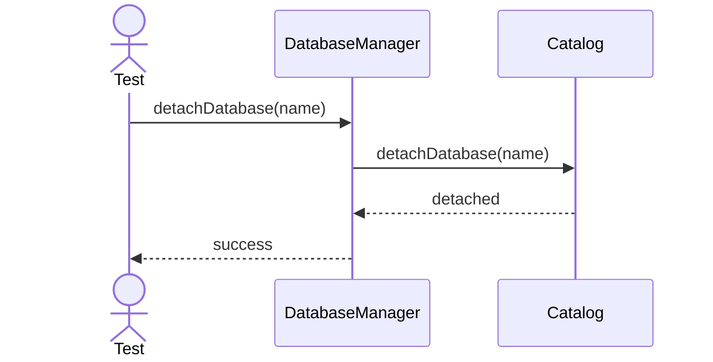
```mermaid
sequenceDiagram
actor Test
participant DatabaseManager
participant Catalog

Test->>DatabaseManager: detachDatabase(name)
DatabaseManager->>Catalog: detachDatabase(name)
Catalog-->>DatabaseManager: detached
DatabaseManager-->>Test: success
```

---

## 6. Backup Database

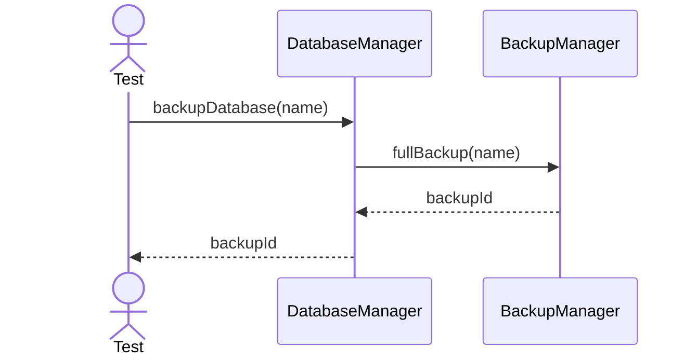
```mermaid
sequenceDiagram
actor Test
participant DatabaseManager
participant BackupManager

Test->>DatabaseManager: backupDatabase(name)
DatabaseManager->>BackupManager: fullBackup(name)
BackupManager-->>DatabaseManager: backupId
DatabaseManager-->>Test: backupId
```

---

## 7. Restore Database

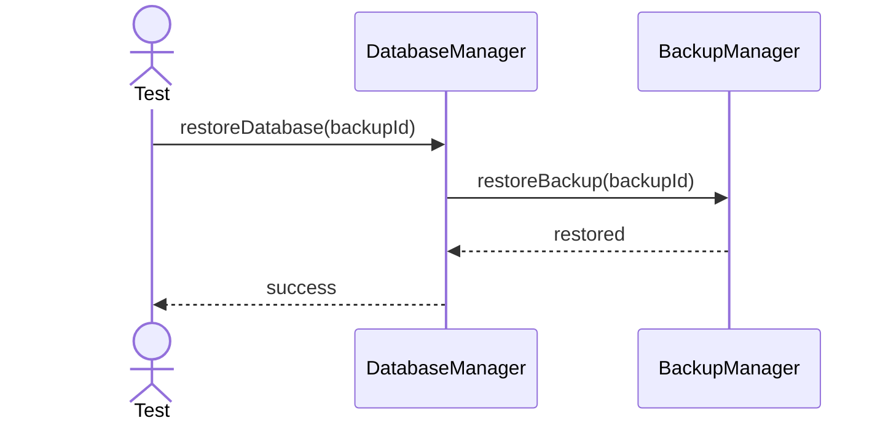
```mermaid
sequenceDiagram
actor Test
participant DatabaseManager
participant BackupManager

Test->>DatabaseManager: restoreDatabase(backupId)
DatabaseManager->>BackupManager: restoreBackup(backupId)
BackupManager-->>DatabaseManager: restored
DatabaseManager-->>Test: success
```

---

## 8. List Databases

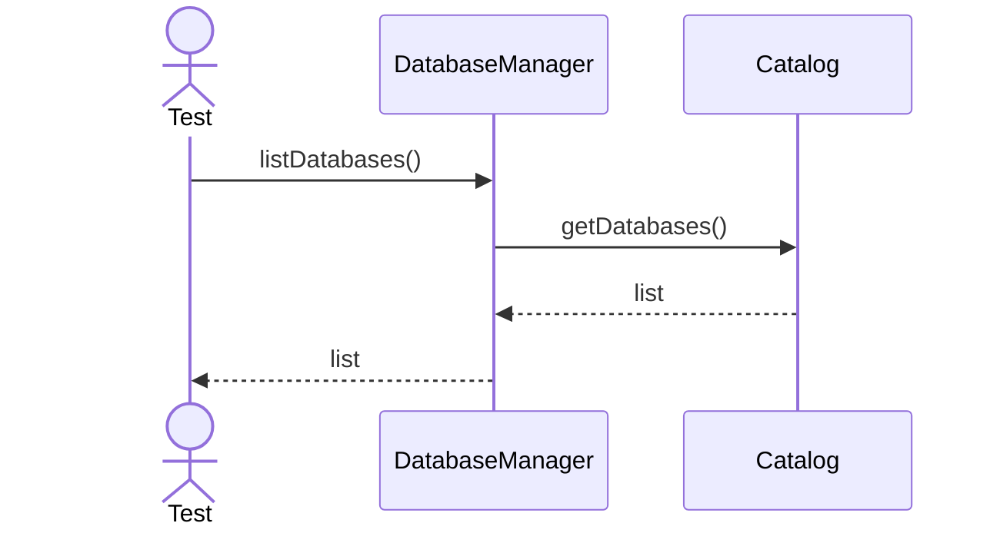
```mermaid
sequenceDiagram
actor Test
participant DatabaseManager
participant Catalog

Test->>DatabaseManager: listDatabases()
DatabaseManager->>Catalog: getDatabases()
Catalog-->>DatabaseManager: list
DatabaseManager-->>Test: list
```

---

## 9. Check Database Exists

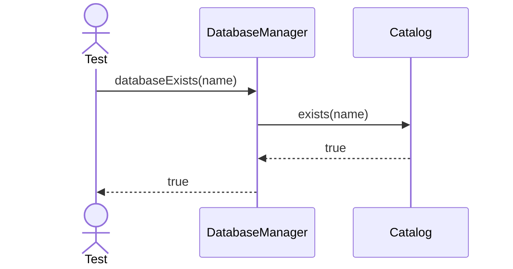
```mermaid
sequenceDiagram
actor Test
participant DatabaseManager
participant Catalog

Test->>DatabaseManager: databaseExists(name)
DatabaseManager->>Catalog: exists(name)
Catalog-->>DatabaseManager: true
DatabaseManager-->>Test: true
```

---

## 10. Open Database

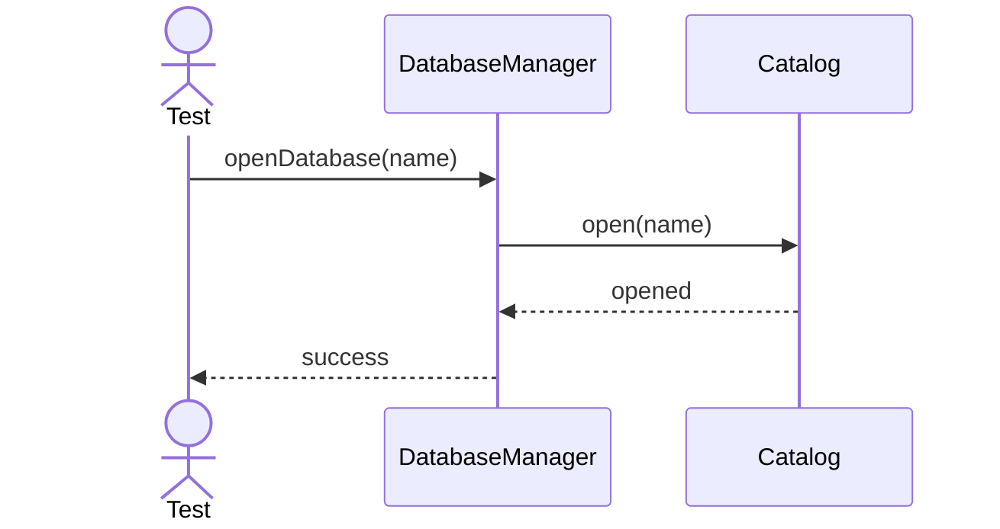
```mermaid
sequenceDiagram
actor Test
participant DatabaseManager
participant Catalog

Test->>DatabaseManager: openDatabase(name)
DatabaseManager->>Catalog: open(name)
Catalog-->>DatabaseManager: opened
DatabaseManager-->>Test: success
```

---

## 11. Close Database

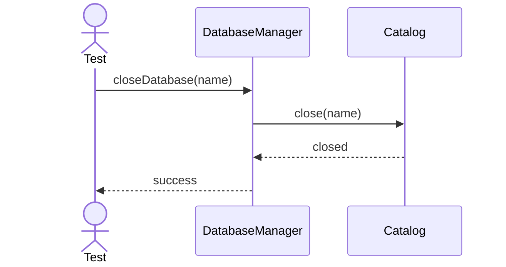
```mermaid
sequenceDiagram
actor Test
participant DatabaseManager
participant Catalog

Test->>DatabaseManager: closeDatabase(name)
DatabaseManager->>Catalog: close(name)
Catalog-->>DatabaseManager: closed
DatabaseManager-->>Test: success
```

---

## 12. Reload Catalog

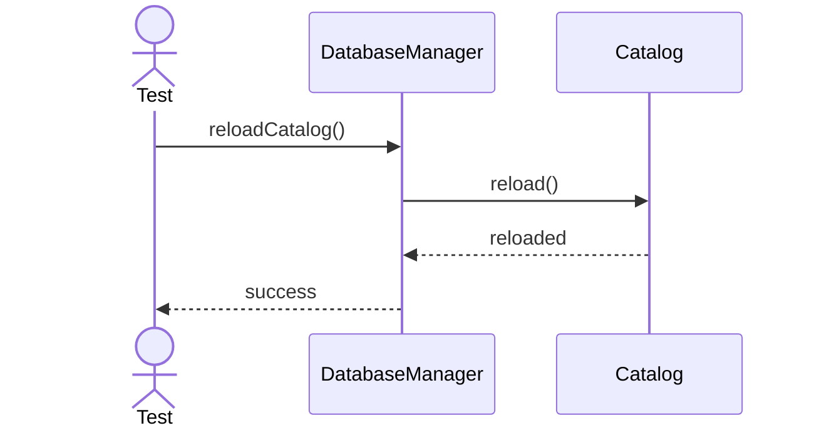
```mermaid
sequenceDiagram
actor Test
participant DatabaseManager
participant Catalog

Test->>DatabaseManager: reloadCatalog()
DatabaseManager->>Catalog: reload()
Catalog-->>DatabaseManager: reloaded
DatabaseManager-->>Test: success
```

---

## 13. Clear Cache

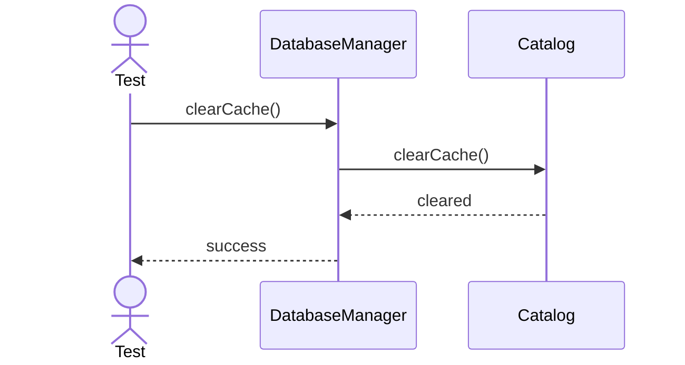
```mermaid
sequenceDiagram
actor Test
participant DatabaseManager
participant Catalog

Test->>DatabaseManager: clearCache()
DatabaseManager->>Catalog: clearCache()
Catalog-->>DatabaseManager: cleared
DatabaseManager-->>Test: success
```

---

## 14. Export Snapshot

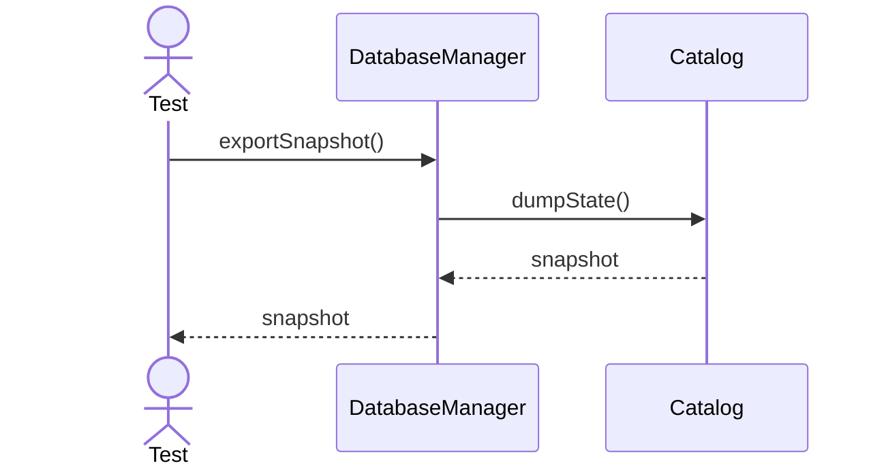
```mermaid
sequenceDiagram
actor Test
participant DatabaseManager
participant Catalog

Test->>DatabaseManager: exportSnapshot()
DatabaseManager->>Catalog: dumpState()
Catalog-->>DatabaseManager: snapshot
DatabaseManager-->>Test: snapshot
```

---

## 15. Import Snapshot

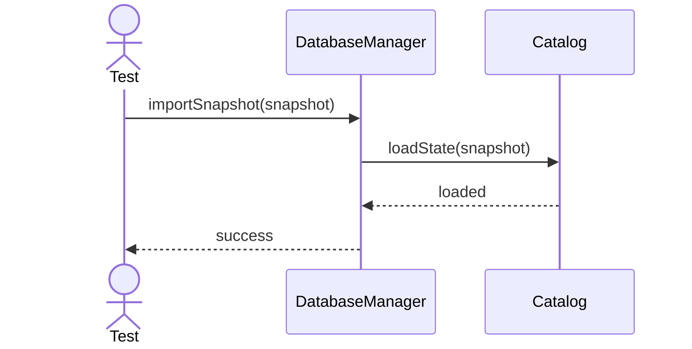
```mermaid
sequenceDiagram
actor Test
participant DatabaseManager
participant Catalog

Test->>DatabaseManager: importSnapshot(snapshot)
DatabaseManager->>Catalog: loadState(snapshot)
Catalog-->>DatabaseManager: loaded
DatabaseManager-->>Test: success
```

---

## 16. Validate Configuration

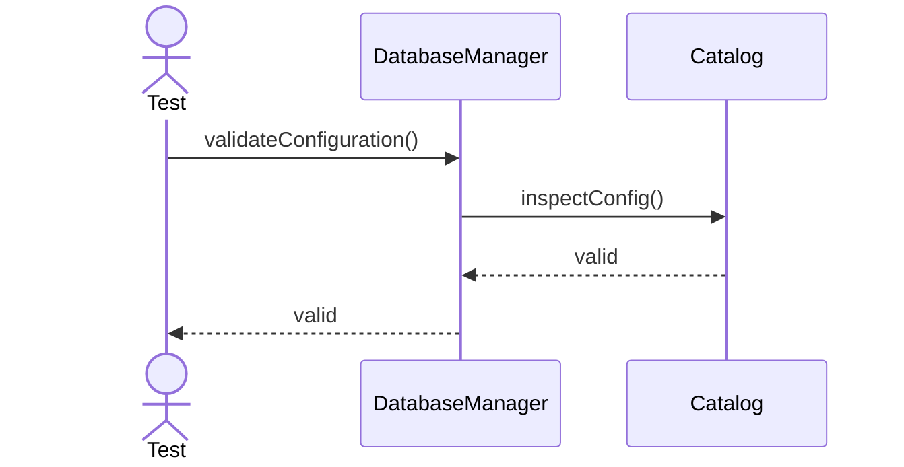
```mermaid
sequenceDiagram
actor Test
participant DatabaseManager
participant Catalog

Test->>DatabaseManager: validateConfiguration()
DatabaseManager->>Catalog: inspectConfig()
Catalog-->>DatabaseManager: valid
DatabaseManager-->>Test: valid
```

---

## 17. Resolve Database Path

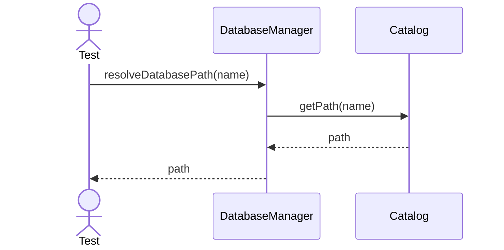
```mermaid
sequenceDiagram
actor Test
participant DatabaseManager
participant Catalog

Test->>DatabaseManager: resolveDatabasePath(name)
DatabaseManager->>Catalog: getPath(name)
Catalog-->>DatabaseManager: path
DatabaseManager-->>Test: path
```

---

## 18. Health Check

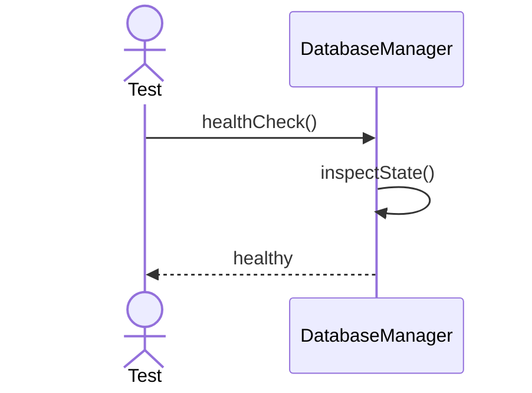
```mermaid
sequenceDiagram
actor Test
participant DatabaseManager

Test->>DatabaseManager: healthCheck()
DatabaseManager->>DatabaseManager: inspectState()
DatabaseManager-->>Test: healthy
```

---

## 19. Sync Metadata

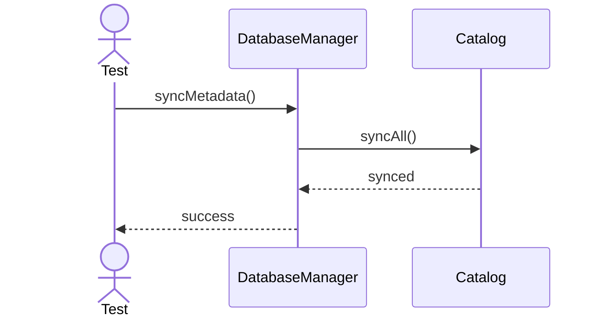
```mermaid
sequenceDiagram
actor Test
participant DatabaseManager
participant Catalog

Test->>DatabaseManager: syncMetadata()
DatabaseManager->>Catalog: syncAll()
Catalog-->>DatabaseManager: synced
DatabaseManager-->>Test: success
```

---

## 20. Report Status

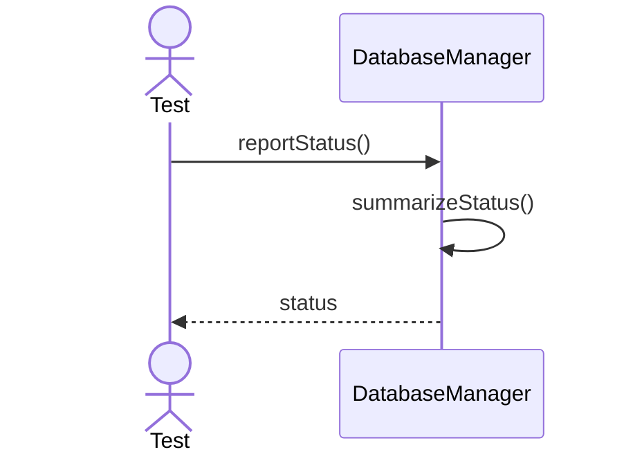
```mermaid
sequenceDiagram
actor Test
participant DatabaseManager

Test->>DatabaseManager: reportStatus()
DatabaseManager->>DatabaseManager: summarizeStatus()
DatabaseManager-->>Test: status
```
