# DatabaseServer Testing - Main Functional Sequences

---

## 1. Start Server

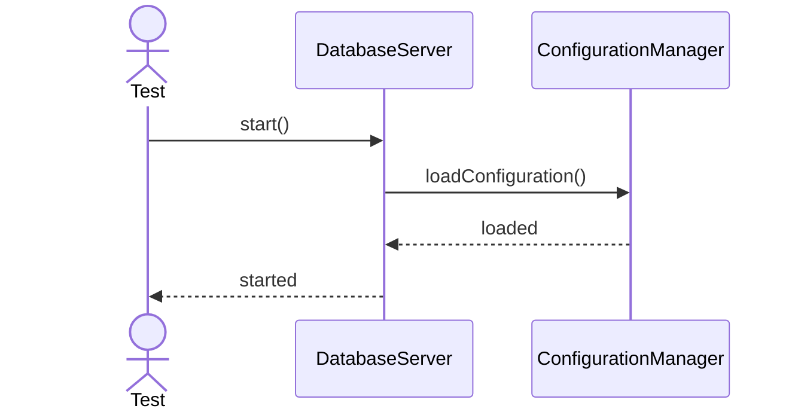

---

## 2. Stop Server

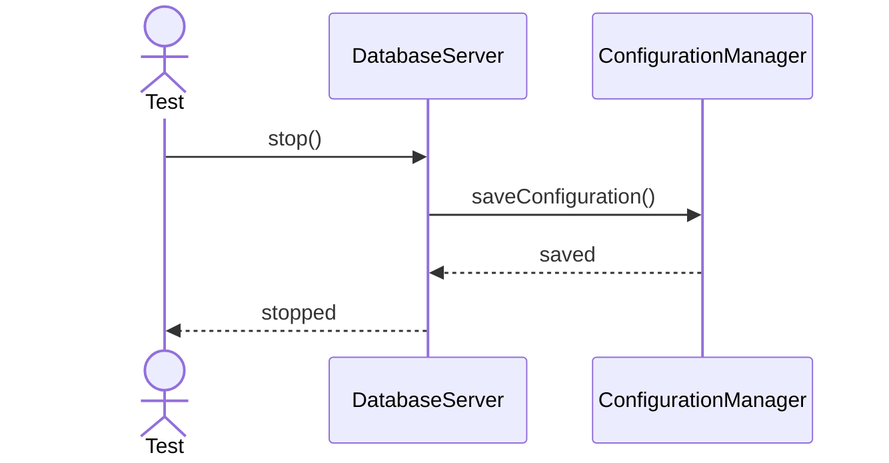

---

## 3. Restart Server

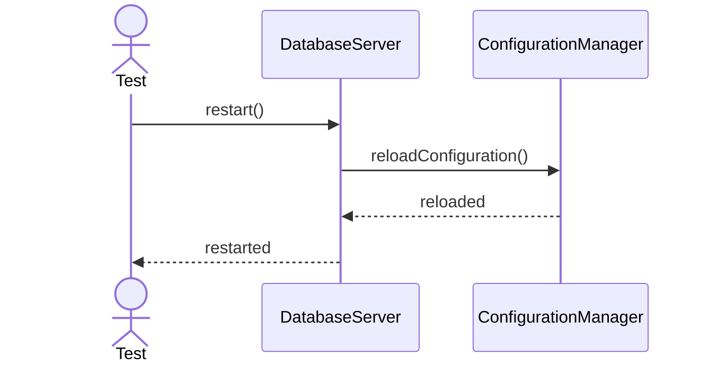

---

## 4. Create Database

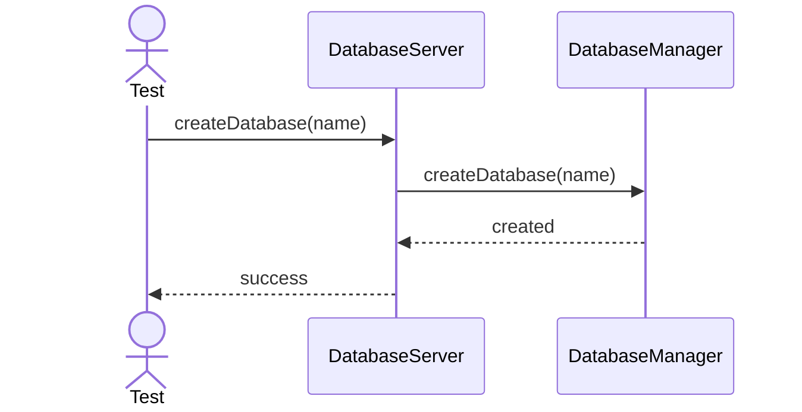

---

## 5. Drop Database

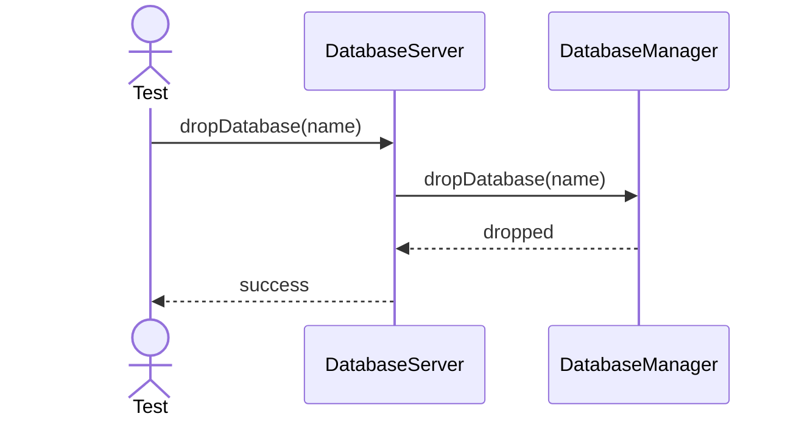

---

## 6. Open Database

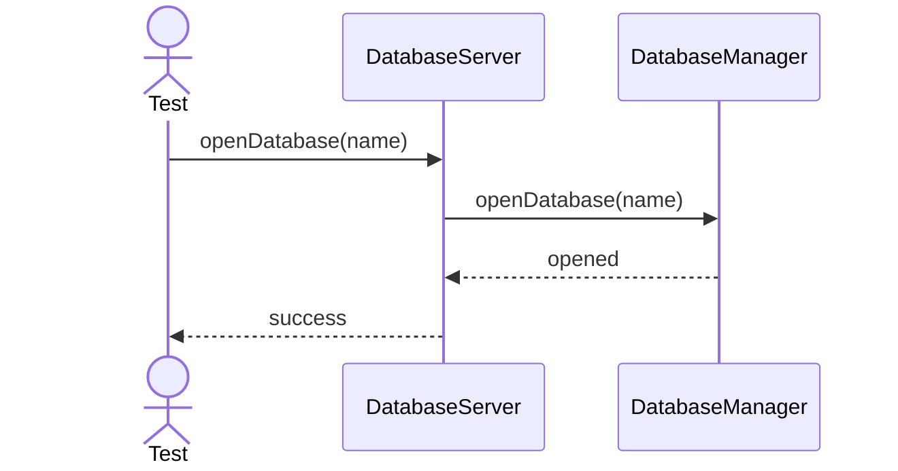

---

## 7. Close Database

---

## 8. Attach Database

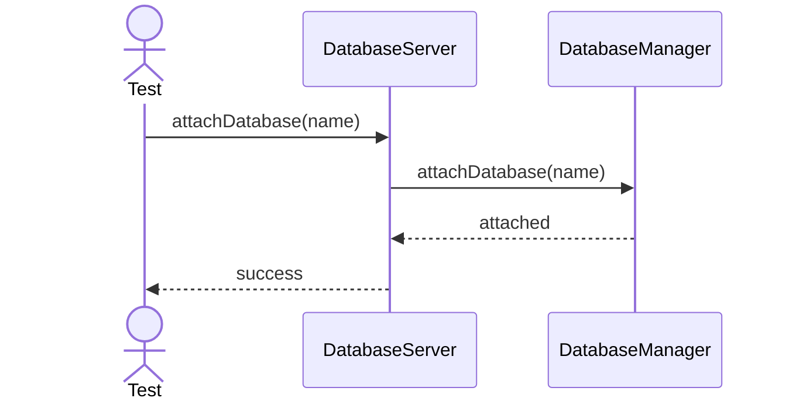

---

## 9. Detach Database

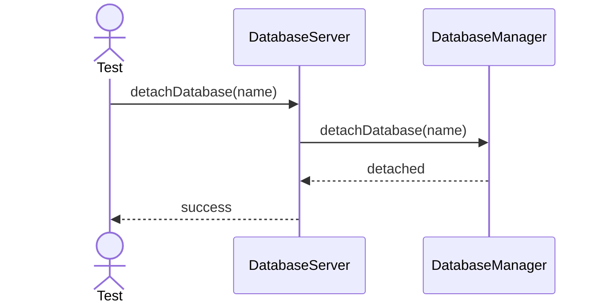

---

## 10. List Databases

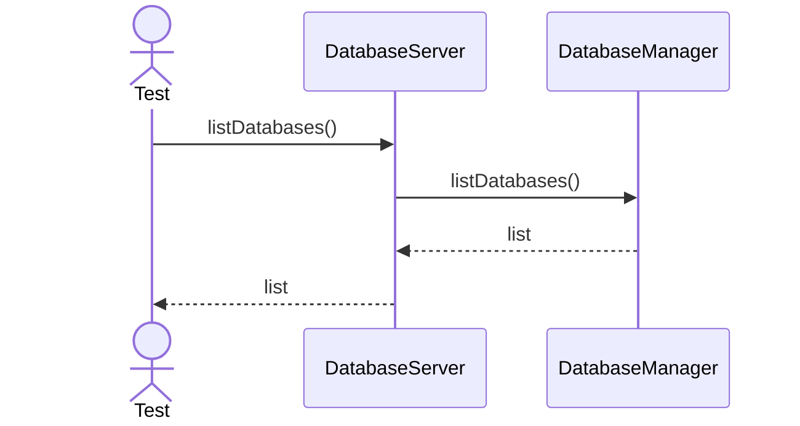

---

## 11. Validate Configuration

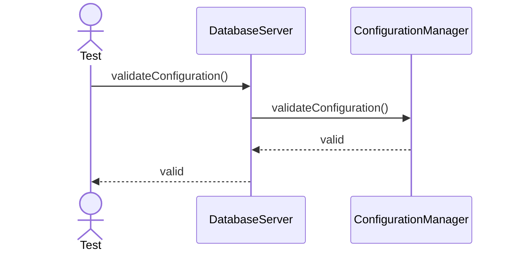

---

## 12. Initialize Storage

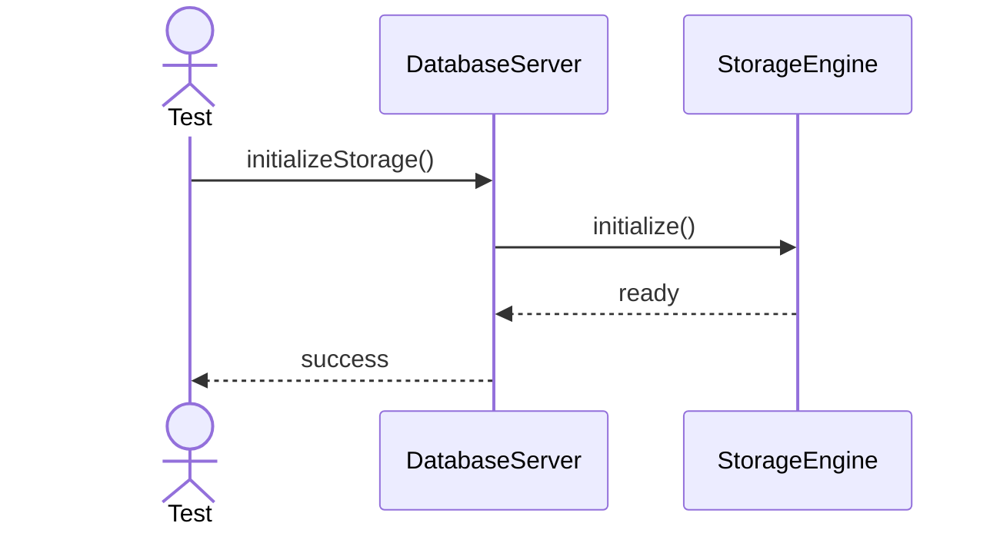

---

## 13. Load Catalog

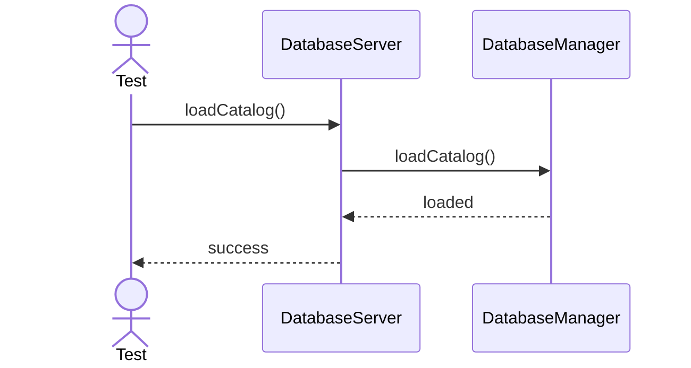

---

## 14. Recover Server

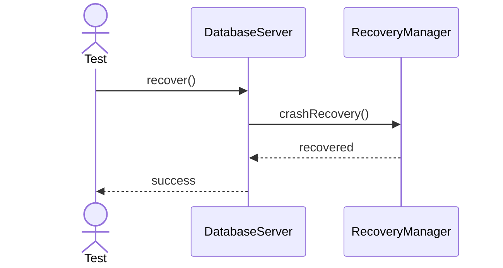

---

## 15. Backup Server State

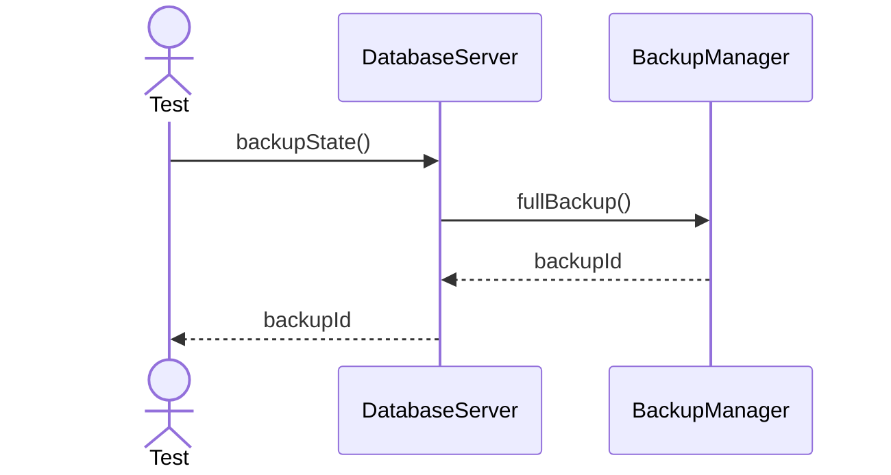

---

## 16. Restore Server State

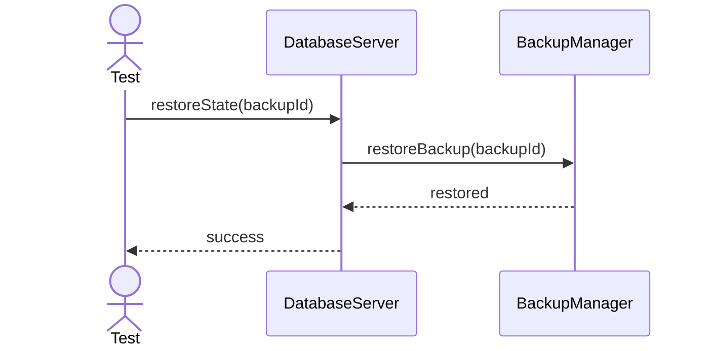

---

## 17. Health Check

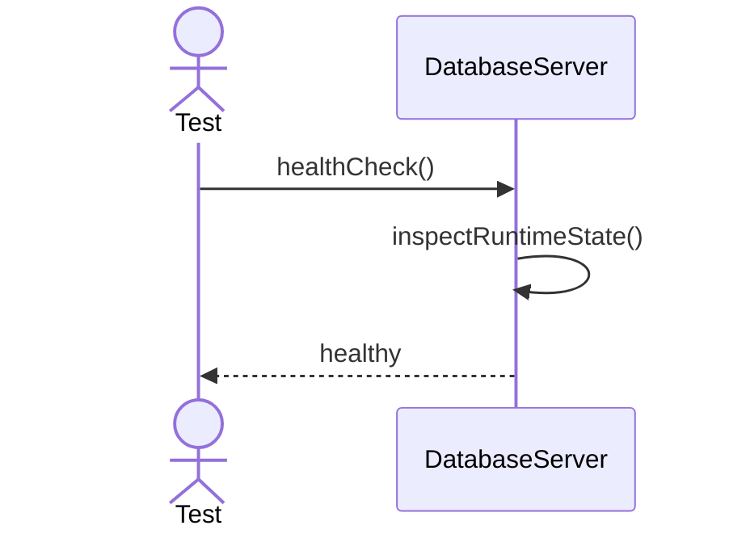

---

## 18. Reload Metadata

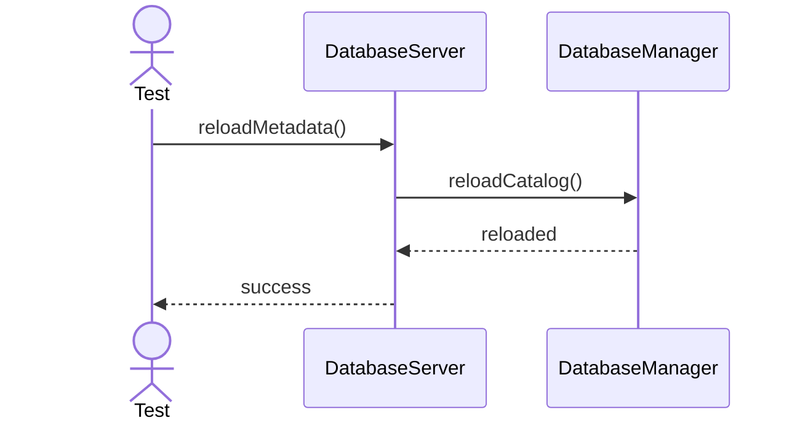

---

## 19. Sync Configuration

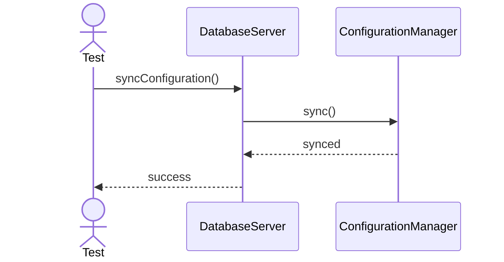

---

## 20. Report Status

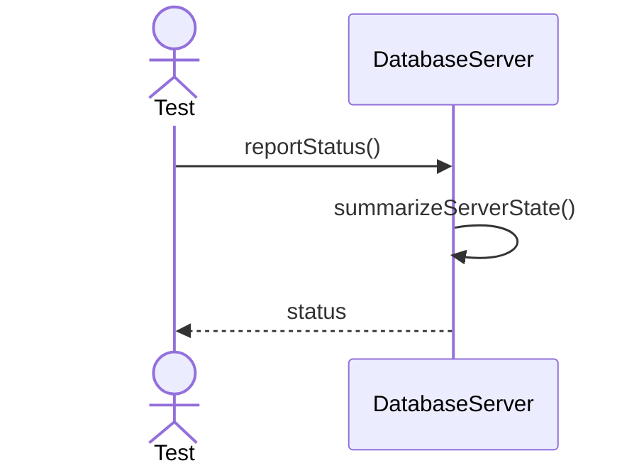
