# Database Testing Sequence Diagrams

## 1. Constructor_ShouldCreateDatabase

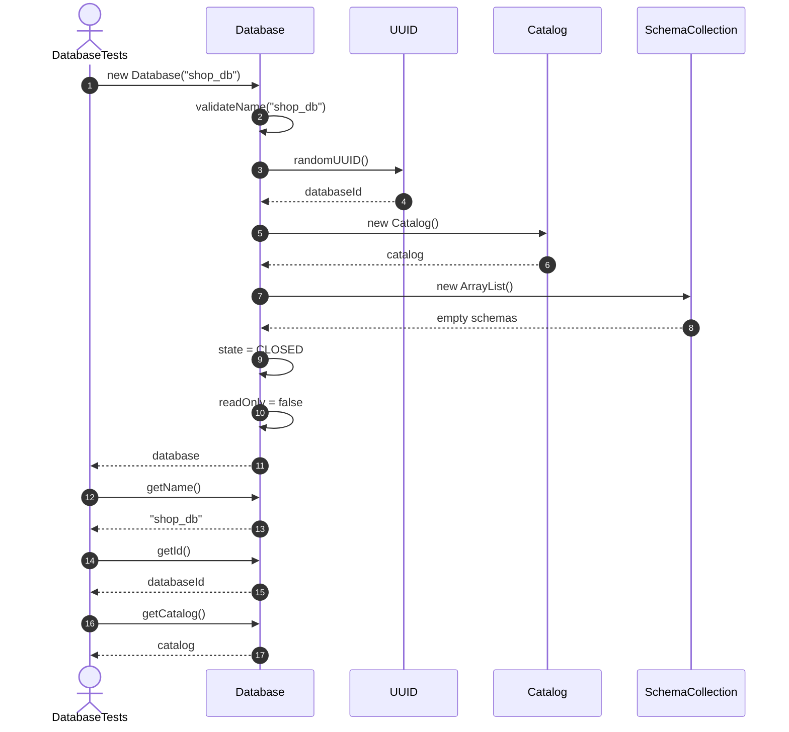
```mermaid
sequenceDiagram
    autonumber

    actor Test as DatabaseTests
    participant DB as Database
    participant UUID as UUID
    participant C as Catalog
    participant SC as SchemaCollection

    Test->>DB: new Database("shop_db")

    DB->>DB: validateName("shop_db")
    DB->>UUID: randomUUID()
    UUID-->>DB: databaseId

    DB->>C: new Catalog()
    C-->>DB: catalog

    DB->>SC: new ArrayList()
    SC-->>DB: empty schemas

    DB->>DB: state = CLOSED
    DB->>DB: readOnly = false

    DB-->>Test: database

    Test->>DB: getName()
    DB-->>Test: "shop_db"

    Test->>DB: getId()
    DB-->>Test: databaseId

    Test->>DB: getCatalog()
    DB-->>Test: catalog
```

---

## 2. Constructor_ShouldGenerateDatabaseId

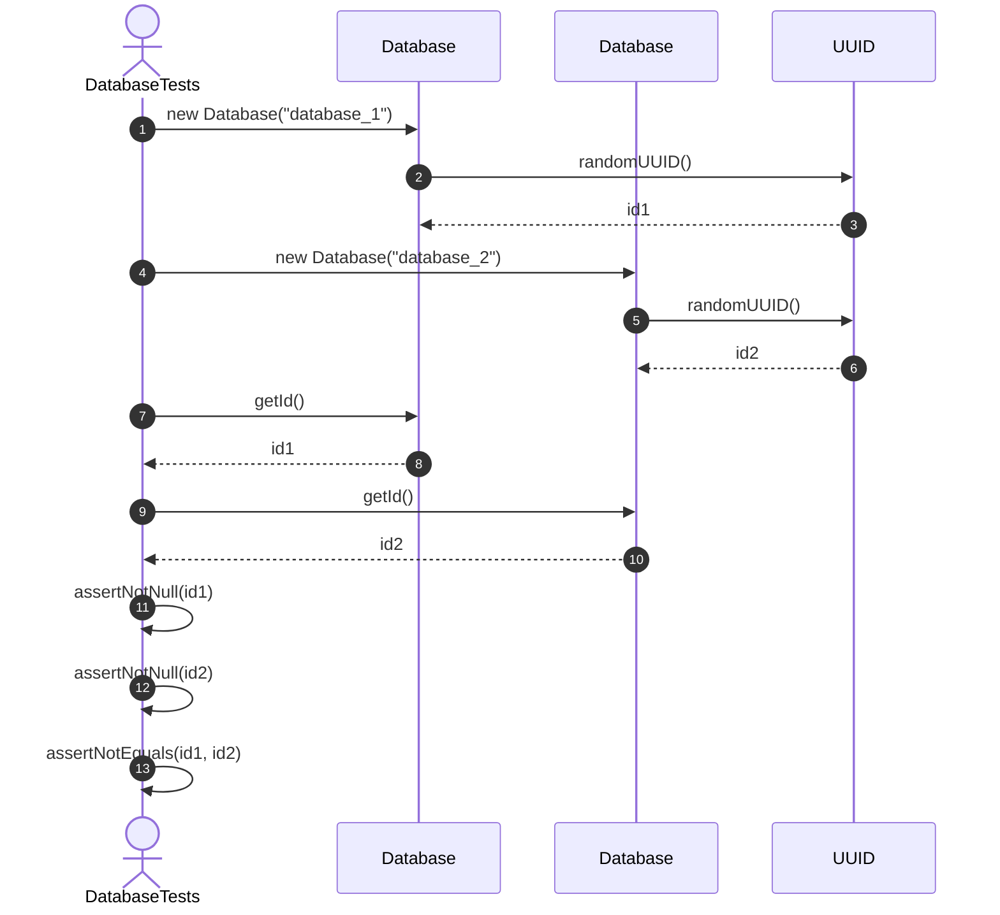
```mermaid
sequenceDiagram
    autonumber

    actor Test as DatabaseTests
    participant DB1 as Database
    participant DB2 as Database
    participant UUID as UUID

    Test->>DB1: new Database("database_1")
    DB1->>UUID: randomUUID()
    UUID-->>DB1: id1

    Test->>DB2: new Database("database_2")
    DB2->>UUID: randomUUID()
    UUID-->>DB2: id2

    Test->>DB1: getId()
    DB1-->>Test: id1

    Test->>DB2: getId()
    DB2-->>Test: id2

    Test->>Test: assertNotNull(id1)
    Test->>Test: assertNotNull(id2)
    Test->>Test: assertNotEquals(id1, id2)
```

---

## 3. Constructor_ShouldInitializeCatalog

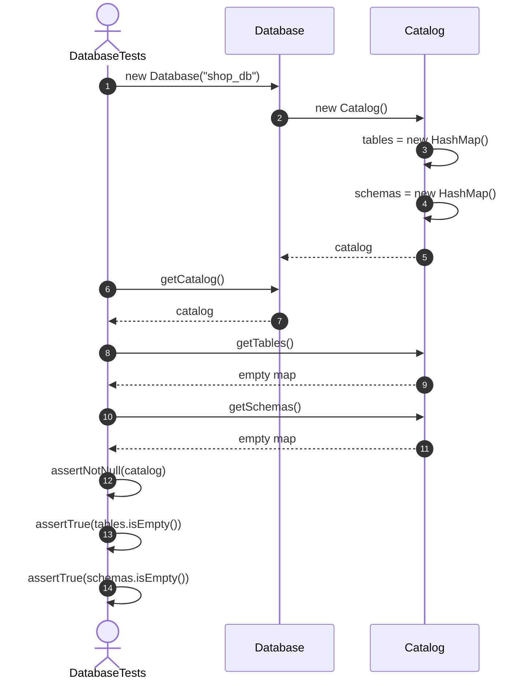
```mermaid
sequenceDiagram
    autonumber

    actor Test as DatabaseTests
    participant DB as Database
    participant C as Catalog

    Test->>DB: new Database("shop_db")

    DB->>C: new Catalog()
    C->>C: tables = new HashMap()
    C->>C: schemas = new HashMap()
    C-->>DB: catalog

    Test->>DB: getCatalog()
    DB-->>Test: catalog

    Test->>C: getTables()
    C-->>Test: empty map

    Test->>C: getSchemas()
    C-->>Test: empty map

    Test->>Test: assertNotNull(catalog)
    Test->>Test: assertTrue(tables.isEmpty())
    Test->>Test: assertTrue(schemas.isEmpty())
```

---

## 4. Constructor_ShouldInitializeSchemaCollection

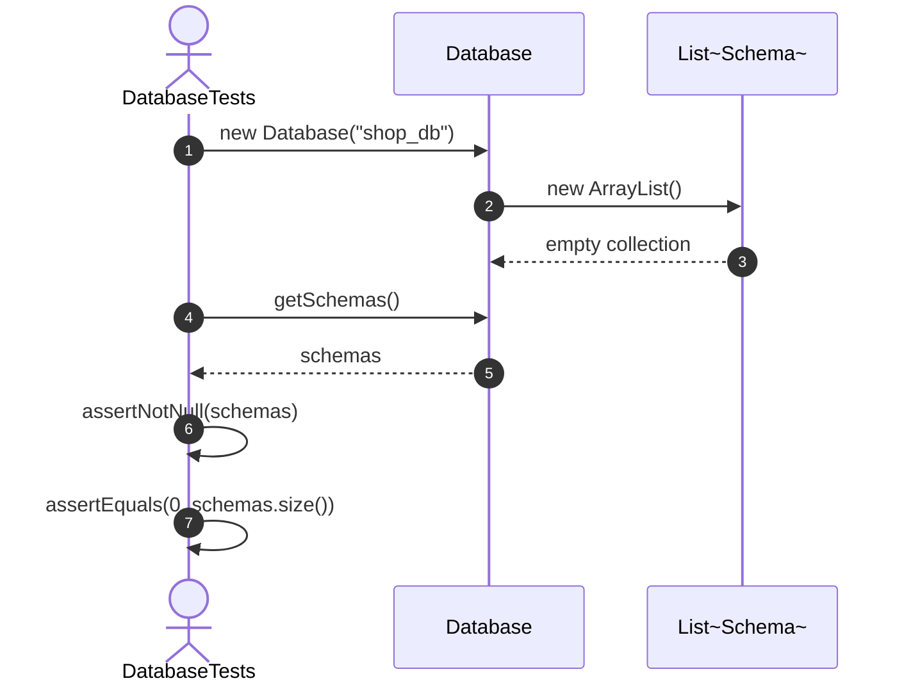
```mermaid
sequenceDiagram
    autonumber

    actor Test as DatabaseTests
    participant DB as Database
    participant Schemas as List~Schema~

    Test->>DB: new Database("shop_db")
    DB->>Schemas: new ArrayList()
    Schemas-->>DB: empty collection

    Test->>DB: getSchemas()
    DB-->>Test: schemas

    Test->>Test: assertNotNull(schemas)
    Test->>Test: assertEquals(0, schemas.size())
```

---

## 5. Constructor_ShouldRejectNullName

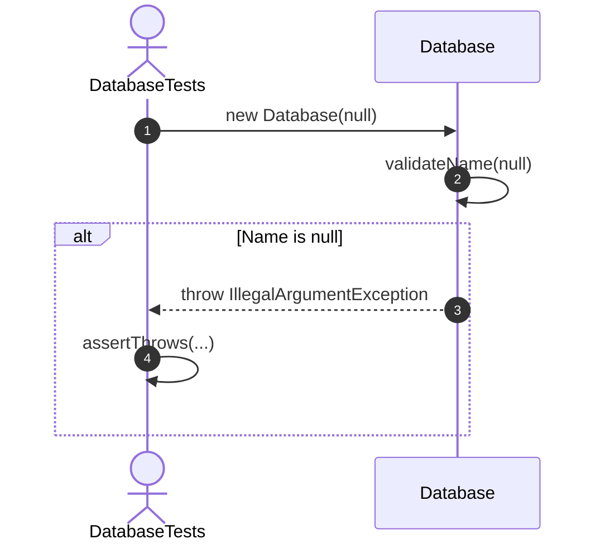
```mermaid
sequenceDiagram
    autonumber

    actor Test as DatabaseTests
    participant DB as Database

    Test->>DB: new Database(null)
    DB->>DB: validateName(null)

    alt Name is null
        DB-->>Test: throw IllegalArgumentException
        Test->>Test: assertThrows(...)
    end
```

---

## 6. Constructor_ShouldRejectBlankName

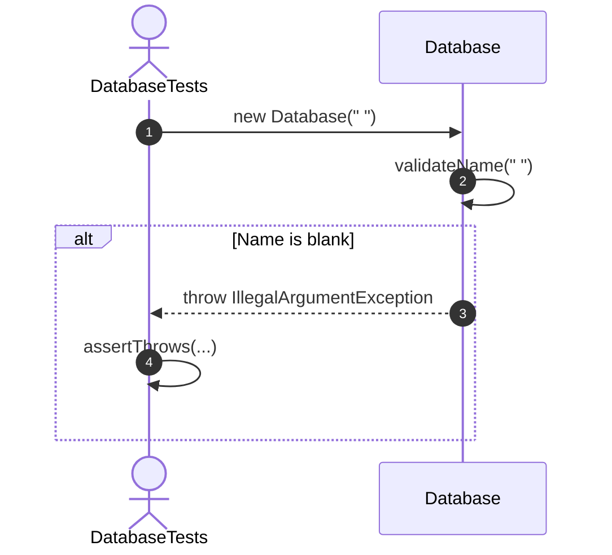
```mermaid
sequenceDiagram
    autonumber

    actor Test as DatabaseTests
    participant DB as Database

    Test->>DB: new Database("   ")
    DB->>DB: validateName("   ")

    alt Name is blank
        DB-->>Test: throw IllegalArgumentException
        Test->>Test: assertThrows(...)
    end
```

---

## 7. Constructor_ShouldRejectTooLongName

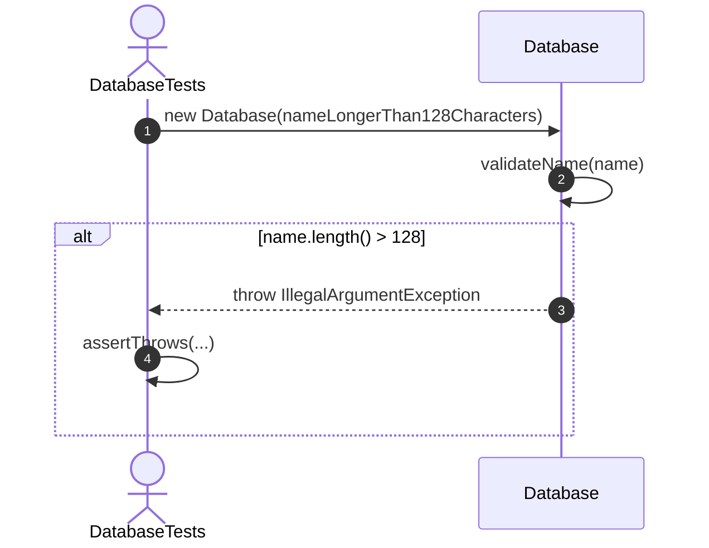
```mermaid
sequenceDiagram
    autonumber

    actor Test as DatabaseTests
    participant DB as Database

    Test->>DB: new Database(nameLongerThan128Characters)
    DB->>DB: validateName(name)

    alt name.length() > 128
        DB-->>Test: throw IllegalArgumentException
        Test->>Test: assertThrows(...)
    end
```

---

## 8. Open_ShouldChangeDatabaseStateToOpen

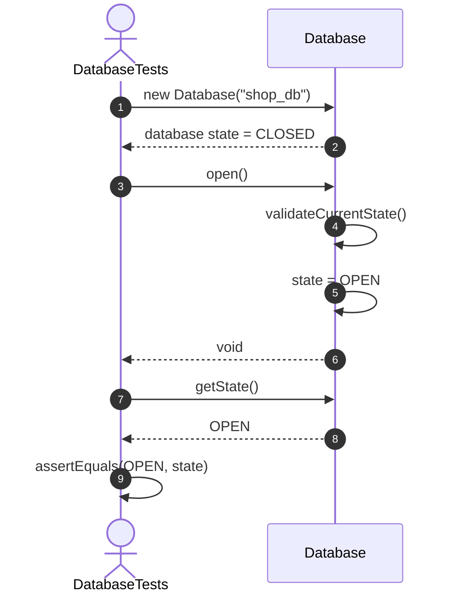
```mermaid
sequenceDiagram
    autonumber

    actor Test as DatabaseTests
    participant DB as Database

    Test->>DB: new Database("shop_db")
    DB-->>Test: database state = CLOSED

    Test->>DB: open()
    DB->>DB: validateCurrentState()
    DB->>DB: state = OPEN
    DB-->>Test: void

    Test->>DB: getState()
    DB-->>Test: OPEN

    Test->>Test: assertEquals(OPEN, state)
```

---

## 9. Open_ShouldBeIdempotent

Calling `open()` twice should not duplicate resources or corrupt state.

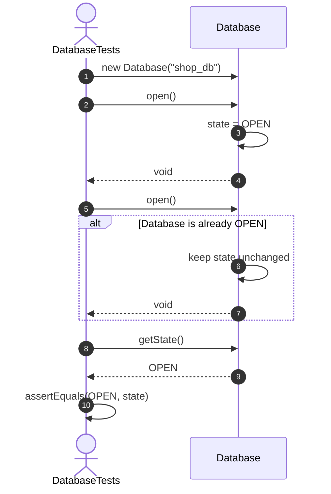
```mermaid
sequenceDiagram
    autonumber

    actor Test as DatabaseTests
    participant DB as Database

    Test->>DB: new Database("shop_db")

    Test->>DB: open()
    DB->>DB: state = OPEN
    DB-->>Test: void

    Test->>DB: open()

    alt Database is already OPEN
        DB->>DB: keep state unchanged
        DB-->>Test: void
    end

    Test->>DB: getState()
    DB-->>Test: OPEN

    Test->>Test: assertEquals(OPEN, state)
```

---

## 10. Close_ShouldChangeDatabaseStateToClosed

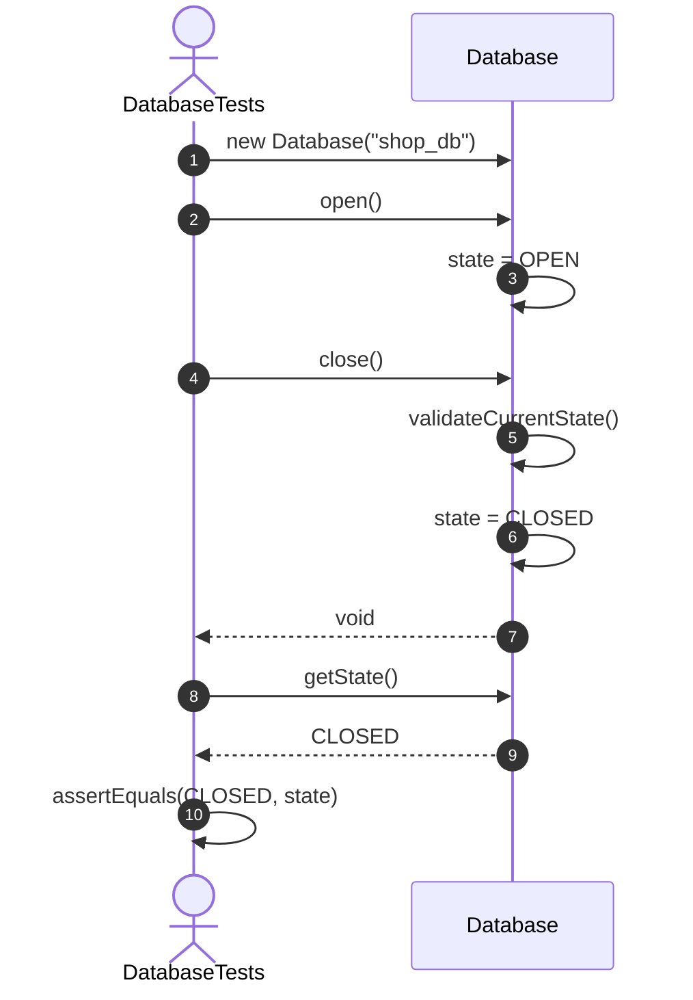
```mermaid
sequenceDiagram
    autonumber

    actor Test as DatabaseTests
    participant DB as Database

    Test->>DB: new Database("shop_db")
    Test->>DB: open()
    DB->>DB: state = OPEN

    Test->>DB: close()
    DB->>DB: validateCurrentState()
    DB->>DB: state = CLOSED
    DB-->>Test: void

    Test->>DB: getState()
    DB-->>Test: CLOSED

    Test->>Test: assertEquals(CLOSED, state)
```

---

## 11. Close_ShouldBeIdempotent

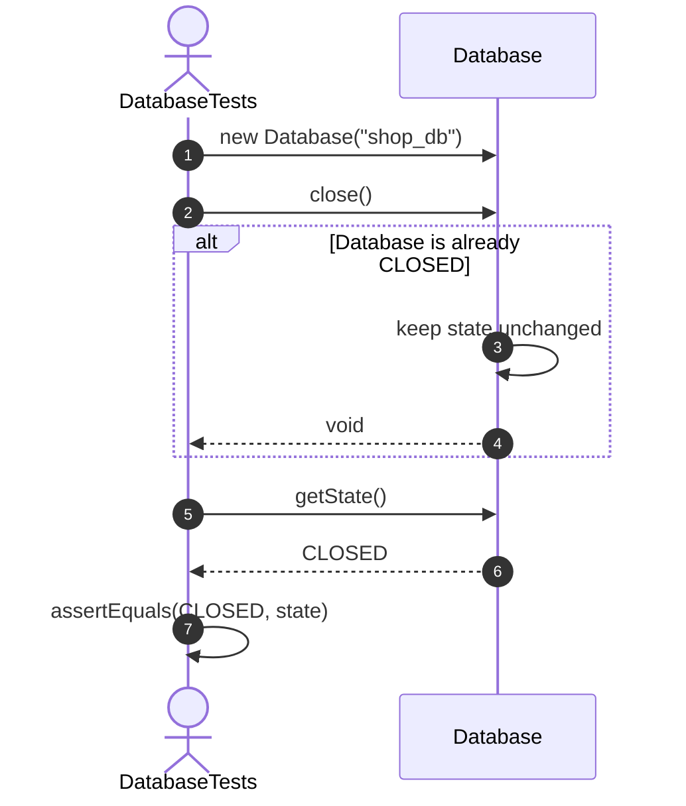
```mermaid
sequenceDiagram
    autonumber

    actor Test as DatabaseTests
    participant DB as Database

    Test->>DB: new Database("shop_db")

    Test->>DB: close()

    alt Database is already CLOSED
        DB->>DB: keep state unchanged
        DB-->>Test: void
    end

    Test->>DB: getState()
    DB-->>Test: CLOSED

    Test->>Test: assertEquals(CLOSED, state)
```

---

## 12. AddSchema_ShouldRegisterSchema

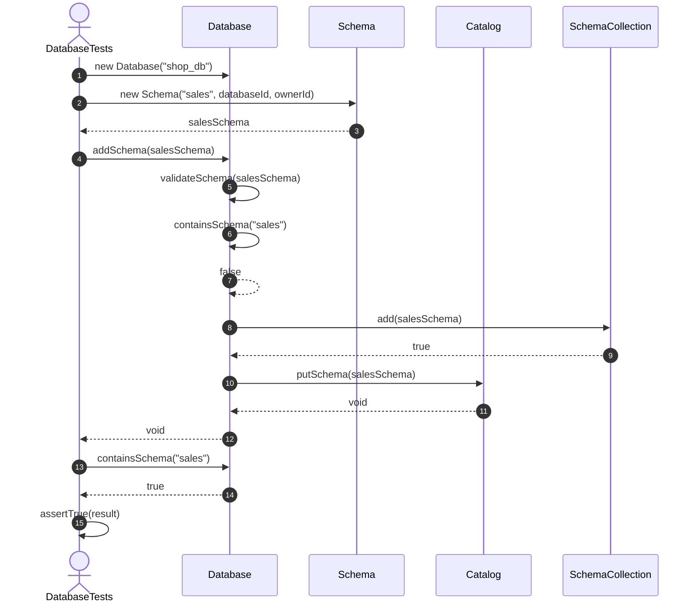
```mermaid
sequenceDiagram
    autonumber

    actor Test as DatabaseTests
    participant DB as Database
    participant S as Schema
    participant C as Catalog
    participant SC as SchemaCollection

    Test->>DB: new Database("shop_db")
    Test->>S: new Schema("sales", databaseId, ownerId)
    S-->>Test: salesSchema

    Test->>DB: addSchema(salesSchema)

    DB->>DB: validateSchema(salesSchema)
    DB->>DB: containsSchema("sales")
    DB-->>DB: false

    DB->>SC: add(salesSchema)
    SC-->>DB: true

    DB->>C: putSchema(salesSchema)
    C-->>DB: void

    DB-->>Test: void

    Test->>DB: containsSchema("sales")
    DB-->>Test: true

    Test->>Test: assertTrue(result)
```

---

## 13. AddSchema_ShouldIncreaseSchemaCount

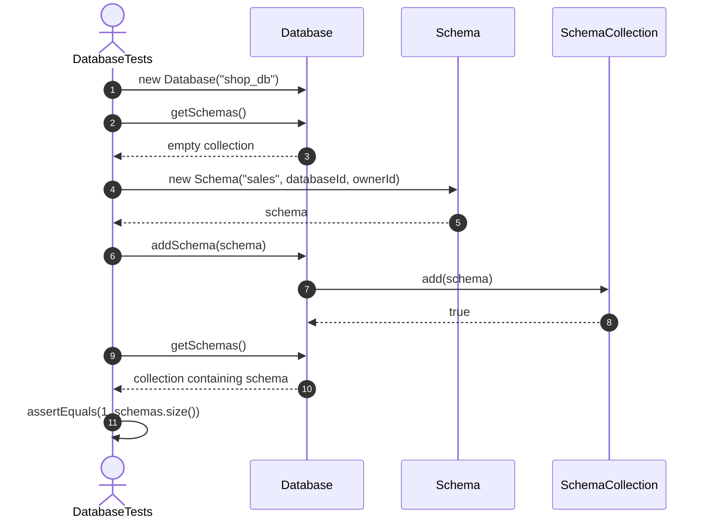
```mermaid
sequenceDiagram
    autonumber

    actor Test as DatabaseTests
    participant DB as Database
    participant S as Schema
    participant SC as SchemaCollection

    Test->>DB: new Database("shop_db")

    Test->>DB: getSchemas()
    DB-->>Test: empty collection

    Test->>S: new Schema("sales", databaseId, ownerId)
    S-->>Test: schema

    Test->>DB: addSchema(schema)
    DB->>SC: add(schema)
    SC-->>DB: true

    Test->>DB: getSchemas()
    DB-->>Test: collection containing schema

    Test->>Test: assertEquals(1, schemas.size())
```

---

## 14. AddSchema_ShouldRejectNullSchema

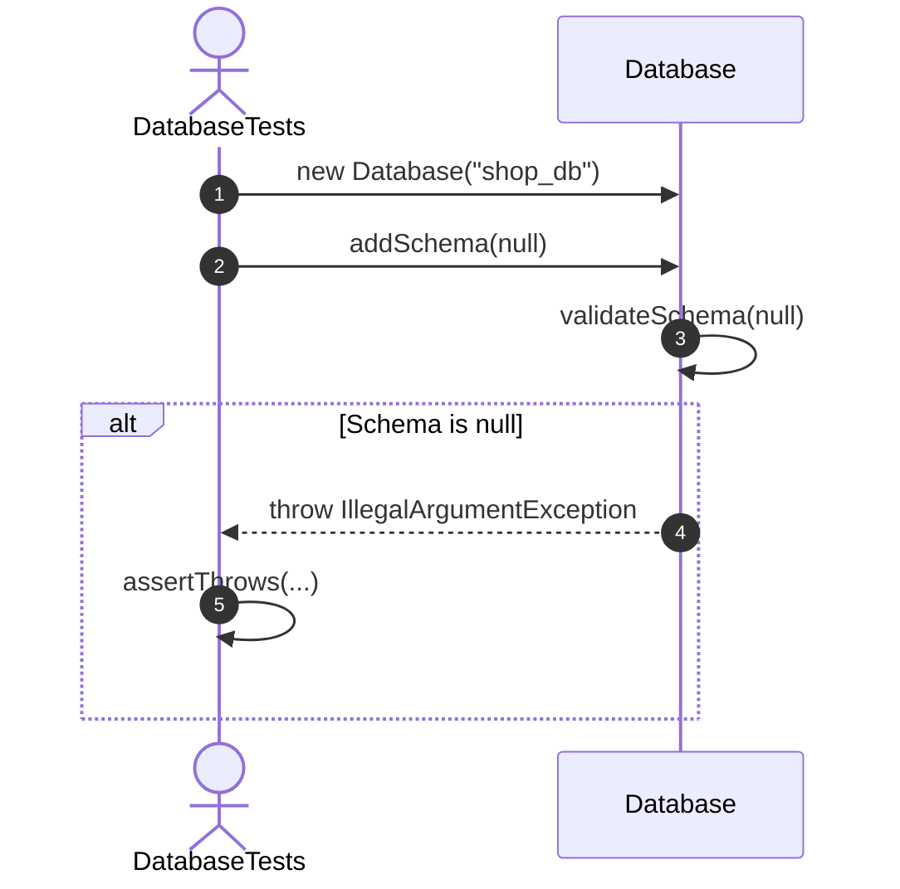
```mermaid
sequenceDiagram
    autonumber

    actor Test as DatabaseTests
    participant DB as Database

    Test->>DB: new Database("shop_db")
    Test->>DB: addSchema(null)

    DB->>DB: validateSchema(null)

    alt Schema is null
        DB-->>Test: throw IllegalArgumentException
        Test->>Test: assertThrows(...)
    end
```

---

## 15. AddSchema_ShouldRejectDuplicateSchemaName

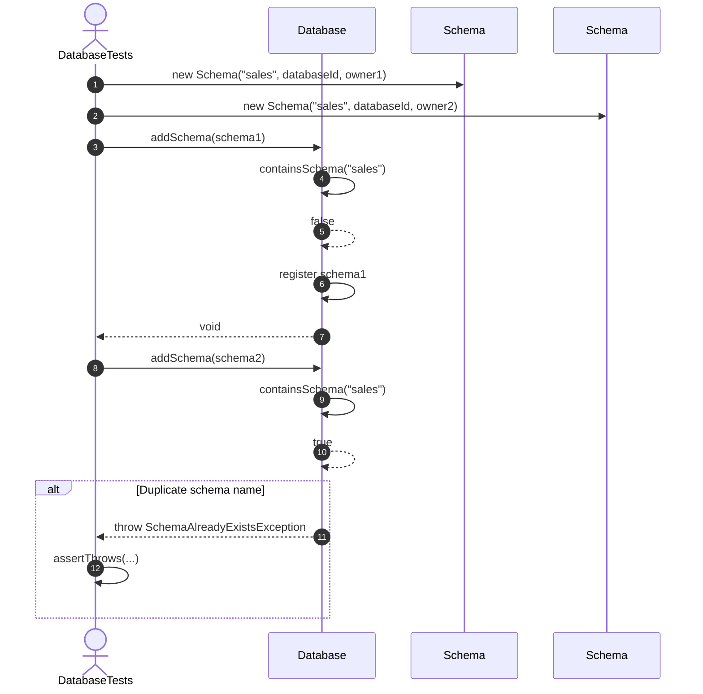
```mermaid
sequenceDiagram
    autonumber

    actor Test as DatabaseTests
    participant DB as Database
    participant S1 as Schema
    participant S2 as Schema

    Test->>S1: new Schema("sales", databaseId, owner1)
    Test->>S2: new Schema("sales", databaseId, owner2)

    Test->>DB: addSchema(schema1)
    DB->>DB: containsSchema("sales")
    DB-->>DB: false
    DB->>DB: register schema1
    DB-->>Test: void

    Test->>DB: addSchema(schema2)
    DB->>DB: containsSchema("sales")
    DB-->>DB: true

    alt Duplicate schema name
        DB-->>Test: throw SchemaAlreadyExistsException
        Test->>Test: assertThrows(...)
    end
```

---

## 16. AddSchema_ShouldRejectSchemaFromAnotherDatabase

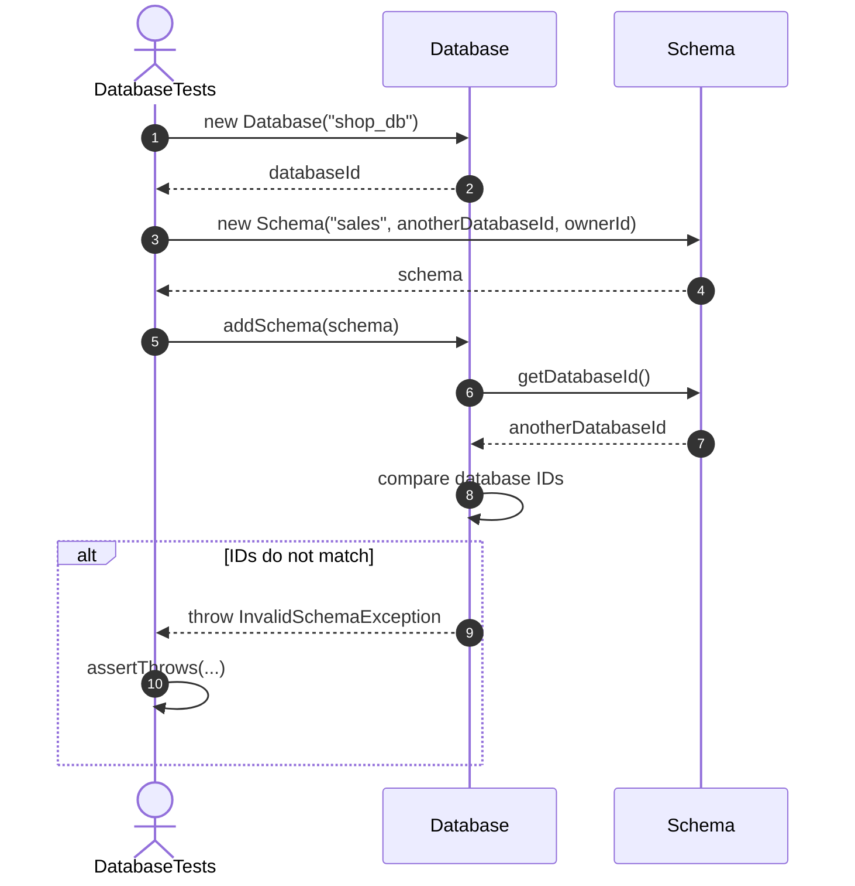
```mermaid
sequenceDiagram
    autonumber

    actor Test as DatabaseTests
    participant DB as Database
    participant S as Schema

    Test->>DB: new Database("shop_db")
    DB-->>Test: databaseId

    Test->>S: new Schema("sales", anotherDatabaseId, ownerId)
    S-->>Test: schema

    Test->>DB: addSchema(schema)

    DB->>S: getDatabaseId()
    S-->>DB: anotherDatabaseId

    DB->>DB: compare database IDs

    alt IDs do not match
        DB-->>Test: throw InvalidSchemaException
        Test->>Test: assertThrows(...)
    end
```

---

## 17. AddSchema_ShouldRejectWhenDatabaseIsReadOnly

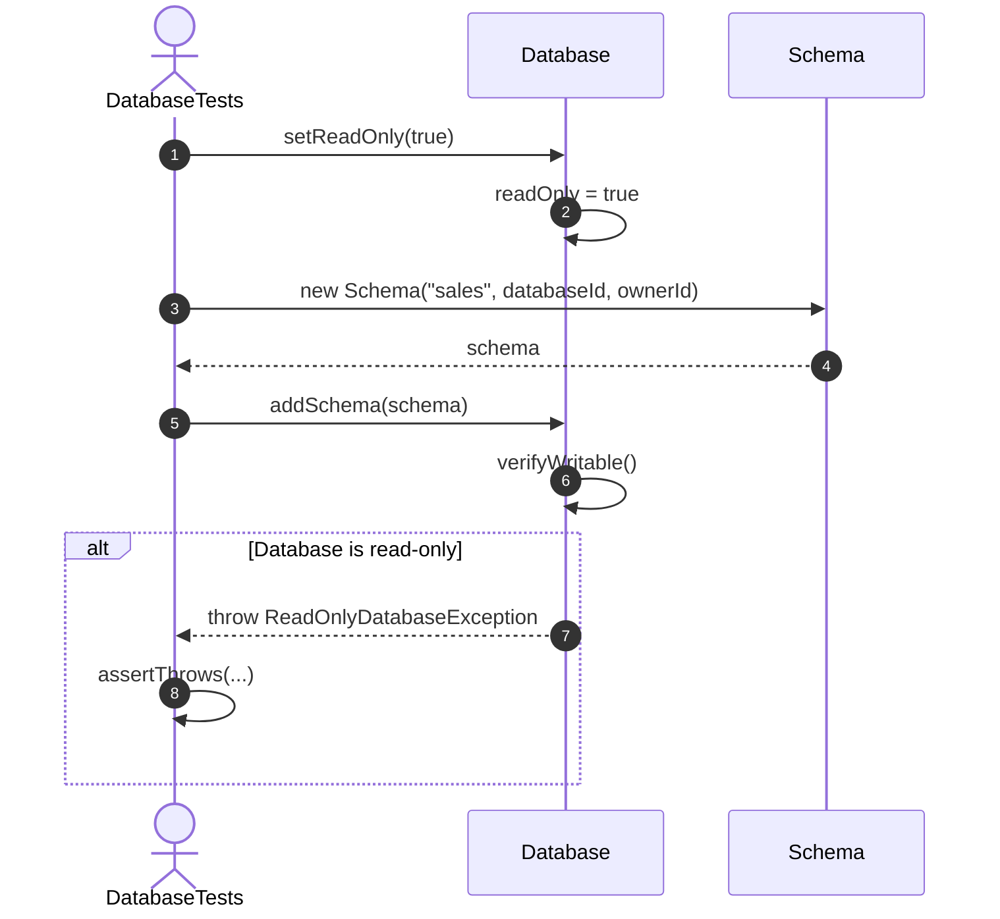
```mermaid
sequenceDiagram
    autonumber

    actor Test as DatabaseTests
    participant DB as Database
    participant S as Schema

    Test->>DB: setReadOnly(true)
    DB->>DB: readOnly = true

    Test->>S: new Schema("sales", databaseId, ownerId)
    S-->>Test: schema

    Test->>DB: addSchema(schema)
    DB->>DB: verifyWritable()

    alt Database is read-only
        DB-->>Test: throw ReadOnlyDatabaseException
        Test->>Test: assertThrows(...)
    end
```

---

## 18. GetSchema_ShouldReturnExistingSchema

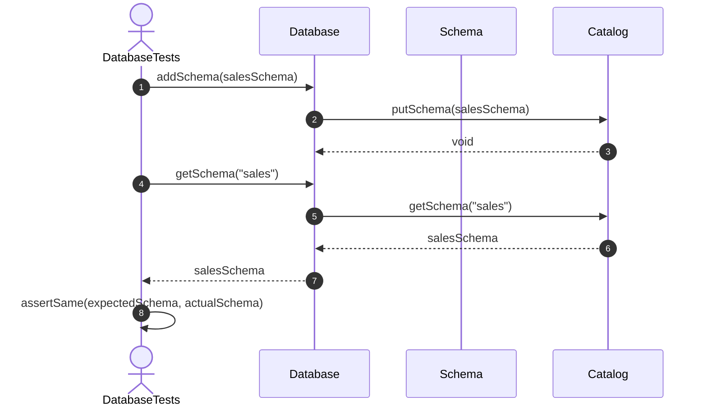
```mermaid
sequenceDiagram
    autonumber

    actor Test as DatabaseTests
    participant DB as Database
    participant S as Schema
    participant C as Catalog

    Test->>DB: addSchema(salesSchema)
    DB->>C: putSchema(salesSchema)
    C-->>DB: void

    Test->>DB: getSchema("sales")
    DB->>C: getSchema("sales")
    C-->>DB: salesSchema
    DB-->>Test: salesSchema

    Test->>Test: assertSame(expectedSchema, actualSchema)
```

---

## 19. GetSchema_ShouldThrowWhenSchemaDoesNotExist

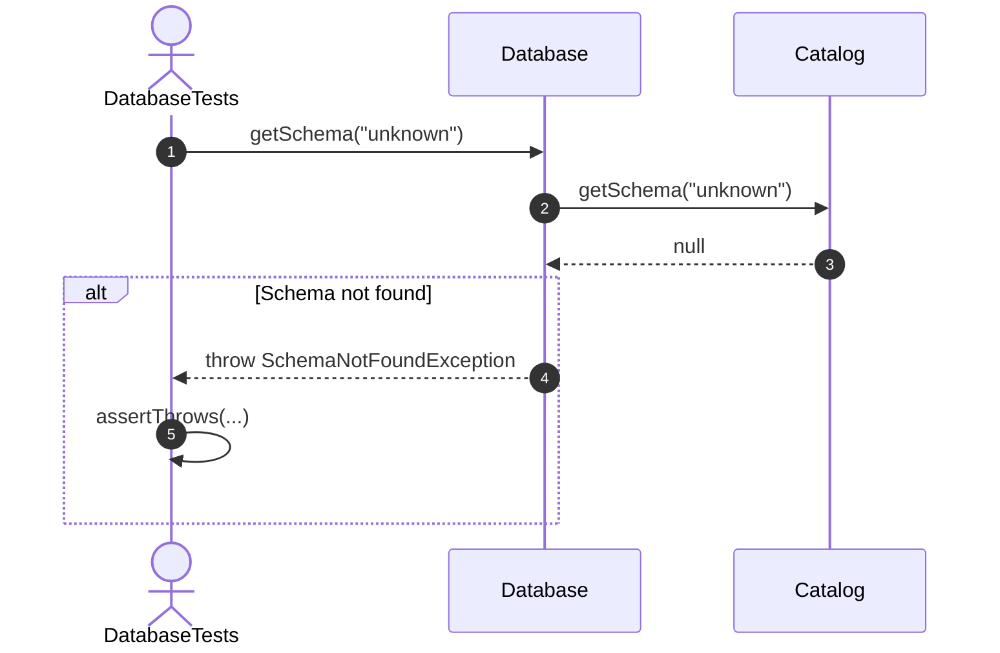
```mermaid
sequenceDiagram
    autonumber

    actor Test as DatabaseTests
    participant DB as Database
    participant C as Catalog

    Test->>DB: getSchema("unknown")

    DB->>C: getSchema("unknown")
    C-->>DB: null

    alt Schema not found
        DB-->>Test: throw SchemaNotFoundException
        Test->>Test: assertThrows(...)
    end
```

---

## 20. ContainsSchema_ShouldReturnTrueForExistingSchema

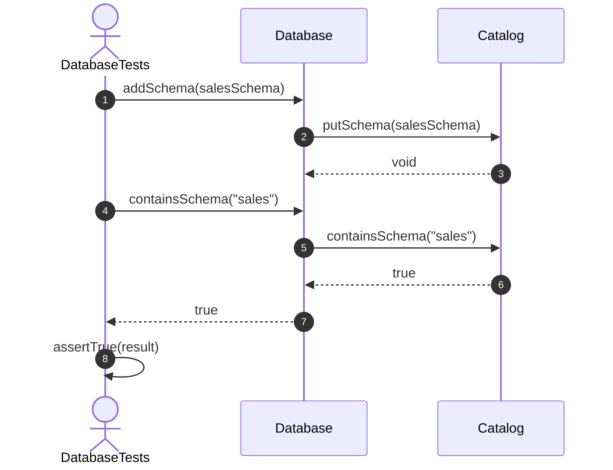
```mermaid
sequenceDiagram
    autonumber

    actor Test as DatabaseTests
    participant DB as Database
    participant C as Catalog

    Test->>DB: addSchema(salesSchema)
    DB->>C: putSchema(salesSchema)
    C-->>DB: void

    Test->>DB: containsSchema("sales")
    DB->>C: containsSchema("sales")
    C-->>DB: true
    DB-->>Test: true

    Test->>Test: assertTrue(result)
```

---

## 21. ContainsSchema_ShouldReturnFalseForMissingSchema

```mermaid
sequenceDiagram
    autonumber

    actor Test as DatabaseTests
    participant DB as Database
    participant C as Catalog

    Test->>DB: containsSchema("unknown")
    DB->>C: containsSchema("unknown")
    C-->>DB: false
    DB-->>Test: false

    Test->>Test: assertFalse(result)
```

---

## 22. RemoveSchema_ShouldRemoveExistingSchema

```mermaid
sequenceDiagram
    autonumber

    actor Test as DatabaseTests
    participant DB as Database
    participant C as Catalog
    participant SC as SchemaCollection

    Test->>DB: addSchema(salesSchema)
    DB->>C: putSchema(salesSchema)
    DB->>SC: add(salesSchema)

    Test->>DB: removeSchema("sales")

    DB->>DB: containsSchema("sales")
    DB-->>DB: true

    DB->>SC: remove(salesSchema)
    SC-->>DB: true

    DB->>C: removeSchema("sales")
    C-->>DB: salesSchema

    DB-->>Test: void

    Test->>DB: containsSchema("sales")
    DB-->>Test: false

    Test->>Test: assertFalse(result)
```

---

## 23. RemoveSchema_ShouldDecreaseSchemaCount

```mermaid
sequenceDiagram
    autonumber

    actor Test as DatabaseTests
    participant DB as Database
    participant SC as SchemaCollection

    Test->>DB: addSchema(salesSchema)
    DB->>SC: add(salesSchema)

    Test->>DB: getSchemas()
    DB-->>Test: one schema

    Test->>DB: removeSchema("sales")
    DB->>SC: remove(salesSchema)
    SC-->>DB: true

    Test->>DB: getSchemas()
    DB-->>Test: empty collection

    Test->>Test: assertEquals(0, schemas.size())
```

---

## 24. RemoveSchema_ShouldThrowWhenSchemaNotFound

```mermaid
sequenceDiagram
    autonumber

    actor Test as DatabaseTests
    participant DB as Database

    Test->>DB: removeSchema("unknown")

    DB->>DB: containsSchema("unknown")
    DB-->>DB: false

    alt Schema does not exist
        DB-->>Test: throw SchemaNotFoundException
        Test->>Test: assertThrows(...)
    end
```

---

## 25. RemoveSchema_ShouldRejectWhenSchemaContainsTables

This behavior prevents accidental deletion of a non-empty schema.

```mermaid
sequenceDiagram
    autonumber

    actor Test as DatabaseTests
    participant DB as Database
    participant S as Schema
    participant T as TableMetadata

    Test->>DB: addSchema(salesSchema)

    Test->>S: getTables()
    S-->>Test: tables

    Test->>T: new TableMetadata("orders", schemaId)
    T-->>Test: ordersTable

    Test->>S: addTable(ordersTable)
    S-->>Test: void

    Test->>DB: removeSchema("sales")
    DB->>S: getTables()
    S-->>DB: collection containing ordersTable

    alt Schema is not empty
        DB-->>Test: throw SchemaNotEmptyException
        Test->>Test: assertThrows(...)
    end
```

---

## 26. SetReadOnly_ShouldChangeDatabaseMode

```mermaid
sequenceDiagram
    autonumber

    actor Test as DatabaseTests
    participant DB as Database

    Test->>DB: new Database("shop_db")

    Test->>DB: setReadOnly(true)
    DB->>DB: readOnly = true
    DB-->>Test: void

    Test->>DB: isReadOnly()
    DB-->>Test: true

    Test->>Test: assertTrue(result)
```

---

## 27. SetReadOnlyFalse_ShouldAllowMetadataModification

```mermaid
sequenceDiagram
    autonumber

    actor Test as DatabaseTests
    participant DB as Database
    participant S as Schema

    Test->>DB: setReadOnly(true)
    DB->>DB: readOnly = true

    Test->>DB: setReadOnly(false)
    DB->>DB: readOnly = false

    Test->>DB: addSchema(schema)
    DB->>DB: verifyWritable()
    DB-->>DB: writable

    DB->>DB: register schema
    DB-->>Test: void

    Test->>DB: containsSchema("sales")
    DB-->>Test: true
```

---

## 28. Rename_ShouldChangeDatabaseName

```mermaid
sequenceDiagram
    autonumber

    actor Test as DatabaseTests
    participant DB as Database

    Test->>DB: new Database("old_name")

    Test->>DB: rename("new_name")
    DB->>DB: validateName("new_name")
    DB->>DB: name = "new_name"
    DB-->>Test: void

    Test->>DB: getName()
    DB-->>Test: "new_name"

    Test->>Test: assertEquals("new_name", result)
```

---

## 29. Rename_ShouldRejectInvalidName

```mermaid
sequenceDiagram
    autonumber

    actor Test as DatabaseTests
    participant DB as Database

    Test->>DB: new Database("shop_db")

    Test->>DB: rename("")
    DB->>DB: validateName("")

    alt New name is blank
        DB-->>Test: throw IllegalArgumentException
        Test->>Test: assertThrows(...)
    end

    Test->>DB: getName()
    DB-->>Test: "shop_db"

    Test->>Test: assertEquals("shop_db", currentName)
```

---

## 30. GetSchemas_ShouldReturnUnmodifiableCollection

This prevents external code from modifying the internal database state.

```mermaid
sequenceDiagram
    autonumber

    actor Test as DatabaseTests
    participant DB as Database
    participant SC as SchemaCollection
    participant Collections as Collections

    Test->>DB: addSchema(salesSchema)
    DB->>SC: add(salesSchema)

    Test->>DB: getSchemas()
    DB->>Collections: unmodifiableList(schemas)
    Collections-->>DB: read-only schemas
    DB-->>Test: schemas

    Test->>SC: add(anotherSchema)

    alt Collection is unmodifiable
        SC-->>Test: throw UnsupportedOperationException
        Test->>Test: assertThrows(...)
    end
```

---

## 31. Catalog_ShouldRemainConsistentAfterAddingSchema

```mermaid
sequenceDiagram
    autonumber

    actor Test as DatabaseTests
    participant DB as Database
    participant C as Catalog
    participant S as Schema

    Test->>DB: addSchema(salesSchema)

    DB->>S: getName()
    S-->>DB: "sales"

    DB->>C: putSchema(salesSchema)
    C-->>DB: void

    Test->>DB: getSchemas()
    DB-->>Test: schemas containing salesSchema

    Test->>C: getSchema("sales")
    C-->>Test: salesSchema

    Test->>Test: assertTrue(databaseContainsSchema)
    Test->>Test: assertSame(salesSchema, catalogSchema)
```

---

## 32. Catalog_ShouldRemainConsistentAfterRemovingSchema

```mermaid
sequenceDiagram
    autonumber

    actor Test as DatabaseTests
    participant DB as Database
    participant C as Catalog

    Test->>DB: addSchema(salesSchema)
    DB->>C: putSchema(salesSchema)

    Test->>DB: removeSchema("sales")
    DB->>C: removeSchema("sales")
    C-->>DB: salesSchema

    Test->>DB: containsSchema("sales")
    DB-->>Test: false

    Test->>C: getSchema("sales")
    C-->>Test: null

    Test->>Test: assertFalse(databaseResult)
    Test->>Test: assertNull(catalogResult)
```

---

## 33. AddMultipleSchemas_ShouldPreserveInsertion

```mermaid
sequenceDiagram
    autonumber

    actor Test as DatabaseTests
    participant DB as Database
    participant C as Catalog

    Test->>DB: addSchema(publicSchema)
    DB->>C: putSchema(publicSchema)
    C-->>DB: void

    Test->>DB: addSchema(salesSchema)
    DB->>C: putSchema(salesSchema)
    C-->>DB: void

    Test->>DB: addSchema(reportSchema)
    DB->>C: putSchema(reportSchema)
    C-->>DB: void

    Test->>DB: getSchemas()
    DB-->>Test: [public, sales, report]

    Test->>Test: assertEquals(3, schemas.size())
    Test->>Test: assertTrue(all schemas exist)
```

---

## 34. SchemaNames_ShouldBeCaseInsensitive

This test is optional, depending on your naming rule.

```mermaid
sequenceDiagram
    autonumber

    actor Test as DatabaseTests
    participant DB as Database

    Test->>DB: addSchema(schema named "Sales")
    DB->>DB: normalizeName("Sales")
    DB-->>DB: "sales"
    DB->>DB: register schema
    DB-->>Test: void

    Test->>DB: containsSchema("SALES")
    DB->>DB: normalizeName("SALES")
    DB-->>DB: "sales"
    DB-->>Test: true

    Test->>Test: assertTrue(result)
```

---

## 35. ConcurrentSchemaCreation_ShouldAllowOnlyOneSchema

This is one of the few useful concurrency tests that can still be implemented without a real storage engine.

```mermaid
sequenceDiagram
    autonumber

    actor Test as DatabaseTests
    participant T1 as Thread 1
    participant T2 as Thread 2
    participant DB as Database
    participant Schemas as ConcurrentMap

    par Thread 1
        T1->>DB: addSchema(schema named "sales")
        DB->>Schemas: putIfAbsent("sales", schema1)
        Schemas-->>DB: null
        DB-->>T1: success
    and Thread 2
        T2->>DB: addSchema(schema named "sales")
        DB->>Schemas: putIfAbsent("sales", schema2)
        Schemas-->>DB: existing schema
        DB-->>T2: SchemaAlreadyExistsException
    end

    Test->>DB: getSchemas()
    DB-->>Test: one sales schema

    Test->>Test: assertEquals(1, schemas.size())
```

---

## 36. ConcurrentSchemaReads_ShouldReturnConsistentResult

```mermaid
sequenceDiagram
    autonumber

    actor Test as DatabaseTests
    participant T1 as Reader Thread 1
    participant T2 as Reader Thread 2
    participant DB as Database
    participant C as Catalog

    Test->>DB: addSchema(salesSchema)

    par First reader
        T1->>DB: getSchema("sales")
        DB->>C: getSchema("sales")
        C-->>DB: salesSchema
        DB-->>T1: salesSchema
    and Second reader
        T2->>DB: getSchema("sales")
        DB->>C: getSchema("sales")
        C-->>DB: salesSchema
        DB-->>T2: salesSchema
    end

    Test->>Test: assertSame(result1, result2)
```

---

## 37. ConcurrentOpen_ShouldMaintainValidState

```mermaid
sequenceDiagram
    autonumber

    actor Test as DatabaseTests
    participant T1 as Thread 1
    participant T2 as Thread 2
    participant DB as Database

    par First open request
        T1->>DB: open()
        DB->>DB: compareAndSet(CLOSED, OPEN)
        DB-->>T1: success
    and Second open request
        T2->>DB: open()
        DB->>DB: compareAndSet(CLOSED, OPEN)
        DB-->>T2: already OPEN
    end

    Test->>DB: getState()
    DB-->>Test: OPEN

    Test->>Test: assertEquals(OPEN, state)
```

---

## 38. DatabaseSchemaIntegration_ShouldMaintainRelationship

```mermaid
sequenceDiagram
    autonumber

    actor Test as DatabaseIntegrationTests
    participant DB as Database
    participant S as Schema
    participant C as Catalog

    Test->>DB: new Database("shop_db")
    DB-->>Test: database with databaseId

    Test->>DB: getId()
    DB-->>Test: databaseId

    Test->>S: new Schema("sales", databaseId, ownerId)
    S-->>Test: schema

    Test->>DB: addSchema(schema)
    DB->>S: getDatabaseId()
    S-->>DB: databaseId
    DB->>C: putSchema(schema)
    C-->>DB: void

    Test->>DB: getSchema("sales")
    DB-->>Test: schema

    Test->>S: getDatabaseId()
    S-->>Test: databaseId

    Test->>Test: assertEquals(DB.id, Schema.databaseId)
```

---

## 39. DatabaseSchemaTableIntegration_ShouldBuildMetadataHierarchy

This test covers only metadata objects. It does not insert rows or write pages.

```mermaid
sequenceDiagram
    autonumber

    actor Test as DatabaseIntegrationTests
    participant DB as Database
    participant S as Schema
    participant T as TableMetadata
    participant C as ColumnMetadata

    Test->>DB: new Database("shop_db")
    Test->>S: new Schema("sales", databaseId, ownerId)

    Test->>DB: addSchema(schema)
    DB-->>Test: void

    Test->>T: new TableMetadata("orders", schemaId)
    T-->>Test: table

    Test->>C: new ColumnMetadata("id", INTEGER)
    C-->>Test: idColumn

    Test->>T: addColumn(idColumn)
    T-->>Test: void

    Test->>S: addTable(table)
    S-->>Test: void

    Test->>S: getTables()
    S-->>Test: tables containing orders

    Test->>T: getColumns()
    T-->>Test: columns containing id

    Test->>Test: assert hierarchy is correct
```

---

## 40. DatabaseSchemaTableRowIntegration_ShouldStoreRowsInMemory

Use this only after creating a simple in-memory `Table` and `Row` implementation.

```mermaid
sequenceDiagram
    autonumber

    actor Test as DatabaseIntegrationTests
    participant DB as Database
    participant S as Schema
    participant T as Table
    participant R as Row

    Test->>DB: addSchema(salesSchema)
    DB-->>Test: void

    Test->>S: addTable(ordersTable)
    S-->>Test: void

    Test->>R: new Row()
    R-->>Test: row

    Test->>R: setValue("id", 1)
    R->>R: values.put("id", 1)

    Test->>R: setValue("customer", "An")
    R->>R: values.put("customer", "An")

    Test->>T: insertRow(row)
    T->>T: validateRow(row)
    T->>T: rows.add(row)
    T-->>Test: void

    Test->>T: getRows()
    T-->>Test: collection containing row

    Test->>Test: assertEquals(1, rows.size())
```

---

# Recommended First Test Order

Implement the tests in this order:

1. `Constructor_ShouldCreateDatabase`
2. `Constructor_ShouldGenerateDatabaseId`
3. `Constructor_ShouldInitializeCatalog`
4. `Constructor_ShouldInitializeSchemaCollection`
5. `Constructor_ShouldRejectNullName`
6. `Constructor_ShouldRejectBlankName`
7. `Open_ShouldChangeDatabaseStateToOpen`
8. `Close_ShouldChangeDatabaseStateToClosed`
9. `AddSchema_ShouldRegisterSchema`
10. `AddSchema_ShouldRejectDuplicateSchemaName`
11. `GetSchema_ShouldReturnExistingSchema`
12. `RemoveSchema_ShouldRemoveExistingSchema`
13. `RemoveSchema_ShouldThrowWhenSchemaNotFound`
14. `SetReadOnly_ShouldChangeDatabaseMode`
15. `AddSchema_ShouldRejectWhenDatabaseIsReadOnly`
16. `Catalog_ShouldRemainConsistentAfterAddingSchema`
17. `Catalog_ShouldRemainConsistentAfterRemovingSchema`
18. `DatabaseSchemaIntegration_ShouldMaintainRelationship`
19. `DatabaseSchemaTableIntegration_ShouldBuildMetadataHierarchy`
20. Concurrency tests last

# Tests to Postpone

Do not implement these in the first version:

* `Open_ShouldLoadDatabaseSuccessfully`
* `Close_ShouldFlushResourcesSuccessfully`
* `Open_ShouldThrowWhenStorageUnavailable`
* `Close_ShouldThrowWhenFlushFails`
* `UpdateStatistics_ShouldRefreshDatabaseStatistics`
* `CalculateDatabaseSize_ShouldReturnCorrectSize`
* `ChangeRecoveryModel_ShouldUpdateRecoveryConfiguration`
* `StorageEngine_ShouldPersistDatabaseData`
* `TransactionManager_ShouldHandleTransactions`
* `BufferPool_ShouldManageDatabasePages`
* `RecoveryManager_ShouldRecoverDatabase`
* `executeSQL()` tests

These tests require difficult subsystems such as disk I/O, page management, query parsing, transaction management, recovery, or real persistence.

# Simplified Database Testing Roadmap

```mermaid
graph LR

DB[Database Testing]

DB --> Constructor
DB --> Lifecycle
DB --> SchemaManagement
DB --> Metadata
DB --> Validation
DB --> Exception
DB --> SimpleConcurrency
DB --> Integration

Constructor --> CreateDatabase
Constructor --> GenerateDatabaseId
Constructor --> InitializeCatalog
Constructor --> InitializeSchemaCollection
Constructor --> InitializeDefaultState

Lifecycle --> OpenDatabase
Lifecycle --> CloseDatabase
Lifecycle --> OpenTwice
Lifecycle --> CloseTwice

SchemaManagement --> AddSchema
SchemaManagement --> GetSchema
SchemaManagement --> ContainsSchema
SchemaManagement --> RemoveSchema
SchemaManagement --> ListSchemas

Metadata --> GetDatabaseName
Metadata --> RenameDatabase
Metadata --> GetDatabaseId
Metadata --> SetReadOnly
Metadata --> CatalogConsistency

Validation --> ValidateDatabaseName
Validation --> ValidateSchema
Validation --> ValidateSchemaDatabaseId
Validation --> ValidateReadOnlyMode

Exception --> NullDatabaseName
Exception --> BlankDatabaseName
Exception --> DuplicateSchema
Exception --> SchemaNotFound
Exception --> SchemaNotEmpty
Exception --> ReadOnlyModification

SimpleConcurrency --> ConcurrentOpen
SimpleConcurrency --> ConcurrentSchemaRead
SimpleConcurrency --> ConcurrentSchemaCreation

Integration --> DatabaseAndCatalog
Integration --> DatabaseAndSchema
Integration --> DatabaseSchemaAndTable
Integration --> DatabaseSchemaTableAndRow
```
