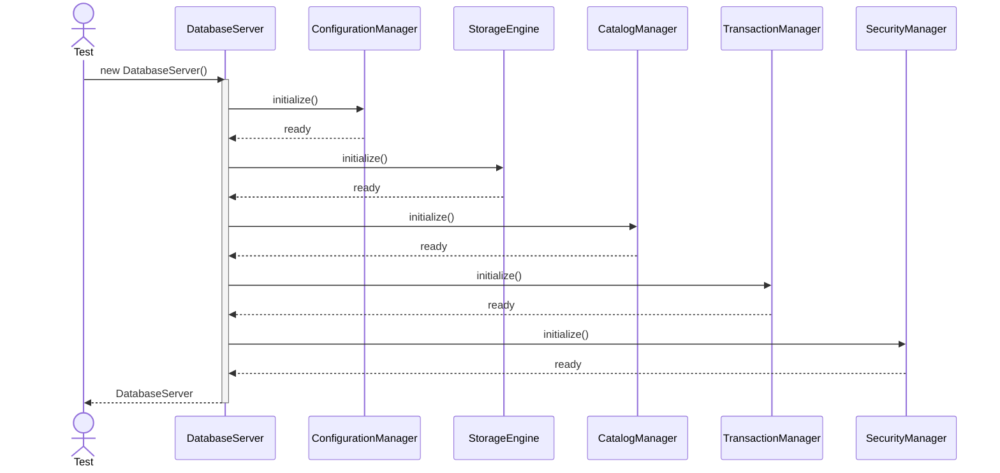
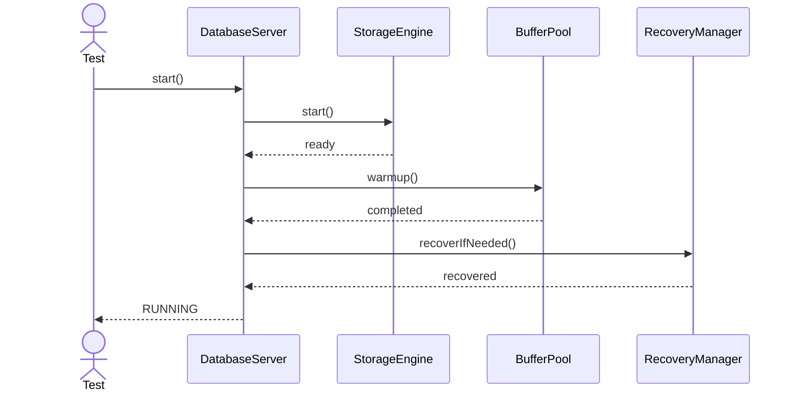
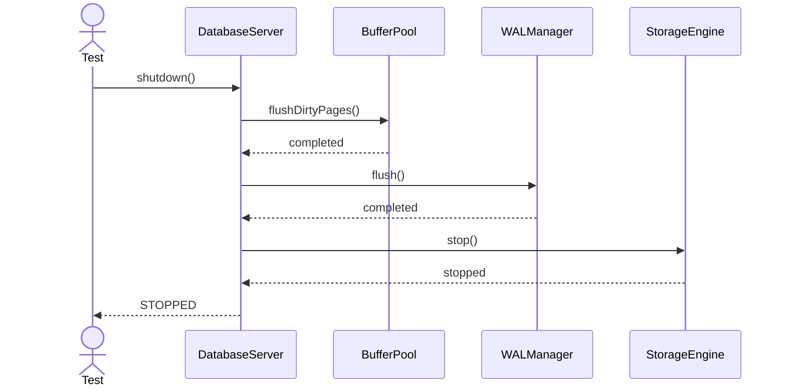
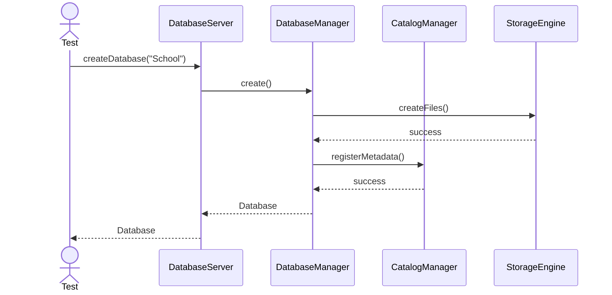
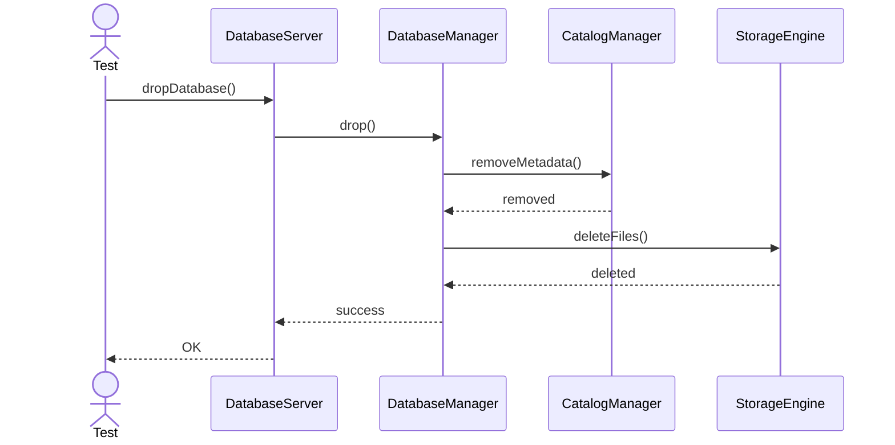
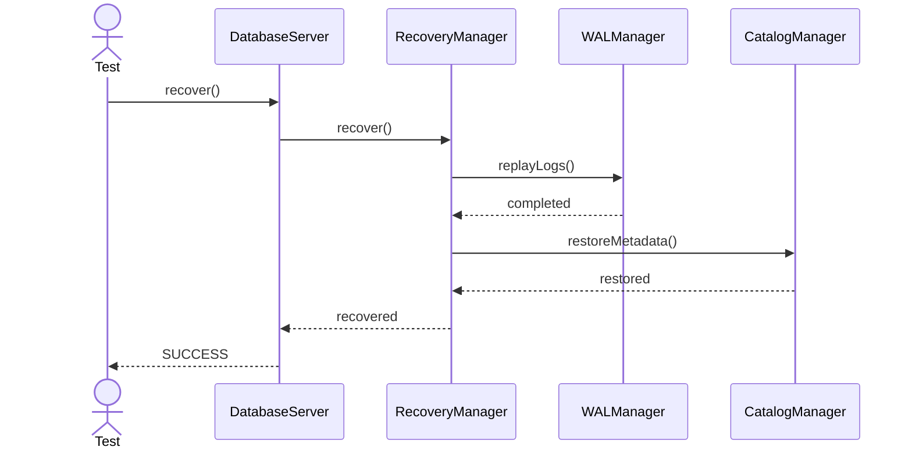
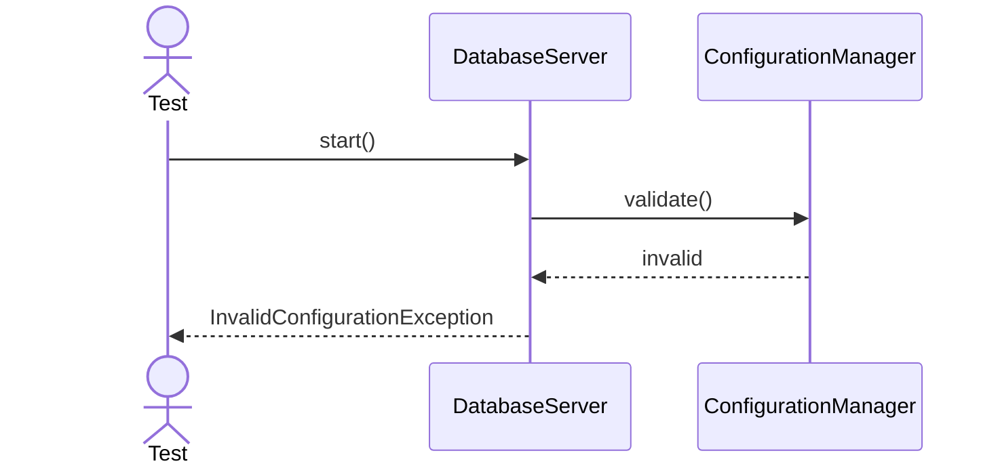
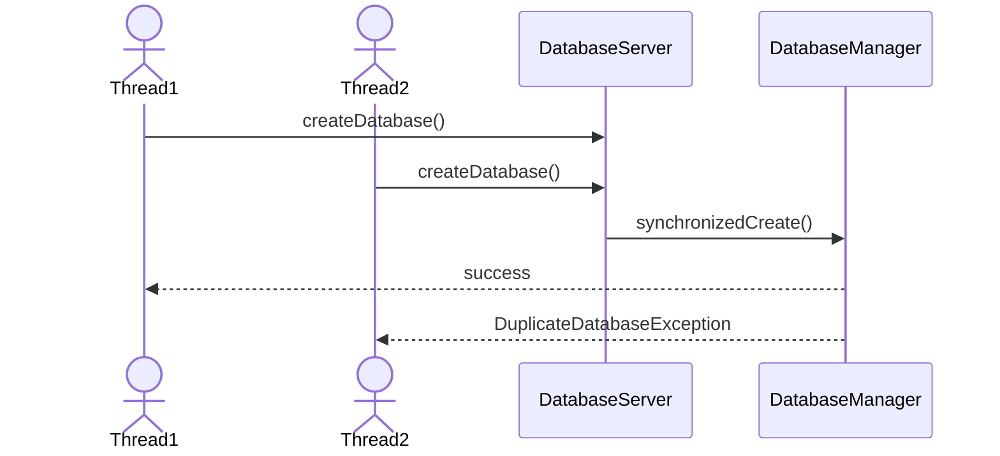
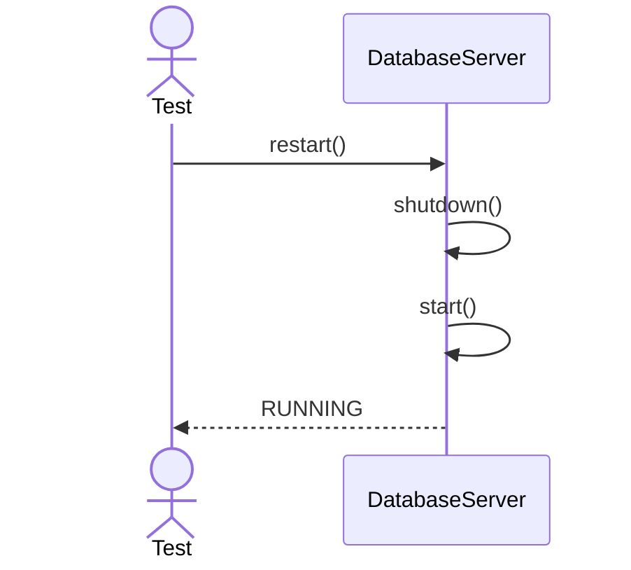
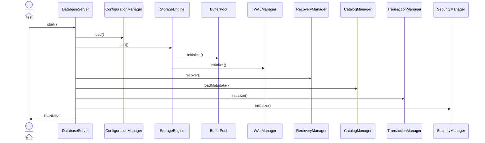

# DatabaseServer - Main Unit Test Sequences

---

## 1. Constructor Initialization

---

## 2. Start Server

---

## 3. Shutdown Server

---

## 4. Create Database

---

## 5. Drop Database

---

## 6. Crash Recovery

---

## 7. Invalid Configuration

---

## 8. Concurrent Database Creation

---

## 9. Restart Server

---

## 10. Full Startup Integration

