---

## 1. Constructor_ShouldCreateDatabase

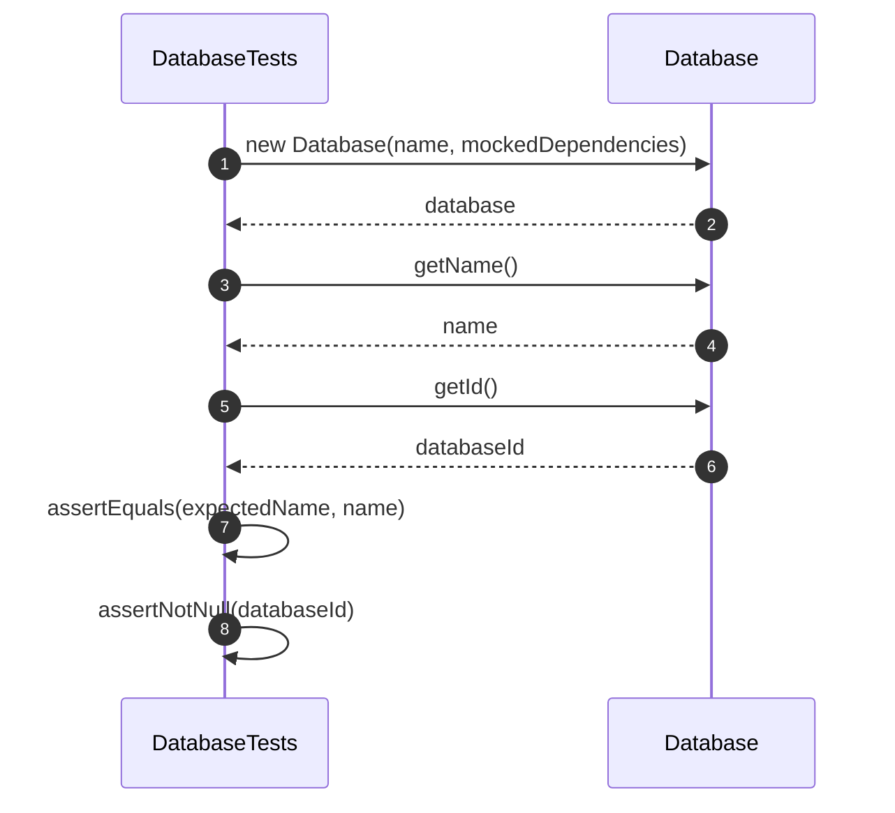
```mermaid
sequenceDiagram
    autonumber

    participant Test as DatabaseTests
    participant Database

    Test->>Database: new Database(name, mockedDependencies)
    Database-->>Test: database

    Test->>Database: getName()
    Database-->>Test: name

    Test->>Database: getId()
    Database-->>Test: databaseId

    Test->>Test: assertEquals(expectedName, name)
    Test->>Test: assertNotNull(databaseId)
```

---

## 2. Constructor_ShouldInitializeDependencies

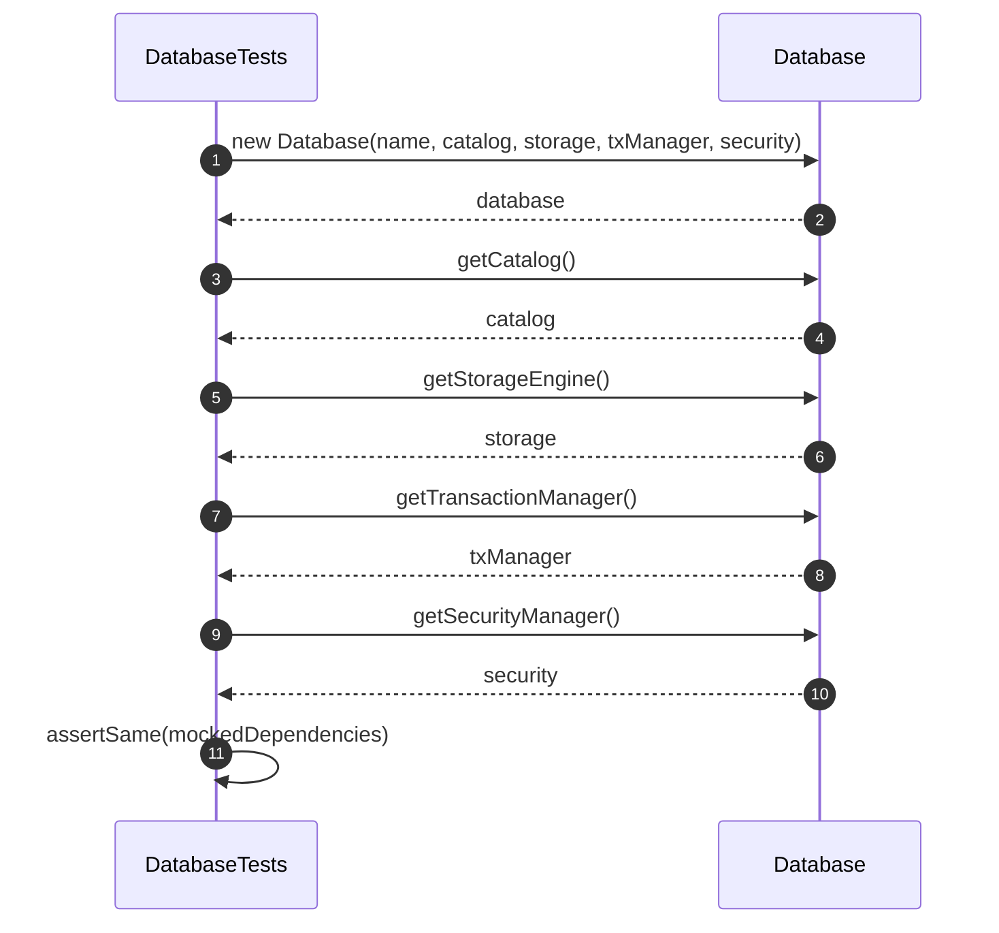
```mermaid
sequenceDiagram
    autonumber

    participant Test as DatabaseTests
    participant Database

    Test->>Database: new Database(name, catalog, storage, txManager, security)
    Database-->>Test: database

    Test->>Database: getCatalog()
    Database-->>Test: catalog

    Test->>Database: getStorageEngine()
    Database-->>Test: storage

    Test->>Database: getTransactionManager()
    Database-->>Test: txManager

    Test->>Database: getSecurityManager()
    Database-->>Test: security

    Test->>Test: assertSame(mockedDependencies)
```

---

## 3. Constructor_ShouldInitializeSchemaCollection

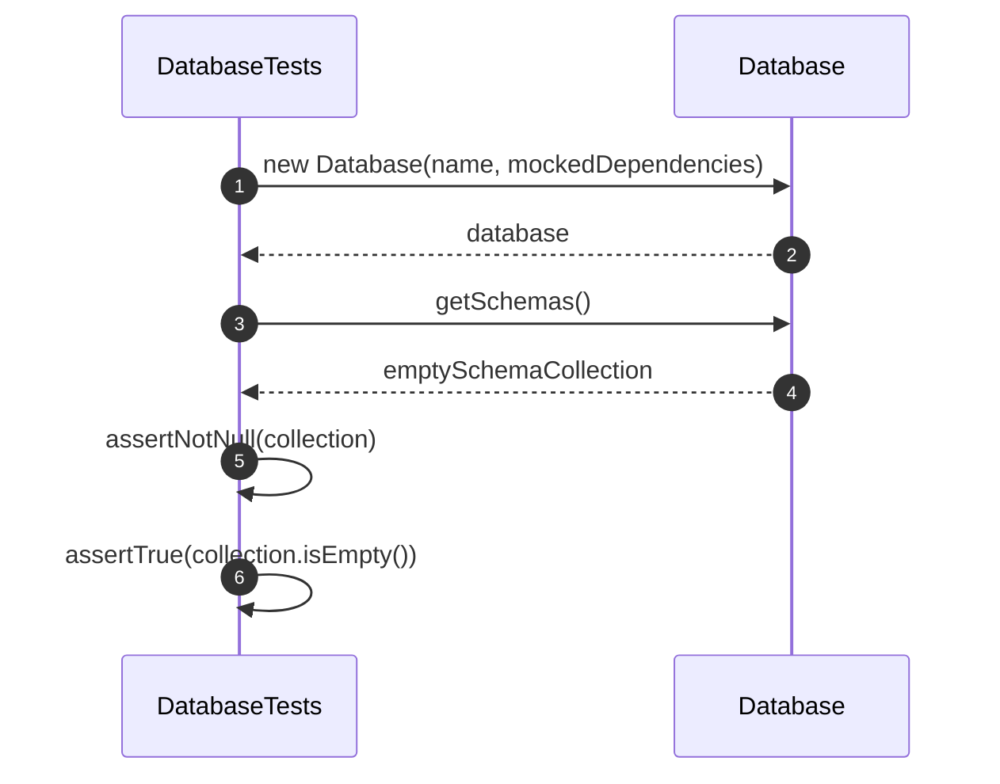
```mermaid
sequenceDiagram
    autonumber

    participant Test as DatabaseTests
    participant Database

    Test->>Database: new Database(name, mockedDependencies)
    Database-->>Test: database

    Test->>Database: getSchemas()
    Database-->>Test: emptySchemaCollection

    Test->>Test: assertNotNull(collection)
    Test->>Test: assertTrue(collection.isEmpty())
```

---

## 4. Open_ShouldLoadDatabaseSuccessfully

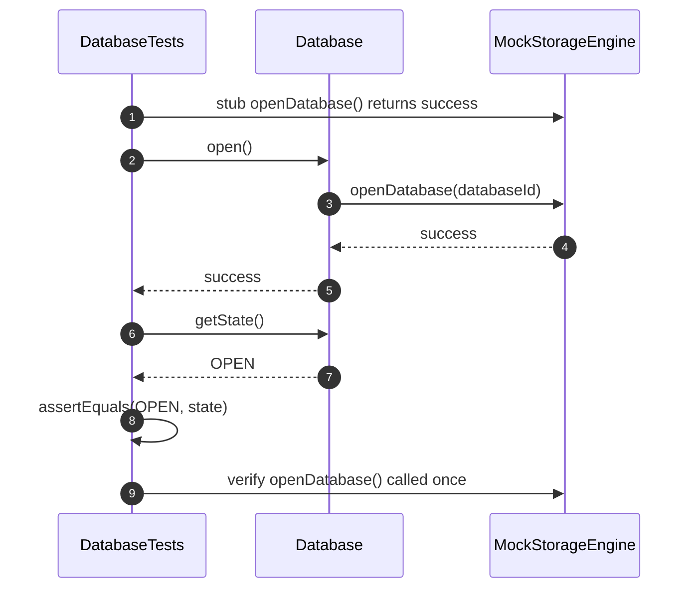
```mermaid
sequenceDiagram
    autonumber

    participant Test as DatabaseTests
    participant Database
    participant Storage as MockStorageEngine

    Test->>Storage: stub openDatabase() returns success
    Test->>Database: open()

    Database->>Storage: openDatabase(databaseId)
    Storage-->>Database: success
    Database-->>Test: success

    Test->>Database: getState()
    Database-->>Test: OPEN

    Test->>Test: assertEquals(OPEN, state)
    Test->>Storage: verify openDatabase() called once
```

---

## 5. Close_ShouldFlushResourcesSuccessfully

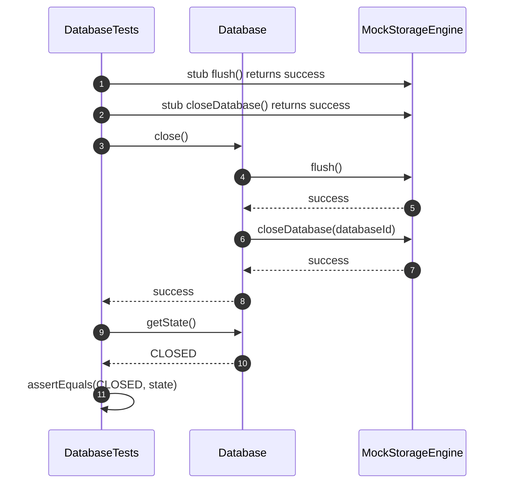
```mermaid
sequenceDiagram
    autonumber

    participant Test as DatabaseTests
    participant Database
    participant Storage as MockStorageEngine

    Test->>Storage: stub flush() returns success
    Test->>Storage: stub closeDatabase() returns success
    Test->>Database: close()

    Database->>Storage: flush()
    Storage-->>Database: success

    Database->>Storage: closeDatabase(databaseId)
    Storage-->>Database: success

    Database-->>Test: success

    Test->>Database: getState()
    Database-->>Test: CLOSED

    Test->>Test: assertEquals(CLOSED, state)
```

---

## 6. SetReadOnly_ShouldChangeDatabaseMode

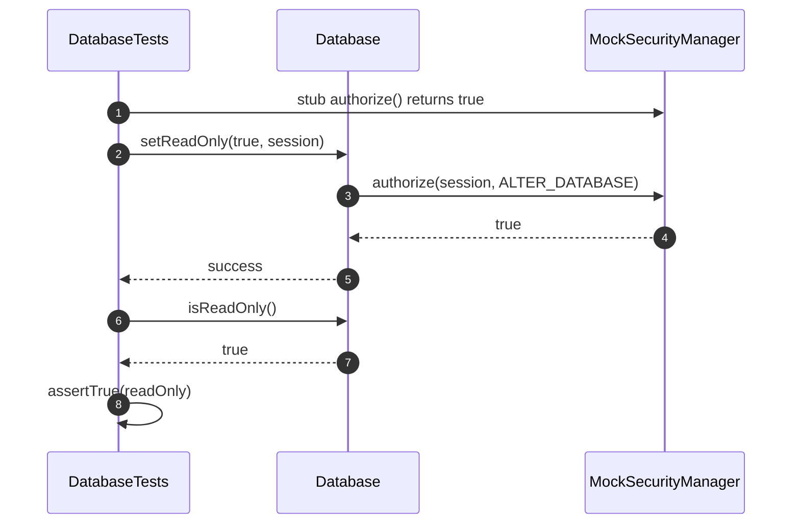
```mermaid
sequenceDiagram
    autonumber

    participant Test as DatabaseTests
    participant Database
    participant Security as MockSecurityManager

    Test->>Security: stub authorize() returns true
    Test->>Database: setReadOnly(true, session)

    Database->>Security: authorize(session, ALTER_DATABASE)
    Security-->>Database: true

    Database-->>Test: success

    Test->>Database: isReadOnly()
    Database-->>Test: true

    Test->>Test: assertTrue(readOnly)
```

---

## 7. SetReadOnly_ShouldRejectUnauthorizedUser

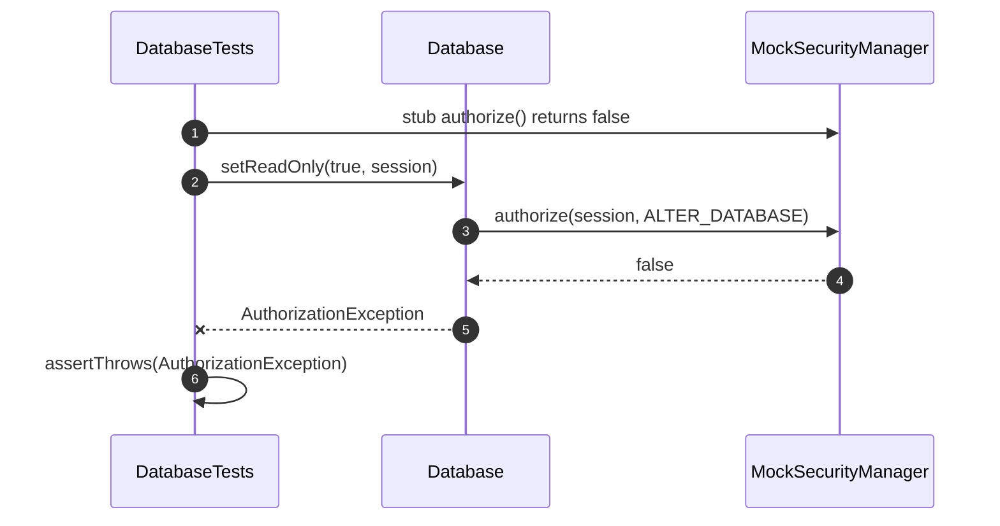
```mermaid
sequenceDiagram
    autonumber

    participant Test as DatabaseTests
    participant Database
    participant Security as MockSecurityManager

    Test->>Security: stub authorize() returns false
    Test->>Database: setReadOnly(true, session)

    Database->>Security: authorize(session, ALTER_DATABASE)
    Security-->>Database: false

    Database--xTest: AuthorizationException

    Test->>Test: assertThrows(AuthorizationException)
```

---

## 8. AddSchema_ShouldRegisterSchema

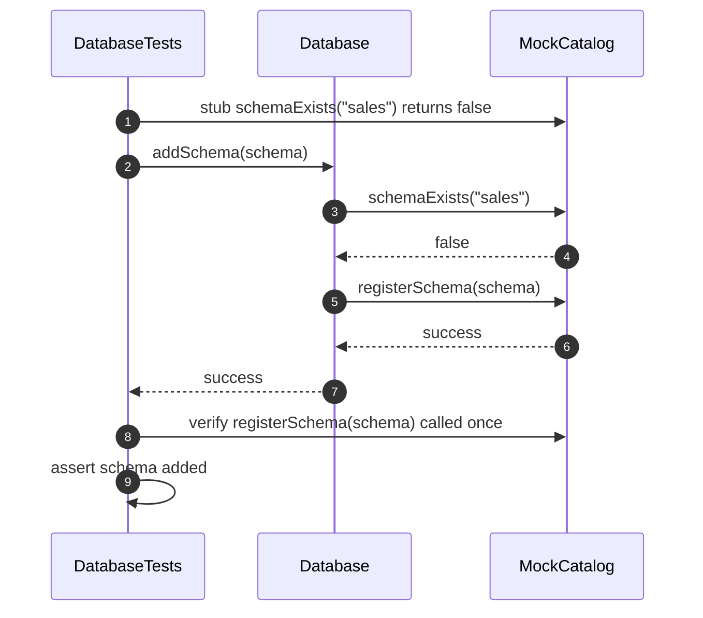
```mermaid
sequenceDiagram
    autonumber

    participant Test as DatabaseTests
    participant Database
    participant Catalog as MockCatalog

    Test->>Catalog: stub schemaExists("sales") returns false
    Test->>Database: addSchema(schema)

    Database->>Catalog: schemaExists("sales")
    Catalog-->>Database: false

    Database->>Catalog: registerSchema(schema)
    Catalog-->>Database: success

    Database-->>Test: success

    Test->>Catalog: verify registerSchema(schema) called once
    Test->>Test: assert schema added
```

---

## 9. AddSchema_ShouldRejectDuplicateSchema

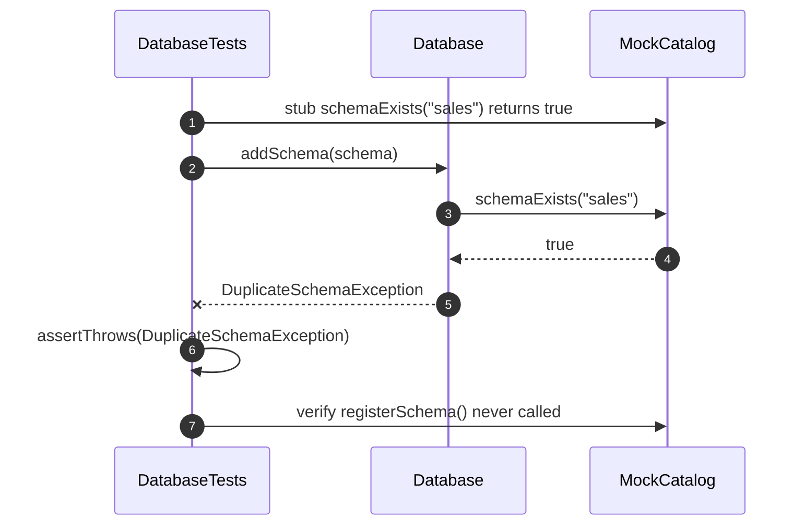
```mermaid
sequenceDiagram
    autonumber

    participant Test as DatabaseTests
    participant Database
    participant Catalog as MockCatalog

    Test->>Catalog: stub schemaExists("sales") returns true
    Test->>Database: addSchema(schema)

    Database->>Catalog: schemaExists("sales")
    Catalog-->>Database: true

    Database--xTest: DuplicateSchemaException

    Test->>Test: assertThrows(DuplicateSchemaException)
    Test->>Catalog: verify registerSchema() never called
```

---

## 10. RemoveSchema_ShouldRemoveSchemaMetadata

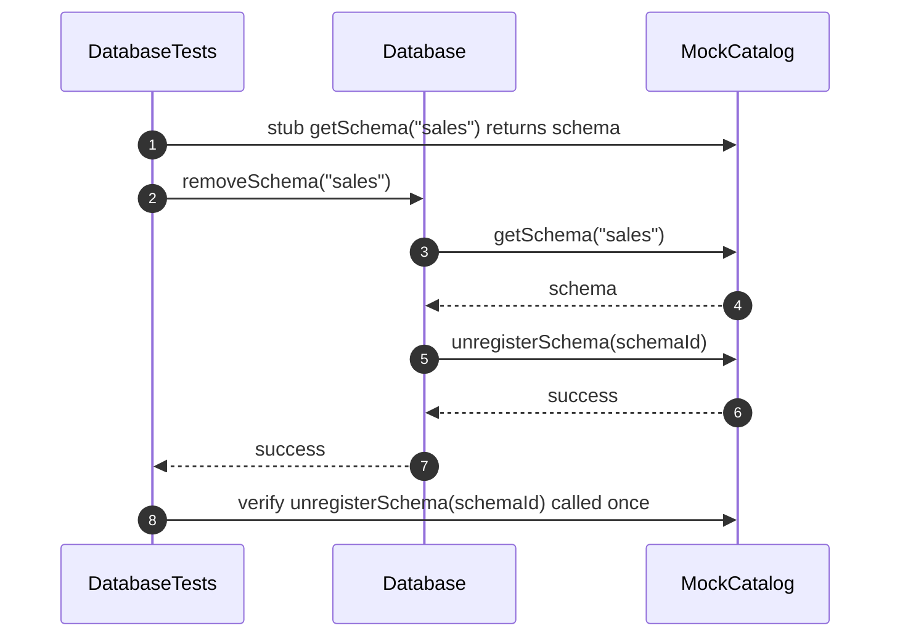
```mermaid
sequenceDiagram
    autonumber

    participant Test as DatabaseTests
    participant Database
    participant Catalog as MockCatalog

    Test->>Catalog: stub getSchema("sales") returns schema
    Test->>Database: removeSchema("sales")

    Database->>Catalog: getSchema("sales")
    Catalog-->>Database: schema

    Database->>Catalog: unregisterSchema(schemaId)
    Catalog-->>Database: success

    Database-->>Test: success

    Test->>Catalog: verify unregisterSchema(schemaId) called once
```

---

## 11. RemoveSchema_ShouldThrowWhenSchemaNotFound

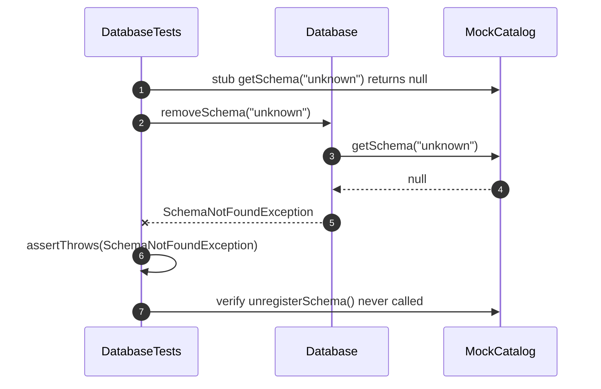
```mermaid
sequenceDiagram
    autonumber

    participant Test as DatabaseTests
    participant Database
    participant Catalog as MockCatalog

    Test->>Catalog: stub getSchema("unknown") returns null
    Test->>Database: removeSchema("unknown")

    Database->>Catalog: getSchema("unknown")
    Catalog-->>Database: null

    Database--xTest: SchemaNotFoundException

    Test->>Test: assertThrows(SchemaNotFoundException)
    Test->>Catalog: verify unregisterSchema() never called
```

---

## 12. GrantAccess_ShouldAssignPermission

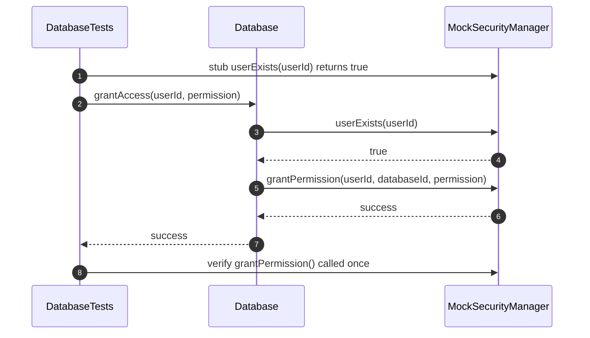
```mermaid
sequenceDiagram
    autonumber

    participant Test as DatabaseTests
    participant Database
    participant Security as MockSecurityManager

    Test->>Security: stub userExists(userId) returns true
    Test->>Database: grantAccess(userId, permission)

    Database->>Security: userExists(userId)
    Security-->>Database: true

    Database->>Security: grantPermission(userId, databaseId, permission)
    Security-->>Database: success

    Database-->>Test: success

    Test->>Security: verify grantPermission() called once
```

---

## 13. GrantAccess_ShouldThrowWhenUserInvalid

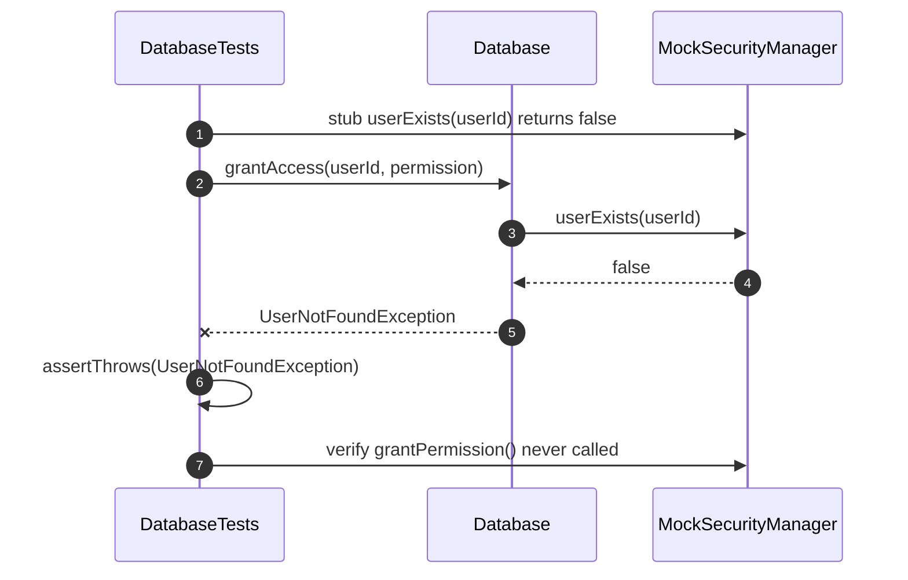
```mermaid
sequenceDiagram
    autonumber

    participant Test as DatabaseTests
    participant Database
    participant Security as MockSecurityManager

    Test->>Security: stub userExists(userId) returns false
    Test->>Database: grantAccess(userId, permission)

    Database->>Security: userExists(userId)
    Security-->>Database: false

    Database--xTest: UserNotFoundException

    Test->>Test: assertThrows(UserNotFoundException)
    Test->>Security: verify grantPermission() never called
```

---

## 14. RevokeAccess_ShouldRemovePermission

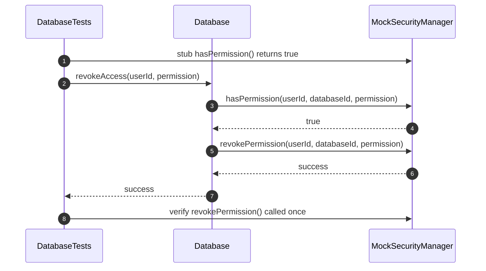
```mermaid
sequenceDiagram
    autonumber

    participant Test as DatabaseTests
    participant Database
    participant Security as MockSecurityManager

    Test->>Security: stub hasPermission() returns true
    Test->>Database: revokeAccess(userId, permission)

    Database->>Security: hasPermission(userId, databaseId, permission)
    Security-->>Database: true

    Database->>Security: revokePermission(userId, databaseId, permission)
    Security-->>Database: success

    Database-->>Test: success

    Test->>Security: verify revokePermission() called once
```

---

## 15. RevokeAccess_ShouldThrowWhenPermissionMissing

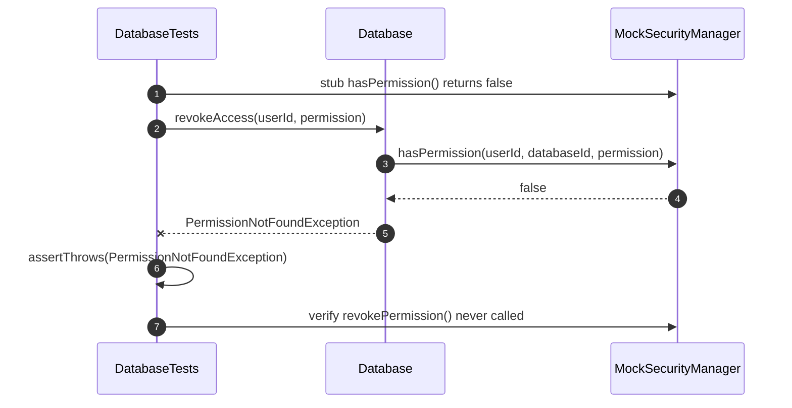
```mermaid
sequenceDiagram
    autonumber

    participant Test as DatabaseTests
    participant Database
    participant Security as MockSecurityManager

    Test->>Security: stub hasPermission() returns false
    Test->>Database: revokeAccess(userId, permission)

    Database->>Security: hasPermission(userId, databaseId, permission)
    Security-->>Database: false

    Database--xTest: PermissionNotFoundException

    Test->>Test: assertThrows(PermissionNotFoundException)
    Test->>Security: verify revokePermission() never called
```

---

## 16. UpdateStatistics_ShouldRefreshDatabaseStatistics

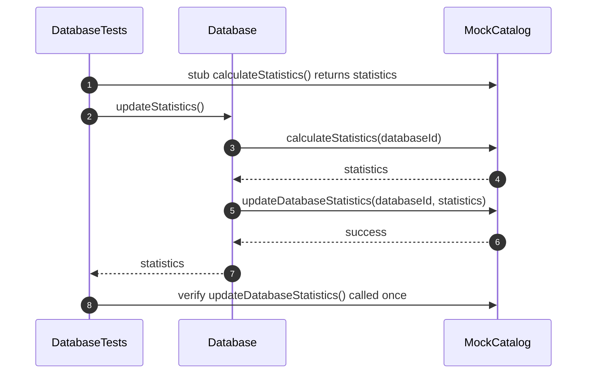
```mermaid
sequenceDiagram
    autonumber

    participant Test as DatabaseTests
    participant Database
    participant Catalog as MockCatalog

    Test->>Catalog: stub calculateStatistics() returns statistics
    Test->>Database: updateStatistics()

    Database->>Catalog: calculateStatistics(databaseId)
    Catalog-->>Database: statistics

    Database->>Catalog: updateDatabaseStatistics(databaseId, statistics)
    Catalog-->>Database: success

    Database-->>Test: statistics

    Test->>Catalog: verify updateDatabaseStatistics() called once
```

---

## 17. CalculateDatabaseSize_ShouldReturnCorrectSize

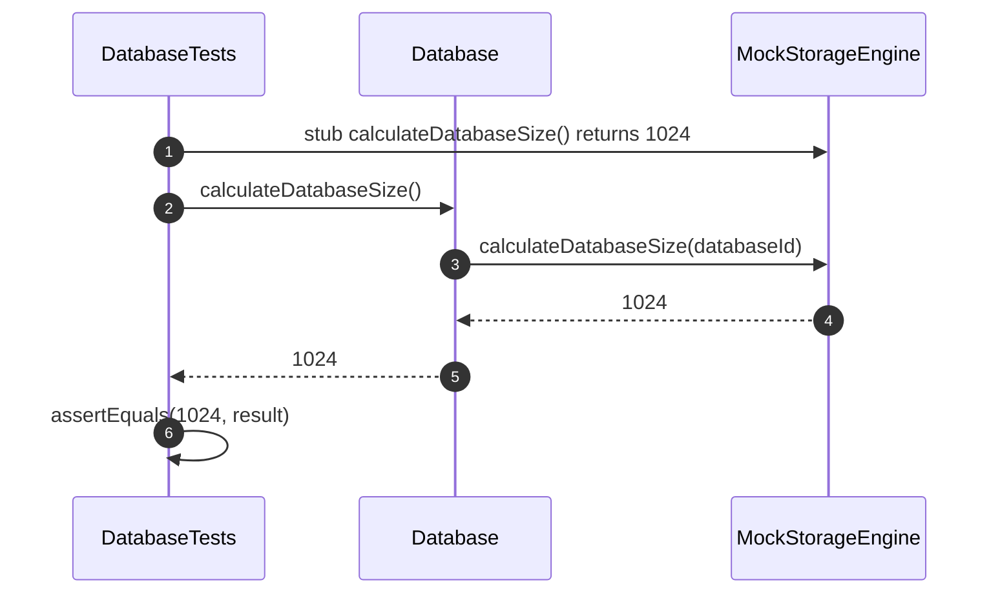
```mermaid
sequenceDiagram
    autonumber

    participant Test as DatabaseTests
    participant Database
    participant Storage as MockStorageEngine

    Test->>Storage: stub calculateDatabaseSize() returns 1024
    Test->>Database: calculateDatabaseSize()

    Database->>Storage: calculateDatabaseSize(databaseId)
    Storage-->>Database: 1024

    Database-->>Test: 1024

    Test->>Test: assertEquals(1024, result)
```

---

## 18. ChangeRecoveryModel_ShouldUpdateConfiguration

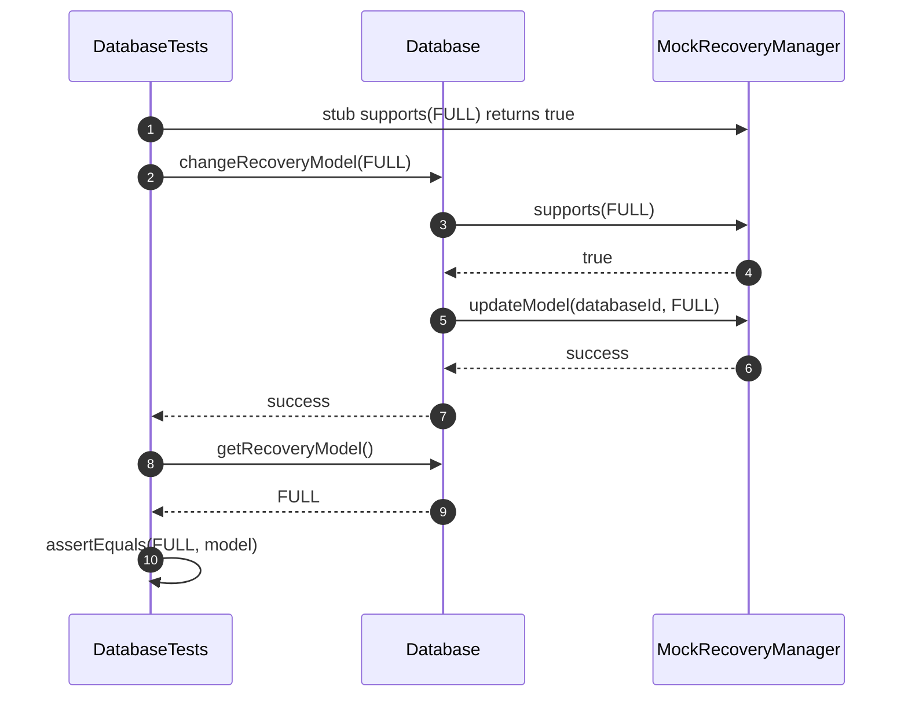
```mermaid
sequenceDiagram
    autonumber

    participant Test as DatabaseTests
    participant Database
    participant Recovery as MockRecoveryManager

    Test->>Recovery: stub supports(FULL) returns true
    Test->>Database: changeRecoveryModel(FULL)

    Database->>Recovery: supports(FULL)
    Recovery-->>Database: true

    Database->>Recovery: updateModel(databaseId, FULL)
    Recovery-->>Database: success

    Database-->>Test: success

    Test->>Database: getRecoveryModel()
    Database-->>Test: FULL

    Test->>Test: assertEquals(FULL, model)
```

---

## 19. Open_ShouldThrowWhenStorageUnavailable

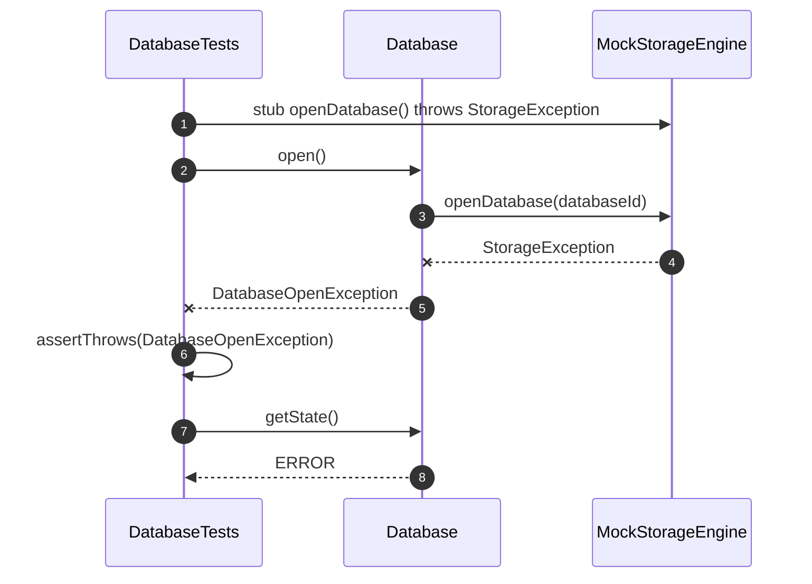
```mermaid
sequenceDiagram
    autonumber

    participant Test as DatabaseTests
    participant Database
    participant Storage as MockStorageEngine

    Test->>Storage: stub openDatabase() throws StorageException
    Test->>Database: open()

    Database->>Storage: openDatabase(databaseId)
    Storage--xDatabase: StorageException

    Database--xTest: DatabaseOpenException

    Test->>Test: assertThrows(DatabaseOpenException)
    Test->>Database: getState()
    Database-->>Test: ERROR
```

---

## 20. Close_ShouldThrowWhenFlushFails

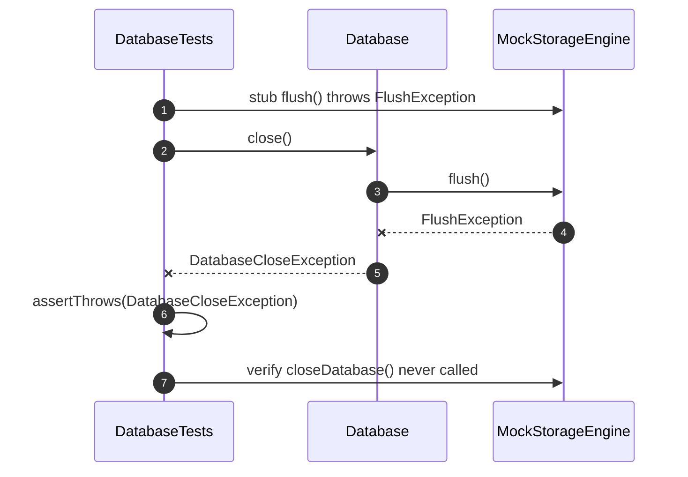
```mermaid
sequenceDiagram
    autonumber

    participant Test as DatabaseTests
    participant Database
    participant Storage as MockStorageEngine

    Test->>Storage: stub flush() throws FlushException
    Test->>Database: close()

    Database->>Storage: flush()
    Storage--xDatabase: FlushException

    Database--xTest: DatabaseCloseException

    Test->>Test: assertThrows(DatabaseCloseException)
    Test->>Storage: verify closeDatabase() never called
```

---

## 21. ValidateRecoveryModel_ShouldAcceptSupportedMode

```mermaid
sequenceDiagram
    autonumber

    participant Test as DatabaseTests
    participant Database
    participant Recovery as MockRecoveryManager

    Test->>Recovery: stub supports(FULL) returns true
    Test->>Database: validateRecoveryModel(FULL)

    Database->>Recovery: supports(FULL)
    Recovery-->>Database: true

    Database-->>Test: true

    Test->>Test: assertTrue(result)
```

---

## 22. ValidateDatabaseMetadata_ShouldRemainConsistent

```mermaid
sequenceDiagram
    autonumber

    participant Test as DatabaseTests
    participant Database
    participant Catalog as MockCatalog

    Test->>Catalog: stub validateMetadata() returns true
    Test->>Database: validateMetadata()

    Database->>Catalog: validateMetadata(databaseId)
    Catalog-->>Database: true

    Database-->>Test: true

    Test->>Test: assertTrue(result)
```

---

## 23. ConcurrentOpen_ShouldMaintainDatabaseState

```mermaid
sequenceDiagram
    autonumber

    participant Test as DatabaseTests
    participant Database
    participant Storage as MockStorageEngine

    Test->>Storage: stub openDatabase() returns success

    par Call 1
        Test->>Database: open()
        Database->>Storage: openDatabase(databaseId)
        Storage-->>Database: success
        Database-->>Test: success
    and Call 2
        Test->>Database: open()
        Database-->>Test: alreadyOpen
    end

    Test->>Storage: verify openDatabase() called once
    Test->>Database: getState()
    Database-->>Test: OPEN
```

---

## 24. ConcurrentSchemaCreation_ShouldPreventConflict

```mermaid
sequenceDiagram
    autonumber

    participant Test as DatabaseTests
    participant Database
    participant Catalog as MockCatalog

    Test->>Catalog: first schemaExists() returns false
    Test->>Catalog: second schemaExists() returns true

    par Call 1
        Test->>Database: addSchema(schema)
        Database->>Catalog: schemaExists("sales")
        Catalog-->>Database: false
        Database->>Catalog: registerSchema(schema)
        Catalog-->>Database: success
        Database-->>Test: success
    and Call 2
        Test->>Database: addSchema(schema)
        Database->>Catalog: schemaExists("sales")
        Catalog-->>Database: true
        Database--xTest: DuplicateSchemaException
    end

    Test->>Catalog: verify registerSchema() called once
```

---

## 25. ConcurrentPermissionUpdate_ShouldBeThreadSafe

```mermaid
sequenceDiagram
    autonumber

    participant Test as DatabaseTests
    participant Database
    participant Security as MockSecurityManager

    par Grant call
        Test->>Database: grantAccess(userId, permission)
        Database->>Security: grantPermission(userId, databaseId, permission)
        Security-->>Database: success
        Database-->>Test: success
    and Revoke call
        Test->>Database: revokeAccess(userId, permission)
        Database->>Security: revokePermission(userId, databaseId, permission)
        Security-->>Database: success
        Database-->>Test: success
    end

    Test->>Test: assert no inconsistent state
```