# Database Testing - Main Functional Sequences

---

## 1. Open Database

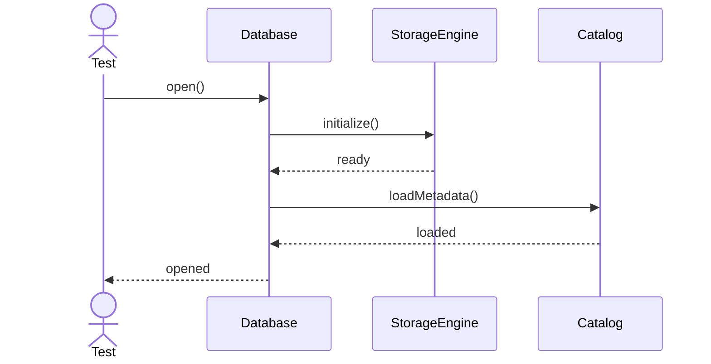
```mermaid
sequenceDiagram
actor Test
participant Database
participant StorageEngine
participant Catalog

Test->>Database: open()
Database->>StorageEngine: initialize()
StorageEngine-->>Database: ready
Database->>Catalog: loadMetadata()
Catalog-->>Database: loaded
Database-->>Test: opened
```

---

## 2. Close Database

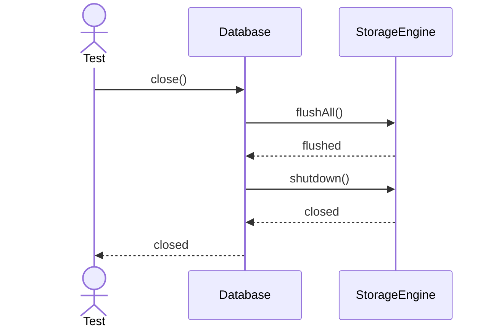
```mermaid
sequenceDiagram
actor Test
participant Database
participant StorageEngine

Test->>Database: close()
Database->>StorageEngine: flushAll()
StorageEngine-->>Database: flushed
Database->>StorageEngine: shutdown()
StorageEngine-->>Database: closed
Database-->>Test: closed
```

---

## 3. Set Read Only

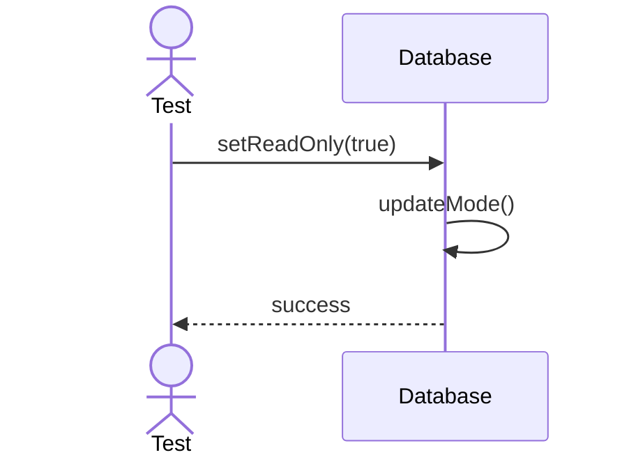
```mermaid
sequenceDiagram
actor Test
participant Database

Test->>Database: setReadOnly(true)
Database->>Database: updateMode()
Database-->>Test: success
```

---

## 4. Add Schema

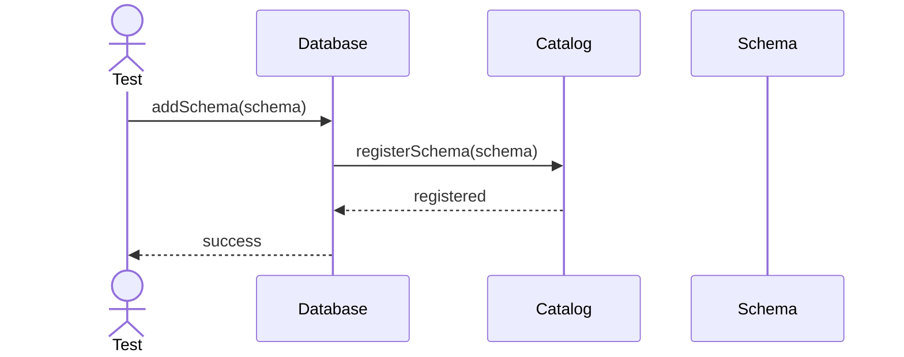
```mermaid
sequenceDiagram
actor Test
participant Database
participant Catalog
participant Schema

Test->>Database: addSchema(schema)
Database->>Catalog: registerSchema(schema)
Catalog-->>Database: registered
Database-->>Test: success
```

---

## 5. Remove Schema

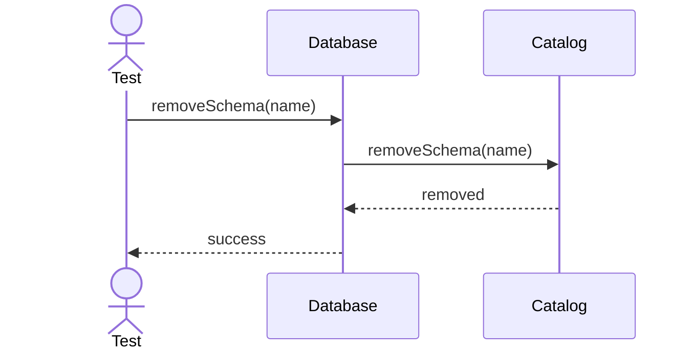
```mermaid
sequenceDiagram
actor Test
participant Database
participant Catalog

Test->>Database: removeSchema(name)
Database->>Catalog: removeSchema(name)
Catalog-->>Database: removed
Database-->>Test: success
```

---

## 6. Grant Access

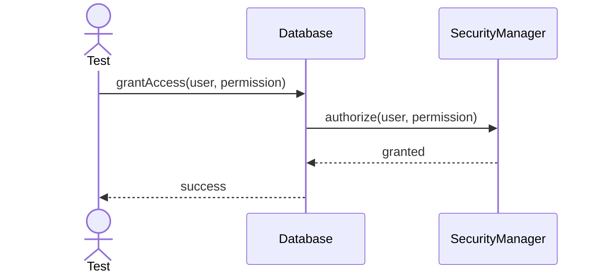
```mermaid
sequenceDiagram
actor Test
participant Database
participant SecurityManager

Test->>Database: grantAccess(user, permission)
Database->>SecurityManager: authorize(user, permission)
SecurityManager-->>Database: granted
Database-->>Test: success
```

---

## 7. Revoke Access

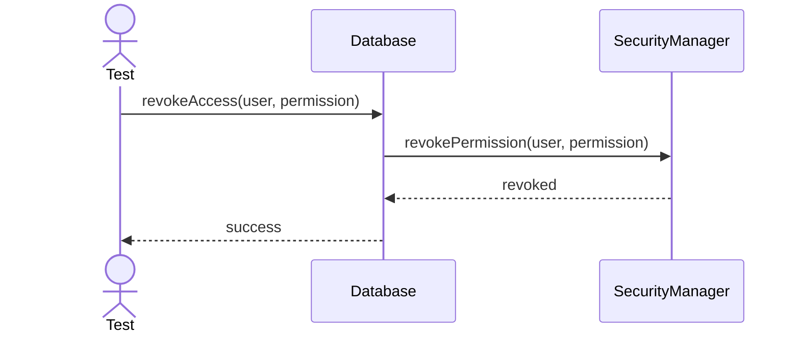
```mermaid
sequenceDiagram
actor Test
participant Database
participant SecurityManager

Test->>Database: revokeAccess(user, permission)
Database->>SecurityManager: revokePermission(user, permission)
SecurityManager-->>Database: revoked
Database-->>Test: success
```

---

## 8. Update Statistics

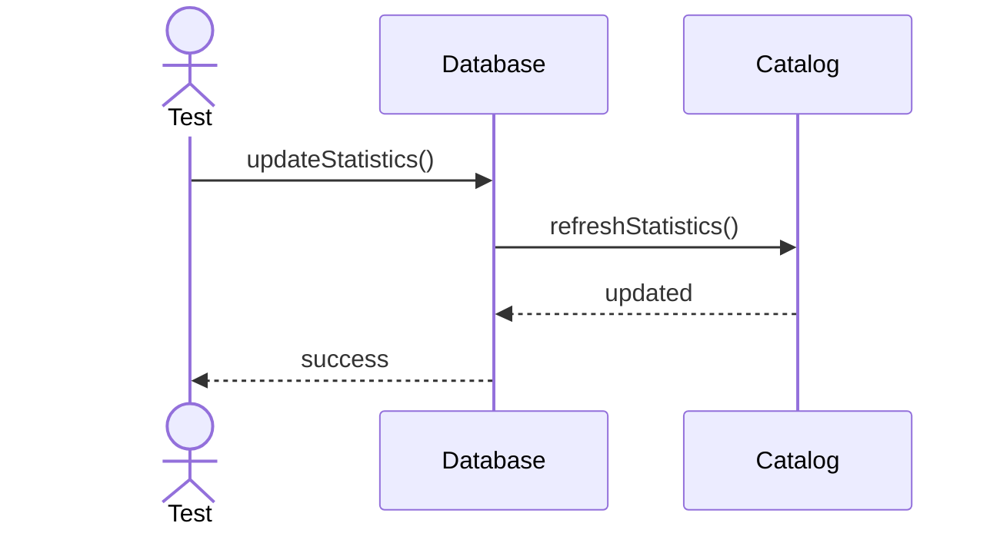
```mermaid
sequenceDiagram
actor Test
participant Database
participant Catalog

Test->>Database: updateStatistics()
Database->>Catalog: refreshStatistics()
Catalog-->>Database: updated
Database-->>Test: success
```

---

## 9. Execute SQL

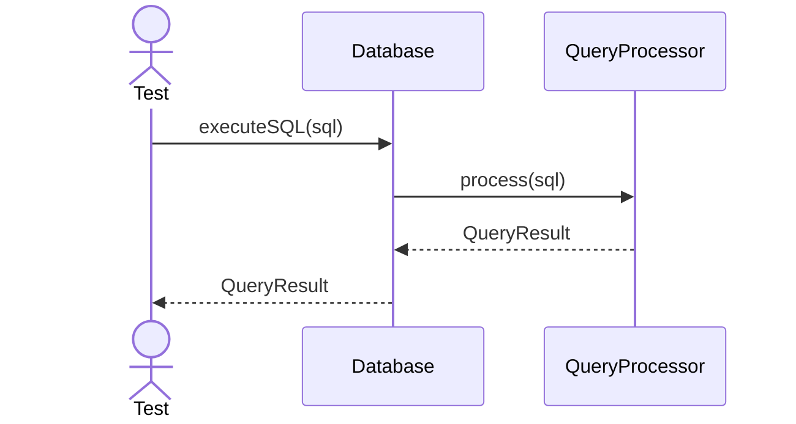
```mermaid
sequenceDiagram
actor Test
participant Database
participant QueryProcessor

Test->>Database: executeSQL(sql)
Database->>QueryProcessor: process(sql)
QueryProcessor-->>Database: QueryResult
Database-->>Test: QueryResult
```

---

## 10. Get Catalog

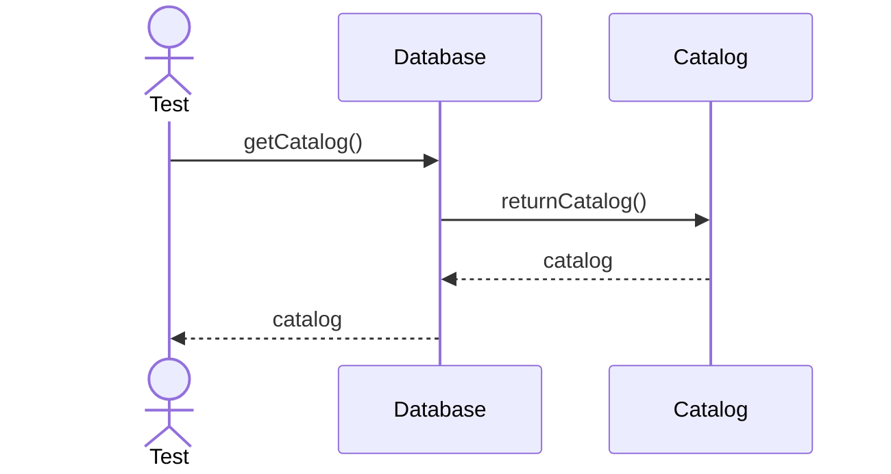
```mermaid
sequenceDiagram
actor Test
participant Database
participant Catalog

Test->>Database: getCatalog()
Database->>Catalog: returnCatalog()
Catalog-->>Database: catalog
Database-->>Test: catalog
```

---

## 11. Get Storage

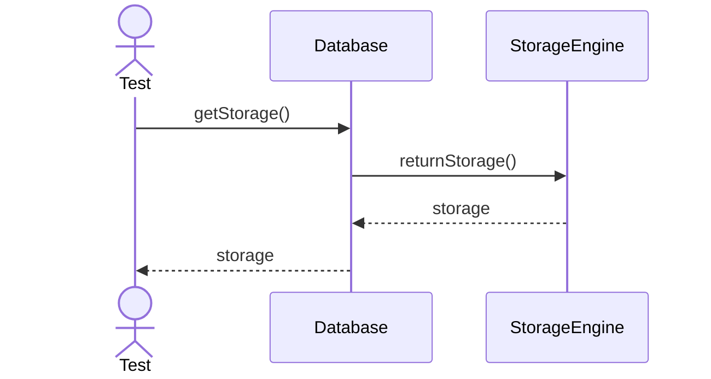
```mermaid
sequenceDiagram
actor Test
participant Database
participant StorageEngine

Test->>Database: getStorage()
Database->>StorageEngine: returnStorage()
StorageEngine-->>Database: storage
Database-->>Test: storage
```

---

## 12. Get Transaction Manager

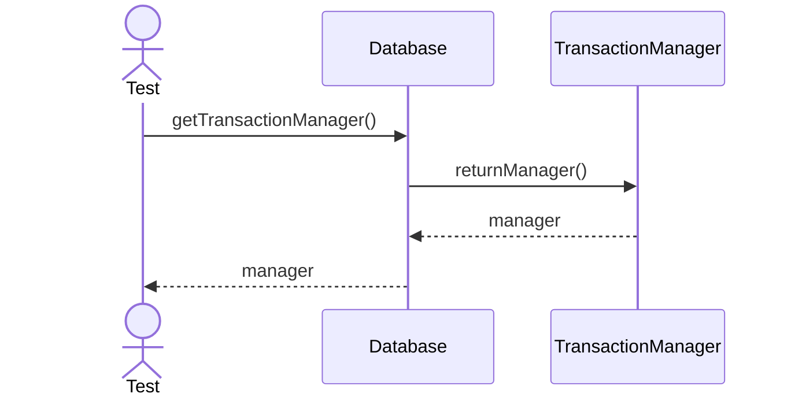
```mermaid
sequenceDiagram
actor Test
participant Database
participant TransactionManager

Test->>Database: getTransactionManager()
Database->>TransactionManager: returnManager()
TransactionManager-->>Database: manager
Database-->>Test: manager
```

---

## 13. Get Security Manager

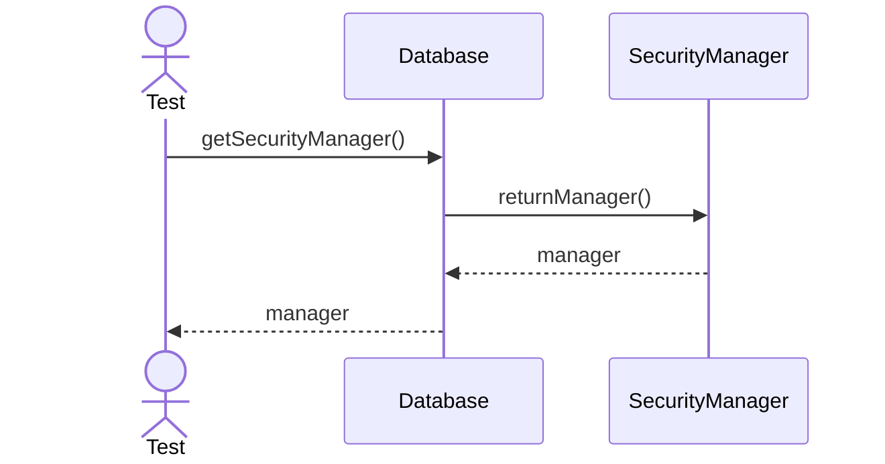
```mermaid
sequenceDiagram
actor Test
participant Database
participant SecurityManager

Test->>Database: getSecurityManager()
Database->>SecurityManager: returnManager()
SecurityManager-->>Database: manager
Database-->>Test: manager
```

---

## 14. Backup Database

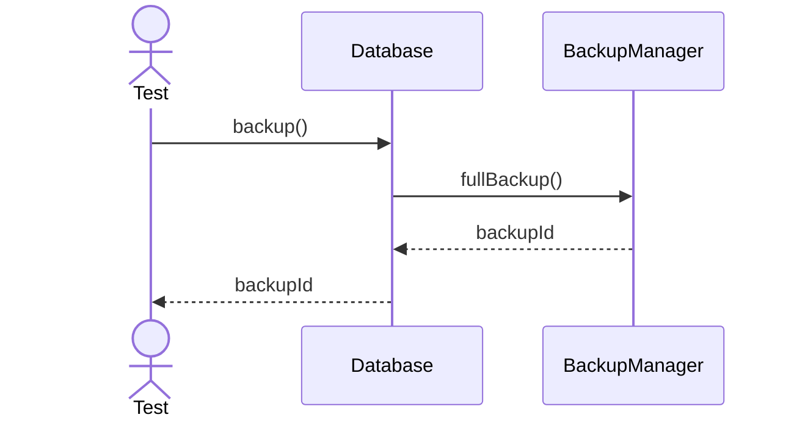
```mermaid
sequenceDiagram
actor Test
participant Database
participant BackupManager

Test->>Database: backup()
Database->>BackupManager: fullBackup()
BackupManager-->>Database: backupId
Database-->>Test: backupId
```

---

## 15. Restore Database

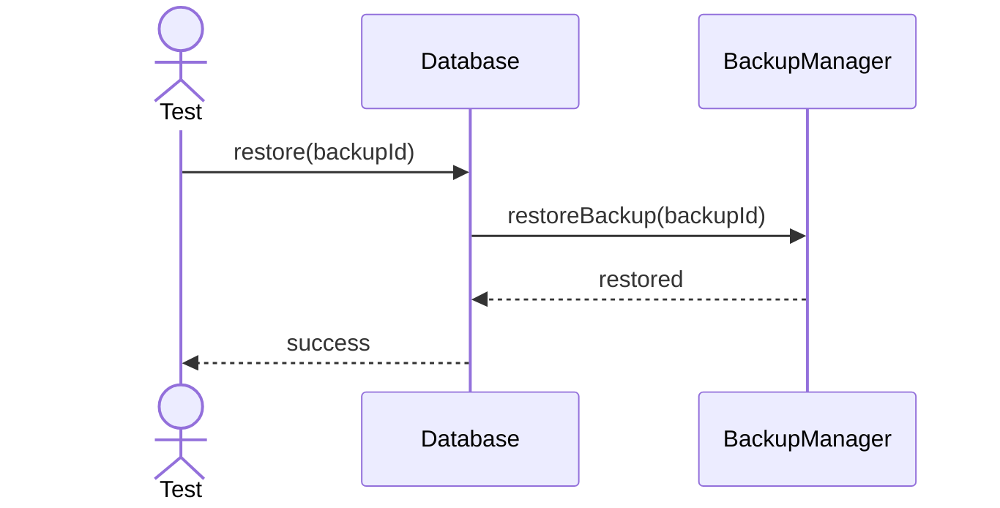
```mermaid
sequenceDiagram
actor Test
participant Database
participant BackupManager

Test->>Database: restore(backupId)
Database->>BackupManager: restoreBackup(backupId)
BackupManager-->>Database: restored
Database-->>Test: success
```

---

## 16. Clone Database

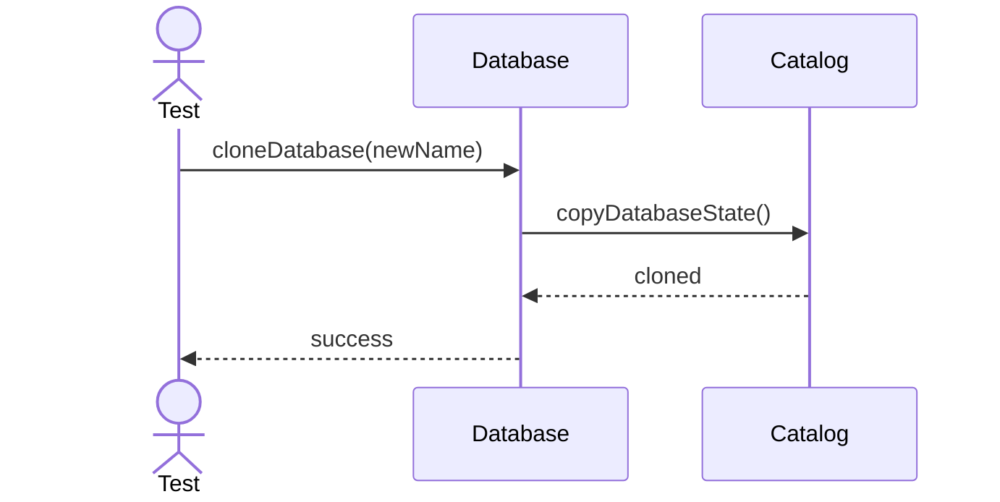
```mermaid
sequenceDiagram
actor Test
participant Database
participant Catalog

Test->>Database: cloneDatabase(newName)
Database->>Catalog: copyDatabaseState()
Catalog-->>Database: cloned
Database-->>Test: success
```

---

## 17. Export State

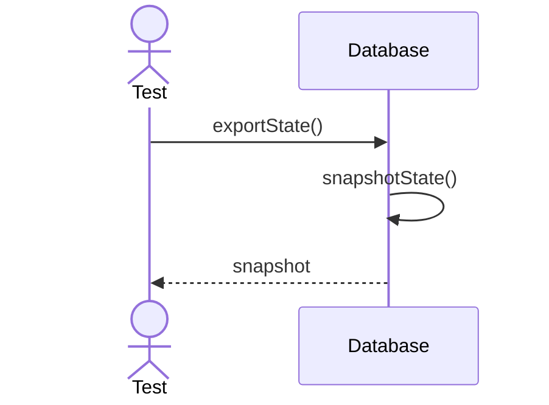
```mermaid
sequenceDiagram
actor Test
participant Database

Test->>Database: exportState()
Database->>Database: snapshotState()
Database-->>Test: snapshot
```

---

## 18. Health Check

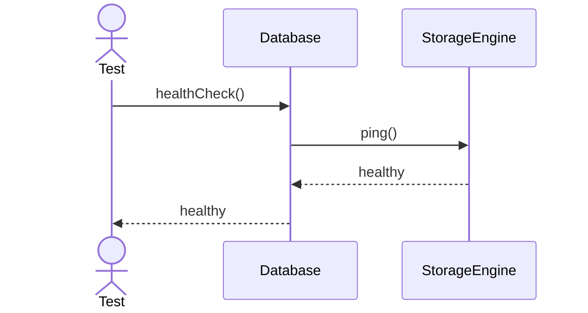
```mermaid
sequenceDiagram
actor Test
participant Database
participant StorageEngine

Test->>Database: healthCheck()
Database->>StorageEngine: ping()
StorageEngine-->>Database: healthy
Database-->>Test: healthy
```

---

## 19. Validate Name

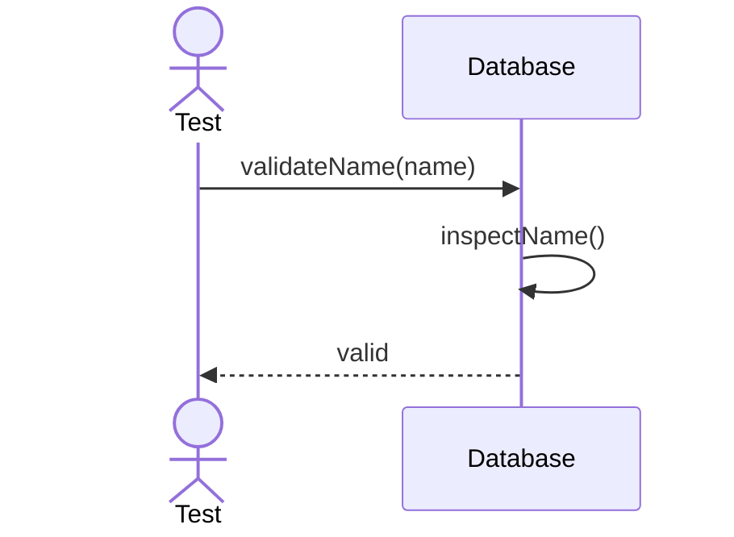
```mermaid
sequenceDiagram
actor Test
participant Database

Test->>Database: validateName(name)
Database->>Database: inspectName()
Database-->>Test: valid
```

---

## 20. Report Status

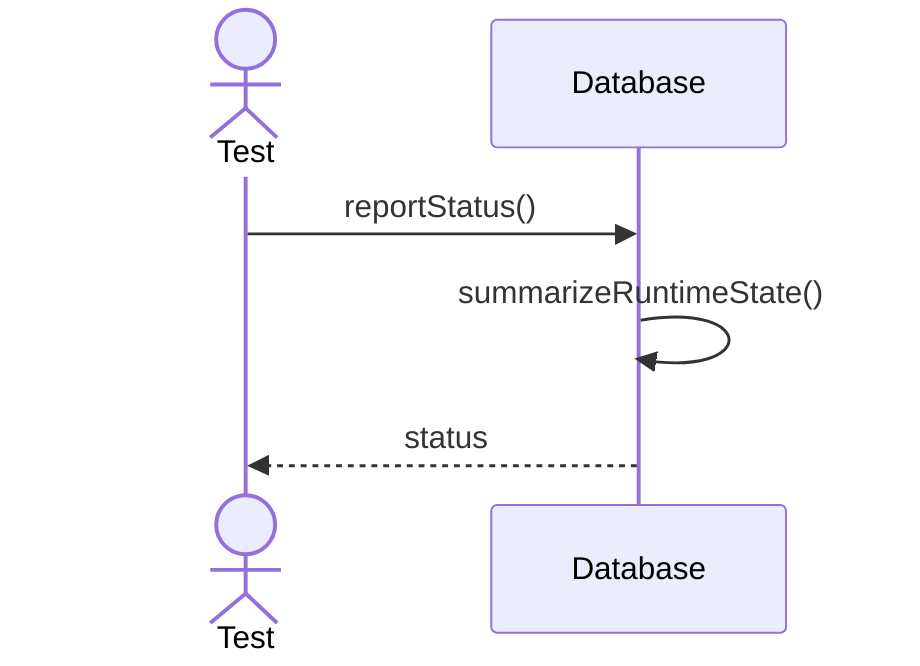
```mermaid
sequenceDiagram
actor Test
participant Database

Test->>Database: reportStatus()
Database->>Database: summarizeRuntimeState()
Database-->>Test: status
```
