# BackupManager Testing - Main Functional Sequences

---

## 1. Full Backup

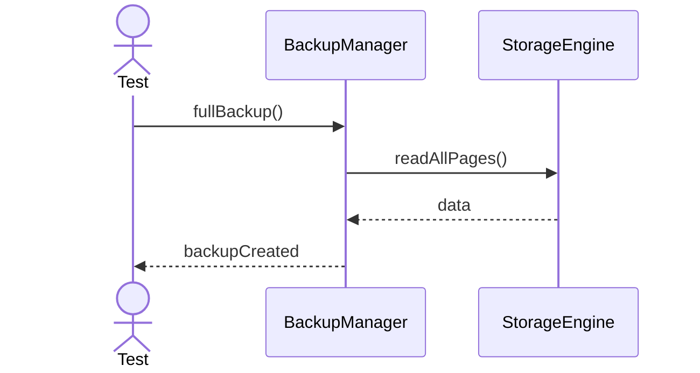

---

## 2. Incremental Backup

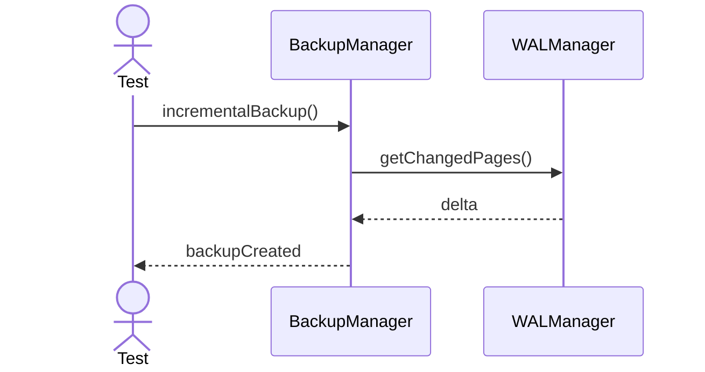

---

## 3. Restore Backup

---

## 4. Verify Backup

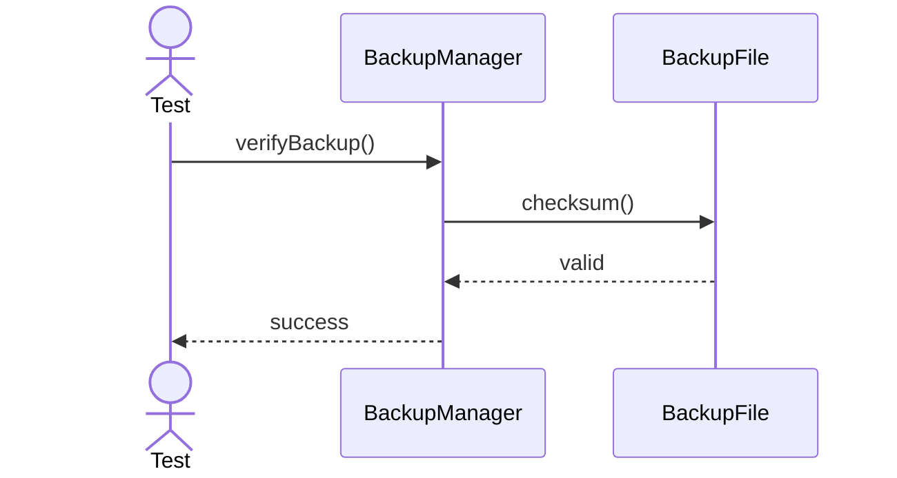

---

## 5. Differential Backup

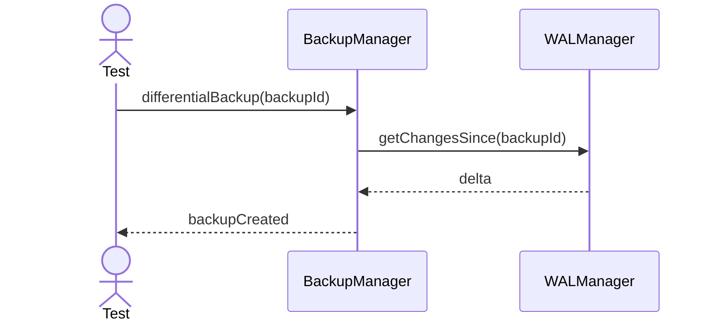

---

## 6. Compress Backup

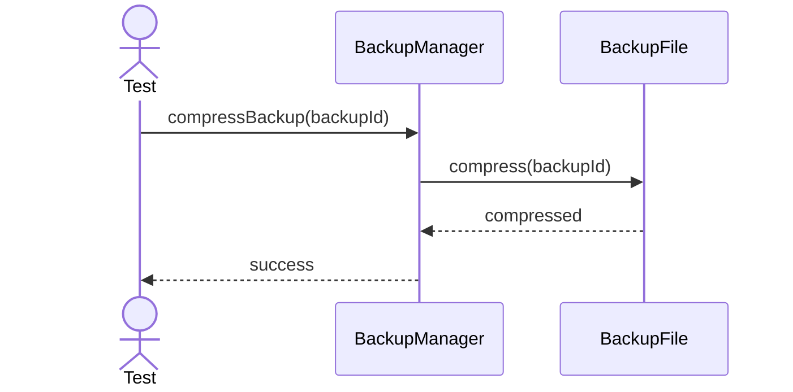

---

## 7. Encrypt Backup

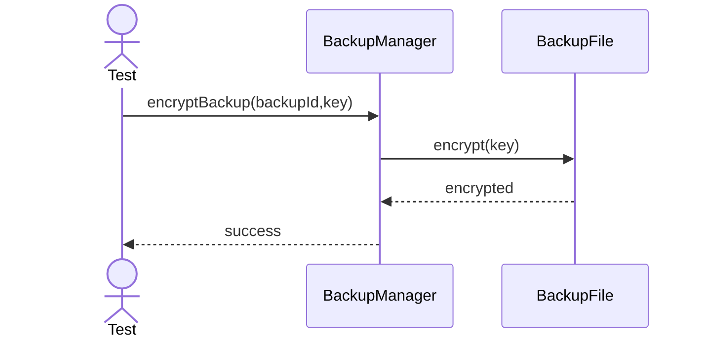

---

## 8. Restore From Snapshot

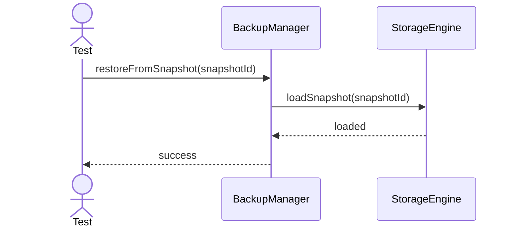

---

## 9. List Backups

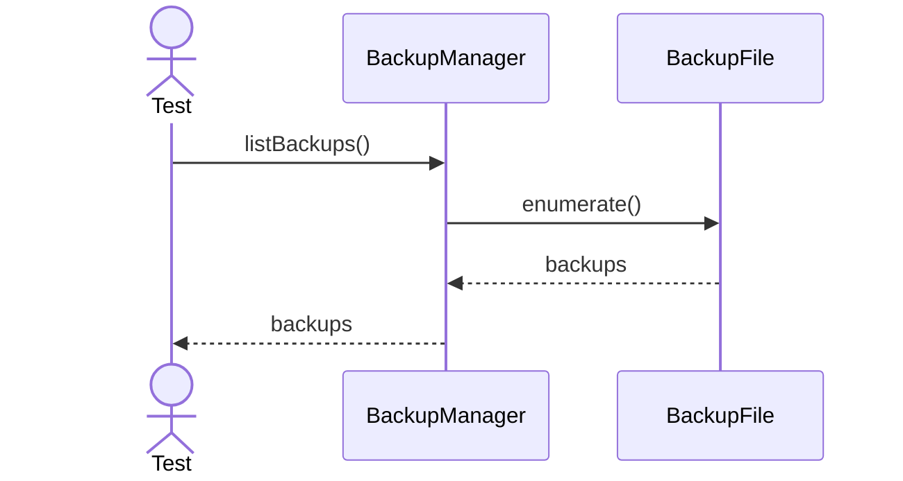

---

## 10. Verify Restore Point

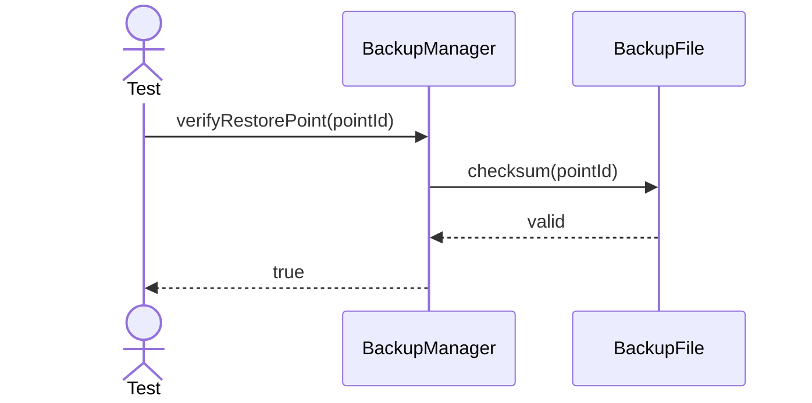

---

## 11. Archive Backup

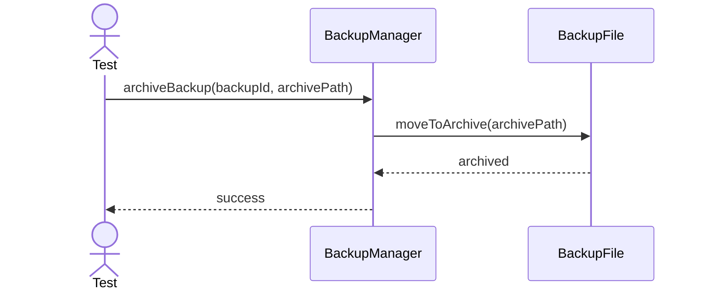

---

## 12. Restore Backup Metadata

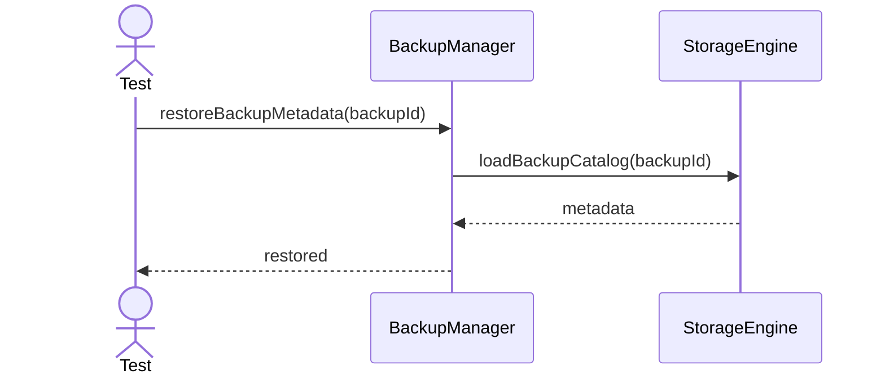

---

## 13. Validate Backup Chain

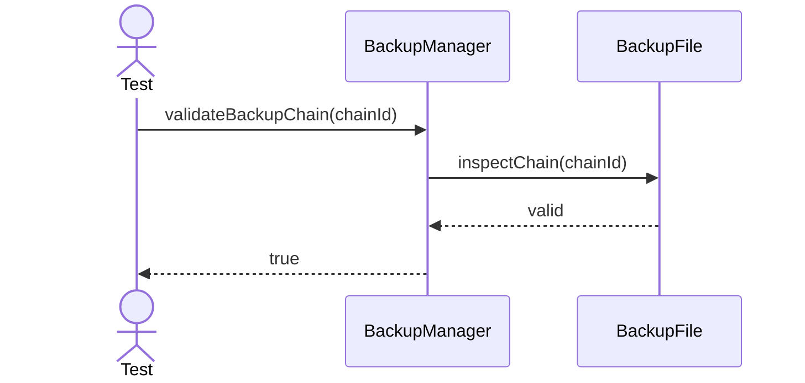
