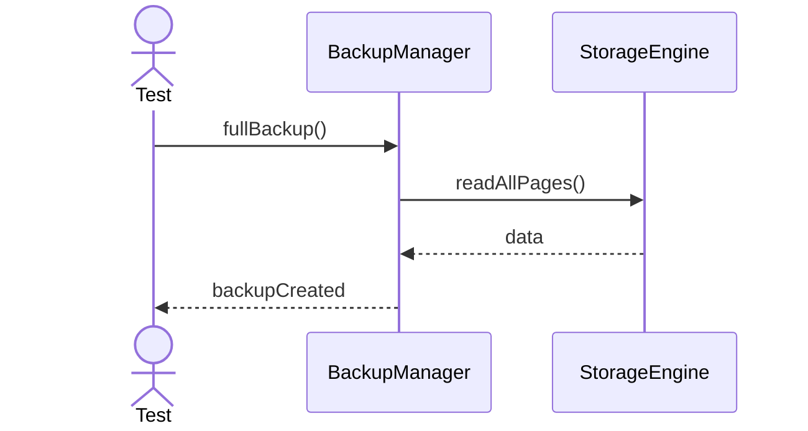
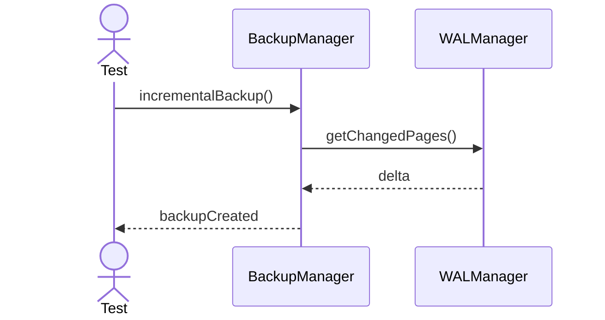
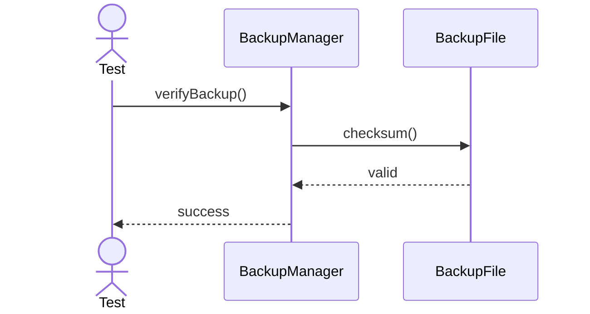

# BackupManager Testing - Main Functional Sequences

---

## 1. Full Backup

```mermaid
sequenceDiagram
actor Test
participant BackupManager
participant StorageEngine

Test->>BackupManager: fullBackup()
BackupManager->>StorageEngine: readAllPages()
StorageEngine-->>BackupManager: data
BackupManager-->>Test: backupCreated
```

---

## 2. Incremental Backup

```mermaid
sequenceDiagram
actor Test
participant BackupManager
participant WALManager

Test->>BackupManager: incrementalBackup()
BackupManager->>WALManager: getChangedPages()
WALManager-->>BackupManager: delta
BackupManager-->>Test: backupCreated
```

---

## 3. Restore Backup

```mermaid
sequenceDiagram
actor Test
participant BackupManager
participant StorageEngine

Test->>BackupManager: restoreBackup()
BackupManager->>StorageEngine: writePages()
StorageEngine-->>BackupManager: restored
BackupManager-->>Test: success
```

---

## 4. Verify Backup

```mermaid
sequenceDiagram
actor Test
participant BackupManager
participant BackupFile

Test->>BackupManager: verifyBackup()
BackupManager->>BackupFile: checksum()
BackupFile-->>BackupManager: valid
BackupManager-->>Test: success
```
