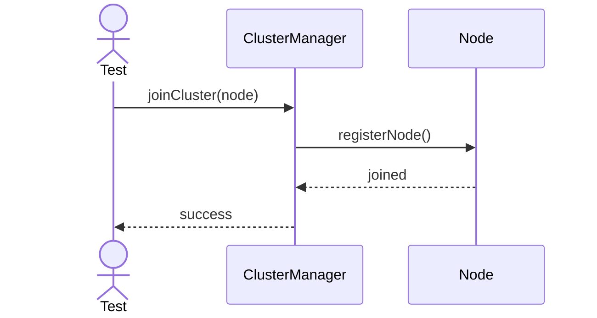
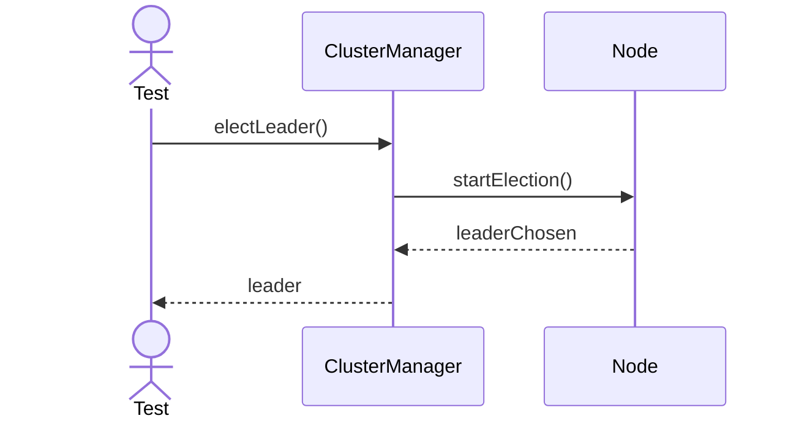
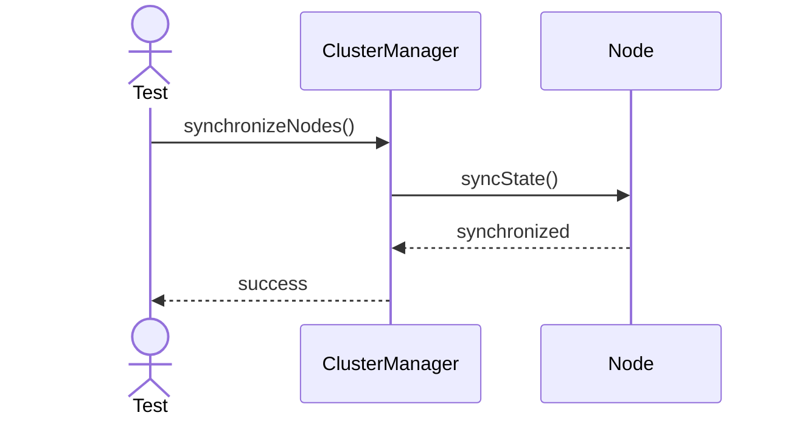

# ClusterManager Testing - Main Functional Sequences

---

## 1. Join Cluster

```mermaid
sequenceDiagram
actor Test
participant ClusterManager
participant Node

Test->>ClusterManager: joinCluster(node)
ClusterManager->>Node: registerNode()
Node-->>ClusterManager: joined
ClusterManager-->>Test: success
```

---

## 2. Elect Leader

```mermaid
sequenceDiagram
actor Test
participant ClusterManager
participant Node

Test->>ClusterManager: electLeader()
ClusterManager->>Node: startElection()
Node-->>ClusterManager: leaderChosen
ClusterManager-->>Test: leader
```

---

## 3. Synchronize Nodes

```mermaid
sequenceDiagram
actor Test
participant ClusterManager
participant Node

Test->>ClusterManager: synchronizeNodes()
ClusterManager->>Node: syncState()
Node-->>ClusterManager: synchronized
ClusterManager-->>Test: success
```
