# ClusterManager Testing - Main Functional Sequences

---

## 1. Join Cluster

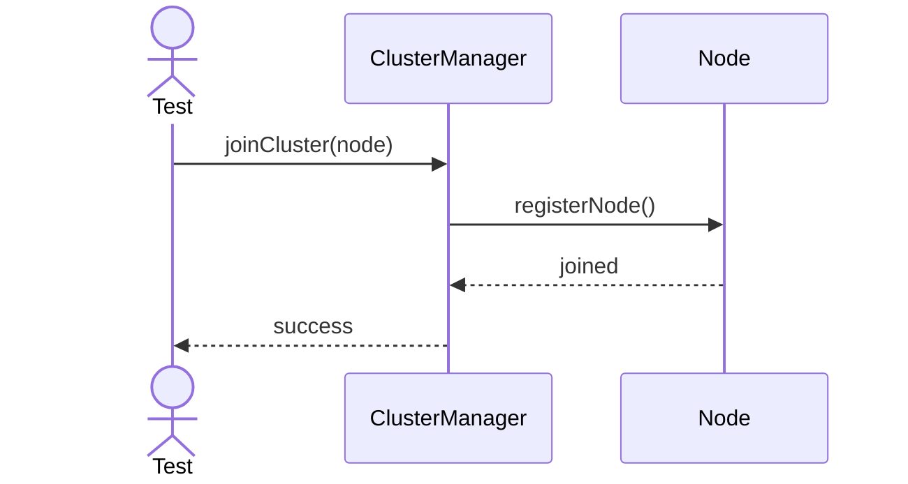

---

## 2. Elect Leader

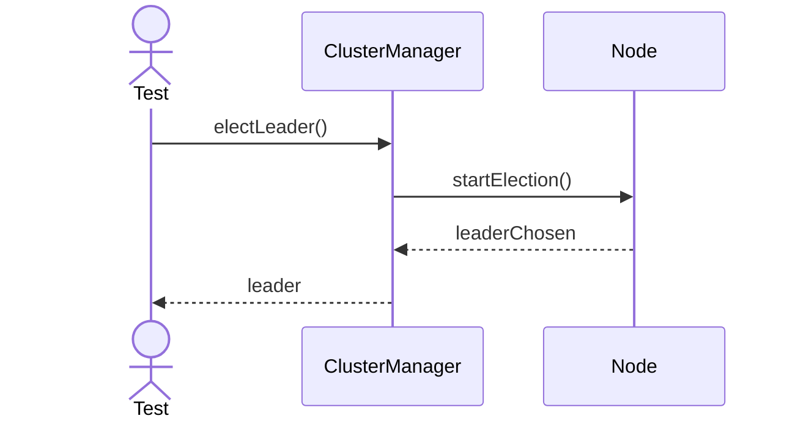

---

## 3. Synchronize Nodes

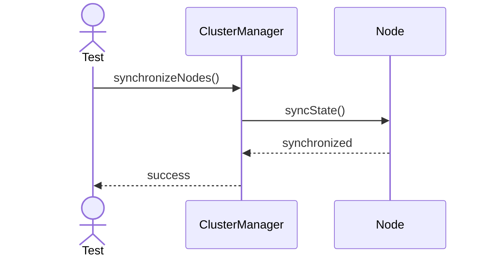

---

## 4. Leave Cluster

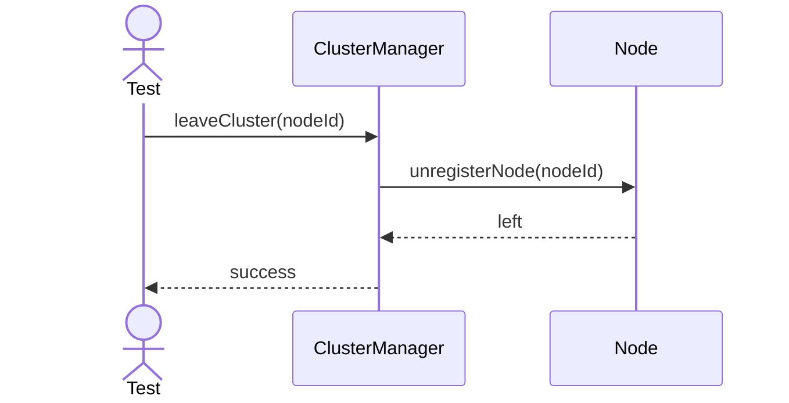

---

## 5. Recover Node

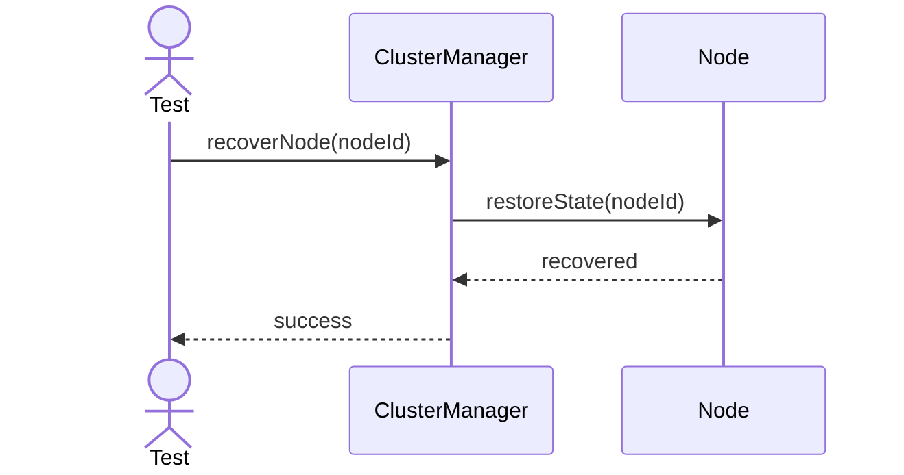

---

## 6. Rebalance Cluster

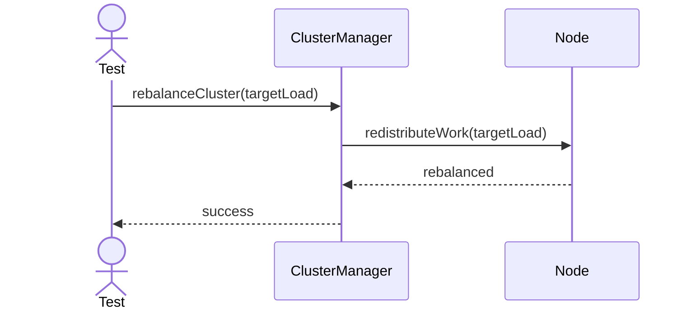

---

## 7. Report Cluster State

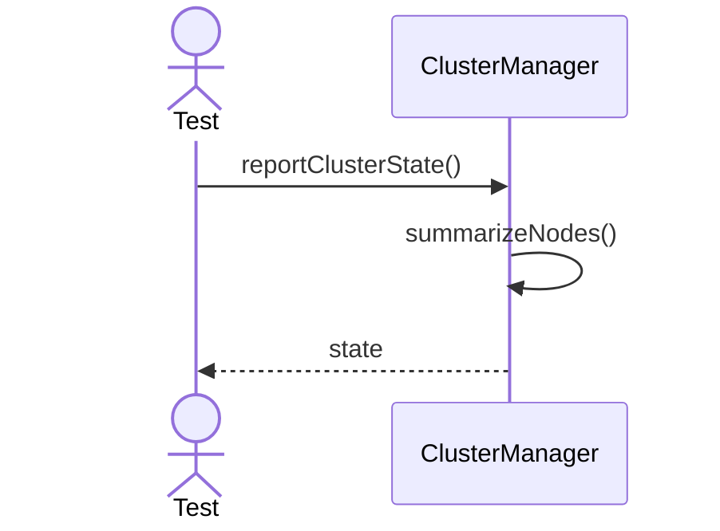

---

## 8. Sync Metadata Across Nodes

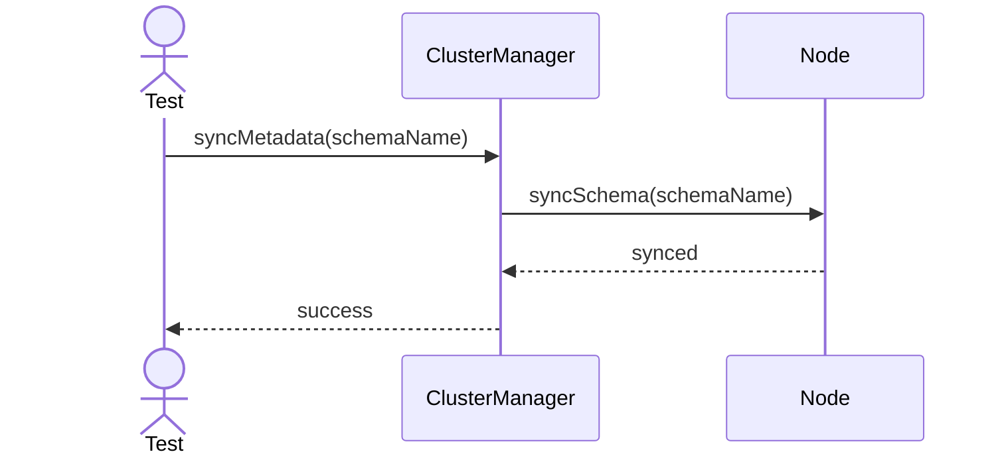

---

## 9. Health Check Node

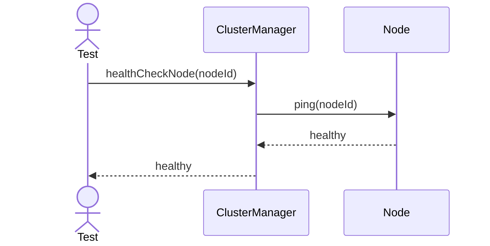

---

## 10. Export Cluster Plan

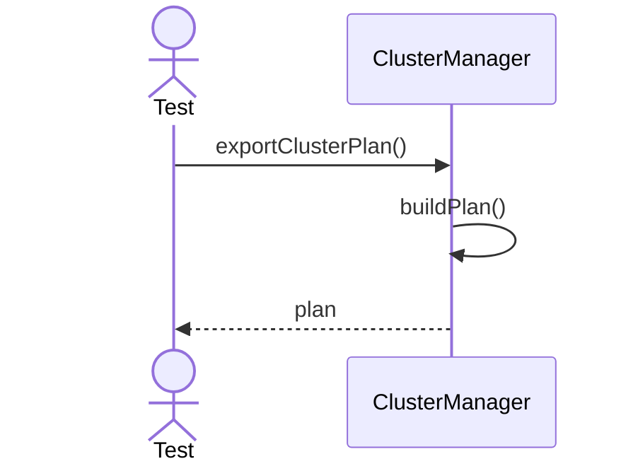

---

## 11. Remove Node

---

## 12. Broadcast Config

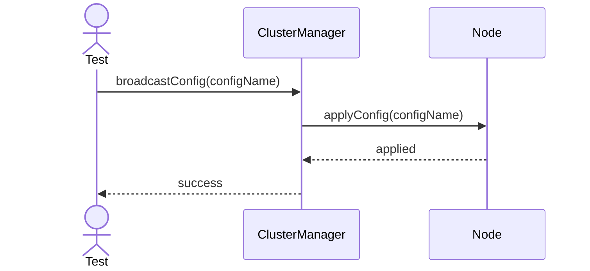

---

## 13. Register Node Metrics

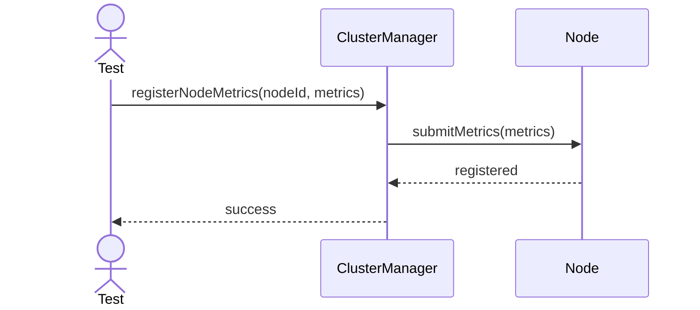
