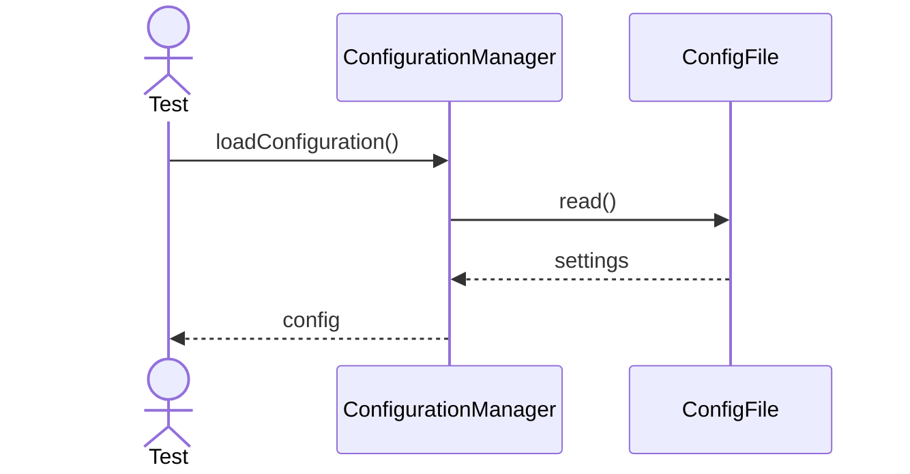
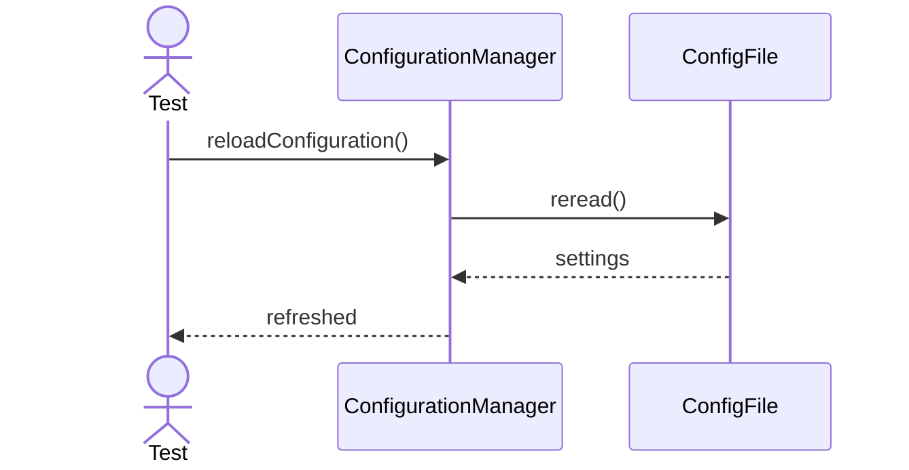
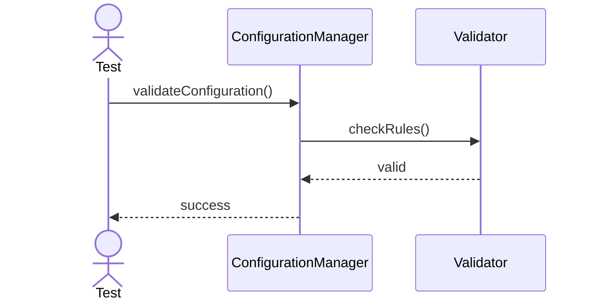
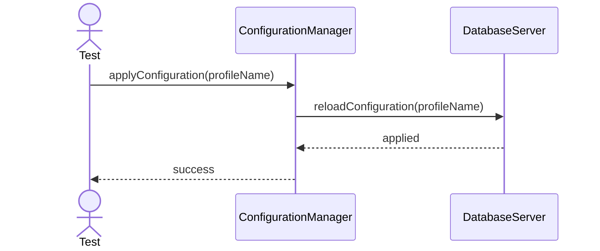
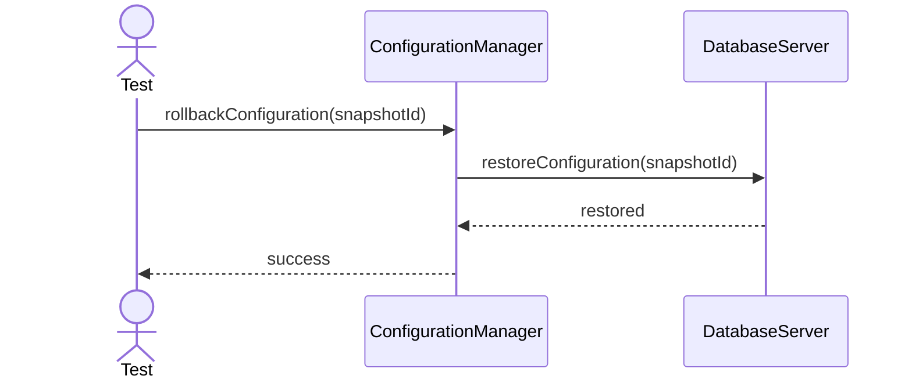
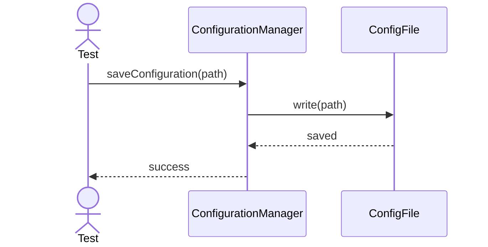
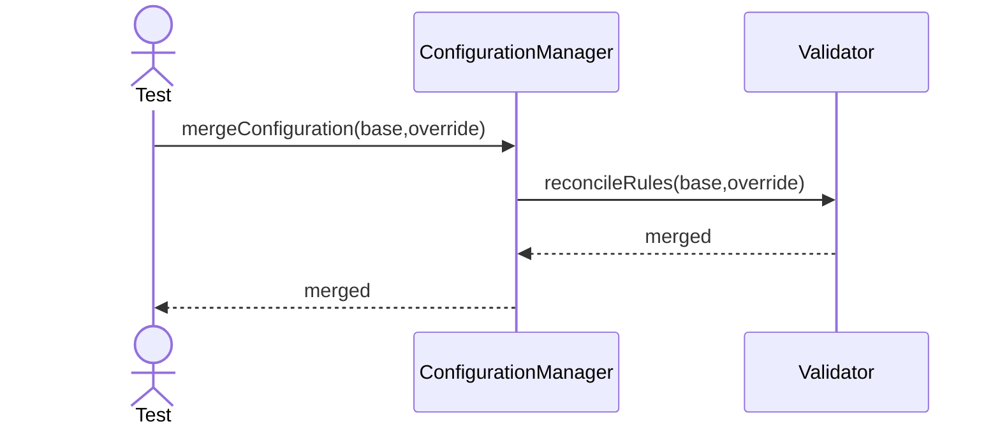
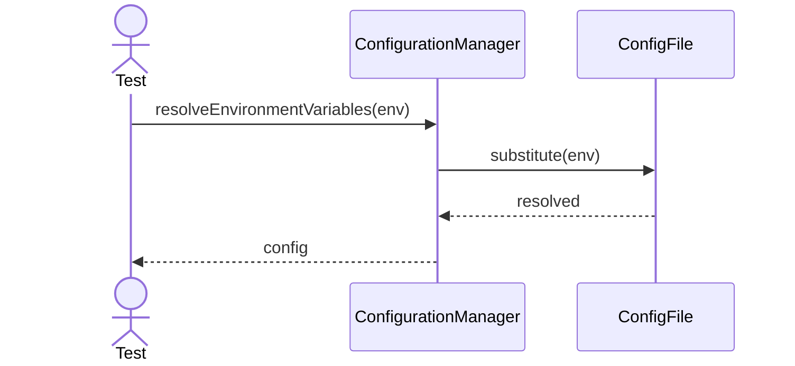
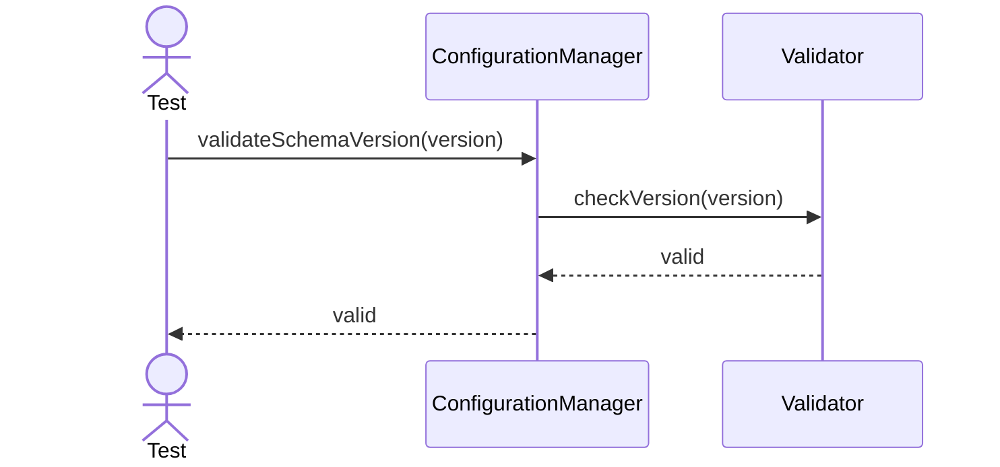
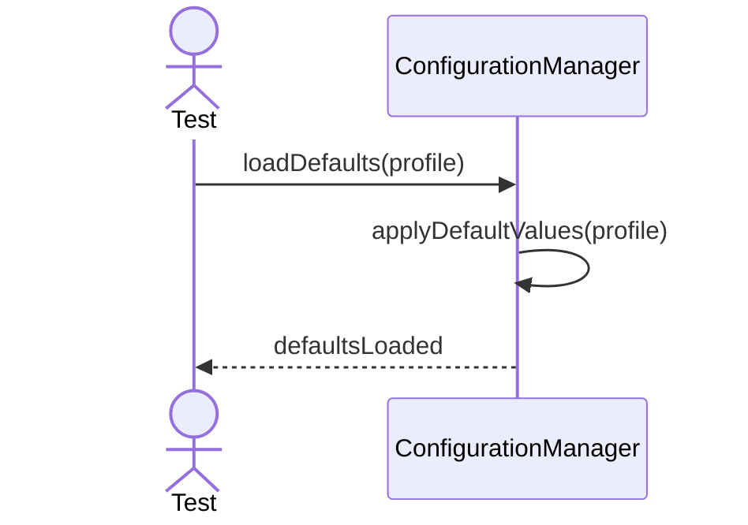

# ConfigurationManager Testing - Main Functional Sequences

---

## 1. Load Configuration

---

## 2. Reload Configuration

---

## 3. Validate Configuration

---

## 4. Apply Configuration

---

## 5. Rollback Configuration

---

## 6. Save Configuration

---

## 7. Merge Configuration

---

## 8. Resolve Environment Variables

---

## 9. Validate Schema Version

---

## 10. Load Defaults

