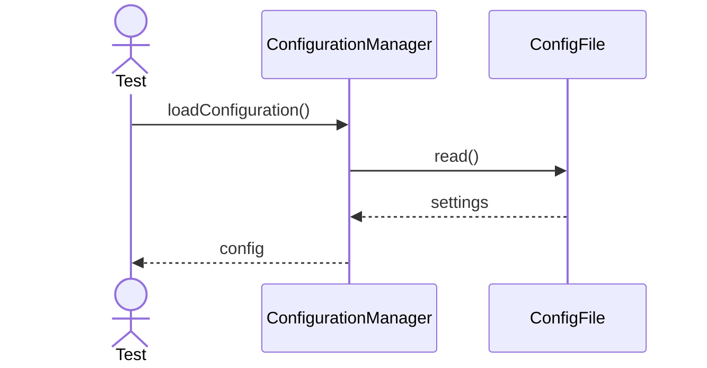
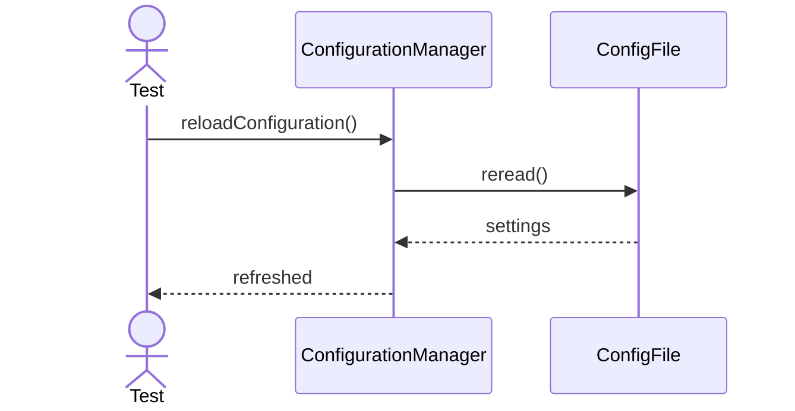
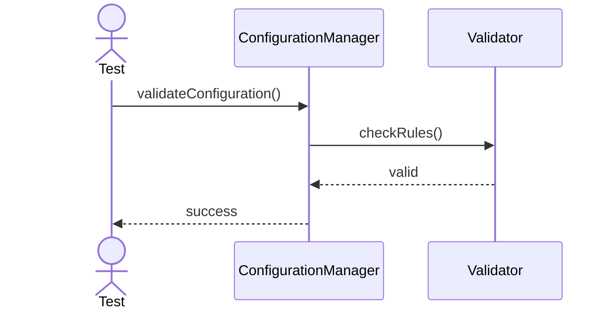

# ConfigurationManager Testing - Main Functional Sequences

---

## 1. Load Configuration

```mermaid
sequenceDiagram
actor Test
participant ConfigurationManager
participant ConfigFile

Test->>ConfigurationManager: loadConfiguration()
ConfigurationManager->>ConfigFile: read()
ConfigFile-->>ConfigurationManager: settings
ConfigurationManager-->>Test: config
```

---

## 2. Reload Configuration

```mermaid
sequenceDiagram
actor Test
participant ConfigurationManager
participant ConfigFile

Test->>ConfigurationManager: reloadConfiguration()
ConfigurationManager->>ConfigFile: reread()
ConfigFile-->>ConfigurationManager: settings
ConfigurationManager-->>Test: refreshed
```

---

## 3. Validate Configuration

```mermaid
sequenceDiagram
actor Test
participant ConfigurationManager
participant Validator

Test->>ConfigurationManager: validateConfiguration()
ConfigurationManager->>Validator: checkRules()
Validator-->>ConfigurationManager: valid
ConfigurationManager-->>Test: success
```
