# MonitoringManager Testing - Main Functional Sequences

---

## 1. Collect Metrics

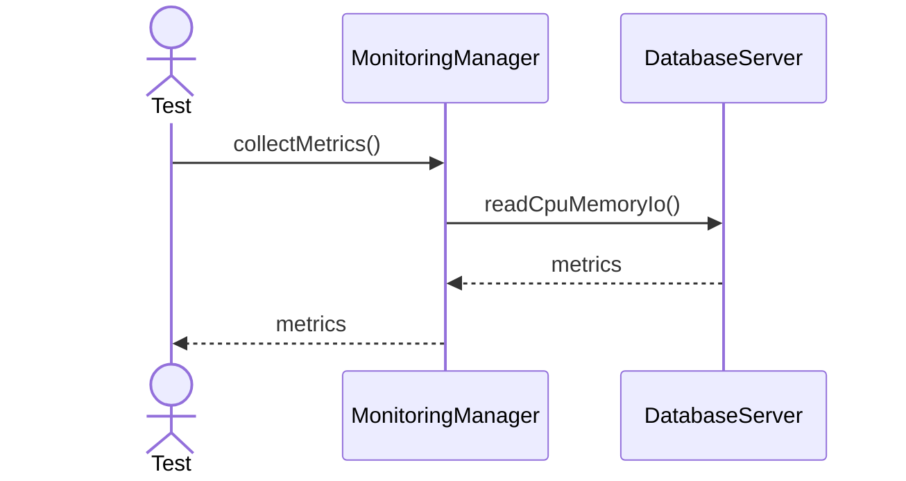

---

## 2. Detect Slow Query

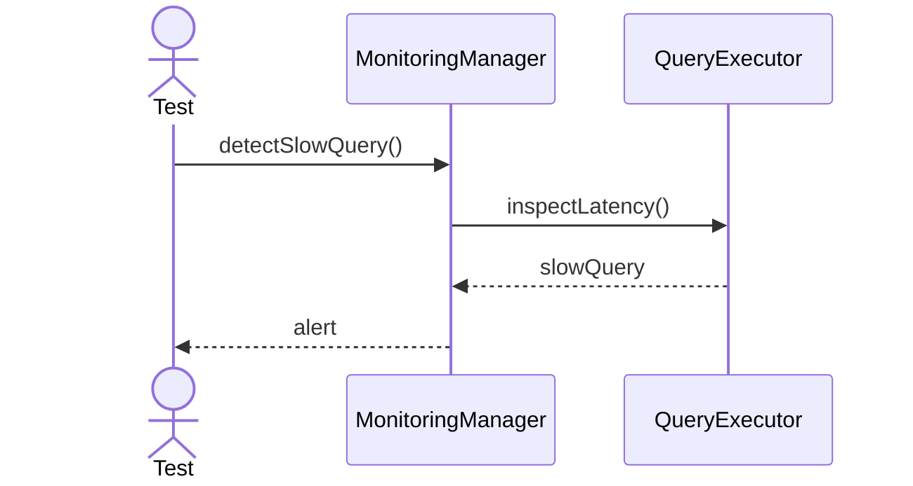

---

## 3. Raise Alert

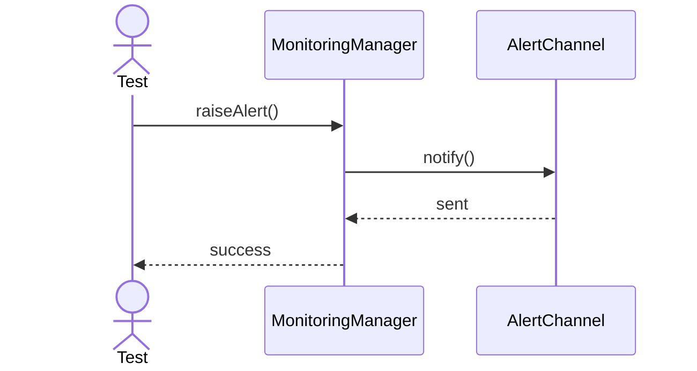

---

## 4. Capture Deadlock

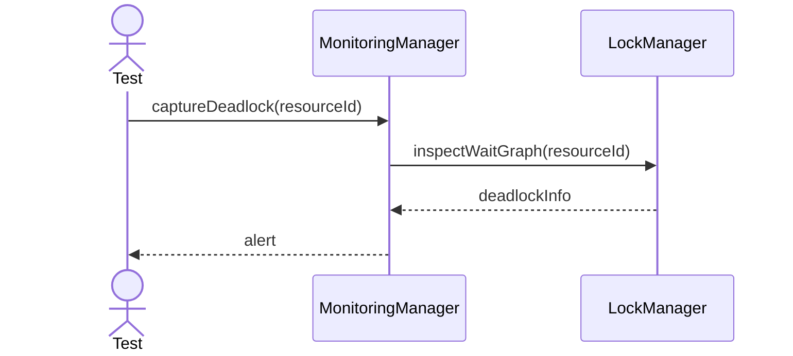

---

## 5. Capture Blocking

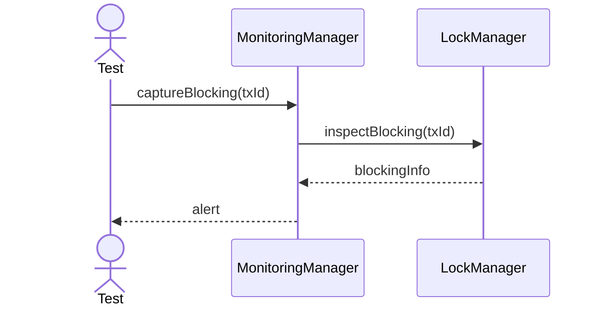

---

## 6. Export Metrics

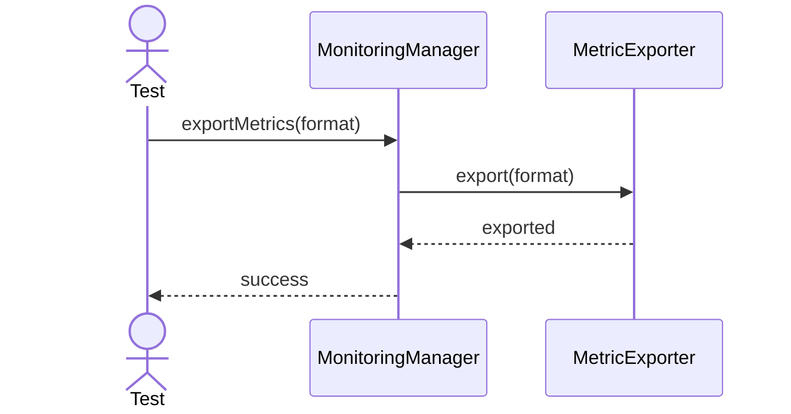

---

## 7. Refresh Thresholds

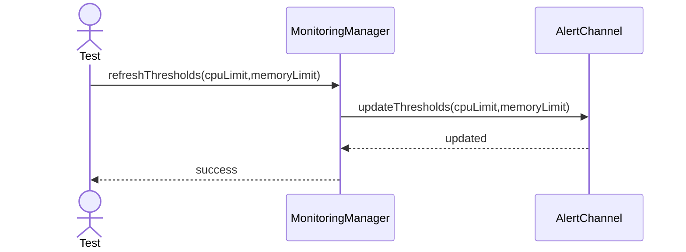

---

## 8. Start Collector

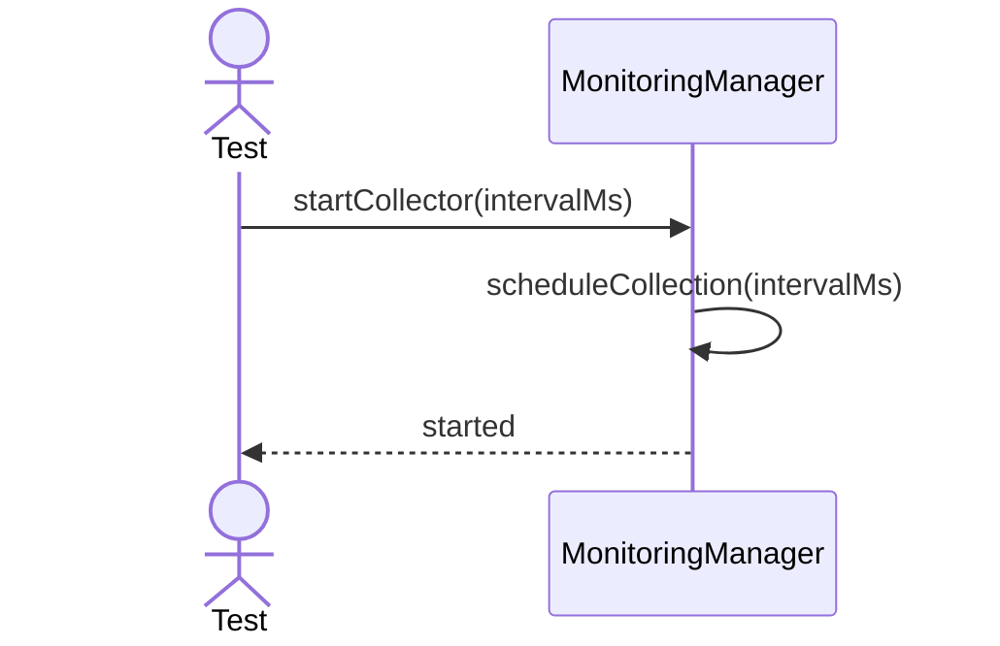

---

## 9. Stop Collector

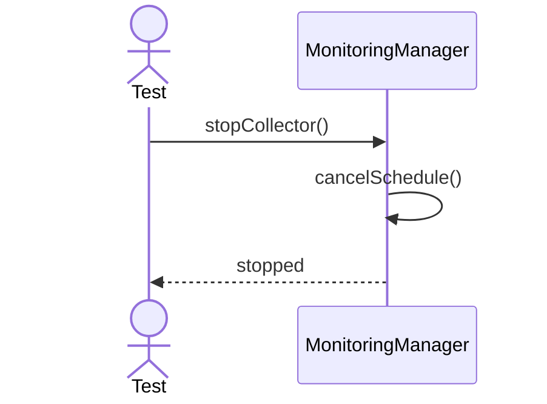

---

## 10. Report Health

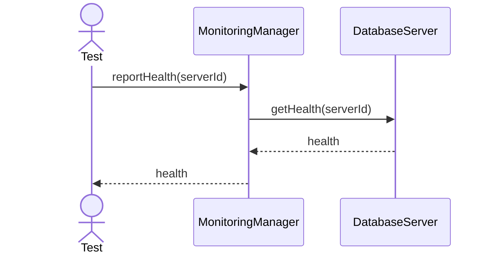

---

## 11. Sample Query Latency

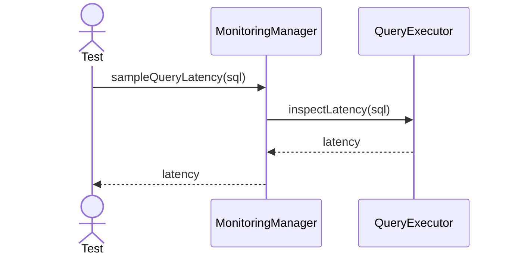

---

## 12. Sample Transaction Rate

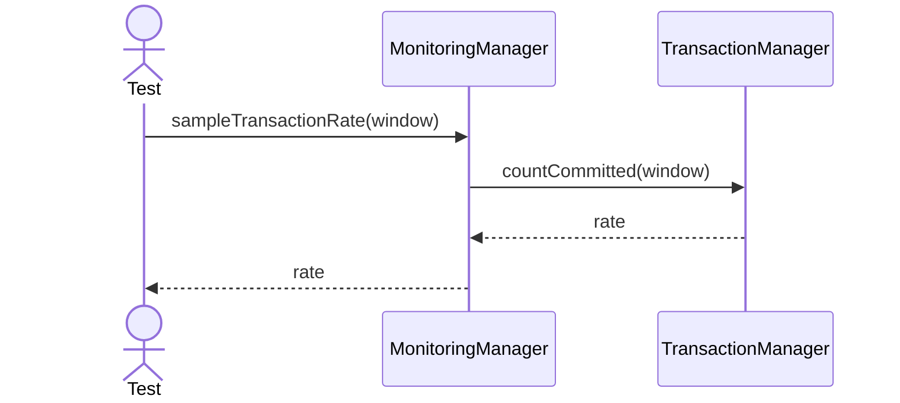

---

## 13. Export Alert History

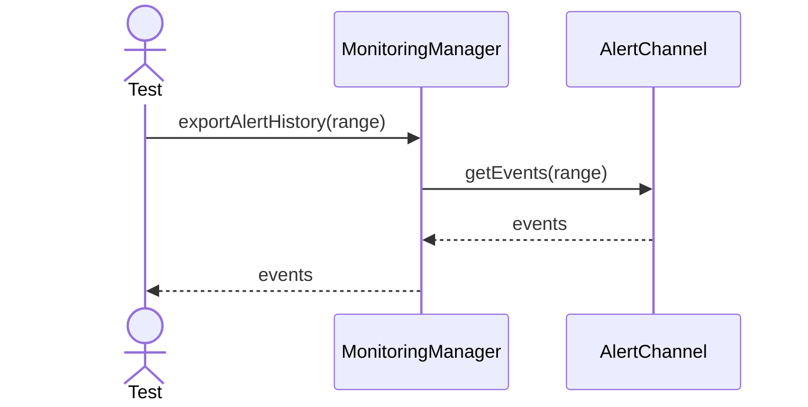
