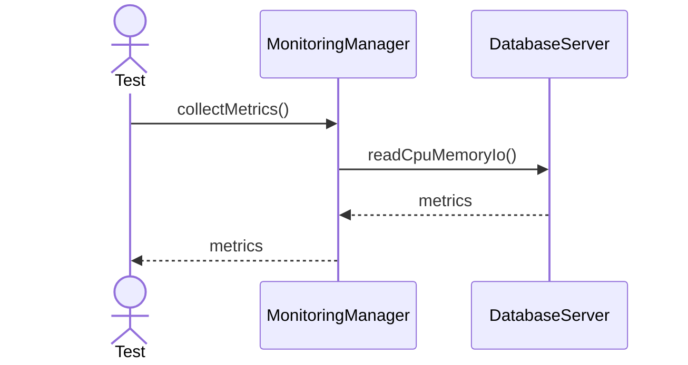
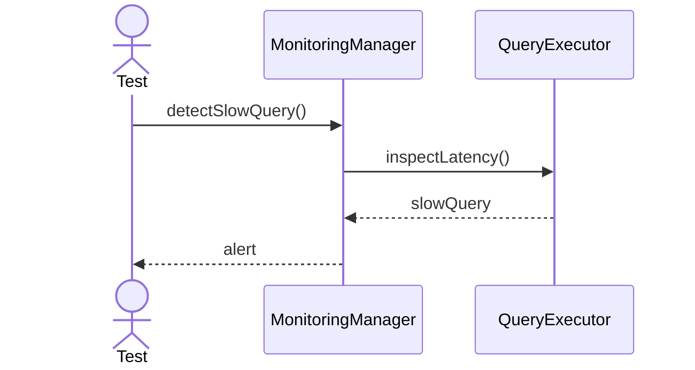
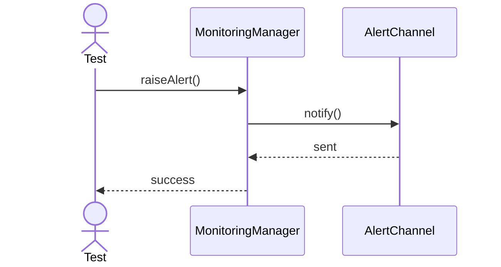

# MonitoringManager Testing - Main Functional Sequences

---

## 1. Collect Metrics

```mermaid
sequenceDiagram
actor Test
participant MonitoringManager
participant DatabaseServer

Test->>MonitoringManager: collectMetrics()
MonitoringManager->>DatabaseServer: readCpuMemoryIo()
DatabaseServer-->>MonitoringManager: metrics
MonitoringManager-->>Test: metrics
```

---

## 2. Detect Slow Query

```mermaid
sequenceDiagram
actor Test
participant MonitoringManager
participant QueryExecutor

Test->>MonitoringManager: detectSlowQuery()
MonitoringManager->>QueryExecutor: inspectLatency()
QueryExecutor-->>MonitoringManager: slowQuery
MonitoringManager-->>Test: alert
```

---

## 3. Raise Alert

```mermaid
sequenceDiagram
actor Test
participant MonitoringManager
participant AlertChannel

Test->>MonitoringManager: raiseAlert()
MonitoringManager->>AlertChannel: notify()
AlertChannel-->>MonitoringManager: sent
MonitoringManager-->>Test: success
```
