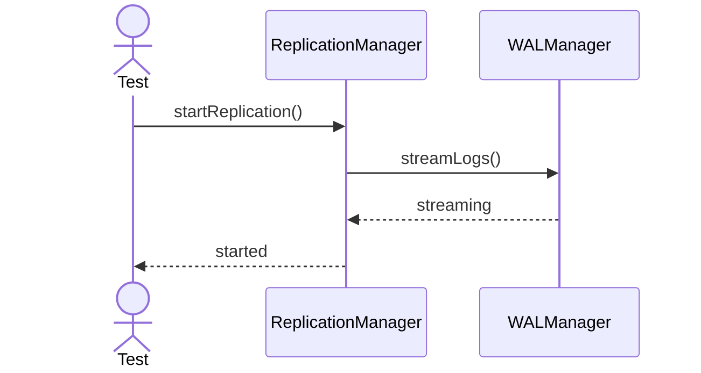
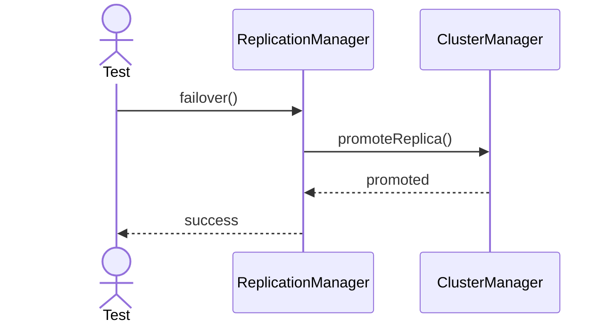
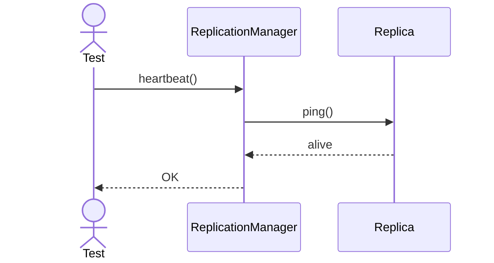

# ReplicationManager Testing - Main Functional Sequences

---

## 1. Start Replication

```mermaid
sequenceDiagram
actor Test
participant ReplicationManager
participant WALManager

Test->>ReplicationManager: startReplication()
ReplicationManager->>WALManager: streamLogs()
WALManager-->>ReplicationManager: streaming
ReplicationManager-->>Test: started
```

---

## 2. Failover

```mermaid
sequenceDiagram
actor Test
participant ReplicationManager
participant ClusterManager

Test->>ReplicationManager: failover()
ReplicationManager->>ClusterManager: promoteReplica()
ClusterManager-->>ReplicationManager: promoted
ReplicationManager-->>Test: success
```

---

## 3. Heartbeat

```mermaid
sequenceDiagram
actor Test
participant ReplicationManager
participant Replica

Test->>ReplicationManager: heartbeat()
ReplicationManager->>Replica: ping()
Replica-->>ReplicationManager: alive
ReplicationManager-->>Test: OK
```
