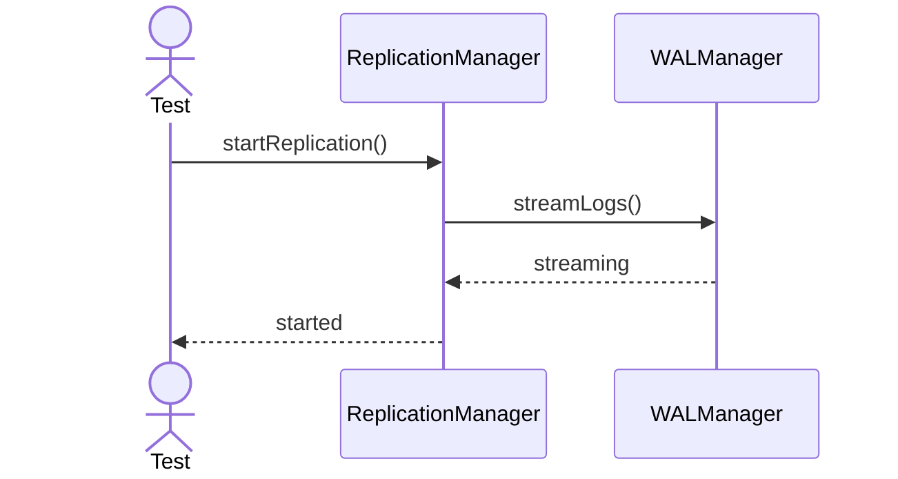
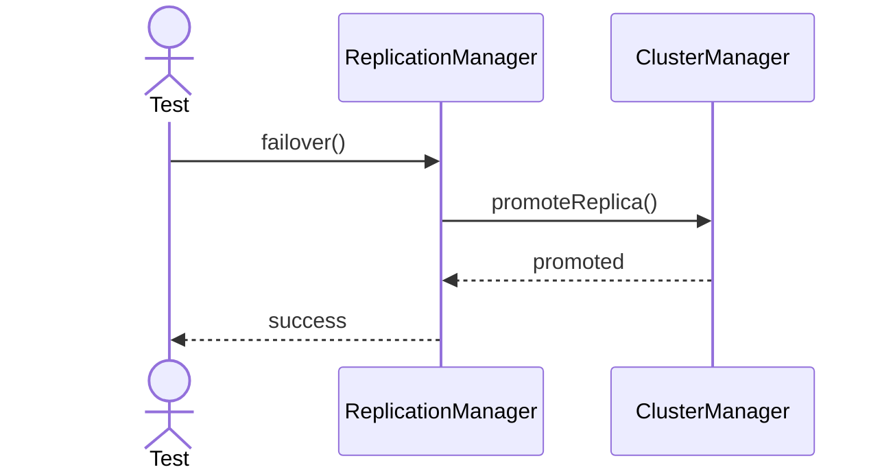
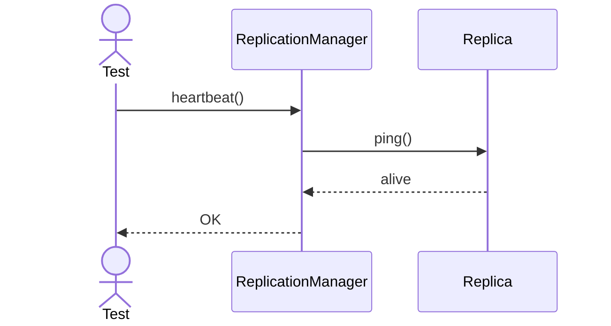
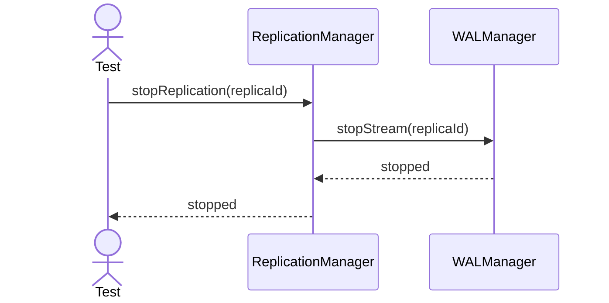
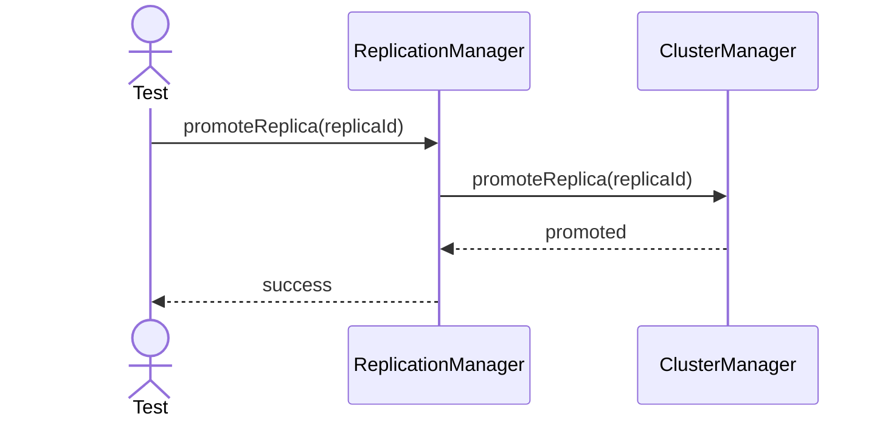
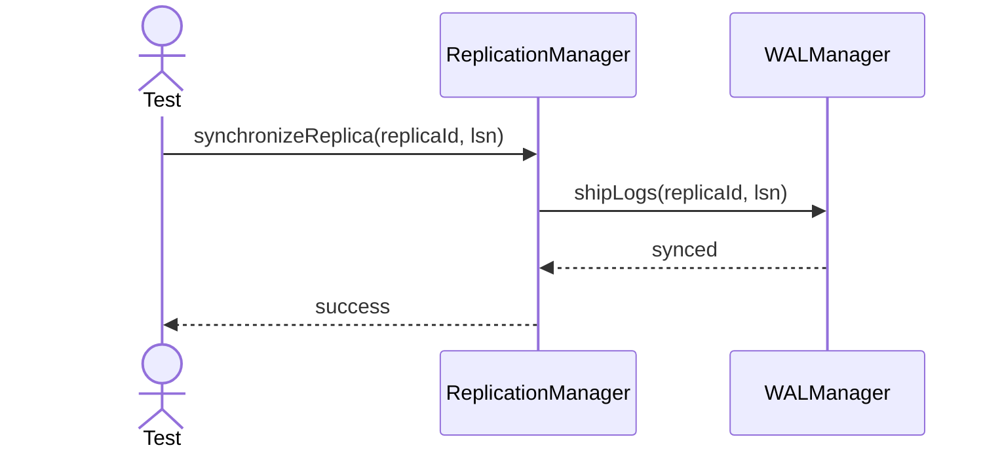
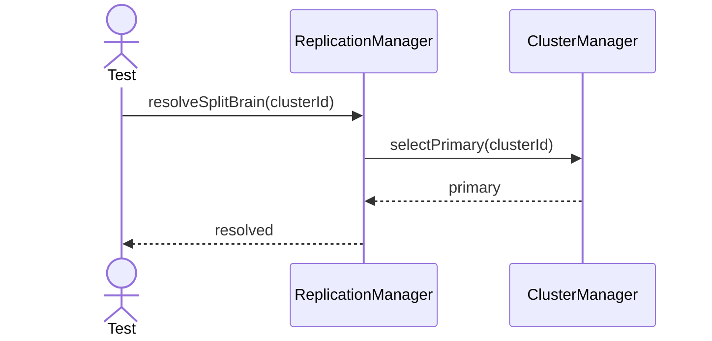
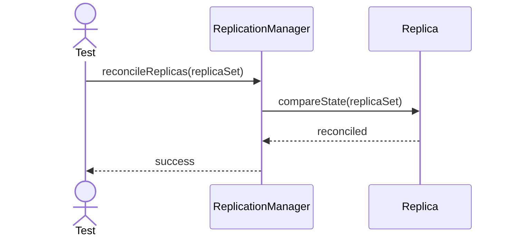
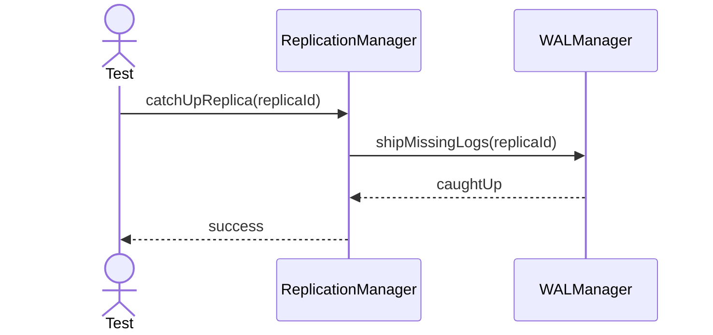
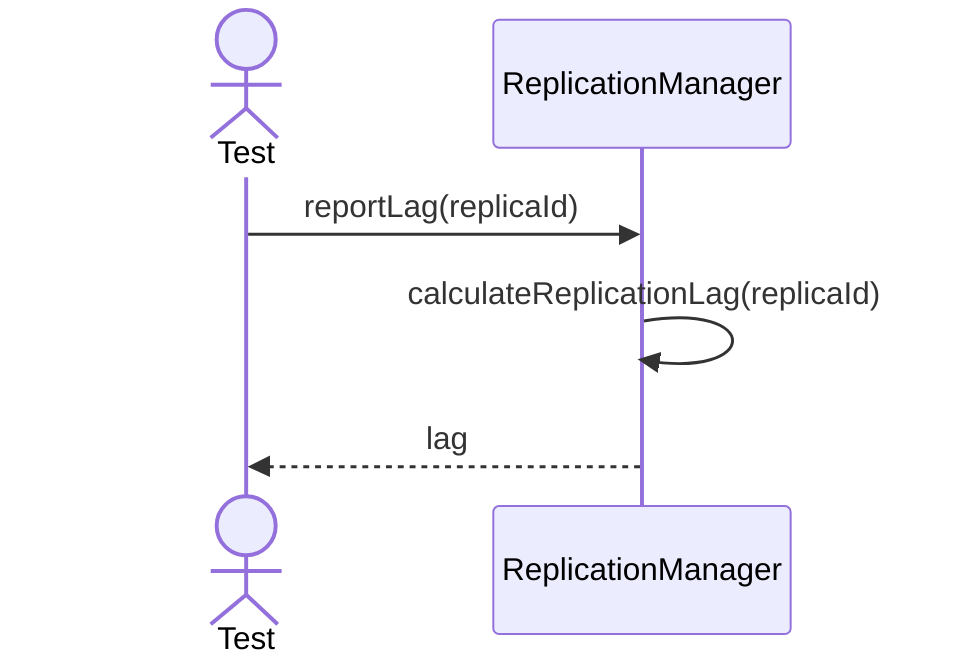

# ReplicationManager Testing - Main Functional Sequences

---

## 1. Start Replication

---

## 2. Failover

---

## 3. Heartbeat

---

## 4. Stop Replication

---

## 5. Promote Replica

---

## 6. Synchronize Replica

---

## 7. Resolve Split Brain

---

## 8. Reconcile Replicas

---

## 9. Catch Up Replica

---

## 10. Report Lag

