# BTreeIndex Testing - Main Functional Sequences

---

## 1. Insert

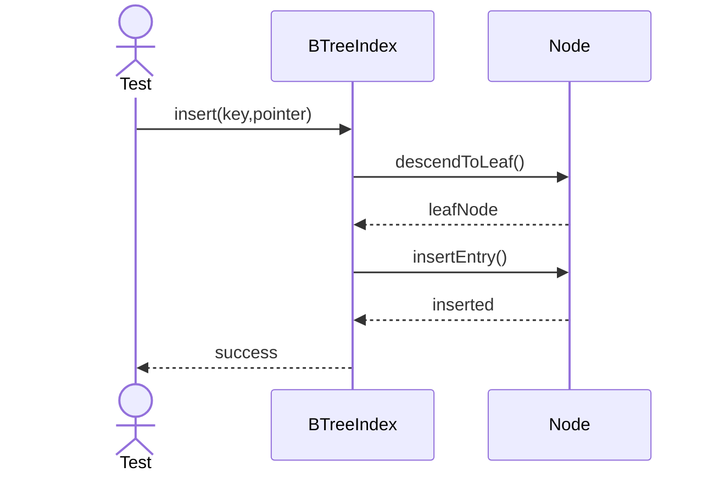
```mermaid
sequenceDiagram
actor Test
participant BTreeIndex
participant Node

Test->>BTreeIndex: insert(key,pointer)
BTreeIndex->>Node: descendToLeaf()
Node-->>BTreeIndex: leafNode
BTreeIndex->>Node: insertEntry()
Node-->>BTreeIndex: inserted
BTreeIndex-->>Test: success
```

---

## 2. Delete

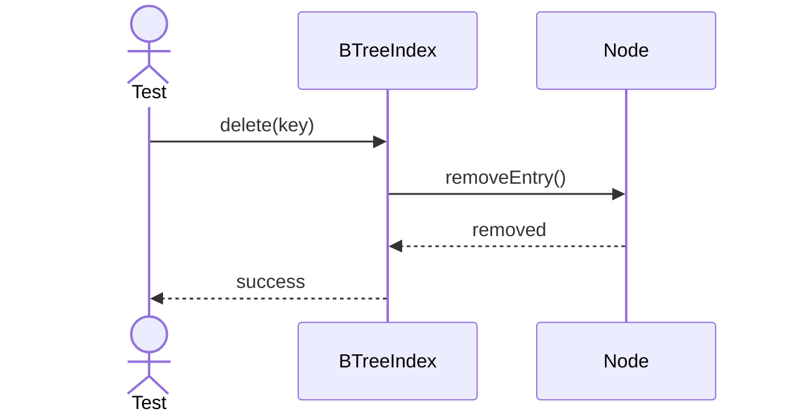
```mermaid
sequenceDiagram
actor Test
participant BTreeIndex
participant Node

Test->>BTreeIndex: delete(key)
BTreeIndex->>Node: removeEntry()
Node-->>BTreeIndex: removed
BTreeIndex-->>Test: success
```

---

## 3. Search

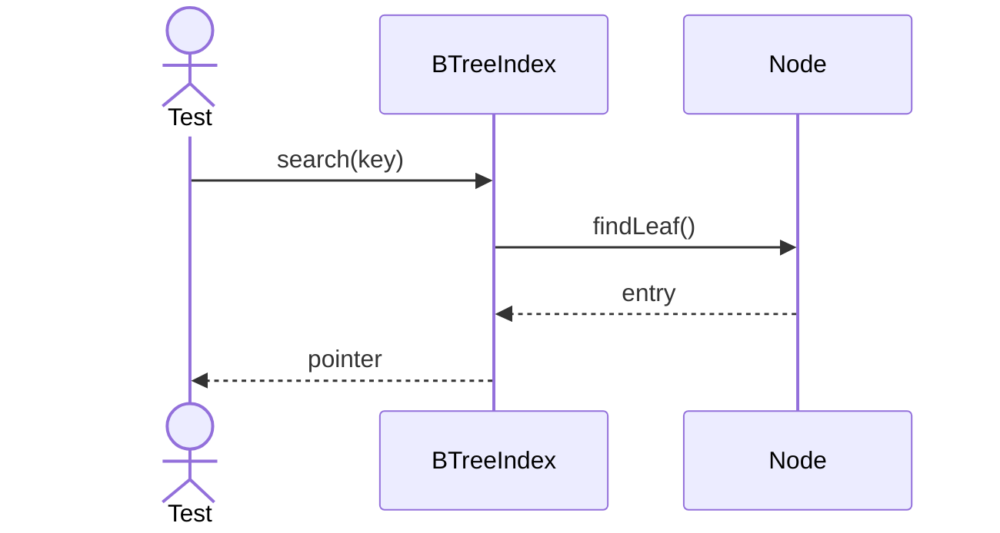
```mermaid
sequenceDiagram
actor Test
participant BTreeIndex
participant Node

Test->>BTreeIndex: search(key)
BTreeIndex->>Node: findLeaf()
Node-->>BTreeIndex: entry
BTreeIndex-->>Test: pointer
```

---

## 4. Range Scan

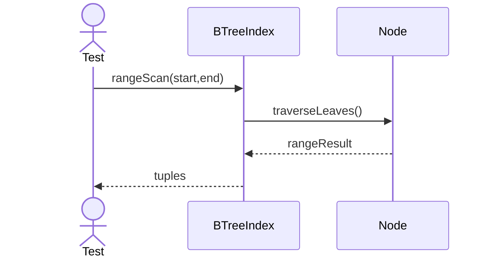
```mermaid
sequenceDiagram
actor Test
participant BTreeIndex
participant Node

Test->>BTreeIndex: rangeScan(start,end)
BTreeIndex->>Node: traverseLeaves()
Node-->>BTreeIndex: rangeResult
BTreeIndex-->>Test: tuples
```

---

## 5. Split Root

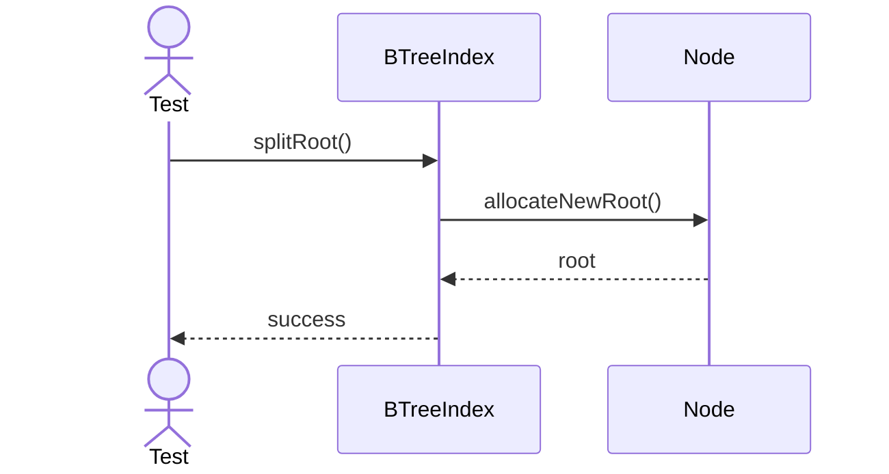
```mermaid
sequenceDiagram
actor Test
participant BTreeIndex
participant Node

Test->>BTreeIndex: splitRoot()
BTreeIndex->>Node: allocateNewRoot()
Node-->>BTreeIndex: root
BTreeIndex-->>Test: success
```

---

## 6. Merge Siblings

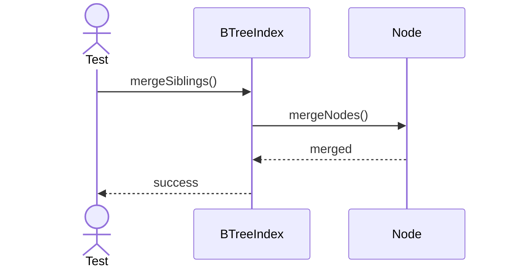
```mermaid
sequenceDiagram
actor Test
participant BTreeIndex
participant Node

Test->>BTreeIndex: mergeSiblings()
BTreeIndex->>Node: mergeNodes()
Node-->>BTreeIndex: merged
BTreeIndex-->>Test: success
```

---

## 7. Borrow From Left Sibling

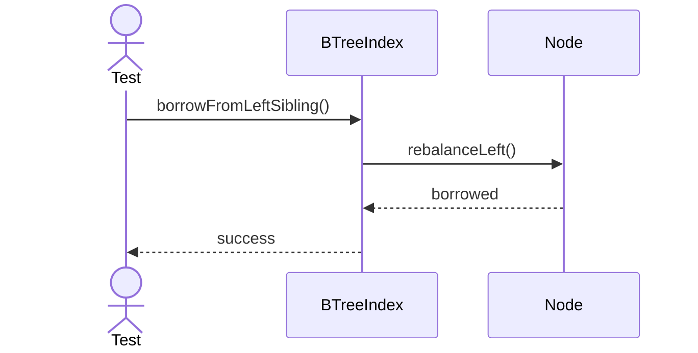
```mermaid
sequenceDiagram
actor Test
participant BTreeIndex
participant Node

Test->>BTreeIndex: borrowFromLeftSibling()
BTreeIndex->>Node: rebalanceLeft()
Node-->>BTreeIndex: borrowed
BTreeIndex-->>Test: success
```

---

## 8. Borrow From Right Sibling

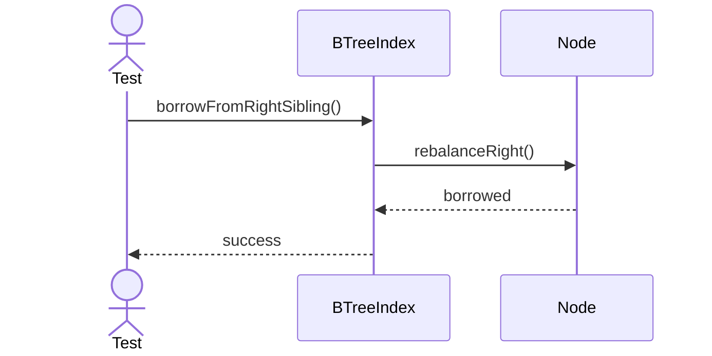
```mermaid
sequenceDiagram
actor Test
participant BTreeIndex
participant Node

Test->>BTreeIndex: borrowFromRightSibling()
BTreeIndex->>Node: rebalanceRight()
Node-->>BTreeIndex: borrowed
BTreeIndex-->>Test: success
```

---

## 9. Rebuild Tree

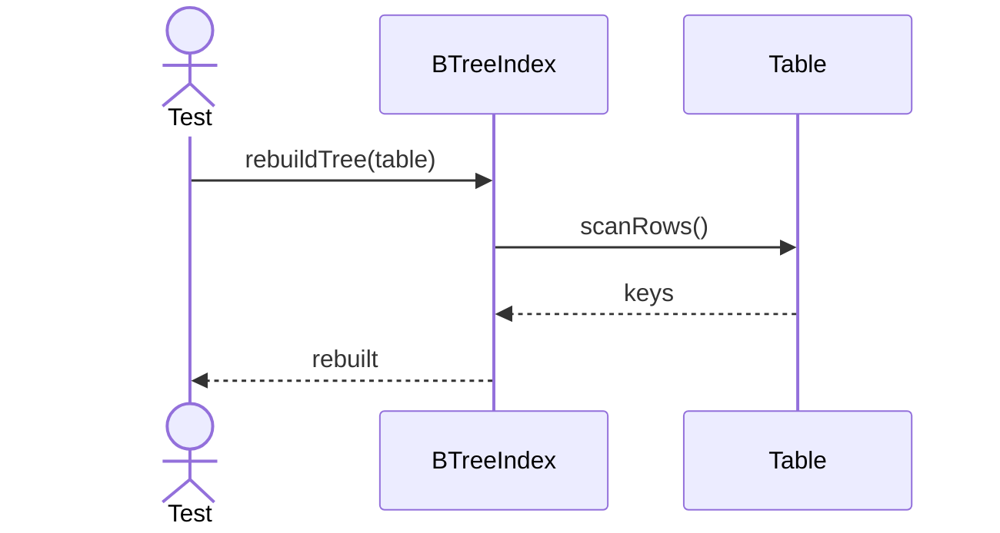
```mermaid
sequenceDiagram
actor Test
participant BTreeIndex
participant Table

Test->>BTreeIndex: rebuildTree(table)
BTreeIndex->>Table: scanRows()
Table-->>BTreeIndex: keys
BTreeIndex-->>Test: rebuilt
```

---

## 10. Validate Node Order

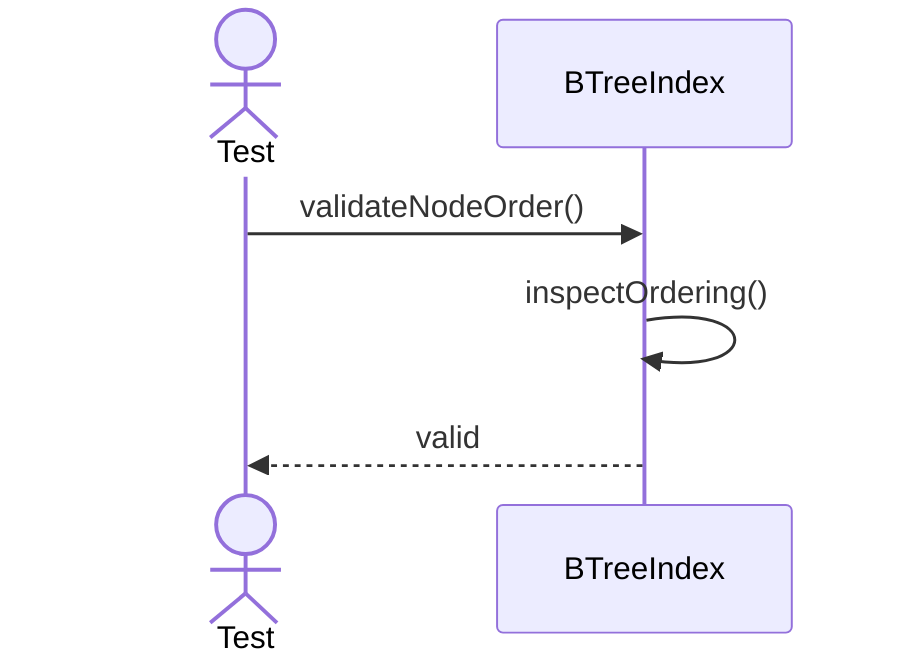
```mermaid
sequenceDiagram
actor Test
participant BTreeIndex

Test->>BTreeIndex: validateNodeOrder()
BTreeIndex->>BTreeIndex: inspectOrdering()
BTreeIndex-->>Test: valid
```

---

## 11. Validate Height

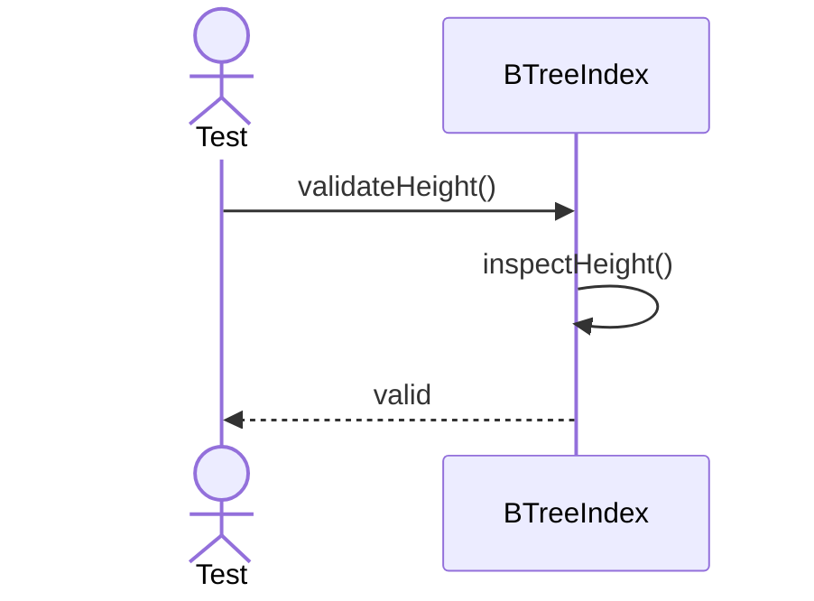
```mermaid
sequenceDiagram
actor Test
participant BTreeIndex

Test->>BTreeIndex: validateHeight()
BTreeIndex->>BTreeIndex: inspectHeight()
BTreeIndex-->>Test: valid
```

---

## 12. Validate Parent Links

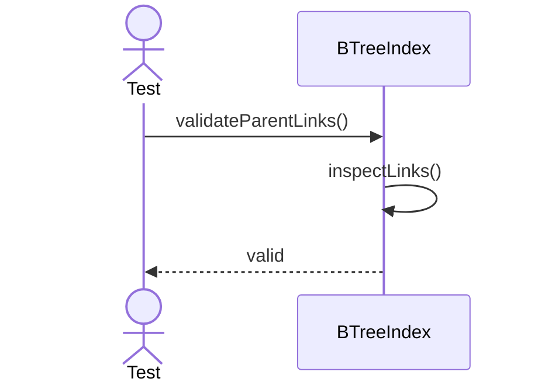
```mermaid
sequenceDiagram
actor Test
participant BTreeIndex

Test->>BTreeIndex: validateParentLinks()
BTreeIndex->>BTreeIndex: inspectLinks()
BTreeIndex-->>Test: valid
```

---

## 13. Export Structure

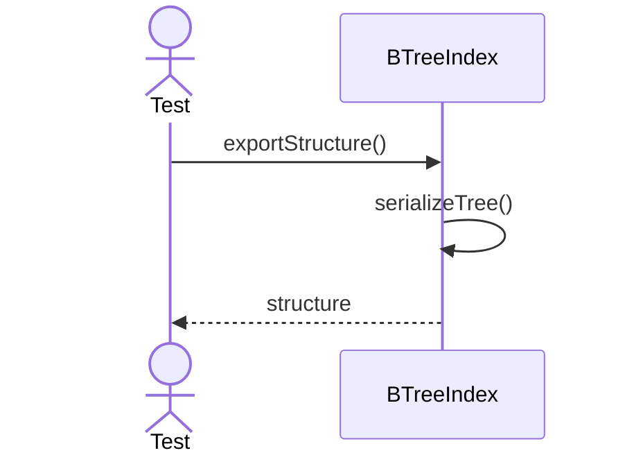
```mermaid
sequenceDiagram
actor Test
participant BTreeIndex

Test->>BTreeIndex: exportStructure()
BTreeIndex->>BTreeIndex: serializeTree()
BTreeIndex-->>Test: structure
```

---

## 14. Compact Tree

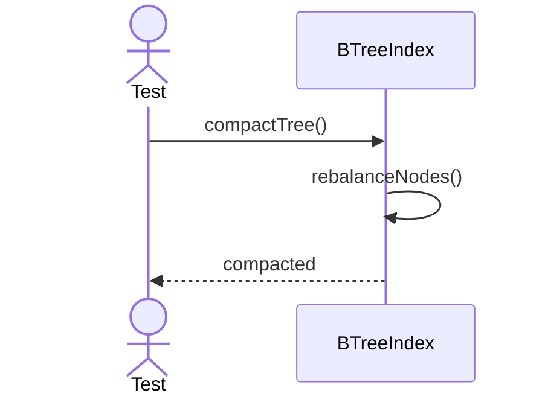
```mermaid
sequenceDiagram
actor Test
participant BTreeIndex

Test->>BTreeIndex: compactTree()
BTreeIndex->>BTreeIndex: rebalanceNodes()
BTreeIndex-->>Test: compacted
```

---

## 15. Inspect Leaves

```mermaid
sequenceDiagram
actor Test
participant BTreeIndex
participant Node

Test->>BTreeIndex: inspectLeaves()
BTreeIndex->>Node: iterateLeaves()
Node-->>BTreeIndex: leaves
BTreeIndex-->>Test: leaves
```

---

## 16. Inspect Internal Nodes

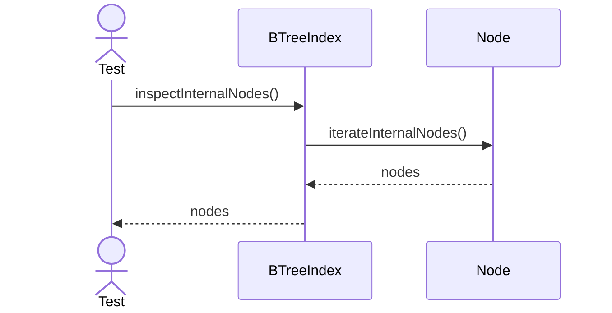
```mermaid
sequenceDiagram
actor Test
participant BTreeIndex
participant Node

Test->>BTreeIndex: inspectInternalNodes()
BTreeIndex->>Node: iterateInternalNodes()
Node-->>BTreeIndex: nodes
BTreeIndex-->>Test: nodes
```

---

## 17. Verify Range Boundaries

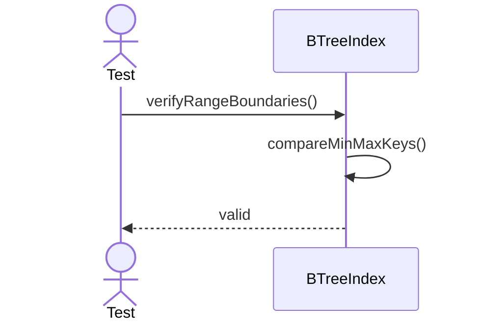
```mermaid
sequenceDiagram
actor Test
participant BTreeIndex

Test->>BTreeIndex: verifyRangeBoundaries()
BTreeIndex->>BTreeIndex: compareMinMaxKeys()
BTreeIndex-->>Test: valid
```

---

## 18. Refresh Root Pointer

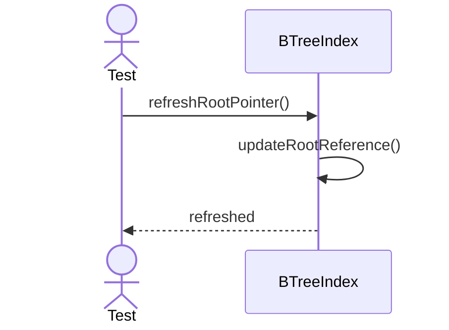
```mermaid
sequenceDiagram
actor Test
participant BTreeIndex

Test->>BTreeIndex: refreshRootPointer()
BTreeIndex->>BTreeIndex: updateRootReference()
BTreeIndex-->>Test: refreshed
```

---

## 19. Reset Tree Cache

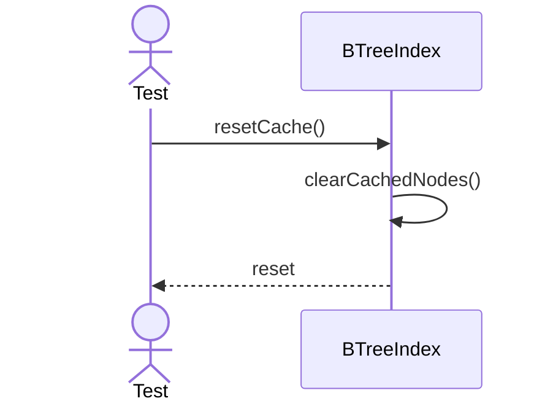
```mermaid
sequenceDiagram
actor Test
participant BTreeIndex

Test->>BTreeIndex: resetCache()
BTreeIndex->>BTreeIndex: clearCachedNodes()
BTreeIndex-->>Test: reset
```

---

## 20. Export Index Report

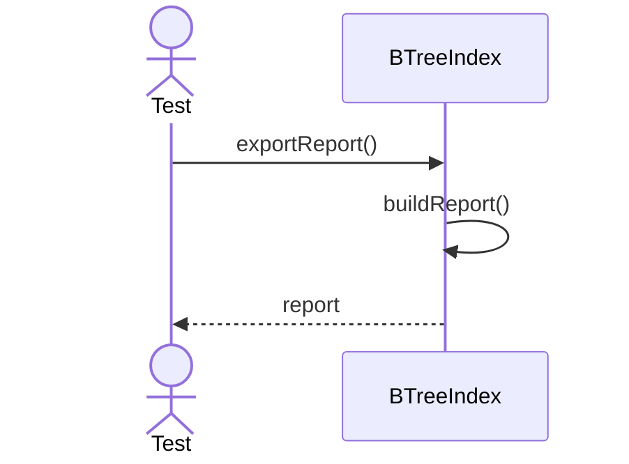
```mermaid
sequenceDiagram
actor Test
participant BTreeIndex

Test->>BTreeIndex: exportReport()
BTreeIndex->>BTreeIndex: buildReport()
BTreeIndex-->>Test: report
```
