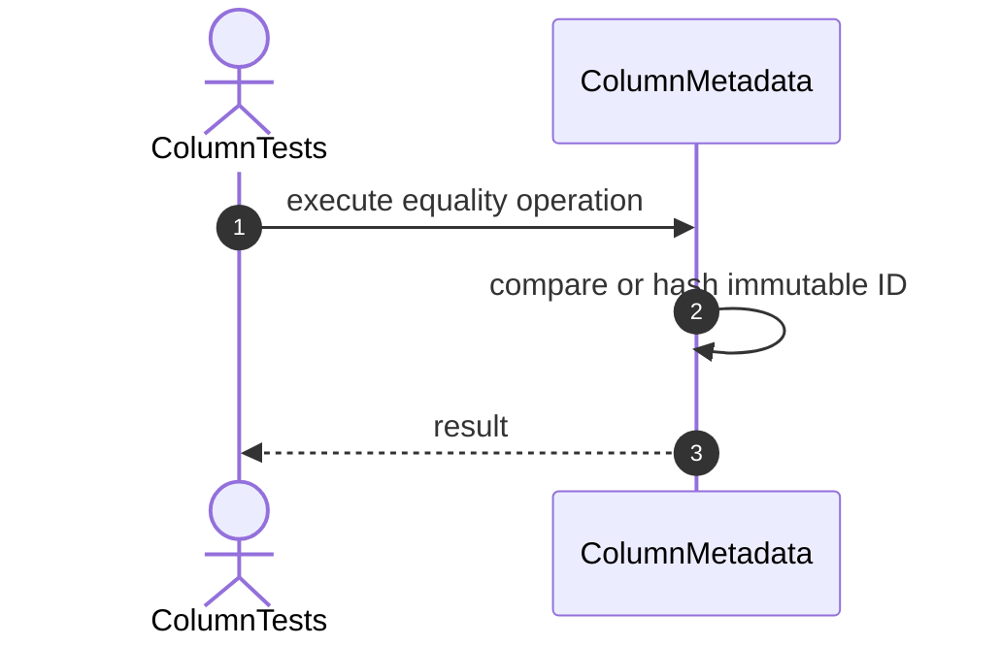
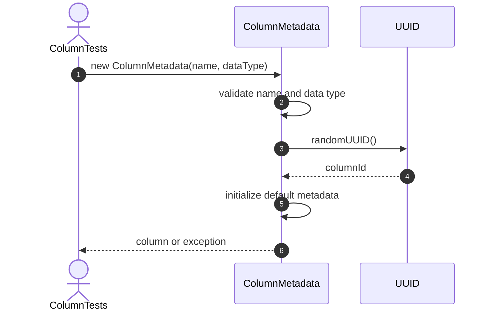
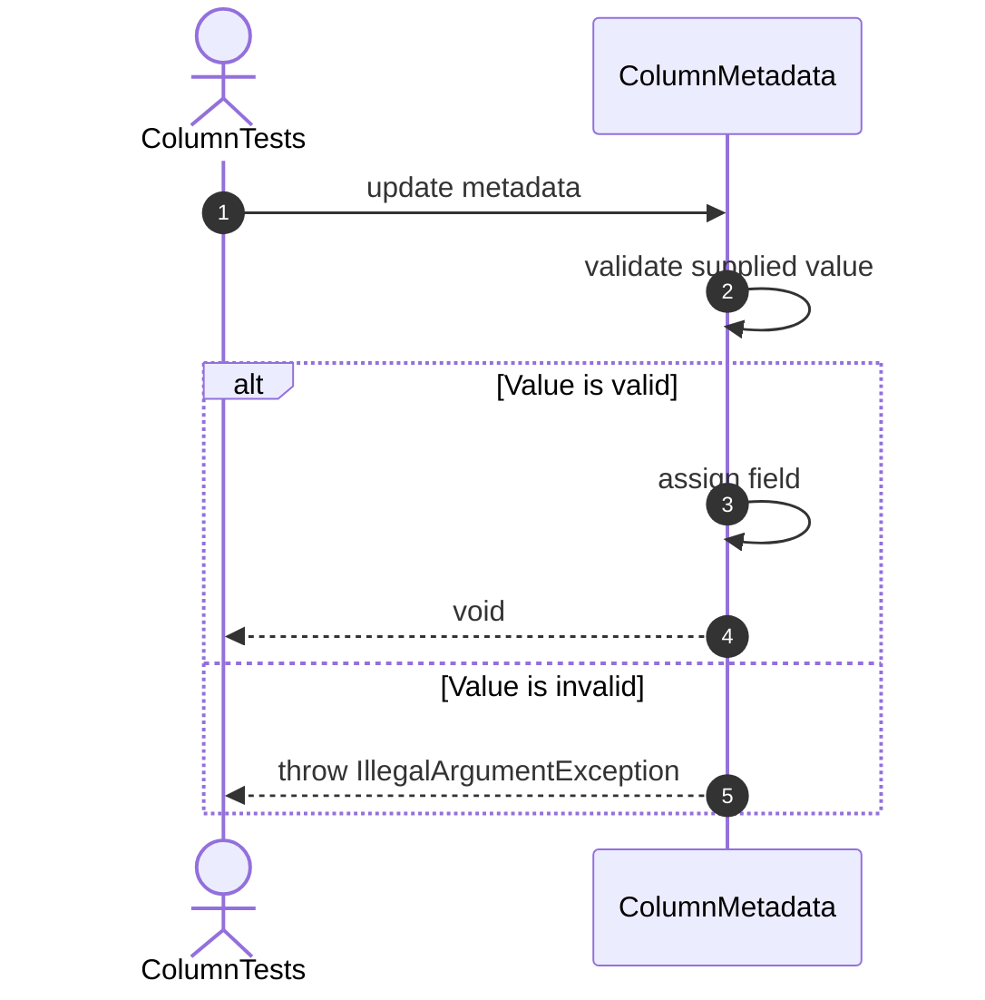
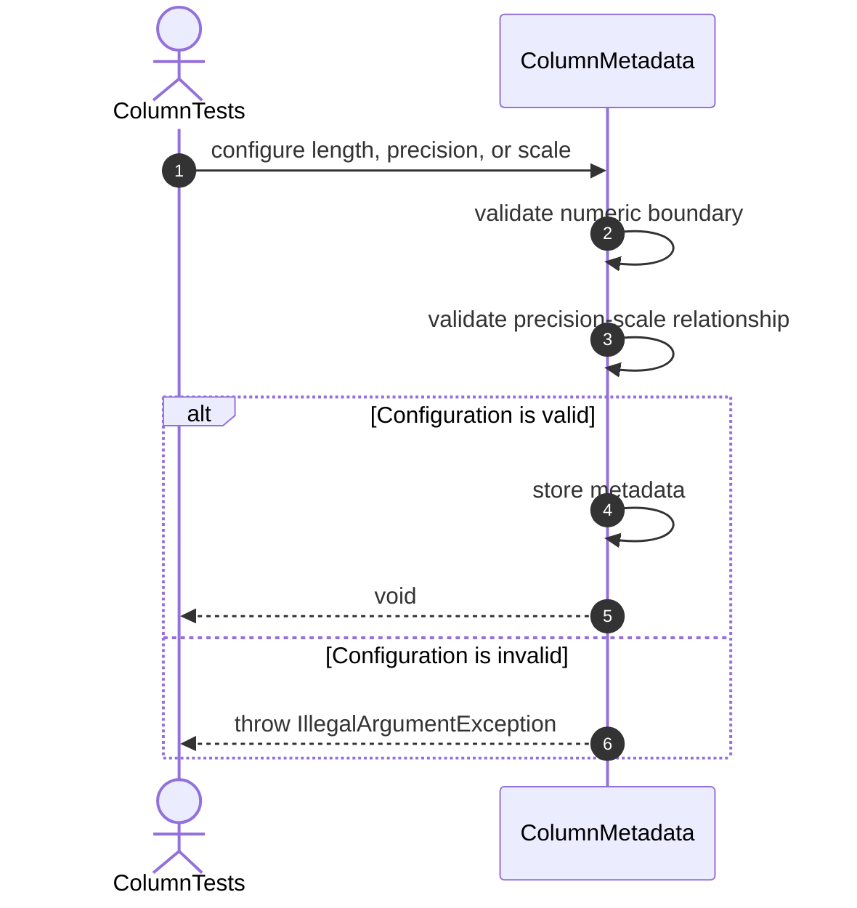

# ColumnMetadata Testing Sequence Diagrams

One Mermaid sequence diagram is included for every implemented `ColumnTests` method.

# Other Tests

## 1. setUp



# Constructor Tests

## 2. constructor_ShouldCreateColumn



## 3. constructor_ShouldGenerateColumnId


## 4. constructor_ShouldGenerateUniqueColumnIds


## 5. constructor_ShouldInitializeNameAndType


## 6. constructor_ShouldInitializeNullableAsTrue


## 7. constructor_ShouldInitializeDefaultPosition


## 8. constructor_ShouldInitializeIdentityAsFalse


## 9. constructor_ShouldRejectInvalidName


## 10. constructor_ShouldRejectNullDataType


# Metadata Tests

## 11. rename_ShouldChangeColumnName



## 12. rename_ShouldRejectInvalidName


## 13. setDataType_ShouldChangeDataType


## 14. setDataType_ShouldRejectNull


## 15. setNullable_ShouldChangeNullableState


## 16. setPosition_ShouldChangePosition


## 17. setPosition_ShouldRejectNegativePosition


# Length Tests

## 18. setLength_ShouldStorePositiveLength



## 19. setLength_ShouldAllowNull


## 20. setLength_ShouldRejectZero


## 21. setLength_ShouldRejectNegativeLength

```mermaid
sequenceDiagram
    autonumber
    actor Test as ColumnTests
    participant Column as ColumnMetadata

    Test->>Column: configure length, precision, or scale
    Column->>Column: validate numeric boundary
    Column->>Column: validate precision-scale relationship
    alt Configuration is valid
    Column->>Column: store metadata
    Column-->>Test: void
    else Configuration is invalid
    Column-->>Test: throw IllegalArgumentException
    end
```

# Value Validation Tests

## 22. validateValue_ShouldRejectStringLongerThanLength

```mermaid
sequenceDiagram
    autonumber
    actor Test as ColumnTests
    participant Column as ColumnMetadata

    Test->>Column: validateValue(value)
    Column->>Column: check nullability
    Column->>Column: check data-type compatibility
    Column->>Column: check maximum string length
    Column-->>Test: true or exception
```

# Precision and Scale Tests

## 23. setPrecision_ShouldStorePositivePrecision

```mermaid
sequenceDiagram
    autonumber
    actor Test as ColumnTests
    participant Column as ColumnMetadata

    Test->>Column: configure length, precision, or scale
    Column->>Column: validate numeric boundary
    Column->>Column: validate precision-scale relationship
    alt Configuration is valid
    Column->>Column: store metadata
    Column-->>Test: void
    else Configuration is invalid
    Column-->>Test: throw IllegalArgumentException
    end
```

## 24. setPrecision_ShouldRejectInvalidPrecision

```mermaid
sequenceDiagram
    autonumber
    actor Test as ColumnTests
    participant Column as ColumnMetadata

    Test->>Column: configure length, precision, or scale
    Column->>Column: validate numeric boundary
    Column->>Column: validate precision-scale relationship
    alt Configuration is valid
    Column->>Column: store metadata
    Column-->>Test: void
    else Configuration is invalid
    Column-->>Test: throw IllegalArgumentException
    end
```

## 25. setScale_ShouldStoreNonNegativeScale

```mermaid
sequenceDiagram
    autonumber
    actor Test as ColumnTests
    participant Column as ColumnMetadata

    Test->>Column: configure length, precision, or scale
    Column->>Column: validate numeric boundary
    Column->>Column: validate precision-scale relationship
    alt Configuration is valid
    Column->>Column: store metadata
    Column-->>Test: void
    else Configuration is invalid
    Column-->>Test: throw IllegalArgumentException
    end
```

## 26. setScale_ShouldRejectNegativeScale

```mermaid
sequenceDiagram
    autonumber
    actor Test as ColumnTests
    participant Column as ColumnMetadata

    Test->>Column: configure length, precision, or scale
    Column->>Column: validate numeric boundary
    Column->>Column: validate precision-scale relationship
    alt Configuration is valid
    Column->>Column: store metadata
    Column-->>Test: void
    else Configuration is invalid
    Column-->>Test: throw IllegalArgumentException
    end
```

## 27. setScale_ShouldRejectScaleGreaterThanPrecision

```mermaid
sequenceDiagram
    autonumber
    actor Test as ColumnTests
    participant Column as ColumnMetadata

    Test->>Column: configure length, precision, or scale
    Column->>Column: validate numeric boundary
    Column->>Column: validate precision-scale relationship
    alt Configuration is valid
    Column->>Column: store metadata
    Column-->>Test: void
    else Configuration is invalid
    Column-->>Test: throw IllegalArgumentException
    end
```

## 28. setPrecision_ShouldRejectPrecisionBelowExistingScale

```mermaid
sequenceDiagram
    autonumber
    actor Test as ColumnTests
    participant Column as ColumnMetadata

    Test->>Column: configure length, precision, or scale
    Column->>Column: validate numeric boundary
    Column->>Column: validate precision-scale relationship
    alt Configuration is valid
    Column->>Column: store metadata
    Column-->>Test: void
    else Configuration is invalid
    Column-->>Test: throw IllegalArgumentException
    end
```

# Default Value Tests

## 29. setDefaultValue_ShouldStoreCompatibleValue

```mermaid
sequenceDiagram
    autonumber
    actor Test as ColumnTests
    participant Column as ColumnMetadata

    Test->>Column: setDefaultValue(value)
    Column->>Column: isValueCompatible(value)
    alt Compatible or null
    Column->>Column: defaultValue = value
    Column-->>Test: void
    else Incompatible
    Column-->>Test: throw IllegalArgumentException
    end
```

## 30. setDefaultValue_ShouldAllowNull

```mermaid
sequenceDiagram
    autonumber
    actor Test as ColumnTests
    participant Column as ColumnMetadata

    Test->>Column: setDefaultValue(value)
    Column->>Column: isValueCompatible(value)
    alt Compatible or null
    Column->>Column: defaultValue = value
    Column-->>Test: void
    else Incompatible
    Column-->>Test: throw IllegalArgumentException
    end
```

## 31. setDefaultValue_ShouldRejectIncompatibleValue

```mermaid
sequenceDiagram
    autonumber
    actor Test as ColumnTests
    participant Column as ColumnMetadata

    Test->>Column: setDefaultValue(value)
    Column->>Column: isValueCompatible(value)
    alt Compatible or null
    Column->>Column: defaultValue = value
    Column-->>Test: void
    else Incompatible
    Column-->>Test: throw IllegalArgumentException
    end
```

# Value Validation Tests

## 32. validateValue_ShouldAcceptCompatibleValue

```mermaid
sequenceDiagram
    autonumber
    actor Test as ColumnTests
    participant Column as ColumnMetadata

    Test->>Column: validateValue(value)
    Column->>Column: check nullability
    Column->>Column: check data-type compatibility
    Column->>Column: check maximum string length
    Column-->>Test: true or exception
```

## 33. validateValue_ShouldAllowNullWhenNullable

```mermaid
sequenceDiagram
    autonumber
    actor Test as ColumnTests
    participant Column as ColumnMetadata

    Test->>Column: validateValue(value)
    Column->>Column: check nullability
    Column->>Column: check data-type compatibility
    Column->>Column: check maximum string length
    Column-->>Test: true or exception
```

## 34. validateValue_ShouldRejectNullWhenNotNullable

```mermaid
sequenceDiagram
    autonumber
    actor Test as ColumnTests
    participant Column as ColumnMetadata

    Test->>Column: validateValue(value)
    Column->>Column: check nullability
    Column->>Column: check data-type compatibility
    Column->>Column: check maximum string length
    Column-->>Test: true or exception
```

## 35. validateValue_ShouldRejectIncompatibleValue

```mermaid
sequenceDiagram
    autonumber
    actor Test as ColumnTests
    participant Column as ColumnMetadata

    Test->>Column: validateValue(value)
    Column->>Column: check nullability
    Column->>Column: check data-type compatibility
    Column->>Column: check maximum string length
    Column-->>Test: true or exception
```

# Value Resolution Tests

## 36. resolveValue_ShouldReturnSuppliedValue

```mermaid
sequenceDiagram
    autonumber
    actor Test as ColumnTests
    participant Column as ColumnMetadata

    Test->>Column: resolveValue(suppliedValue)
    alt Supplied value exists
    Column->>Column: validateValue(suppliedValue)
    Column-->>Test: suppliedValue
    else Identity is enabled
    Column->>Column: generateNextIdentityValue()
    Column-->>Test: generated value
    else Default exists
    Column-->>Test: default value
    else Column is nullable
    Column-->>Test: null
    else Required value is missing
    Column-->>Test: throw IllegalArgumentException
    end
```

## 37. resolveValue_ShouldUseDefaultValue

```mermaid
sequenceDiagram
    autonumber
    actor Test as ColumnTests
    participant Column as ColumnMetadata

    Test->>Column: resolveValue(suppliedValue)
    alt Supplied value exists
    Column->>Column: validateValue(suppliedValue)
    Column-->>Test: suppliedValue
    else Identity is enabled
    Column->>Column: generateNextIdentityValue()
    Column-->>Test: generated value
    else Default exists
    Column-->>Test: default value
    else Column is nullable
    Column-->>Test: null
    else Required value is missing
    Column-->>Test: throw IllegalArgumentException
    end
```

## 38. resolveValue_ShouldReturnNullWhenNullable

```mermaid
sequenceDiagram
    autonumber
    actor Test as ColumnTests
    participant Column as ColumnMetadata

    Test->>Column: resolveValue(suppliedValue)
    alt Supplied value exists
    Column->>Column: validateValue(suppliedValue)
    Column-->>Test: suppliedValue
    else Identity is enabled
    Column->>Column: generateNextIdentityValue()
    Column-->>Test: generated value
    else Default exists
    Column-->>Test: default value
    else Column is nullable
    Column-->>Test: null
    else Required value is missing
    Column-->>Test: throw IllegalArgumentException
    end
```

## 39. resolveValue_ShouldRejectMissingRequiredValue

```mermaid
sequenceDiagram
    autonumber
    actor Test as ColumnTests
    participant Column as ColumnMetadata

    Test->>Column: resolveValue(suppliedValue)
    alt Supplied value exists
    Column->>Column: validateValue(suppliedValue)
    Column-->>Test: suppliedValue
    else Identity is enabled
    Column->>Column: generateNextIdentityValue()
    Column-->>Test: generated value
    else Default exists
    Column-->>Test: default value
    else Column is nullable
    Column-->>Test: null
    else Required value is missing
    Column-->>Test: throw IllegalArgumentException
    end
```

# Identity Tests

## 40. setIdentity_ShouldEnableIdentity

```mermaid
sequenceDiagram
    autonumber
    actor Test as ColumnTests
    participant Column as ColumnMetadata

    Test->>Column: execute identity operation
    Column->>Column: validate identity configuration
    alt Operation is valid
    Column->>Column: read or increment counter
    Column-->>Test: value or void
    else Operation is invalid
    Column-->>Test: throw exception
    end
```

## 41. generateNextIdentityValue_ShouldReturnCurrentValue

```mermaid
sequenceDiagram
    autonumber
    actor Test as ColumnTests
    participant Column as ColumnMetadata

    Test->>Column: execute identity operation
    Column->>Column: validate identity configuration
    alt Operation is valid
    Column->>Column: read or increment counter
    Column-->>Test: value or void
    else Operation is invalid
    Column-->>Test: throw exception
    end
```

## 42. generateNextIdentityValue_ShouldIncrementCounter

```mermaid
sequenceDiagram
    autonumber
    actor Test as ColumnTests
    participant Column as ColumnMetadata

    Test->>Column: execute identity operation
    Column->>Column: validate identity configuration
    alt Operation is valid
    Column->>Column: read or increment counter
    Column-->>Test: value or void
    else Operation is invalid
    Column-->>Test: throw exception
    end
```

## 43. generateNextIdentityValue_ShouldGenerateSequentialValues

```mermaid
sequenceDiagram
    autonumber
    actor Test as ColumnTests
    participant Column as ColumnMetadata

    Test->>Column: execute identity operation
    Column->>Column: validate identity configuration
    alt Operation is valid
    Column->>Column: read or increment counter
    Column-->>Test: value or void
    else Operation is invalid
    Column-->>Test: throw exception
    end
```

## 44. generateNextIdentityValue_ShouldRejectNonIdentityColumn

```mermaid
sequenceDiagram
    autonumber
    actor Test as ColumnTests
    participant Column as ColumnMetadata

    Test->>Column: execute identity operation
    Column->>Column: validate identity configuration
    alt Operation is valid
    Column->>Column: read or increment counter
    Column-->>Test: value or void
    else Operation is invalid
    Column-->>Test: throw exception
    end
```

## 45. setNextIdentityValue_ShouldChangeCounter

```mermaid
sequenceDiagram
    autonumber
    actor Test as ColumnTests
    participant Column as ColumnMetadata

    Test->>Column: execute identity operation
    Column->>Column: validate identity configuration
    alt Operation is valid
    Column->>Column: read or increment counter
    Column-->>Test: value or void
    else Operation is invalid
    Column-->>Test: throw exception
    end
```

## 46. setNextIdentityValue_ShouldRejectInvalidValue

```mermaid
sequenceDiagram
    autonumber
    actor Test as ColumnTests
    participant Column as ColumnMetadata

    Test->>Column: execute identity operation
    Column->>Column: validate identity configuration
    alt Operation is valid
    Column->>Column: read or increment counter
    Column-->>Test: value or void
    else Operation is invalid
    Column-->>Test: throw exception
    end
```

# Value Resolution Tests

## 47. resolveValue_ShouldGenerateIdentityWhenValueMissing

```mermaid
sequenceDiagram
    autonumber
    actor Test as ColumnTests
    participant Column as ColumnMetadata

    Test->>Column: resolveValue(suppliedValue)
    alt Supplied value exists
    Column->>Column: validateValue(suppliedValue)
    Column-->>Test: suppliedValue
    else Identity is enabled
    Column->>Column: generateNextIdentityValue()
    Column-->>Test: generated value
    else Default exists
    Column-->>Test: default value
    else Column is nullable
    Column-->>Test: null
    else Required value is missing
    Column-->>Test: throw IllegalArgumentException
    end
```

## 48. resolveValue_ShouldPreferSuppliedValueOverIdentity

```mermaid
sequenceDiagram
    autonumber
    actor Test as ColumnTests
    participant Column as ColumnMetadata

    Test->>Column: resolveValue(suppliedValue)
    alt Supplied value exists
    Column->>Column: validateValue(suppliedValue)
    Column-->>Test: suppliedValue
    else Identity is enabled
    Column->>Column: generateNextIdentityValue()
    Column-->>Test: generated value
    else Default exists
    Column-->>Test: default value
    else Column is nullable
    Column-->>Test: null
    else Required value is missing
    Column-->>Test: throw IllegalArgumentException
    end
```

# Definition Tests

## 49. isValidDefinition_ShouldReturnTrueForValidColumn

```mermaid
sequenceDiagram
    autonumber
    actor Test as ColumnTests
    participant Column as ColumnMetadata

    Test->>Column: isValidDefinition()
    Column->>Column: validate ID, name, type, and position
    Column->>Column: validate length, precision, and scale
    Column-->>Test: true or false
```

## 50. isValidDefinition_ShouldRemainValidWithLength

```mermaid
sequenceDiagram
    autonumber
    actor Test as ColumnTests
    participant Column as ColumnMetadata

    Test->>Column: isValidDefinition()
    Column->>Column: validate ID, name, type, and position
    Column->>Column: validate length, precision, and scale
    Column-->>Test: true or false
```

## 51. isValidDefinition_ShouldRemainValidWithPrecisionAndScale

```mermaid
sequenceDiagram
    autonumber
    actor Test as ColumnTests
    participant Column as ColumnMetadata

    Test->>Column: isValidDefinition()
    Column->>Column: validate ID, name, type, and position
    Column->>Column: validate length, precision, and scale
    Column-->>Test: true or false
```

# Equality Tests

## 52. equals_ShouldReturnTrueForSameInstance

```mermaid
sequenceDiagram
    autonumber
    actor Test as ColumnTests
    participant Column as ColumnMetadata

    Test->>Column: execute equality operation
    Column->>Column: compare or hash immutable ID
    Column-->>Test: result
```

## 53. equals_ShouldReturnFalseForDifferentColumns

```mermaid
sequenceDiagram
    autonumber
    actor Test as ColumnTests
    participant Column as ColumnMetadata

    Test->>Column: execute equality operation
    Column->>Column: compare or hash immutable ID
    Column-->>Test: result
```

## 54. equals_ShouldReturnFalseForNull

```mermaid
sequenceDiagram
    autonumber
    actor Test as ColumnTests
    participant Column as ColumnMetadata

    Test->>Column: execute equality operation
    Column->>Column: compare or hash immutable ID
    Column-->>Test: result
```

## 55. hashCode_ShouldRemainStable

```mermaid
sequenceDiagram
    autonumber
    actor Test as ColumnTests
    participant Column as ColumnMetadata

    Test->>Column: execute equality operation
    Column->>Column: compare or hash immutable ID
    Column-->>Test: result
```