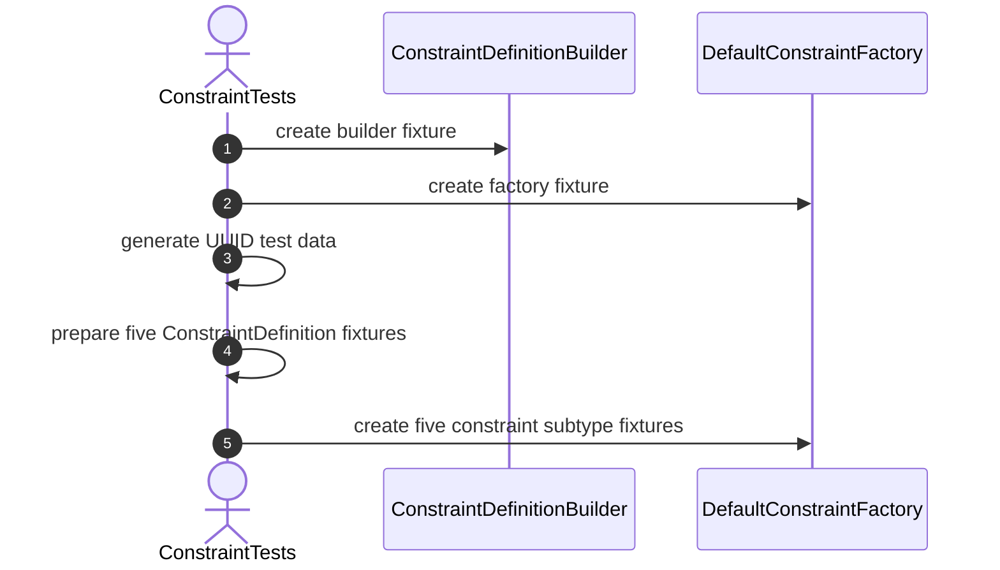
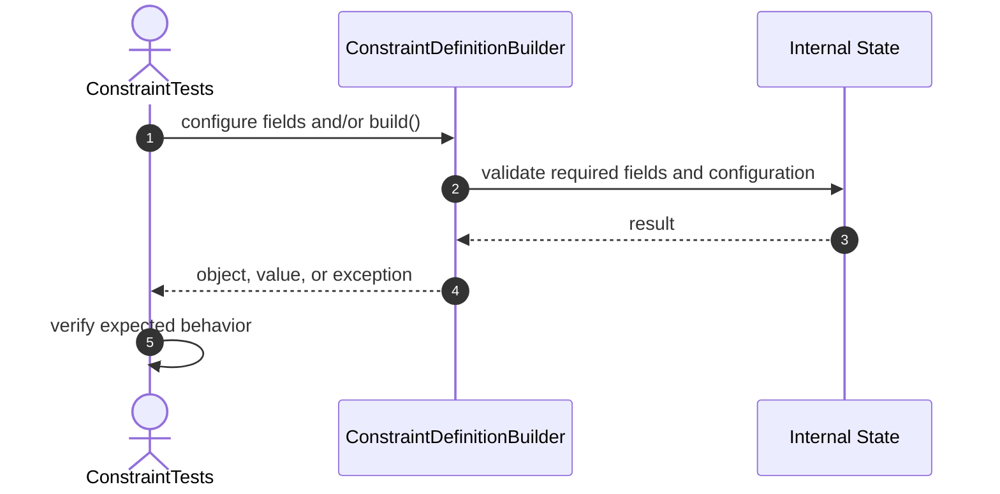
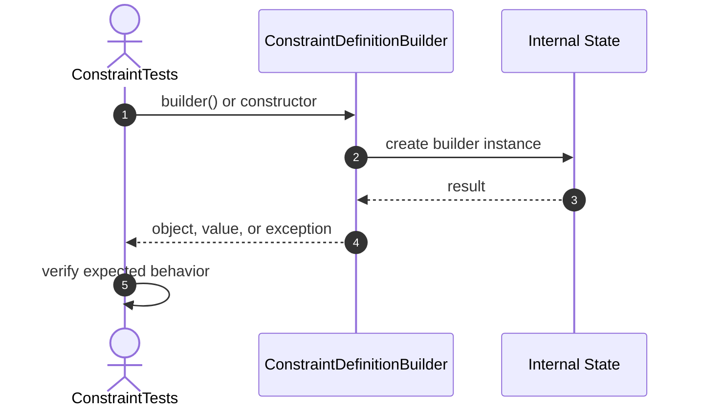

# Constraint Test Sequence Diagrams (65 tests)

Each sequence matches one skeleton test in `ConstraintTests.java`.

## Fixture: setUp



# Builder Creation Tests

## 1. builder_ShouldCreateBuilder



## 2. constructor_ShouldCreateBuilder



## 3. builder_ShouldReturnNewBuilderEachTime


# Required Field Builder Tests

## 4. name_ShouldStoreConstraintName


## 5. type_ShouldStoreConstraintType


## 6. tableId_ShouldStoreTableId


## 7. columnIds_ShouldStoreColumnIds


## 8. build_ShouldCreateConstraintDefinition


## 9. build_ShouldPreserveRequiredFields


## 10. build_ShouldRejectNullName


## 11. build_ShouldRejectBlankName


## 12. build_ShouldRejectNullType


## 13. build_ShouldRejectNullTableId


## 14. build_ShouldRejectNullColumnIds


## 15. build_ShouldRejectEmptyColumnIds


## 16. build_ShouldProtectColumnIdsFromExternalMutation


# Foreign Key Builder Tests

## 17. referencedTableId_ShouldStoreReferencedTableId


## 18. referencedColumnIds_ShouldStoreReferencedColumnIds


## 19. buildForeignKey_ShouldCreateValidDefinition


## 20. buildForeignKey_ShouldRejectMissingReferencedTableId

```mermaid
sequenceDiagram
    autonumber
    actor Test as ConstraintTests
    participant Target as ConstraintDefinitionBuilder
    participant Internal as Internal State

    Test->>Target: configure fields and/or build()
    Target->>Internal: validate required fields and configuration
    Internal-->>Target: result
    Target-->>Test: object, value, or exception
    Test->>Test: verify expected behavior
```

## 21. buildForeignKey_ShouldRejectMissingReferencedColumnIds

```mermaid
sequenceDiagram
    autonumber
    actor Test as ConstraintTests
    participant Target as ConstraintDefinitionBuilder
    participant Internal as Internal State

    Test->>Target: configure fields and/or build()
    Target->>Internal: validate required fields and configuration
    Internal-->>Target: result
    Target-->>Test: object, value, or exception
    Test->>Test: verify expected behavior
```

## 22. buildForeignKey_ShouldRejectEmptyReferencedColumnIds

```mermaid
sequenceDiagram
    autonumber
    actor Test as ConstraintTests
    participant Target as ConstraintDefinitionBuilder
    participant Internal as Internal State

    Test->>Target: configure fields and/or build()
    Target->>Internal: validate required fields and configuration
    Internal-->>Target: result
    Target-->>Test: object, value, or exception
    Test->>Test: verify expected behavior
```

## 23. buildForeignKey_ShouldRejectMismatchedColumnCount

```mermaid
sequenceDiagram
    autonumber
    actor Test as ConstraintTests
    participant Target as ConstraintDefinitionBuilder
    participant Internal as Internal State

    Test->>Target: configure fields and/or build()
    Target->>Internal: validate required fields and configuration
    Internal-->>Target: result
    Target-->>Test: object, value, or exception
    Test->>Test: verify expected behavior
```

## 24. buildForeignKey_ShouldProtectReferencedColumnIds

```mermaid
sequenceDiagram
    autonumber
    actor Test as ConstraintTests
    participant Target as ConstraintDefinitionBuilder
    participant Internal as Internal State

    Test->>Target: configure fields and/or build()
    Target->>Internal: validate required fields and configuration
    Internal-->>Target: result
    Target-->>Test: object, value, or exception
    Test->>Test: verify expected behavior
```

# Check Builder Tests

## 25. expression_ShouldStoreCheckExpression

```mermaid
sequenceDiagram
    autonumber
    actor Test as ConstraintTests
    participant Target as ConstraintDefinitionBuilder
    participant Internal as Internal State

    Test->>Target: configure fields and/or build()
    Target->>Internal: validate required fields and configuration
    Internal-->>Target: result
    Target-->>Test: object, value, or exception
    Test->>Test: verify expected behavior
```

## 26. buildCheck_ShouldCreateValidDefinition

```mermaid
sequenceDiagram
    autonumber
    actor Test as ConstraintTests
    participant Target as ConstraintDefinitionBuilder
    participant Internal as Internal State

    Test->>Target: configure fields and/or build()
    Target->>Internal: validate required fields and configuration
    Internal-->>Target: result
    Target-->>Test: object, value, or exception
    Test->>Test: verify expected behavior
```

## 27. buildCheck_ShouldRejectNullExpression

```mermaid
sequenceDiagram
    autonumber
    actor Test as ConstraintTests
    participant Target as ConstraintDefinitionBuilder
    participant Internal as Internal State

    Test->>Target: configure fields and/or build()
    Target->>Internal: validate required fields and configuration
    Internal-->>Target: result
    Target-->>Test: object, value, or exception
    Test->>Test: verify expected behavior
```

## 28. buildCheck_ShouldRejectBlankExpression

```mermaid
sequenceDiagram
    autonumber
    actor Test as ConstraintTests
    participant Target as ConstraintDefinitionBuilder
    participant Internal as Internal State

    Test->>Target: configure fields and/or build()
    Target->>Internal: validate required fields and configuration
    Internal-->>Target: result
    Target-->>Test: object, value, or exception
    Test->>Test: verify expected behavior
```

## 29. buildNonCheck_ShouldIgnoreMissingExpression

```mermaid
sequenceDiagram
    autonumber
    actor Test as ConstraintTests
    participant Target as ConstraintDefinitionBuilder
    participant Internal as Internal State

    Test->>Target: configure fields and/or build()
    Target->>Internal: validate required fields and configuration
    Internal-->>Target: result
    Target-->>Test: object, value, or exception
    Test->>Test: verify expected behavior
```

# Factory Tests

## 30. factory_ShouldCreatePrimaryKeyConstraint

```mermaid
sequenceDiagram
    autonumber
    actor Test as ConstraintTests
    participant Target as DefaultConstraintFactory
    participant Internal as Internal State

    Test->>Target: create(definition)
    Target->>Internal: select subtype from ConstraintType
    Internal-->>Target: result
    Target-->>Test: object, value, or exception
    Test->>Test: verify expected behavior
```

## 31. factory_ShouldCreateUniqueConstraint

```mermaid
sequenceDiagram
    autonumber
    actor Test as ConstraintTests
    participant Target as DefaultConstraintFactory
    participant Internal as Internal State

    Test->>Target: create(definition)
    Target->>Internal: select subtype from ConstraintType
    Internal-->>Target: result
    Target-->>Test: object, value, or exception
    Test->>Test: verify expected behavior
```

## 32. factory_ShouldCreateNotNullConstraint

```mermaid
sequenceDiagram
    autonumber
    actor Test as ConstraintTests
    participant Target as DefaultConstraintFactory
    participant Internal as Internal State

    Test->>Target: create(definition)
    Target->>Internal: select subtype from ConstraintType
    Internal-->>Target: result
    Target-->>Test: object, value, or exception
    Test->>Test: verify expected behavior
```

## 33. factory_ShouldCreateForeignKeyConstraint

```mermaid
sequenceDiagram
    autonumber
    actor Test as ConstraintTests
    participant Target as DefaultConstraintFactory
    participant Internal as Internal State

    Test->>Target: create(definition)
    Target->>Internal: select subtype from ConstraintType
    Internal-->>Target: result
    Target-->>Test: object, value, or exception
    Test->>Test: verify expected behavior
```

## 34. factory_ShouldCreateCheckConstraint

```mermaid
sequenceDiagram
    autonumber
    actor Test as ConstraintTests
    participant Target as DefaultConstraintFactory
    participant Internal as Internal State

    Test->>Target: create(definition)
    Target->>Internal: select subtype from ConstraintType
    Internal-->>Target: result
    Target-->>Test: object, value, or exception
    Test->>Test: verify expected behavior
```

## 35. factory_ShouldReturnConstraintWithDefinitionName

```mermaid
sequenceDiagram
    autonumber
    actor Test as ConstraintTests
    participant Target as DefaultConstraintFactory
    participant Internal as Internal State

    Test->>Target: create(definition)
    Target->>Internal: select subtype from ConstraintType
    Internal-->>Target: result
    Target-->>Test: object, value, or exception
    Test->>Test: verify expected behavior
```

## 36. factory_ShouldReturnConstraintWithTableId

```mermaid
sequenceDiagram
    autonumber
    actor Test as ConstraintTests
    participant Target as DefaultConstraintFactory
    participant Internal as Internal State

    Test->>Target: create(definition)
    Target->>Internal: select subtype from ConstraintType
    Internal-->>Target: result
    Target-->>Test: object, value, or exception
    Test->>Test: verify expected behavior
```

## 37. factory_ShouldReturnConstraintWithColumnIds

```mermaid
sequenceDiagram
    autonumber
    actor Test as ConstraintTests
    participant Target as DefaultConstraintFactory
    participant Internal as Internal State

    Test->>Target: create(definition)
    Target->>Internal: select subtype from ConstraintType
    Internal-->>Target: result
    Target-->>Test: object, value, or exception
    Test->>Test: verify expected behavior
```

## 38. factory_ShouldRejectNullDefinition

```mermaid
sequenceDiagram
    autonumber
    actor Test as ConstraintTests
    participant Target as DefaultConstraintFactory
    participant Internal as Internal State

    Test->>Target: create(definition)
    Target->>Internal: select subtype from ConstraintType
    Internal-->>Target: result
    Target-->>Test: object, value, or exception
    Test->>Test: verify expected behavior
```

## 39. factory_ShouldRejectUnsupportedConstraintType

```mermaid
sequenceDiagram
    autonumber
    actor Test as ConstraintTests
    participant Target as DefaultConstraintFactory
    participant Internal as Internal State

    Test->>Target: create(definition)
    Target->>Internal: select subtype from ConstraintType
    Internal-->>Target: result
    Target-->>Test: object, value, or exception
    Test->>Test: verify expected behavior
```

# Primary Key Definition Tests

## 40. primaryKey_ShouldReturnPrimaryKeyType

```mermaid
sequenceDiagram
    autonumber
    actor Test as ConstraintTests
    participant Target as Constraint subtype
    participant Internal as Internal State

    Test->>Target: query metadata or validateDefinition()
    Target->>Internal: validate subtype-specific configuration
    Internal-->>Target: result
    Target-->>Test: object, value, or exception
    Test->>Test: verify expected behavior
```

## 41. primaryKey_ShouldValidateCompleteDefinition

```mermaid
sequenceDiagram
    autonumber
    actor Test as ConstraintTests
    participant Target as Constraint subtype
    participant Internal as Internal State

    Test->>Target: query metadata or validateDefinition()
    Target->>Internal: validate subtype-specific configuration
    Internal-->>Target: result
    Target-->>Test: object, value, or exception
    Test->>Test: verify expected behavior
```

## 42. primaryKey_ShouldSupportCompositeColumns

```mermaid
sequenceDiagram
    autonumber
    actor Test as ConstraintTests
    participant Target as Constraint subtype
    participant Internal as Internal State

    Test->>Target: query metadata or validateDefinition()
    Target->>Internal: validate subtype-specific configuration
    Internal-->>Target: result
    Target-->>Test: object, value, or exception
    Test->>Test: verify expected behavior
```

# Unique Definition Tests

## 43. unique_ShouldReturnUniqueType

```mermaid
sequenceDiagram
    autonumber
    actor Test as ConstraintTests
    participant Target as Constraint subtype
    participant Internal as Internal State

    Test->>Target: query metadata or validateDefinition()
    Target->>Internal: validate subtype-specific configuration
    Internal-->>Target: result
    Target-->>Test: object, value, or exception
    Test->>Test: verify expected behavior
```

## 44. unique_ShouldValidateCompleteDefinition

```mermaid
sequenceDiagram
    autonumber
    actor Test as ConstraintTests
    participant Target as Constraint subtype
    participant Internal as Internal State

    Test->>Target: query metadata or validateDefinition()
    Target->>Internal: validate subtype-specific configuration
    Internal-->>Target: result
    Target-->>Test: object, value, or exception
    Test->>Test: verify expected behavior
```

## 45. unique_ShouldSupportCompositeColumns

```mermaid
sequenceDiagram
    autonumber
    actor Test as ConstraintTests
    participant Target as Constraint subtype
    participant Internal as Internal State

    Test->>Target: query metadata or validateDefinition()
    Target->>Internal: validate subtype-specific configuration
    Internal-->>Target: result
    Target-->>Test: object, value, or exception
    Test->>Test: verify expected behavior
```

# Not Null Definition Tests

## 46. notNull_ShouldReturnNotNullType

```mermaid
sequenceDiagram
    autonumber
    actor Test as ConstraintTests
    participant Target as Constraint subtype
    participant Internal as Internal State

    Test->>Target: query metadata or validateDefinition()
    Target->>Internal: validate subtype-specific configuration
    Internal-->>Target: result
    Target-->>Test: object, value, or exception
    Test->>Test: verify expected behavior
```

## 47. notNull_ShouldValidateSingleColumnDefinition

```mermaid
sequenceDiagram
    autonumber
    actor Test as ConstraintTests
    participant Target as Constraint subtype
    participant Internal as Internal State

    Test->>Target: query metadata or validateDefinition()
    Target->>Internal: validate subtype-specific configuration
    Internal-->>Target: result
    Target-->>Test: object, value, or exception
    Test->>Test: verify expected behavior
```

## 48. notNull_ShouldRejectMultipleColumns

```mermaid
sequenceDiagram
    autonumber
    actor Test as ConstraintTests
    participant Target as Constraint subtype
    participant Internal as Internal State

    Test->>Target: query metadata or validateDefinition()
    Target->>Internal: validate subtype-specific configuration
    Internal-->>Target: result
    Target-->>Test: object, value, or exception
    Test->>Test: verify expected behavior
```

# Foreign Key Definition Tests

## 49. foreignKey_ShouldReturnForeignKeyType

```mermaid
sequenceDiagram
    autonumber
    actor Test as ConstraintTests
    participant Target as Constraint subtype
    participant Internal as Internal State

    Test->>Target: query metadata or validateDefinition()
    Target->>Internal: validate subtype-specific configuration
    Internal-->>Target: result
    Target-->>Test: object, value, or exception
    Test->>Test: verify expected behavior
```

## 50. foreignKey_ShouldValidateCompleteDefinition

```mermaid
sequenceDiagram
    autonumber
    actor Test as ConstraintTests
    participant Target as Constraint subtype
    participant Internal as Internal State

    Test->>Target: query metadata or validateDefinition()
    Target->>Internal: validate subtype-specific configuration
    Internal-->>Target: result
    Target-->>Test: object, value, or exception
    Test->>Test: verify expected behavior
```

## 51. foreignKey_ShouldExposeReferencedTableId

```mermaid
sequenceDiagram
    autonumber
    actor Test as ConstraintTests
    participant Target as Constraint subtype
    participant Internal as Internal State

    Test->>Target: query metadata or validateDefinition()
    Target->>Internal: validate subtype-specific configuration
    Internal-->>Target: result
    Target-->>Test: object, value, or exception
    Test->>Test: verify expected behavior
```

## 52. foreignKey_ShouldExposeReferencedColumnIds

```mermaid
sequenceDiagram
    autonumber
    actor Test as ConstraintTests
    participant Target as Constraint subtype
    participant Internal as Internal State

    Test->>Target: query metadata or validateDefinition()
    Target->>Internal: validate subtype-specific configuration
    Internal-->>Target: result
    Target-->>Test: object, value, or exception
    Test->>Test: verify expected behavior
```

# Check Definition Tests

## 53. check_ShouldReturnCheckType

```mermaid
sequenceDiagram
    autonumber
    actor Test as ConstraintTests
    participant Target as Constraint subtype
    participant Internal as Internal State

    Test->>Target: query metadata or validateDefinition()
    Target->>Internal: validate subtype-specific configuration
    Internal-->>Target: result
    Target-->>Test: object, value, or exception
    Test->>Test: verify expected behavior
```

## 54. check_ShouldValidateCompleteDefinition

```mermaid
sequenceDiagram
    autonumber
    actor Test as ConstraintTests
    participant Target as Constraint subtype
    participant Internal as Internal State

    Test->>Target: query metadata or validateDefinition()
    Target->>Internal: validate subtype-specific configuration
    Internal-->>Target: result
    Target-->>Test: object, value, or exception
    Test->>Test: verify expected behavior
```

## 55. check_ShouldExposeExpression

```mermaid
sequenceDiagram
    autonumber
    actor Test as ConstraintTests
    participant Target as Constraint subtype
    participant Internal as Internal State

    Test->>Target: query metadata or validateDefinition()
    Target->>Internal: validate subtype-specific configuration
    Internal-->>Target: result
    Target-->>Test: object, value, or exception
    Test->>Test: verify expected behavior
```

# Metadata Composite Tests

## 56. constraint_ShouldReturnConstraintMetadataType

```mermaid
sequenceDiagram
    autonumber
    actor Test as ConstraintTests
    participant Target as Constraint subtype
    participant Internal as Internal State

    Test->>Target: query metadata or validateDefinition()
    Target->>Internal: validate subtype-specific configuration
    Internal-->>Target: result
    Target-->>Test: object, value, or exception
    Test->>Test: verify expected behavior
```

## 57. constraint_ShouldBeLeafMetadataComponent

```mermaid
sequenceDiagram
    autonumber
    actor Test as ConstraintTests
    participant Target as Constraint subtype
    participant Internal as Internal State

    Test->>Target: query metadata or validateDefinition()
    Target->>Internal: validate subtype-specific configuration
    Internal-->>Target: result
    Target-->>Test: object, value, or exception
    Test->>Test: verify expected behavior
```

## 58. constraint_ShouldReturnEmptyChildren

```mermaid
sequenceDiagram
    autonumber
    actor Test as ConstraintTests
    participant Target as Constraint subtype
    participant Internal as Internal State

    Test->>Target: query metadata or validateDefinition()
    Target->>Internal: validate subtype-specific configuration
    Internal-->>Target: result
    Target-->>Test: object, value, or exception
    Test->>Test: verify expected behavior
```

## 59. constraint_ShouldRejectAddChild

```mermaid
sequenceDiagram
    autonumber
    actor Test as ConstraintTests
    participant Target as Constraint subtype
    participant Internal as Internal State

    Test->>Target: query metadata or validateDefinition()
    Target->>Internal: validate subtype-specific configuration
    Internal-->>Target: result
    Target-->>Test: object, value, or exception
    Test->>Test: verify expected behavior
```

## 60. constraint_ShouldRejectRemoveChild

```mermaid
sequenceDiagram
    autonumber
    actor Test as ConstraintTests
    participant Target as Constraint subtype
    participant Internal as Internal State

    Test->>Target: query metadata or validateDefinition()
    Target->>Internal: validate subtype-specific configuration
    Internal-->>Target: result
    Target-->>Test: object, value, or exception
    Test->>Test: verify expected behavior
```

# Prototype Tests

## 61. copyAs_ShouldCreateDifferentConstraintInstance

```mermaid
sequenceDiagram
    autonumber
    actor Test as ConstraintTests
    participant Target as Constraint
    participant Internal as Internal State

    Test->>Target: copyAs()
    Target->>Internal: deep-copy constraint definition
    Internal-->>Target: result
    Target-->>Test: object, value, or exception
    Test->>Test: verify expected behavior
```

## 62. copyAs_ShouldGenerateDifferentConstraintId

```mermaid
sequenceDiagram
    autonumber
    actor Test as ConstraintTests
    participant Target as Constraint
    participant Internal as Internal State

    Test->>Target: copyAs()
    Target->>Internal: deep-copy constraint definition
    Internal-->>Target: result
    Target-->>Test: object, value, or exception
    Test->>Test: verify expected behavior
```

## 63. copyAs_ShouldPreserveConstraintName

```mermaid
sequenceDiagram
    autonumber
    actor Test as ConstraintTests
    participant Target as Constraint
    participant Internal as Internal State

    Test->>Target: copyAs()
    Target->>Internal: deep-copy constraint definition
    Internal-->>Target: result
    Target-->>Test: object, value, or exception
    Test->>Test: verify expected behavior
```

## 64. copyAs_ShouldPreserveConstraintType

```mermaid
sequenceDiagram
    autonumber
    actor Test as ConstraintTests
    participant Target as Constraint
    participant Internal as Internal State

    Test->>Target: copyAs()
    Target->>Internal: deep-copy constraint definition
    Internal-->>Target: result
    Target-->>Test: object, value, or exception
    Test->>Test: verify expected behavior
```

## 65. copyAs_ShouldPreserveDefinitionData

```mermaid
sequenceDiagram
    autonumber
    actor Test as ConstraintTests
    participant Target as Constraint
    participant Internal as Internal State

    Test->>Target: copyAs()
    Target->>Internal: deep-copy constraint definition
    Internal-->>Target: result
    Target-->>Test: object, value, or exception
    Test->>Test: verify expected behavior
```