## 1. setUp

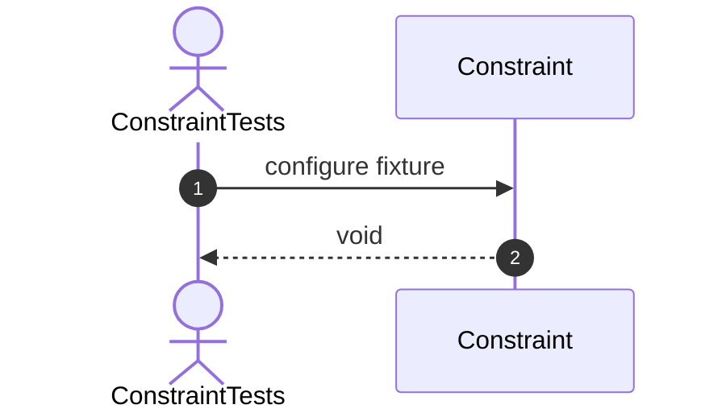

# Constructor Tests
## 2. constructor_ShouldCreateConstraint

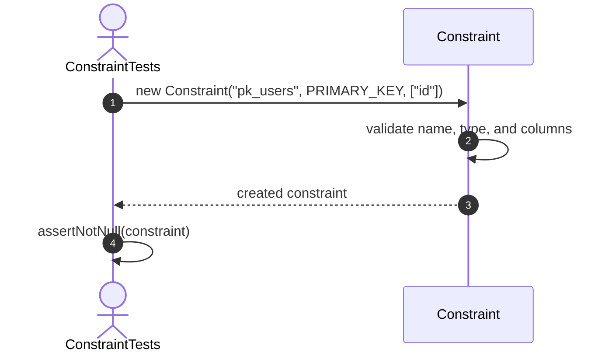

## 3. constructor_ShouldGenerateConstraintId

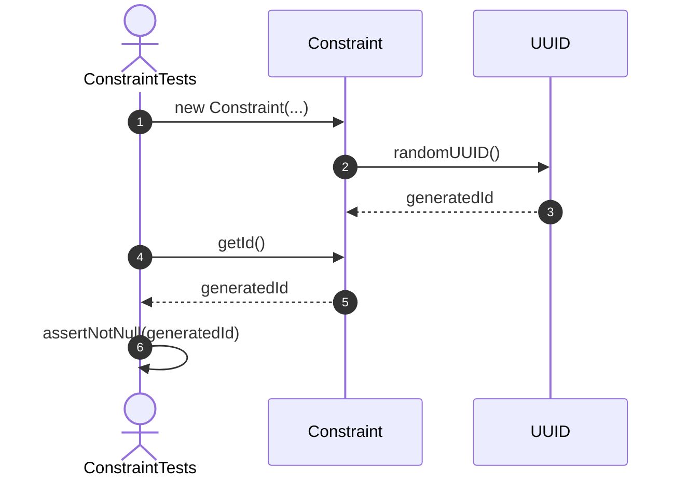

## 4. constructor_ShouldGenerateUniqueConstraintIds

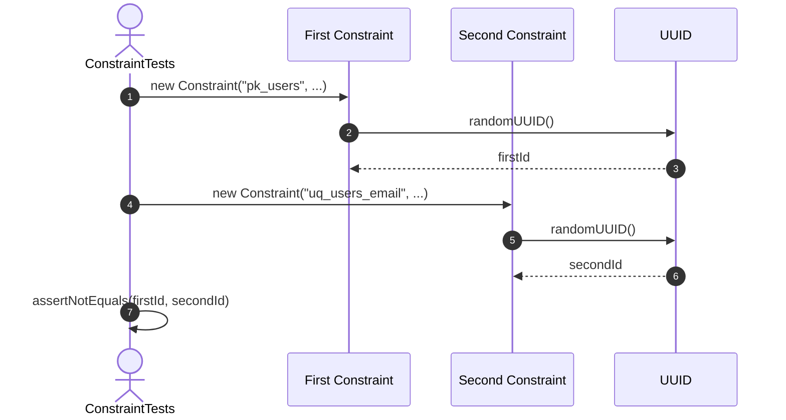

## 5. constructor_ShouldInitializeMetadata

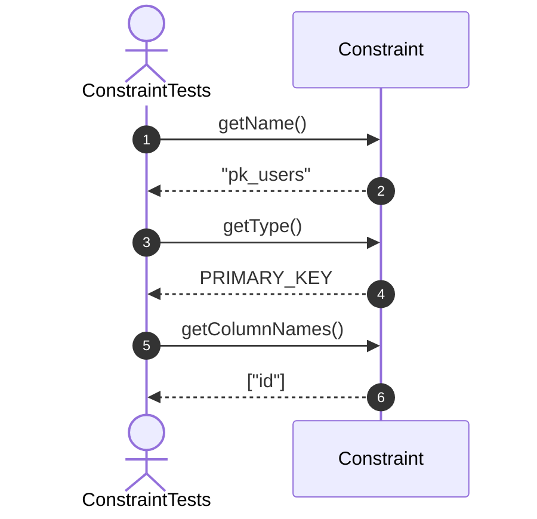

## 6. constructor_ShouldEnableConstraintByDefault

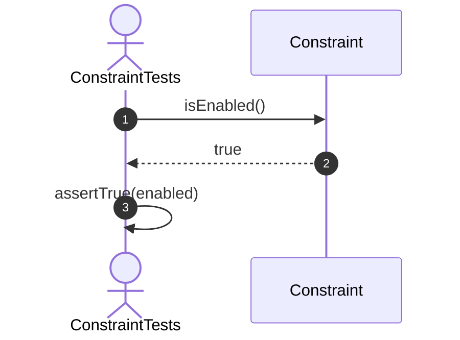

## 7. constructor_ShouldRejectInvalidName

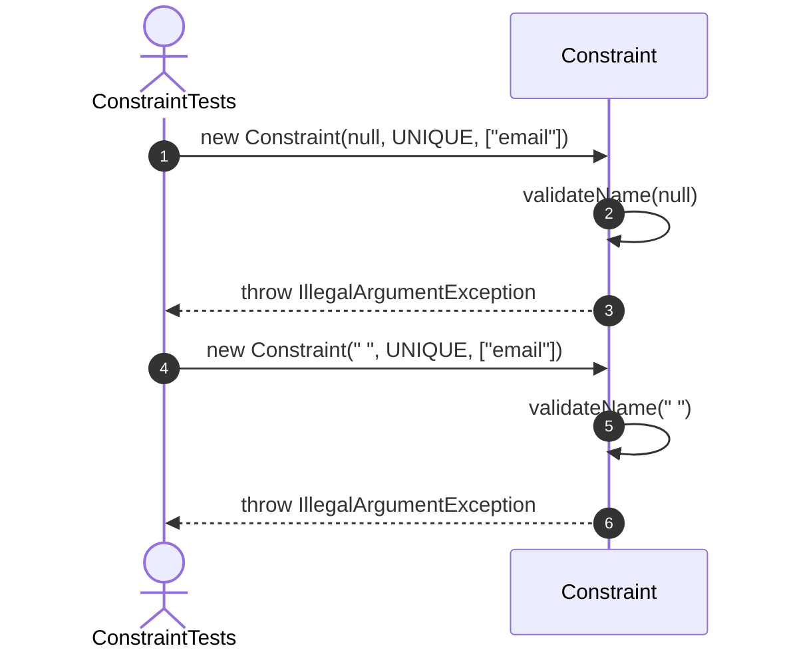

## 8. constructor_ShouldRejectNullType

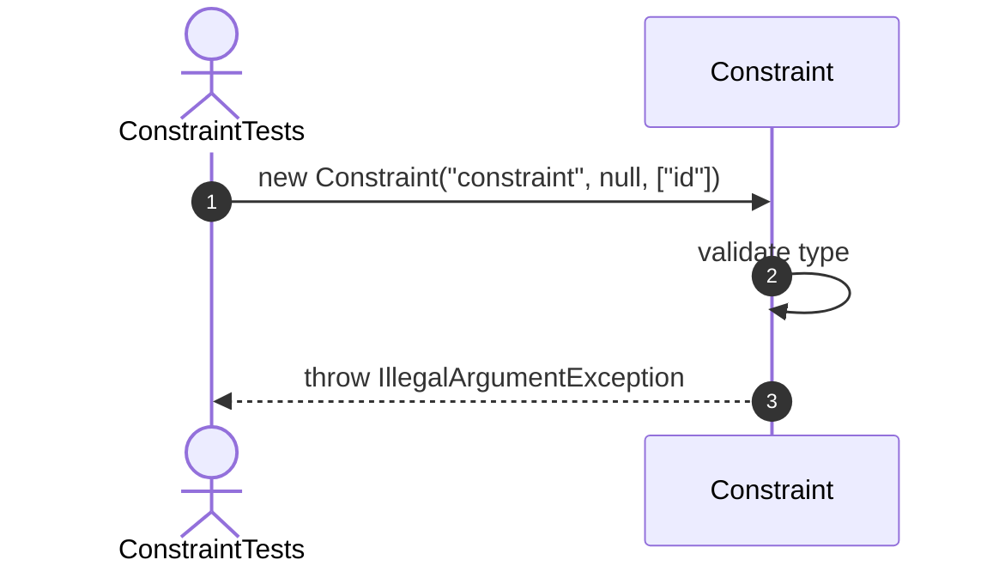

## 9. constructor_ShouldRejectEmptyColumns

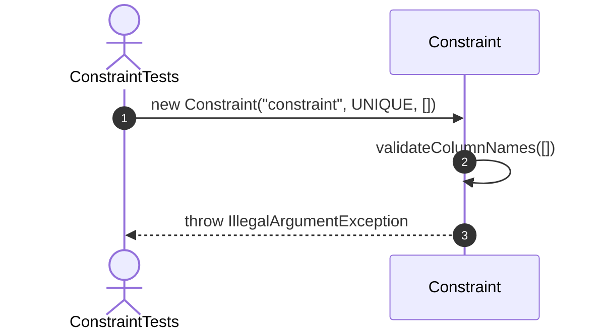

# Metadata Tests

## 10. rename_ShouldChangeConstraintName

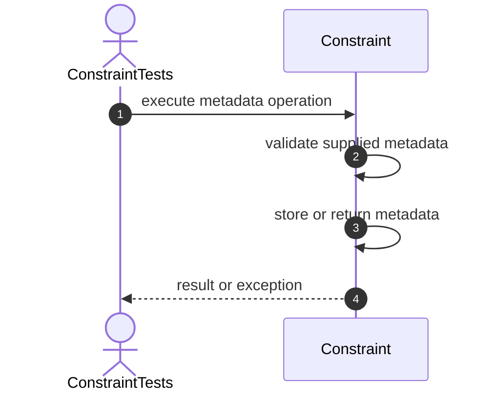

## 11. rename_ShouldRejectInvalidName


## 12. getColumnNames_ShouldReturnUnmodifiableList


## 13. setReferencedTableId_ShouldStoreId


## 14. setReferencedTableId_ShouldRejectNull


## 15. setReferencedColumnNames_ShouldStoreColumns


## 16. getReferencedColumnNames_ShouldBeUnmodifiable


## 17. setCheckExpression_ShouldStoreExpression


## 18. setCheckExpression_ShouldRejectBlankExpression


## 19. setCheckPredicate_ShouldRejectNull


# State Tests

## 20. disable_ShouldDisableConstraint

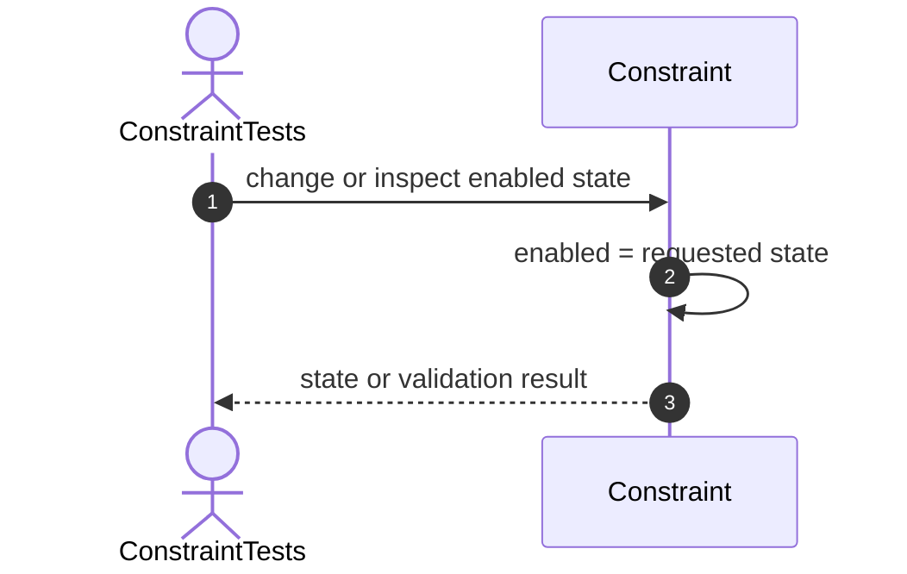

## 21. enable_ShouldEnableConstraint

```mermaid
sequenceDiagram
    autonumber
    actor Test as ConstraintTests
    participant Constraint as Constraint

    Test->>Constraint: change or inspect enabled state
    Constraint->>Constraint: enabled = requested state
    Constraint-->>Test: state or validation result
```

## 22. disable_ShouldBeIdempotent

```mermaid
sequenceDiagram
    autonumber
    actor Test as ConstraintTests
    participant Constraint as Constraint

    Test->>Constraint: change or inspect enabled state
    Constraint->>Constraint: enabled = requested state
    Constraint-->>Test: state or validation result
```

## 23. enable_ShouldBeIdempotent

```mermaid
sequenceDiagram
    autonumber
    actor Test as ConstraintTests
    participant Constraint as Constraint

    Test->>Constraint: change or inspect enabled state
    Constraint->>Constraint: enabled = requested state
    Constraint-->>Test: state or validation result
```

## 24. disabledConstraint_ShouldAlwaysPassValidation

```mermaid
sequenceDiagram
    autonumber
    actor Test as ConstraintTests
    participant Constraint as Constraint

    Test->>Constraint: change or inspect enabled state
    Constraint->>Constraint: enabled = requested state
    Constraint-->>Test: state or validation result
```

# Primary Key Tests

## 25. validatePrimaryKey_ShouldAcceptUniqueNonNullValue

```mermaid
sequenceDiagram
    autonumber
    actor Test as ConstraintTests
    participant Constraint as Constraint
    participant Row as Row
    participant Existing as Existing Values

    Test->>Constraint: validatePrimaryKey(row, existingKeys)
    Constraint->>Row: getValue for each key column
    Row-->>Constraint: key values
    Constraint->>Constraint: reject null components
    Constraint->>Existing: contains(compositeKey)
    Existing-->>Constraint: true or false
    Constraint-->>Test: validation result
```

## 26. validatePrimaryKey_ShouldRejectNullValue

```mermaid
sequenceDiagram
    autonumber
    actor Test as ConstraintTests
    participant Constraint as Constraint
    participant Row as Row
    participant Existing as Existing Values

    Test->>Constraint: validatePrimaryKey(row, existingKeys)
    Constraint->>Row: getValue for each key column
    Row-->>Constraint: key values
    Constraint->>Constraint: reject null components
    Constraint->>Existing: contains(compositeKey)
    Existing-->>Constraint: true or false
    Constraint-->>Test: validation result
```

## 27. validatePrimaryKey_ShouldRejectDuplicateValue

```mermaid
sequenceDiagram
    autonumber
    actor Test as ConstraintTests
    participant Constraint as Constraint
    participant Row as Row
    participant Existing as Existing Values

    Test->>Constraint: validatePrimaryKey(row, existingKeys)
    Constraint->>Row: getValue for each key column
    Row-->>Constraint: key values
    Constraint->>Constraint: reject null components
    Constraint->>Existing: contains(compositeKey)
    Existing-->>Constraint: true or false
    Constraint-->>Test: validation result
```

## 28. validatePrimaryKey_ShouldSupportCompositeKey

```mermaid
sequenceDiagram
    autonumber
    actor Test as ConstraintTests
    participant Constraint as Constraint
    participant Row as Row
    participant Existing as Existing Values

    Test->>Constraint: validatePrimaryKey(row, existingKeys)
    Constraint->>Row: getValue for each key column
    Row-->>Constraint: key values
    Constraint->>Constraint: reject null components
    Constraint->>Existing: contains(compositeKey)
    Existing-->>Constraint: true or false
    Constraint-->>Test: validation result
```

## 29. validatePrimaryKey_ShouldRejectNullExistingKeys

```mermaid
sequenceDiagram
    autonumber
    actor Test as ConstraintTests
    participant Constraint as Constraint
    participant Row as Row
    participant Existing as Existing Values

    Test->>Constraint: validatePrimaryKey(row, existingKeys)
    Constraint->>Row: getValue for each key column
    Row-->>Constraint: key values
    Constraint->>Constraint: reject null components
    Constraint->>Existing: contains(compositeKey)
    Existing-->>Constraint: true or false
    Constraint-->>Test: validation result
```

# Unique Tests

## 30. validateUnique_ShouldAcceptUniqueValue

```mermaid
sequenceDiagram
    autonumber
    actor Test as ConstraintTests
    participant Constraint as Constraint
    participant Row as Row
    participant Existing as Existing Values

    Test->>Constraint: validateUnique(row, existingValues)
    Constraint->>Row: getValue for each unique column
    Row-->>Constraint: values
    alt Any value is null
    Constraint-->>Test: true
    else All values are non-null
    Constraint->>Existing: contains(values)
    Existing-->>Constraint: true or false
    Constraint-->>Test: inverse result
    end
```

## 31. validateUnique_ShouldRejectDuplicateValue

```mermaid
sequenceDiagram
    autonumber
    actor Test as ConstraintTests
    participant Constraint as Constraint
    participant Row as Row
    participant Existing as Existing Values

    Test->>Constraint: validateUnique(row, existingValues)
    Constraint->>Row: getValue for each unique column
    Row-->>Constraint: values
    alt Any value is null
    Constraint-->>Test: true
    else All values are non-null
    Constraint->>Existing: contains(values)
    Existing-->>Constraint: true or false
    Constraint-->>Test: inverse result
    end
```

## 32. validateUnique_ShouldAllowNullValue

```mermaid
sequenceDiagram
    autonumber
    actor Test as ConstraintTests
    participant Constraint as Constraint
    participant Row as Row
    participant Existing as Existing Values

    Test->>Constraint: validateUnique(row, existingValues)
    Constraint->>Row: getValue for each unique column
    Row-->>Constraint: values
    alt Any value is null
    Constraint-->>Test: true
    else All values are non-null
    Constraint->>Existing: contains(values)
    Existing-->>Constraint: true or false
    Constraint-->>Test: inverse result
    end
```

## 33. validateUnique_ShouldSupportCompositeValue

```mermaid
sequenceDiagram
    autonumber
    actor Test as ConstraintTests
    participant Constraint as Constraint
    participant Row as Row
    participant Existing as Existing Values

    Test->>Constraint: validateUnique(row, existingValues)
    Constraint->>Row: getValue for each unique column
    Row-->>Constraint: values
    alt Any value is null
    Constraint-->>Test: true
    else All values are non-null
    Constraint->>Existing: contains(values)
    Existing-->>Constraint: true or false
    Constraint-->>Test: inverse result
    end
```

# Not Null Tests

## 34. validateNotNull_ShouldAcceptNonNullValue

```mermaid
sequenceDiagram
    autonumber
    actor Test as ConstraintTests
    participant Constraint as Constraint
    participant Row as Row

    Test->>Constraint: validateNotNull(row)
    loop Every configured column
    Constraint->>Row: getValue(columnName)
    Row-->>Constraint: value
    end
    Constraint-->>Test: true when all values are non-null
```

## 35. validateNotNull_ShouldRejectNullValue

```mermaid
sequenceDiagram
    autonumber
    actor Test as ConstraintTests
    participant Constraint as Constraint
    participant Row as Row

    Test->>Constraint: validateNotNull(row)
    loop Every configured column
    Constraint->>Row: getValue(columnName)
    Row-->>Constraint: value
    end
    Constraint-->>Test: true when all values are non-null
```

## 36. validateNotNull_ShouldCheckAllColumns

```mermaid
sequenceDiagram
    autonumber
    actor Test as ConstraintTests
    participant Constraint as Constraint
    participant Row as Row

    Test->>Constraint: validateNotNull(row)
    loop Every configured column
    Constraint->>Row: getValue(columnName)
    Row-->>Constraint: value
    end
    Constraint-->>Test: true when all values are non-null
```

# Dispatch Tests

## 37. validate_ShouldDispatchToNotNullValidation

```mermaid
sequenceDiagram
    autonumber
    actor Test as ConstraintTests
    participant Constraint as Constraint
    participant Row as Row

    Test->>Constraint: validate(row)
    Constraint->>Constraint: inspect constraint type
    Constraint->>Constraint: dispatch to supported validator
    Constraint-->>Test: validation result or exception
```

# Fixture Setup

## 38. configureForeignKey

```mermaid
sequenceDiagram
    autonumber
    actor Test as ConstraintTests
    participant Constraint as Constraint

    Test->>Constraint: configure fixture
    Constraint-->>Test: void
```

# Foreign Key Tests

## 39. validateForeignKey_ShouldAcceptExistingReference

```mermaid
sequenceDiagram
    autonumber
    actor Test as ConstraintTests
    participant Constraint as Constraint
    participant Row as Row
    participant Referenced as Referenced Values

    Test->>Constraint: validateForeignKey(row, referencedValues)
    Constraint->>Row: getValue for each local column
    Row-->>Constraint: foreign key values
    alt Any local value is null
    Constraint-->>Test: true
    else All local values exist
    Constraint->>Referenced: contains(values)
    Referenced-->>Constraint: true or false
    Constraint-->>Test: validation result
    end
```

## 40. validateForeignKey_ShouldRejectMissingReference

```mermaid
sequenceDiagram
    autonumber
    actor Test as ConstraintTests
    participant Constraint as Constraint
    participant Row as Row
    participant Referenced as Referenced Values

    Test->>Constraint: validateForeignKey(row, referencedValues)
    Constraint->>Row: getValue for each local column
    Row-->>Constraint: foreign key values
    alt Any local value is null
    Constraint-->>Test: true
    else All local values exist
    Constraint->>Referenced: contains(values)
    Referenced-->>Constraint: true or false
    Constraint-->>Test: validation result
    end
```

## 41. validateForeignKey_ShouldAllowNullValue

```mermaid
sequenceDiagram
    autonumber
    actor Test as ConstraintTests
    participant Constraint as Constraint
    participant Row as Row
    participant Referenced as Referenced Values

    Test->>Constraint: validateForeignKey(row, referencedValues)
    Constraint->>Row: getValue for each local column
    Row-->>Constraint: foreign key values
    alt Any local value is null
    Constraint-->>Test: true
    else All local values exist
    Constraint->>Referenced: contains(values)
    Referenced-->>Constraint: true or false
    Constraint-->>Test: validation result
    end
```

## 42. validateForeignKey_ShouldSupportCompositeReference

```mermaid
sequenceDiagram
    autonumber
    actor Test as ConstraintTests
    participant Constraint as Constraint
    participant Row as Row
    participant Referenced as Referenced Values

    Test->>Constraint: validateForeignKey(row, referencedValues)
    Constraint->>Row: getValue for each local column
    Row-->>Constraint: foreign key values
    alt Any local value is null
    Constraint-->>Test: true
    else All local values exist
    Constraint->>Referenced: contains(values)
    Referenced-->>Constraint: true or false
    Constraint-->>Test: validation result
    end
```

# Fixture Setup

## 43. configureCheck

```mermaid
sequenceDiagram
    autonumber
    actor Test as ConstraintTests
    participant Constraint as Constraint

    Test->>Constraint: configure fixture
    Constraint-->>Test: void
```

# Check Tests

## 44. validateCheck_ShouldAcceptMatchingRow

```mermaid
sequenceDiagram
    autonumber
    actor Test as ConstraintTests
    participant Constraint as Constraint
    participant Predicate as Check Predicate
    participant Row as Row

    Test->>Constraint: validateCheck(row)
    Constraint->>Constraint: ensure predicate exists
    Constraint->>Predicate: test(row)
    Predicate->>Row: read required values
    Row-->>Predicate: values
    Predicate-->>Constraint: true or false
    Constraint-->>Test: validation result
```

## 45. validateCheck_ShouldRejectNonMatchingRow

```mermaid
sequenceDiagram
    autonumber
    actor Test as ConstraintTests
    participant Constraint as Constraint
    participant Predicate as Check Predicate
    participant Row as Row

    Test->>Constraint: validateCheck(row)
    Constraint->>Constraint: ensure predicate exists
    Constraint->>Predicate: test(row)
    Predicate->>Row: read required values
    Row-->>Predicate: values
    Predicate-->>Constraint: true or false
    Constraint-->>Test: validation result
```

## 46. validateCheck_ShouldRejectMissingPredicate

```mermaid
sequenceDiagram
    autonumber
    actor Test as ConstraintTests
    participant Constraint as Constraint
    participant Predicate as Check Predicate
    participant Row as Row

    Test->>Constraint: validateCheck(row)
    Constraint->>Constraint: ensure predicate exists
    Constraint->>Predicate: test(row)
    Predicate->>Row: read required values
    Row-->>Predicate: values
    Predicate-->>Constraint: true or false
    Constraint-->>Test: validation result
```

# Dispatch Tests

## 47. validate_ShouldDispatchToCheckValidation

```mermaid
sequenceDiagram
    autonumber
    actor Test as ConstraintTests
    participant Constraint as Constraint
    participant Row as Row

    Test->>Constraint: validate(row)
    Constraint->>Constraint: inspect constraint type
    Constraint->>Constraint: dispatch to supported validator
    Constraint-->>Test: validation result or exception
```

# Definition Tests

## 48. isValidDefinition_ShouldAcceptPrimaryKey

```mermaid
sequenceDiagram
    autonumber
    actor Test as ConstraintTests
    participant Constraint as Constraint

    Test->>Constraint: isValidDefinition()
    Constraint->>Constraint: validate common metadata
    Constraint->>Constraint: validate type-specific metadata
    Constraint-->>Test: true or false
```

## 49. isValidDefinition_ShouldAcceptUniqueConstraint

```mermaid
sequenceDiagram
    autonumber
    actor Test as ConstraintTests
    participant Constraint as Constraint

    Test->>Constraint: isValidDefinition()
    Constraint->>Constraint: validate common metadata
    Constraint->>Constraint: validate type-specific metadata
    Constraint-->>Test: true or false
```

## 50. isValidDefinition_ShouldAcceptNotNullConstraint

```mermaid
sequenceDiagram
    autonumber
    actor Test as ConstraintTests
    participant Constraint as Constraint

    Test->>Constraint: isValidDefinition()
    Constraint->>Constraint: validate common metadata
    Constraint->>Constraint: validate type-specific metadata
    Constraint-->>Test: true or false
```

## 51. isValidDefinition_ShouldAcceptConfiguredForeignKey

```mermaid
sequenceDiagram
    autonumber
    actor Test as ConstraintTests
    participant Constraint as Constraint

    Test->>Constraint: isValidDefinition()
    Constraint->>Constraint: validate common metadata
    Constraint->>Constraint: validate type-specific metadata
    Constraint-->>Test: true or false
```

## 52. isValidDefinition_ShouldRejectIncompleteForeignKey

```mermaid
sequenceDiagram
    autonumber
    actor Test as ConstraintTests
    participant Constraint as Constraint

    Test->>Constraint: isValidDefinition()
    Constraint->>Constraint: validate common metadata
    Constraint->>Constraint: validate type-specific metadata
    Constraint-->>Test: true or false
```

## 53. isValidDefinition_ShouldAcceptConfiguredCheck

```mermaid
sequenceDiagram
    autonumber
    actor Test as ConstraintTests
    participant Constraint as Constraint

    Test->>Constraint: isValidDefinition()
    Constraint->>Constraint: validate common metadata
    Constraint->>Constraint: validate type-specific metadata
    Constraint-->>Test: true or false
```

## 54. isValidDefinition_ShouldRejectIncompleteCheck

```mermaid
sequenceDiagram
    autonumber
    actor Test as ConstraintTests
    participant Constraint as Constraint

    Test->>Constraint: isValidDefinition()
    Constraint->>Constraint: validate common metadata
    Constraint->>Constraint: validate type-specific metadata
    Constraint-->>Test: true or false
```

# Behavior decisions

- Constraints are enabled by default.
- Disabled constraints always pass validation.
- Primary-key values must be non-null and unique.
- Unique constraints allow null values.
- Foreign keys allow null local values.
- Check constraints use a `Predicate<Row>` rather than implementing a SQL parser.
- `checkExpression` is retained as metadata only.
- Composite constraints are represented by ordered lists of column values.
- `validate(Row)` directly supports `NOT_NULL` and `CHECK`; other types require external value sets.
- Returned column lists are unmodifiable.