# HashIndex Testing - Main Functional Sequences

---

## 1. Insert

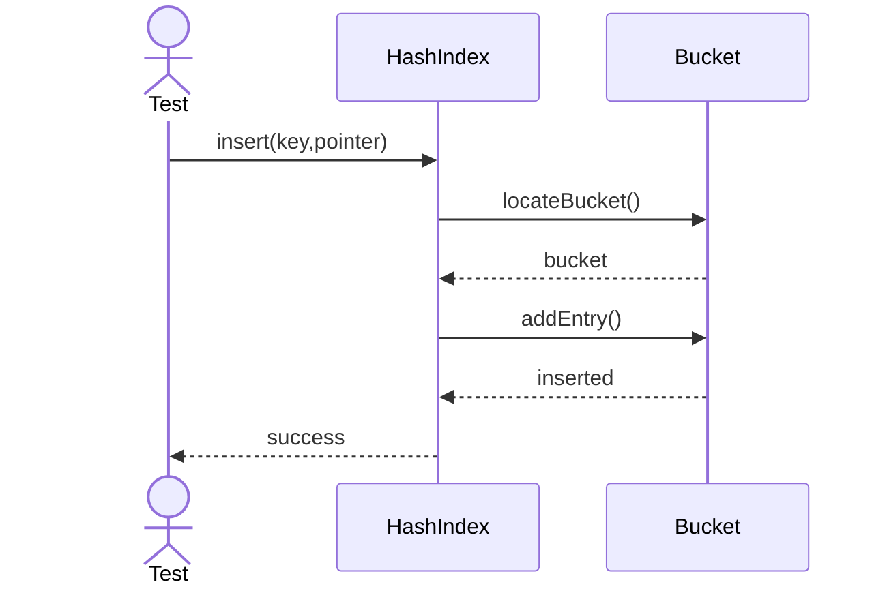

---

## 2. Lookup

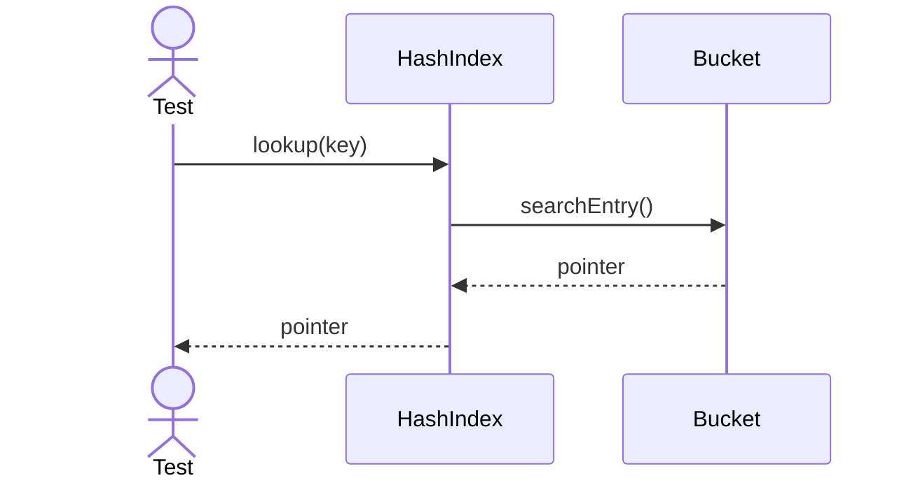

---

## 3. Split Bucket

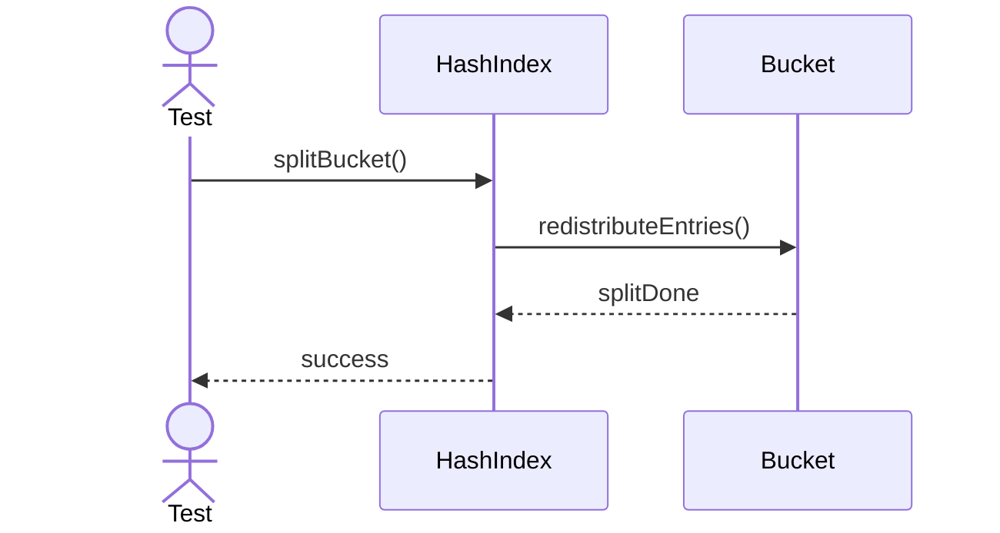

---

## 4. Expand Bucket

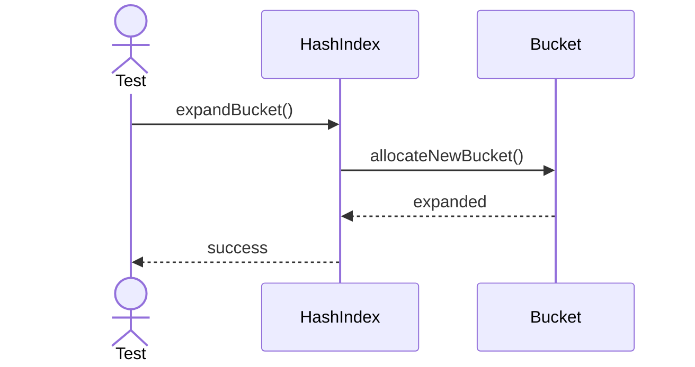

---

## 5. Rehash

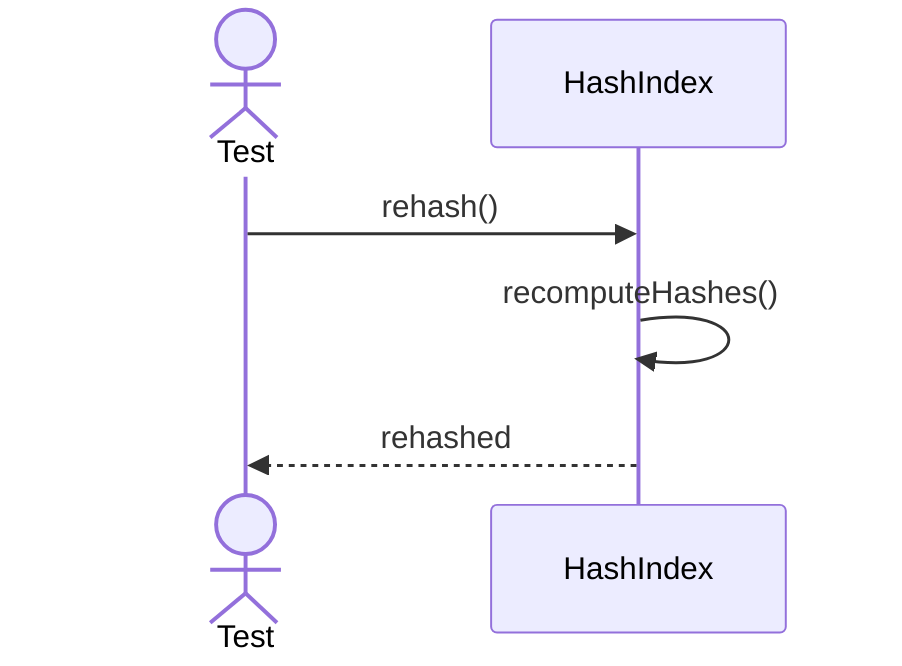

---

## 6. Remove Key

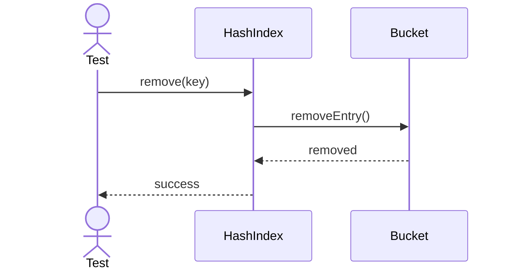

---

## 7. Resolve Collision

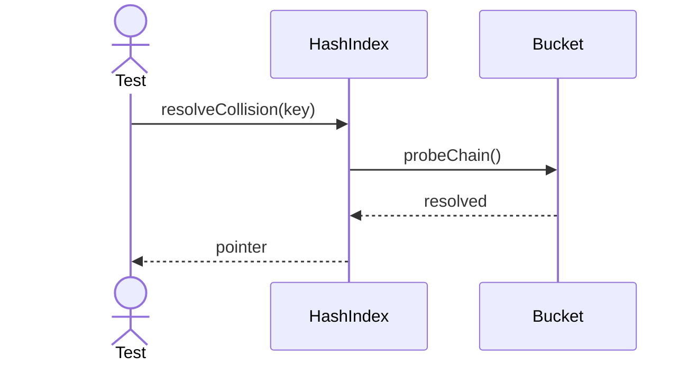

---

## 8. Validate Hash Function

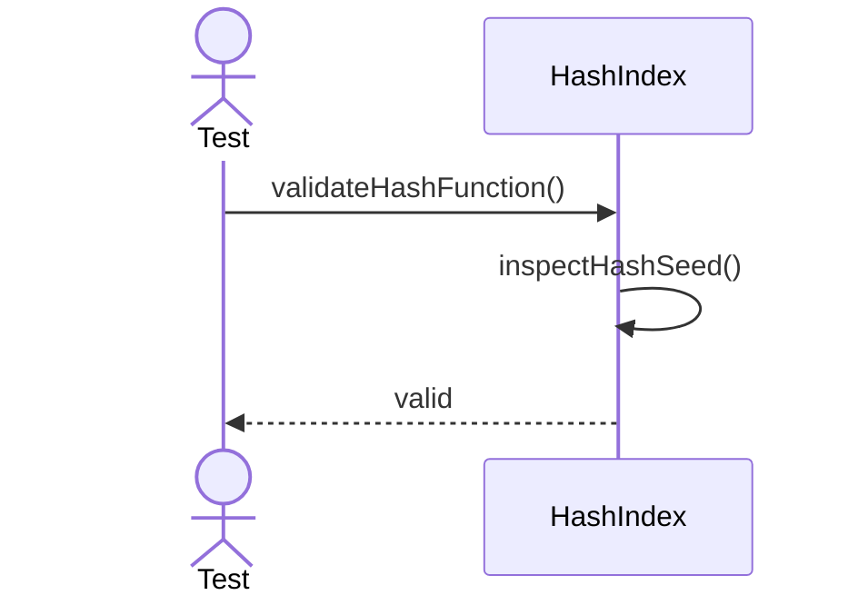

---

## 9. Validate Bucket State

---

## 10. Rebuild Buckets

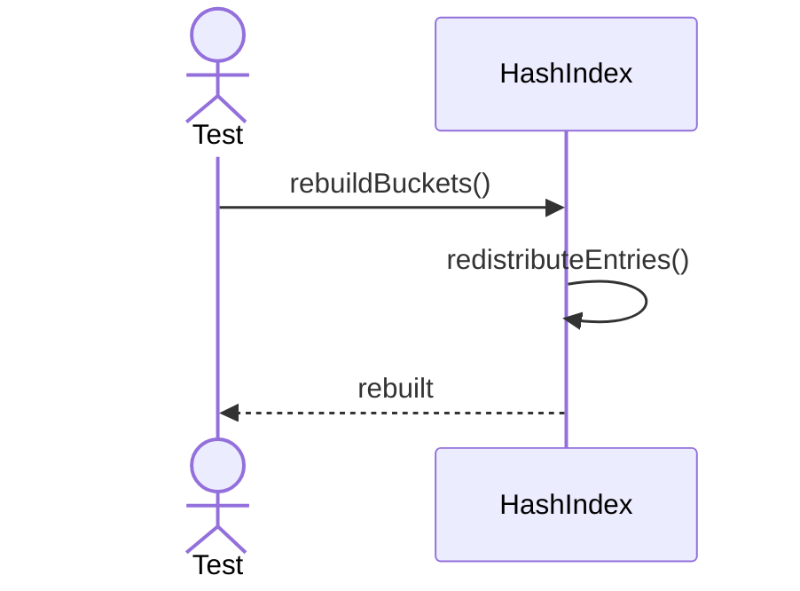

---

## 11. Export Bucket Map

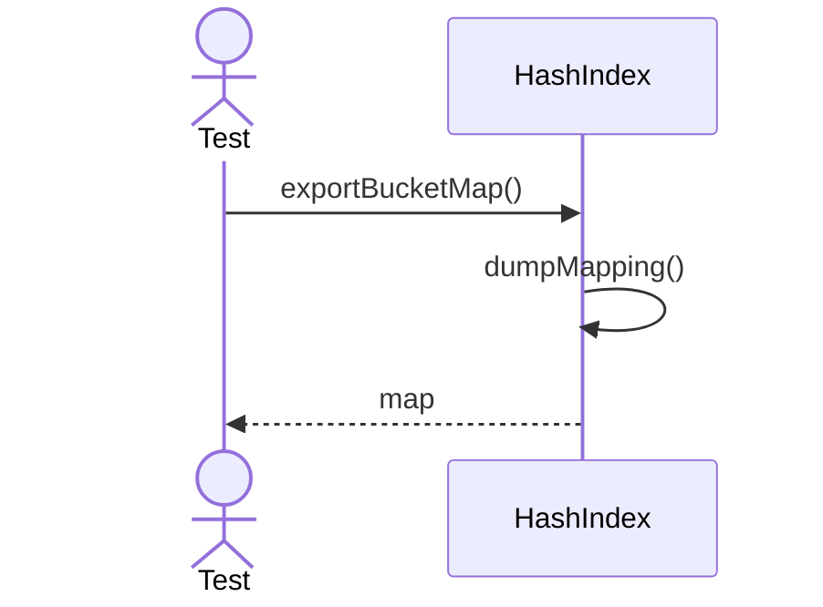

---

## 12. Shrink Buckets

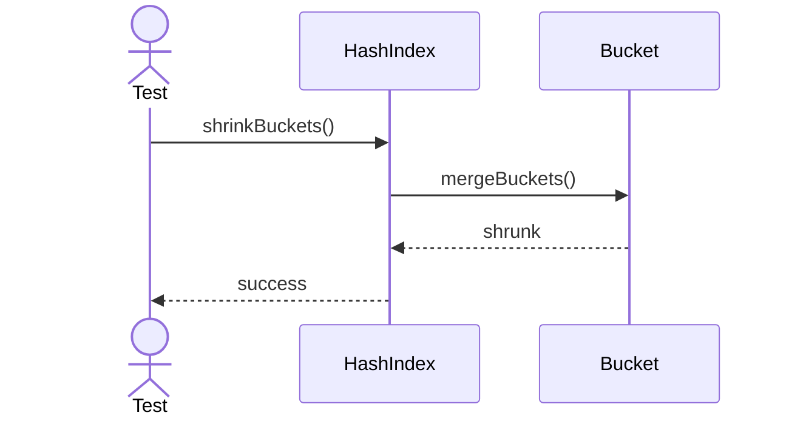

---

## 13. Recompute Distribution

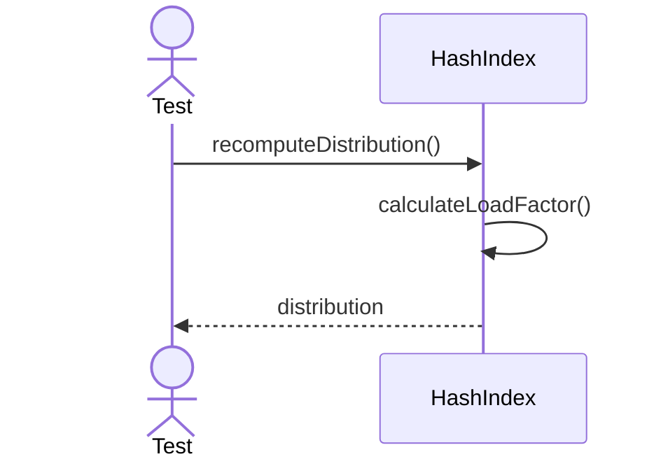

---

## 14. Verify Collision Chain

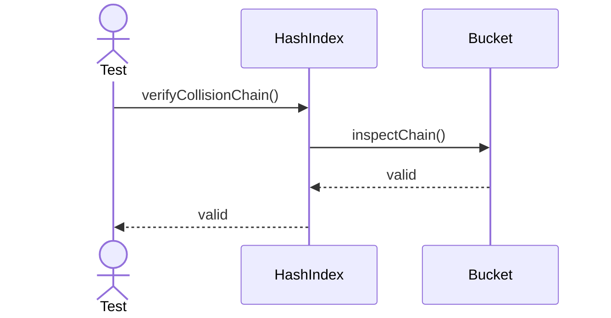

---

## 15. Reset Hash Seed

---

## 16. Compact Buckets

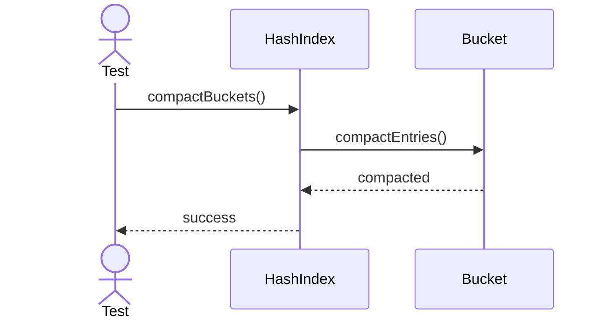

---

## 17. Export Hash Report

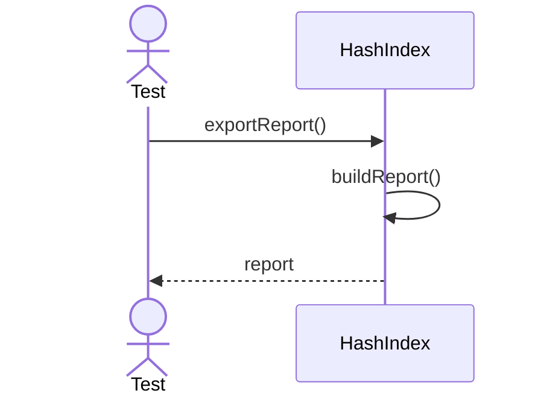

---

## 18. Clone Index

---

## 19. Check Load Factor

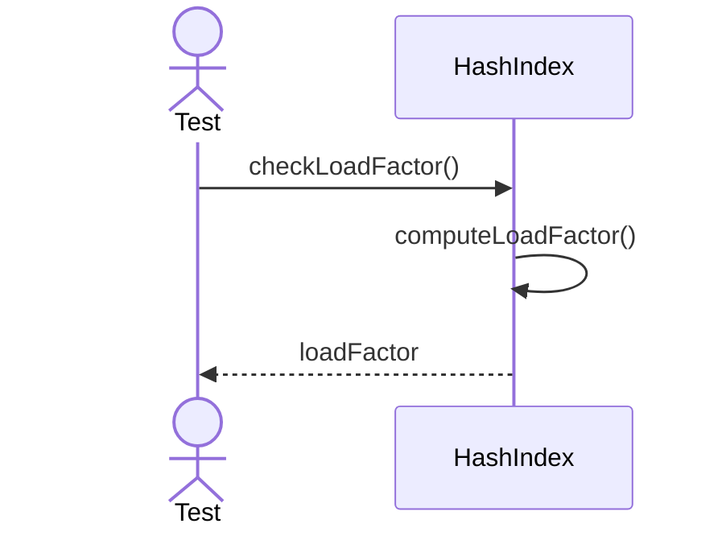

---

## 20. Freeze Hash Index

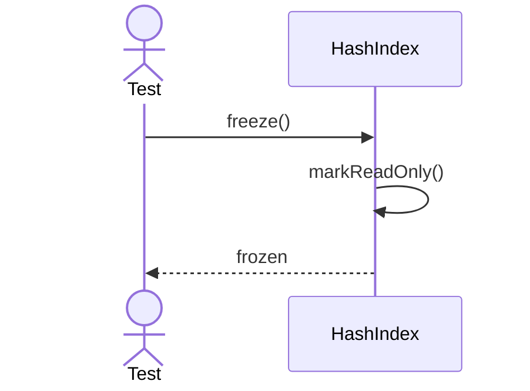
