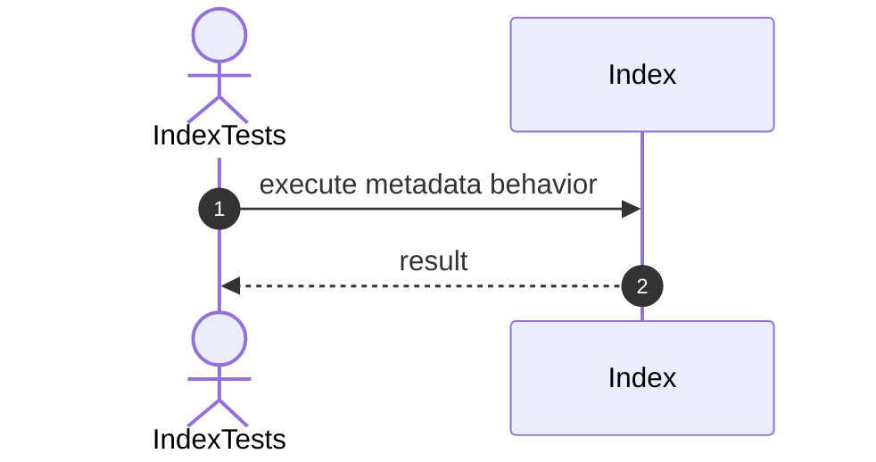
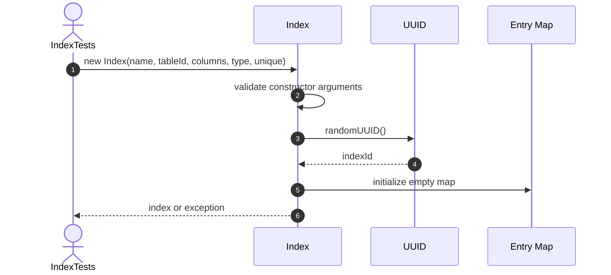
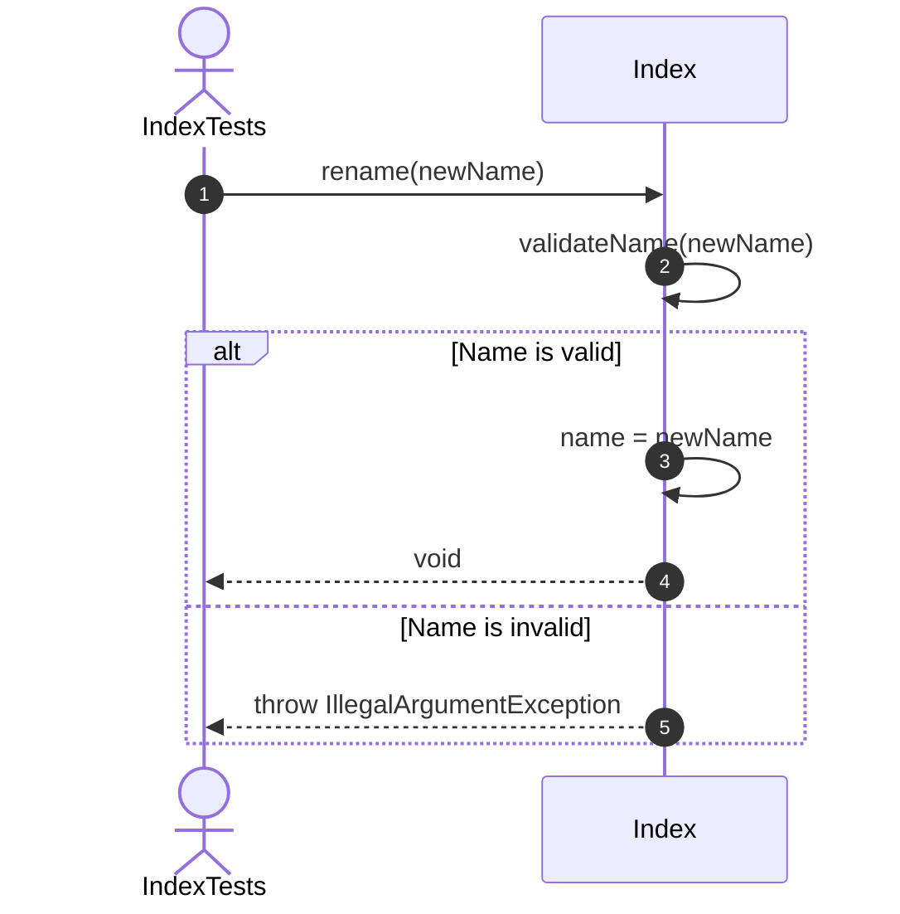
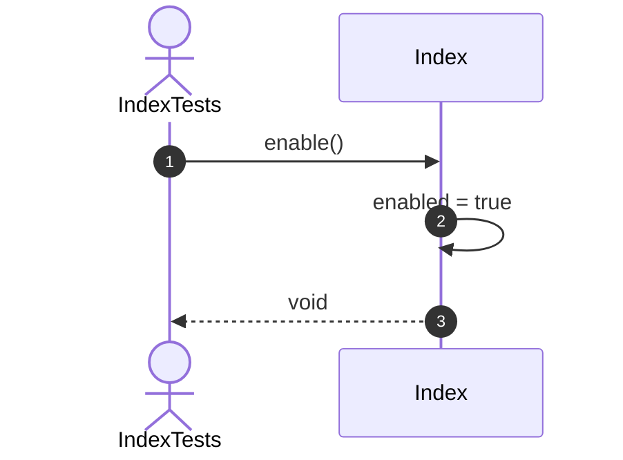

# Index Testing Sequence Diagrams

One Mermaid sequence diagram is provided for every implemented `IndexTests` method.

# Other Tests

## 1. setUp



# Constructor Tests

## 2. constructor_ShouldCreateIndex



## 3. constructor_ShouldGenerateIndexId


## 4. constructor_ShouldGenerateUniqueIndexIds


## 5. constructor_ShouldInitializeMetadata


## 6. constructor_ShouldEnableIndexByDefault


## 7. constructor_ShouldInitializeEmptyEntries


## 8. constructor_ShouldRejectNullName


## 9. constructor_ShouldRejectNullTableId


## 10. constructor_ShouldRejectEmptyColumns


## 11. constructor_ShouldRejectNullType


# Metadata Tests

## 12. rename_ShouldChangeIndexName



## 13. rename_ShouldRejectNullName


## 14. rename_ShouldRejectBlankName


## 15. getColumnNames_ShouldReturnUnmodifiableList


## 16. isValidDefinition_ShouldReturnTrueForValidIndex


# State Tests

## 17. disable_ShouldDisableIndex


## 18. enable_ShouldEnableIndex



## 19. disable_ShouldBeIdempotent


## 20. enable_ShouldBeIdempotent


# Insert Tests

## 21. insert_ShouldRejectWhenDisabled

```mermaid
sequenceDiagram
    autonumber
    actor Test as IndexTests
    participant Index as Index
    participant Entries as Entry Map
    participant RowIds as Row ID List

    Test->>Index: insert(key, rowId)
    Index->>Index: ensureEnabled()
    Index->>Index: validate key and rowId
    Index->>Entries: get(key)
    Entries-->>Index: row ID list or null
    alt Unique duplicate exists
    Index-->>Test: throw IllegalArgumentException
    else Insert is valid
    Index->>RowIds: add(rowId when absent)
    Index-->>Test: void
    end
```

# Delete Tests

## 22. delete_ShouldRejectWhenDisabled

```mermaid
sequenceDiagram
    autonumber
    actor Test as IndexTests
    participant Index as Index
    participant Entries as Entry Map
    participant RowIds as Row ID List

    Test->>Index: delete(key, rowId) or deleteKey(key)
    Index->>Index: ensureEnabled()
    Index->>Entries: locate key
    Entries-->>Index: row IDs or missing
    alt Matching entry exists
    Index->>RowIds: remove row ID or all rows
    Index->>Entries: remove empty key
    Index-->>Test: true
    else Entry is missing
    Index-->>Test: false
    end
```

# Search Tests

## 23. search_ShouldStillWorkWhenDisabled

```mermaid
sequenceDiagram
    autonumber
    actor Test as IndexTests
    participant Index as Index
    participant Entries as Entry Map

    Test->>Index: search(key) or containsKey(key)
    Index->>Index: validate key
    Index->>Entries: read key
    Entries-->>Index: row IDs or missing result
    Index-->>Test: result
```

# Insert Tests

## 24. insert_ShouldStoreKeyAndRowId

```mermaid
sequenceDiagram
    autonumber
    actor Test as IndexTests
    participant Index as Index
    participant Entries as Entry Map
    participant RowIds as Row ID List

    Test->>Index: insert(key, rowId)
    Index->>Index: ensureEnabled()
    Index->>Index: validate key and rowId
    Index->>Entries: get(key)
    Entries-->>Index: row ID list or null
    alt Unique duplicate exists
    Index-->>Test: throw IllegalArgumentException
    else Insert is valid
    Index->>RowIds: add(rowId when absent)
    Index-->>Test: void
    end
```

## 25. insert_ShouldIncreaseKeyCount

```mermaid
sequenceDiagram
    autonumber
    actor Test as IndexTests
    participant Index as Index
    participant Entries as Entry Map
    participant RowIds as Row ID List

    Test->>Index: insert(key, rowId)
    Index->>Index: ensureEnabled()
    Index->>Index: validate key and rowId
    Index->>Entries: get(key)
    Entries-->>Index: row ID list or null
    alt Unique duplicate exists
    Index-->>Test: throw IllegalArgumentException
    else Insert is valid
    Index->>RowIds: add(rowId when absent)
    Index-->>Test: void
    end
```

## 26. insert_ShouldIncreaseEntryCount

```mermaid
sequenceDiagram
    autonumber
    actor Test as IndexTests
    participant Index as Index
    participant Entries as Entry Map
    participant RowIds as Row ID List

    Test->>Index: insert(key, rowId)
    Index->>Index: ensureEnabled()
    Index->>Index: validate key and rowId
    Index->>Entries: get(key)
    Entries-->>Index: row ID list or null
    alt Unique duplicate exists
    Index-->>Test: throw IllegalArgumentException
    else Insert is valid
    Index->>RowIds: add(rowId when absent)
    Index-->>Test: void
    end
```

## 27. insert_ShouldRejectNullKey

```mermaid
sequenceDiagram
    autonumber
    actor Test as IndexTests
    participant Index as Index
    participant Entries as Entry Map
    participant RowIds as Row ID List

    Test->>Index: insert(key, rowId)
    Index->>Index: ensureEnabled()
    Index->>Index: validate key and rowId
    Index->>Entries: get(key)
    Entries-->>Index: row ID list or null
    alt Unique duplicate exists
    Index-->>Test: throw IllegalArgumentException
    else Insert is valid
    Index->>RowIds: add(rowId when absent)
    Index-->>Test: void
    end
```

## 28. insert_ShouldRejectNullRowId

```mermaid
sequenceDiagram
    autonumber
    actor Test as IndexTests
    participant Index as Index
    participant Entries as Entry Map
    participant RowIds as Row ID List

    Test->>Index: insert(key, rowId)
    Index->>Index: ensureEnabled()
    Index->>Index: validate key and rowId
    Index->>Entries: get(key)
    Entries-->>Index: row ID list or null
    alt Unique duplicate exists
    Index-->>Test: throw IllegalArgumentException
    else Insert is valid
    Index->>RowIds: add(rowId when absent)
    Index-->>Test: void
    end
```

## 29. insert_ShouldAvoidDuplicateRowIdForSameKey

```mermaid
sequenceDiagram
    autonumber
    actor Test as IndexTests
    participant Index as Index
    participant Entries as Entry Map
    participant RowIds as Row ID List

    Test->>Index: insert(key, rowId)
    Index->>Index: ensureEnabled()
    Index->>Index: validate key and rowId
    Index->>Entries: get(key)
    Entries-->>Index: row ID list or null
    alt Unique duplicate exists
    Index-->>Test: throw IllegalArgumentException
    else Insert is valid
    Index->>RowIds: add(rowId when absent)
    Index-->>Test: void
    end
```

## 30. insert_ShouldAllowMultipleRowsForNonUniqueIndex

```mermaid
sequenceDiagram
    autonumber
    actor Test as IndexTests
    participant Index as Index
    participant Entries as Entry Map
    participant RowIds as Row ID List

    Test->>Index: insert(key, rowId)
    Index->>Index: ensureEnabled()
    Index->>Index: validate key and rowId
    Index->>Entries: get(key)
    Entries-->>Index: row ID list or null
    alt Unique duplicate exists
    Index-->>Test: throw IllegalArgumentException
    else Insert is valid
    Index->>RowIds: add(rowId when absent)
    Index-->>Test: void
    end
```

## 31. insert_ShouldRejectDuplicateKeyForUniqueIndex

```mermaid
sequenceDiagram
    autonumber
    actor Test as IndexTests
    participant Index as Index
    participant Entries as Entry Map
    participant RowIds as Row ID List

    Test->>Index: insert(key, rowId)
    Index->>Index: ensureEnabled()
    Index->>Index: validate key and rowId
    Index->>Entries: get(key)
    Entries-->>Index: row ID list or null
    alt Unique duplicate exists
    Index-->>Test: throw IllegalArgumentException
    else Insert is valid
    Index->>RowIds: add(rowId when absent)
    Index-->>Test: void
    end
```

# Search Tests

## 32. search_ShouldReturnMatchingRowIds

```mermaid
sequenceDiagram
    autonumber
    actor Test as IndexTests
    participant Index as Index
    participant Entries as Entry Map

    Test->>Index: search(key) or containsKey(key)
    Index->>Index: validate key
    Index->>Entries: read key
    Entries-->>Index: row IDs or missing result
    Index-->>Test: result
```

## 33. search_ShouldReturnEmptyListForMissingKey

```mermaid
sequenceDiagram
    autonumber
    actor Test as IndexTests
    participant Index as Index
    participant Entries as Entry Map

    Test->>Index: search(key) or containsKey(key)
    Index->>Index: validate key
    Index->>Entries: read key
    Entries-->>Index: row IDs or missing result
    Index-->>Test: result
```

## 34. search_ShouldRejectNullKey

```mermaid
sequenceDiagram
    autonumber
    actor Test as IndexTests
    participant Index as Index
    participant Entries as Entry Map

    Test->>Index: search(key) or containsKey(key)
    Index->>Index: validate key
    Index->>Entries: read key
    Entries-->>Index: row IDs or missing result
    Index-->>Test: result
```

## 35. search_ShouldReturnUnmodifiableList

```mermaid
sequenceDiagram
    autonumber
    actor Test as IndexTests
    participant Index as Index
    participant Entries as Entry Map

    Test->>Index: search(key) or containsKey(key)
    Index->>Index: validate key
    Index->>Entries: read key
    Entries-->>Index: row IDs or missing result
    Index-->>Test: result
```

## 36. containsKey_ShouldReturnTrueForExistingKey

```mermaid
sequenceDiagram
    autonumber
    actor Test as IndexTests
    participant Index as Index
    participant Entries as Entry Map

    Test->>Index: search(key) or containsKey(key)
    Index->>Index: validate key
    Index->>Entries: read key
    Entries-->>Index: row IDs or missing result
    Index-->>Test: result
```

## 37. containsKey_ShouldReturnFalseForMissingKey

```mermaid
sequenceDiagram
    autonumber
    actor Test as IndexTests
    participant Index as Index
    participant Entries as Entry Map

    Test->>Index: search(key) or containsKey(key)
    Index->>Index: validate key
    Index->>Entries: read key
    Entries-->>Index: row IDs or missing result
    Index-->>Test: result
```

# Delete Tests

## 38. delete_ShouldRemoveSpecificRowId

```mermaid
sequenceDiagram
    autonumber
    actor Test as IndexTests
    participant Index as Index
    participant Entries as Entry Map
    participant RowIds as Row ID List

    Test->>Index: delete(key, rowId) or deleteKey(key)
    Index->>Index: ensureEnabled()
    Index->>Entries: locate key
    Entries-->>Index: row IDs or missing
    alt Matching entry exists
    Index->>RowIds: remove row ID or all rows
    Index->>Entries: remove empty key
    Index-->>Test: true
    else Entry is missing
    Index-->>Test: false
    end
```

## 39. delete_ShouldReturnFalseForMissingRowId

```mermaid
sequenceDiagram
    autonumber
    actor Test as IndexTests
    participant Index as Index
    participant Entries as Entry Map
    participant RowIds as Row ID List

    Test->>Index: delete(key, rowId) or deleteKey(key)
    Index->>Index: ensureEnabled()
    Index->>Entries: locate key
    Entries-->>Index: row IDs or missing
    alt Matching entry exists
    Index->>RowIds: remove row ID or all rows
    Index->>Entries: remove empty key
    Index-->>Test: true
    else Entry is missing
    Index-->>Test: false
    end
```

## 40. delete_ShouldReturnFalseForMissingKey

```mermaid
sequenceDiagram
    autonumber
    actor Test as IndexTests
    participant Index as Index
    participant Entries as Entry Map
    participant RowIds as Row ID List

    Test->>Index: delete(key, rowId) or deleteKey(key)
    Index->>Index: ensureEnabled()
    Index->>Entries: locate key
    Entries-->>Index: row IDs or missing
    alt Matching entry exists
    Index->>RowIds: remove row ID or all rows
    Index->>Entries: remove empty key
    Index-->>Test: true
    else Entry is missing
    Index-->>Test: false
    end
```

## 41. delete_ShouldRemoveKeyWhenLastRowIdIsDeleted

```mermaid
sequenceDiagram
    autonumber
    actor Test as IndexTests
    participant Index as Index
    participant Entries as Entry Map
    participant RowIds as Row ID List

    Test->>Index: delete(key, rowId) or deleteKey(key)
    Index->>Index: ensureEnabled()
    Index->>Entries: locate key
    Entries-->>Index: row IDs or missing
    alt Matching entry exists
    Index->>RowIds: remove row ID or all rows
    Index->>Entries: remove empty key
    Index-->>Test: true
    else Entry is missing
    Index-->>Test: false
    end
```

## 42. deleteKey_ShouldRemoveEntireKey

```mermaid
sequenceDiagram
    autonumber
    actor Test as IndexTests
    participant Index as Index
    participant Entries as Entry Map
    participant RowIds as Row ID List

    Test->>Index: delete(key, rowId) or deleteKey(key)
    Index->>Index: ensureEnabled()
    Index->>Entries: locate key
    Entries-->>Index: row IDs or missing
    alt Matching entry exists
    Index->>RowIds: remove row ID or all rows
    Index->>Entries: remove empty key
    Index-->>Test: true
    else Entry is missing
    Index-->>Test: false
    end
```

## 43. deleteKey_ShouldReturnFalseForMissingKey

```mermaid
sequenceDiagram
    autonumber
    actor Test as IndexTests
    participant Index as Index
    participant Entries as Entry Map
    participant RowIds as Row ID List

    Test->>Index: delete(key, rowId) or deleteKey(key)
    Index->>Index: ensureEnabled()
    Index->>Entries: locate key
    Entries-->>Index: row IDs or missing
    alt Matching entry exists
    Index->>RowIds: remove row ID or all rows
    Index->>Entries: remove empty key
    Index-->>Test: true
    else Entry is missing
    Index-->>Test: false
    end
```

# Collection Tests

## 44. clear_ShouldRemoveAllEntries

```mermaid
sequenceDiagram
    autonumber
    actor Test as IndexTests
    participant Index as Index
    participant Entries as Entry Map

    Test->>Index: execute collection operation
    Index->>Entries: read, count, copy, or clear entries
    Entries-->>Index: operation result
    Index-->>Test: immutable view or count/state
```

## 45. getEntries_ShouldReturnUnmodifiableMap

```mermaid
sequenceDiagram
    autonumber
    actor Test as IndexTests
    participant Index as Index
    participant Entries as Entry Map

    Test->>Index: execute collection operation
    Index->>Entries: read, count, copy, or clear entries
    Entries-->>Index: operation result
    Index-->>Test: immutable view or count/state
```

## 46. getEntries_ShouldProtectNestedLists

```mermaid
sequenceDiagram
    autonumber
    actor Test as IndexTests
    participant Index as Index
    participant Entries as Entry Map

    Test->>Index: execute collection operation
    Index->>Entries: read, count, copy, or clear entries
    Entries-->>Index: operation result
    Index-->>Test: immutable view or count/state
```

## 47. isEmpty_ShouldReturnTrueForNewIndex

```mermaid
sequenceDiagram
    autonumber
    actor Test as IndexTests
    participant Index as Index
    participant Entries as Entry Map

    Test->>Index: execute collection operation
    Index->>Entries: read, count, copy, or clear entries
    Entries-->>Index: operation result
    Index-->>Test: immutable view or count/state
```

## 48. isEmpty_ShouldReturnFalseAfterInsert

```mermaid
sequenceDiagram
    autonumber
    actor Test as IndexTests
    participant Index as Index
    participant Entries as Entry Map

    Test->>Index: execute collection operation
    Index->>Entries: read, count, copy, or clear entries
    Entries-->>Index: operation result
    Index-->>Test: immutable view or count/state
```

## 49. getKeyCount_ShouldReturnCorrectCount

```mermaid
sequenceDiagram
    autonumber
    actor Test as IndexTests
    participant Index as Index
    participant Entries as Entry Map

    Test->>Index: execute collection operation
    Index->>Entries: read, count, copy, or clear entries
    Entries-->>Index: operation result
    Index-->>Test: immutable view or count/state
```

## 50. getEntryCount_ShouldReturnCorrectCount

```mermaid
sequenceDiagram
    autonumber
    actor Test as IndexTests
    participant Index as Index
    participant Entries as Entry Map

    Test->>Index: execute collection operation
    Index->>Entries: read, count, copy, or clear entries
    Entries-->>Index: operation result
    Index-->>Test: immutable view or count/state
```

