# Row Testing — Important Unit Test Sequence Diagrams

## Recommended Row Model    
---

# 1. Constructor_ShouldCreateRow

Verifies that a `Row` object can be created successfully.

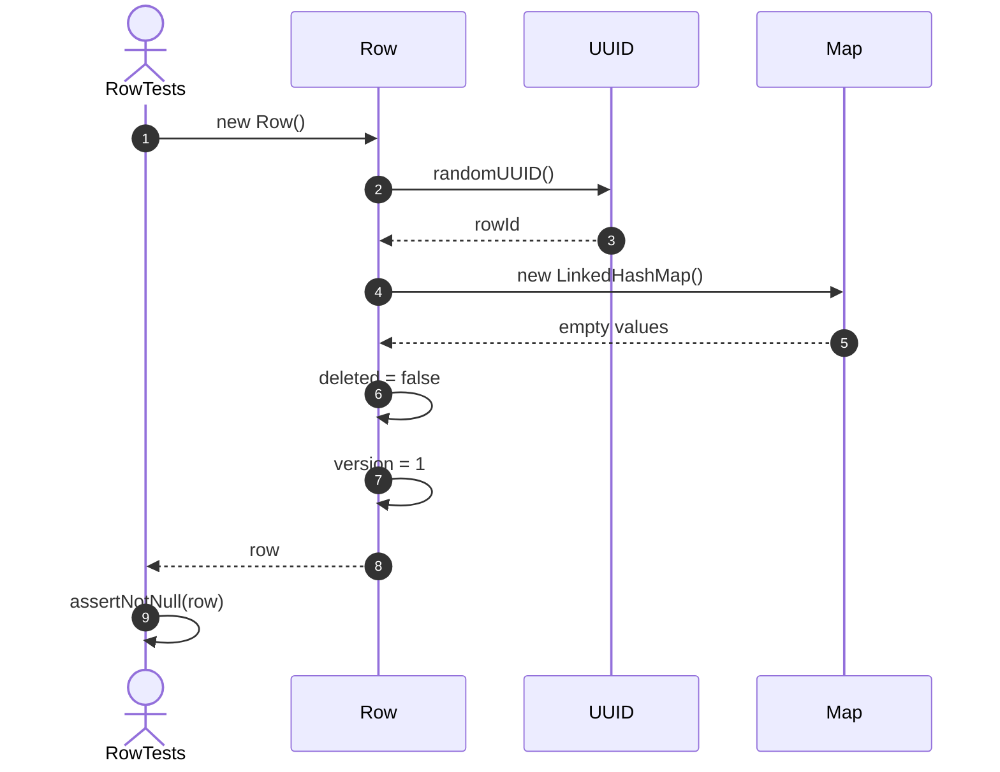
```mermaid
sequenceDiagram
    autonumber

    actor Test as RowTests
    participant Row as Row
    participant UUID as UUID
    participant Values as Map

    Test->>Row: new Row()

    Row->>UUID: randomUUID()
    UUID-->>Row: rowId

    Row->>Values: new LinkedHashMap()
    Values-->>Row: empty values

    Row->>Row: deleted = false
    Row->>Row: version = 1

    Row-->>Test: row

    Test->>Test: assertNotNull(row)
```

---

# 2. Constructor_ShouldGenerateRowId

Verifies that every new row receives an ID.

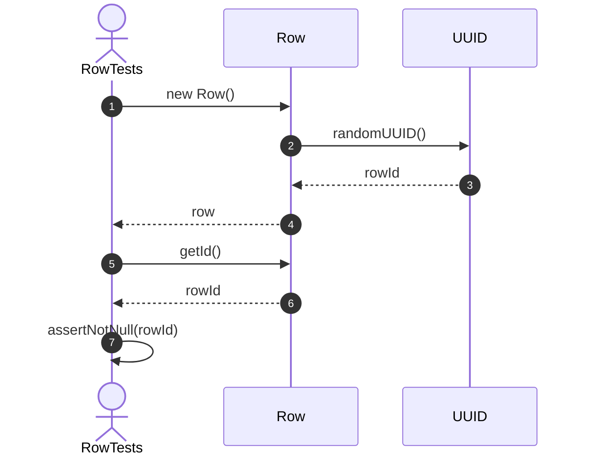
```mermaid
sequenceDiagram
    autonumber

    actor Test as RowTests
    participant Row as Row
    participant UUID as UUID

    Test->>Row: new Row()

    Row->>UUID: randomUUID()
    UUID-->>Row: rowId

    Row-->>Test: row

    Test->>Row: getId()
    Row-->>Test: rowId

    Test->>Test: assertNotNull(rowId)
```

---

# 3. Constructor_ShouldGenerateUniqueRowIds

Verifies that two rows do not receive the same ID.

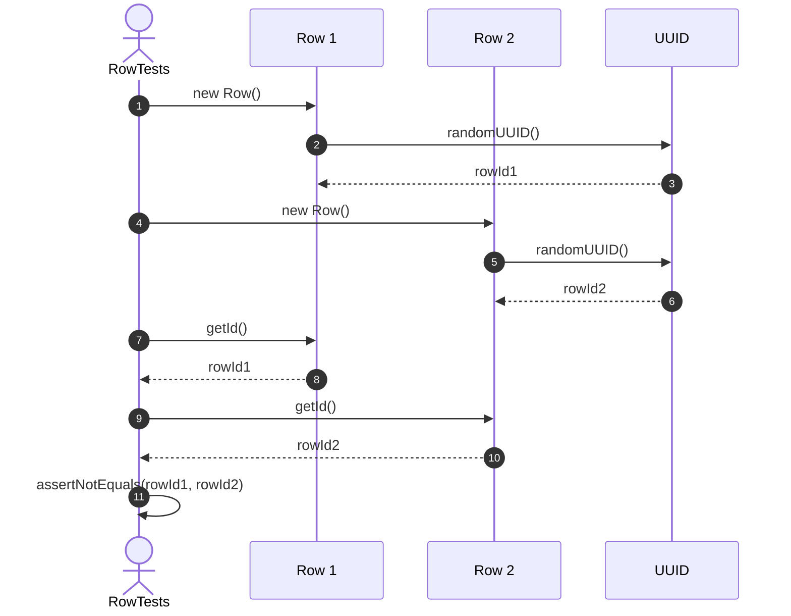
```mermaid
sequenceDiagram
    autonumber

    actor Test as RowTests
    participant Row1 as Row 1
    participant Row2 as Row 2
    participant UUID as UUID

    Test->>Row1: new Row()
    Row1->>UUID: randomUUID()
    UUID-->>Row1: rowId1

    Test->>Row2: new Row()
    Row2->>UUID: randomUUID()
    UUID-->>Row2: rowId2

    Test->>Row1: getId()
    Row1-->>Test: rowId1

    Test->>Row2: getId()
    Row2-->>Test: rowId2

    Test->>Test: assertNotEquals(rowId1, rowId2)
```

---

# 4. Constructor_ShouldInitializeEmptyValues

Verifies that a newly created row contains no values.

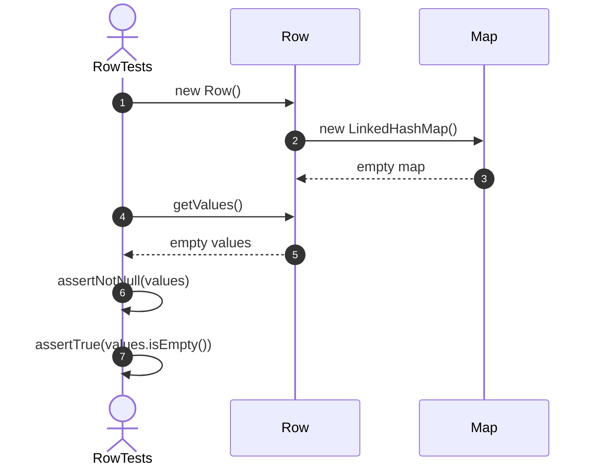
```mermaid
sequenceDiagram
    autonumber

    actor Test as RowTests
    participant Row as Row
    participant Values as Map

    Test->>Row: new Row()

    Row->>Values: new LinkedHashMap()
    Values-->>Row: empty map

    Test->>Row: getValues()
    Row-->>Test: empty values

    Test->>Test: assertNotNull(values)
    Test->>Test: assertTrue(values.isEmpty())
```

---

# 5. Constructor_ShouldInitializeActiveState

A newly created row should not be deleted.

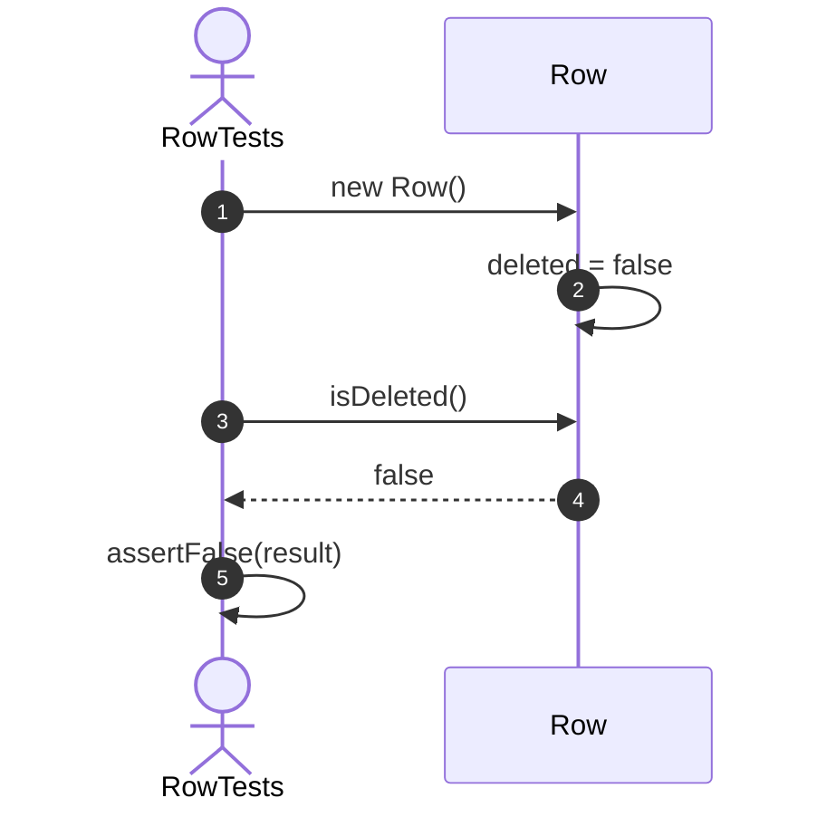
```mermaid
sequenceDiagram
    autonumber

    actor Test as RowTests
    participant Row as Row

    Test->>Row: new Row()

    Row->>Row: deleted = false

    Test->>Row: isDeleted()
    Row-->>Test: false

    Test->>Test: assertFalse(result)
```

---

# 6. SetValue_ShouldStoreValueSuccessfully

Verifies that a column value can be stored in the row.

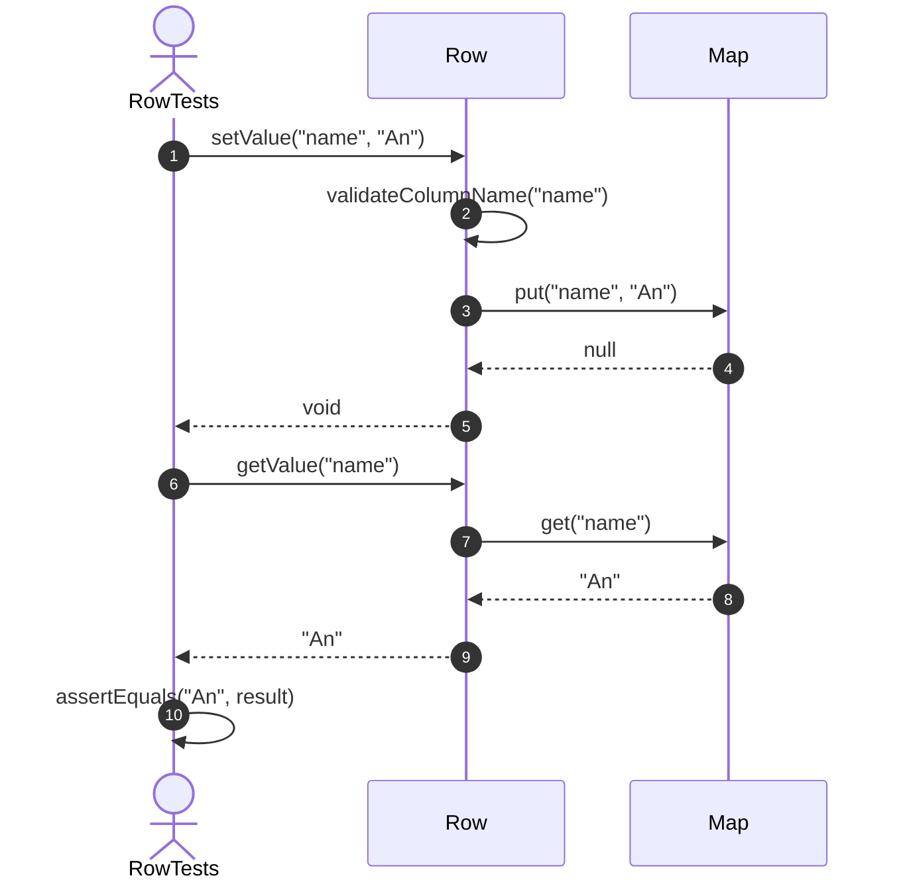
```mermaid
sequenceDiagram
    autonumber

    actor Test as RowTests
    participant Row as Row
    participant Values as Map

    Test->>Row: setValue("name", "An")

    Row->>Row: validateColumnName("name")
    Row->>Values: put("name", "An")
    Values-->>Row: null

    Row-->>Test: void

    Test->>Row: getValue("name")
    Row->>Values: get("name")
    Values-->>Row: "An"
    Row-->>Test: "An"

    Test->>Test: assertEquals("An", result)
```

---

# 7. SetValue_ShouldStoreMultipleValues

Verifies that one row can store values for several columns.

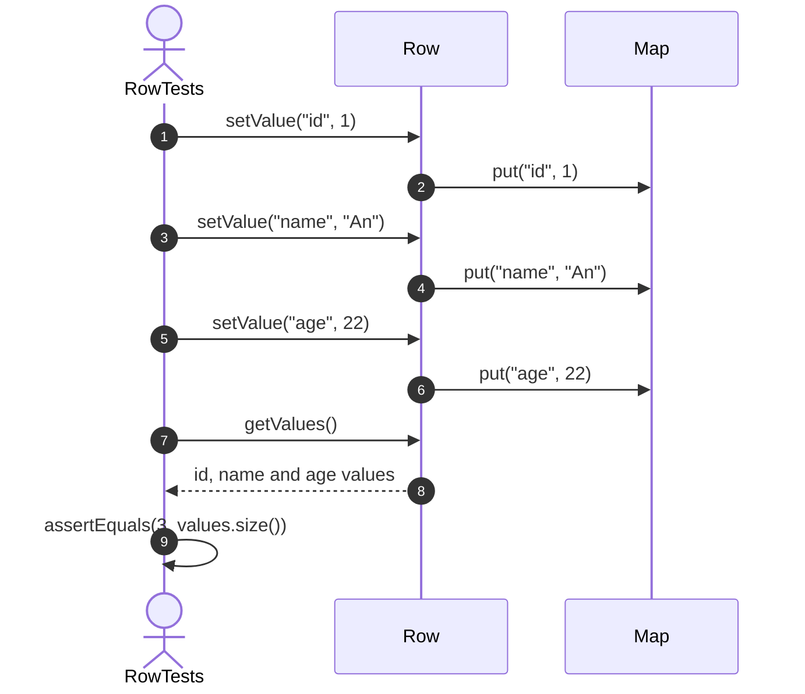
```mermaid
sequenceDiagram
    autonumber

    actor Test as RowTests
    participant Row as Row
    participant Values as Map

    Test->>Row: setValue("id", 1)
    Row->>Values: put("id", 1)

    Test->>Row: setValue("name", "An")
    Row->>Values: put("name", "An")

    Test->>Row: setValue("age", 22)
    Row->>Values: put("age", 22)

    Test->>Row: getValues()
    Row-->>Test: id, name and age values

    Test->>Test: assertEquals(3, values.size())
```

---

# 8. SetValue_ShouldReplaceExistingValue

Verifies that updating an existing column replaces its previous value.

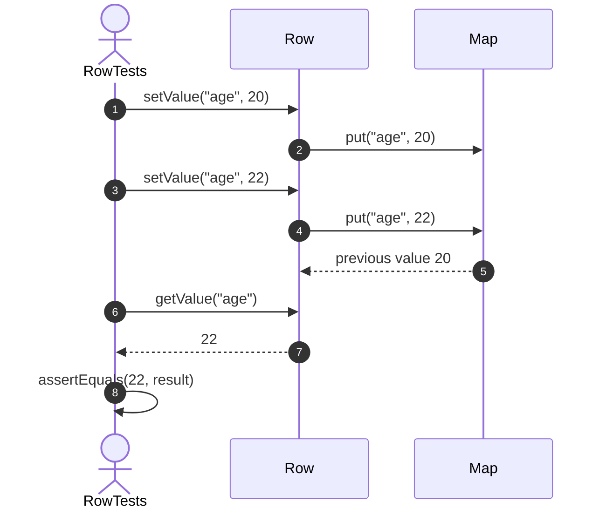
```mermaid
sequenceDiagram
    autonumber

    actor Test as RowTests
    participant Row as Row
    participant Values as Map

    Test->>Row: setValue("age", 20)
    Row->>Values: put("age", 20)

    Test->>Row: setValue("age", 22)
    Row->>Values: put("age", 22)
    Values-->>Row: previous value 20

    Test->>Row: getValue("age")
    Row-->>Test: 22

    Test->>Test: assertEquals(22, result)
```

---

# 9. SetValue_ShouldAllowNullValue

A row may contain `null`; whether it is allowed should later be decided by `Column` or `Constraint`.

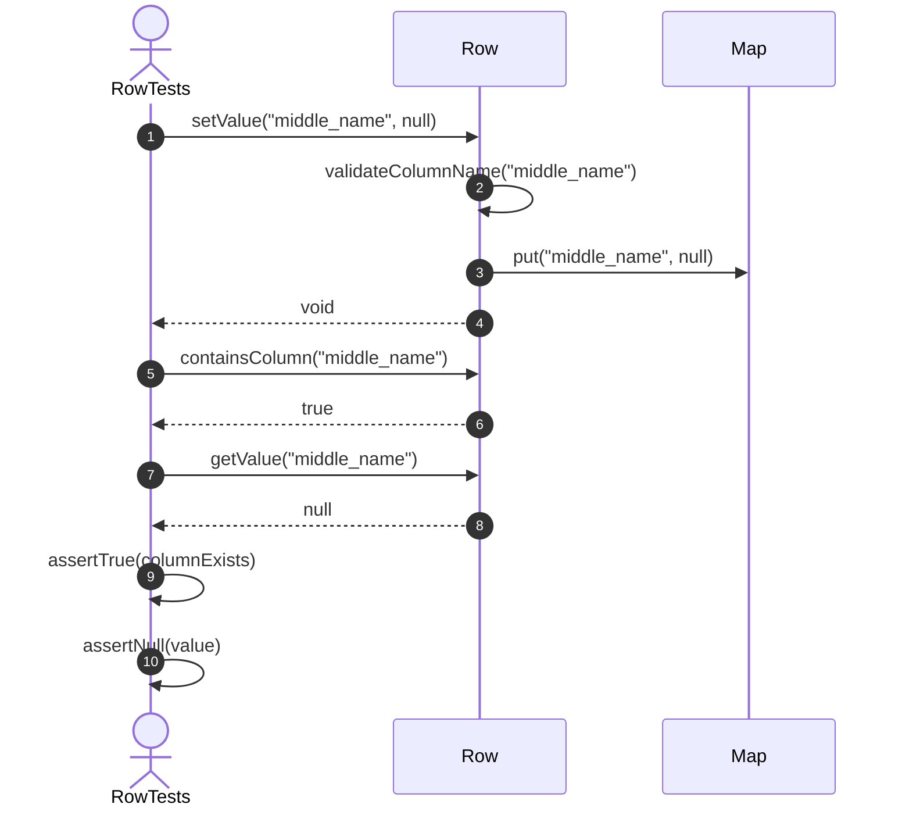
```mermaid
sequenceDiagram
    autonumber

    actor Test as RowTests
    participant Row as Row
    participant Values as Map

    Test->>Row: setValue("middle_name", null)

    Row->>Row: validateColumnName("middle_name")
    Row->>Values: put("middle_name", null)

    Row-->>Test: void

    Test->>Row: containsColumn("middle_name")
    Row-->>Test: true

    Test->>Row: getValue("middle_name")
    Row-->>Test: null

    Test->>Test: assertTrue(columnExists)
    Test->>Test: assertNull(value)
```

---

# 10. SetValue_ShouldRejectNullColumnName

Verifies that a column name cannot be `null`.

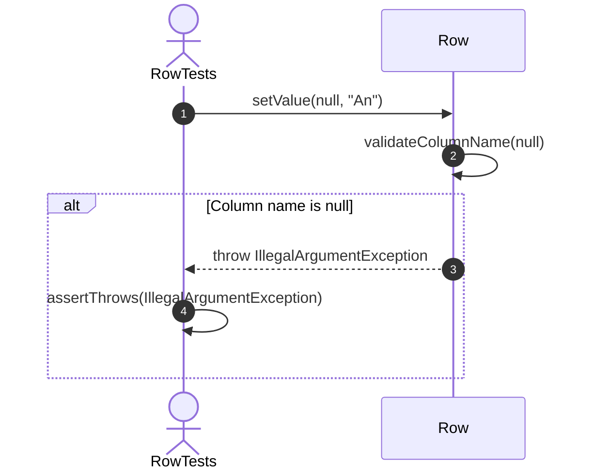
```mermaid
sequenceDiagram
    autonumber

    actor Test as RowTests
    participant Row as Row

    Test->>Row: setValue(null, "An")

    Row->>Row: validateColumnName(null)

    alt Column name is null
        Row-->>Test: throw IllegalArgumentException
        Test->>Test: assertThrows(IllegalArgumentException)
    end
```

---

# 11. SetValue_ShouldRejectBlankColumnName

Verifies that an empty or blank column name is rejected.

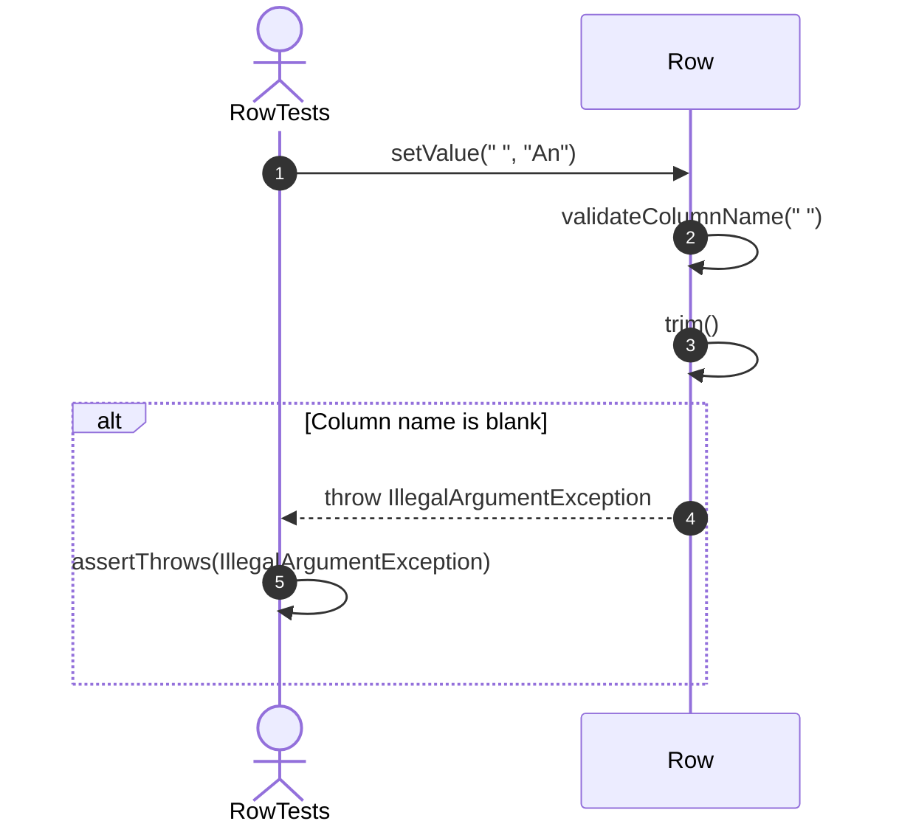
```mermaid
sequenceDiagram
    autonumber

    actor Test as RowTests
    participant Row as Row

    Test->>Row: setValue("   ", "An")

    Row->>Row: validateColumnName("   ")
    Row->>Row: trim()

    alt Column name is blank
        Row-->>Test: throw IllegalArgumentException
        Test->>Test: assertThrows(IllegalArgumentException)
    end
```

---

# 12. GetValue_ShouldReturnExistingValue

Verifies that an existing column value can be retrieved.

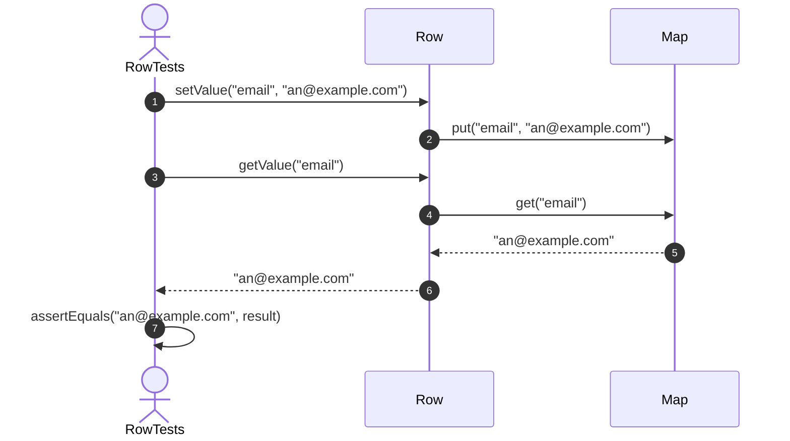
```mermaid
sequenceDiagram
    autonumber

    actor Test as RowTests
    participant Row as Row
    participant Values as Map

    Test->>Row: setValue("email", "an@example.com")
    Row->>Values: put("email", "an@example.com")

    Test->>Row: getValue("email")

    Row->>Values: get("email")
    Values-->>Row: "an@example.com"

    Row-->>Test: "an@example.com"

    Test->>Test: assertEquals("an@example.com", result)
```

---

# 13. GetValue_ShouldReturnNullForMissingColumn

The simplest design returns `null` when a column does not exist.

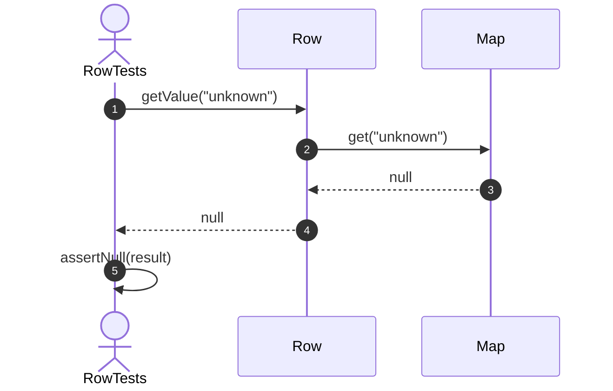
```mermaid
sequenceDiagram
    autonumber

    actor Test as RowTests
    participant Row as Row
    participant Values as Map

    Test->>Row: getValue("unknown")

    Row->>Values: get("unknown")
    Values-->>Row: null

    Row-->>Test: null

    Test->>Test: assertNull(result)
```

---

# 14. ContainsColumn_ShouldReturnTrueForExistingColumn

Verifies detection of an existing column.

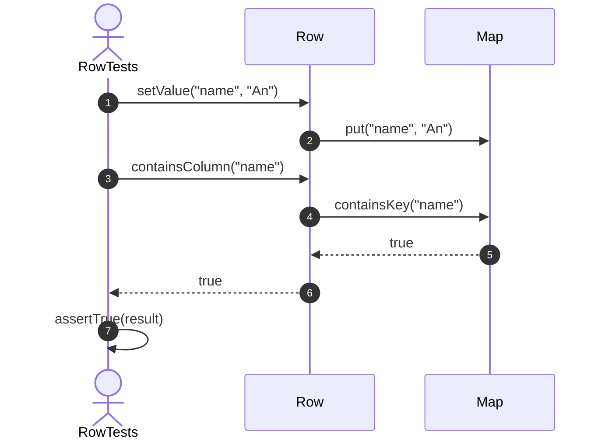
```mermaid
sequenceDiagram
    autonumber

    actor Test as RowTests
    participant Row as Row
    participant Values as Map

    Test->>Row: setValue("name", "An")
    Row->>Values: put("name", "An")

    Test->>Row: containsColumn("name")

    Row->>Values: containsKey("name")
    Values-->>Row: true

    Row-->>Test: true

    Test->>Test: assertTrue(result)
```

---

# 15. ContainsColumn_ShouldReturnFalseForMissingColumn

Verifies detection of a missing column.

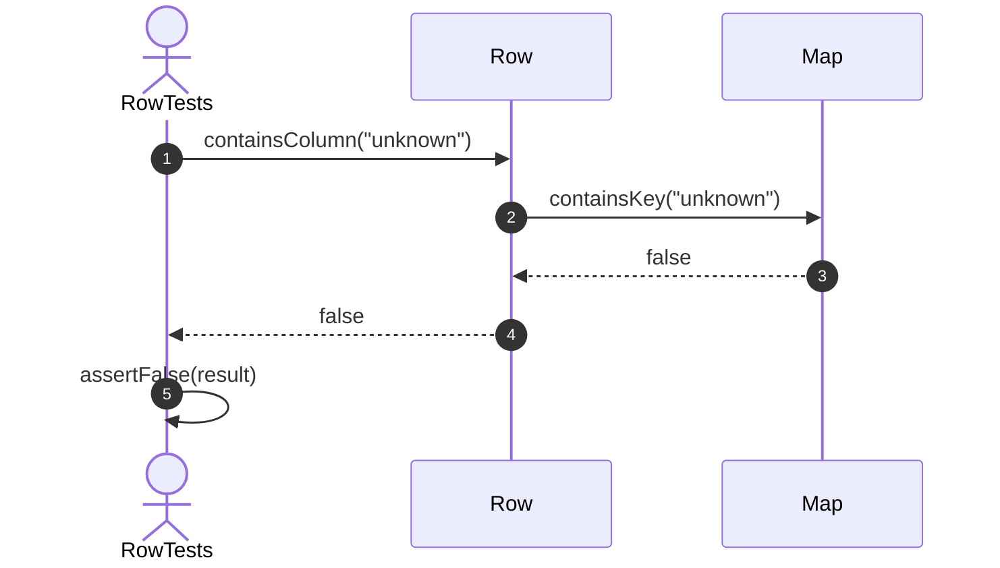
```mermaid
sequenceDiagram
    autonumber

    actor Test as RowTests
    participant Row as Row
    participant Values as Map

    Test->>Row: containsColumn("unknown")

    Row->>Values: containsKey("unknown")
    Values-->>Row: false

    Row-->>Test: false

    Test->>Test: assertFalse(result)
```

---

# 16. RemoveValue_ShouldRemoveExistingColumnValue

Verifies that a value can be removed from a row.

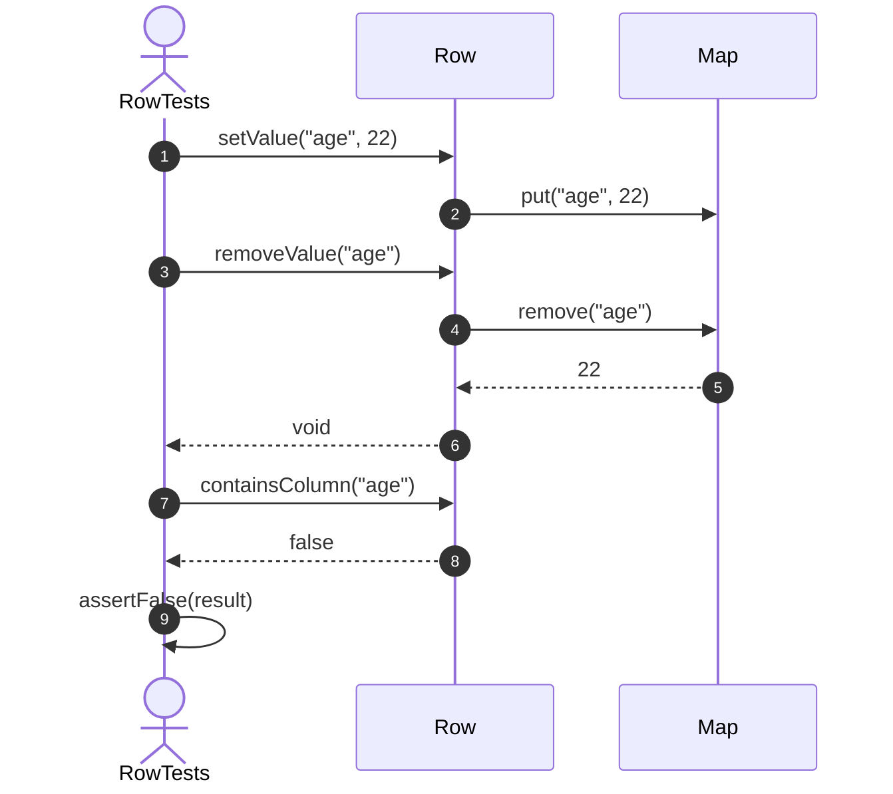
```mermaid
sequenceDiagram
    autonumber

    actor Test as RowTests
    participant Row as Row
    participant Values as Map

    Test->>Row: setValue("age", 22)
    Row->>Values: put("age", 22)

    Test->>Row: removeValue("age")

    Row->>Values: remove("age")
    Values-->>Row: 22

    Row-->>Test: void

    Test->>Row: containsColumn("age")
    Row-->>Test: false

    Test->>Test: assertFalse(result)
```

---

# 17. RemoveValue_ShouldDoNothingForMissingColumn

Removing a missing value should not corrupt the row.

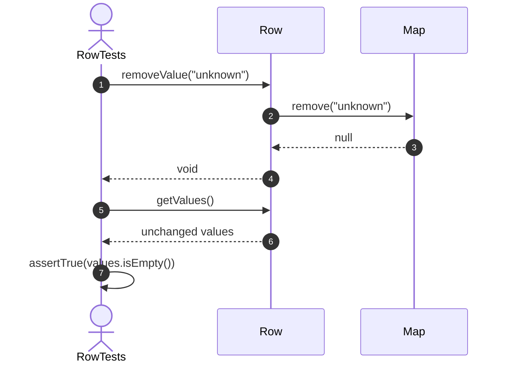
```mermaid
sequenceDiagram
    autonumber

    actor Test as RowTests
    participant Row as Row
    participant Values as Map

    Test->>Row: removeValue("unknown")

    Row->>Values: remove("unknown")
    Values-->>Row: null

    Row-->>Test: void

    Test->>Row: getValues()
    Row-->>Test: unchanged values

    Test->>Test: assertTrue(values.isEmpty())
```

---

# 18. UpdateValues_ShouldUpdateMultipleColumns

Verifies batch updates.

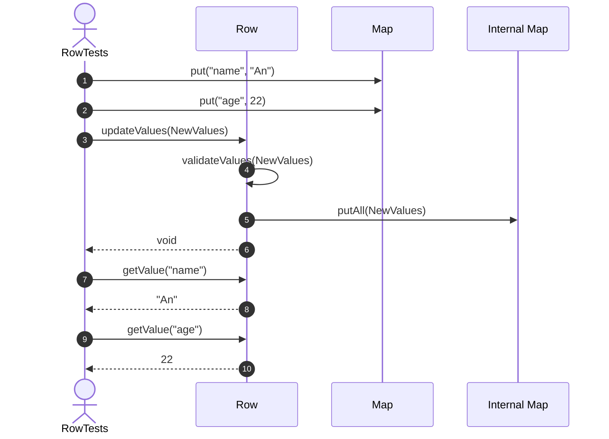
```mermaid
sequenceDiagram
    autonumber

    actor Test as RowTests
    participant Row as Row
    participant NewValues as Map
    participant Values as Internal Map

    Test->>NewValues: put("name", "An")
    Test->>NewValues: put("age", 22)

    Test->>Row: updateValues(NewValues)

    Row->>Row: validateValues(NewValues)
    Row->>Values: putAll(NewValues)

    Row-->>Test: void

    Test->>Row: getValue("name")
    Row-->>Test: "An"

    Test->>Row: getValue("age")
    Row-->>Test: 22
```

---

# 19. UpdateValues_ShouldRejectNullMap

Verifies that the update map cannot be `null`.

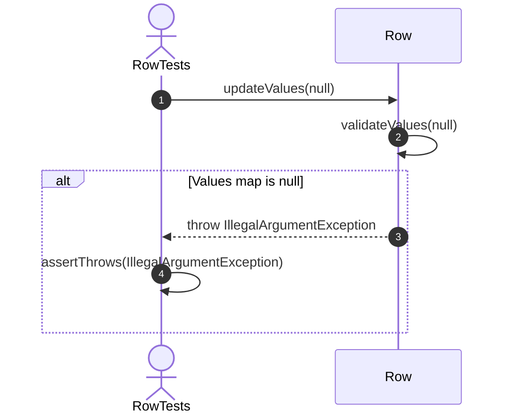
```mermaid
sequenceDiagram
    autonumber

    actor Test as RowTests
    participant Row as Row

    Test->>Row: updateValues(null)

    Row->>Row: validateValues(null)

    alt Values map is null
        Row-->>Test: throw IllegalArgumentException
        Test->>Test: assertThrows(IllegalArgumentException)
    end
```

---

# 20. UpdateValues_ShouldNotPartiallyUpdateWhenValidationFails

The row should remain unchanged if one update entry is invalid.

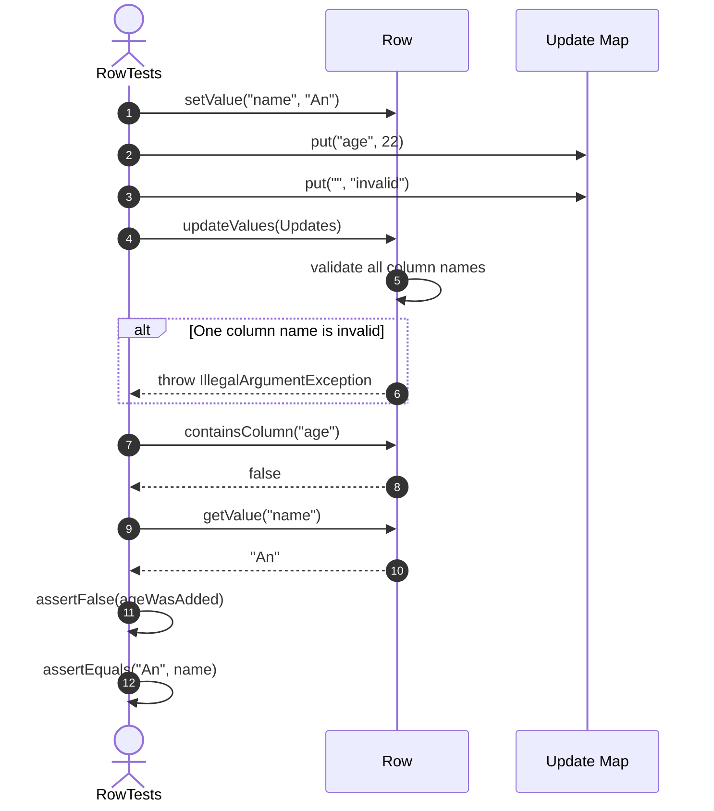
```mermaid
sequenceDiagram
    autonumber

    actor Test as RowTests
    participant Row as Row
    participant Updates as Update Map

    Test->>Row: setValue("name", "An")

    Test->>Updates: put("age", 22)
    Test->>Updates: put("", "invalid")

    Test->>Row: updateValues(Updates)

    Row->>Row: validate all column names

    alt One column name is invalid
        Row-->>Test: throw IllegalArgumentException
    end

    Test->>Row: containsColumn("age")
    Row-->>Test: false

    Test->>Row: getValue("name")
    Row-->>Test: "An"

    Test->>Test: assertFalse(ageWasAdded)
    Test->>Test: assertEquals("An", name)
```

---

# 21. MarkDeleted_ShouldMarkRowAsDeleted

Verifies logical deletion.

```mermaid
sequenceDiagram
    autonumber

    actor Test as RowTests
    participant Row as Row

    Test->>Row: markDeleted()

    Row->>Row: deleted = true
    Row-->>Test: void

    Test->>Row: isDeleted()
    Row-->>Test: true

    Test->>Test: assertTrue(result)
```

---

# 22. MarkDeleted_ShouldBeIdempotent

Calling `markDeleted()` more than once should keep a valid state.

```mermaid
sequenceDiagram
    autonumber

    actor Test as RowTests
    participant Row as Row

    Test->>Row: markDeleted()
    Row->>Row: deleted = true

    Test->>Row: markDeleted()

    alt Row is already deleted
        Row->>Row: keep deleted = true
        Row-->>Test: void
    end

    Test->>Row: isDeleted()
    Row-->>Test: true
```

---

# 23. Restore_ShouldRestoreDeletedRow

Verifies that a logically deleted row can be restored.

```mermaid
sequenceDiagram
    autonumber

    actor Test as RowTests
    participant Row as Row

    Test->>Row: markDeleted()
    Row->>Row: deleted = true

    Test->>Row: restore()
    Row->>Row: deleted = false
    Row-->>Test: void

    Test->>Row: isDeleted()
    Row-->>Test: false

    Test->>Test: assertFalse(result)
```

---

# 24. GetValues_ShouldReturnAllValues

Verifies that all row data can be read.

```mermaid
sequenceDiagram
    autonumber

    actor Test as RowTests
    participant Row as Row
    participant Values as Map

    Test->>Row: setValue("id", 1)
    Test->>Row: setValue("name", "An")

    Test->>Row: getValues()

    Row->>Values: create unmodifiable view
    Values-->>Row: read-only values

    Row-->>Test: values

    Test->>Test: assertEquals(2, values.size())
    Test->>Test: assertEquals(1, values.get("id"))
    Test->>Test: assertEquals("An", values.get("name"))
```

---

# 25. GetValues_ShouldReturnUnmodifiableMap

External code should not directly modify the row's internal map.

```mermaid
sequenceDiagram
    autonumber

    actor Test as RowTests
    participant Row as Row
    participant Values as Returned Map

    Test->>Row: setValue("id", 1)

    Test->>Row: getValues()
    Row-->>Test: unmodifiable values

    Test->>Values: put("name", "An")

    alt Map is unmodifiable
        Values-->>Test: throw UnsupportedOperationException
        Test->>Test: assertThrows(UnsupportedOperationException)
    end
```

---

# 26. Copy_ShouldCreateNewRow

Verifies that copying creates a different object.

```mermaid
sequenceDiagram
    autonumber

    actor Test as RowTests
    participant Original as Original Row
    participant Copy as Copied Row

    Test->>Original: setValue("name", "An")

    Test->>Original: copy()

    Original->>Copy: new Row()
    Original->>Copy: copy values
    Copy-->>Original: copiedRow

    Original-->>Test: copiedRow

    Test->>Test: assertNotSame(original, copiedRow)
```

---

# 27. Copy_ShouldCopyAllValues

Verifies that the copied row contains the same data.

```mermaid
sequenceDiagram
    autonumber

    actor Test as RowTests
    participant Original as Original Row
    participant Copy as Copied Row

    Test->>Original: setValue("id", 1)
    Test->>Original: setValue("name", "An")

    Test->>Original: copy()
    Original-->>Test: copiedRow

    Test->>Copy: getValue("id")
    Copy-->>Test: 1

    Test->>Copy: getValue("name")
    Copy-->>Test: "An"

    Test->>Test: assertEquals(1, copiedId)
    Test->>Test: assertEquals("An", copiedName)
```

---

# 28. Copy_ShouldCreateIndependentValues

Changing the copied row must not change the original row.

```mermaid
sequenceDiagram
    autonumber

    actor Test as RowTests
    participant Original as Original Row
    participant Copy as Copied Row

    Test->>Original: setValue("name", "An")

    Test->>Original: copy()
    Original-->>Test: copiedRow

    Test->>Copy: setValue("name", "Binh")

    Test->>Original: getValue("name")
    Original-->>Test: "An"

    Test->>Copy: getValue("name")
    Copy-->>Test: "Binh"

    Test->>Test: assertEquals("An", originalName)
    Test->>Test: assertEquals("Binh", copiedName)
```

---

# 29. Equals_ShouldReturnTrueForEqualRows

This test assumes equality is based on row values rather than generated IDs.

```mermaid
sequenceDiagram
    autonumber

    actor Test as RowTests
    participant Row1 as Row 1
    participant Row2 as Row 2

    Test->>Row1: setValue("id", 1)
    Test->>Row1: setValue("name", "An")

    Test->>Row2: setValue("id", 1)
    Test->>Row2: setValue("name", "An")

    Test->>Row1: equals(Row2)

    Row1->>Row2: getValues()
    Row2-->>Row1: same values

    Row1-->>Test: true

    Test->>Test: assertTrue(result)
```

---

# 30. Equals_ShouldReturnFalseForDifferentRows

Verifies that rows with different values are not equal.

```mermaid
sequenceDiagram
    autonumber

    actor Test as RowTests
    participant Row1 as Row 1
    participant Row2 as Row 2

    Test->>Row1: setValue("name", "An")
    Test->>Row2: setValue("name", "Binh")

    Test->>Row1: equals(Row2)

    Row1->>Row2: getValues()
    Row2-->>Row1: different values

    Row1-->>Test: false

    Test->>Test: assertFalse(result)
```

---

# 31. CalculateSize_ShouldReturnZeroForEmptyRow

Verifies the size of a row with no values.

```mermaid
sequenceDiagram
    autonumber

    actor Test as RowTests
    participant Row as Row

    Test->>Row: calculateSize()

    Row->>Row: iterate over empty values
    Row-->>Test: 0

    Test->>Test: assertEquals(0, result)
```

---

# 32. CalculateSize_ShouldReturnPositiveSize

The first implementation may use a simple estimated size.

```mermaid
sequenceDiagram
    autonumber

    actor Test as RowTests
    participant Row as Row
    participant Values as Map

    Test->>Row: setValue("id", 1)
    Test->>Row: setValue("name", "An")

    Test->>Row: calculateSize()

    loop Every stored value
        Row->>Values: read value
        Values-->>Row: value
        Row->>Row: estimate value size
    end

    Row-->>Test: calculatedSize

    Test->>Test: assertTrue(calculatedSize > 0)
```

---

# 33. CalculateSize_ShouldIncreaseWhenValueIsAdded

Verifies that adding data increases the calculated size.

```mermaid
sequenceDiagram
    autonumber

    actor Test as RowTests
    participant Row as Row

    Test->>Row: setValue("name", An)

    Test->>Row: calculateSize()
    Row-->>Test: initialSize

    Test->>Row: setValue("description", "A longer description")

    Test->>Row: calculateSize()
    Row-->>Test: updatedSize

    Test->>Test: assertTrue(updatedSize > initialSize)
```

---

# Recommended Implementation Order

Implement the Row tests in this order:

```text
1. Constructor_ShouldCreateRow
2. Constructor_ShouldGenerateRowId
3. Constructor_ShouldInitializeEmptyValues
4. Constructor_ShouldInitializeActiveState

5. SetValue_ShouldStoreValueSuccessfully
6. SetValue_ShouldStoreMultipleValues
7. SetValue_ShouldReplaceExistingValue
8. GetValue_ShouldReturnExistingValue
9. GetValue_ShouldReturnNullForMissingColumn

10. ContainsColumn_ShouldReturnTrueForExistingColumn
11. ContainsColumn_ShouldReturnFalseForMissingColumn
12. RemoveValue_ShouldRemoveExistingColumnValue

13. SetValue_ShouldRejectNullColumnName
14. SetValue_ShouldRejectBlankColumnName
15. UpdateValues_ShouldUpdateMultipleColumns
16. UpdateValues_ShouldNotPartiallyUpdateWhenValidationFails

17. MarkDeleted_ShouldMarkRowAsDeleted
18. Restore_ShouldRestoreDeletedRow

19. GetValues_ShouldReturnUnmodifiableMap
20. Copy_ShouldCreateNewRow
21. Copy_ShouldCreateIndependentValues

22. Equals_ShouldReturnTrueForEqualRows
23. Equals_ShouldReturnFalseForDifferentRows

24. CalculateSize_ShouldReturnPositiveSize
25. CalculateSize_ShouldIncreaseWhenValueIsAdded
```

# Tests to Postpone

The following tests should not be included in the first `RowTests` implementation:

```text
Serialize_ShouldConvertRowToBytes
Deserialize_ShouldRestoreRowFromBytes
Deserialize_ShouldThrowWhenDataCorrupted

CloneVersion_ShouldCreateNewVersion
RestoreVersion_ShouldRestorePreviousVersion
RestoreVersion_ShouldThrowWhenVersionNotFound

ConcurrentInsert_ShouldRemainConsistent
ConcurrentUpdate_ShouldPreventLostUpdate
ConcurrentDelete_ShouldMaintainConsistency
ConcurrentVersioning_ShouldPreserveMVCC

Row_ShouldInteractWithPage
Row_ShouldInteractWithMVCCManager
Row_ShouldInteractWithStorageEngine
Row_ShouldInteractWithTransaction
```

These tests require serialization rules, page formats, MVCC, transactions, or concurrent storage behavior. They should be implemented later as integration or advanced unit tests.
