# Schema Testing Sequence Diagrams

Total test diagrams: **68**

# Constructor Tests

## 1. constructor_ShouldCreateSchema

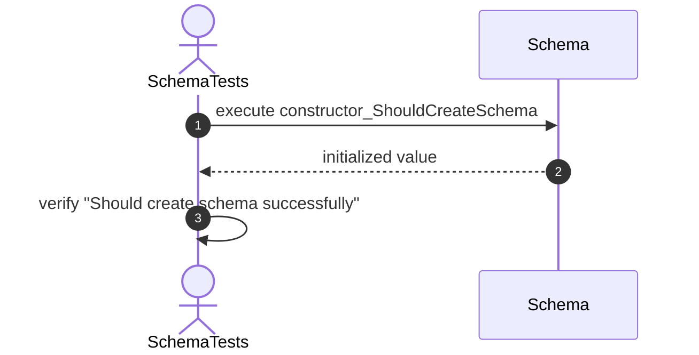
```mermaid
sequenceDiagram
    autonumber
    actor Test as SchemaTests
    participant Schema as Schema

    Test->>Schema: execute constructor_ShouldCreateSchema
    Schema-->>Test: initialized value
    Test->>Test: verify "Should create schema successfully"
```

## 2. constructor_ShouldGenerateSchemaId

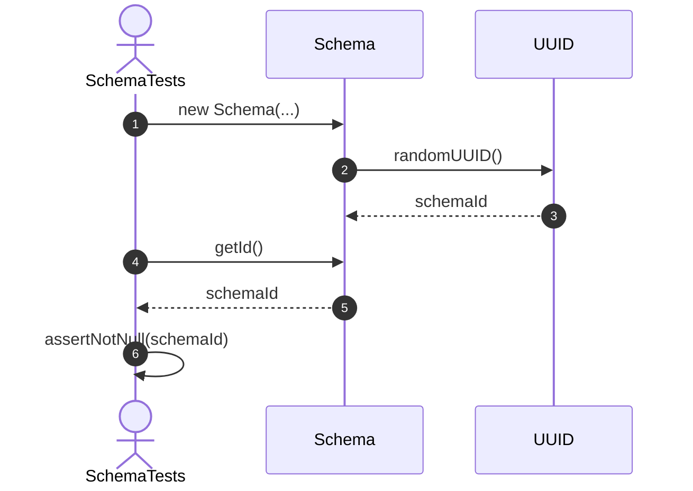
```mermaid
sequenceDiagram
    autonumber
    actor Test as SchemaTests
    participant Schema as Schema
    participant UUID as UUID

    Test->>Schema: new Schema(...)
    Schema->>UUID: randomUUID()
    UUID-->>Schema: schemaId
    Test->>Schema: getId()
    Schema-->>Test: schemaId
    Test->>Test: assertNotNull(schemaId)
```

## 3. constructor_ShouldGenerateUniqueSchemaIds

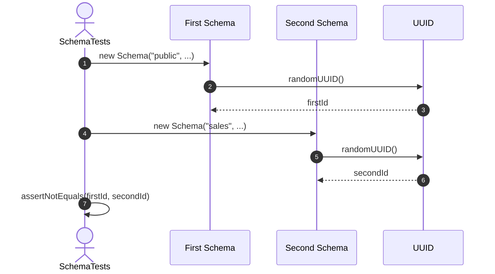
```mermaid
sequenceDiagram
    autonumber
    actor Test as SchemaTests
    participant First as First Schema
    participant Second as Second Schema
    participant UUID as UUID

    Test->>First: new Schema("public", ...)
    First->>UUID: randomUUID()
    UUID-->>First: firstId
    Test->>Second: new Schema("sales", ...)
    Second->>UUID: randomUUID()
    UUID-->>Second: secondId
    Test->>Test: assertNotEquals(firstId, secondId)
```

## 4. constructor_ShouldInitializeDatabaseId

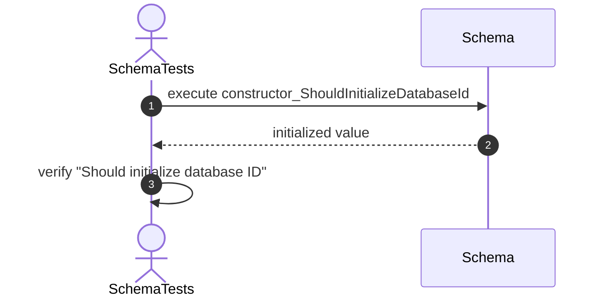
```mermaid
sequenceDiagram
    autonumber
    actor Test as SchemaTests
    participant Schema as Schema

    Test->>Schema: execute constructor_ShouldInitializeDatabaseId
    Schema-->>Test: initialized value
    Test->>Test: verify "Should initialize database ID"
```

## 5. constructor_ShouldInitializeOwnerId

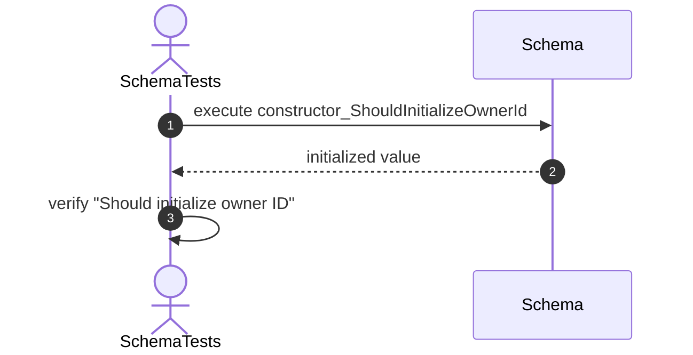
```mermaid
sequenceDiagram
    autonumber
    actor Test as SchemaTests
    participant Schema as Schema

    Test->>Schema: execute constructor_ShouldInitializeOwnerId
    Schema-->>Test: initialized value
    Test->>Test: verify "Should initialize owner ID"
```

## 6. constructor_ShouldInitializeEmptyTableCollection

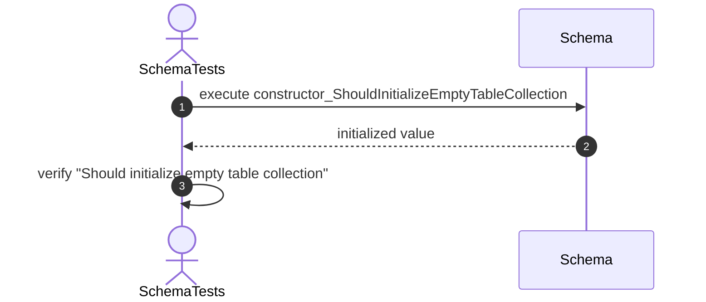
```mermaid
sequenceDiagram
    autonumber
    actor Test as SchemaTests
    participant Schema as Schema

    Test->>Schema: execute constructor_ShouldInitializeEmptyTableCollection
    Schema-->>Test: initialized value
    Test->>Test: verify "Should initialize empty table collection"
```

## 7. constructor_ShouldInitializeEmptyViewCollection

```mermaid
sequenceDiagram
    autonumber
    actor Test as SchemaTests
    participant Schema as Schema

    Test->>Schema: execute constructor_ShouldInitializeEmptyViewCollection
    Schema-->>Test: initialized value
    Test->>Test: verify "Should initialize empty view collection"
```

## 8. constructor_ShouldRejectNullName

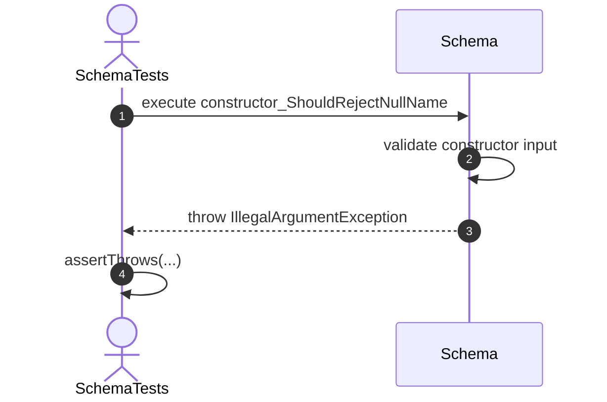
```mermaid
sequenceDiagram
    autonumber
    actor Test as SchemaTests
    participant Schema as Schema

    Test->>Schema: execute constructor_ShouldRejectNullName
    Schema->>Schema: validate constructor input
    Schema-->>Test: throw IllegalArgumentException
    Test->>Test: assertThrows(...)
```

## 9. constructor_ShouldRejectEmptyName

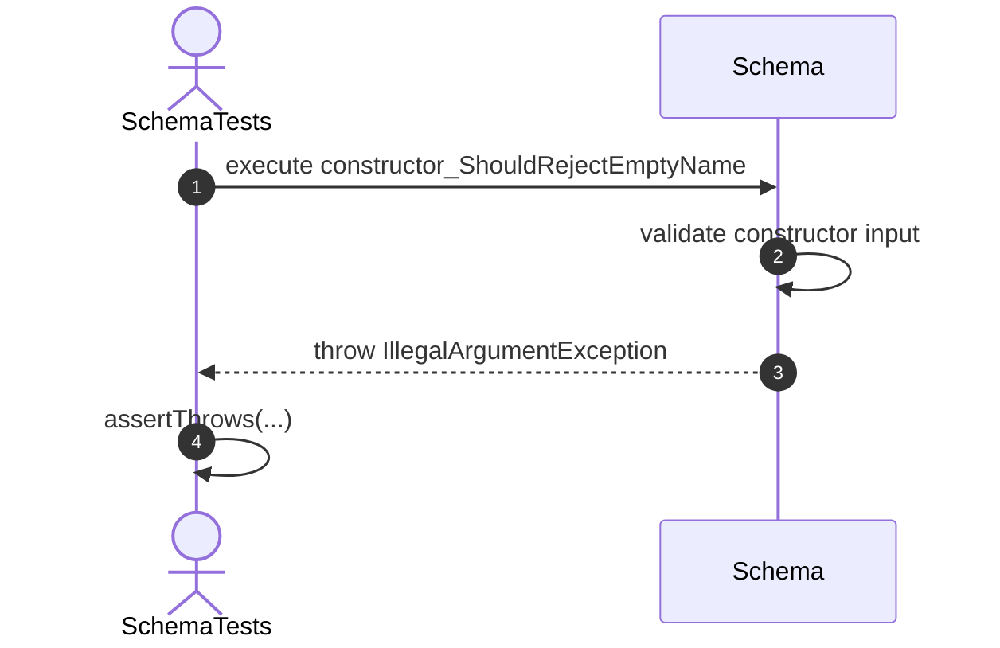
```mermaid
sequenceDiagram
    autonumber
    actor Test as SchemaTests
    participant Schema as Schema

    Test->>Schema: execute constructor_ShouldRejectEmptyName
    Schema->>Schema: validate constructor input
    Schema-->>Test: throw IllegalArgumentException
    Test->>Test: assertThrows(...)
```

## 10. constructor_ShouldRejectBlankName

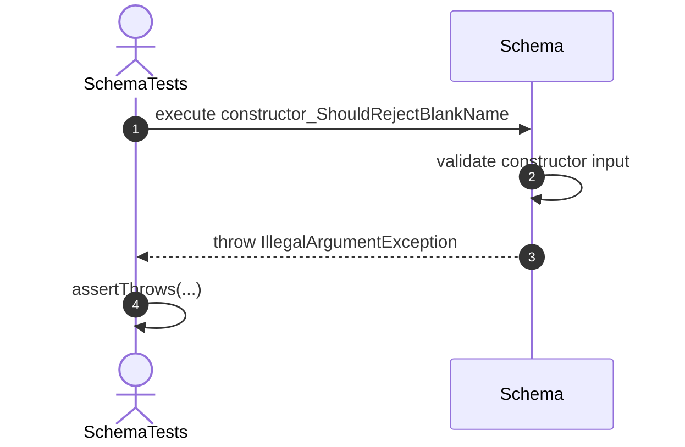
```mermaid
sequenceDiagram
    autonumber
    actor Test as SchemaTests
    participant Schema as Schema

    Test->>Schema: execute constructor_ShouldRejectBlankName
    Schema->>Schema: validate constructor input
    Schema-->>Test: throw IllegalArgumentException
    Test->>Test: assertThrows(...)
```

## 11. constructor_ShouldRejectNullDatabaseId

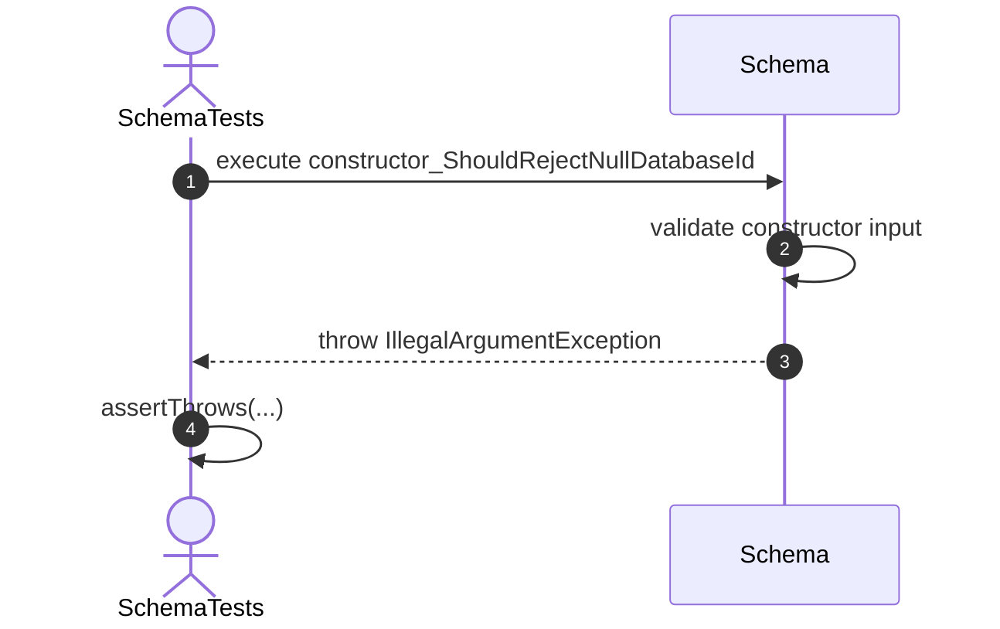
```mermaid
sequenceDiagram
    autonumber
    actor Test as SchemaTests
    participant Schema as Schema

    Test->>Schema: execute constructor_ShouldRejectNullDatabaseId
    Schema->>Schema: validate constructor input
    Schema-->>Test: throw IllegalArgumentException
    Test->>Test: assertThrows(...)
```

## 12. constructor_ShouldRejectNullOwnerId

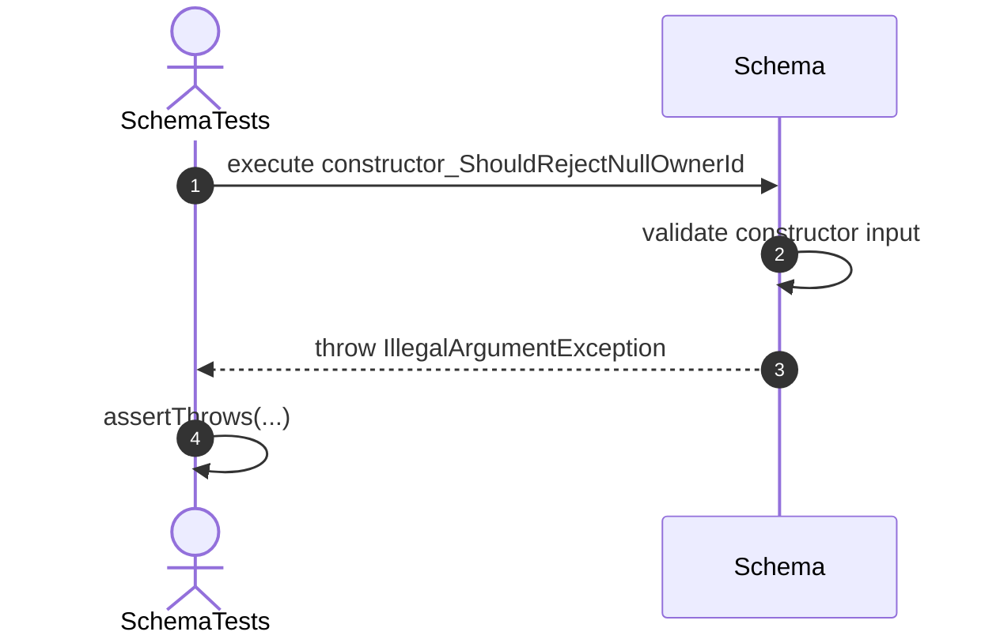
```mermaid
sequenceDiagram
    autonumber
    actor Test as SchemaTests
    participant Schema as Schema

    Test->>Schema: execute constructor_ShouldRejectNullOwnerId
    Schema->>Schema: validate constructor input
    Schema-->>Test: throw IllegalArgumentException
    Test->>Test: assertThrows(...)
```

# Functional - Name Tests

## 13. getName_ShouldReturnSchemaName

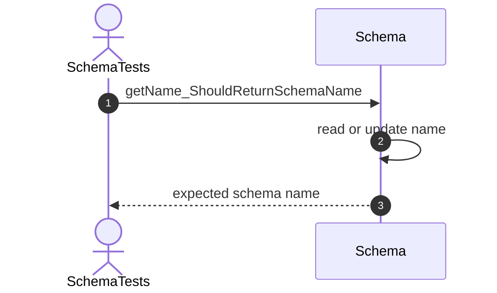
```mermaid
sequenceDiagram
    autonumber
    actor Test as SchemaTests
    participant Schema as Schema

    Test->>Schema: getName_ShouldReturnSchemaName
    Schema->>Schema: read or update name
    Schema-->>Test: expected schema name
```

## 14. rename_ShouldChangeSchemaName

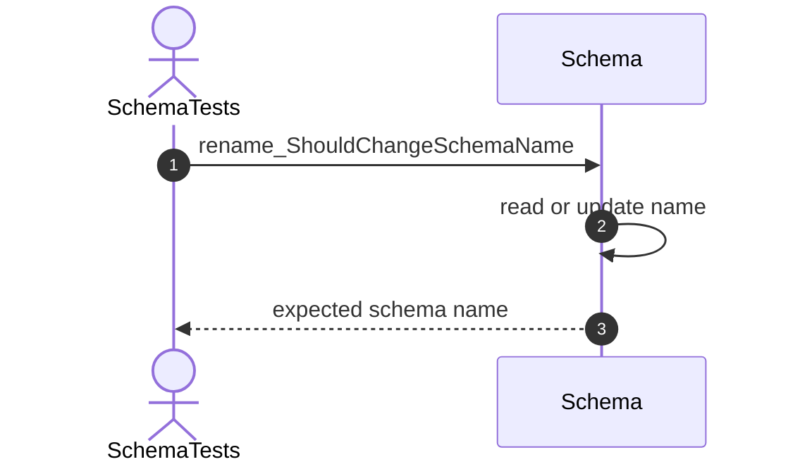
```mermaid
sequenceDiagram
    autonumber
    actor Test as SchemaTests
    participant Schema as Schema

    Test->>Schema: rename_ShouldChangeSchemaName
    Schema->>Schema: read or update name
    Schema-->>Test: expected schema name
```

## 15. rename_ShouldRejectNullName

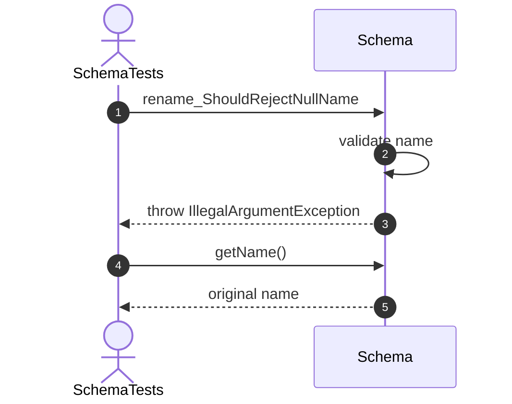
```mermaid
sequenceDiagram
    autonumber
    actor Test as SchemaTests
    participant Schema as Schema

    Test->>Schema: rename_ShouldRejectNullName
    Schema->>Schema: validate name
    Schema-->>Test: throw IllegalArgumentException
    Test->>Schema: getName()
    Schema-->>Test: original name
```

## 16. rename_ShouldRejectEmptyName

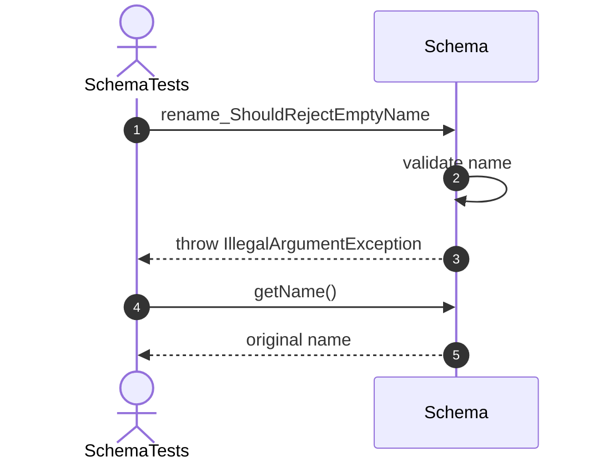
```mermaid
sequenceDiagram
    autonumber
    actor Test as SchemaTests
    participant Schema as Schema

    Test->>Schema: rename_ShouldRejectEmptyName
    Schema->>Schema: validate name
    Schema-->>Test: throw IllegalArgumentException
    Test->>Schema: getName()
    Schema-->>Test: original name
```

## 17. rename_ShouldRejectBlankName

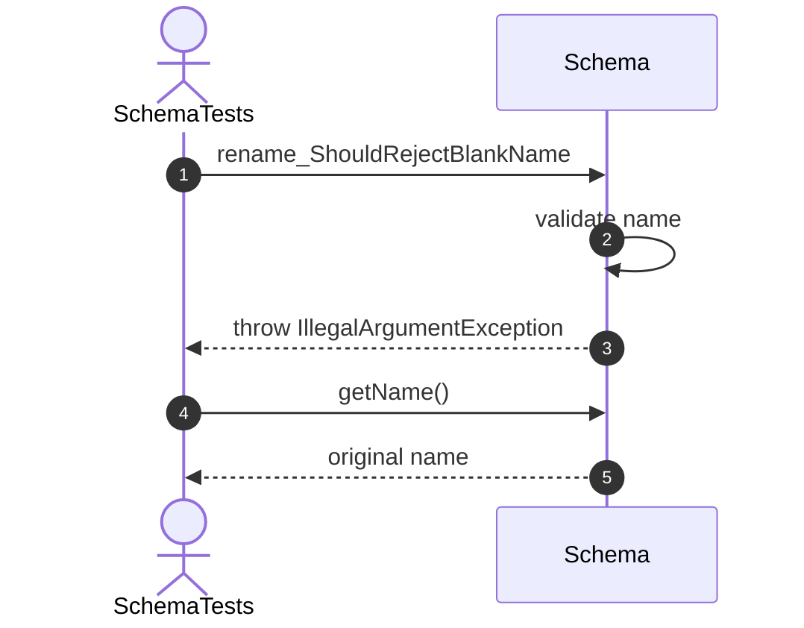
```mermaid
sequenceDiagram
    autonumber
    actor Test as SchemaTests
    participant Schema as Schema

    Test->>Schema: rename_ShouldRejectBlankName
    Schema->>Schema: validate name
    Schema-->>Test: throw IllegalArgumentException
    Test->>Schema: getName()
    Schema-->>Test: original name
```

# Functional - Table Management Tests

## 18. addTable_ShouldRegisterTable

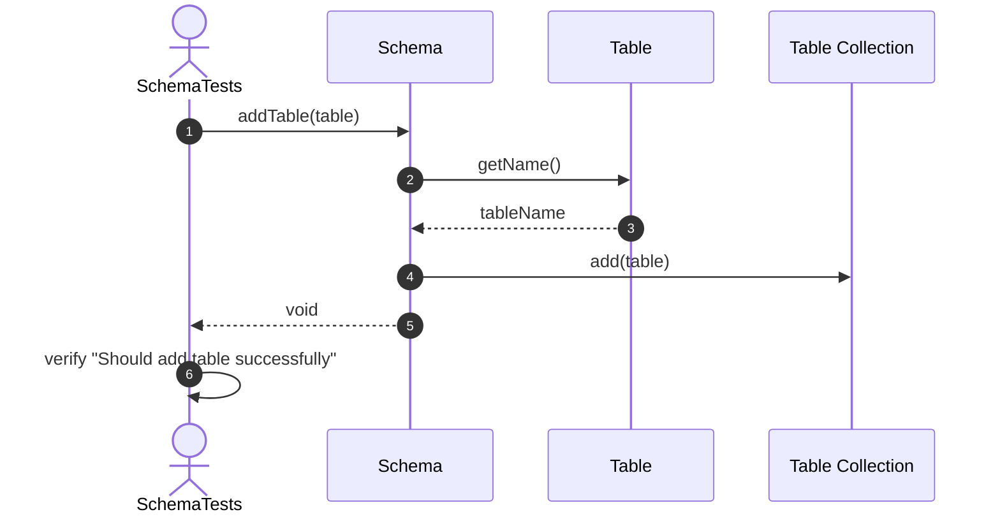
```mermaid
sequenceDiagram
    autonumber
    actor Test as SchemaTests
    participant Schema as Schema
    participant Table as Table
    participant Tables as Table Collection

    Test->>Schema: addTable(table)
    Schema->>Table: getName()
    Table-->>Schema: tableName
    Schema->>Tables: add(table)
    Schema-->>Test: void
    Test->>Test: verify "Should add table successfully"
```

## 19. addTable_ShouldIncreaseTableCount

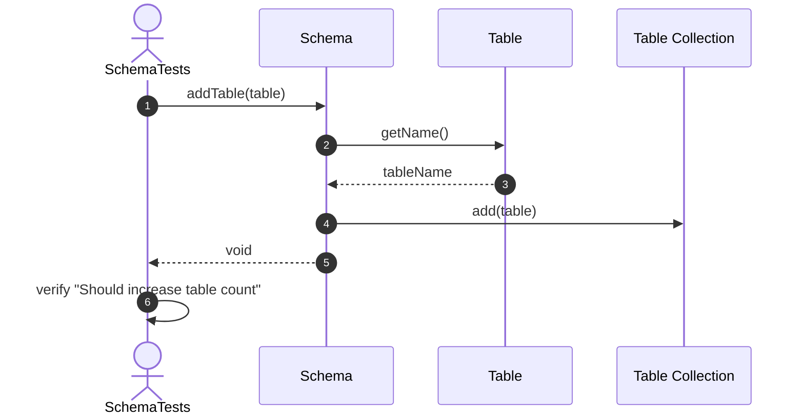
```mermaid
sequenceDiagram
    autonumber
    actor Test as SchemaTests
    participant Schema as Schema
    participant Table as Table
    participant Tables as Table Collection

    Test->>Schema: addTable(table)
    Schema->>Table: getName()
    Table-->>Schema: tableName
    Schema->>Tables: add(table)
    Schema-->>Test: void
    Test->>Test: verify "Should increase table count"
```

## 20. addTable_ShouldRegisterMultipleTables

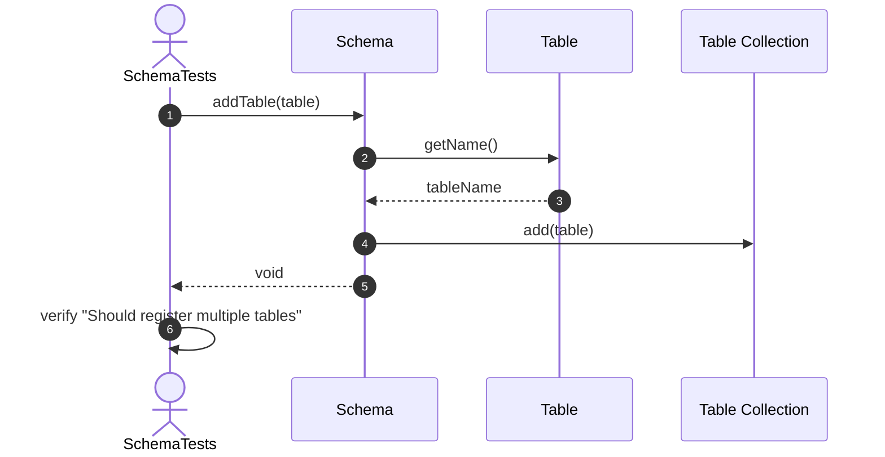
```mermaid
sequenceDiagram
    autonumber
    actor Test as SchemaTests
    participant Schema as Schema
    participant Table as Table
    participant Tables as Table Collection

    Test->>Schema: addTable(table)
    Schema->>Table: getName()
    Table-->>Schema: tableName
    Schema->>Tables: add(table)
    Schema-->>Test: void
    Test->>Test: verify "Should register multiple tables"
```

## 21. addTable_ShouldRejectNullTable

```mermaid
sequenceDiagram
    autonumber
    actor Test as SchemaTests
    participant Schema as Schema

    Test->>Schema: addTable(null)
    Schema-->>Test: throw IllegalArgumentException
```

## 22. addTable_ShouldRejectDuplicateTableName

```mermaid
sequenceDiagram
    autonumber
    actor Test as SchemaTests
    participant Schema as Schema
    participant Table as Table
    participant Tables as Table Collection

    Test->>Schema: addTable(usersTable)
    Schema->>Tables: add(usersTable)
    Test->>Schema: addTable(duplicateUsersTable)
    Schema->>Table: getName()
    Table-->>Schema: "users"
    Schema-->>Test: throw IllegalArgumentException
    Test->>Schema: getTableCount()
    Schema-->>Test: 1
```

## 23. getTable_ShouldReturnExistingTable

```mermaid
sequenceDiagram
    autonumber
    actor Test as SchemaTests
    participant Schema as Schema
    participant Tables as Table Collection

    Test->>Schema: getTable_ShouldReturnExistingTable
    Schema->>Tables: search by table name
    Tables-->>Schema: table or no match
    Schema-->>Test: expected result
```

## 24. getTable_ShouldReturnNullForMissingTable

```mermaid
sequenceDiagram
    autonumber
    actor Test as SchemaTests
    participant Schema as Schema
    participant Tables as Table Collection

    Test->>Schema: getTable_ShouldReturnNullForMissingTable
    Schema->>Tables: search by table name
    Tables-->>Schema: table or no match
    Schema-->>Test: expected result
```

## 25. containsTable_ShouldReturnTrueForExistingTable

```mermaid
sequenceDiagram
    autonumber
    actor Test as SchemaTests
    participant Schema as Schema
    participant Tables as Table Collection

    Test->>Schema: containsTable_ShouldReturnTrueForExistingTable
    Schema->>Tables: search by table name
    Tables-->>Schema: table or no match
    Schema-->>Test: expected result
```

## 26. containsTable_ShouldReturnFalseForMissingTable

```mermaid
sequenceDiagram
    autonumber
    actor Test as SchemaTests
    participant Schema as Schema
    participant Tables as Table Collection

    Test->>Schema: containsTable_ShouldReturnFalseForMissingTable
    Schema->>Tables: search by table name
    Tables-->>Schema: table or no match
    Schema-->>Test: expected result
```

## 27. removeTable_ShouldRemoveExistingTable

```mermaid
sequenceDiagram
    autonumber
    actor Test as SchemaTests
    participant Schema as Schema
    participant Tables as Table Collection

    Test->>Schema: removeTable_ShouldRemoveExistingTable
    Schema->>Tables: find table by name
    Tables-->>Schema: table or no match
    Schema->>Tables: remove when found
    Schema-->>Test: removed table or null
```

## 28. removeTable_ShouldDecreaseTableCount

```mermaid
sequenceDiagram
    autonumber
    actor Test as SchemaTests
    participant Schema as Schema
    participant Tables as Table Collection

    Test->>Schema: removeTable_ShouldDecreaseTableCount
    Schema->>Tables: find table by name
    Tables-->>Schema: table or no match
    Schema->>Tables: remove when found
    Schema-->>Test: removed table or null
```

## 29. removeTable_ShouldReturnNullForMissingTable

```mermaid
sequenceDiagram
    autonumber
    actor Test as SchemaTests
    participant Schema as Schema
    participant Tables as Table Collection

    Test->>Schema: removeTable_ShouldReturnNullForMissingTable
    Schema->>Tables: find table by name
    Tables-->>Schema: table or no match
    Schema->>Tables: remove when found
    Schema-->>Test: removed table or null
```

## 30. getTables_ShouldReturnUnmodifiableCollection

```mermaid
sequenceDiagram
    autonumber
    actor Test as SchemaTests
    participant Schema as Schema
    participant Tables as Table Collection

    Test->>Schema: getTables()
    Schema-->>Test: unmodifiable table collection
    Test->>Tables: attempt modification
    Tables-->>Test: throw UnsupportedOperationException
    Test->>Schema: getTableCount()
    Schema-->>Test: unchanged count
```

## 31. getTables_ShouldProtectInternalCollection

```mermaid
sequenceDiagram
    autonumber
    actor Test as SchemaTests
    participant Schema as Schema
    participant Tables as Table Collection

    Test->>Schema: getTables()
    Schema-->>Test: unmodifiable table collection
    Test->>Tables: attempt modification
    Tables-->>Test: throw UnsupportedOperationException
    Test->>Schema: getTableCount()
    Schema-->>Test: unchanged count
```

# Functional - View Management Tests

## 32. addView_ShouldRegisterView

```mermaid
sequenceDiagram
    autonumber
    actor Test as SchemaTests
    participant Schema as Schema
    participant View as View
    participant Views as View Collection

    Test->>Schema: addView(view)
    Schema->>View: getName()
    View-->>Schema: viewName
    Schema->>Views: add(view)
    Schema-->>Test: void
    Test->>Test: verify "Should add view successfully"
```

## 33. addView_ShouldIncreaseViewCount

```mermaid
sequenceDiagram
    autonumber
    actor Test as SchemaTests
    participant Schema as Schema
    participant View as View
    participant Views as View Collection

    Test->>Schema: addView(view)
    Schema->>View: getName()
    View-->>Schema: viewName
    Schema->>Views: add(view)
    Schema-->>Test: void
    Test->>Test: verify "Should increase view count"
```

## 34. addView_ShouldRegisterMultipleViews

```mermaid
sequenceDiagram
    autonumber
    actor Test as SchemaTests
    participant Schema as Schema
    participant View as View
    participant Views as View Collection

    Test->>Schema: addView(view)
    Schema->>View: getName()
    View-->>Schema: viewName
    Schema->>Views: add(view)
    Schema-->>Test: void
    Test->>Test: verify "Should register multiple views"
```

## 35. addView_ShouldRejectNullView

```mermaid
sequenceDiagram
    autonumber
    actor Test as SchemaTests
    participant Schema as Schema

    Test->>Schema: addView(null)
    Schema-->>Test: throw IllegalArgumentException
```

## 36. addView_ShouldRejectDuplicateViewName

```mermaid
sequenceDiagram
    autonumber
    actor Test as SchemaTests
    participant Schema as Schema
    participant View as View
    participant Views as View Collection

    Test->>Schema: addView(activeUsersView)
    Schema->>Views: add(activeUsersView)
    Test->>Schema: addView(duplicateView)
    Schema->>View: getName()
    View-->>Schema: "active_users"
    Schema-->>Test: throw IllegalArgumentException
    Test->>Schema: getViewCount()
    Schema-->>Test: 1
```

## 37. getView_ShouldReturnExistingView

```mermaid
sequenceDiagram
    autonumber
    actor Test as SchemaTests
    participant Schema as Schema
    participant Views as View Collection

    Test->>Schema: getView_ShouldReturnExistingView
    Schema->>Views: search by view name
    Views-->>Schema: view or no match
    Schema-->>Test: expected result
```

## 38. getView_ShouldReturnNullForMissingView

```mermaid
sequenceDiagram
    autonumber
    actor Test as SchemaTests
    participant Schema as Schema
    participant Views as View Collection

    Test->>Schema: getView_ShouldReturnNullForMissingView
    Schema->>Views: search by view name
    Views-->>Schema: view or no match
    Schema-->>Test: expected result
```

## 39. containsView_ShouldReturnTrueForExistingView

```mermaid
sequenceDiagram
    autonumber
    actor Test as SchemaTests
    participant Schema as Schema
    participant Views as View Collection

    Test->>Schema: containsView_ShouldReturnTrueForExistingView
    Schema->>Views: search by view name
    Views-->>Schema: view or no match
    Schema-->>Test: expected result
```

## 40. containsView_ShouldReturnFalseForMissingView

```mermaid
sequenceDiagram
    autonumber
    actor Test as SchemaTests
    participant Schema as Schema
    participant Views as View Collection

    Test->>Schema: containsView_ShouldReturnFalseForMissingView
    Schema->>Views: search by view name
    Views-->>Schema: view or no match
    Schema-->>Test: expected result
```

## 41. removeView_ShouldRemoveExistingView

```mermaid
sequenceDiagram
    autonumber
    actor Test as SchemaTests
    participant Schema as Schema
    participant Views as View Collection

    Test->>Schema: removeView_ShouldRemoveExistingView
    Schema->>Views: find view by name
    Views-->>Schema: view or no match
    Schema->>Views: remove when found
    Schema-->>Test: removed view or null
```

## 42. removeView_ShouldDecreaseViewCount

```mermaid
sequenceDiagram
    autonumber
    actor Test as SchemaTests
    participant Schema as Schema
    participant Views as View Collection

    Test->>Schema: removeView_ShouldDecreaseViewCount
    Schema->>Views: find view by name
    Views-->>Schema: view or no match
    Schema->>Views: remove when found
    Schema-->>Test: removed view or null
```

## 43. removeView_ShouldReturnNullForMissingView

```mermaid
sequenceDiagram
    autonumber
    actor Test as SchemaTests
    participant Schema as Schema
    participant Views as View Collection

    Test->>Schema: removeView_ShouldReturnNullForMissingView
    Schema->>Views: find view by name
    Views-->>Schema: view or no match
    Schema->>Views: remove when found
    Schema-->>Test: removed view or null
```

## 44. getViews_ShouldReturnUnmodifiableCollection

```mermaid
sequenceDiagram
    autonumber
    actor Test as SchemaTests
    participant Schema as Schema
    participant Views as View Collection

    Test->>Schema: getViews()
    Schema-->>Test: unmodifiable view collection
    Test->>Views: attempt modification
    Views-->>Test: throw UnsupportedOperationException
    Test->>Schema: getViewCount()
    Schema-->>Test: unchanged count
```

## 45. getViews_ShouldProtectInternalCollection

```mermaid
sequenceDiagram
    autonumber
    actor Test as SchemaTests
    participant Schema as Schema
    participant Views as View Collection

    Test->>Schema: getViews()
    Schema-->>Test: unmodifiable view collection
    Test->>Views: attempt modification
    Views-->>Test: throw UnsupportedOperationException
    Test->>Schema: getViewCount()
    Schema-->>Test: unchanged count
```

# Functional - State Tests

## 46. isEmpty_ShouldReturnTrueForNewSchema

```mermaid
sequenceDiagram
    autonumber
    actor Test as SchemaTests
    participant Schema as Schema
    participant Tables as Table Collection
    participant Views as View Collection

    Test->>Schema: isEmpty_ShouldReturnTrueForNewSchema
    Schema->>Tables: inspect table collection
    Tables-->>Schema: table state
    Schema->>Views: inspect view collection
    Views-->>Schema: view state
    Schema-->>Test: expected count or empty state
```

# Functional - Table Management Tests

## 47. isEmpty_ShouldReturnFalseWhenTableExists

```mermaid
sequenceDiagram
    autonumber
    actor Test as SchemaTests
    participant Schema as Schema
    participant Tables as Table Collection

    Test->>Schema: isEmpty_ShouldReturnFalseWhenTableExists
    Schema->>Tables: inspect table collection
    Tables-->>Schema: count or state
    Schema-->>Test: expected result
```

# Functional - View Management Tests

## 48. isEmpty_ShouldReturnFalseWhenViewExists

```mermaid
sequenceDiagram
    autonumber
    actor Test as SchemaTests
    participant Schema as Schema
    participant Views as View Collection

    Test->>Schema: isEmpty_ShouldReturnFalseWhenViewExists
    Schema->>Views: inspect view collection
    Views-->>Schema: count or state
    Schema-->>Test: expected result
```

# Functional - Table Management Tests

## 49. getTableCount_ShouldReturnCorrectCount

```mermaid
sequenceDiagram
    autonumber
    actor Test as SchemaTests
    participant Schema as Schema
    participant Tables as Table Collection

    Test->>Schema: getTableCount_ShouldReturnCorrectCount
    Schema->>Tables: inspect table collection
    Tables-->>Schema: count or state
    Schema-->>Test: expected result
```

# Functional - View Management Tests

## 50. getViewCount_ShouldReturnCorrectCount

```mermaid
sequenceDiagram
    autonumber
    actor Test as SchemaTests
    participant Schema as Schema
    participant Views as View Collection

    Test->>Schema: getViewCount_ShouldReturnCorrectCount
    Schema->>Views: inspect view collection
    Views-->>Schema: count or state
    Schema-->>Test: expected result
```

# Functional - State Tests

## 51. isEmpty_ShouldReturnTrueAfterRemovingAllObjects

```mermaid
sequenceDiagram
    autonumber
    actor Test as SchemaTests
    participant Schema as Schema
    participant Tables as Table Collection
    participant Views as View Collection

    Test->>Schema: isEmpty_ShouldReturnTrueAfterRemovingAllObjects
    Schema->>Tables: inspect table collection
    Tables-->>Schema: table state
    Schema->>Views: inspect view collection
    Views-->>Schema: view state
    Schema-->>Test: expected count or empty state
```

# Functional - Metadata Tests

## 52. getDatabaseId_ShouldReturnDatabaseId

```mermaid
sequenceDiagram
    autonumber
    actor Test as SchemaTests
    participant Schema as Schema

    Test->>Schema: getDatabaseId_ShouldReturnDatabaseId
    Schema->>Schema: read or update metadata UUID
    Schema-->>Test: expected UUID
```

## 53. setDatabaseId_ShouldUpdateDatabaseId

```mermaid
sequenceDiagram
    autonumber
    actor Test as SchemaTests
    participant Schema as Schema

    Test->>Schema: setDatabaseId_ShouldUpdateDatabaseId
    Schema->>Schema: read or update metadata UUID
    Schema-->>Test: expected UUID
```

## 54. setDatabaseId_ShouldRejectNullDatabaseId

```mermaid
sequenceDiagram
    autonumber
    actor Test as SchemaTests
    participant Schema as Schema

    Test->>Schema: setDatabaseId_ShouldRejectNullDatabaseId
    Schema->>Schema: validate UUID
    Schema-->>Test: throw IllegalArgumentException
```

## 55. getOwnerId_ShouldReturnOwnerId

```mermaid
sequenceDiagram
    autonumber
    actor Test as SchemaTests
    participant Schema as Schema

    Test->>Schema: getOwnerId_ShouldReturnOwnerId
    Schema->>Schema: read or update metadata UUID
    Schema-->>Test: expected UUID
```

## 56. setOwnerId_ShouldUpdateOwnerId

```mermaid
sequenceDiagram
    autonumber
    actor Test as SchemaTests
    participant Schema as Schema

    Test->>Schema: setOwnerId_ShouldUpdateOwnerId
    Schema->>Schema: read or update metadata UUID
    Schema-->>Test: expected UUID
```

## 57. setOwnerId_ShouldRejectNullOwnerId

```mermaid
sequenceDiagram
    autonumber
    actor Test as SchemaTests
    participant Schema as Schema

    Test->>Schema: setOwnerId_ShouldRejectNullOwnerId
    Schema->>Schema: validate UUID
    Schema-->>Test: throw IllegalArgumentException
```

# Validation and Exception Tests

## 58. addTable_ShouldNotModifyCollectionWhenDuplicateRejected

```mermaid
sequenceDiagram
    autonumber
    actor Test as SchemaTests
    participant Schema as Schema
    participant Table as Table
    participant Tables as Table Collection

    Test->>Schema: addTable(usersTable)
    Schema->>Tables: add(usersTable)
    Test->>Schema: addTable(duplicateUsersTable)
    Schema->>Table: getName()
    Table-->>Schema: "users"
    Schema-->>Test: throw IllegalArgumentException
    Test->>Schema: getTableCount()
    Schema-->>Test: 1
```

## 59. addView_ShouldNotModifyCollectionWhenDuplicateRejected

```mermaid
sequenceDiagram
    autonumber
    actor Test as SchemaTests
    participant Schema as Schema
    participant View as View
    participant Views as View Collection

    Test->>Schema: addView(activeUsersView)
    Schema->>Views: add(activeUsersView)
    Test->>Schema: addView(duplicateView)
    Schema->>View: getName()
    View-->>Schema: "active_users"
    Schema-->>Test: throw IllegalArgumentException
    Test->>Schema: getViewCount()
    Schema-->>Test: 1
```

## 60. removeTable_ShouldPreserveCollectionWhenTableMissing

```mermaid
sequenceDiagram
    autonumber
    actor Test as SchemaTests
    participant Schema as Schema
    participant Tables as Table Collection

    Test->>Schema: removeTable_ShouldPreserveCollectionWhenTableMissing
    Schema->>Tables: find table by name
    Tables-->>Schema: table or no match
    Schema->>Tables: remove when found
    Schema-->>Test: removed table or null
```

## 61. removeView_ShouldPreserveCollectionWhenViewMissing

```mermaid
sequenceDiagram
    autonumber
    actor Test as SchemaTests
    participant Schema as Schema
    participant Views as View Collection

    Test->>Schema: removeView_ShouldPreserveCollectionWhenViewMissing
    Schema->>Views: find view by name
    Views-->>Schema: view or no match
    Schema->>Views: remove when found
    Schema-->>Test: removed view or null
```

# Concurrency Tests

## 62. concurrentTableReads_ShouldReturnConsistentResult

```mermaid
sequenceDiagram
    autonumber
    actor Test as SchemaTests
    participant Thread1 as Worker Thread 1
    participant Thread2 as Worker Thread 2
    participant Schema as Schema

    Test->>Thread1: submit getTable("users")
    Test->>Thread2: submit getTable("users")
    Thread1->>Schema: getTable("users")
    Schema-->>Thread1: usersTable
    Thread2->>Schema: getTable("users")
    Schema-->>Thread2: usersTable
    Test->>Test: assertSame(results)
```

## 63. concurrentViewReads_ShouldReturnConsistentResult

```mermaid
sequenceDiagram
    autonumber
    actor Test as SchemaTests
    participant Thread1 as Worker Thread 1
    participant Thread2 as Worker Thread 2
    participant Schema as Schema

    Test->>Thread1: submit getView("active_users")
    Test->>Thread2: submit getView("active_users")
    Thread1->>Schema: getView("active_users")
    Schema-->>Thread1: activeUsersView
    Thread2->>Schema: getView("active_users")
    Schema-->>Thread2: activeUsersView
    Test->>Test: assertSame(results)
```

## 64. concurrentTableCreation_ShouldPreventDuplicateTable

```mermaid
sequenceDiagram
    autonumber
    actor Test as SchemaTests
    participant Thread1 as Worker Thread 1
    participant Thread2 as Worker Thread 2
    participant Schema as Schema

    Test->>Thread1: release start latch
    Test->>Thread2: release start latch
    Thread1->>Schema: addTable(usersTable)
    Thread2->>Schema: addTable(duplicateUsersTable)
    Schema-->>Thread1: success or duplicate exception
    Schema-->>Thread2: success or duplicate exception
    Test->>Test: assert exactly one success
```

## 65. concurrentViewCreation_ShouldPreventDuplicateView

```mermaid
sequenceDiagram
    autonumber
    actor Test as SchemaTests
    participant Thread1 as Worker Thread 1
    participant Thread2 as Worker Thread 2
    participant Schema as Schema

    Test->>Thread1: release start latch
    Test->>Thread2: release start latch
    Thread1->>Schema: addView(activeUsersView)
    Thread2->>Schema: addView(duplicateView)
    Schema-->>Thread1: success or duplicate exception
    Schema-->>Thread2: success or duplicate exception
    Test->>Test: assert exactly one success
```

# Integration Tests

## 66. schemaTableIntegration_ShouldMaintainRelationship

```mermaid
sequenceDiagram
    autonumber
    actor Test as SchemaTests
    participant Schema as Schema
    participant Table as Table

    Test->>Schema: addTable(usersTable)
    Schema->>Table: getName()
    Table-->>Schema: "users"
    Test->>Schema: getTable("users")
    Schema-->>Test: usersTable
    Test->>Schema: getTables()
    Schema-->>Test: collection containing usersTable
```

## 67. schemaViewIntegration_ShouldMaintainRelationship

```mermaid
sequenceDiagram
    autonumber
    actor Test as SchemaTests
    participant Schema as Schema
    participant View as View

    Test->>Schema: addView(activeUsersView)
    Schema->>View: getName()
    View-->>Schema: "active_users"
    Test->>Schema: getView("active_users")
    Schema-->>Test: activeUsersView
```

## 68. schemaObjectsIntegration_ShouldManageCollectionsIndependently

```mermaid
sequenceDiagram
    autonumber
    actor Test as SchemaTests
    participant Schema as Schema

    Test->>Schema: addTable(usersTable)
    Test->>Schema: addView(activeUsersView)
    Test->>Schema: removeTable("users")
    Test->>Schema: getTableCount()
    Schema-->>Test: 0
    Test->>Schema: getViewCount()
    Schema-->>Test: 1
```