# Table Testing Sequence Diagrams

This document contains one Mermaid sequence diagram for every test method in `TableTests.java`.

# Constructor Tests

## 1. constructor_ShouldCreateTable

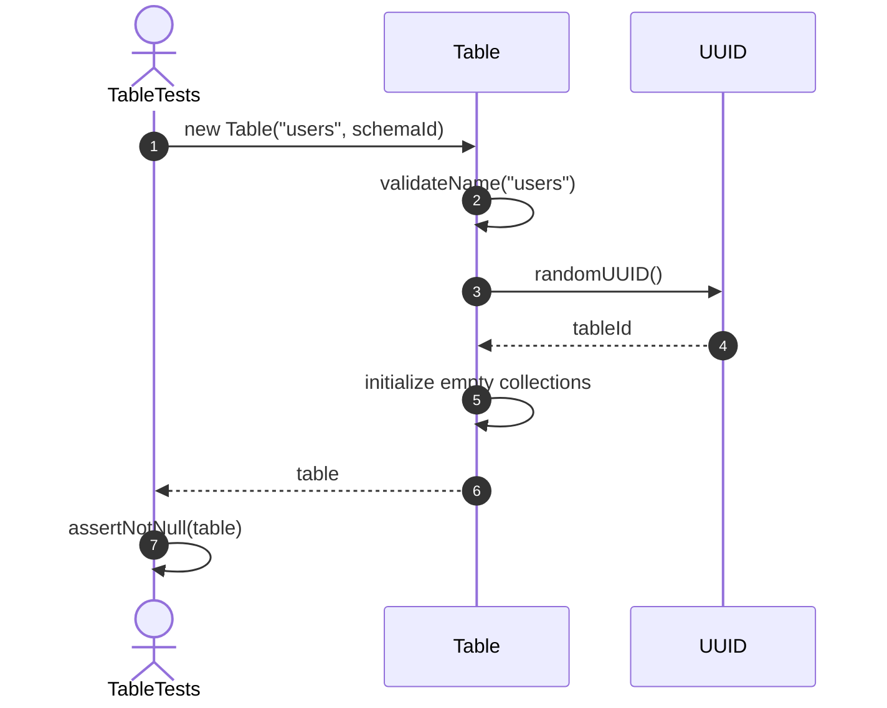
```mermaid
sequenceDiagram
    autonumber
    actor Test as TableTests
    participant Table as Table
    participant UUID as UUID

    Test->>Table: new Table("users", schemaId)
    Table->>Table: validateName("users")
    Table->>UUID: randomUUID()
    UUID-->>Table: tableId
    Table->>Table: initialize empty collections
    Table-->>Test: table
    Test->>Test: assertNotNull(table)
```

## 2. constructor_ShouldGenerateTableId

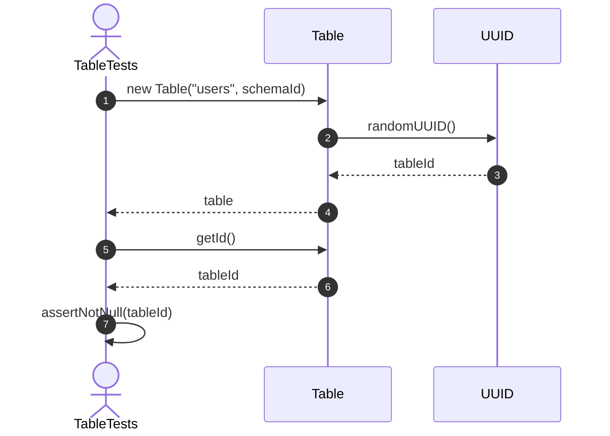
```mermaid
sequenceDiagram
    autonumber
    actor Test as TableTests
    participant Table as Table
    participant UUID as UUID

    Test->>Table: new Table("users", schemaId)
    Table->>UUID: randomUUID()
    UUID-->>Table: tableId
    Table-->>Test: table
    Test->>Table: getId()
    Table-->>Test: tableId
    Test->>Test: assertNotNull(tableId)
```

## 3. constructor_ShouldGenerateUniqueTableIds

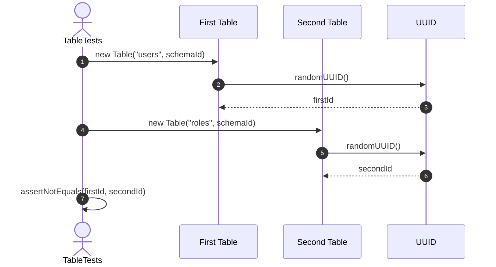
```mermaid
sequenceDiagram
    autonumber
    actor Test as TableTests
    participant Table1 as First Table
    participant Table2 as Second Table
    participant UUID as UUID

    Test->>Table1: new Table("users", schemaId)
    Table1->>UUID: randomUUID()
    UUID-->>Table1: firstId
    Test->>Table2: new Table("roles", schemaId)
    Table2->>UUID: randomUUID()
    UUID-->>Table2: secondId
    Test->>Test: assertNotEquals(firstId, secondId)
```

## 4. constructor_ShouldInitializeSchemaId

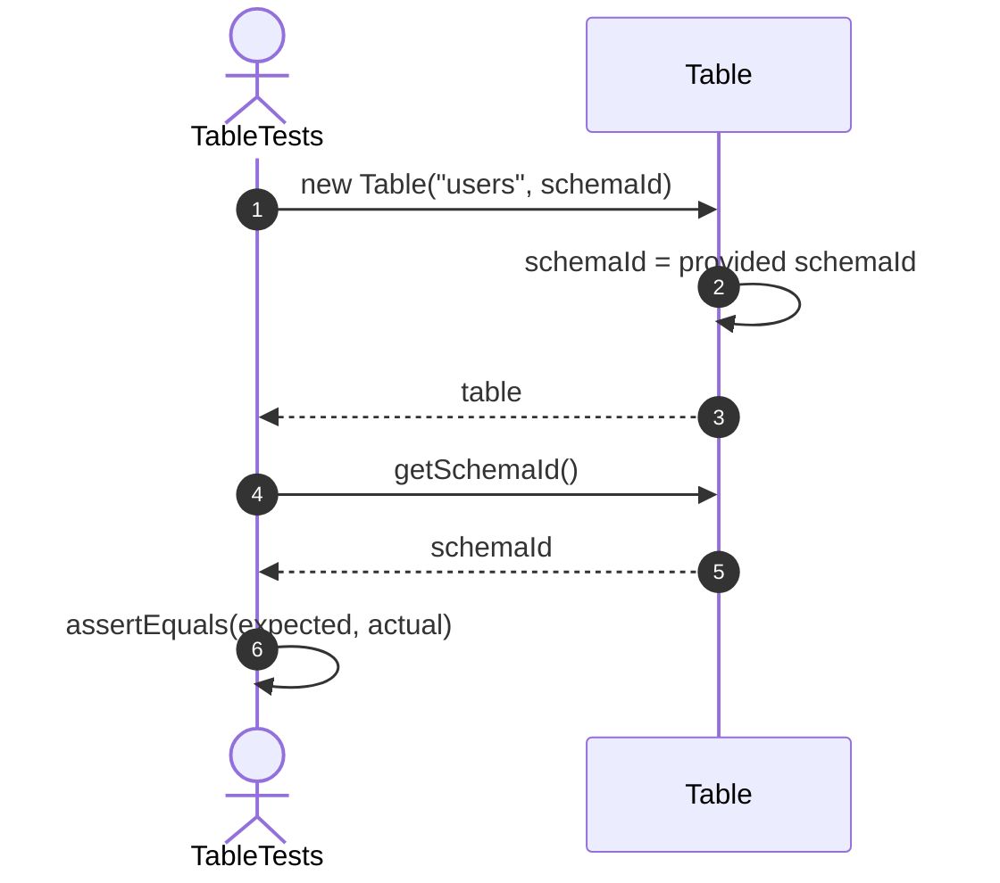
```mermaid
sequenceDiagram
    autonumber
    actor Test as TableTests
    participant Table as Table

    Test->>Table: new Table("users", schemaId)
    Table->>Table: schemaId = provided schemaId
    Table-->>Test: table
    Test->>Table: getSchemaId()
    Table-->>Test: schemaId
    Test->>Test: assertEquals(expected, actual)
```

## 5. constructor_ShouldInitializeEmptyColumns

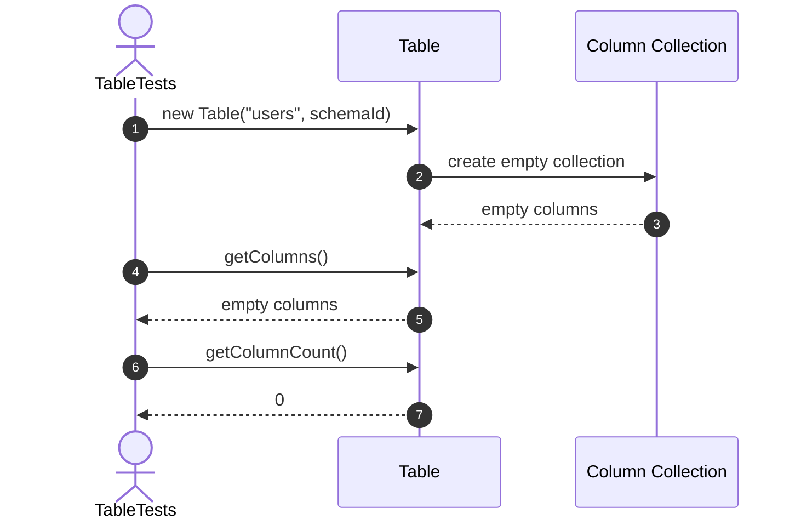
```mermaid
sequenceDiagram
    autonumber
    actor Test as TableTests
    participant Table as Table
    participant Columns as Column Collection

    Test->>Table: new Table("users", schemaId)
    Table->>Columns: create empty collection
    Columns-->>Table: empty columns
    Test->>Table: getColumns()
    Table-->>Test: empty columns
    Test->>Table: getColumnCount()
    Table-->>Test: 0
```

## 6. constructor_ShouldInitializeEmptyRows

```mermaid
sequenceDiagram
    autonumber
    actor Test as TableTests
    participant Table as Table
    participant Rows as Row Collection

    Test->>Table: new Table("users", schemaId)
    Table->>Rows: create empty collection
    Rows-->>Table: empty rows
    Test->>Table: getRows()
    Table-->>Test: empty rows
    Test->>Table: getRowCount()
    Table-->>Test: 0
```

## 7. constructor_ShouldInitializeEmptyConstraints

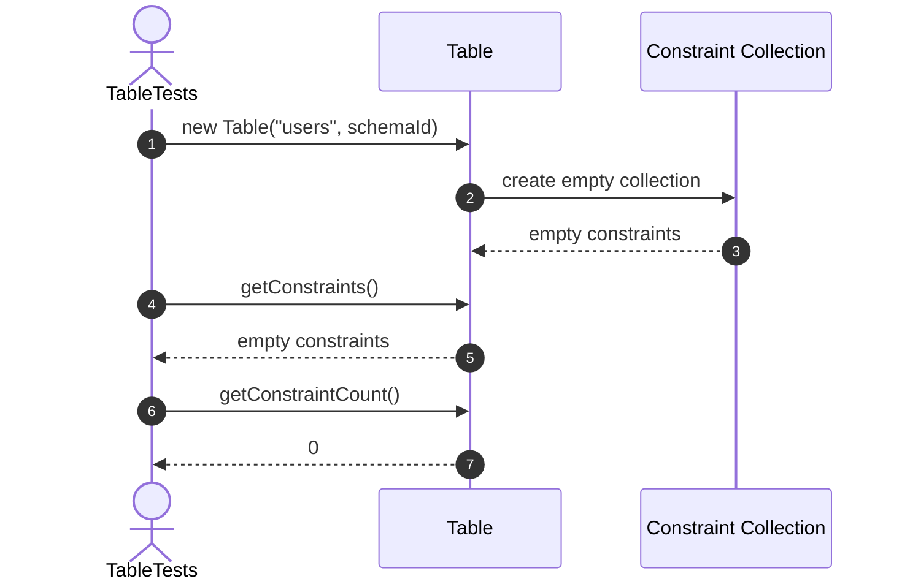
```mermaid
sequenceDiagram
    autonumber
    actor Test as TableTests
    participant Table as Table
    participant Constraints as Constraint Collection

    Test->>Table: new Table("users", schemaId)
    Table->>Constraints: create empty collection
    Constraints-->>Table: empty constraints
    Test->>Table: getConstraints()
    Table-->>Test: empty constraints
    Test->>Table: getConstraintCount()
    Table-->>Test: 0
```

## 8. constructor_ShouldInitializeEmptyIndexes

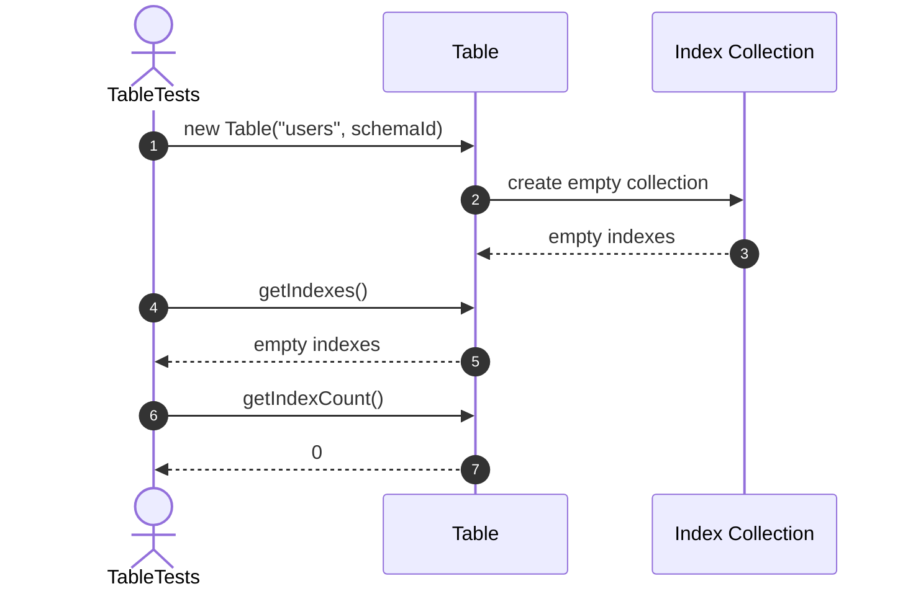
```mermaid
sequenceDiagram
    autonumber
    actor Test as TableTests
    participant Table as Table
    participant Indexes as Index Collection

    Test->>Table: new Table("users", schemaId)
    Table->>Indexes: create empty collection
    Indexes-->>Table: empty indexes
    Test->>Table: getIndexes()
    Table-->>Test: empty indexes
    Test->>Table: getIndexCount()
    Table-->>Test: 0
```

# Name Tests

## 9. getName_ShouldReturnTableName

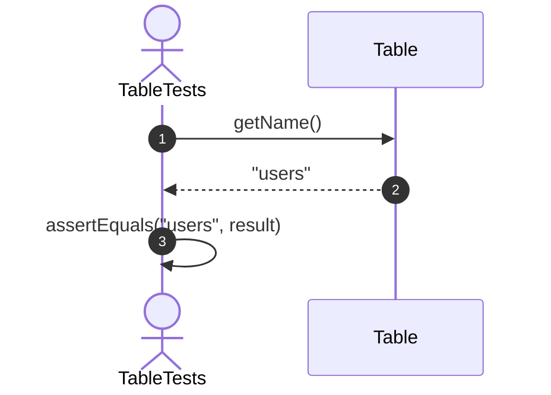
```mermaid
sequenceDiagram
    autonumber
    actor Test as TableTests
    participant Table as Table

    Test->>Table: getName()
    Table-->>Test: "users"
    Test->>Test: assertEquals("users", result)
```

## 10. rename_ShouldChangeTableName

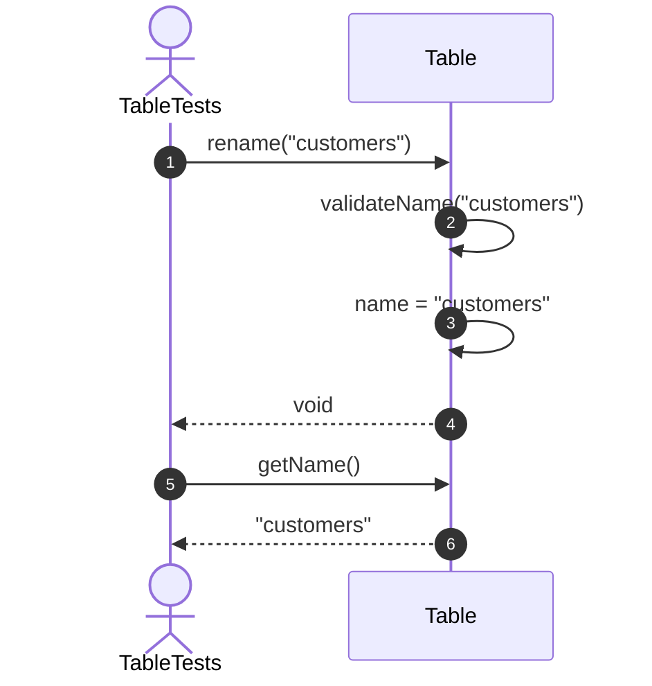
```mermaid
sequenceDiagram
    autonumber
    actor Test as TableTests
    participant Table as Table

    Test->>Table: rename("customers")
    Table->>Table: validateName("customers")
    Table->>Table: name = "customers"
    Table-->>Test: void
    Test->>Table: getName()
    Table-->>Test: "customers"
```

## 11. rename_ShouldRejectNullName

```mermaid
sequenceDiagram
    autonumber
    actor Test as TableTests
    participant Table as Table

    Test->>Table: rename(null)
    Table->>Table: validateName(null)
    alt Name is null
    Table-->>Test: throw IllegalArgumentException
    end
```

## 12. rename_ShouldRejectBlankName

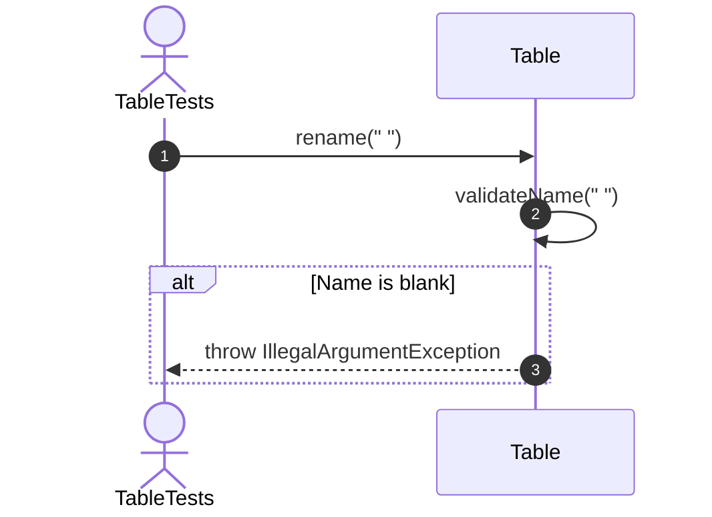
```mermaid
sequenceDiagram
    autonumber
    actor Test as TableTests
    participant Table as Table

    Test->>Table: rename("   ")
    Table->>Table: validateName("   ")
    alt Name is blank
    Table-->>Test: throw IllegalArgumentException
    end
```

# Column Management Tests

## 13. addColumn_ShouldRegisterColumn

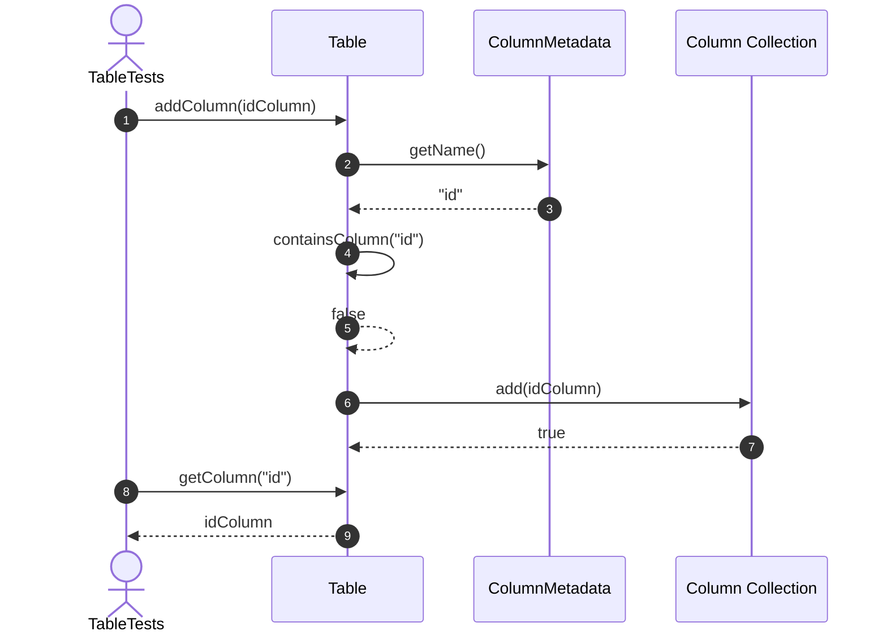
```mermaid
sequenceDiagram
    autonumber
    actor Test as TableTests
    participant Table as Table
    participant Column as ColumnMetadata
    participant Columns as Column Collection

    Test->>Table: addColumn(idColumn)
    Table->>Column: getName()
    Column-->>Table: "id"
    Table->>Table: containsColumn("id")
    Table-->>Table: false
    Table->>Columns: add(idColumn)
    Columns-->>Table: true
    Test->>Table: getColumn("id")
    Table-->>Test: idColumn
```

## 14. addColumn_ShouldIncreaseColumnCount

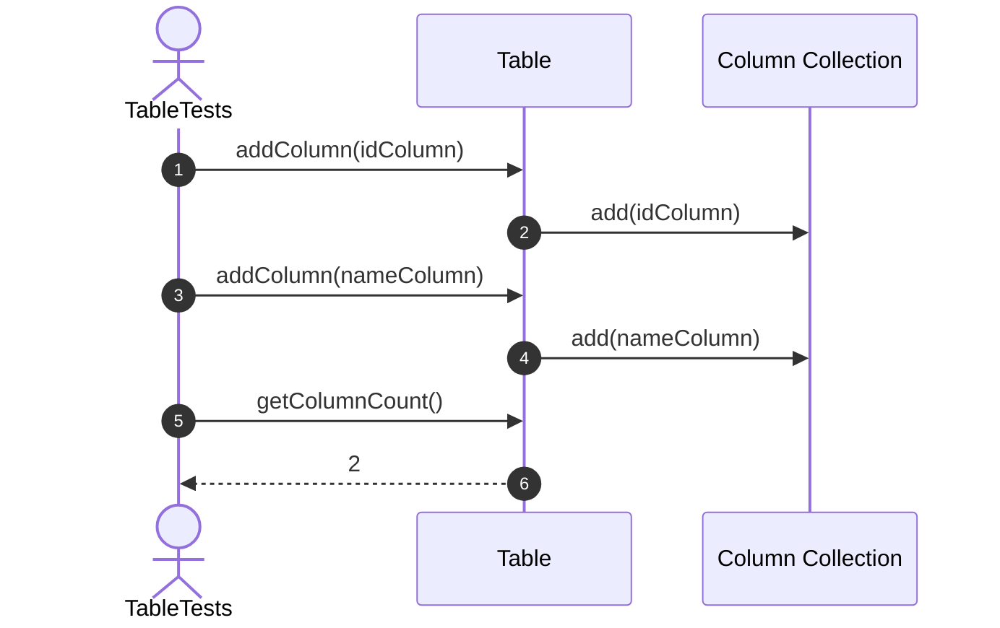
```mermaid
sequenceDiagram
    autonumber
    actor Test as TableTests
    participant Table as Table
    participant Columns as Column Collection

    Test->>Table: addColumn(idColumn)
    Table->>Columns: add(idColumn)
    Test->>Table: addColumn(nameColumn)
    Table->>Columns: add(nameColumn)
    Test->>Table: getColumnCount()
    Table-->>Test: 2
```

## 15. addColumn_ShouldRejectNullColumn

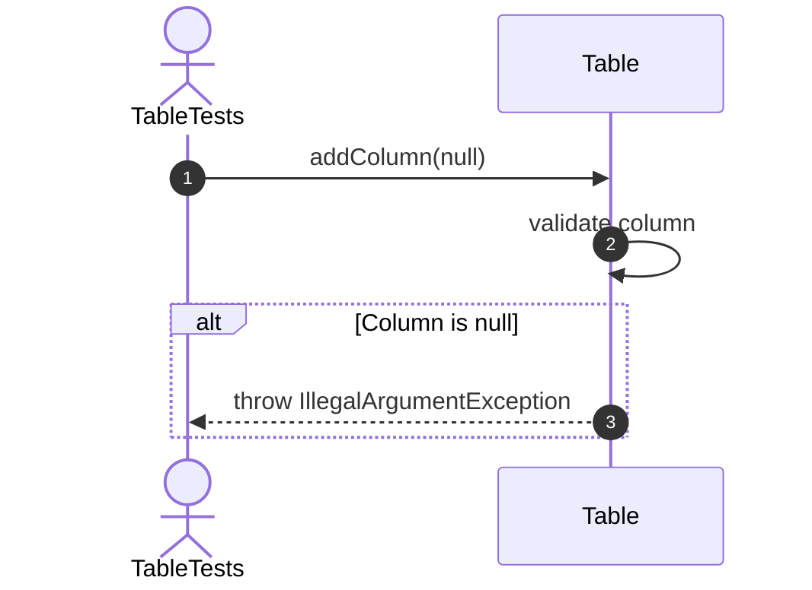
```mermaid
sequenceDiagram
    autonumber
    actor Test as TableTests
    participant Table as Table

    Test->>Table: addColumn(null)
    Table->>Table: validate column
    alt Column is null
    Table-->>Test: throw IllegalArgumentException
    end
```

## 16. addColumn_ShouldRejectDuplicateColumnName

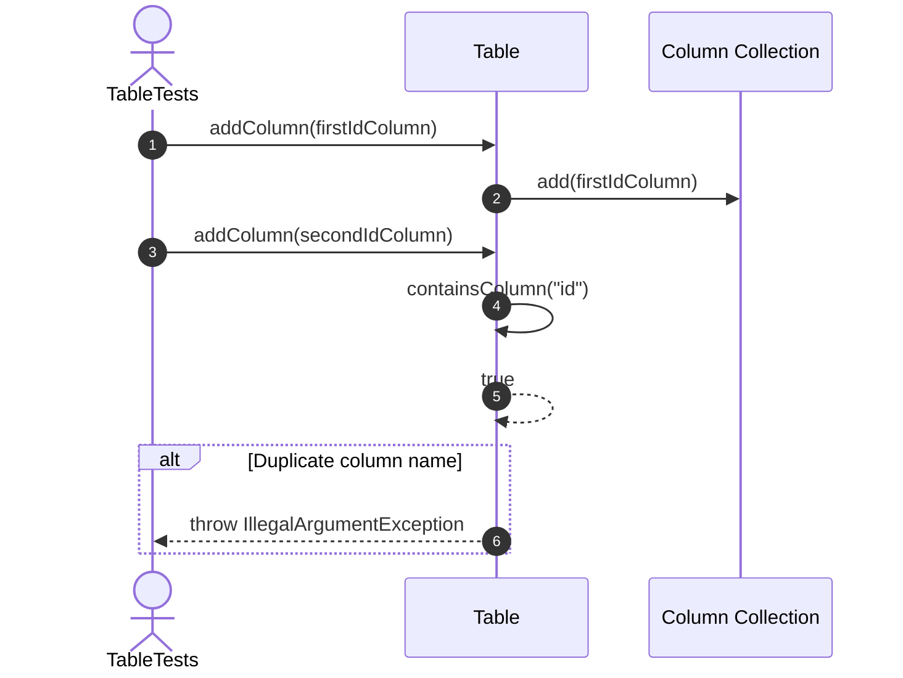
```mermaid
sequenceDiagram
    autonumber
    actor Test as TableTests
    participant Table as Table
    participant Columns as Column Collection

    Test->>Table: addColumn(firstIdColumn)
    Table->>Columns: add(firstIdColumn)
    Test->>Table: addColumn(secondIdColumn)
    Table->>Table: containsColumn("id")
    Table-->>Table: true
    alt Duplicate column name
    Table-->>Test: throw IllegalArgumentException
    end
```

## 17. getColumn_ShouldReturnExistingColumn

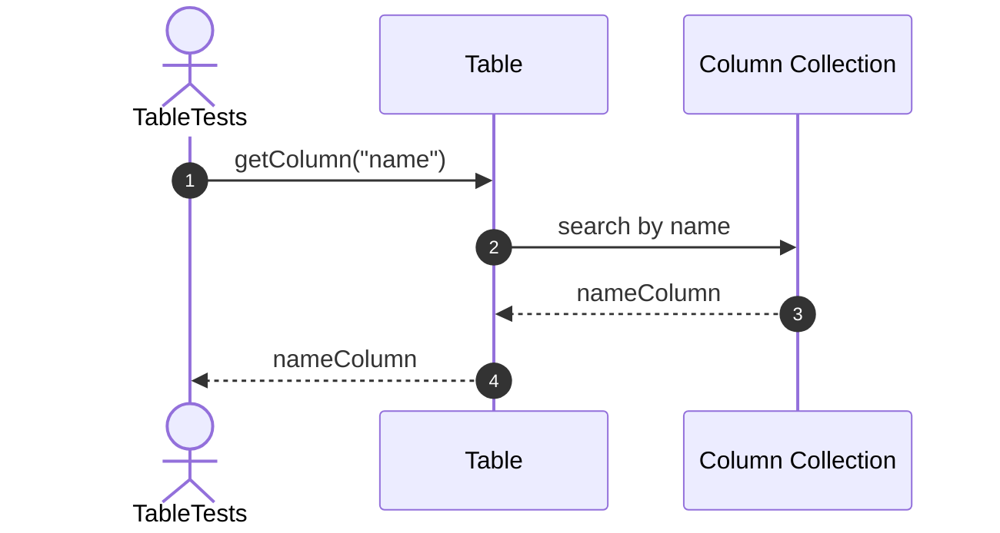
```mermaid
sequenceDiagram
    autonumber
    actor Test as TableTests
    participant Table as Table
    participant Columns as Column Collection

    Test->>Table: getColumn("name")
    Table->>Columns: search by name
    Columns-->>Table: nameColumn
    Table-->>Test: nameColumn
```

## 18. getColumn_ShouldReturnNullForMissingColumn

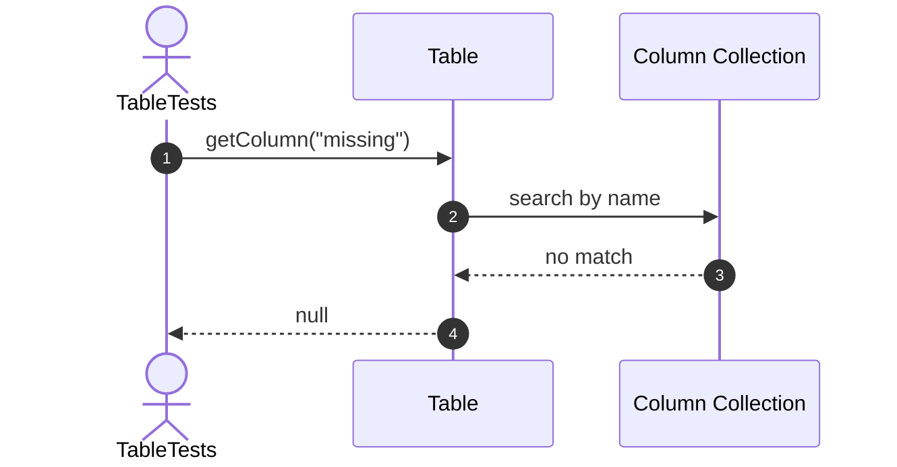
```mermaid
sequenceDiagram
    autonumber
    actor Test as TableTests
    participant Table as Table
    participant Columns as Column Collection

    Test->>Table: getColumn("missing")
    Table->>Columns: search by name
    Columns-->>Table: no match
    Table-->>Test: null
```

## 19. containsColumn_ShouldReturnTrueForExistingColumn

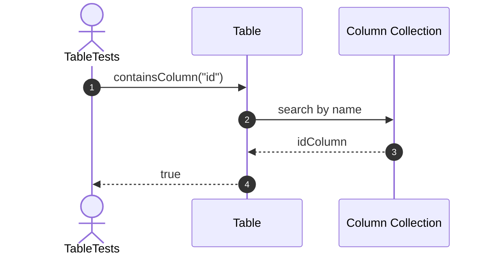
```mermaid
sequenceDiagram
    autonumber
    actor Test as TableTests
    participant Table as Table
    participant Columns as Column Collection

    Test->>Table: containsColumn("id")
    Table->>Columns: search by name
    Columns-->>Table: idColumn
    Table-->>Test: true
```

## 20. containsColumn_ShouldReturnFalseForMissingColumn

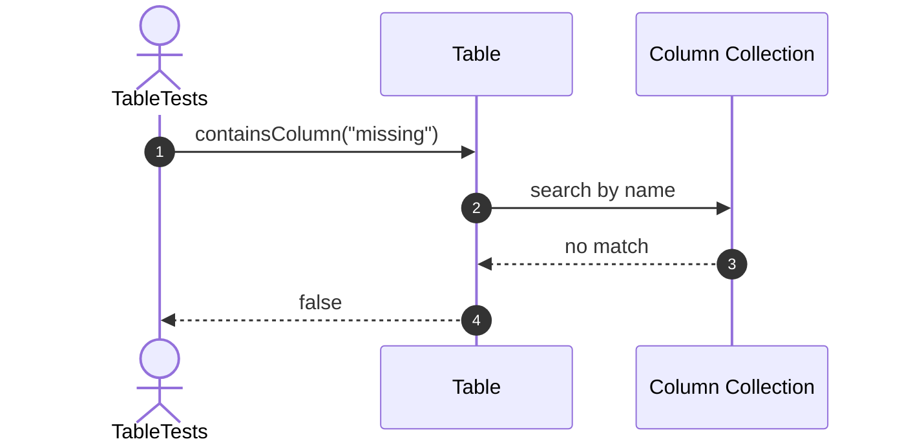
```mermaid
sequenceDiagram
    autonumber
    actor Test as TableTests
    participant Table as Table
    participant Columns as Column Collection

    Test->>Table: containsColumn("missing")
    Table->>Columns: search by name
    Columns-->>Table: no match
    Table-->>Test: false
```

## 21. removeColumn_ShouldRemoveExistingColumn

```mermaid
sequenceDiagram
    autonumber
    actor Test as TableTests
    participant Table as Table
    participant Columns as Column Collection

    Test->>Table: removeColumn("id")
    Table->>Columns: find by name
    Columns-->>Table: idColumn
    Table->>Columns: remove(idColumn)
    Columns-->>Table: true
    Table-->>Test: idColumn
```

## 22. removeColumn_ShouldReturnNullForMissingColumn

```mermaid
sequenceDiagram
    autonumber
    actor Test as TableTests
    participant Table as Table
    participant Columns as Column Collection

    Test->>Table: removeColumn("missing")
    Table->>Columns: find by name
    Columns-->>Table: no match
    Table-->>Test: null
```

## 23. getColumns_ShouldReturnUnmodifiableCollection

```mermaid
sequenceDiagram
    autonumber
    actor Test as TableTests
    participant Table as Table
    participant Columns as Column Collection

    Test->>Table: getColumns()
    Table-->>Test: unmodifiable columns
    Test->>Columns: clear()
    alt Collection is unmodifiable
    Columns-->>Test: throw UnsupportedOperationException
    end
```

# Row Management Tests

## 24. insertRow_ShouldInsertRow

```mermaid
sequenceDiagram
    autonumber
    actor Test as TableTests
    participant Table as Table
    participant Row as Row
    participant Rows as Row Collection

    Test->>Table: insertRow(firstRow)
    Table->>Table: validate row is not null
    Table->>Row: getId()
    Row-->>Table: rowId
    Table->>Rows: add(firstRow)
    Rows-->>Table: true
    Table-->>Test: firstRow
```

## 25. insertRow_ShouldIncreaseRowCount

```mermaid
sequenceDiagram
    autonumber
    actor Test as TableTests
    participant Table as Table
    participant Rows as Row Collection

    Test->>Table: insertRow(firstRow)
    Table->>Rows: add(firstRow)
    Test->>Table: insertRow(secondRow)
    Table->>Rows: add(secondRow)
    Test->>Table: getRowCount()
    Table-->>Test: 2
```

## 26. insertRow_ShouldRejectNullRow

```mermaid
sequenceDiagram
    autonumber
    actor Test as TableTests
    participant Table as Table

    Test->>Table: insertRow(null)
    Table->>Table: validate row
    alt Row is null
    Table-->>Test: throw IllegalArgumentException
    end
```

## 27. getRow_ShouldReturnExistingRow

```mermaid
sequenceDiagram
    autonumber
    actor Test as TableTests
    participant Table as Table
    participant Rows as Row Collection

    Test->>Table: getRow(rowId)
    Table->>Rows: find by ID
    Rows-->>Table: firstRow
    Table-->>Test: firstRow
```

## 28. getRow_ShouldReturnNullForMissingRow

```mermaid
sequenceDiagram
    autonumber
    actor Test as TableTests
    participant Table as Table
    participant Rows as Row Collection

    Test->>Table: getRow(missingId)
    Table->>Rows: find by ID
    Rows-->>Table: no match
    Table-->>Test: null
```

## 29. updateRow_ShouldReplaceExistingRow

```mermaid
sequenceDiagram
    autonumber
    actor Test as TableTests
    participant Table as Table
    participant Rows as Row Collection

    Test->>Table: updateRow(rowId, replacement)
    Table->>Rows: find by ID
    Rows-->>Table: firstRow
    Table->>Table: validate replacement
    Table->>Rows: replace firstRow
    Rows-->>Table: success
    Table-->>Test: replacement
```

## 30. updateRow_ShouldReturnNullForMissingRow

```mermaid
sequenceDiagram
    autonumber
    actor Test as TableTests
    participant Table as Table
    participant Rows as Row Collection

    Test->>Table: updateRow(missingId, replacement)
    Table->>Rows: find by ID
    Rows-->>Table: no match
    Table-->>Test: null
```

## 31. deleteRow_ShouldRemoveExistingRow

```mermaid
sequenceDiagram
    autonumber
    actor Test as TableTests
    participant Table as Table
    participant Rows as Row Collection

    Test->>Table: deleteRow(rowId)
    Table->>Rows: find by ID
    Rows-->>Table: firstRow
    Table->>Rows: remove(firstRow)
    Rows-->>Table: true
    Table-->>Test: firstRow
```

## 32. deleteRow_ShouldDecreaseRowCount

```mermaid
sequenceDiagram
    autonumber
    actor Test as TableTests
    participant Table as Table
    participant Rows as Row Collection

    Test->>Table: getRowCount()
    Table-->>Test: 2
    Test->>Table: deleteRow(firstRowId)
    Table->>Rows: remove(firstRow)
    Test->>Table: getRowCount()
    Table-->>Test: 1
```

## 33. deleteRow_ShouldReturnNullForMissingRow

```mermaid
sequenceDiagram
    autonumber
    actor Test as TableTests
    participant Table as Table
    participant Rows as Row Collection

    Test->>Table: deleteRow(missingId)
    Table->>Rows: find by ID
    Rows-->>Table: no match
    Table-->>Test: null
```

## 34. truncate_ShouldRemoveAllRows

```mermaid
sequenceDiagram
    autonumber
    actor Test as TableTests
    participant Table as Table
    participant Rows as Row Collection

    Test->>Table: truncate()
    Table->>Rows: clear()
    Rows-->>Table: void
    Test->>Table: getRowCount()
    Table-->>Test: 0
```

## 35. getRows_ShouldReturnUnmodifiableCollection

```mermaid
sequenceDiagram
    autonumber
    actor Test as TableTests
    participant Table as Table
    participant Rows as Row Collection

    Test->>Table: getRows()
    Table-->>Test: unmodifiable rows
    Test->>Rows: clear()
    alt Collection is unmodifiable
    Rows-->>Test: throw UnsupportedOperationException
    end
```

# Constraint Management Tests

## 36. addConstraint_ShouldRegisterConstraint

```mermaid
sequenceDiagram
    autonumber
    actor Test as TableTests
    participant Table as Table
    participant Constraint as Constraint
    participant Constraints as Constraint Collection

    Test->>Table: addConstraint(primaryKey)
    Table->>Constraint: getName()
    Constraint-->>Table: "pk_users"
    Table->>Table: containsConstraint("pk_users")
    Table-->>Table: false
    Table->>Constraints: add(primaryKey)
    Table-->>Test: void
```

## 37. addConstraint_ShouldRejectNullConstraint

```mermaid
sequenceDiagram
    autonumber
    actor Test as TableTests
    participant Table as Table

    Test->>Table: addConstraint(null)
    Table->>Table: validate constraint
    alt Constraint is null
    Table-->>Test: throw IllegalArgumentException
    end
```

## 38. addConstraint_ShouldRejectDuplicateConstraintName

```mermaid
sequenceDiagram
    autonumber
    actor Test as TableTests
    participant Table as Table

    Test->>Table: addConstraint(primaryKey)
    Test->>Table: addConstraint(duplicatePrimaryKey)
    Table->>Table: containsConstraint("pk_users")
    Table-->>Table: true
    alt Duplicate constraint
    Table-->>Test: throw IllegalArgumentException
    end
```

## 39. getConstraint_ShouldReturnExistingConstraint

```mermaid
sequenceDiagram
    autonumber
    actor Test as TableTests
    participant Table as Table
    participant Constraints as Constraint Collection

    Test->>Table: getConstraint("pk_users")
    Table->>Constraints: search by name
    Constraints-->>Table: primaryKey
    Table-->>Test: primaryKey
```

## 40. removeConstraint_ShouldRemoveExistingConstraint

```mermaid
sequenceDiagram
    autonumber
    actor Test as TableTests
    participant Table as Table
    participant Constraints as Constraint Collection

    Test->>Table: removeConstraint("pk_users")
    Table->>Constraints: find by name
    Constraints-->>Table: primaryKey
    Table->>Constraints: remove(primaryKey)
    Constraints-->>Table: true
    Table-->>Test: primaryKey
```

## 41. getConstraints_ShouldReturnUnmodifiableCollection

```mermaid
sequenceDiagram
    autonumber
    actor Test as TableTests
    participant Table as Table
    participant Constraints as Constraint Collection

    Test->>Table: getConstraints()
    Table-->>Test: unmodifiable constraints
    Test->>Constraints: clear()
    alt Collection is unmodifiable
    Constraints-->>Test: throw UnsupportedOperationException
    end
```

# Index Management Tests

## 42. addIndex_ShouldRegisterIndex

```mermaid
sequenceDiagram
    autonumber
    actor Test as TableTests
    participant Table as Table
    participant Index as Index
    participant Indexes as Index Collection

    Test->>Table: addIndex(emailIndex)
    Table->>Index: getName()
    Index-->>Table: "idx_users_email"
    Table->>Table: containsIndex("idx_users_email")
    Table-->>Table: false
    Table->>Indexes: add(emailIndex)
    Table-->>Test: void
```

## 43. addIndex_ShouldRejectNullIndex

```mermaid
sequenceDiagram
    autonumber
    actor Test as TableTests
    participant Table as Table

    Test->>Table: addIndex(null)
    Table->>Table: validate index
    alt Index is null
    Table-->>Test: throw IllegalArgumentException
    end
```

## 44. addIndex_ShouldRejectDuplicateIndexName

```mermaid
sequenceDiagram
    autonumber
    actor Test as TableTests
    participant Table as Table

    Test->>Table: addIndex(emailIndex)
    Test->>Table: addIndex(duplicateEmailIndex)
    Table->>Table: containsIndex("idx_users_email")
    Table-->>Table: true
    alt Duplicate index
    Table-->>Test: throw IllegalArgumentException
    end
```

## 45. getIndex_ShouldReturnExistingIndex

```mermaid
sequenceDiagram
    autonumber
    actor Test as TableTests
    participant Table as Table
    participant Indexes as Index Collection

    Test->>Table: getIndex("idx_users_email")
    Table->>Indexes: search by name
    Indexes-->>Table: emailIndex
    Table-->>Test: emailIndex
```

## 46. removeIndex_ShouldRemoveExistingIndex

```mermaid
sequenceDiagram
    autonumber
    actor Test as TableTests
    participant Table as Table
    participant Indexes as Index Collection

    Test->>Table: removeIndex("idx_users_email")
    Table->>Indexes: find by name
    Indexes-->>Table: emailIndex
    Table->>Indexes: remove(emailIndex)
    Indexes-->>Table: true
    Table-->>Test: emailIndex
```

## 47. getIndexes_ShouldReturnUnmodifiableCollection

```mermaid
sequenceDiagram
    autonumber
    actor Test as TableTests
    participant Table as Table
    participant Indexes as Index Collection

    Test->>Table: getIndexes()
    Table-->>Test: unmodifiable indexes
    Test->>Indexes: clear()
    alt Collection is unmodifiable
    Indexes-->>Test: throw UnsupportedOperationException
    end
```

# State Tests

## 48. isEmpty_ShouldReturnTrueForNewTable

```mermaid
sequenceDiagram
    autonumber
    actor Test as TableTests
    participant Table as Table
    participant Rows as Row Collection

    Test->>Table: isEmpty()
    Table->>Rows: isEmpty()
    Rows-->>Table: true
    Table-->>Test: true
```

## 49. isEmpty_ShouldReturnFalseWhenRowExists

```mermaid
sequenceDiagram
    autonumber
    actor Test as TableTests
    participant Table as Table
    participant Rows as Row Collection

    Test->>Table: insertRow(firstRow)
    Table->>Rows: add(firstRow)
    Test->>Table: isEmpty()
    Table->>Rows: isEmpty()
    Rows-->>Table: false
    Table-->>Test: false
```

## 50. getRowCount_ShouldReturnCorrectCount

```mermaid
sequenceDiagram
    autonumber
    actor Test as TableTests
    participant Table as Table
    participant Rows as Row Collection

    Test->>Table: getRowCount()
    Table->>Rows: size()
    Rows-->>Table: 2
    Table-->>Test: 2
```

## 51. getColumnCount_ShouldReturnCorrectCount

```mermaid
sequenceDiagram
    autonumber
    actor Test as TableTests
    participant Table as Table
    participant Columns as Column Collection

    Test->>Table: getColumnCount()
    Table->>Columns: size()
    Columns-->>Table: 2
    Table-->>Test: 2
```

## 52. getConstraintCount_ShouldReturnCorrectCount

```mermaid
sequenceDiagram
    autonumber
    actor Test as TableTests
    participant Table as Table
    participant Constraints as Constraint Collection

    Test->>Table: getConstraintCount()
    Table->>Constraints: size()
    Constraints-->>Table: 2
    Table-->>Test: 2
```

## 53. getIndexCount_ShouldReturnCorrectCount

```mermaid
sequenceDiagram
    autonumber
    actor Test as TableTests
    participant Table as Table
    participant Indexes as Index Collection

    Test->>Table: getIndexCount()
    Table->>Indexes: size()
    Indexes-->>Table: 2
    Table-->>Test: 2
```
