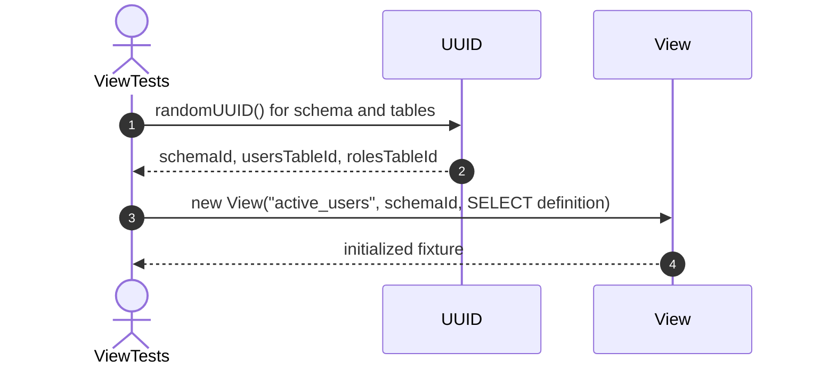
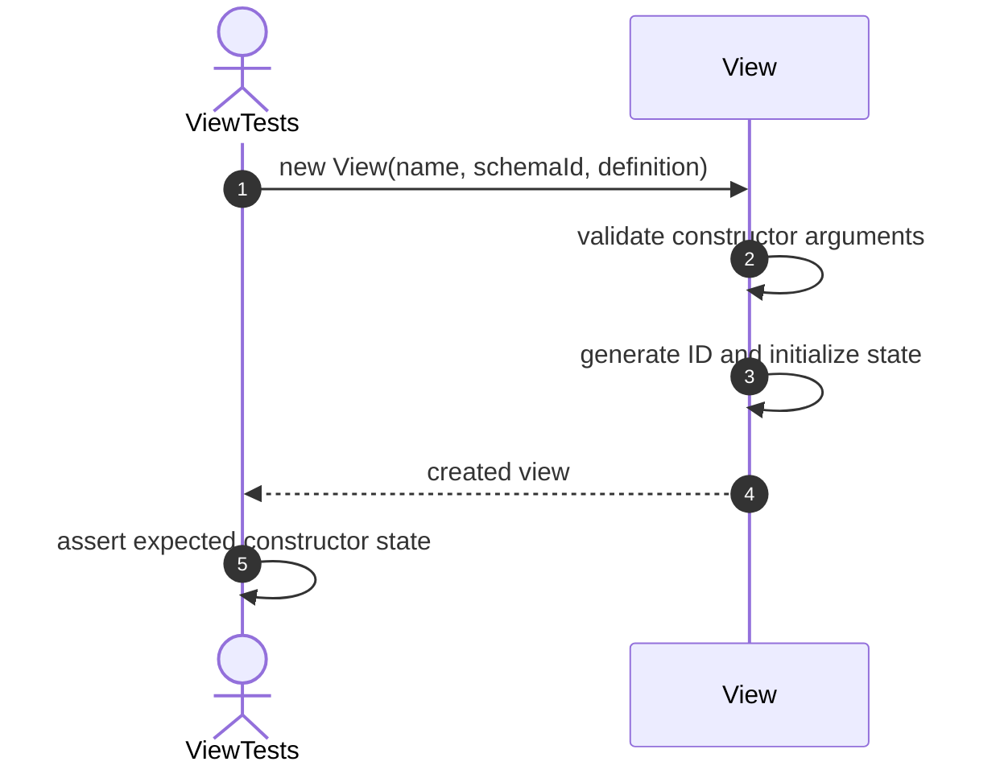
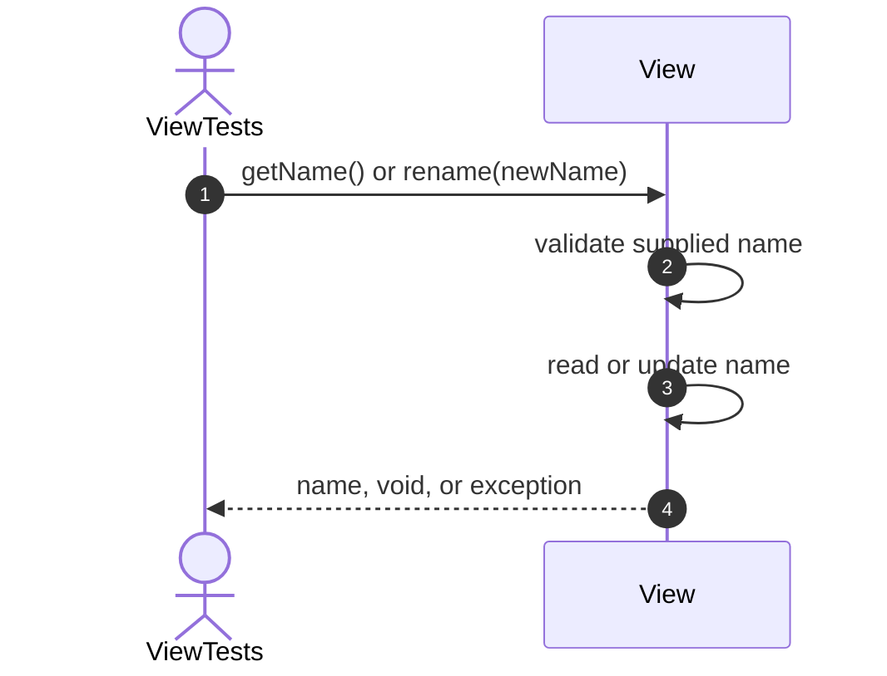
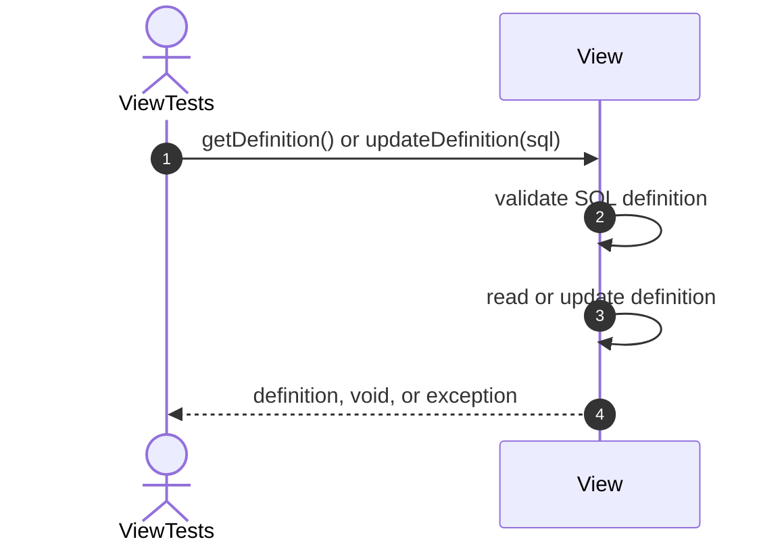
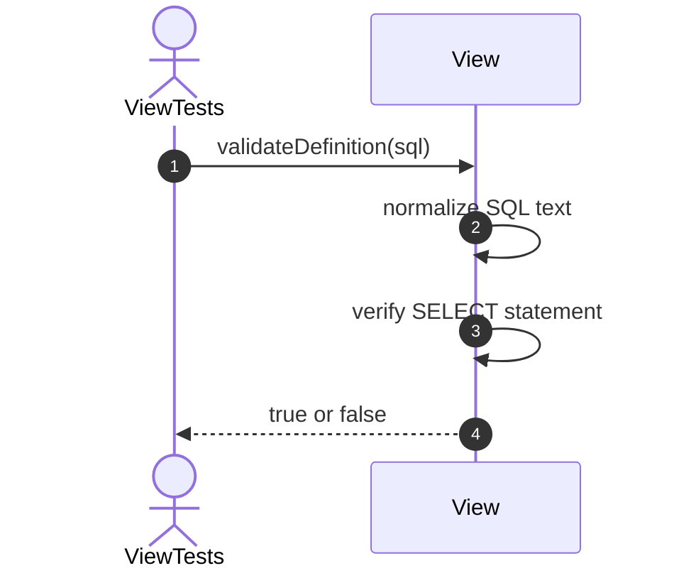

# View Testing — Important Unit Test Sequence Diagrams
## 1. setUp



# Constructor Tests

## 2. Constructor_ShouldCreateView



## 3. Constructor_ShouldGenerateViewId


## 4. Constructor_ShouldGenerateUniqueViewIds


## 5. Constructor_ShouldInitializeSchemaId


## 6. Constructor_ShouldInitializeDefinition


## 7. Constructor_ShouldInitializeEmptyDependencies


## 8. Constructor_ShouldCreateNonMaterializedViewByDefault


## 9. Constructor_ShouldInitializeValidState


# Name Tests

## 10. GetName_ShouldReturnViewName



## 11. Rename_ShouldChangeViewName


## 12. Rename_ShouldRejectNullName


## 13. Rename_ShouldRejectEmptyName


## 14. Rename_ShouldRejectBlankName


# Definition Tests

## 15. GetDefinition_ShouldReturnDefinition



## 16. UpdateDefinition_ShouldChangeDefinition


## 17. UpdateDefinition_ShouldRejectNullDefinition


## 18. UpdateDefinition_ShouldRejectEmptyDefinition


## 19. UpdateDefinition_ShouldRejectBlankDefinition


## 20. ValidateDefinition_ShouldAcceptValidSelectDefinition



## 21. ValidateDefinition_ShouldRejectInvalidDefinition

```mermaid
sequenceDiagram
    autonumber
    actor Test as ViewTests
    participant View as View
    Test->>View: validateDefinition(sql)
    View->>View: normalize SQL text
    View->>View: verify SELECT statement
    View-->>Test: true or false
```

# Dependency Tests

## 22. AddDependency_ShouldRegisterDependency

```mermaid
sequenceDiagram
    autonumber
    actor Test as ViewTests
    participant View as View
    Test->>View: addDependency(objectId)
    View->>View: validate dependency ID
    View->>View: add ID to dependency set
    View-->>Test: void or exception
    Test->>View: getDependencyIds() / hasDependencies()
    View-->>Test: dependency state
```

## 23. AddDependency_ShouldIncreaseDependencyCount

```mermaid
sequenceDiagram
    autonumber
    actor Test as ViewTests
    participant View as View
    Test->>View: addDependency(objectId)
    View->>View: validate dependency ID
    View->>View: add ID to dependency set
    View-->>Test: void or exception
    Test->>View: getDependencyIds() / hasDependencies()
    View-->>Test: dependency state
```

## 24. AddDependency_ShouldRejectNullDependencyId

```mermaid
sequenceDiagram
    autonumber
    actor Test as ViewTests
    participant View as View
    Test->>View: addDependency(objectId)
    View->>View: validate dependency ID
    View->>View: add ID to dependency set
    View-->>Test: void or exception
    Test->>View: getDependencyIds() / hasDependencies()
    View-->>Test: dependency state
```

## 25. AddDependency_ShouldIgnoreDuplicateDependency

```mermaid
sequenceDiagram
    autonumber
    actor Test as ViewTests
    participant View as View
    Test->>View: addDependency(objectId)
    View->>View: validate dependency ID
    View->>View: add ID to dependency set
    View-->>Test: void or exception
    Test->>View: getDependencyIds() / hasDependencies()
    View-->>Test: dependency state
```

## 26. ContainsDependency_ShouldReturnTrueForExistingDependency

```mermaid
sequenceDiagram
    autonumber
    actor Test as ViewTests
    participant View as View
    Test->>View: containsDependency(objectId)
    View->>View: search dependency set
    View-->>Test: true or false
```

## 27. ContainsDependency_ShouldReturnFalseForMissingDependency

```mermaid
sequenceDiagram
    autonumber
    actor Test as ViewTests
    participant View as View
    Test->>View: containsDependency(objectId)
    View->>View: search dependency set
    View-->>Test: true or false
```

## 28. RemoveDependency_ShouldRemoveExistingDependency

```mermaid
sequenceDiagram
    autonumber
    actor Test as ViewTests
    participant View as View
    Test->>View: removeDependency(objectId)
    View->>View: remove ID when present
    View-->>Test: true or false
```

## 29. RemoveDependency_ShouldReturnFalseForMissingDependency

```mermaid
sequenceDiagram
    autonumber
    actor Test as ViewTests
    participant View as View
    Test->>View: removeDependency(objectId)
    View->>View: remove ID when present
    View-->>Test: true or false
```

## 30. GetDependencyIds_ShouldReturnUnmodifiableSet

```mermaid
sequenceDiagram
    autonumber
    actor Test as ViewTests
    participant View as View
    Test->>View: getDependencyIds()
    View->>View: create unmodifiable set view
    View-->>Test: dependency IDs
    Test->>Test: verify collection cannot be modified
```

## 31. HasDependencies_ShouldReturnFalseForNewView

```mermaid
sequenceDiagram
    autonumber
    actor Test as ViewTests
    participant View as View
    Test->>View: hasDependencies()
    View->>View: check whether dependency set is empty
    View-->>Test: true or false
```

## 32. HasDependencies_ShouldReturnTrueWhenDependencyExists

```mermaid
sequenceDiagram
    autonumber
    actor Test as ViewTests
    participant View as View
    Test->>View: hasDependencies()
    View->>View: check whether dependency set is empty
    View-->>Test: true or false
```

# DependencyValidation Tests

## 33. ValidateDependencies_ShouldReturnTrueWhenAllDependenciesExist

```mermaid
sequenceDiagram
    autonumber
    actor Test as ViewTests
    participant View as View
    Test->>View: validateDependencies(existingObjectIds)
    View->>View: compare every dependency with existing IDs
    View-->>Test: true when all dependencies exist
```

## 34. ValidateDependencies_ShouldReturnFalseWhenDependencyIsMissing

```mermaid
sequenceDiagram
    autonumber
    actor Test as ViewTests
    participant View as View
    Test->>View: validateDependencies(existingObjectIds)
    View->>View: compare every dependency with existing IDs
    View-->>Test: true when all dependencies exist
```

## 35. ValidateDependencies_ShouldAcceptEmptyDependencyCollection

```mermaid
sequenceDiagram
    autonumber
    actor Test as ViewTests
    participant View as View
    Test->>View: validateDependencies(existingObjectIds)
    View->>View: compare every dependency with existing IDs
    View-->>Test: true when all dependencies exist
```

## 36. HasCircularDependency_ShouldReturnTrueForCycle

```mermaid
sequenceDiagram
    autonumber
    actor Test as ViewTests
    participant View as View
    Test->>View: hasCircularDependency(graph)
    View->>View: traverse dependency graph
    View->>View: track visiting and visited nodes
    View-->>Test: true when cycle exists
```

## 37. HasCircularDependency_ShouldReturnFalseWithoutCycle

```mermaid
sequenceDiagram
    autonumber
    actor Test as ViewTests
    participant View as View
    Test->>View: hasCircularDependency(graph)
    View->>View: traverse dependency graph
    View->>View: track visiting and visited nodes
    View-->>Test: true when cycle exists
```

# MaterializedView Tests

## 38. SetMaterialized_ShouldEnableMaterializedMode

```mermaid
sequenceDiagram
    autonumber
    actor Test as ViewTests
    participant View as View
    Test->>View: setMaterialized(flag)
    View->>View: update materialized state
    View-->>Test: void
    Test->>View: isMaterialized()
    View-->>Test: current state
```

## 39. SetMaterialized_ShouldDisableMaterializedMode

```mermaid
sequenceDiagram
    autonumber
    actor Test as ViewTests
    participant View as View
    Test->>View: setMaterialized(flag)
    View->>View: update materialized state
    View-->>Test: void
    Test->>View: isMaterialized()
    View-->>Test: current state
```

## 40. Refresh_ShouldRefreshMaterializedView

```mermaid
sequenceDiagram
    autonumber
    actor Test as ViewTests
    participant View as View
    Test->>View: refresh()
    View->>View: verify materialized mode
    alt materialized view
        View->>View: update refresh metadata
        View-->>Test: success
    else normal view
        View-->>Test: IllegalStateException
    end
```

## 41. Refresh_ShouldRejectNonMaterializedView

```mermaid
sequenceDiagram
    autonumber
    actor Test as ViewTests
    participant View as View
    Test->>View: refresh()
    View->>View: verify materialized mode
    alt materialized view
        View->>View: update refresh metadata
        View-->>Test: success
    else normal view
        View-->>Test: IllegalStateException
    end
```

# ValidityState Tests

## 42. Invalidate_ShouldSetValidToFalse

```mermaid
sequenceDiagram
    autonumber
    actor Test as ViewTests
    participant View as View
    Test->>View: invalidate() or validate()
    View->>View: update valid state
    View-->>Test: void
    Test->>View: isValid()
    View-->>Test: current state
```

## 43. Validate_ShouldSetValidToTrue

```mermaid
sequenceDiagram
    autonumber
    actor Test as ViewTests
    participant View as View
    Test->>View: invalidate() or validate()
    View->>View: update valid state
    View-->>Test: void
    Test->>View: isValid()
    View-->>Test: current state
```

## 44. Invalidate_ShouldBeIdempotent

```mermaid
sequenceDiagram
    autonumber
    actor Test as ViewTests
    participant View as View
    Test->>View: invalidate() or validate()
    View->>View: update valid state
    View-->>Test: void
    Test->>View: isValid()
    View-->>Test: current state
```

## 45. Validate_ShouldBeIdempotent

```mermaid
sequenceDiagram
    autonumber
    actor Test as ViewTests
    participant View as View
    Test->>View: invalidate() or validate()
    View->>View: update valid state
    View-->>Test: void
    Test->>View: isValid()
    View-->>Test: current state
```

# Metadata Tests

## 46. GetSchemaId_ShouldReturnSchemaId

```mermaid
sequenceDiagram
    autonumber
    actor Test as ViewTests
    participant View as View
    Test->>View: getSchemaId() or setSchemaId(id)
    View->>View: validate schema ID
    View->>View: read or update schema ID
    View-->>Test: ID, void, or exception
```

## 47. SetSchemaId_ShouldUpdateSchemaId

```mermaid
sequenceDiagram
    autonumber
    actor Test as ViewTests
    participant View as View
    Test->>View: getSchemaId() or setSchemaId(id)
    View->>View: validate schema ID
    View->>View: read or update schema ID
    View-->>Test: ID, void, or exception
```

## 48. SetSchemaId_ShouldRejectNullSchemaId

```mermaid
sequenceDiagram
    autonumber
    actor Test as ViewTests
    participant View as View
    Test->>View: getSchemaId() or setSchemaId(id)
    View->>View: validate schema ID
    View->>View: read or update schema ID
    View-->>Test: ID, void, or exception
```