# View Testing — Important Unit Test Sequence Diagrams

## 1. Constructor_ShouldCreateView

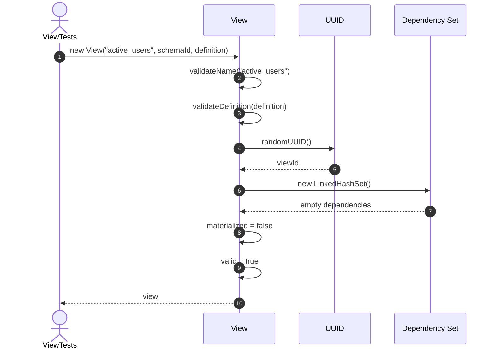
```mermaid
sequenceDiagram
    autonumber
    actor Test as ViewTests
    participant View as View
    participant UUID as UUID
    participant Dependencies as Dependency Set

    Test->>View: new View("active_users", schemaId, definition)
    View->>View: validateName("active_users")
    View->>View: validateDefinition(definition)
    View->>UUID: randomUUID()
    UUID-->>View: viewId
    View->>Dependencies: new LinkedHashSet()
    Dependencies-->>View: empty dependencies
    View->>View: materialized = false
    View->>View: valid = true
    View-->>Test: view
```

## 2. Constructor_ShouldGenerateViewId

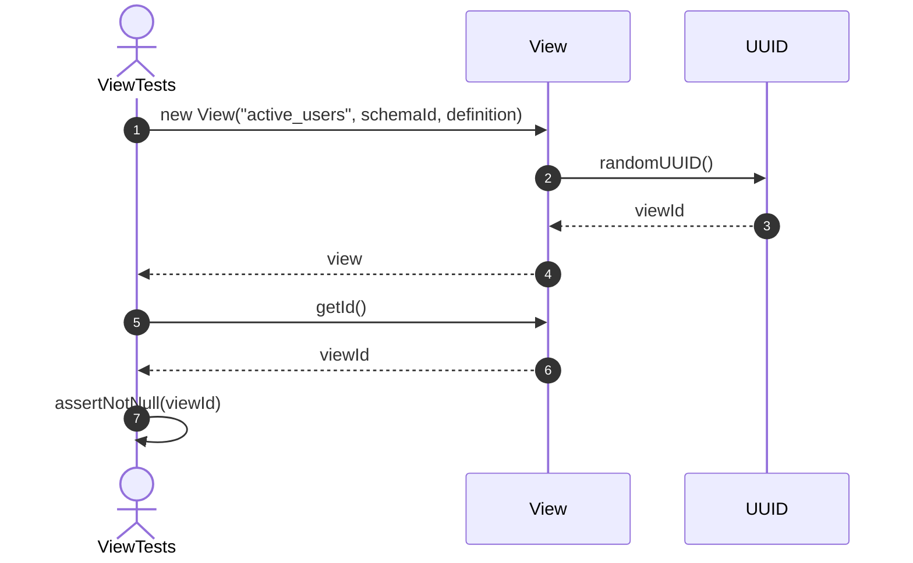
```mermaid
sequenceDiagram
    autonumber
    actor Test as ViewTests
    participant View as View
    participant UUID as UUID

    Test->>View: new View("active_users", schemaId, definition)
    View->>UUID: randomUUID()
    UUID-->>View: viewId
    View-->>Test: view

    Test->>View: getId()
    View-->>Test: viewId
    Test->>Test: assertNotNull(viewId)
```

## 3. Constructor_ShouldInitializeEmptyDependencies

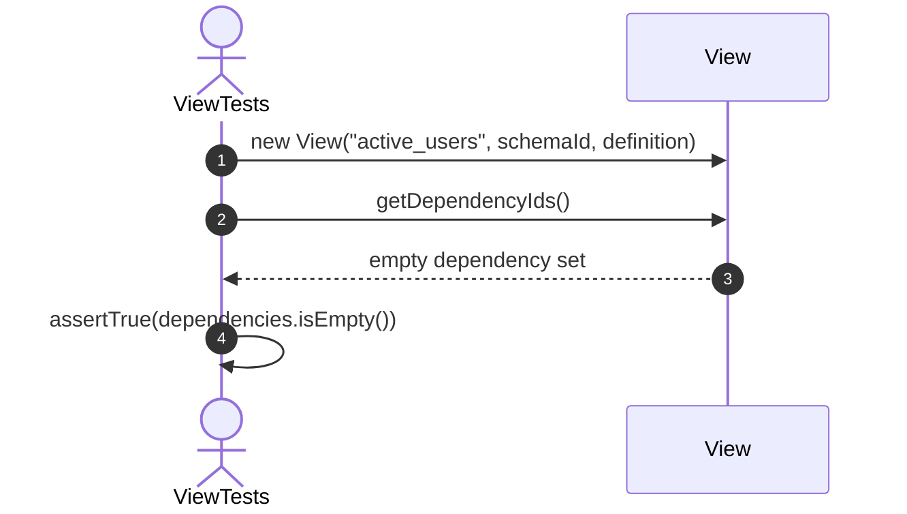
```mermaid
sequenceDiagram
    autonumber
    actor Test as ViewTests
    participant View as View

    Test->>View: new View("active_users", schemaId, definition)
    Test->>View: getDependencyIds()
    View-->>Test: empty dependency set

    Test->>Test: assertTrue(dependencies.isEmpty())
```

## 4. Rename_ShouldChangeViewName

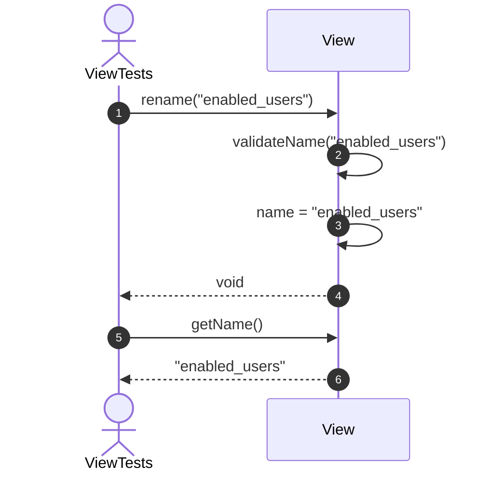
```mermaid
sequenceDiagram
    autonumber
    actor Test as ViewTests
    participant View as View

    Test->>View: rename("enabled_users")
    View->>View: validateName("enabled_users")
    View->>View: name = "enabled_users"
    View-->>Test: void

    Test->>View: getName()
    View-->>Test: "enabled_users"
```

## 5. Rename_ShouldRejectInvalidName

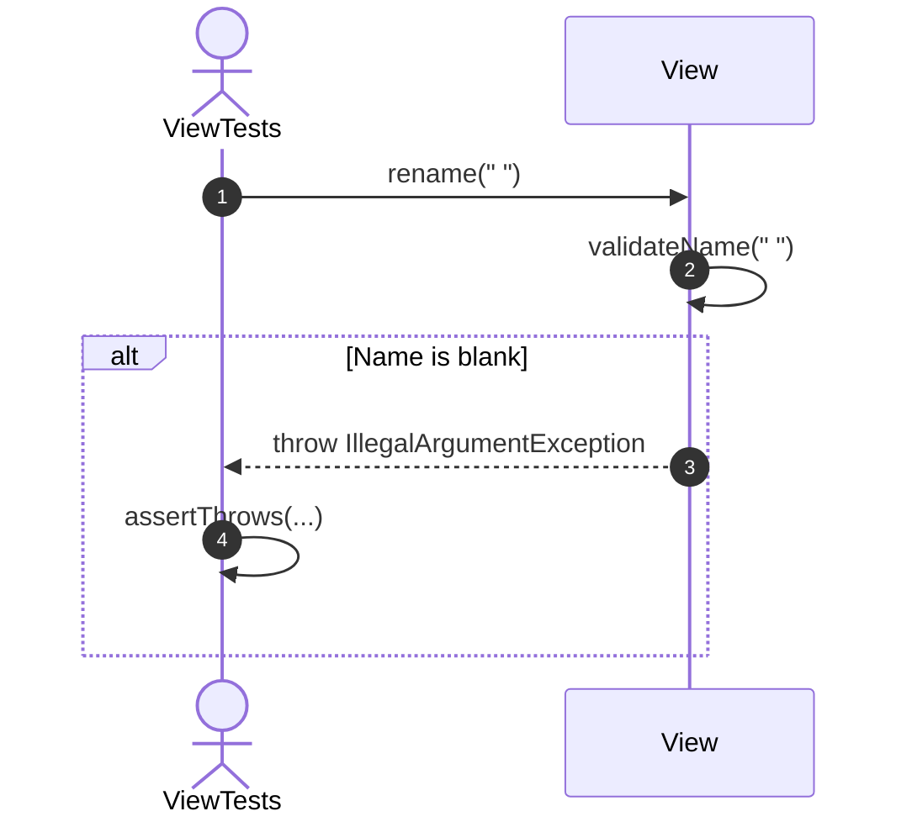
```mermaid
sequenceDiagram
    autonumber
    actor Test as ViewTests
    participant View as View

    Test->>View: rename(" ")
    View->>View: validateName(" ")

    alt Name is blank
        View-->>Test: throw IllegalArgumentException
        Test->>Test: assertThrows(...)
    end
```

## 6. UpdateDefinition_ShouldChangeDefinition

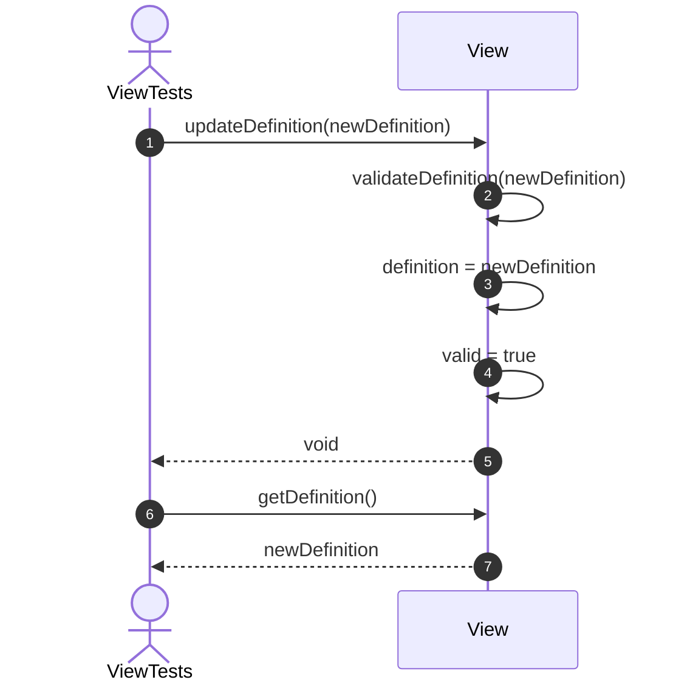
```mermaid
sequenceDiagram
    autonumber
    actor Test as ViewTests
    participant View as View

    Test->>View: updateDefinition(newDefinition)
    View->>View: validateDefinition(newDefinition)
    View->>View: definition = newDefinition
    View->>View: valid = true
    View-->>Test: void

    Test->>View: getDefinition()
    View-->>Test: newDefinition
```

## 7. UpdateDefinition_ShouldRejectInvalidDefinition

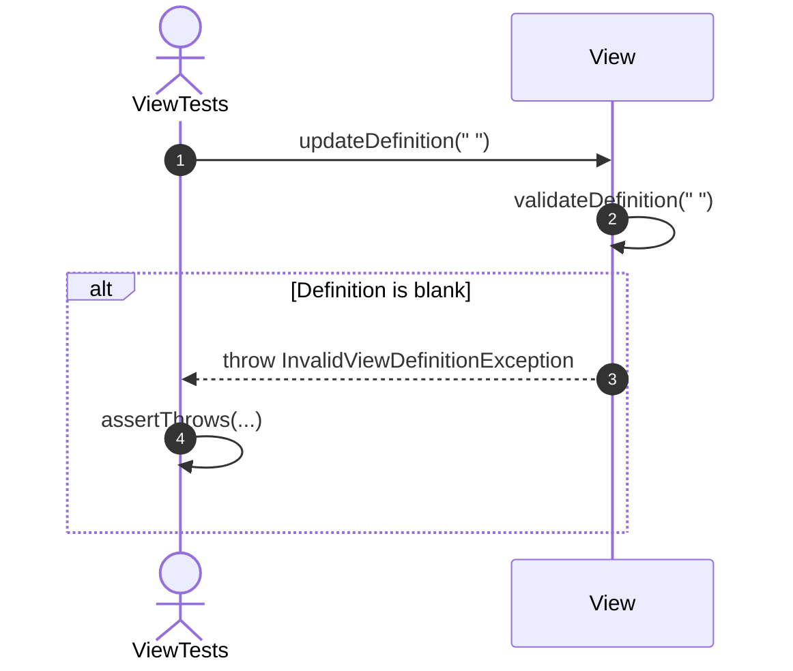
```mermaid
sequenceDiagram
    autonumber
    actor Test as ViewTests
    participant View as View

    Test->>View: updateDefinition(" ")
    View->>View: validateDefinition(" ")

    alt Definition is blank
        View-->>Test: throw InvalidViewDefinitionException
        Test->>Test: assertThrows(...)
    end
```

## 8. ValidateDefinition_ShouldAcceptSelectDefinition

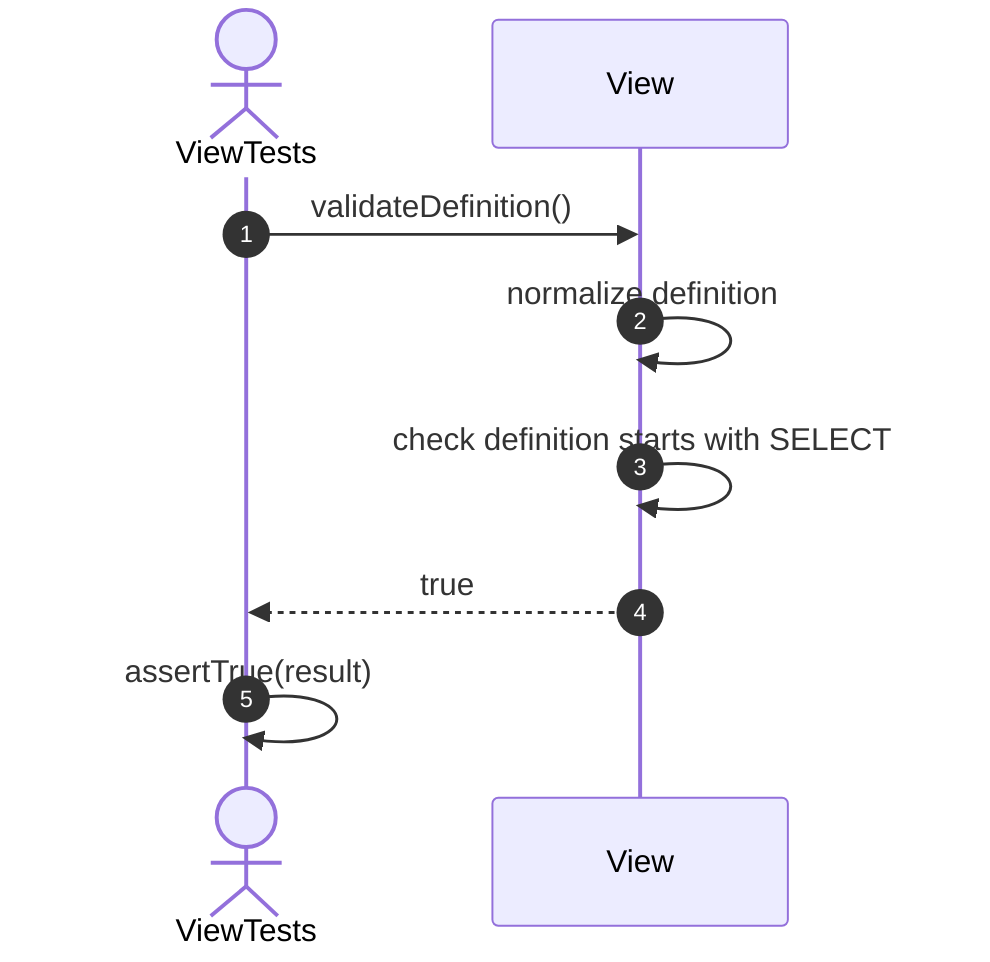
```mermaid
sequenceDiagram
    autonumber
    actor Test as ViewTests
    participant View as View

    Test->>View: validateDefinition()
    View->>View: normalize definition
    View->>View: check definition starts with SELECT
    View-->>Test: true

    Test->>Test: assertTrue(result)
```

## 9. ValidateDefinition_ShouldRejectNonSelectDefinition

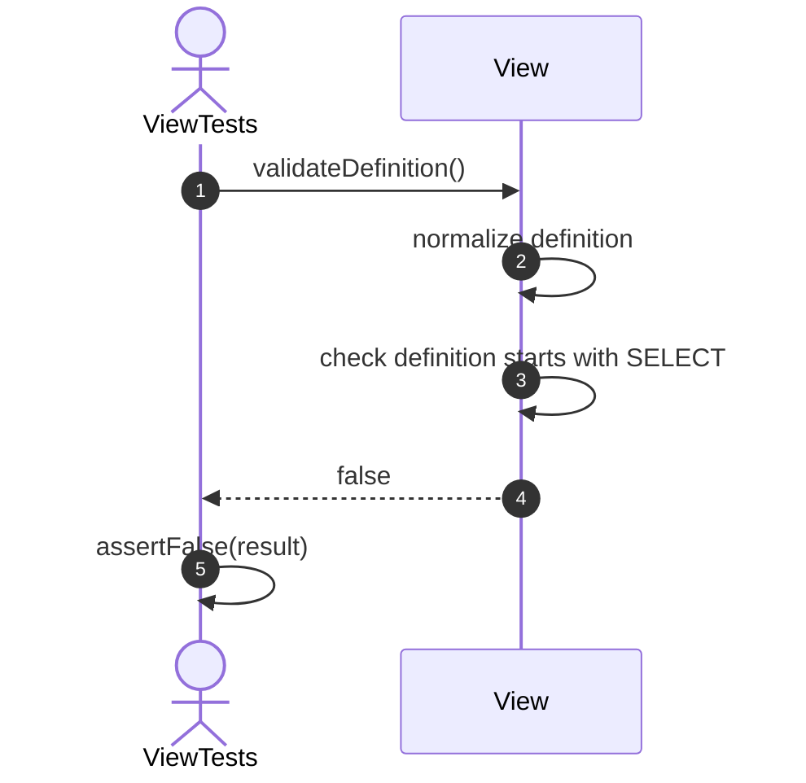
```mermaid
sequenceDiagram
    autonumber
    actor Test as ViewTests
    participant View as View

    Test->>View: validateDefinition()
    View->>View: normalize definition
    View->>View: check definition starts with SELECT
    View-->>Test: false

    Test->>Test: assertFalse(result)
```

## 10. AddDependency_ShouldRegisterDependency

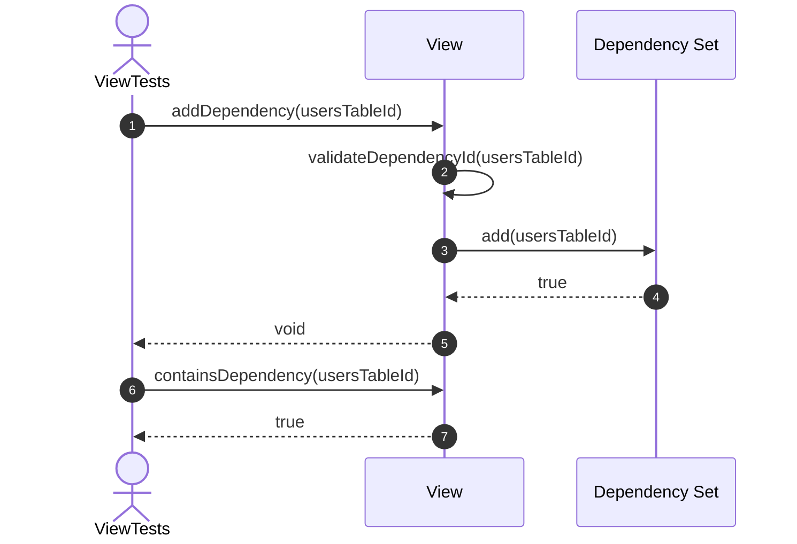
```mermaid
sequenceDiagram
    autonumber
    actor Test as ViewTests
    participant View as View
    participant Dependencies as Dependency Set

    Test->>View: addDependency(usersTableId)
    View->>View: validateDependencyId(usersTableId)
    View->>Dependencies: add(usersTableId)
    Dependencies-->>View: true
    View-->>Test: void

    Test->>View: containsDependency(usersTableId)
    View-->>Test: true
```

## 11. AddDependency_ShouldIgnoreDuplicateDependency

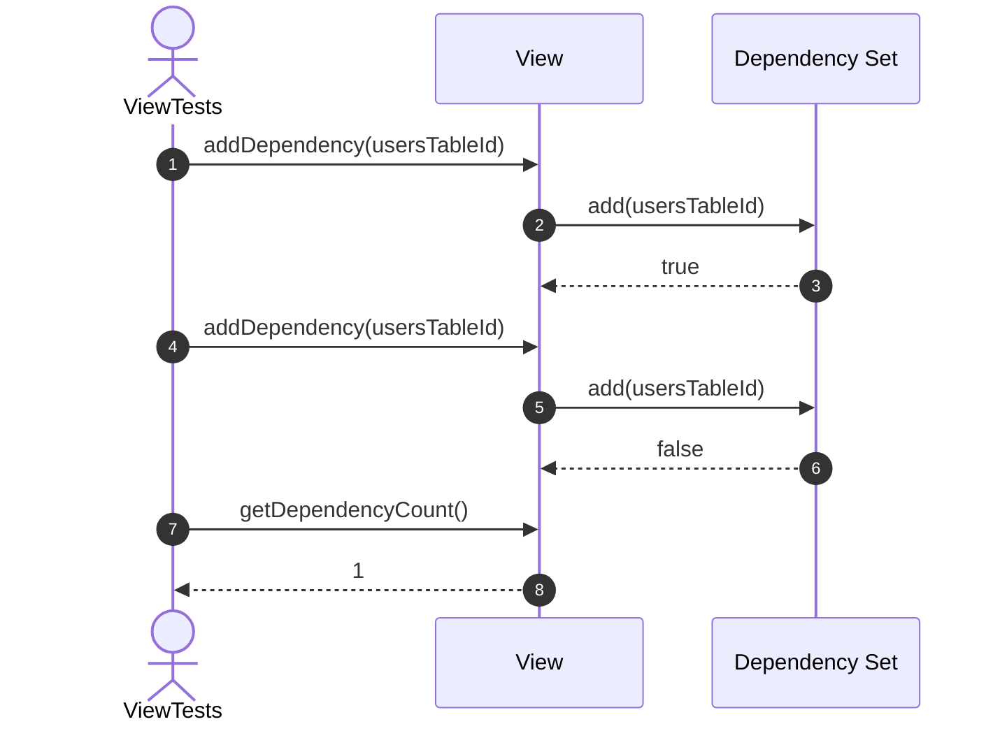
```mermaid
sequenceDiagram
    autonumber
    actor Test as ViewTests
    participant View as View
    participant Dependencies as Dependency Set

    Test->>View: addDependency(usersTableId)
    View->>Dependencies: add(usersTableId)
    Dependencies-->>View: true

    Test->>View: addDependency(usersTableId)
    View->>Dependencies: add(usersTableId)
    Dependencies-->>View: false

    Test->>View: getDependencyCount()
    View-->>Test: 1
```

## 12. RemoveDependency_ShouldRemoveExistingDependency

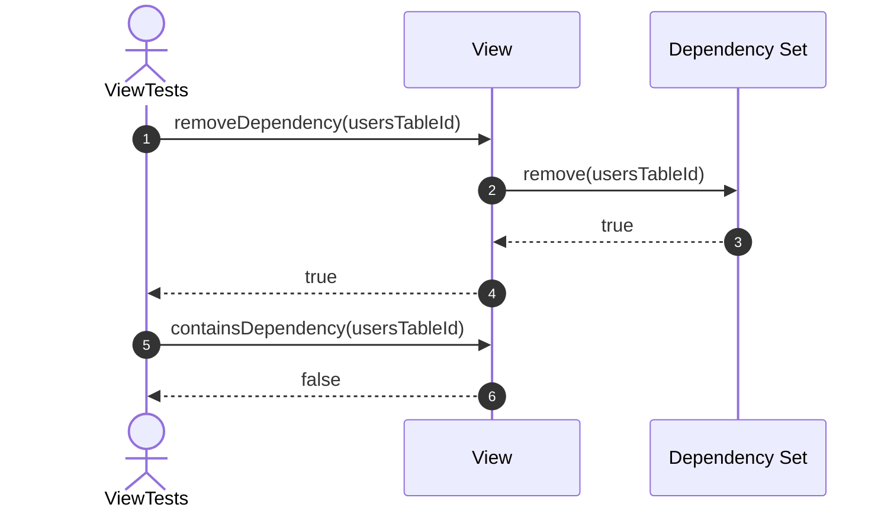
```mermaid
sequenceDiagram
    autonumber
    actor Test as ViewTests
    participant View as View
    participant Dependencies as Dependency Set

    Test->>View: removeDependency(usersTableId)
    View->>Dependencies: remove(usersTableId)
    Dependencies-->>View: true
    View-->>Test: true

    Test->>View: containsDependency(usersTableId)
    View-->>Test: false
```

## 13. GetDependencyIds_ShouldReturnUnmodifiableSet

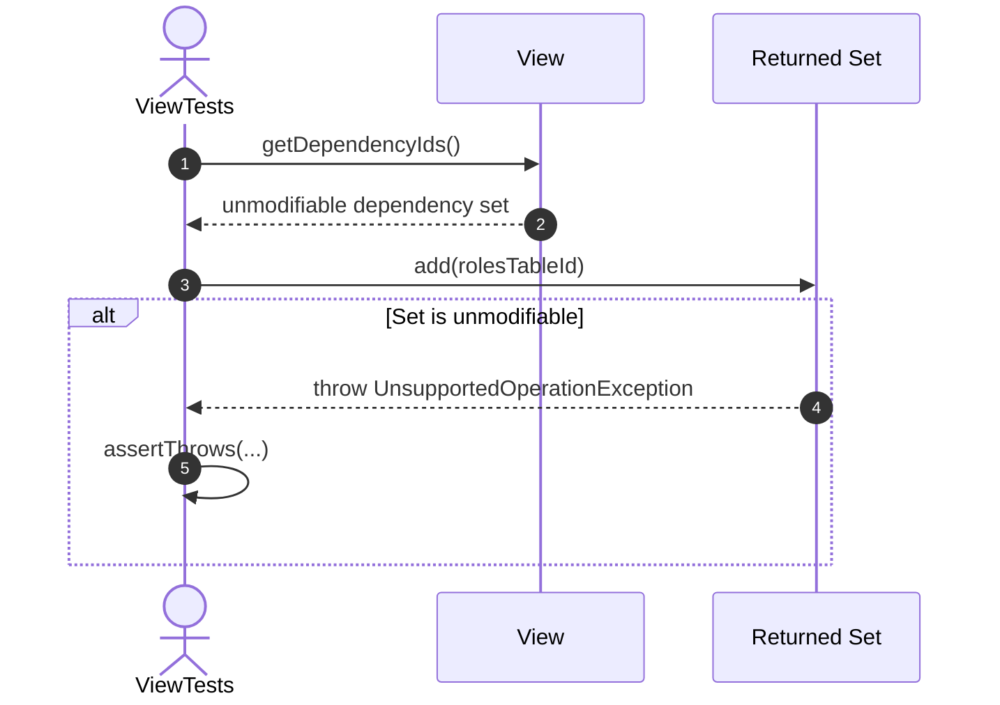
```mermaid
sequenceDiagram
    autonumber
    actor Test as ViewTests
    participant View as View
    participant Dependencies as Returned Set

    Test->>View: getDependencyIds()
    View-->>Test: unmodifiable dependency set

    Test->>Dependencies: add(rolesTableId)
    alt Set is unmodifiable
        Dependencies-->>Test: throw UnsupportedOperationException
        Test->>Test: assertThrows(...)
    end
```

## 14. ValidateDependencies_ShouldAcceptExistingObjects

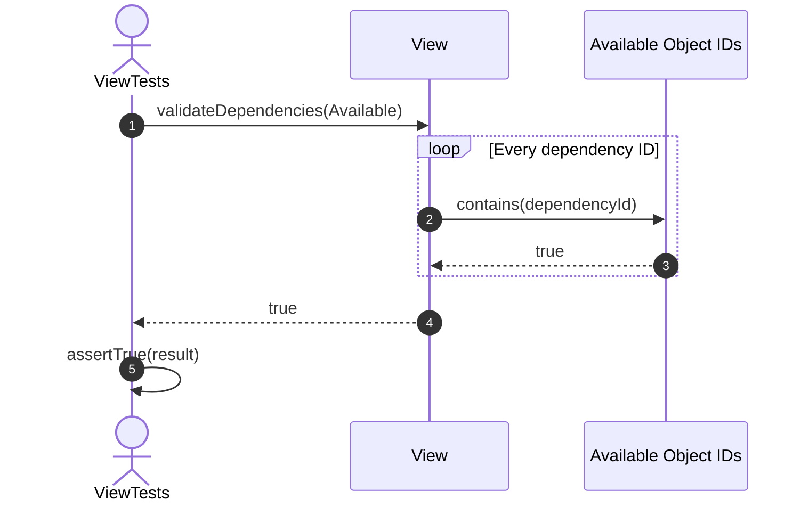
```mermaid
sequenceDiagram
    autonumber
    actor Test as ViewTests
    participant View as View
    participant Available as Available Object IDs

    Test->>View: validateDependencies(Available)
    loop Every dependency ID
        View->>Available: contains(dependencyId)
        Available-->>View: true
    end
    View-->>Test: true

    Test->>Test: assertTrue(result)
```

## 15. ValidateDependencies_ShouldRejectMissingObject

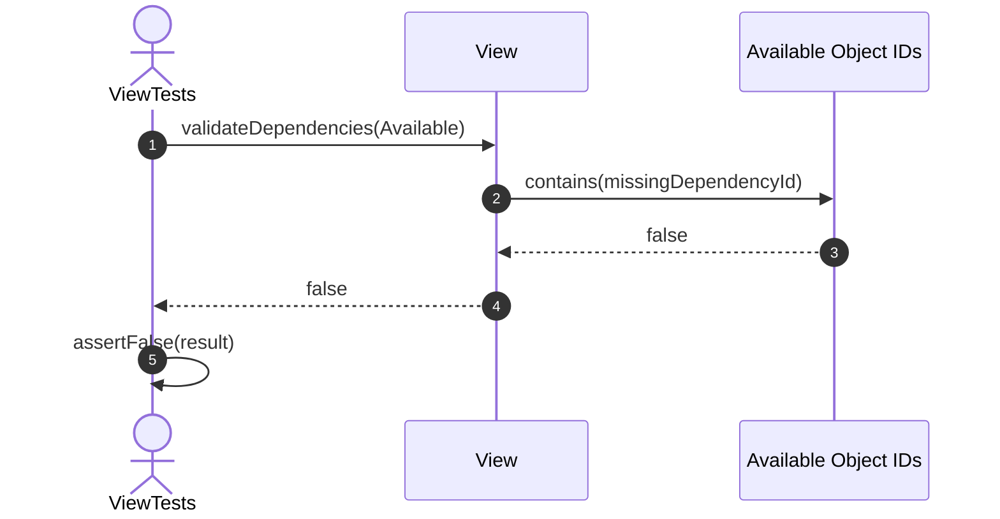
```mermaid
sequenceDiagram
    autonumber
    actor Test as ViewTests
    participant View as View
    participant Available as Available Object IDs

    Test->>View: validateDependencies(Available)
    View->>Available: contains(missingDependencyId)
    Available-->>View: false
    View-->>Test: false

    Test->>Test: assertFalse(result)
```

## 16. HasCircularDependency_ShouldDetectCycle

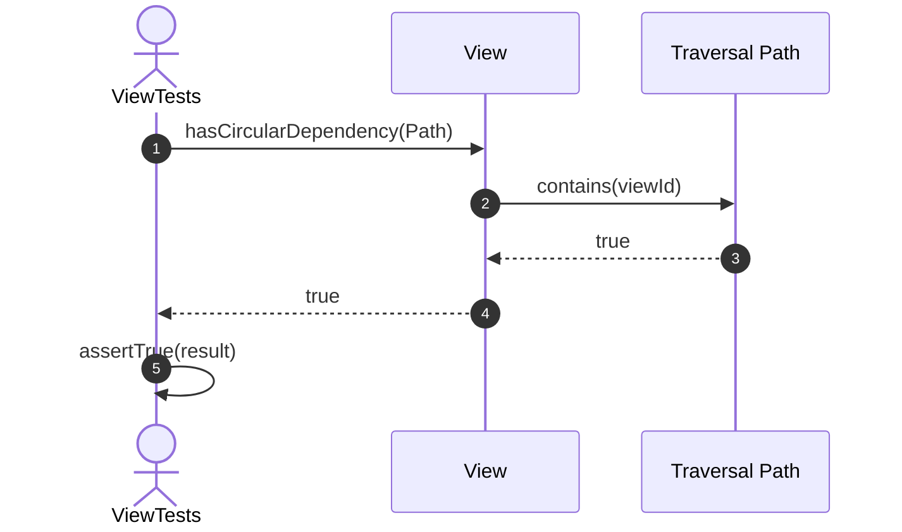
```mermaid
sequenceDiagram
    autonumber
    actor Test as ViewTests
    participant View as View
    participant Path as Traversal Path

    Test->>View: hasCircularDependency(Path)
    View->>Path: contains(viewId)
    Path-->>View: true
    View-->>Test: true

    Test->>Test: assertTrue(result)
```

## 17. SetMaterialized_ShouldEnableMaterializedMode

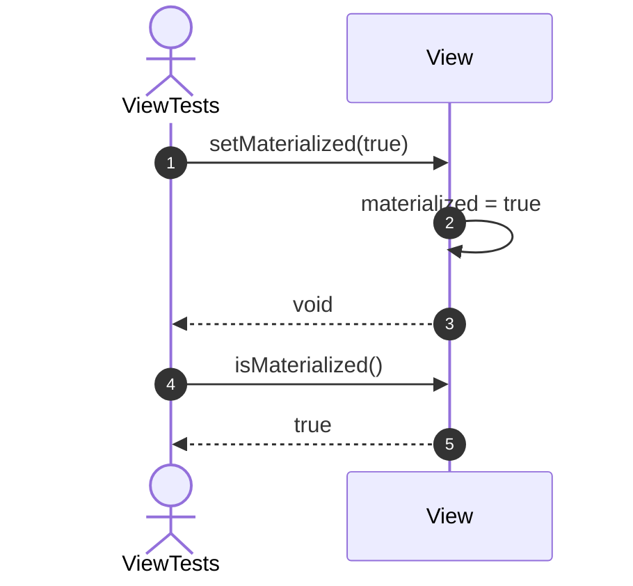
```mermaid
sequenceDiagram
    autonumber
    actor Test as ViewTests
    participant View as View

    Test->>View: setMaterialized(true)
    View->>View: materialized = true
    View-->>Test: void

    Test->>View: isMaterialized()
    View-->>Test: true
```

## 18. Refresh_ShouldRefreshMaterializedView

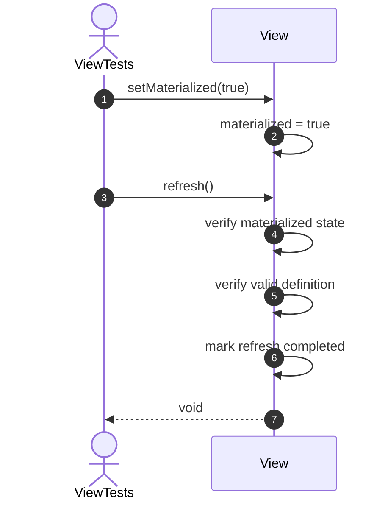
```mermaid
sequenceDiagram
    autonumber
    actor Test as ViewTests
    participant View as View

    Test->>View: setMaterialized(true)
    View->>View: materialized = true

    Test->>View: refresh()
    View->>View: verify materialized state
    View->>View: verify valid definition
    View->>View: mark refresh completed
    View-->>Test: void
```

## 19. Refresh_ShouldRejectNormalView

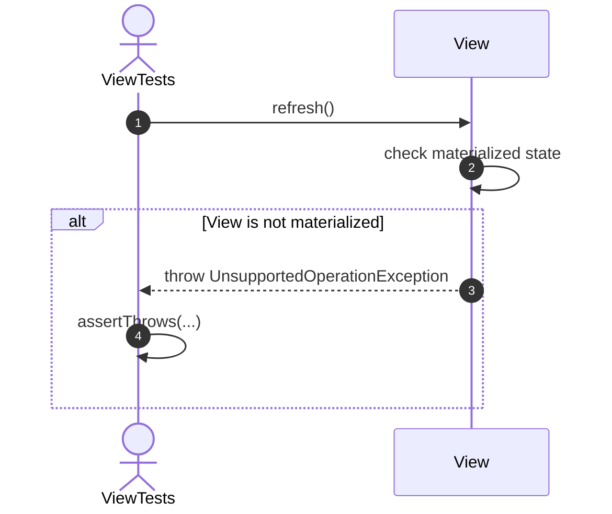
```mermaid
sequenceDiagram
    autonumber
    actor Test as ViewTests
    participant View as View

    Test->>View: refresh()
    View->>View: check materialized state

    alt View is not materialized
        View-->>Test: throw UnsupportedOperationException
        Test->>Test: assertThrows(...)
    end
```

## 20. Invalidate_ShouldChangeValidityState

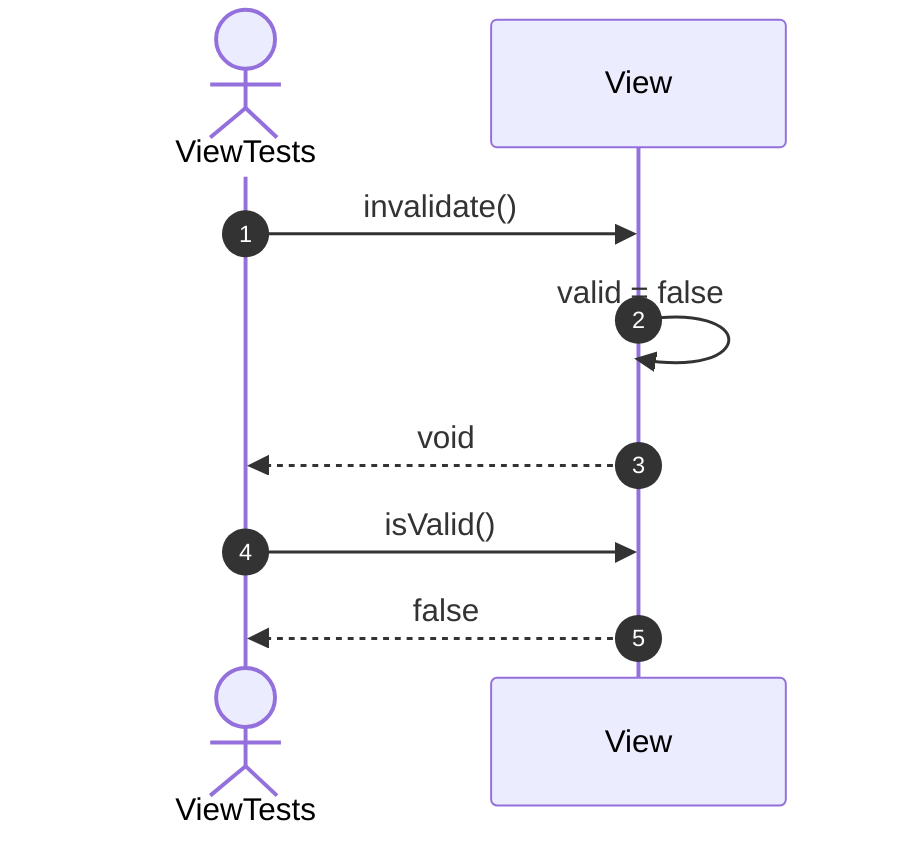
```mermaid
sequenceDiagram
    autonumber
    actor Test as ViewTests
    participant View as View

    Test->>View: invalidate()
    View->>View: valid = false
    View-->>Test: void

    Test->>View: isValid()
    View-->>Test: false
```

## 21. Validate_ShouldRestoreValidityState

```mermaid
sequenceDiagram
    autonumber
    actor Test as ViewTests
    participant View as View

    Test->>View: invalidate()
    View->>View: valid = false

    Test->>View: validate()
    View->>View: validateDefinition()
    View->>View: valid = true
    View-->>Test: void

    Test->>View: isValid()
    View-->>Test: true
```
