# Column Testing - Main Functional Sequences

---

## 1. Create Column

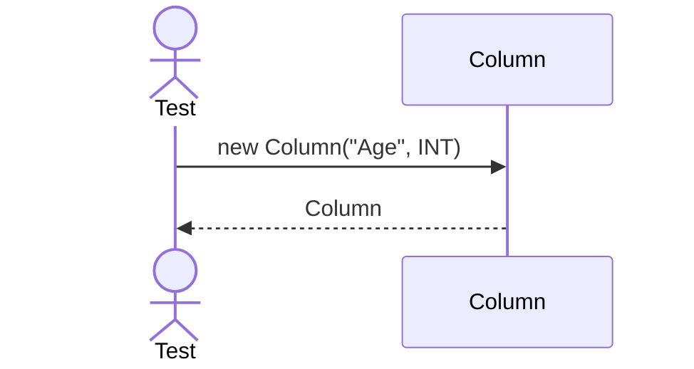
```mermaid
sequenceDiagram
actor Test
participant Column

Test->>Column: new Column("Age", INT)

Column-->>Test: Column
```

---

## 2. Validate Nullable

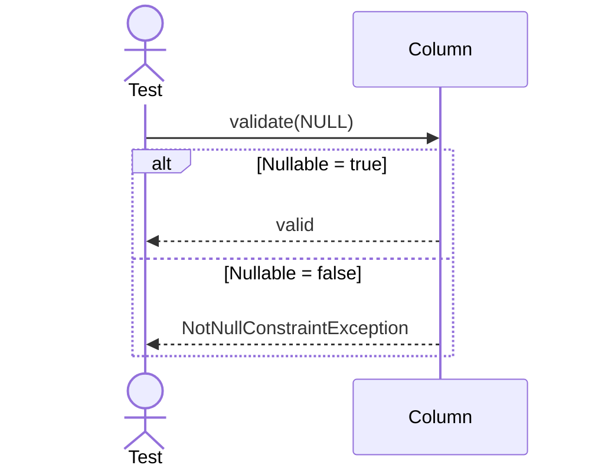
```mermaid
sequenceDiagram
actor Test
participant Column

Test->>Column: validate(NULL)

alt Nullable = true
    Column-->>Test: valid
else Nullable = false
    Column-->>Test: NotNullConstraintException
end
```

---

## 3. Validate Data Type

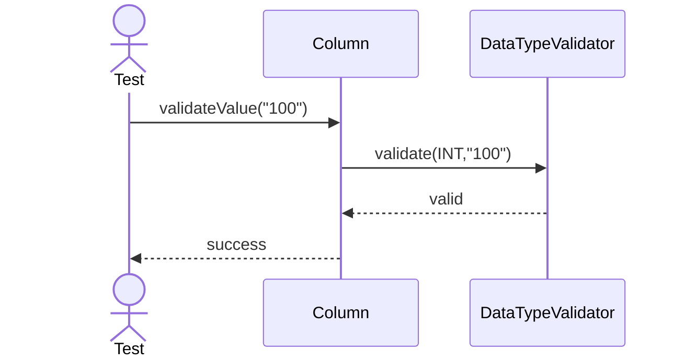
```mermaid
sequenceDiagram
actor Test
participant Column
participant DataTypeValidator

Test->>Column: validateValue("100")

Column->>DataTypeValidator: validate(INT,"100")

DataTypeValidator-->>Column: valid

Column-->>Test: success
```

---

## 4. Validate Length

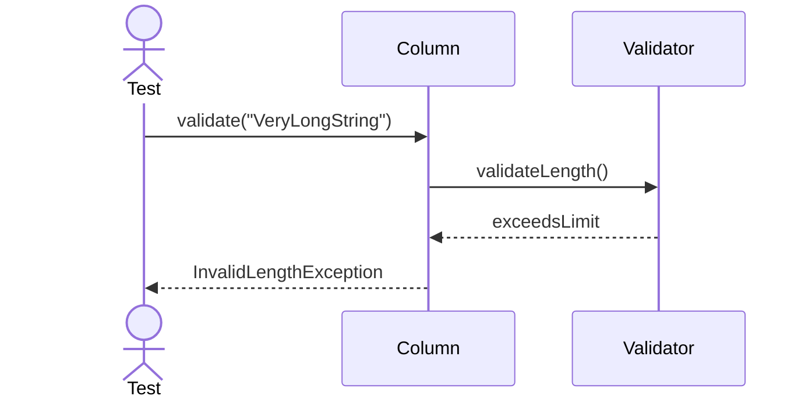
```mermaid
sequenceDiagram
actor Test
participant Column
participant Validator

Test->>Column: validate("VeryLongString")

Column->>Validator: validateLength()

Validator-->>Column: exceedsLimit

Column-->>Test: InvalidLengthException
```

---

## 5. Validate Precision

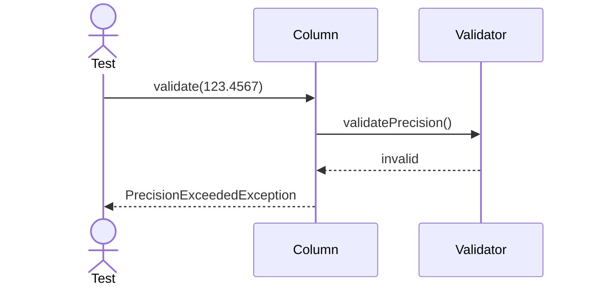
```mermaid
sequenceDiagram
actor Test
participant Column
participant Validator

Test->>Column: validate(123.4567)

Column->>Validator: validatePrecision()

Validator-->>Column: invalid

Column-->>Test: PrecisionExceededException
```

---

## 6. Apply Default Value

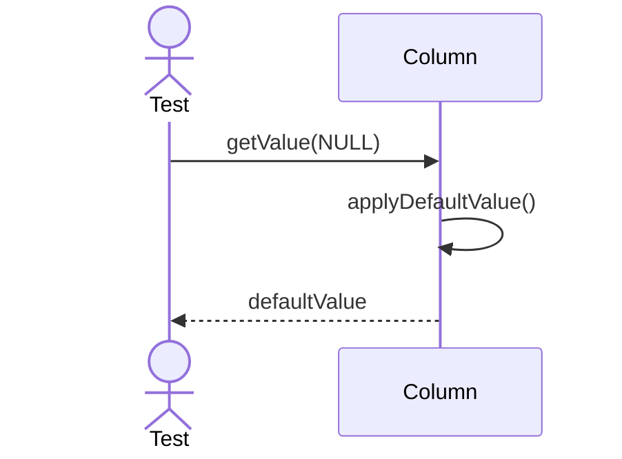
```mermaid
sequenceDiagram
actor Test
participant Column

Test->>Column: getValue(NULL)

Column->>Column: applyDefaultValue()

Column-->>Test: defaultValue
```

---

## 7. Generate Identity

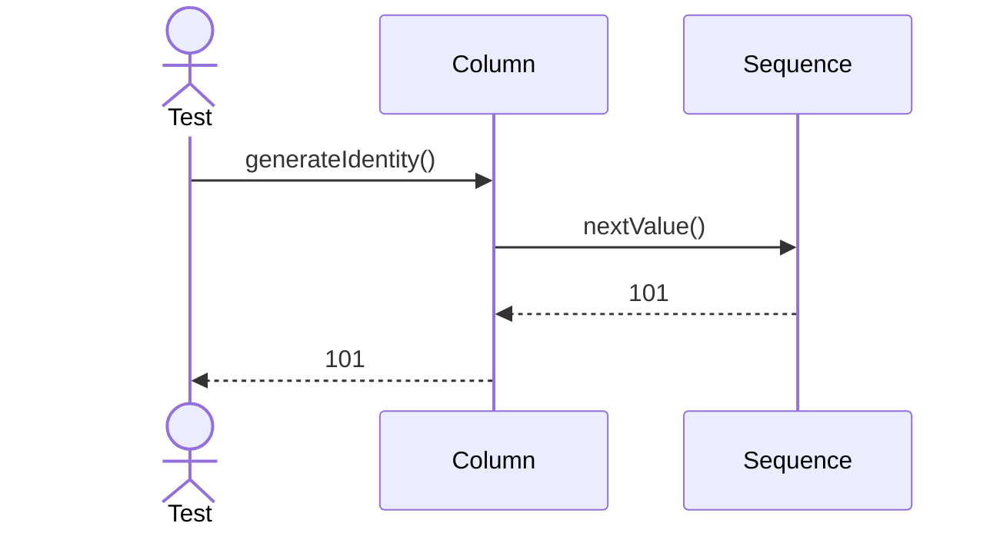
```mermaid
sequenceDiagram
actor Test
participant Column
participant Sequence

Test->>Column: generateIdentity()

Column->>Sequence: nextValue()

Sequence-->>Column: 101

Column-->>Test: 101
```

---

## 8. Evaluate Computed Column

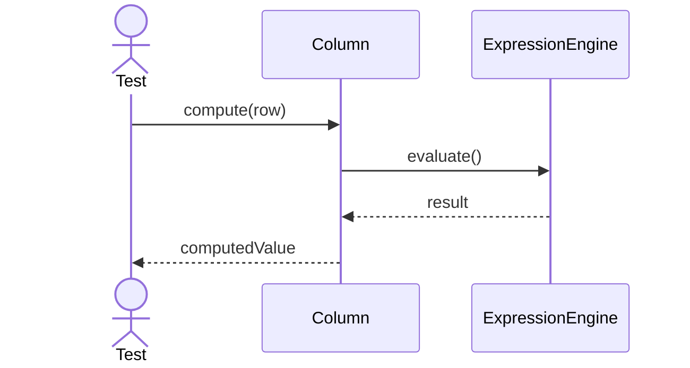
```mermaid
sequenceDiagram
actor Test
participant Column
participant ExpressionEngine

Test->>Column: compute(row)

Column->>ExpressionEngine: evaluate()

ExpressionEngine-->>Column: result

Column-->>Test: computedValue
```

---

## 9. Apply Masking

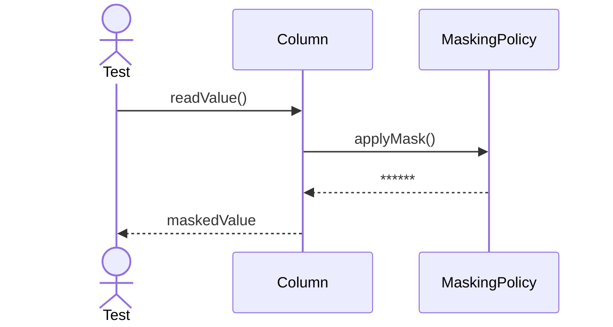
```mermaid
sequenceDiagram
actor Test
participant Column
participant MaskingPolicy

Test->>Column: readValue()

Column->>MaskingPolicy: applyMask()

MaskingPolicy-->>Column: ******

Column-->>Test: maskedValue
```

---

## 10. Encrypt Column

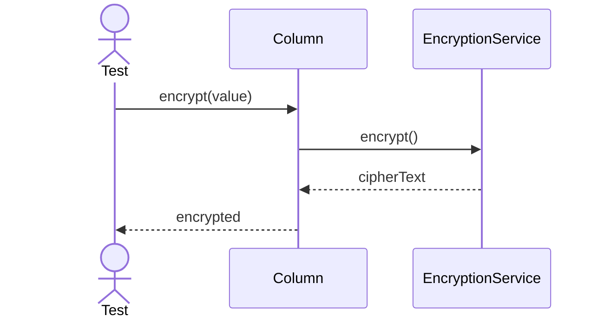
```mermaid
sequenceDiagram
actor Test
participant Column
participant EncryptionService

Test->>Column: encrypt(value)

Column->>EncryptionService: encrypt()

EncryptionService-->>Column: cipherText

Column-->>Test: encrypted
```

---

## 11. Change Data Type

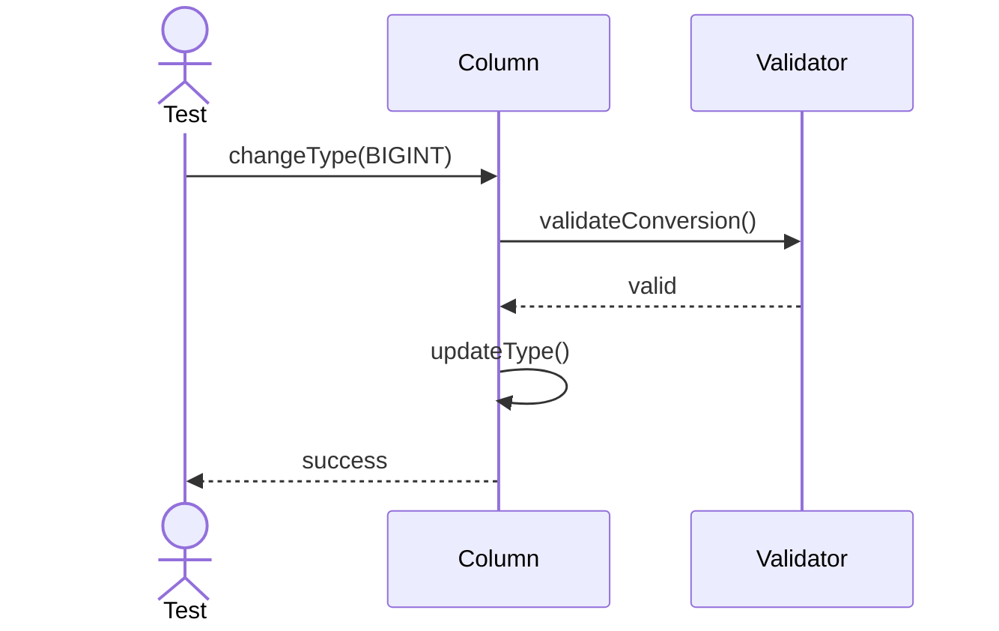
```mermaid
sequenceDiagram
actor Test
participant Column
participant Validator

Test->>Column: changeType(BIGINT)

Column->>Validator: validateConversion()

Validator-->>Column: valid

Column->>Column: updateType()

Column-->>Test: success
```

---

## 12. Rename Column

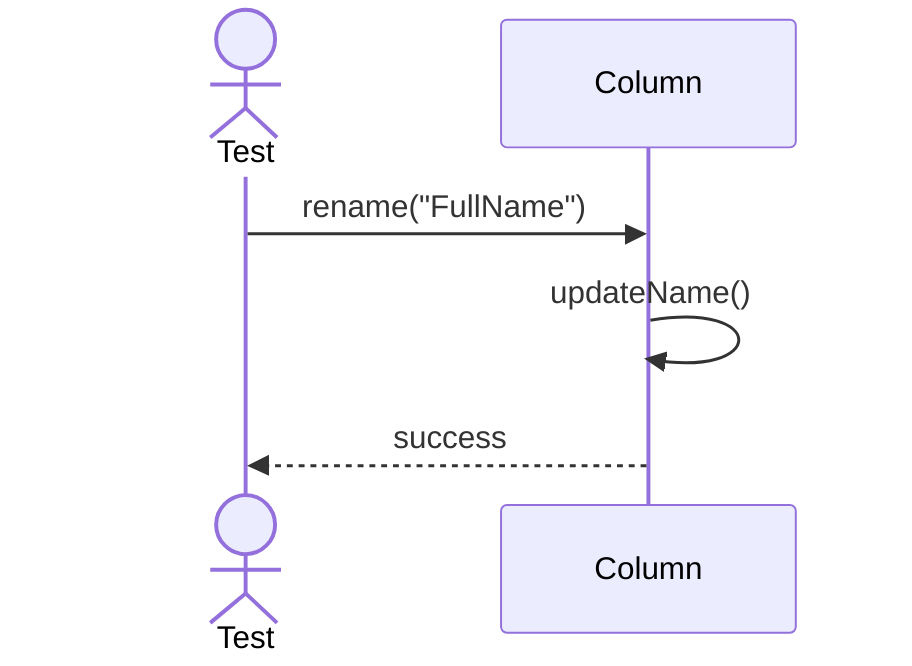
```mermaid
sequenceDiagram
actor Test
participant Column

Test->>Column: rename("FullName")

Column->>Column: updateName()

Column-->>Test: success
```

---

## 13. Validate Default Value

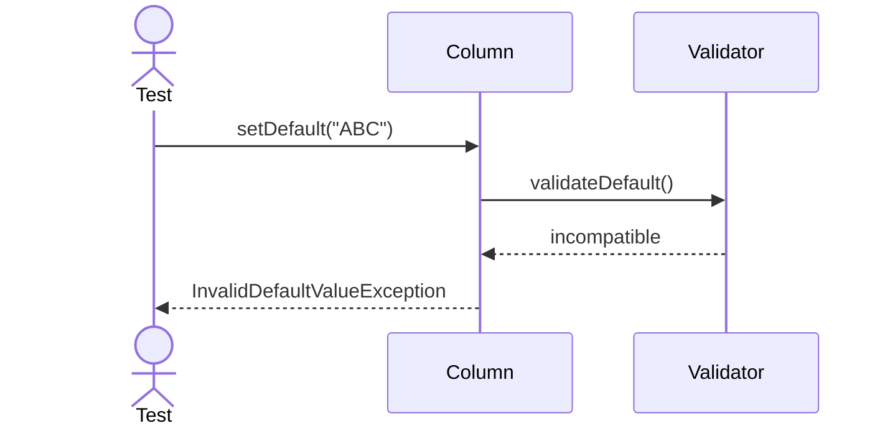
```mermaid
sequenceDiagram
actor Test
participant Column
participant Validator

Test->>Column: setDefault("ABC")

Column->>Validator: validateDefault()

Validator-->>Column: incompatible

Column-->>Test: InvalidDefaultValueException
```

---

## 14. Validate Computed Expression

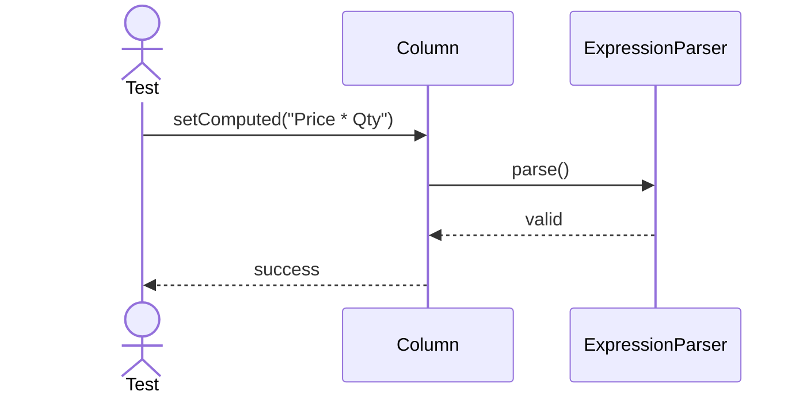
```mermaid
sequenceDiagram
actor Test
participant Column
participant ExpressionParser

Test->>Column: setComputed("Price * Qty")

Column->>ExpressionParser: parse()

ExpressionParser-->>Column: valid

Column-->>Test: success
```

---

## 15. Validate Range

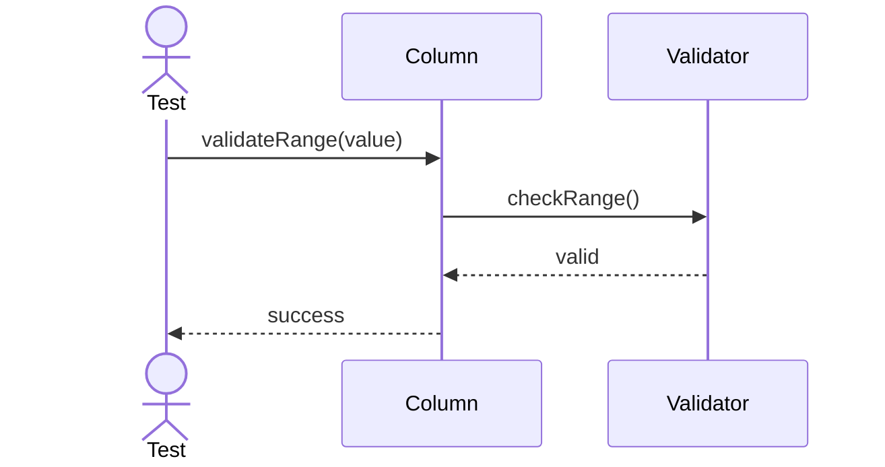
```mermaid
sequenceDiagram
actor Test
participant Column
participant Validator

Test->>Column: validateRange(value)
Column->>Validator: checkRange()
Validator-->>Column: valid
Column-->>Test: success
```

---

## 16. Normalize Value

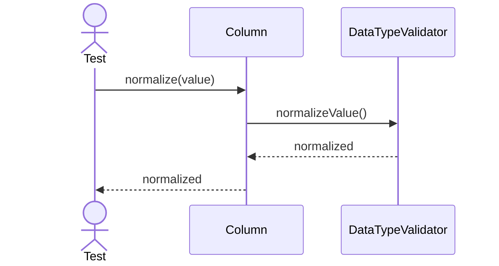
```mermaid
sequenceDiagram
actor Test
participant Column
participant DataTypeValidator

Test->>Column: normalize(value)
Column->>DataTypeValidator: normalizeValue()
DataTypeValidator-->>Column: normalized
Column-->>Test: normalized
```

---

## 17. Bind Collation

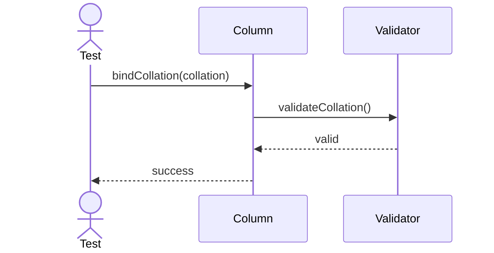
```mermaid
sequenceDiagram
actor Test
participant Column
participant Validator

Test->>Column: bindCollation(collation)
Column->>Validator: validateCollation()
Validator-->>Column: valid
Column-->>Test: success
```

---

## 18. Compare Metadata

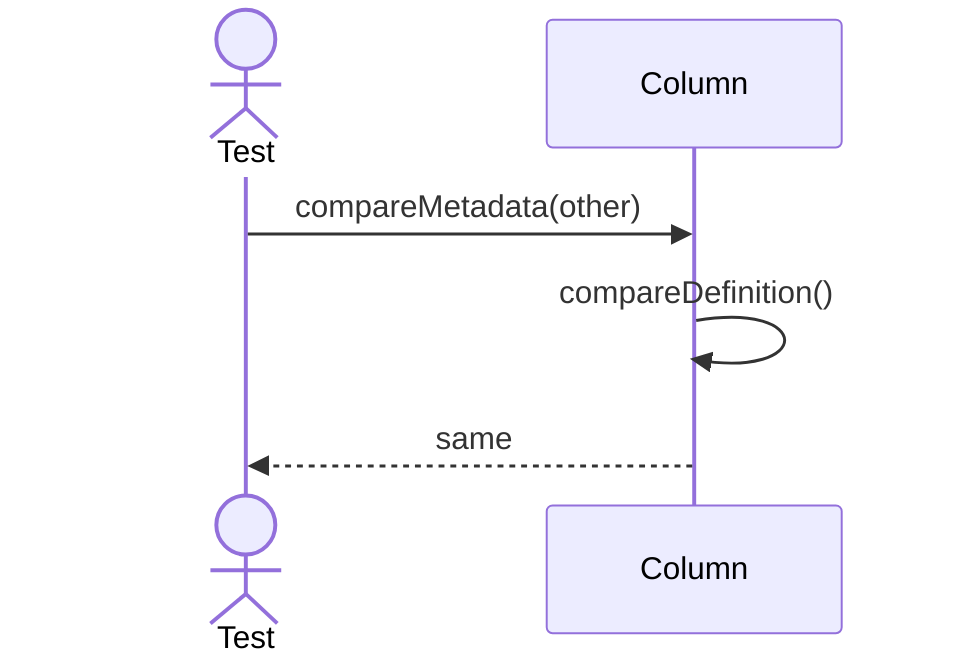
```mermaid
sequenceDiagram
actor Test
participant Column

Test->>Column: compareMetadata(other)
Column->>Column: compareDefinition()
Column-->>Test: same
```

---

## 19. Export Definition

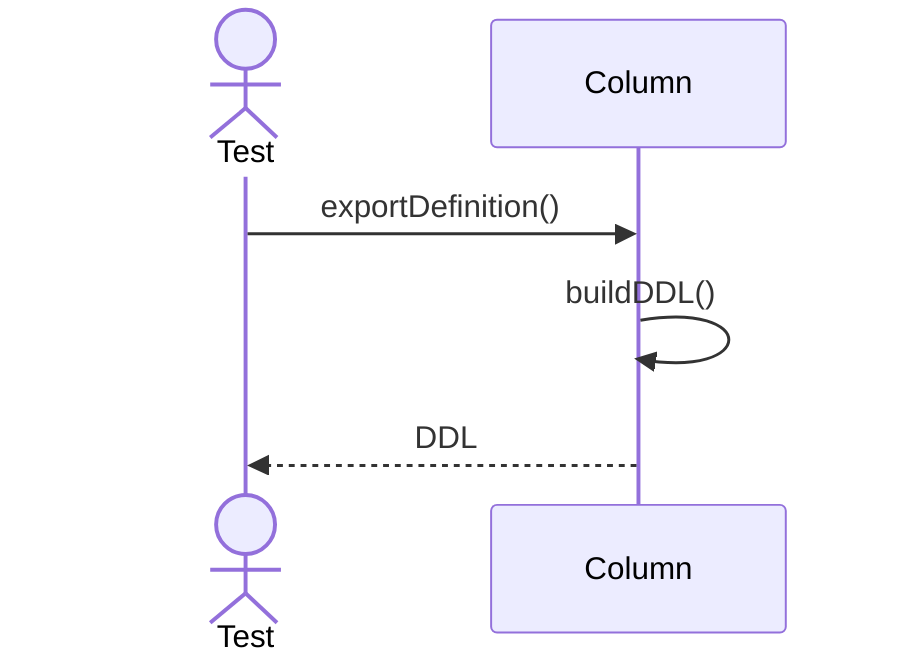
```mermaid
sequenceDiagram
actor Test
participant Column

Test->>Column: exportDefinition()
Column->>Column: buildDDL()
Column-->>Test: DDL
```

---

## 20. Refresh Statistics

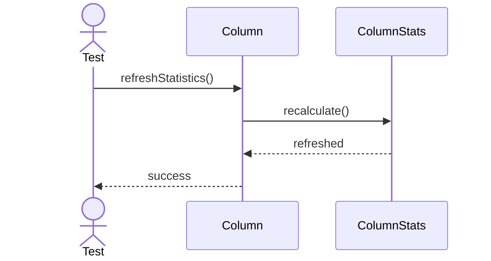
```mermaid
sequenceDiagram
actor Test
participant Column
participant ColumnStats

Test->>Column: refreshStatistics()
Column->>ColumnStats: recalculate()
ColumnStats-->>Column: refreshed
Column-->>Test: success
```

---

## 15. Concurrent Alter Column

```mermaid
sequenceDiagram
actor Thread1
actor Thread2

participant Column
participant LockManager

Thread1->>Column: alterType()

Thread2->>Column: rename()

Column->>LockManager: acquireSchemaLock()

LockManager-->>Thread1: granted

LockManager-->>Thread2: wait
```
