# Column Testing — Important Unit Test Sequence Diagrams

## 1. Constructor_ShouldCreateColumn

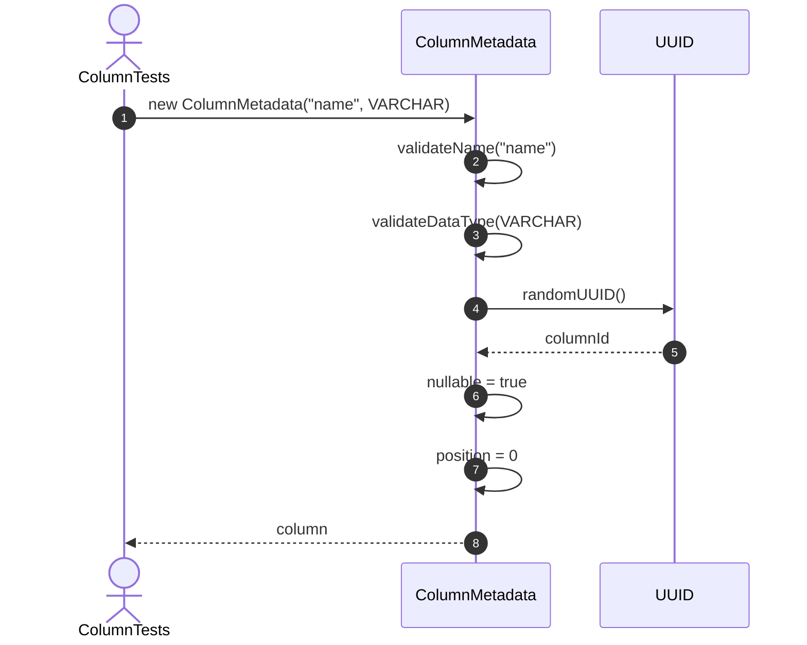
```mermaid
sequenceDiagram
    autonumber
    actor Test as ColumnTests
    participant Column as ColumnMetadata
    participant UUID as UUID

    Test->>Column: new ColumnMetadata("name", VARCHAR)
    Column->>Column: validateName("name")
    Column->>Column: validateDataType(VARCHAR)
    Column->>UUID: randomUUID()
    UUID-->>Column: columnId
    Column->>Column: nullable = true
    Column->>Column: position = 0
    Column-->>Test: column
```

## 2. Constructor_ShouldGenerateColumnId

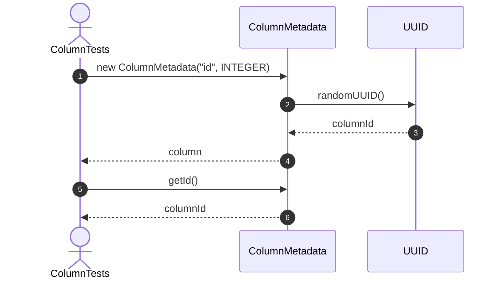
```mermaid
sequenceDiagram
    autonumber
    actor Test as ColumnTests
    participant Column as ColumnMetadata
    participant UUID as UUID

    Test->>Column: new ColumnMetadata("id", INTEGER)
    Column->>UUID: randomUUID()
    UUID-->>Column: columnId
    Column-->>Test: column

    Test->>Column: getId()
    Column-->>Test: columnId
```

## 3. Rename_ShouldChangeColumnName

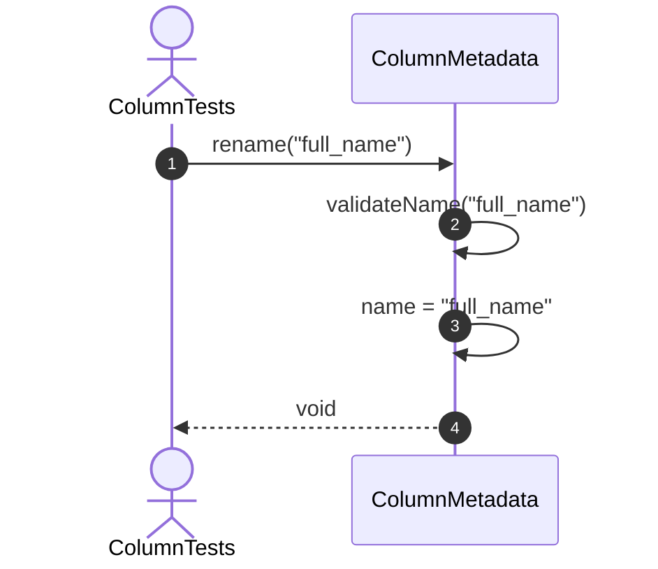
```mermaid
sequenceDiagram
    autonumber
    actor Test as ColumnTests
    participant Column as ColumnMetadata

    Test->>Column: rename("full_name")
    Column->>Column: validateName("full_name")
    Column->>Column: name = "full_name"
    Column-->>Test: void
```

## 4. Rename_ShouldRejectInvalidName

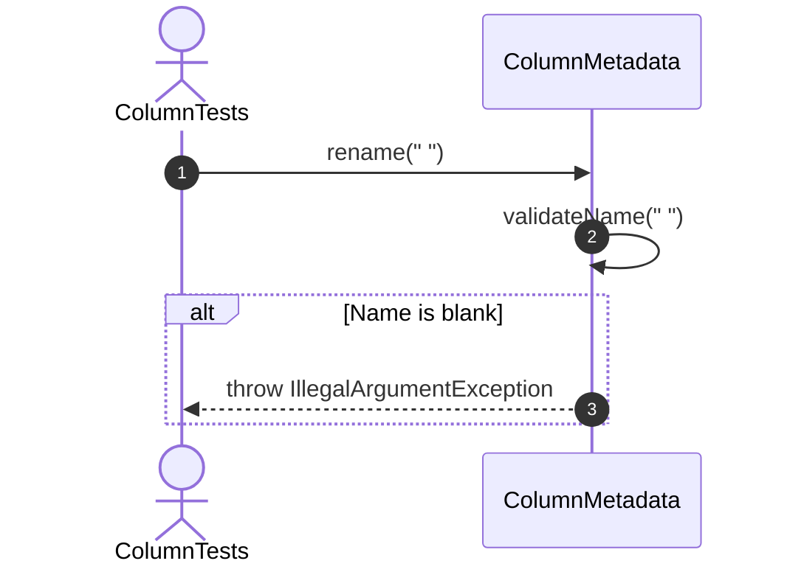
```mermaid
sequenceDiagram
    autonumber
    actor Test as ColumnTests
    participant Column as ColumnMetadata

    Test->>Column: rename(" ")
    Column->>Column: validateName(" ")

    alt Name is blank
        Column-->>Test: throw IllegalArgumentException
    end
```

## 5. SetDataType_ShouldChangeDataType

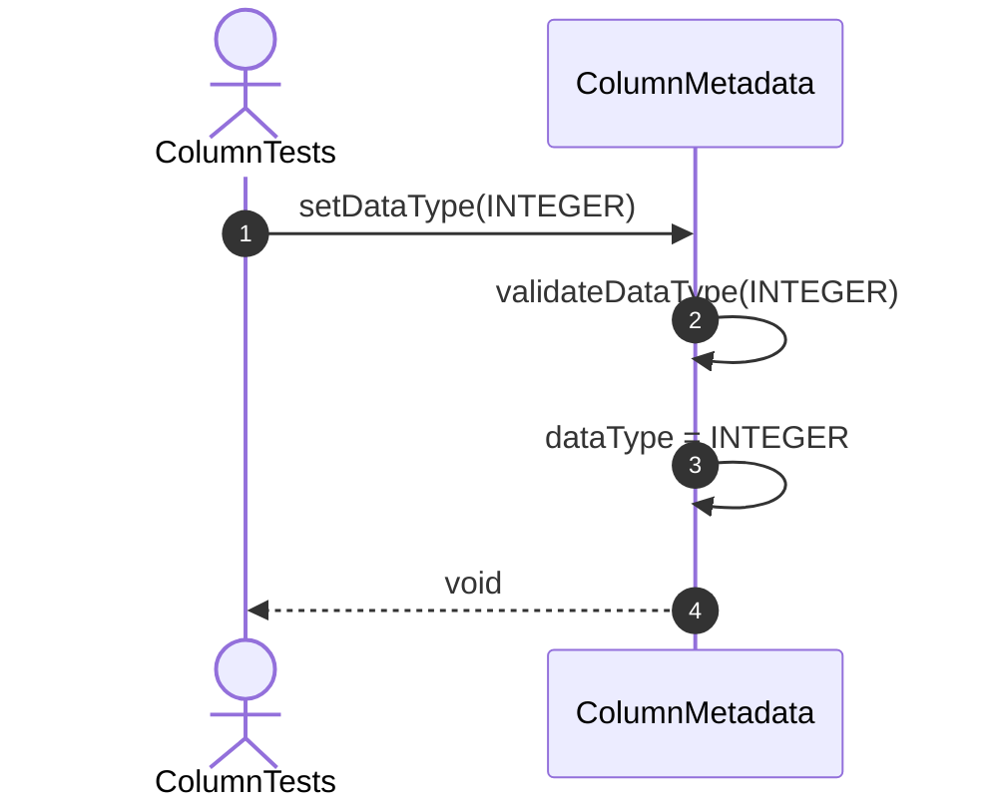
```mermaid
sequenceDiagram
    autonumber
    actor Test as ColumnTests
    participant Column as ColumnMetadata

    Test->>Column: setDataType(INTEGER)
    Column->>Column: validateDataType(INTEGER)
    Column->>Column: dataType = INTEGER
    Column-->>Test: void
```

## 6. ValidateValue_ShouldAcceptMatchingType

```mermaid
sequenceDiagram
    autonumber
    actor Test as ColumnTests
    participant Column as ColumnMetadata
    participant Type as DataType

    Test->>Column: validateValue(100)
    Column->>Type: supports(100)
    Type-->>Column: true
    Column-->>Test: true
```

## 7. ValidateValue_ShouldRejectWrongType

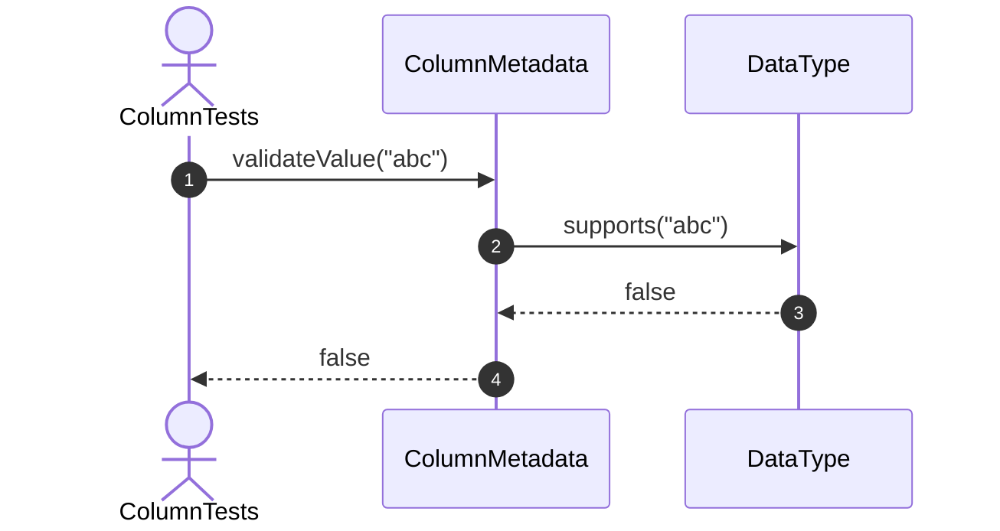
```mermaid
sequenceDiagram
    autonumber
    actor Test as ColumnTests
    participant Column as ColumnMetadata
    participant Type as DataType

    Test->>Column: validateValue("abc")
    Column->>Type: supports("abc")
    Type-->>Column: false
    Column-->>Test: false
```

## 8. ValidateValue_ShouldRejectNullWhenNotNullable

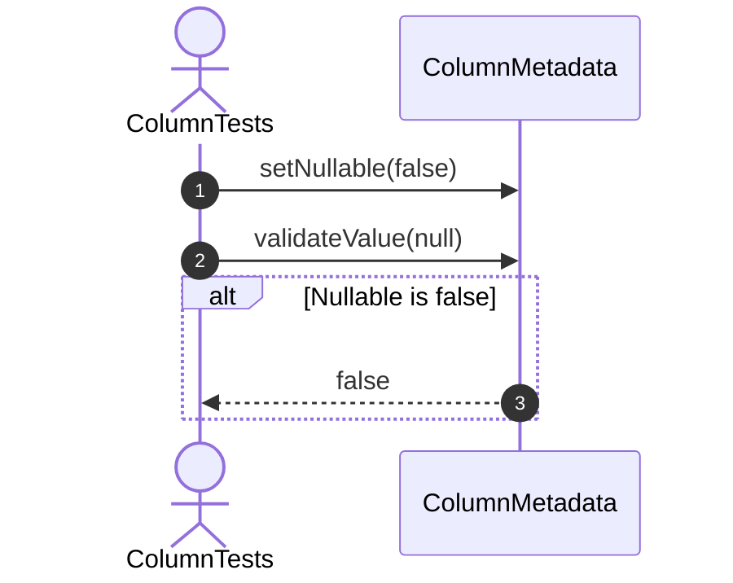
```mermaid
sequenceDiagram
    autonumber
    actor Test as ColumnTests
    participant Column as ColumnMetadata

    Test->>Column: setNullable(false)
    Test->>Column: validateValue(null)

    alt Nullable is false
        Column-->>Test: false
    end
```

## 9. ApplyDefaultValue_ShouldReturnDefault

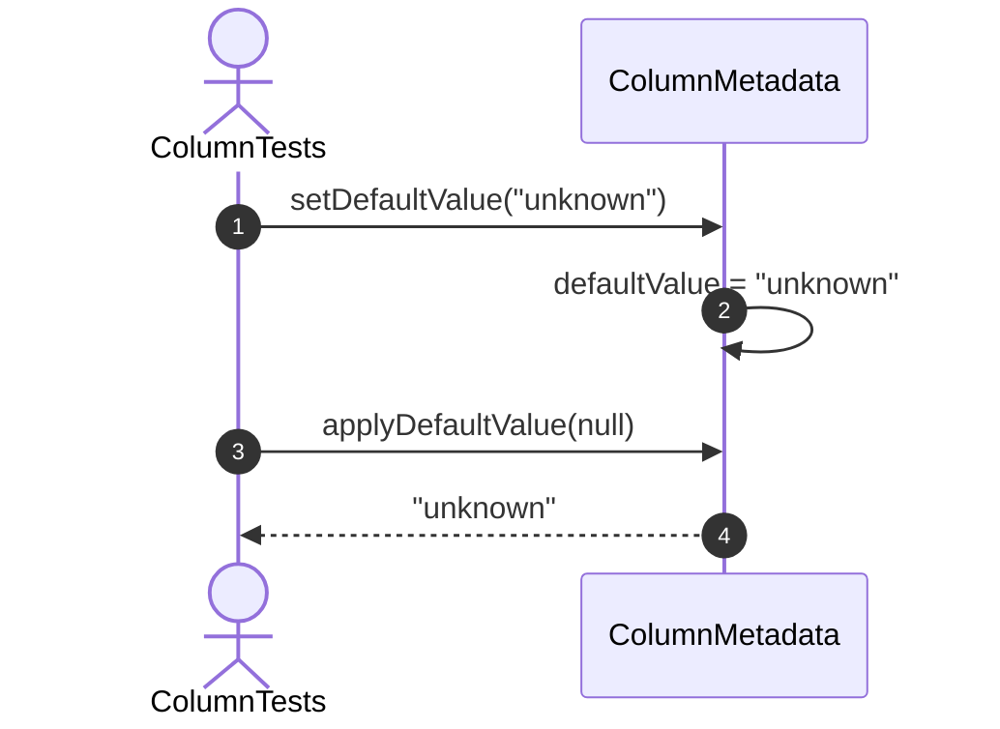
```mermaid
sequenceDiagram
    autonumber
    actor Test as ColumnTests
    participant Column as ColumnMetadata

    Test->>Column: setDefaultValue("unknown")
    Column->>Column: defaultValue = "unknown"

    Test->>Column: applyDefaultValue(null)
    Column-->>Test: "unknown"
```

## 10. ApplyDefaultValue_ShouldPreserveProvidedValue

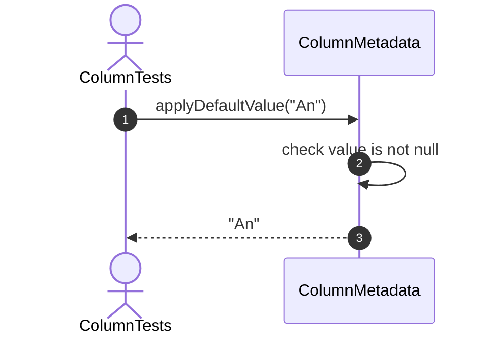
```mermaid
sequenceDiagram
    autonumber
    actor Test as ColumnTests
    participant Column as ColumnMetadata

    Test->>Column: applyDefaultValue("An")
    Column->>Column: check value is not null
    Column-->>Test: "An"
```

## 11. SetPosition_ShouldUpdatePosition

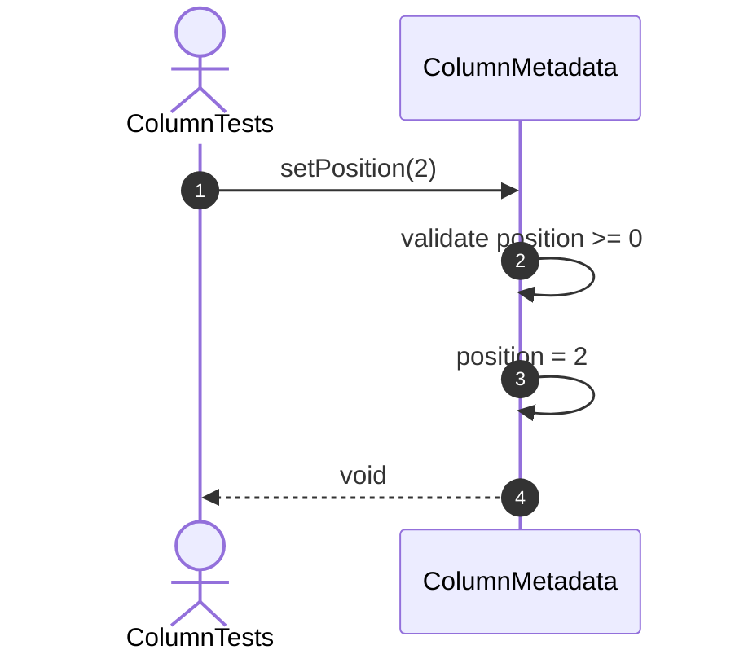
```mermaid
sequenceDiagram
    autonumber
    actor Test as ColumnTests
    participant Column as ColumnMetadata

    Test->>Column: setPosition(2)
    Column->>Column: validate position >= 0
    Column->>Column: position = 2
    Column-->>Test: void
```

## 12. SetLength_ShouldRejectInvalidLength

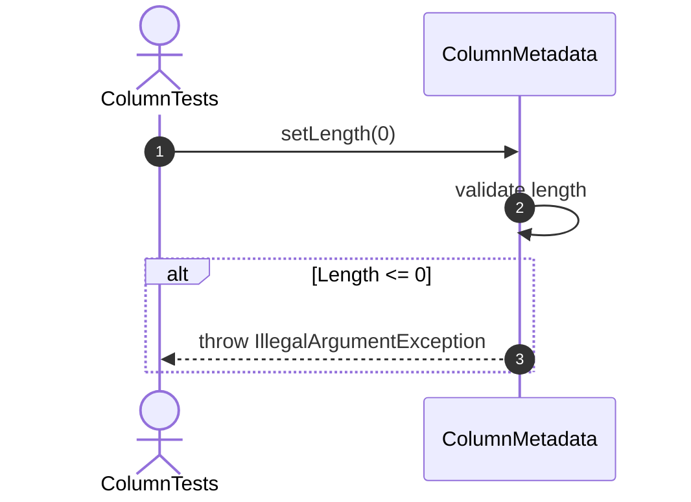
```mermaid
sequenceDiagram
    autonumber
    actor Test as ColumnTests
    participant Column as ColumnMetadata

    Test->>Column: setLength(0)
    Column->>Column: validate length

    alt Length <= 0
        Column-->>Test: throw IllegalArgumentException
    end
```

## 13. ValidateLength_ShouldAcceptValueWithinLimit

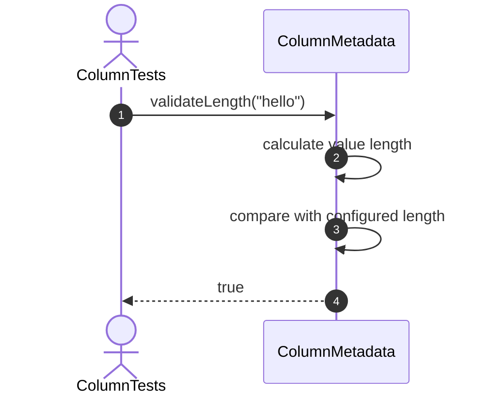
```mermaid
sequenceDiagram
    autonumber
    actor Test as ColumnTests
    participant Column as ColumnMetadata

    Test->>Column: validateLength("hello")
    Column->>Column: calculate value length
    Column->>Column: compare with configured length
    Column-->>Test: true
```

## 14. ValidateLength_ShouldRejectValueExceedingLimit

```mermaid
sequenceDiagram
    autonumber
    actor Test as ColumnTests
    participant Column as ColumnMetadata

    Test->>Column: validateLength("hello")
    Column->>Column: calculate value length
    Column->>Column: compare with configured length
    Column-->>Test: false
```

## 15. SetPrecisionAndScale_ShouldUpdateMetadata

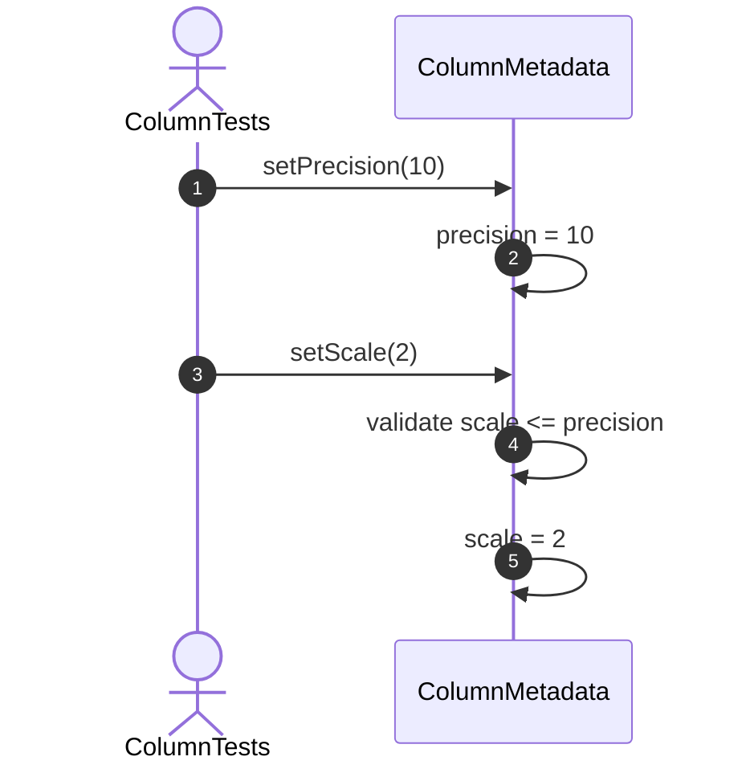
```mermaid
sequenceDiagram
    autonumber
    actor Test as ColumnTests
    participant Column as ColumnMetadata

    Test->>Column: setPrecision(10)
    Column->>Column: precision = 10
    Test->>Column: setScale(2)
    Column->>Column: validate scale <= precision
    Column->>Column: scale = 2
```

## 16. SetScale_ShouldRejectScaleGreaterThanPrecision

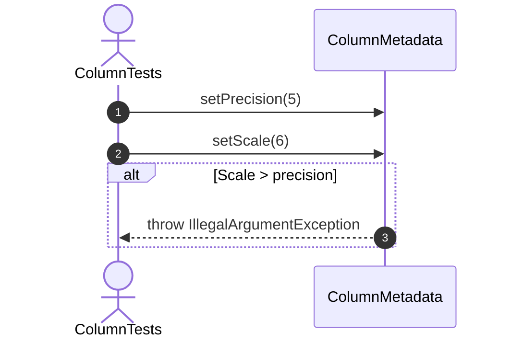
```mermaid
sequenceDiagram
    autonumber
    actor Test as ColumnTests
    participant Column as ColumnMetadata

    Test->>Column: setPrecision(5)
    Test->>Column: setScale(6)

    alt Scale > precision
        Column-->>Test: throw IllegalArgumentException
    end
```

## 17. GenerateIdentityValue_ShouldReturnSequentialValues

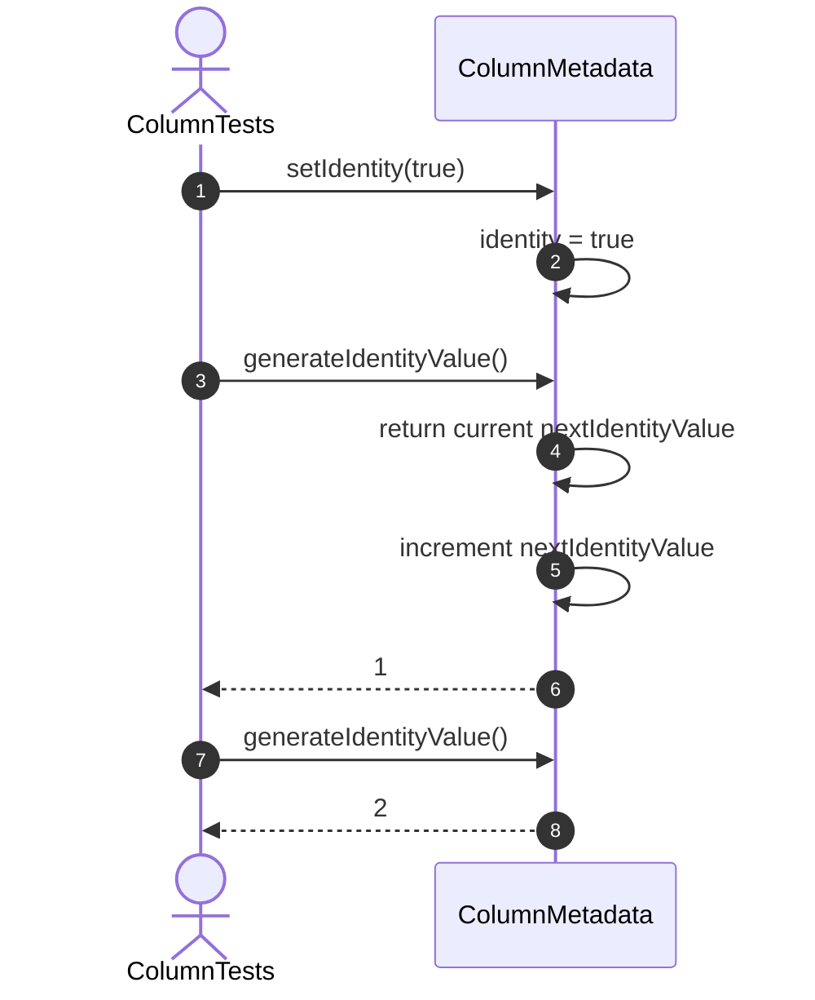
```mermaid
sequenceDiagram
    autonumber
    actor Test as ColumnTests
    participant Column as ColumnMetadata

    Test->>Column: setIdentity(true)
    Column->>Column: identity = true

    Test->>Column: generateIdentityValue()
    Column->>Column: return current nextIdentityValue
    Column->>Column: increment nextIdentityValue
    Column-->>Test: 1

    Test->>Column: generateIdentityValue()
    Column-->>Test: 2
```

## 18. GenerateIdentityValue_ShouldRejectDisabledIdentity

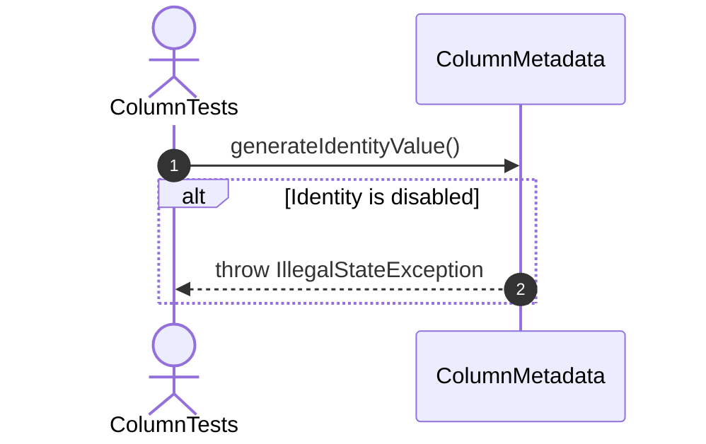
```mermaid
sequenceDiagram
    autonumber
    actor Test as ColumnTests
    participant Column as ColumnMetadata

    Test->>Column: generateIdentityValue()

    alt Identity is disabled
        Column-->>Test: throw IllegalStateException
    end
```