# Constraint Testing — Important Unit Test Sequence Diagrams

## 1. Constructor_ShouldCreateConstraint

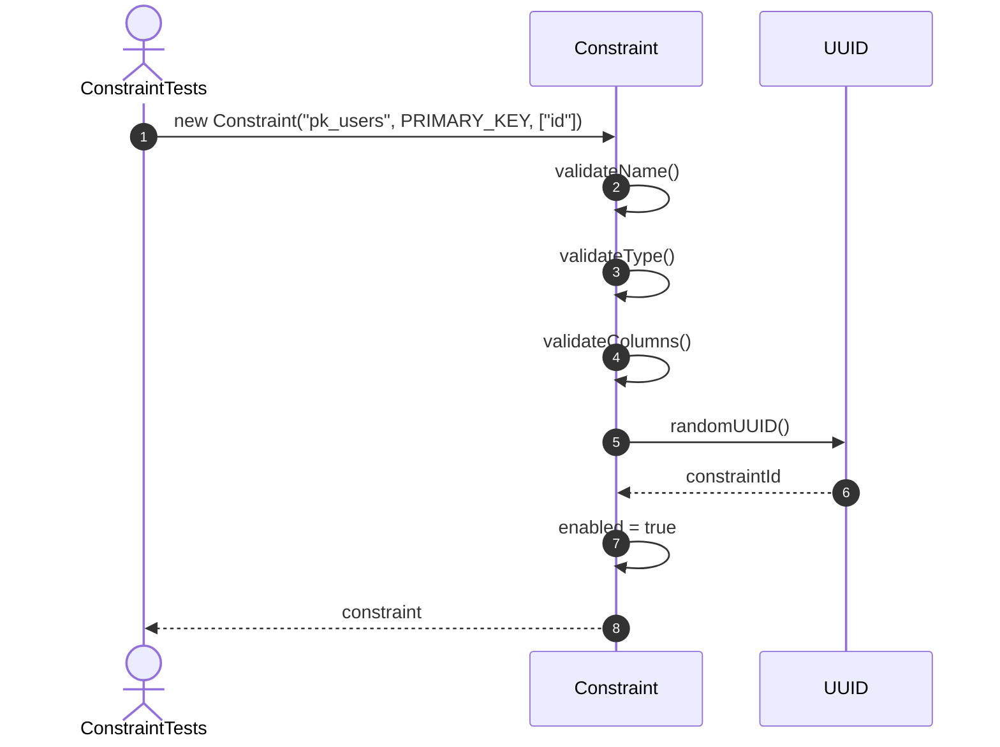

## 2. Rename_ShouldChangeConstraintName

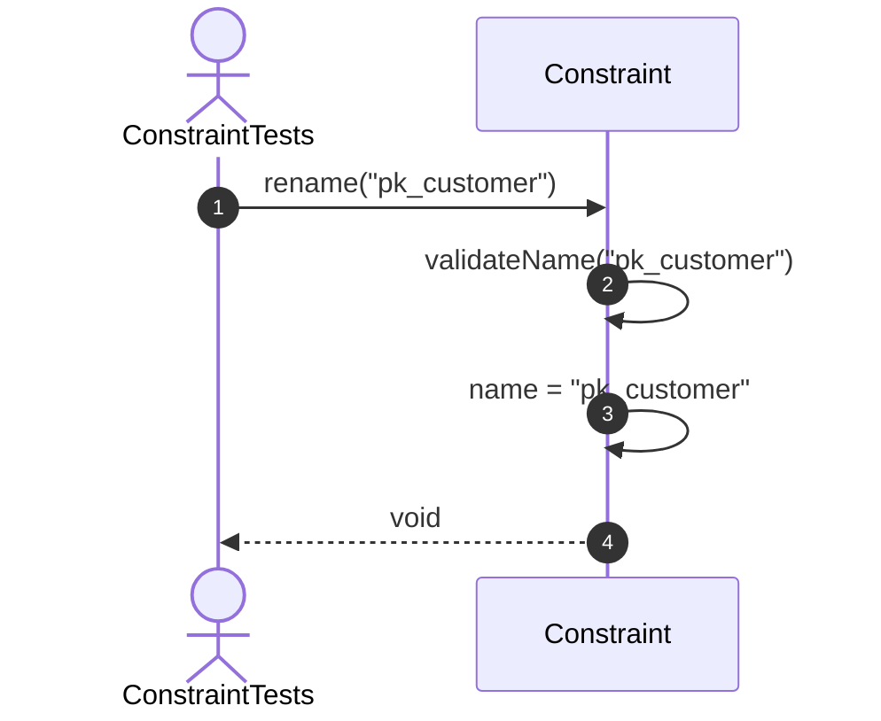

## 3. Disable_ShouldDisableConstraint

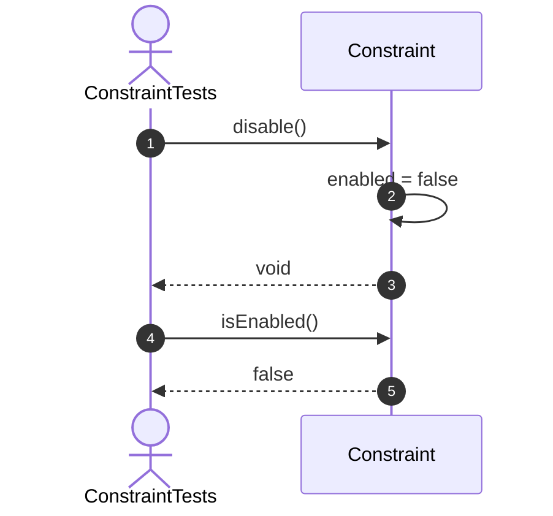

## 4. Validate_ShouldSkipDisabledConstraint

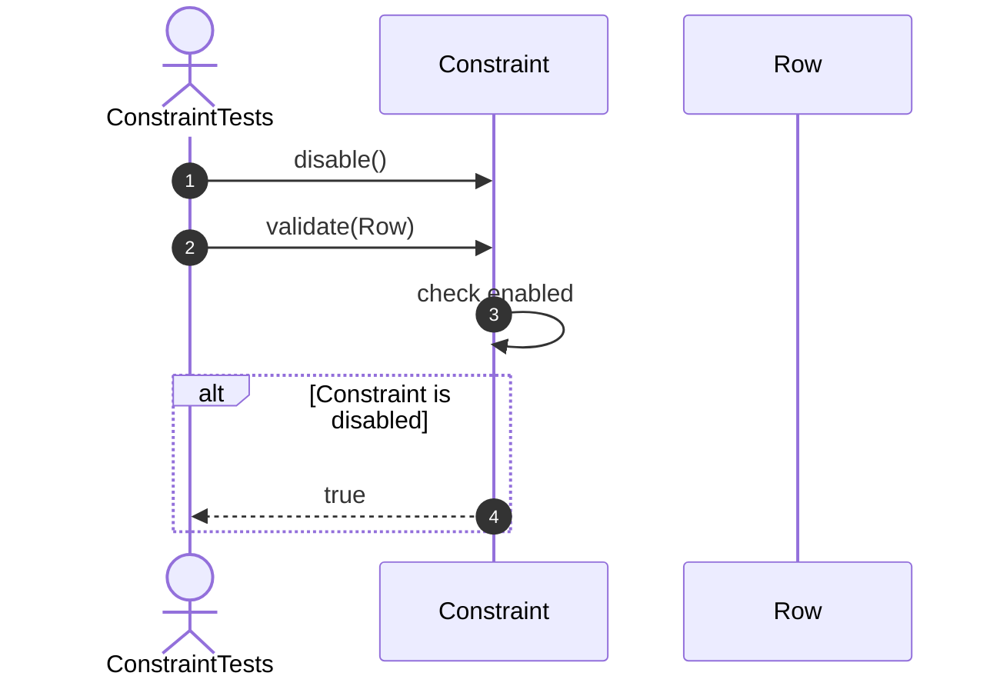

## 5. PrimaryKey_ShouldAcceptUniqueNonNullValue

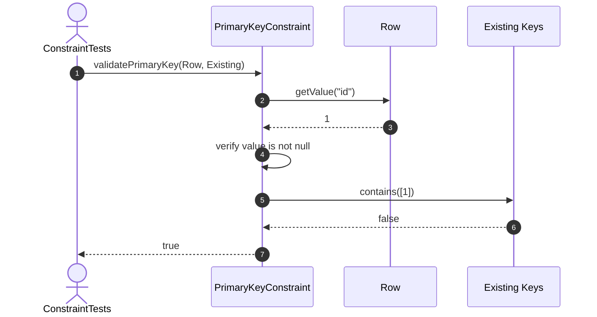

## 6. PrimaryKey_ShouldRejectNullValue

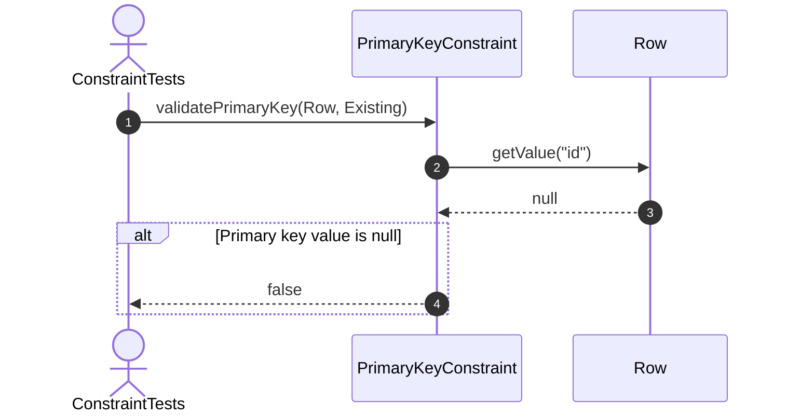

## 7. PrimaryKey_ShouldRejectDuplicateValue

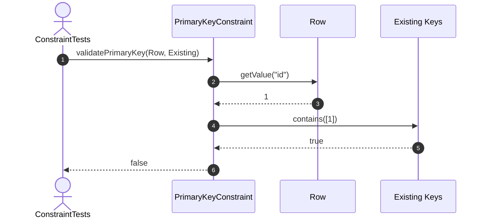

## 8. Unique_ShouldAcceptUniqueValue

## 9. Unique_ShouldRejectDuplicateValue

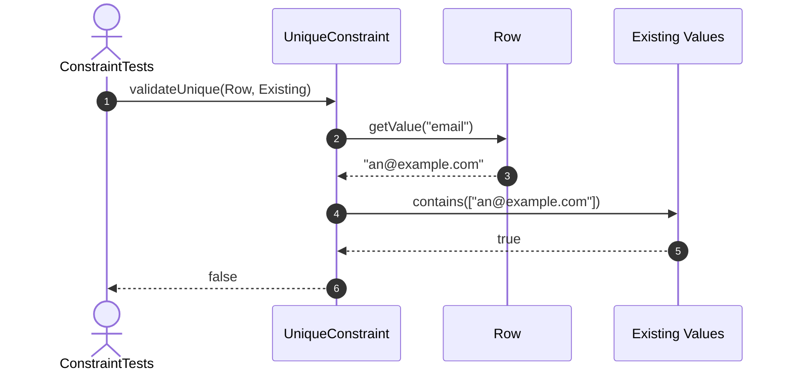

## 10. NotNull_ShouldAcceptNonNullValue

## 11. NotNull_ShouldRejectNullValue

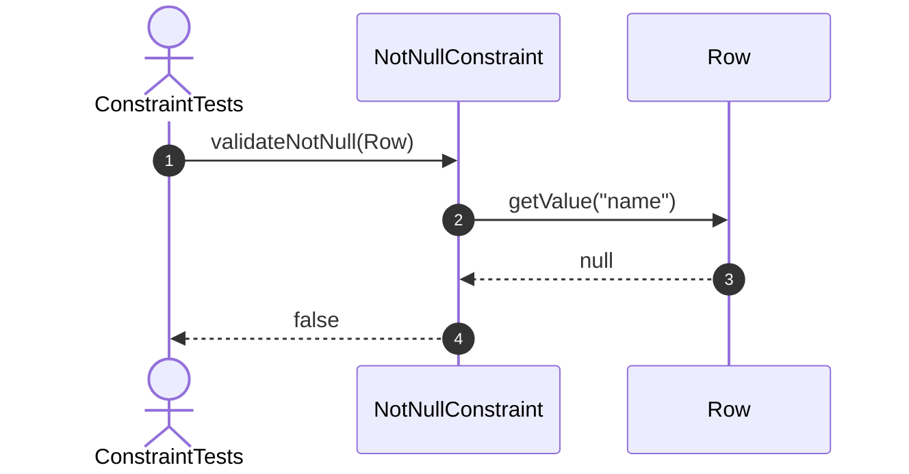

## 12. ForeignKey_ShouldAcceptExistingReference

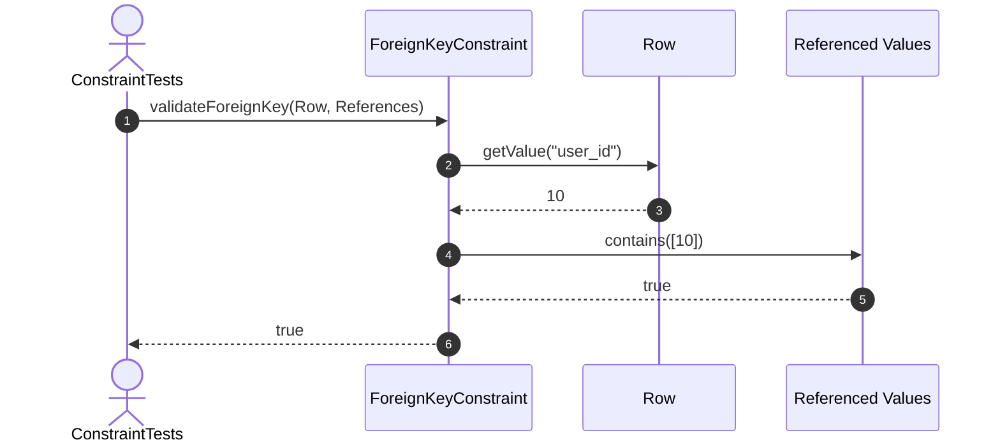

## 13. ForeignKey_ShouldRejectMissingReference

## 14. Check_ShouldAcceptMatchingExpression

## 15. Check_ShouldRejectNonMatchingExpression

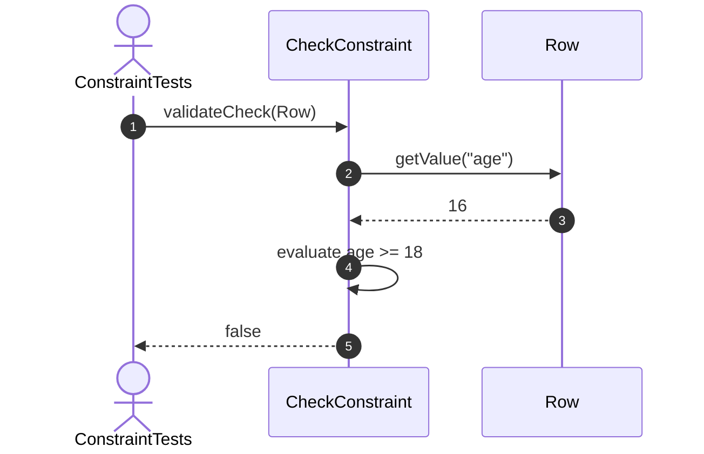

## 16. ForeignKeyDefinition_ShouldRequireReference

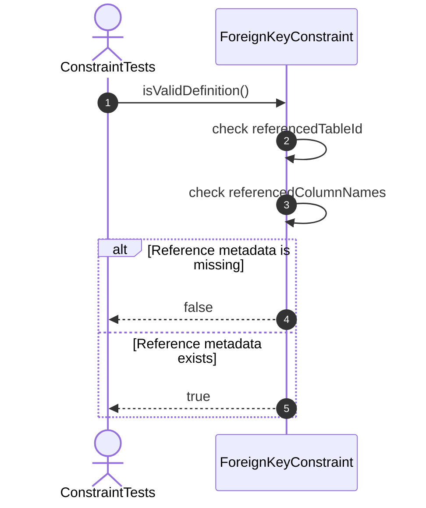

## Recommended order

1. Constructor and metadata
2. Enable and disable state
3. Primary key
4. Unique
5. Not-null
6. Foreign key
7. Check constraint
8. Definition validation