# Constraint Testing - Main Functional Sequences

---

## 1. Create Constraint


---

## 2. Validate Primary Key

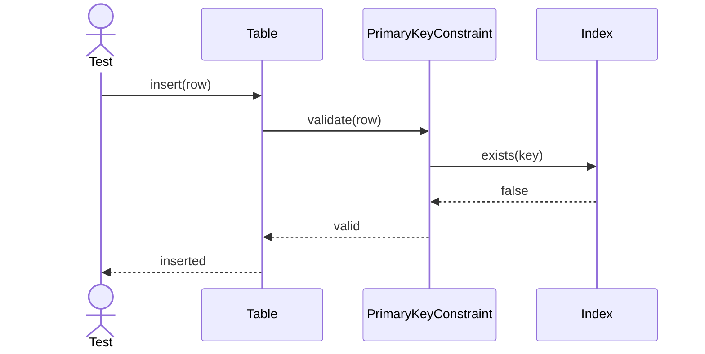

---

## 3. Validate Unique Constraint

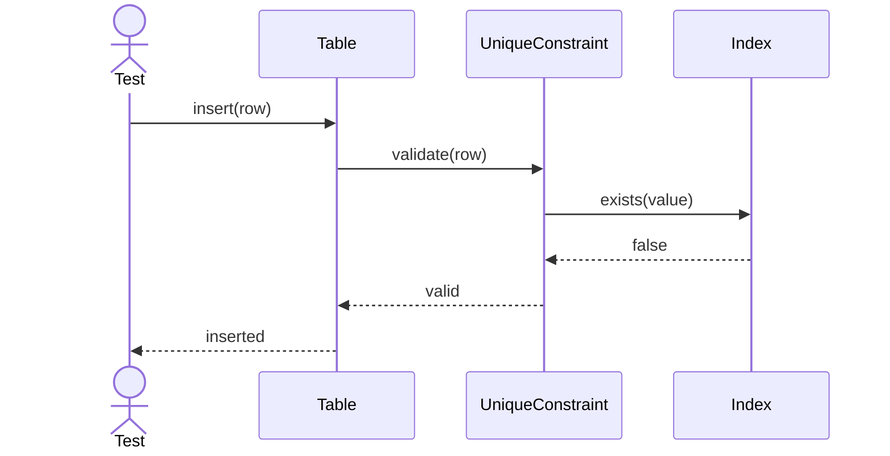

---

## 4. Validate Foreign Key

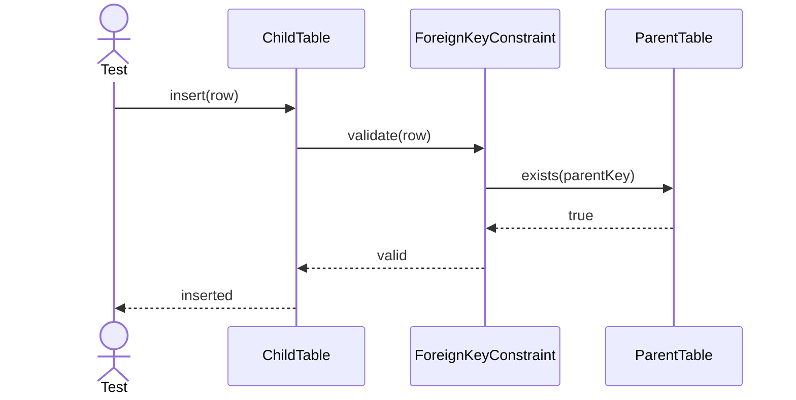

---

## 5. Validate Check Constraint

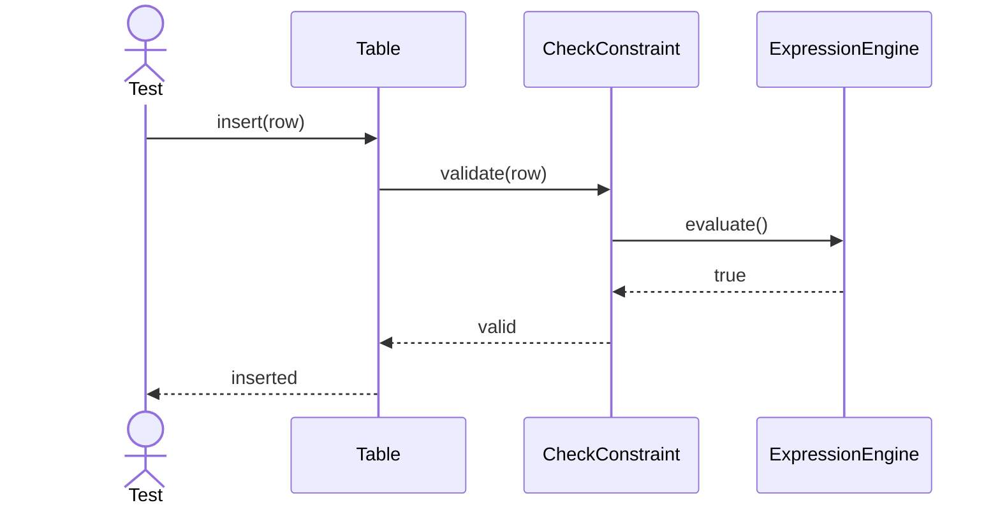

---

## 6. Cascade Delete

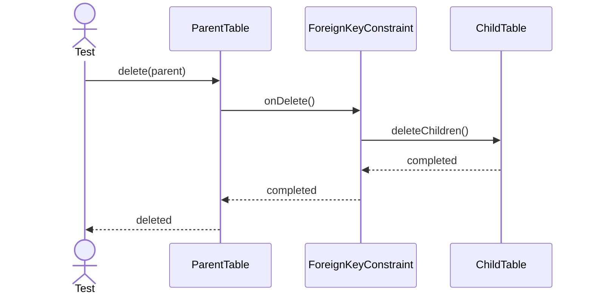

---

## 7. Cascade Update

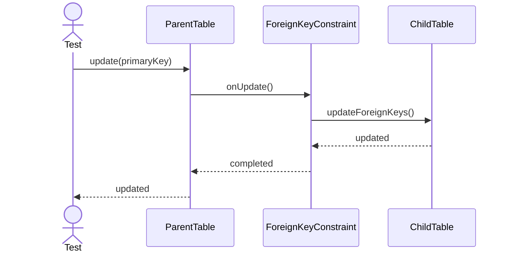

---

## 8. Restrict Delete

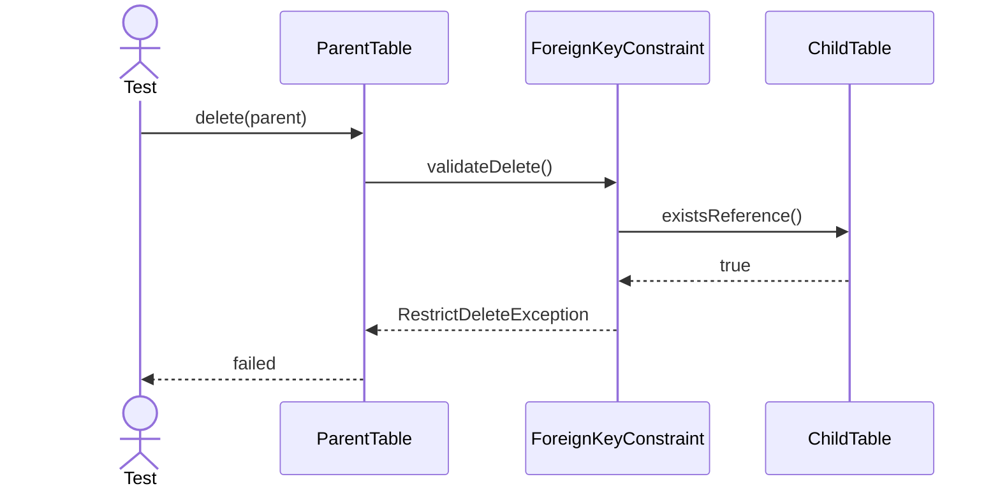

---

## 9. Enable Constraint

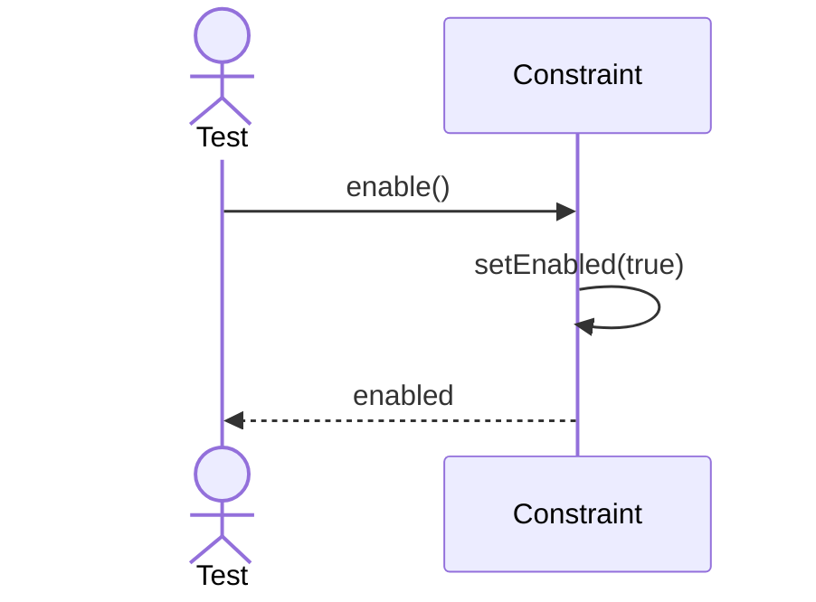

---

## 10. Disable Constraint


---

## 11. Duplicate Primary Key

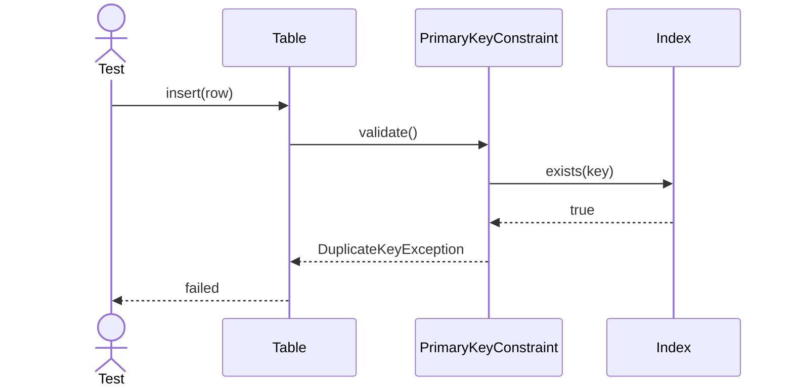

---

## 12. Foreign Key Violation

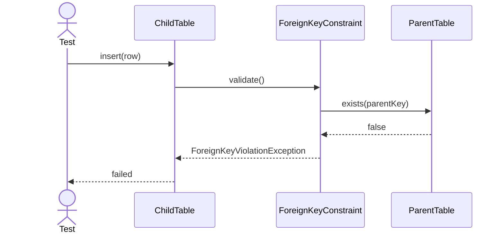

---

## 13. Check Constraint Failure

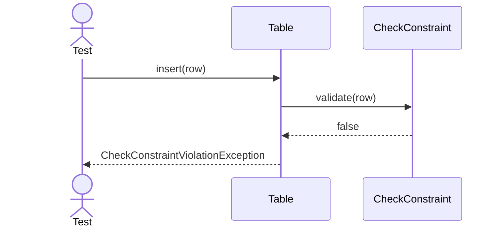

---

## 14. Toggle Constraint State

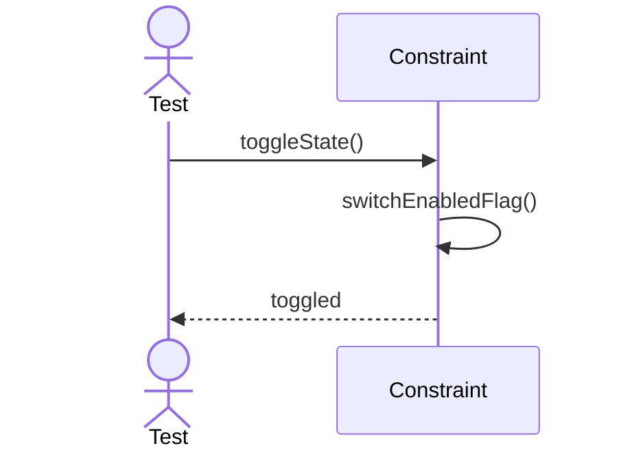

---

## 15. Validate Cascade Path

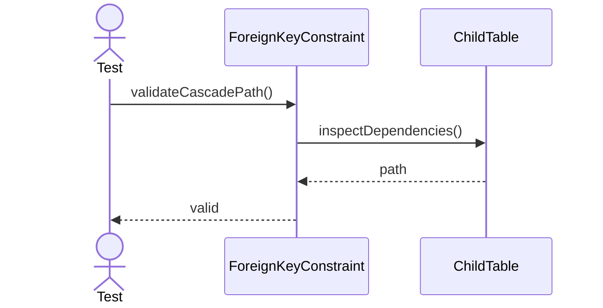

---

## 16. Validate Restrict Path

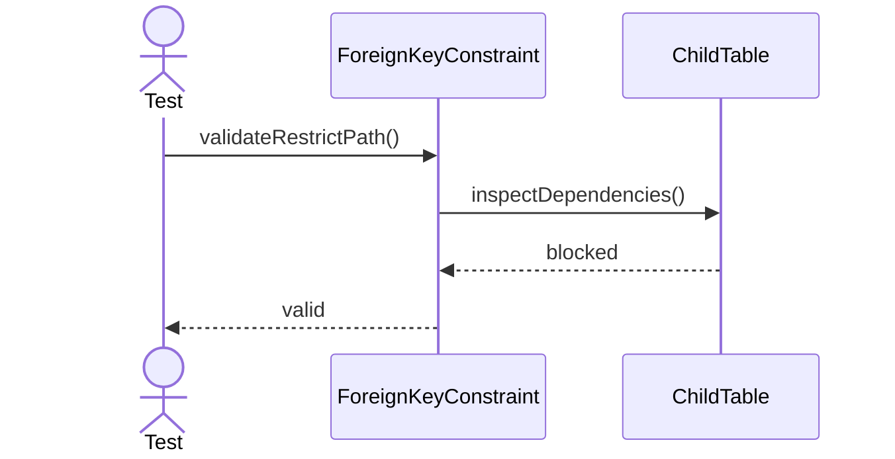

---

## 17. Export Constraint Definition

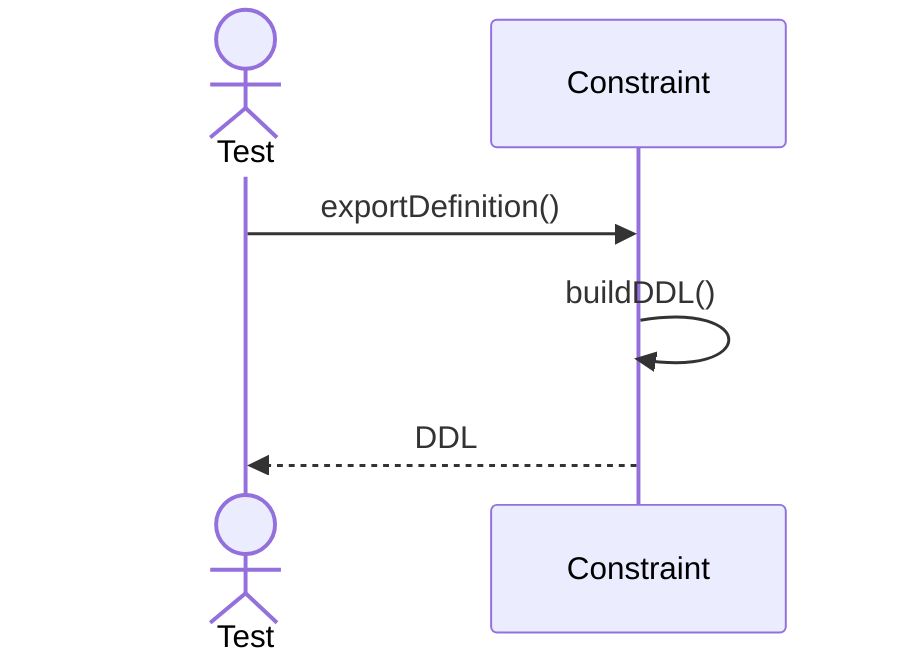

---

## 18. Refresh Constraint Metadata

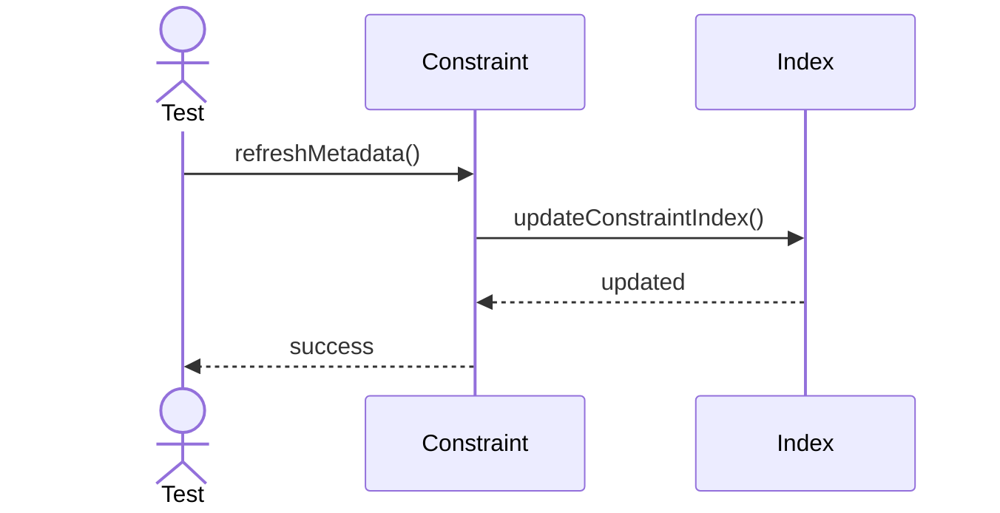

---

## 19. Attach Constraint To Table

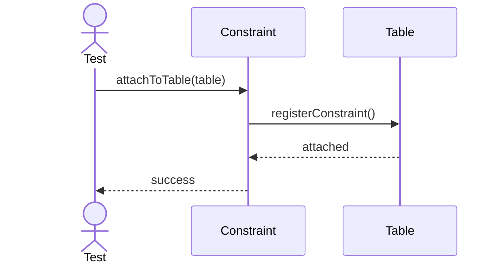

---

## 20. Detach Constraint From Table

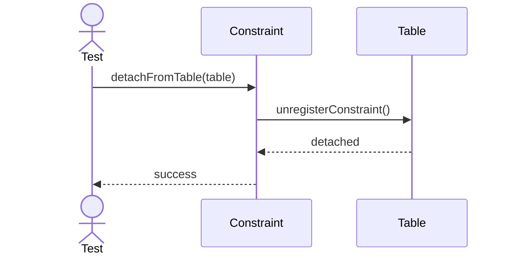

ForeignKeyConstraint-->>ChildTable: ForeignKeyViolationException

ChildTable-->>Test: failed

````

---

## 13. Invalid Check Expression

```mermaid
sequenceDiagram
actor Test
participant CheckConstraint
participant ExpressionEngine

Test->>CheckConstraint: compile(expression)

CheckConstraint->>ExpressionEngine: parse()

ExpressionEngine-->>CheckConstraint: syntax error

CheckConstraint-->>Test: InvalidConstraintException
````

---

## 14. Concurrent Insert

```mermaid
sequenceDiagram
actor Tx1
actor Tx2

participant Table
participant PrimaryKeyConstraint
participant Index

Tx1->>Table: insert(pk=100)

Tx2->>Table: insert(pk=100)

Table->>PrimaryKeyConstraint: validate()

PrimaryKeyConstraint->>Index: check()

Index-->>Tx1: success

Index-->>Tx2: DuplicateKeyException
```

---

## 15. Concurrent Delete

```mermaid
sequenceDiagram
actor Tx1
actor Tx2

participant ParentTable
participant ForeignKeyConstraint

Tx1->>ParentTable: delete()

Tx2->>ParentTable: delete()

ParentTable->>ForeignKeyConstraint: validate()

ForeignKeyConstraint-->>Tx1: success

ForeignKeyConstraint-->>Tx2: already deleted
```
