# Index Testing - Main Functional Sequences

---

## 1. Create Index

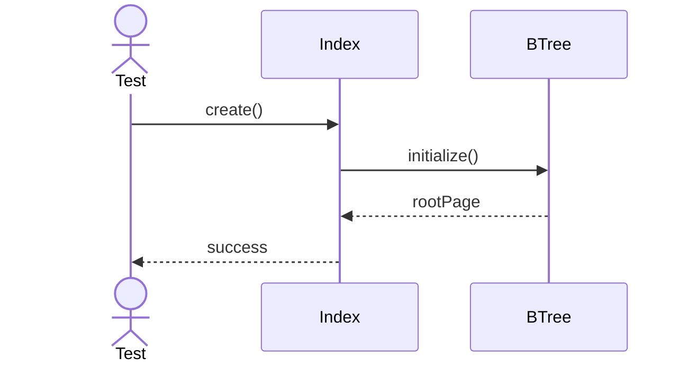
```mermaid
sequenceDiagram
actor Test
participant Index
participant BTree

Test->>Index: create()

Index->>BTree: initialize()

BTree-->>Index: rootPage

Index-->>Test: success
```

---

## 2. Search Key

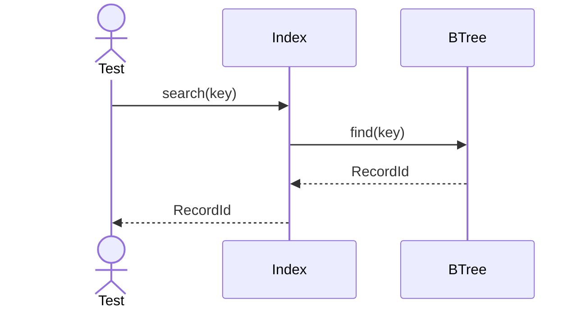
```mermaid
sequenceDiagram
actor Test
participant Index
participant BTree

Test->>Index: search(key)

Index->>BTree: find(key)

BTree-->>Index: RecordId

Index-->>Test: RecordId
```

---

## 3. Insert Key

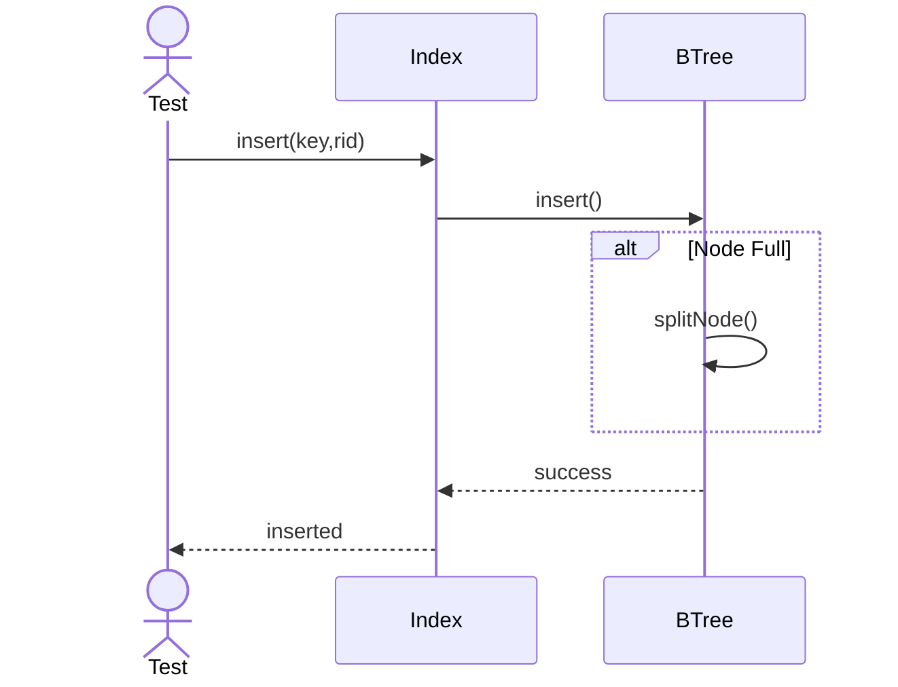
```mermaid
sequenceDiagram
actor Test
participant Index
participant BTree

Test->>Index: insert(key,rid)

Index->>BTree: insert()

alt Node Full
    BTree->>BTree: splitNode()
end

BTree-->>Index: success

Index-->>Test: inserted
```

---

## 4. Delete Key

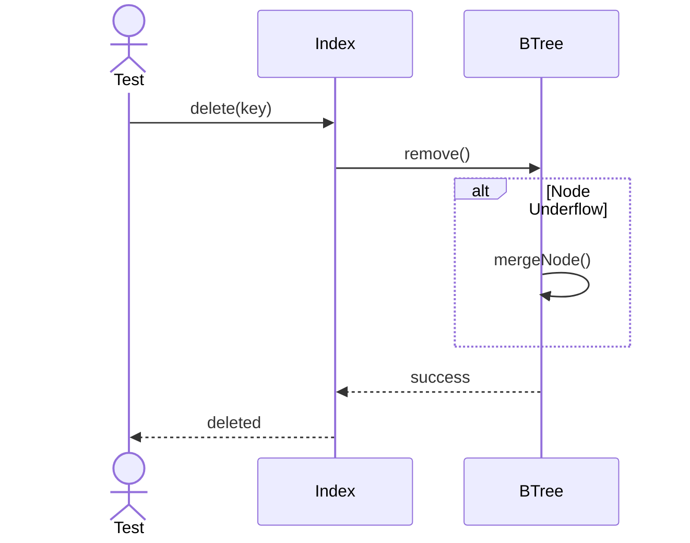
```mermaid
sequenceDiagram
actor Test
participant Index
participant BTree

Test->>Index: delete(key)

Index->>BTree: remove()

alt Node Underflow
    BTree->>BTree: mergeNode()
end

BTree-->>Index: success

Index-->>Test: deleted
```

---

## 5. Split Node

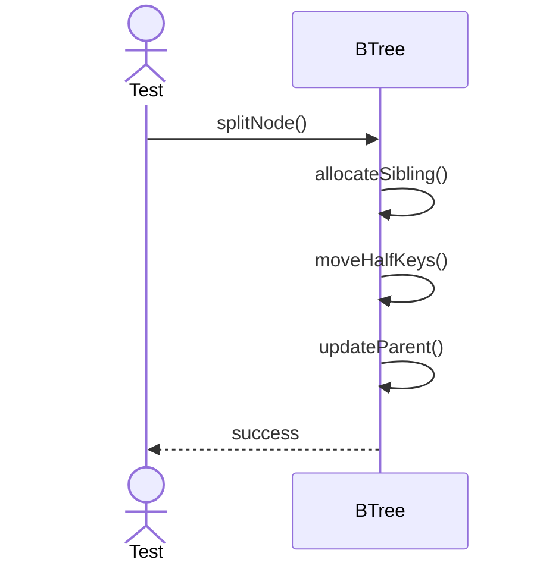
```mermaid
sequenceDiagram
actor Test
participant BTree

Test->>BTree: splitNode()

BTree->>BTree: allocateSibling()

BTree->>BTree: moveHalfKeys()

BTree->>BTree: updateParent()

BTree-->>Test: success
```

---

## 6. Merge Node

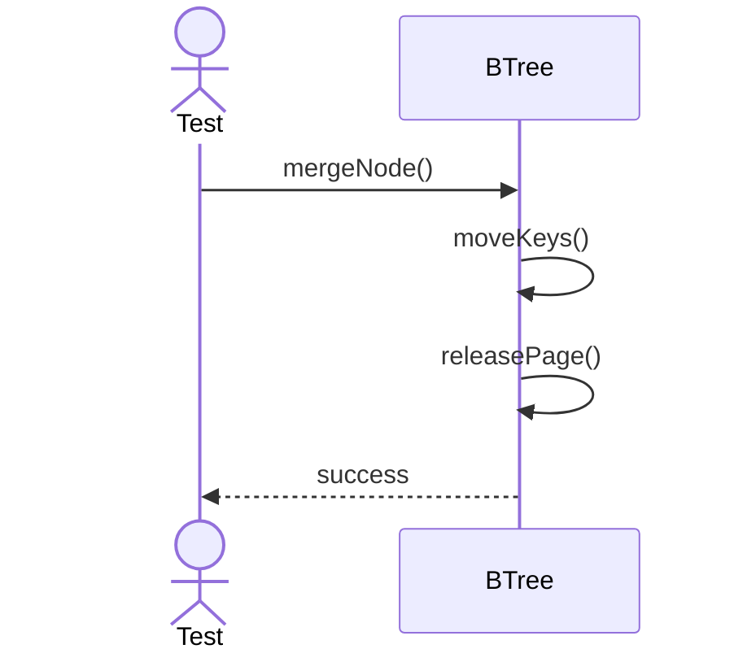
```mermaid
sequenceDiagram
actor Test
participant BTree

Test->>BTree: mergeNode()

BTree->>BTree: moveKeys()

BTree->>BTree: releasePage()

BTree-->>Test: success
```

---

## 7. Rebuild Index

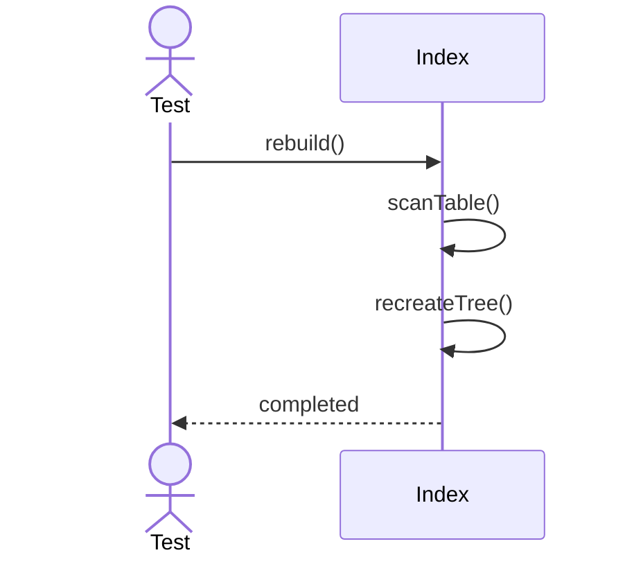
```mermaid
sequenceDiagram
actor Test
participant Index

Test->>Index: rebuild()

Index->>Index: scanTable()

Index->>Index: recreateTree()

Index-->>Test: completed
```

---

## 8. Reorganize Index

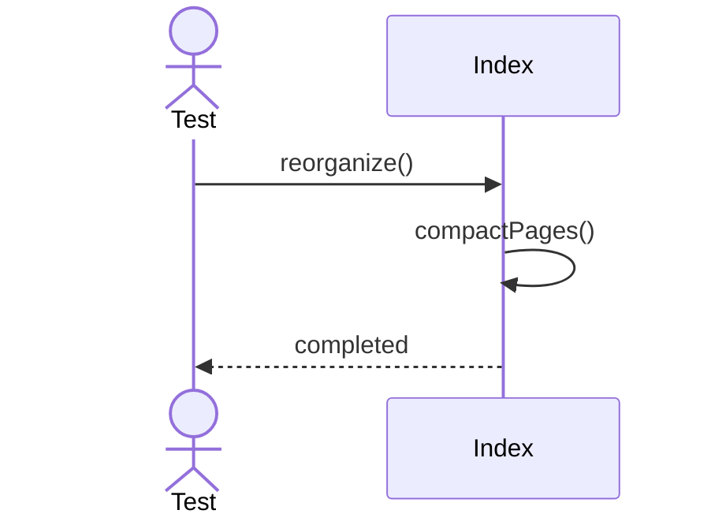
```mermaid
sequenceDiagram
actor Test
participant Index

Test->>Index: reorganize()

Index->>Index: compactPages()

Index-->>Test: completed
```

---

## 9. Estimate Selectivity

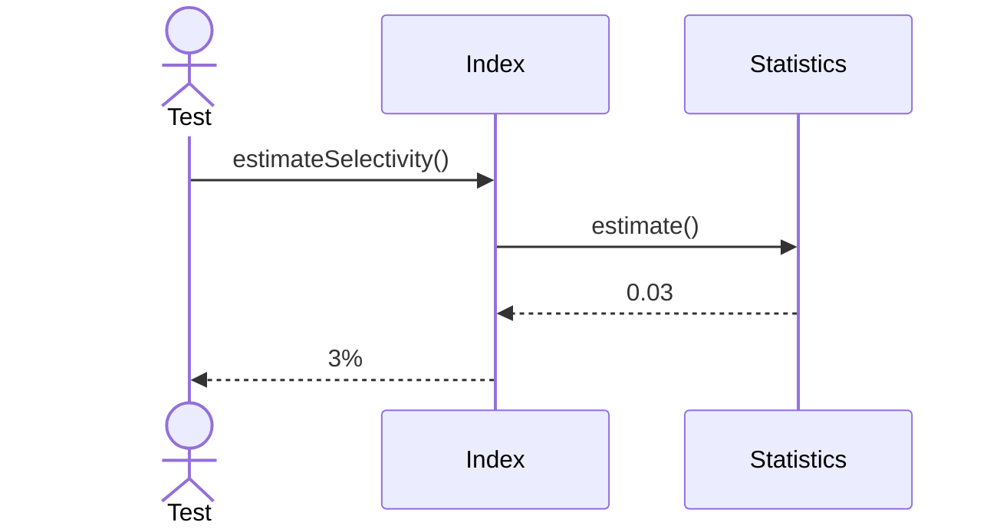
```mermaid
sequenceDiagram
actor Test
participant Index
participant Statistics

Test->>Index: estimateSelectivity()

Index->>Statistics: estimate()

Statistics-->>Index: 0.03

Index-->>Test: 3%
```

---

## 10. Update Statistics

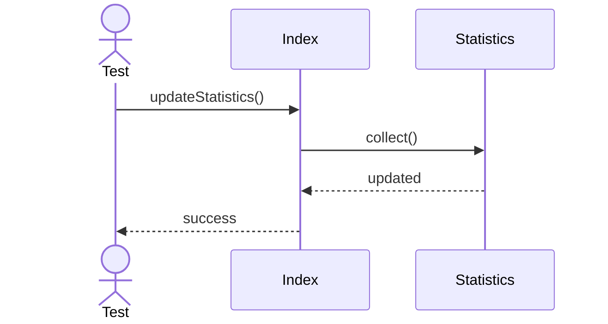
```mermaid
sequenceDiagram
actor Test
participant Index
participant Statistics

Test->>Index: updateStatistics()

Index->>Statistics: collect()

Statistics-->>Index: updated

Index-->>Test: success
```

---

## 11. Duplicate Key Validation

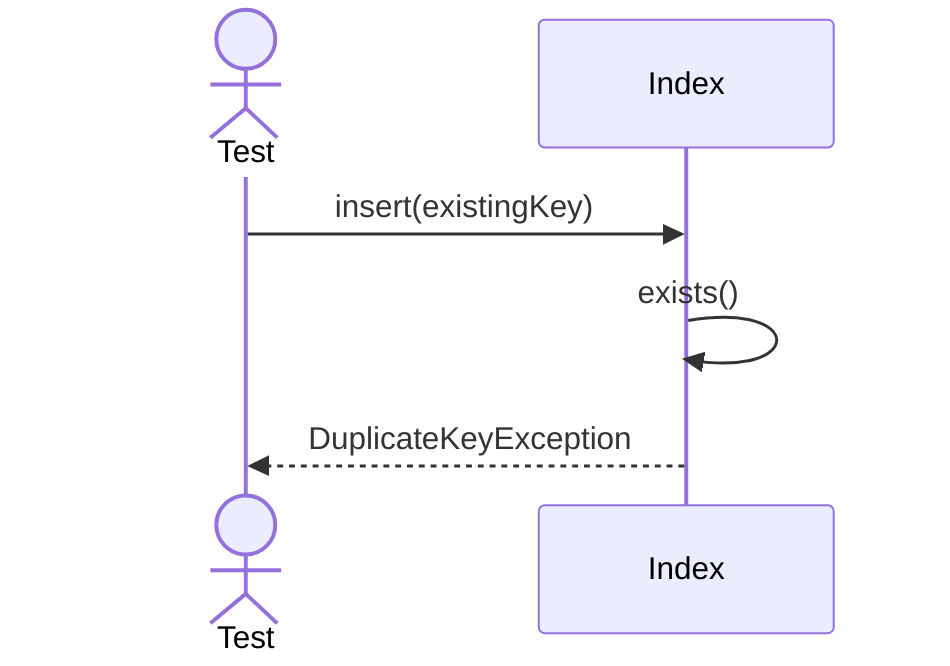
```mermaid
sequenceDiagram
actor Test
participant Index

Test->>Index: insert(existingKey)

Index->>Index: exists()

Index-->>Test: DuplicateKeyException
```

---

## 12. Corrupted Index Recovery

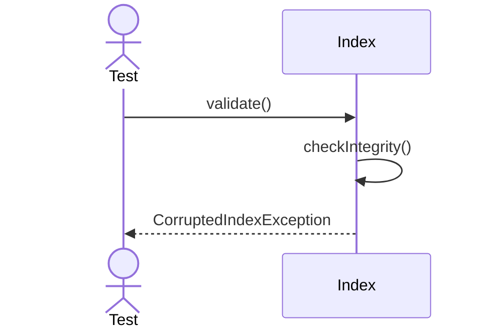
```mermaid
sequenceDiagram
actor Test
participant Index

Test->>Index: validate()

Index->>Index: checkIntegrity()

Index-->>Test: CorruptedIndexException
```

---

## 13. Concurrent Insert

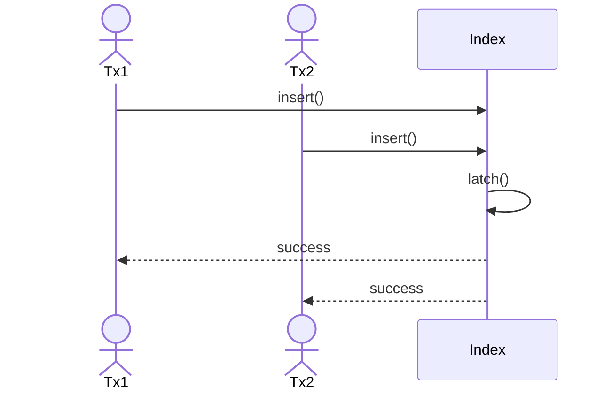
```mermaid
sequenceDiagram
actor Tx1
actor Tx2

participant Index

Tx1->>Index: insert()

Tx2->>Index: insert()

Index->>Index: latch()

Index-->>Tx1: success

Index-->>Tx2: success
```

---

## 14. Concurrent Search

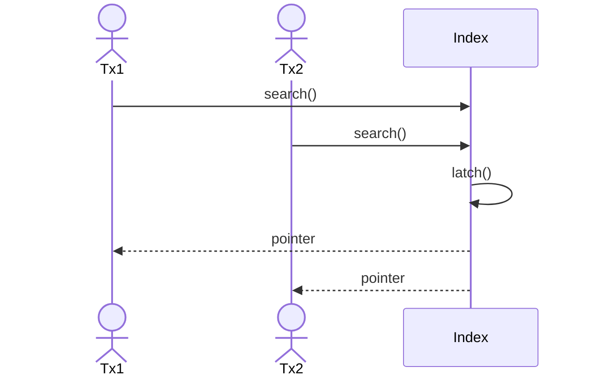
```mermaid
sequenceDiagram
actor Tx1
actor Tx2

participant Index

Tx1->>Index: search()

Tx2->>Index: search()

Index->>Index: latch()

Index-->>Tx1: pointer

Index-->>Tx2: pointer
```

---

## 15. Rebuild From Table

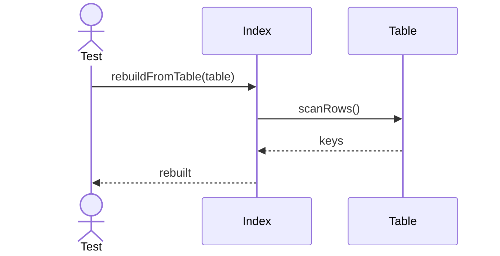
```mermaid
sequenceDiagram
actor Test
participant Index
participant Table

Test->>Index: rebuildFromTable(table)
Index->>Table: scanRows()
Table-->>Index: keys
Index-->>Test: rebuilt
```

---

## 16. Reorganize Pages

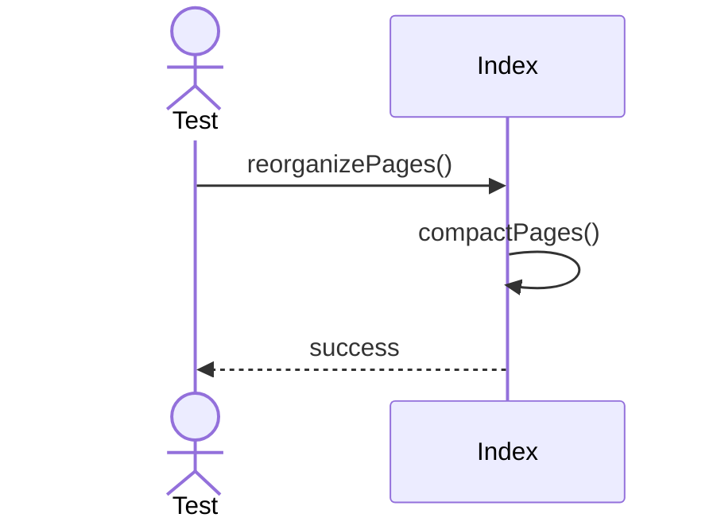
```mermaid
sequenceDiagram
actor Test
participant Index

Test->>Index: reorganizePages()
Index->>Index: compactPages()
Index-->>Test: success
```

---

## 17. Scan Prefix

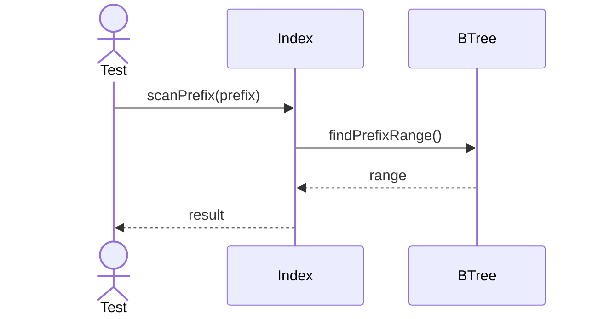
```mermaid
sequenceDiagram
actor Test
participant Index
participant BTree

Test->>Index: scanPrefix(prefix)
Index->>BTree: findPrefixRange()
BTree-->>Index: range
Index-->>Test: result
```

---

## 18. Verify Tree Integrity


```mermaid
sequenceDiagram
actor Test
participant Index

Test->>Index: verifyIntegrity()
Index->>Index: checkNodeLinks()
Index-->>Test: valid
```

---

## 19. Export Index Stats

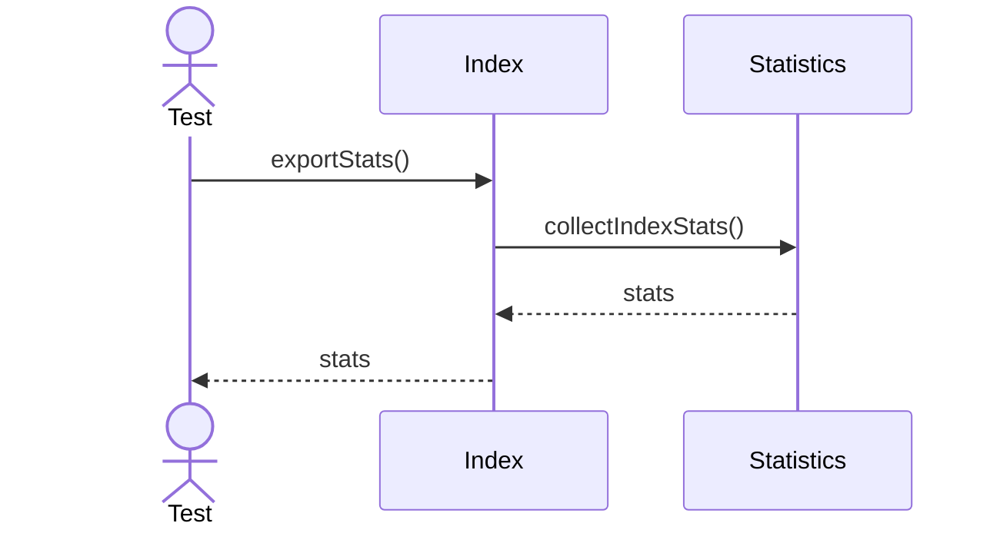
```mermaid
sequenceDiagram
actor Test
participant Index
participant Statistics

Test->>Index: exportStats()
Index->>Statistics: collectIndexStats()
Statistics-->>Index: stats
Index-->>Test: stats
```

---

## 20. Freeze Index

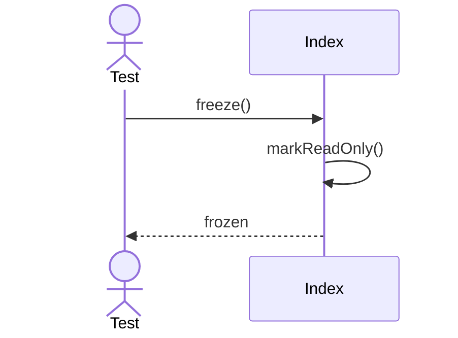
```mermaid
sequenceDiagram
actor Test
participant Index

Test->>Index: freeze()
Index->>Index: markReadOnly()
Index-->>Test: frozen
```

Tx1->>Index: search()

Tx2->>Index: search()

Index-->>Tx1: RecordId

Index-->>Tx2: RecordId

```

```
