# Index Testing — Important Unit Test Sequence Diagrams

## 1. Constructor_ShouldCreateIndex

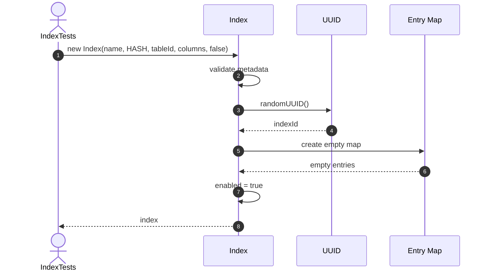

## 2. Constructor_ShouldGenerateIndexId

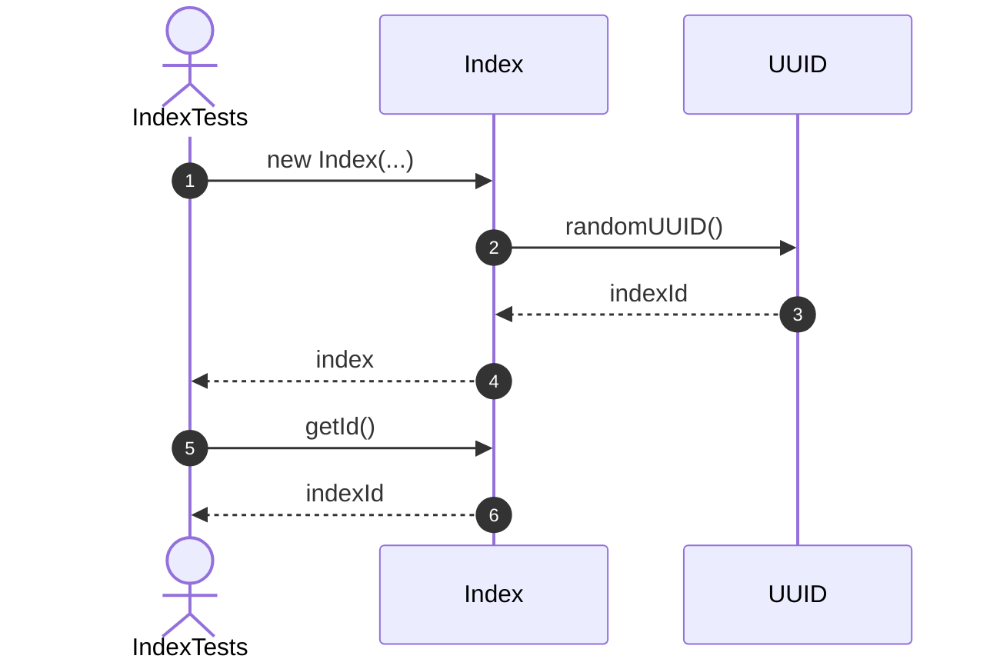

## 3. Rename_ShouldChangeIndexName

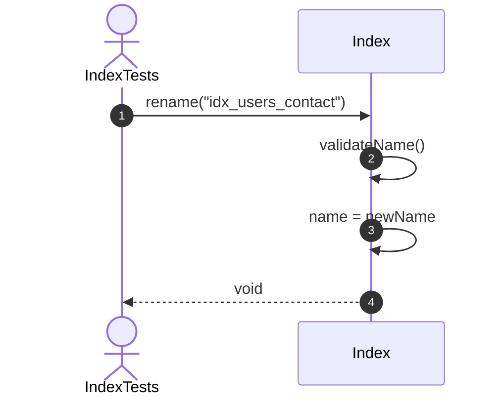

## 4. Disable_ShouldDisableIndex

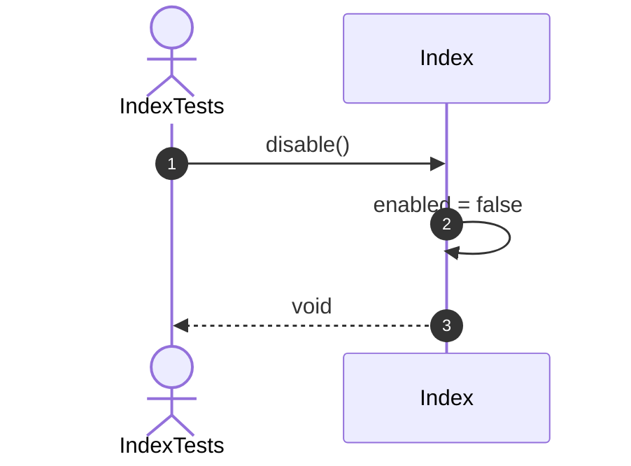

## 5. Insert_ShouldStoreKeyAndRowId

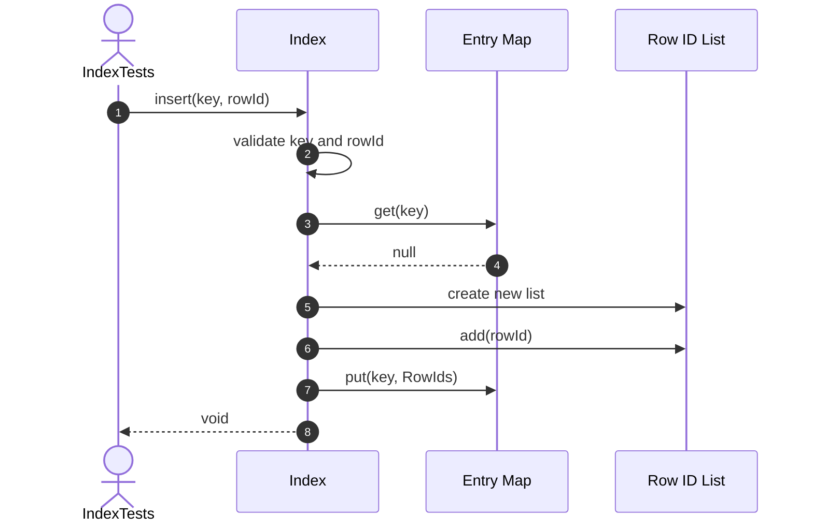

## 6. Insert_ShouldAllowMultipleRowsForNonUniqueIndex

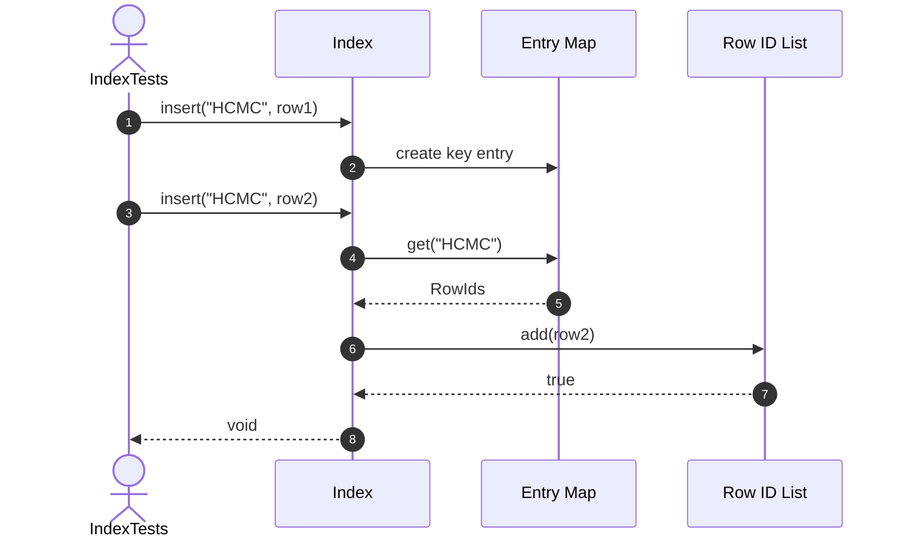

## 7. UniqueIndex_ShouldRejectDuplicateKey

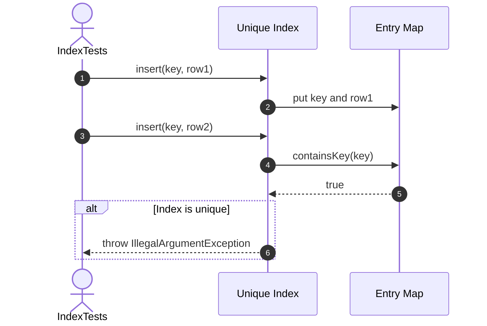

## 8. Search_ShouldReturnMatchingRows

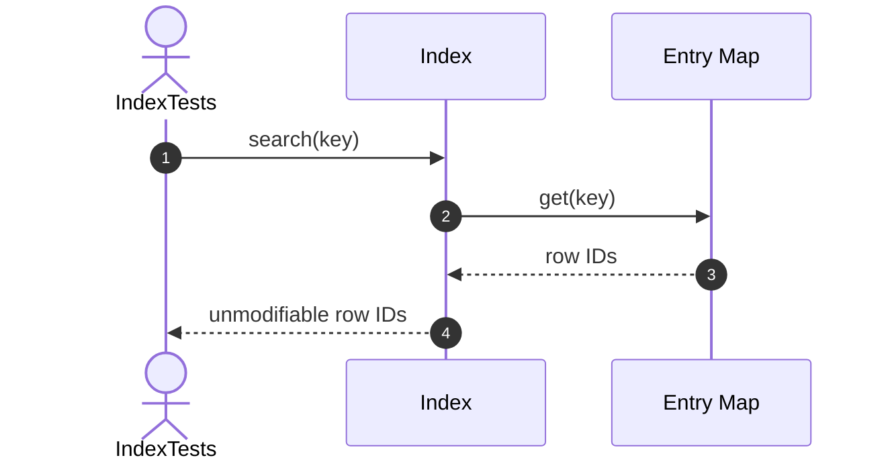

## 9. Search_ShouldReturnEmptyForMissingKey

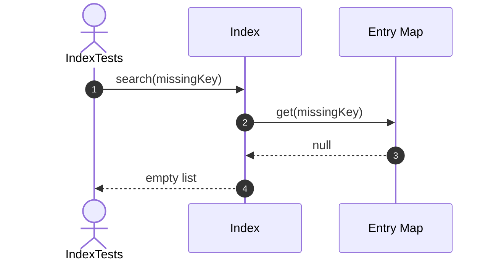

## 10. Delete_ShouldRemoveSpecificRowId

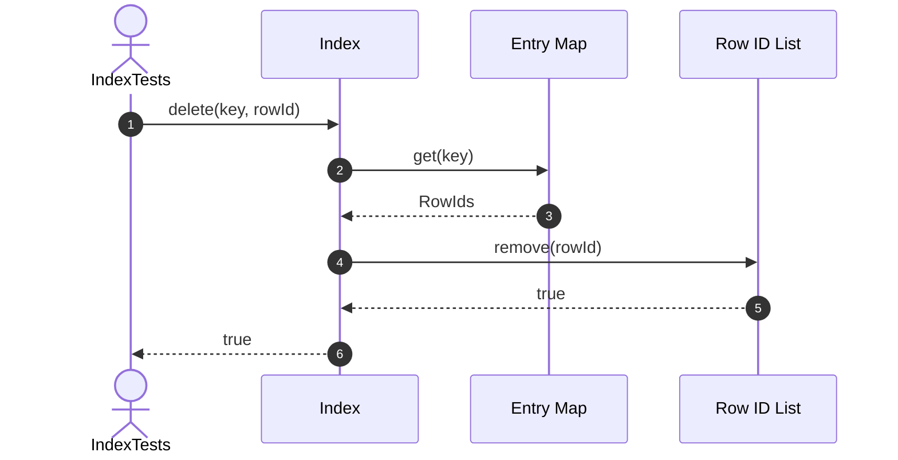

## 11. Delete_ShouldRemoveEmptyKey

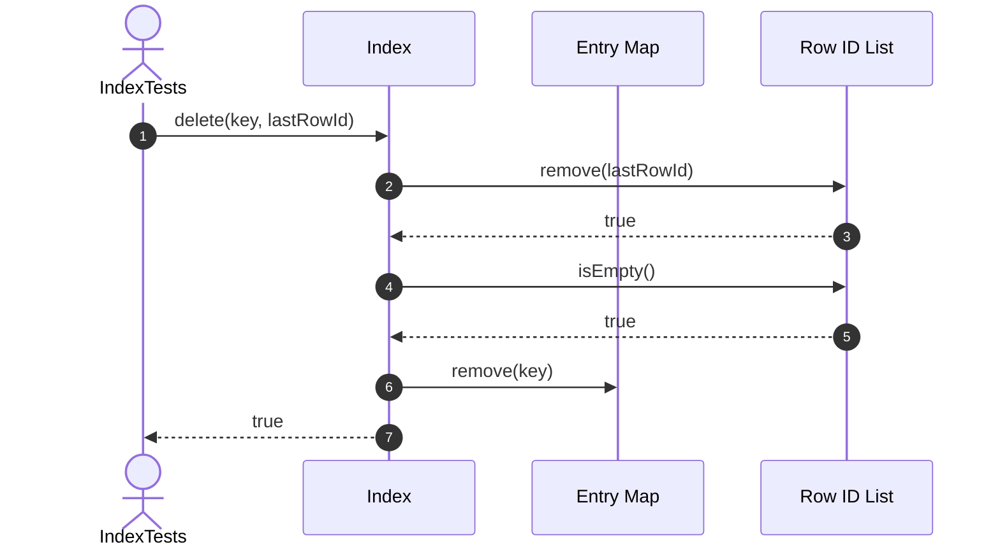

## 12. DeleteKey_ShouldRemoveEntireKey

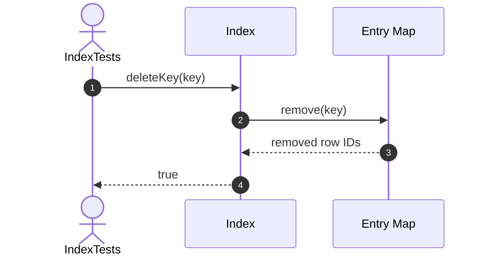

## 13. Clear_ShouldRemoveAllEntries

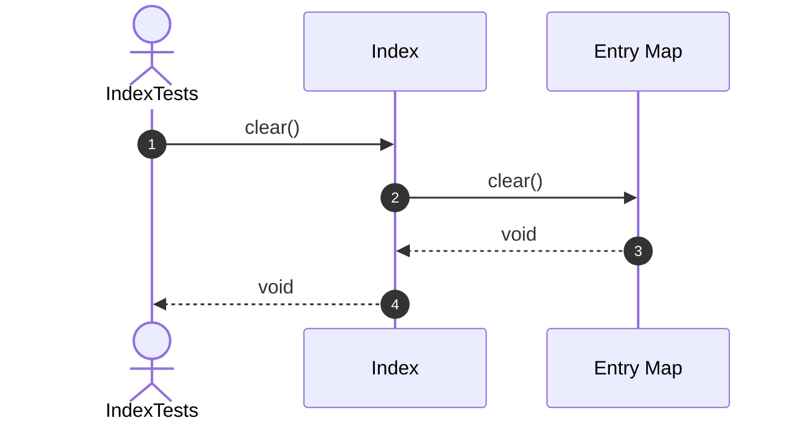

## 14. GetEntries_ShouldReturnUnmodifiableMap

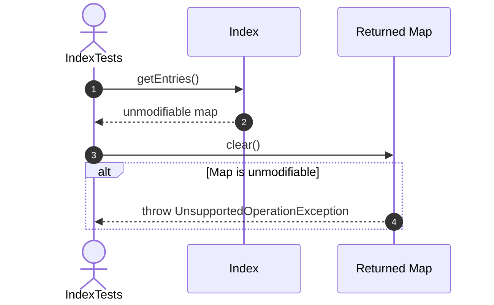

## 15. IsValidDefinition_ShouldValidateMetadata

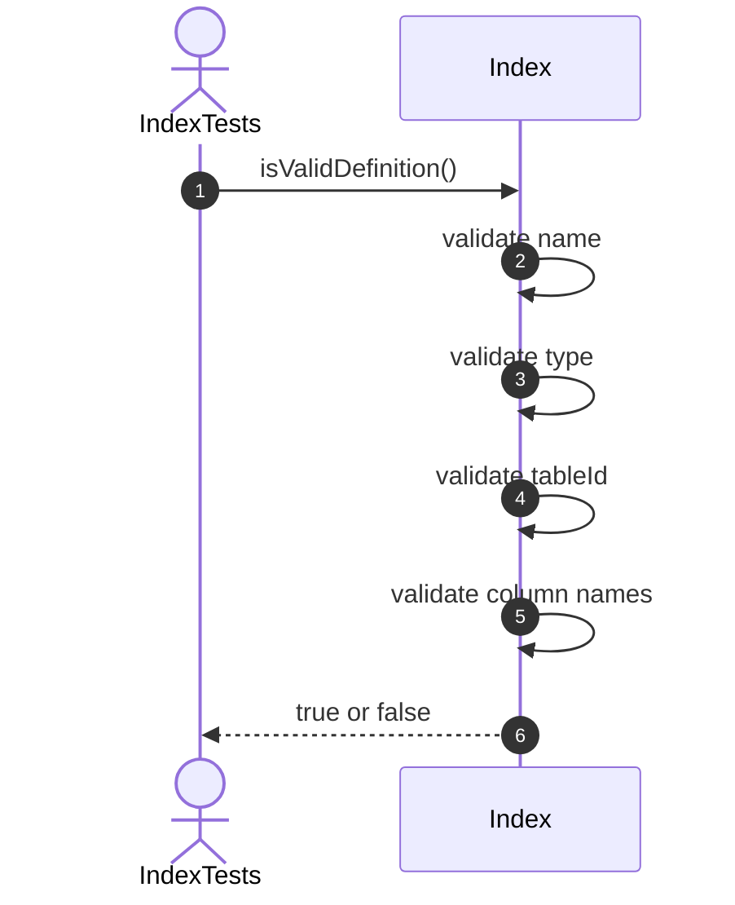

## Recommended order

1. Constructor and metadata
2. Enable and disable
3. Insert
4. Search
5. Delete
6. Clear and counts
7. Definition validation