# Row Testing - Main Functional Sequences

---

## 1. Create Row

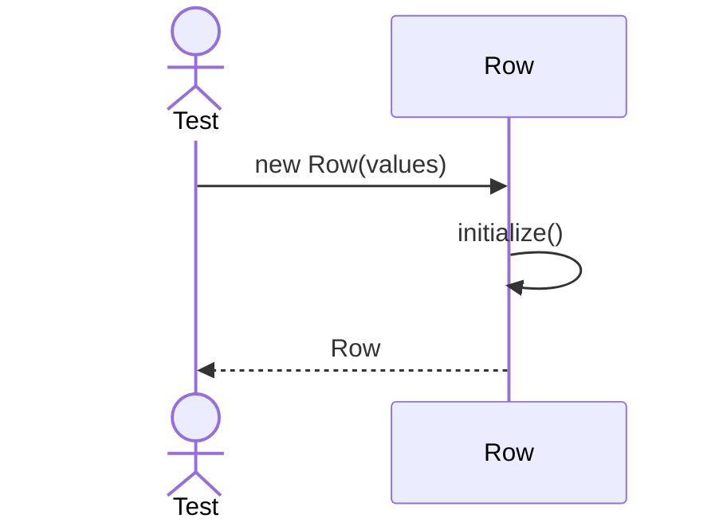
```mermaid
sequenceDiagram
actor Test
participant Row

Test->>Row: new Row(values)

Row->>Row: initialize()

Row-->>Test: Row
```

---

## 2. Update Row

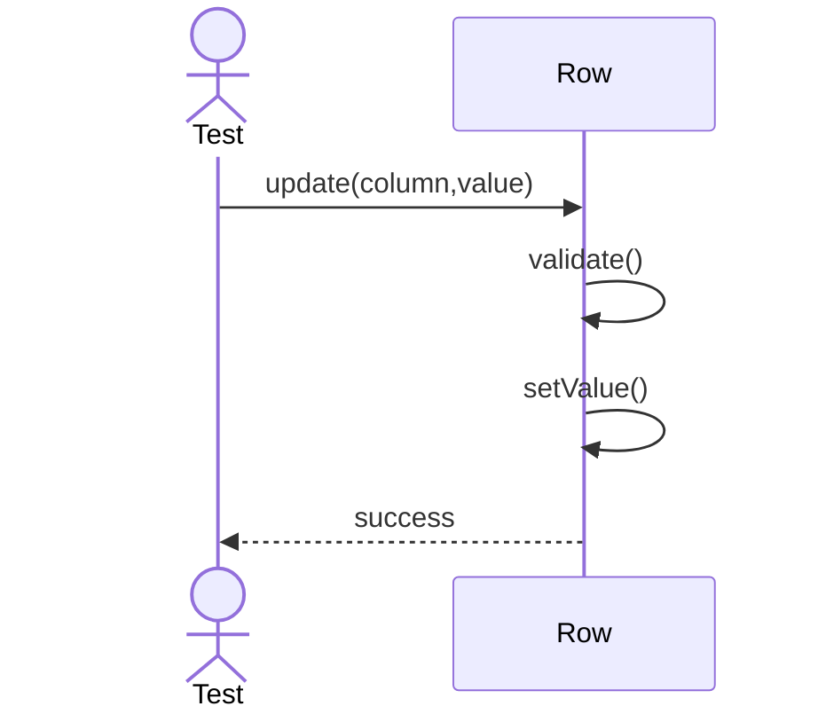
```mermaid
sequenceDiagram
actor Test
participant Row

Test->>Row: update(column,value)

Row->>Row: validate()

Row->>Row: setValue()

Row-->>Test: success
```

---

## 3. Delete Row


```mermaid
sequenceDiagram
actor Test
participant Row

Test->>Row: markDeleted()

Row->>Row: setDeleted(true)

Row-->>Test: deleted
```

---

## 4. Clone Version (MVCC)

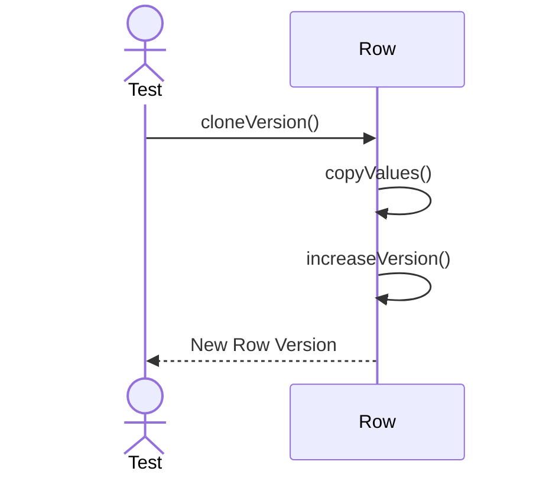
```mermaid
sequenceDiagram
actor Test
participant Row

Test->>Row: cloneVersion()

Row->>Row: copyValues()

Row->>Row: increaseVersion()

Row-->>Test: New Row Version
```

---

## 5. Restore Previous Version

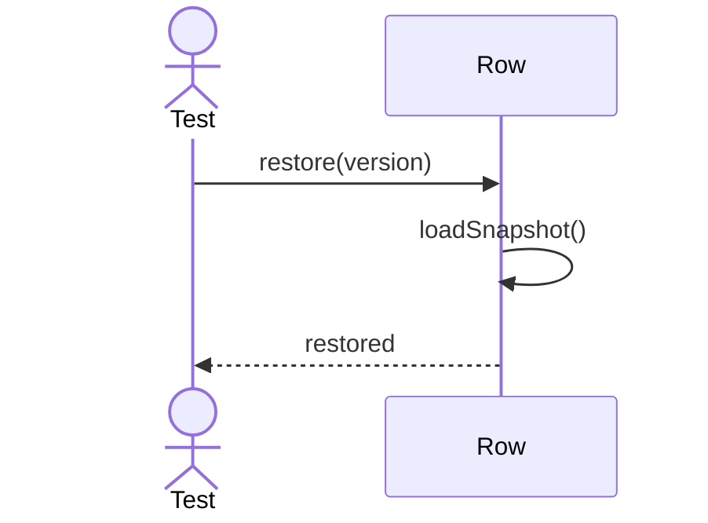
```mermaid
sequenceDiagram
actor Test
participant Row

Test->>Row: restore(version)

Row->>Row: loadSnapshot()

Row-->>Test: restored
```

---

## 6. Compare Rows

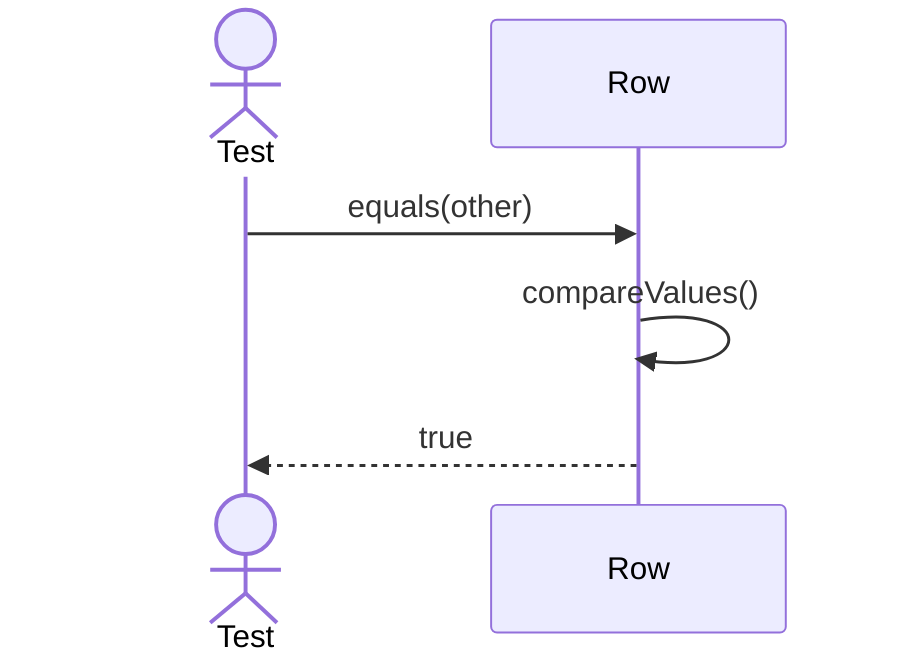
```mermaid
sequenceDiagram
actor Test
participant Row

Test->>Row: equals(other)

Row->>Row: compareValues()

Row-->>Test: true
```

---

## 7. Serialize Row

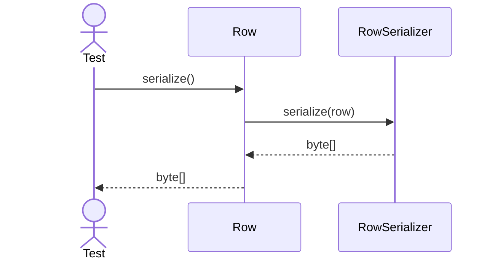
```mermaid
sequenceDiagram
actor Test
participant Row
participant RowSerializer

Test->>Row: serialize()

Row->>RowSerializer: serialize(row)

RowSerializer-->>Row: byte[]

Row-->>Test: byte[]
```

---

## 8. Deserialize Row

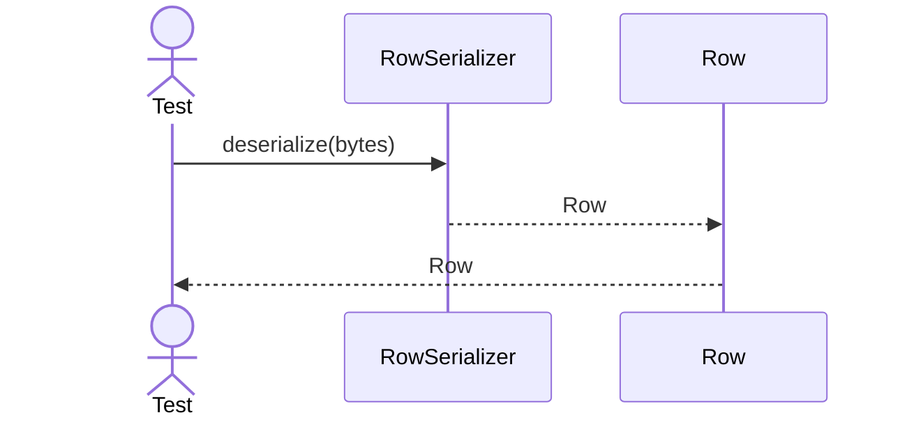
```mermaid
sequenceDiagram
actor Test
participant RowSerializer
participant Row

Test->>RowSerializer: deserialize(bytes)

RowSerializer-->>Row: Row

Row-->>Test: Row
```

---

## 9. Calculate Row Size

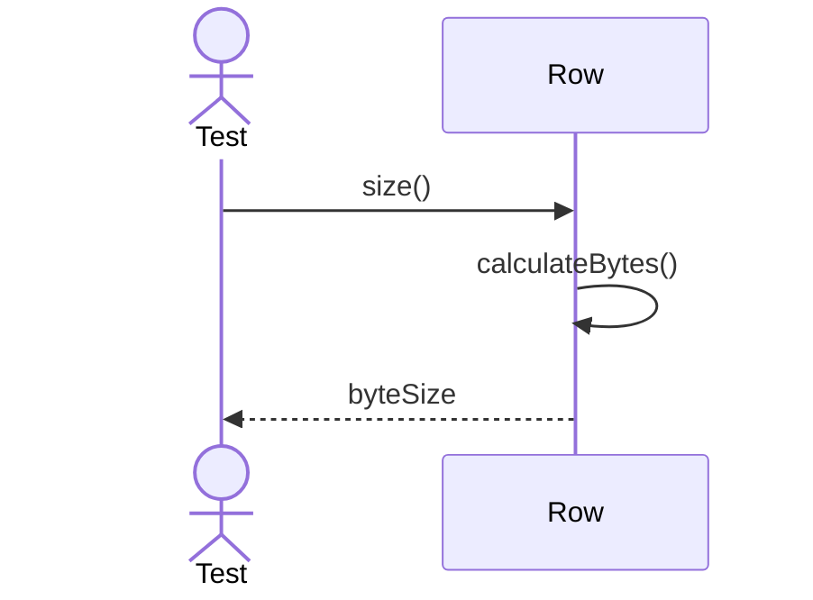
```mermaid
sequenceDiagram
actor Test
participant Row

Test->>Row: size()

Row->>Row: calculateBytes()

Row-->>Test: byteSize
```

---

## 10. Validate Row Version

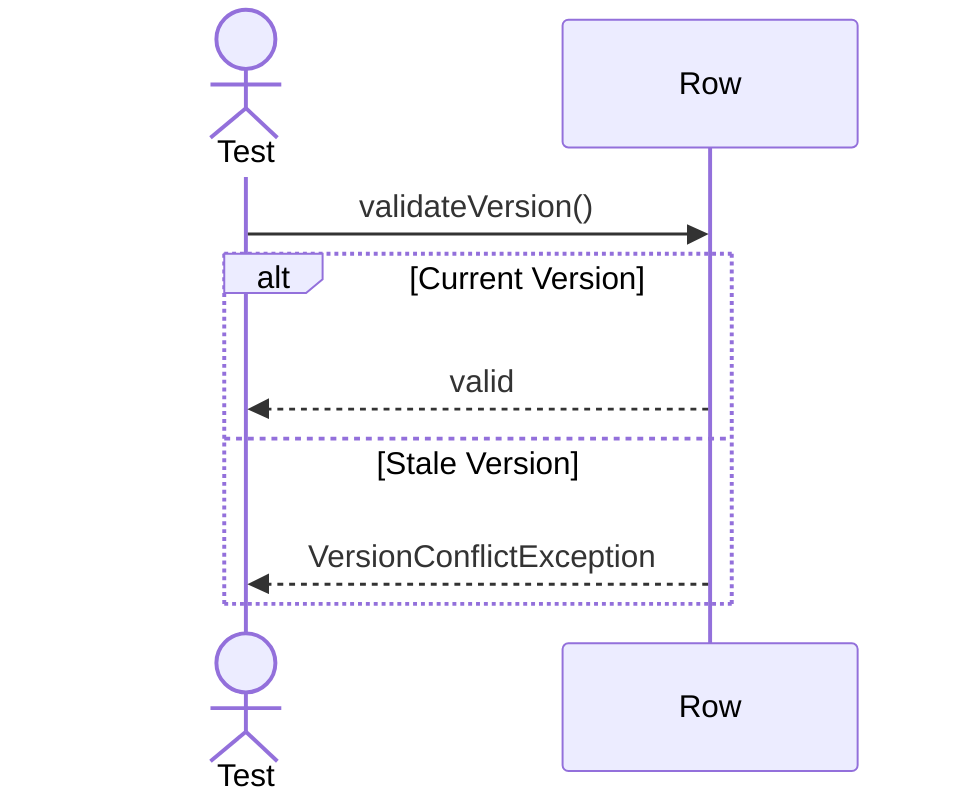
```mermaid
sequenceDiagram
actor Test
participant Row

Test->>Row: validateVersion()

alt Current Version
    Row-->>Test: valid
else Stale Version
    Row-->>Test: VersionConflictException
end
```

---

## 11. Validate Row Length

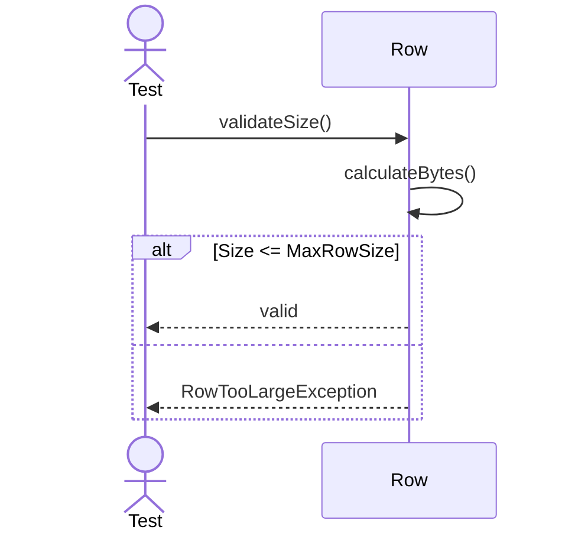
```mermaid
sequenceDiagram
actor Test
participant Row

Test->>Row: validateSize()

Row->>Row: calculateBytes()

alt Size <= MaxRowSize
    Row-->>Test: valid
else
    Row-->>Test: RowTooLargeException
end
```

---

## 12. Validate Row State

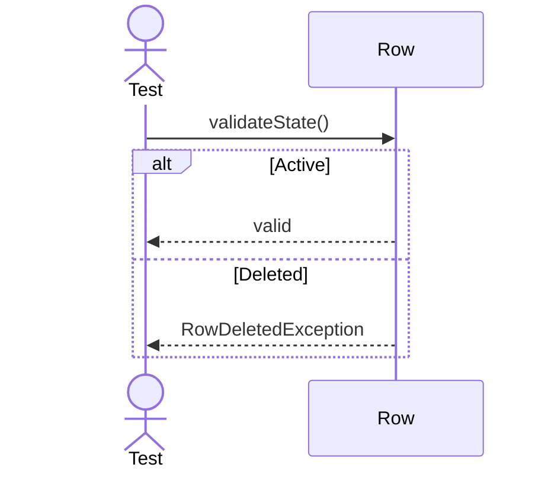
```mermaid
sequenceDiagram
actor Test
participant Row

Test->>Row: validateState()

alt Active
    Row-->>Test: valid
else Deleted
    Row-->>Test: RowDeletedException
end
```

---

## 13. Serialization Failure

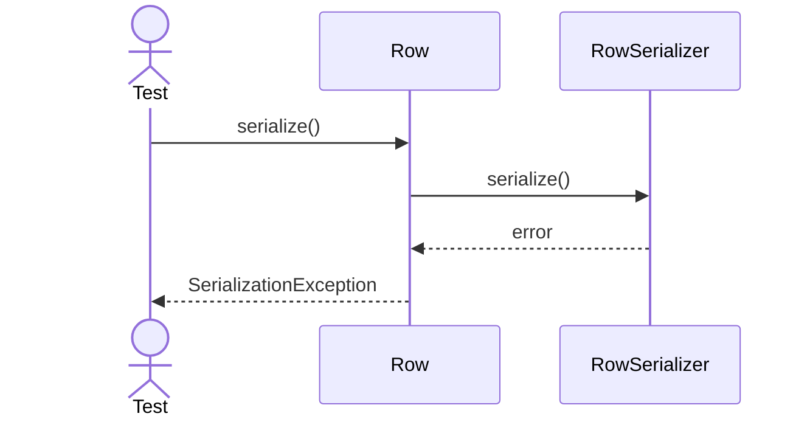
```mermaid
sequenceDiagram
actor Test
participant Row
participant RowSerializer

Test->>Row: serialize()

Row->>RowSerializer: serialize()

RowSerializer-->>Row: error

Row-->>Test: SerializationException
```

---

## 14. Concurrent Update (MVCC)

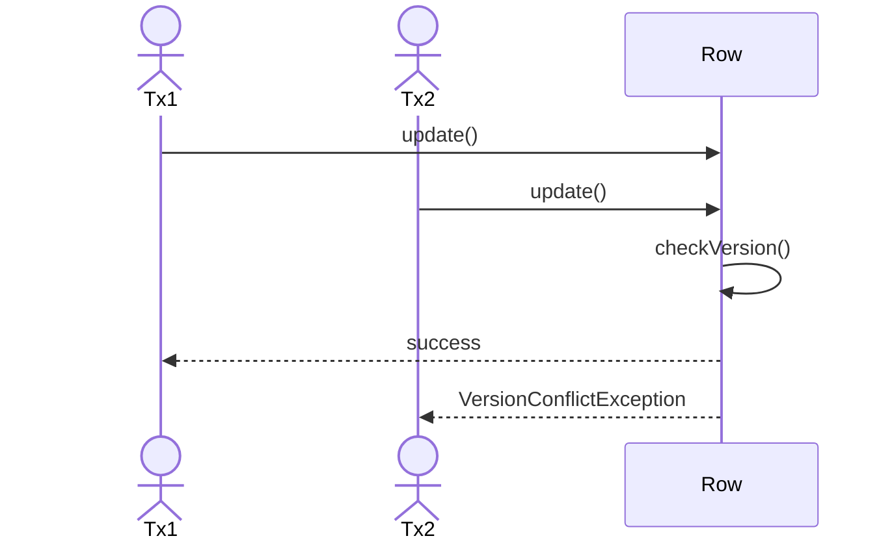
```mermaid
sequenceDiagram
actor Tx1
actor Tx2

participant Row

Tx1->>Row: update()

Tx2->>Row: update()

Row->>Row: checkVersion()

Row-->>Tx1: success

Row-->>Tx2: VersionConflictException
```

---

## 15. Concurrent Delete

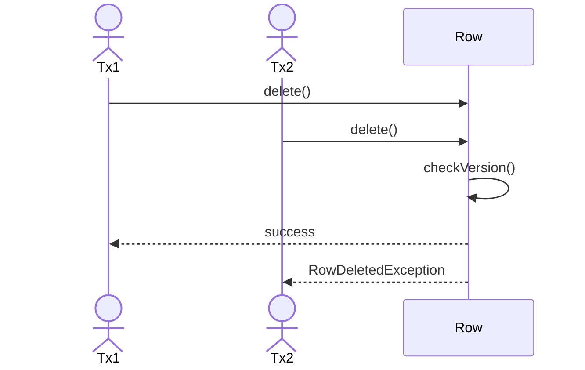
```mermaid
sequenceDiagram
actor Tx1
actor Tx2

participant Row

Tx1->>Row: delete()

Tx2->>Row: delete()

Row->>Row: checkVersion()

Row-->>Tx1: success

Row-->>Tx2: RowDeletedException
```

---

## 16. Restore Snapshot

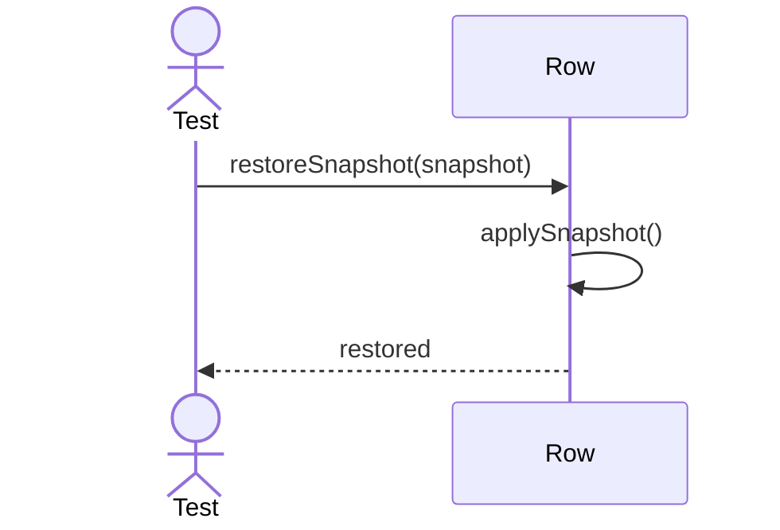
```mermaid
sequenceDiagram
actor Test
participant Row

Test->>Row: restoreSnapshot(snapshot)
Row->>Row: applySnapshot()
Row-->>Test: restored
```

---

## 17. Merge Version Chains


```mermaid
sequenceDiagram
actor Test
participant Row

Test->>Row: mergeVersions()
Row->>Row: compactVersions()
Row-->>Test: merged
```

---

## 18. Export History

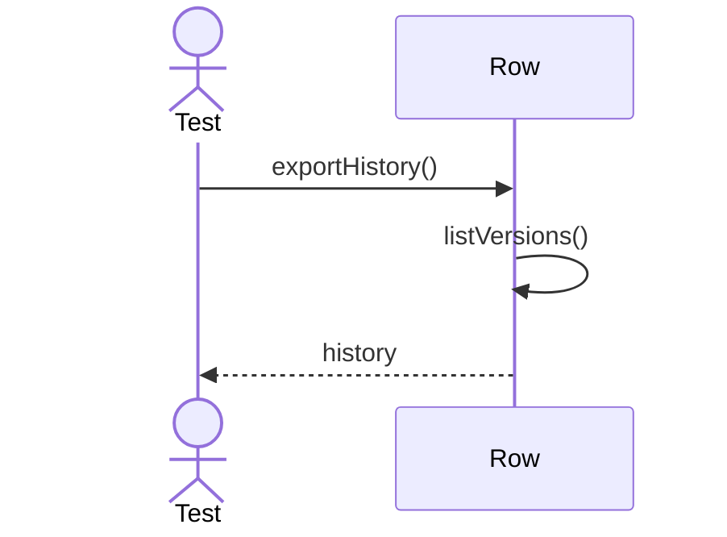
```mermaid
sequenceDiagram
actor Test
participant Row

Test->>Row: exportHistory()
Row->>Row: listVersions()
Row-->>Test: history
```

---

## 19. Clone Metadata

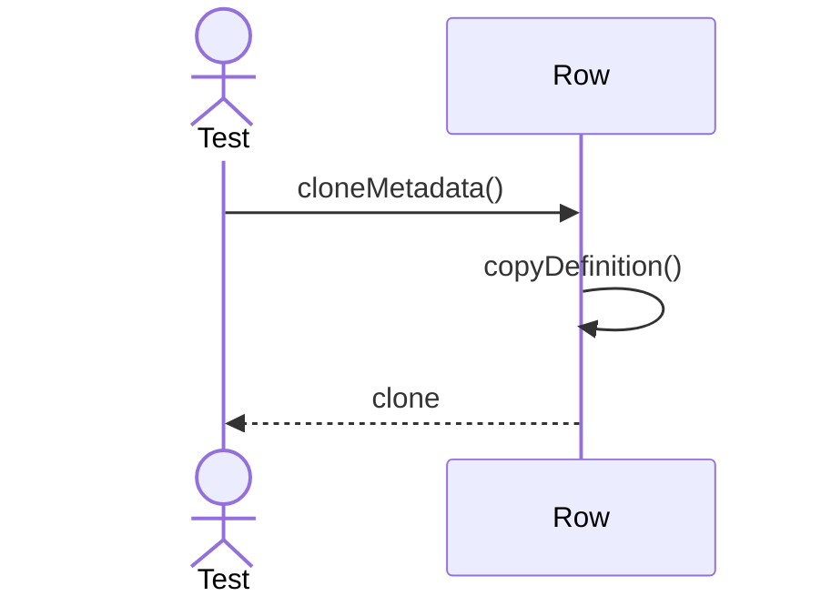
```mermaid
sequenceDiagram
actor Test
participant Row

Test->>Row: cloneMetadata()
Row->>Row: copyDefinition()
Row-->>Test: clone
```

---

## 20. Validate Row Integrity


```mermaid
sequenceDiagram
actor Test
participant Row

Test->>Row: validateIntegrity()
Row->>Row: inspectColumns()
Row-->>Test: valid
```

participant Row

Tx1->>Row: delete()

Tx2->>Row: delete()

Row->>Row: acquireWriteState()

Row-->>Tx1: deleted

Row-->>Tx2: AlreadyDeletedException

```

```
