# Schema Testing — Important Unit Test Sequence Diagrams

## 1. Constructor_ShouldCreateSchema

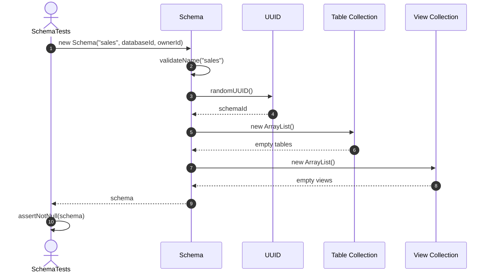
```mermaid
sequenceDiagram
    autonumber
    actor Test as SchemaTests
    participant Schema as Schema
    participant UUID as UUID
    participant Tables as Table Collection
    participant Views as View Collection

    Test->>Schema: new Schema("sales", databaseId, ownerId)
    Schema->>Schema: validateName("sales")
    Schema->>UUID: randomUUID()
    UUID-->>Schema: schemaId
    Schema->>Tables: new ArrayList()
    Tables-->>Schema: empty tables
    Schema->>Views: new ArrayList()
    Views-->>Schema: empty views
    Schema-->>Test: schema

    Test->>Test: assertNotNull(schema)
```

## 2. Constructor_ShouldGenerateSchemaId

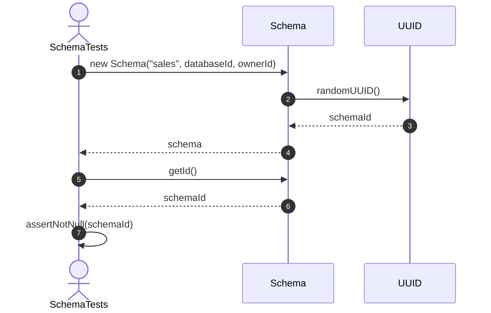
```mermaid
sequenceDiagram
    autonumber
    actor Test as SchemaTests
    participant Schema as Schema
    participant UUID as UUID

    Test->>Schema: new Schema("sales", databaseId, ownerId)
    Schema->>UUID: randomUUID()
    UUID-->>Schema: schemaId
    Schema-->>Test: schema

    Test->>Schema: getId()
    Schema-->>Test: schemaId
    Test->>Test: assertNotNull(schemaId)
```

## 3. Constructor_ShouldInitializeEmptyCollections

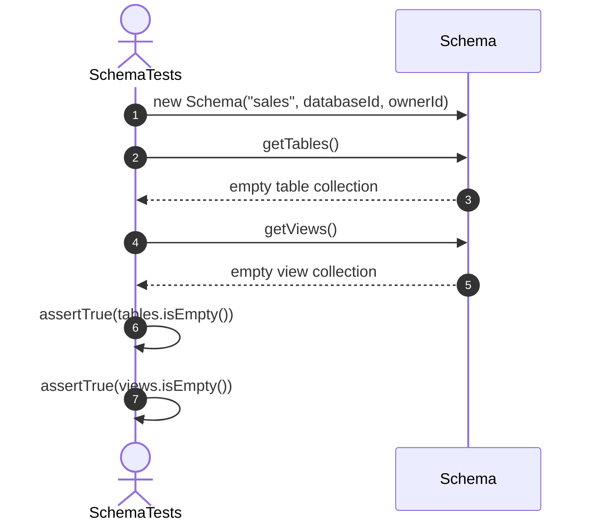
```mermaid
sequenceDiagram
    autonumber
    actor Test as SchemaTests
    participant Schema as Schema

    Test->>Schema: new Schema("sales", databaseId, ownerId)
    Test->>Schema: getTables()
    Schema-->>Test: empty table collection
    Test->>Schema: getViews()
    Schema-->>Test: empty view collection

    Test->>Test: assertTrue(tables.isEmpty())
    Test->>Test: assertTrue(views.isEmpty())
```

## 4. Rename_ShouldChangeSchemaName

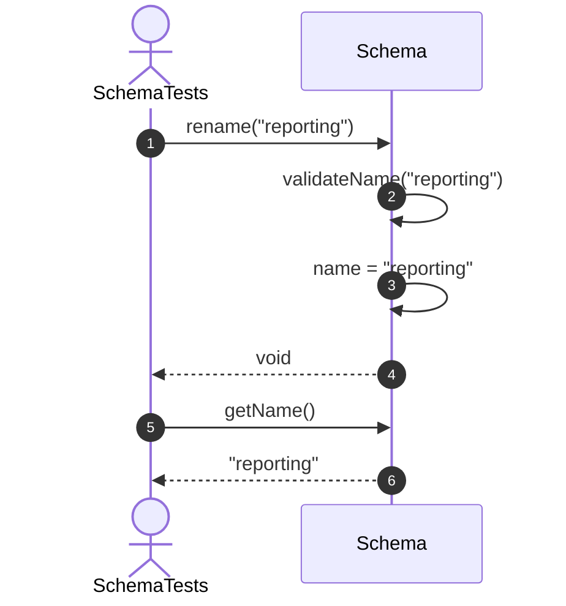
```mermaid
sequenceDiagram
    autonumber
    actor Test as SchemaTests
    participant Schema as Schema

    Test->>Schema: rename("reporting")
    Schema->>Schema: validateName("reporting")
    Schema->>Schema: name = "reporting"
    Schema-->>Test: void

    Test->>Schema: getName()
    Schema-->>Test: "reporting"
```

## 5. Rename_ShouldRejectInvalidName

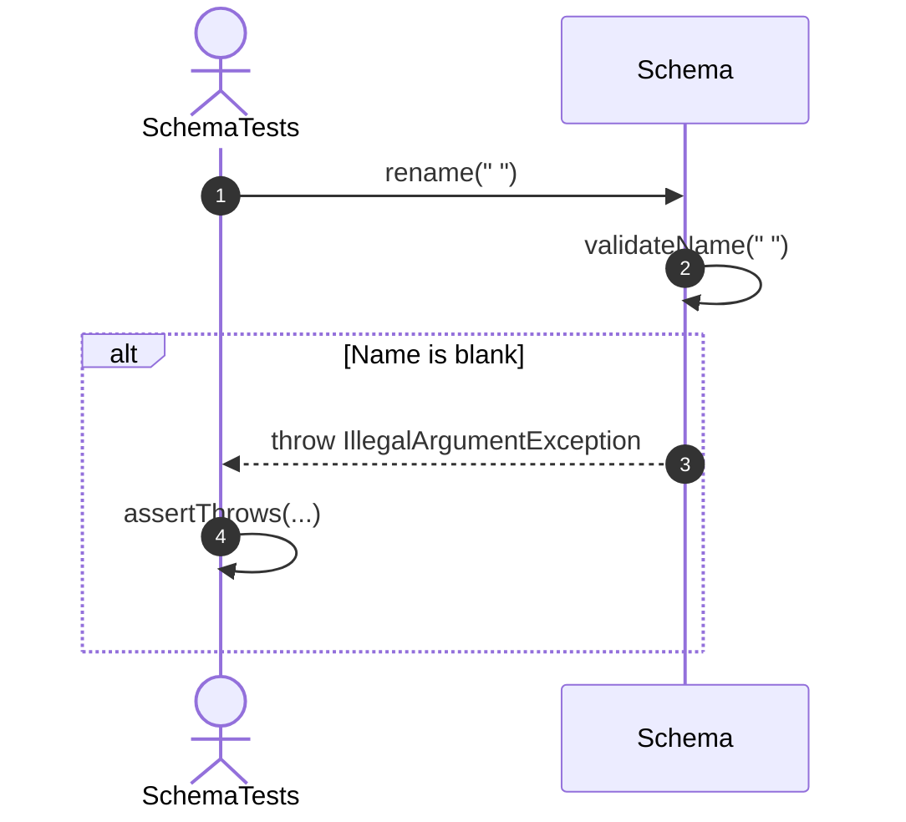
```mermaid
sequenceDiagram
    autonumber
    actor Test as SchemaTests
    participant Schema as Schema

    Test->>Schema: rename(" ")
    Schema->>Schema: validateName(" ")

    alt Name is blank
        Schema-->>Test: throw IllegalArgumentException
        Test->>Test: assertThrows(...)
    end
```

## 6. AddTable_ShouldRegisterTable

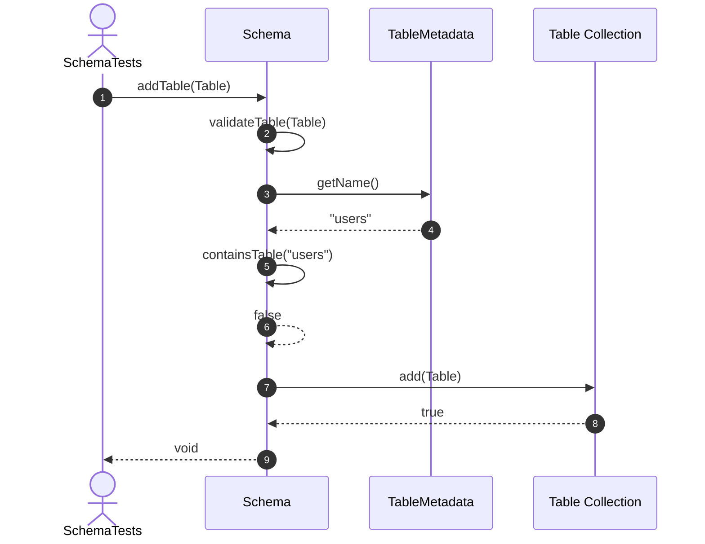
```mermaid
sequenceDiagram
    autonumber
    actor Test as SchemaTests
    participant Schema as Schema
    participant Table as TableMetadata
    participant Tables as Table Collection

    Test->>Schema: addTable(Table)
    Schema->>Schema: validateTable(Table)
    Schema->>Table: getName()
    Table-->>Schema: "users"
    Schema->>Schema: containsTable("users")
    Schema-->>Schema: false
    Schema->>Tables: add(Table)
    Tables-->>Schema: true
    Schema-->>Test: void
```

## 7. AddTable_ShouldRejectDuplicateTableName

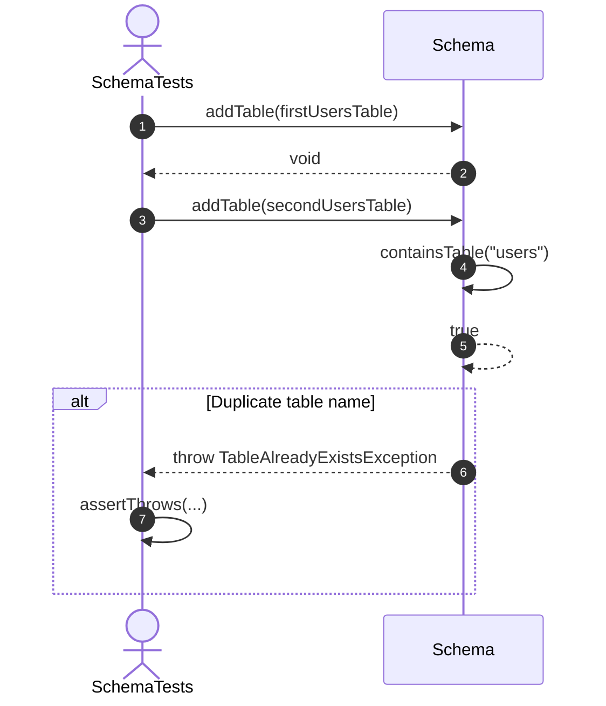
```mermaid
sequenceDiagram
    autonumber
    actor Test as SchemaTests
    participant Schema as Schema

    Test->>Schema: addTable(firstUsersTable)
    Schema-->>Test: void

    Test->>Schema: addTable(secondUsersTable)
    Schema->>Schema: containsTable("users")
    Schema-->>Schema: true

    alt Duplicate table name
        Schema-->>Test: throw TableAlreadyExistsException
        Test->>Test: assertThrows(...)
    end
```

## 8. GetTable_ShouldReturnExistingTable

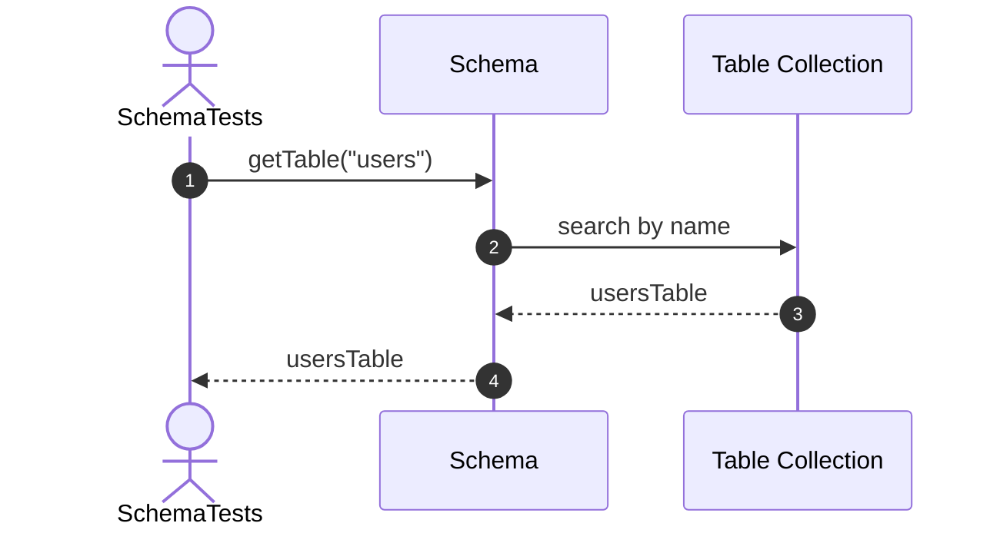
```mermaid
sequenceDiagram
    autonumber
    actor Test as SchemaTests
    participant Schema as Schema
    participant Tables as Table Collection

    Test->>Schema: getTable("users")
    Schema->>Tables: search by name
    Tables-->>Schema: usersTable
    Schema-->>Test: usersTable
```

## 9. RemoveTable_ShouldRemoveExistingTable

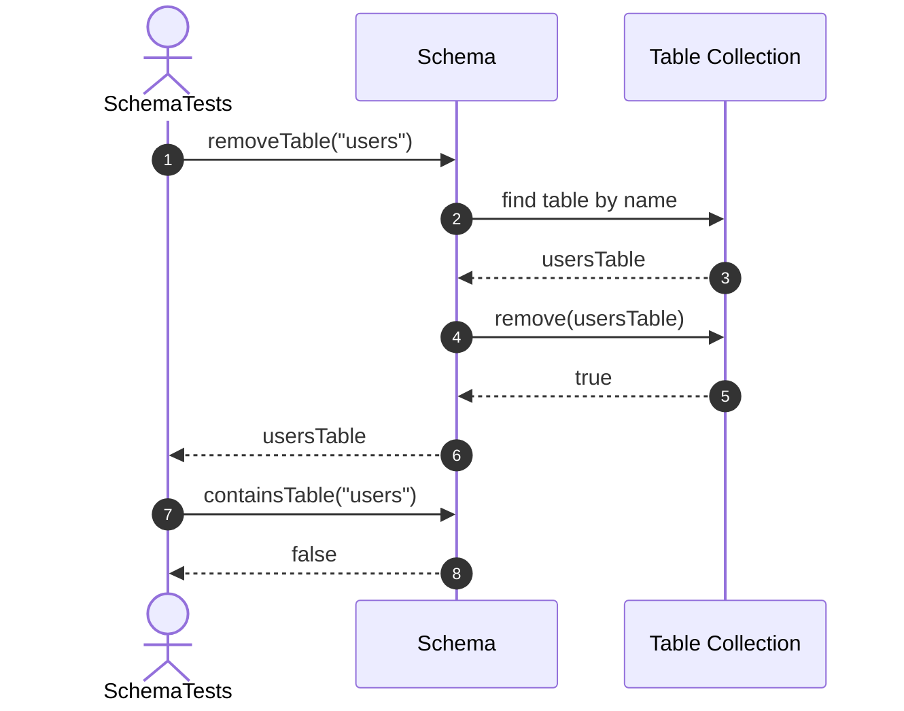
```mermaid
sequenceDiagram
    autonumber
    actor Test as SchemaTests
    participant Schema as Schema
    participant Tables as Table Collection

    Test->>Schema: removeTable("users")
    Schema->>Tables: find table by name
    Tables-->>Schema: usersTable
    Schema->>Tables: remove(usersTable)
    Tables-->>Schema: true
    Schema-->>Test: usersTable

    Test->>Schema: containsTable("users")
    Schema-->>Test: false
```

## 10. GetTables_ShouldReturnUnmodifiableCollection

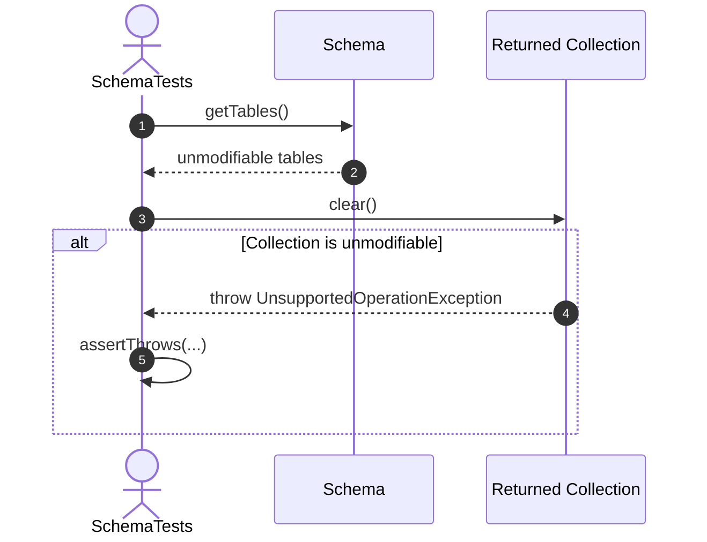
```mermaid
sequenceDiagram
    autonumber
    actor Test as SchemaTests
    participant Schema as Schema
    participant Tables as Returned Collection

    Test->>Schema: getTables()
    Schema-->>Test: unmodifiable tables

    Test->>Tables: clear()
    alt Collection is unmodifiable
        Tables-->>Test: throw UnsupportedOperationException
        Test->>Test: assertThrows(...)
    end
```

## 11. AddView_ShouldRegisterView

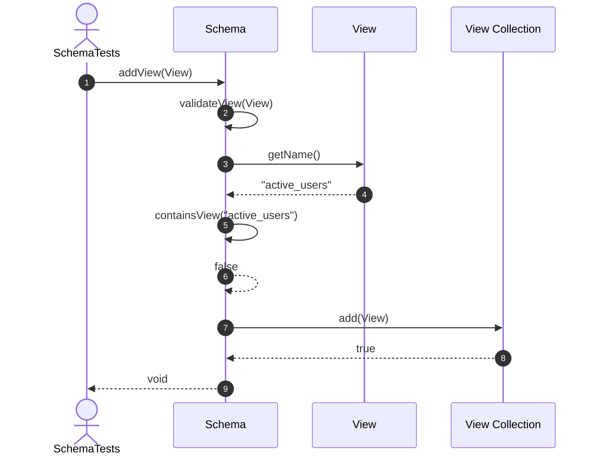
```mermaid
sequenceDiagram
    autonumber
    actor Test as SchemaTests
    participant Schema as Schema
    participant View as View
    participant Views as View Collection

    Test->>Schema: addView(View)
    Schema->>Schema: validateView(View)
    Schema->>View: getName()
    View-->>Schema: "active_users"
    Schema->>Schema: containsView("active_users")
    Schema-->>Schema: false
    Schema->>Views: add(View)
    Views-->>Schema: true
    Schema-->>Test: void
```

## 12. AddView_ShouldRejectDuplicateViewName

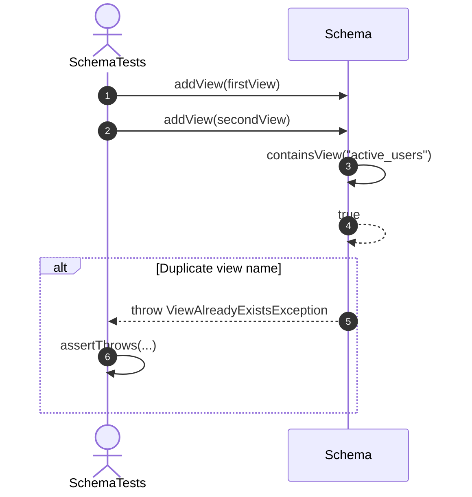
```mermaid
sequenceDiagram
    autonumber
    actor Test as SchemaTests
    participant Schema as Schema

    Test->>Schema: addView(firstView)
    Test->>Schema: addView(secondView)
    Schema->>Schema: containsView("active_users")
    Schema-->>Schema: true

    alt Duplicate view name
        Schema-->>Test: throw ViewAlreadyExistsException
        Test->>Test: assertThrows(...)
    end
```

## 13. RemoveView_ShouldRemoveExistingView

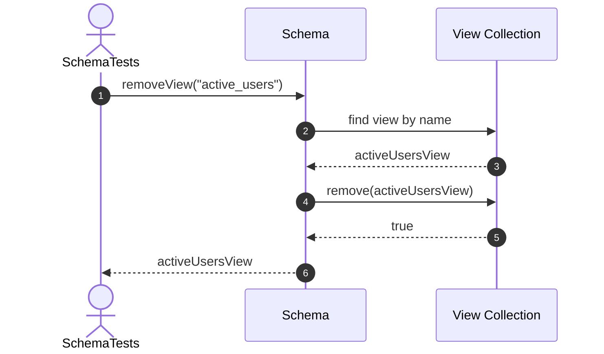
```mermaid
sequenceDiagram
    autonumber
    actor Test as SchemaTests
    participant Schema as Schema
    participant Views as View Collection

    Test->>Schema: removeView("active_users")
    Schema->>Views: find view by name
    Views-->>Schema: activeUsersView
    Schema->>Views: remove(activeUsersView)
    Views-->>Schema: true
    Schema-->>Test: activeUsersView
```

## 14. IsEmpty_ShouldReturnCorrectState

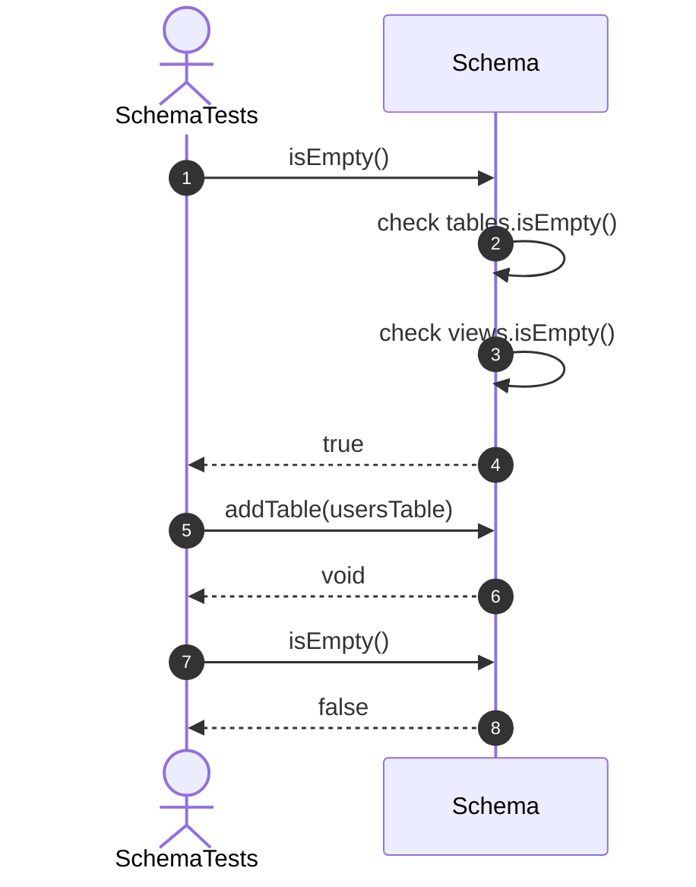
```mermaid
sequenceDiagram
    autonumber
    actor Test as SchemaTests
    participant Schema as Schema

    Test->>Schema: isEmpty()
    Schema->>Schema: check tables.isEmpty()
    Schema->>Schema: check views.isEmpty()
    Schema-->>Test: true

    Test->>Schema: addTable(usersTable)
    Schema-->>Test: void

    Test->>Schema: isEmpty()
    Schema-->>Test: false
```

## 15. SetOwnerId_ShouldUpdateOwner

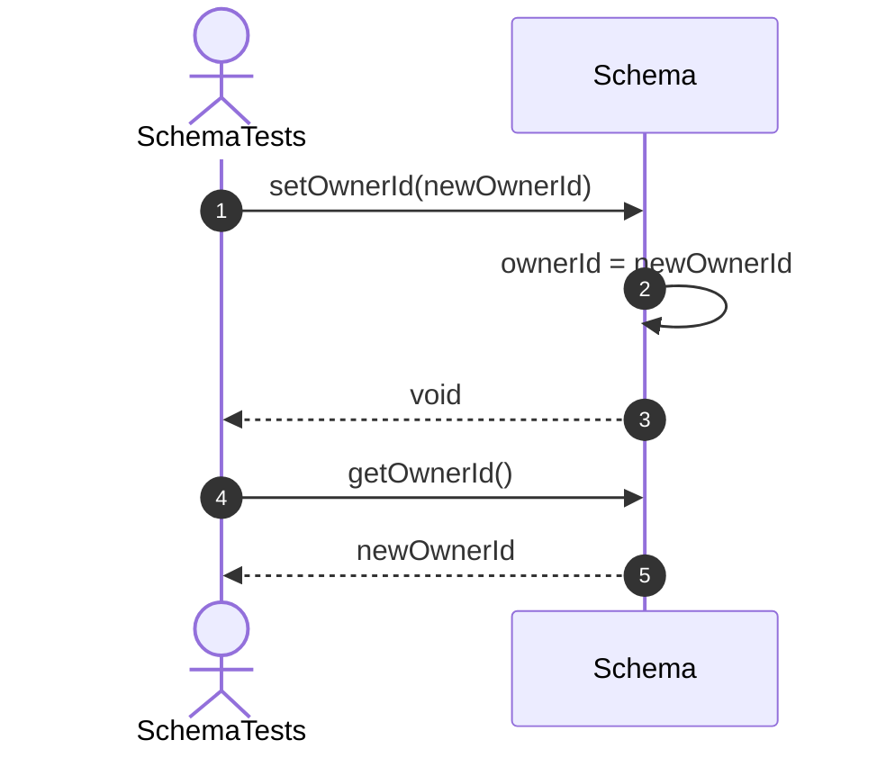
```mermaid
sequenceDiagram
    autonumber
    actor Test as SchemaTests
    participant Schema as Schema

    Test->>Schema: setOwnerId(newOwnerId)
    Schema->>Schema: ownerId = newOwnerId
    Schema-->>Test: void

    Test->>Schema: getOwnerId()
    Schema-->>Test: newOwnerId
```
