# Schema Testing - Main Functional Sequences

---

## 1. Create Schema

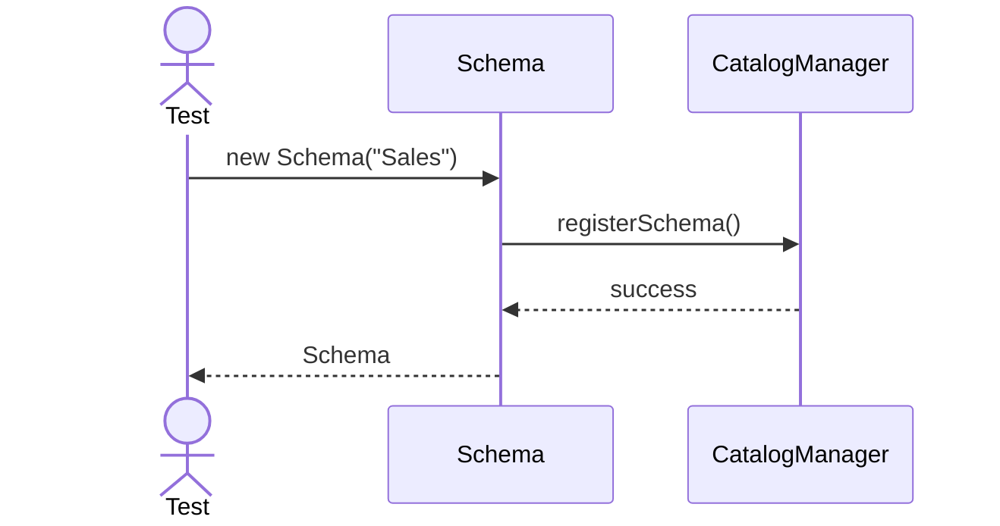

---

## 2. Create Table

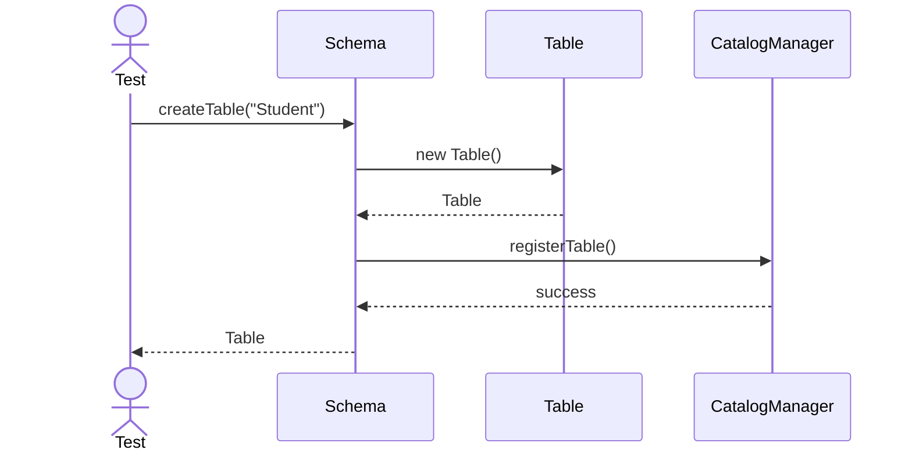

---

## 3. Drop Table

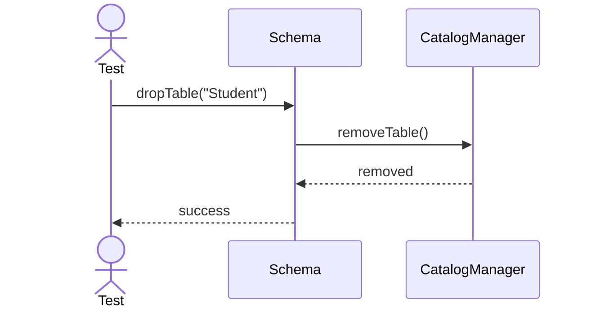

---

## 4. Rename Schema

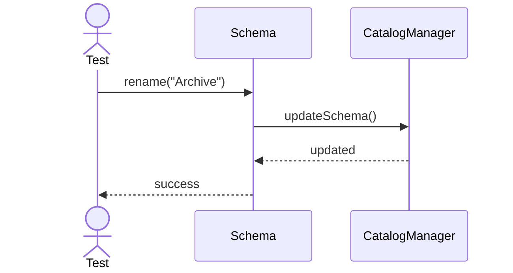

---

## 5. Move Table

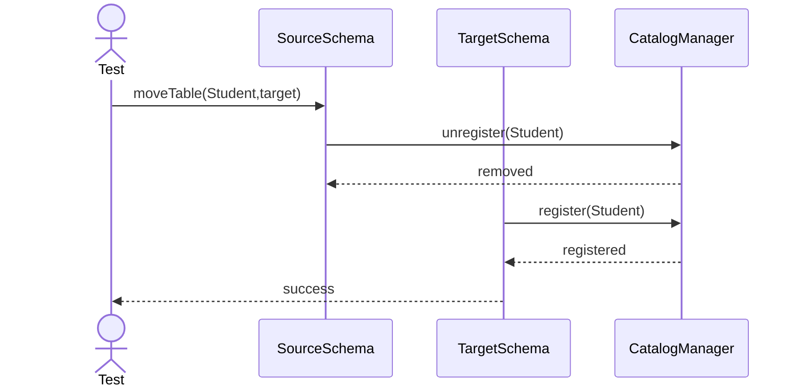

---

## 6. Create View

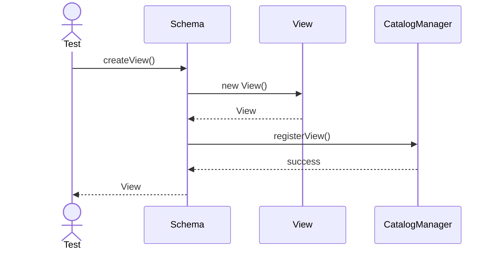

---

## 7. Create Stored Procedure

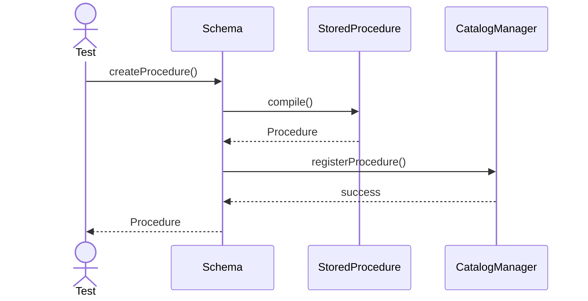

---

## 8. Create Function

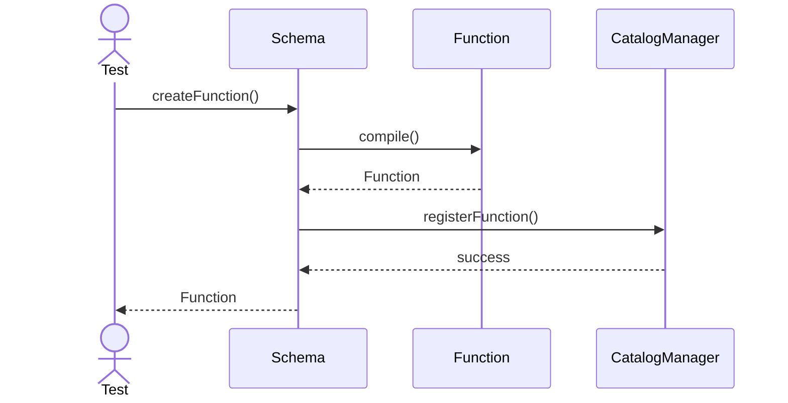

---

## 9. Create Sequence

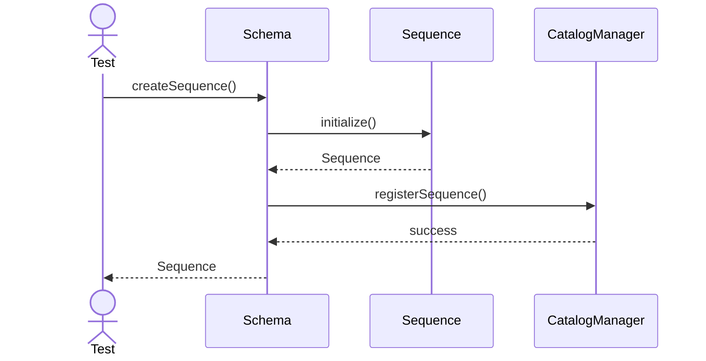

---

## 10. Get Table

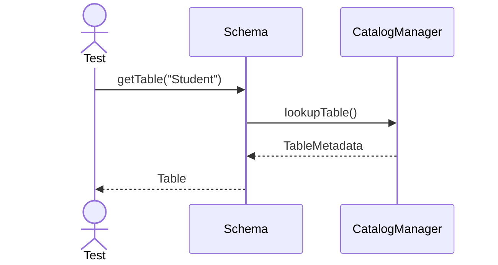

---

## 11. List Tables

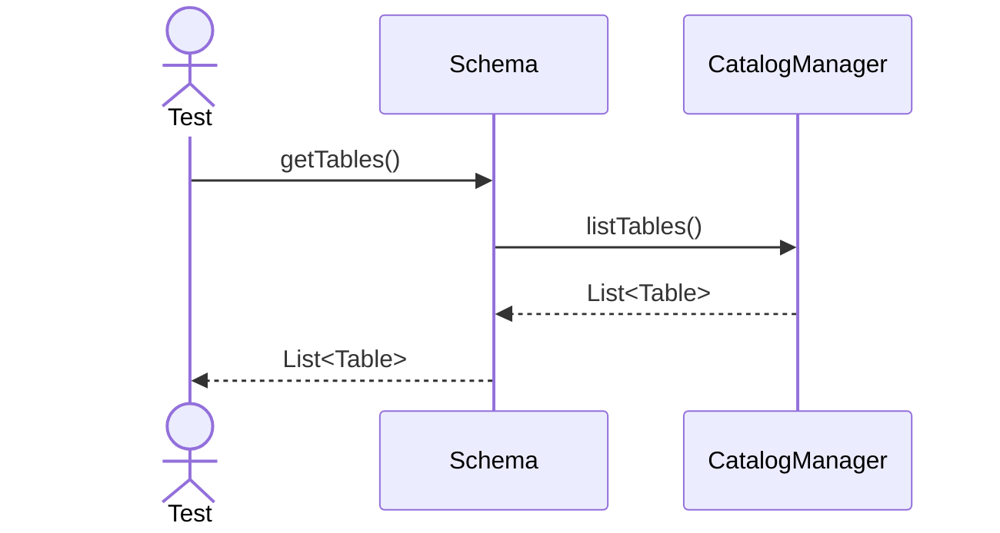

---

## 12. Check Object Exists

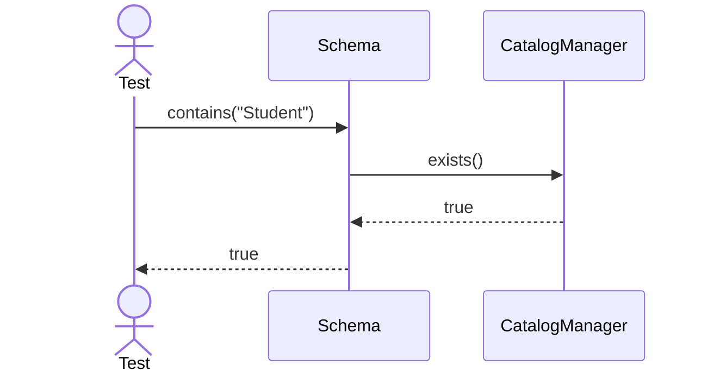

---

## 13. Duplicate Object

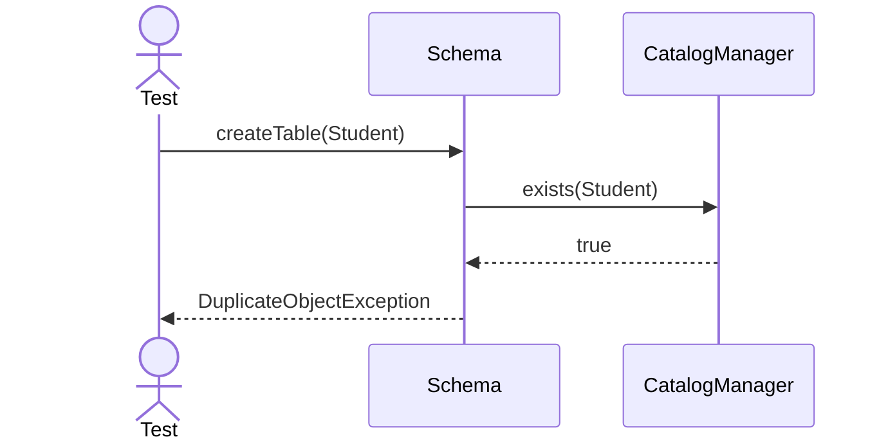

---

## 14. Invalid Name

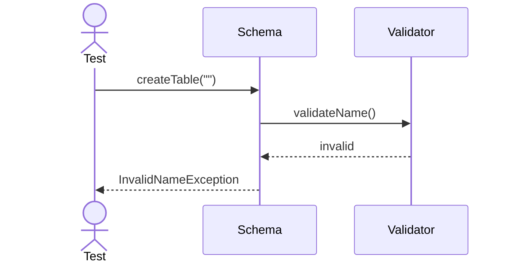

---

## 15. Rename Table

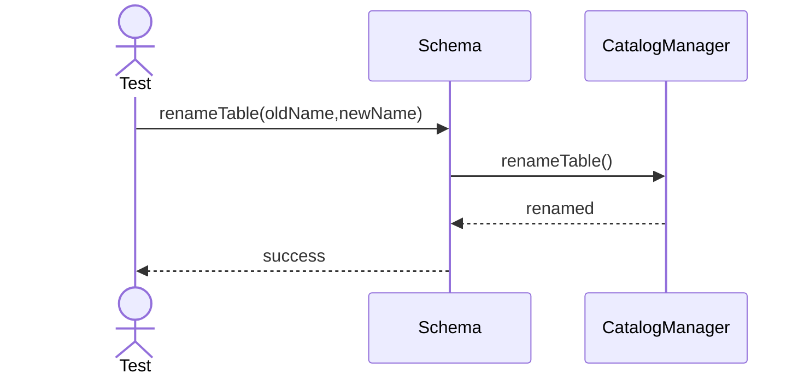

---

## 16. Drop View

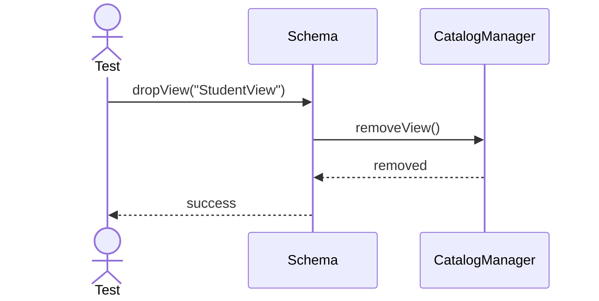

---

## 17. Drop Stored Procedure

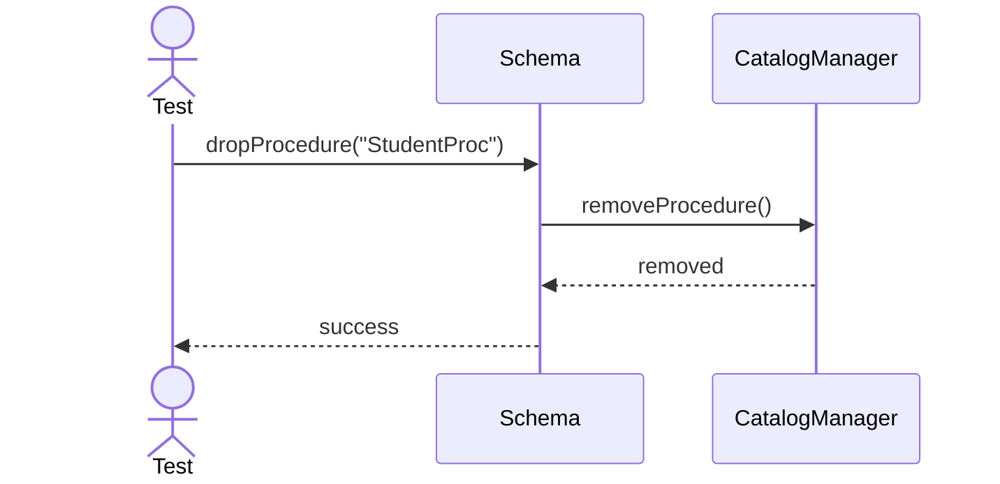

---

## 18. Drop Function

---

## 19. Drop Sequence

---

## 20. Clone Schema

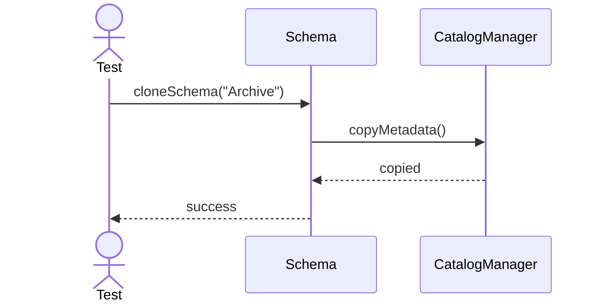
