# Table Testing - Main Functional Sequences

---

## 1. Create Table

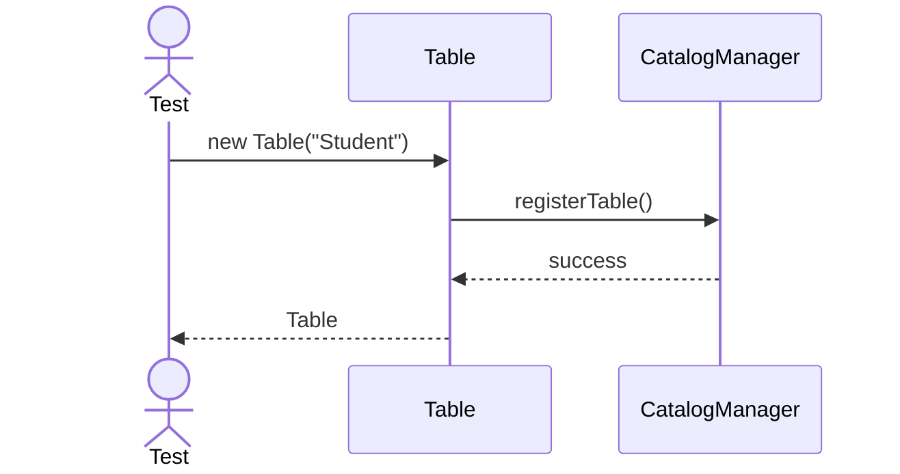

---

## 2. Insert Row

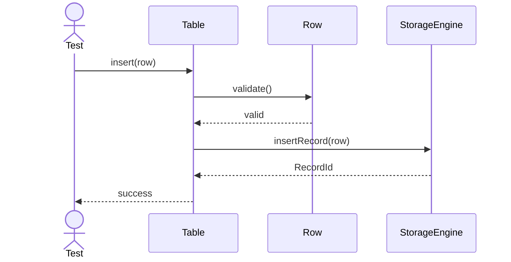

---

## 3. Update Row

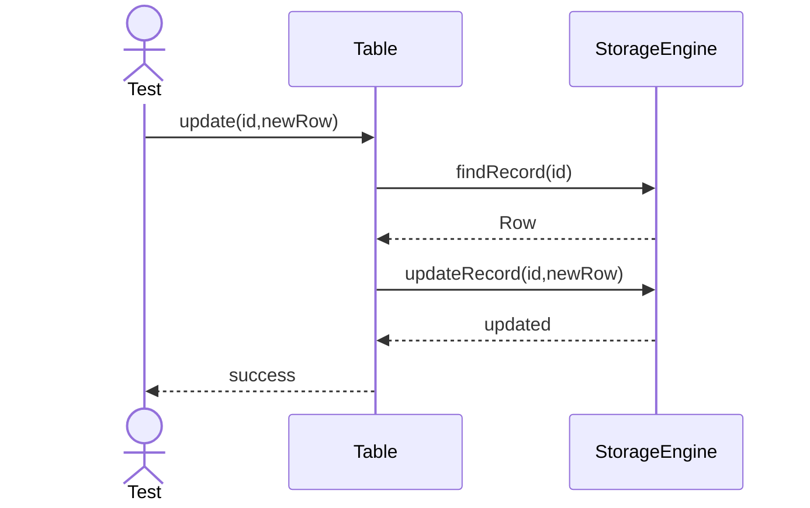

---

## 4. Delete Row

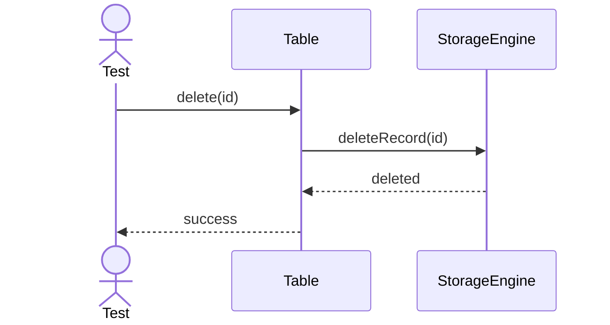

---

## 5. Truncate Table

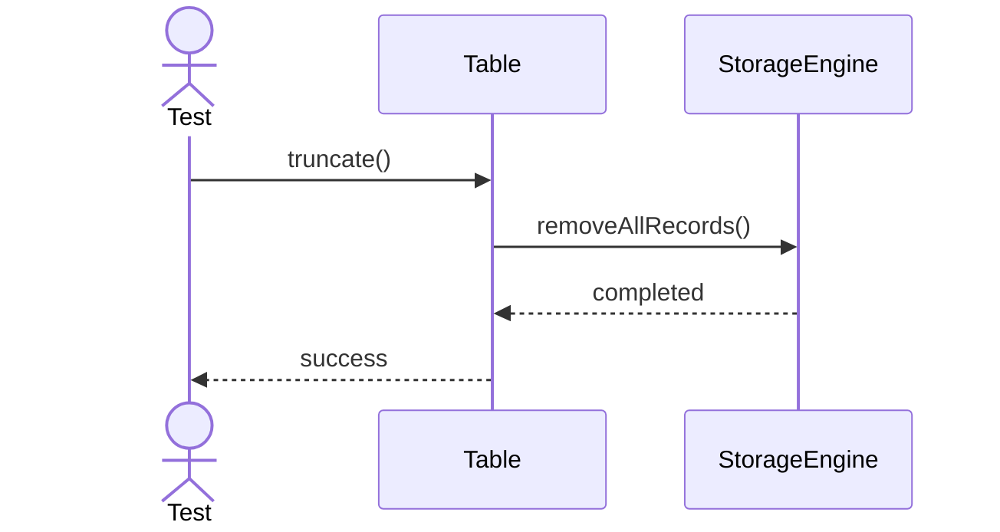

---

## 6. Add Column

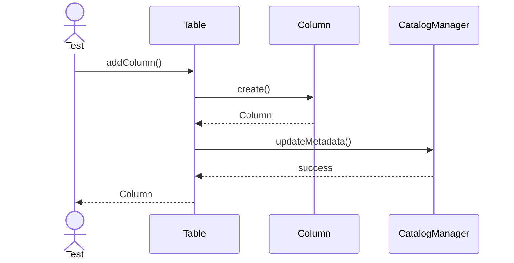

---

## 7. Remove Column

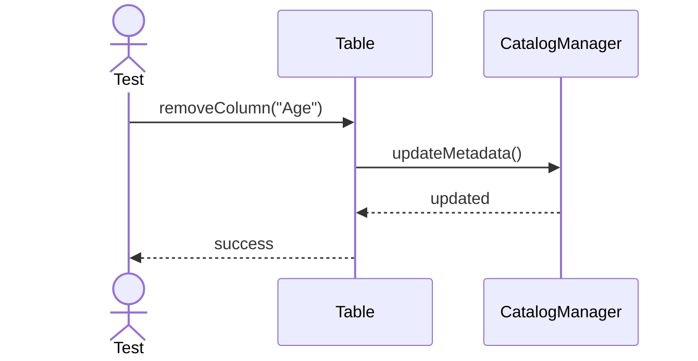

---

## 8. Rename Column

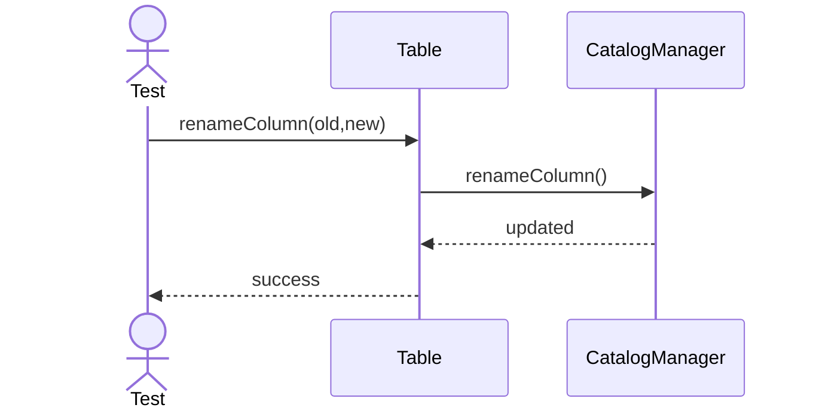

---

## 9. Add Constraint

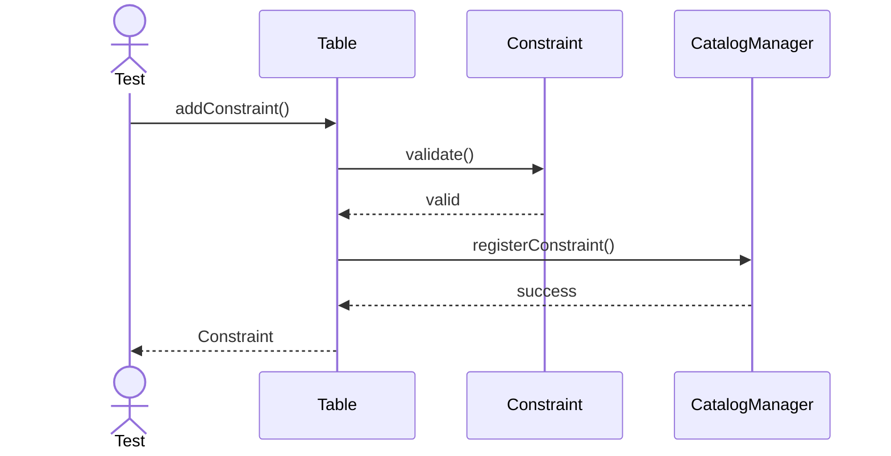

---

## 10. Drop Constraint

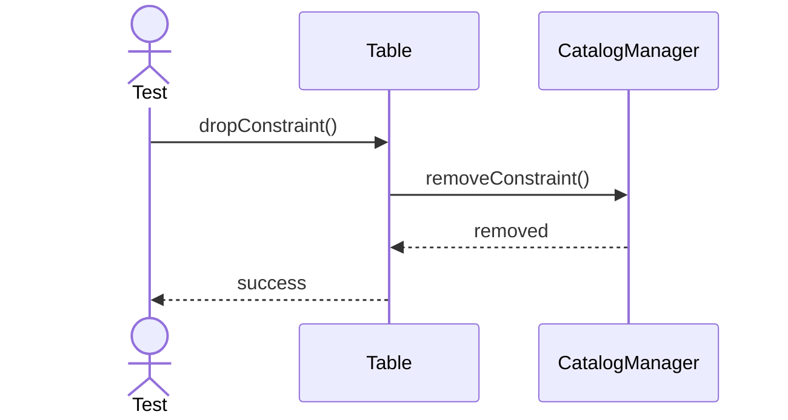

---

## 11. Create Index

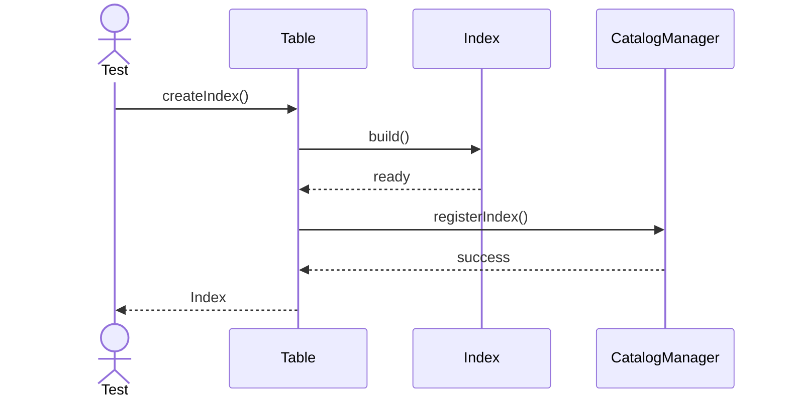

---

## 12. Drop Index

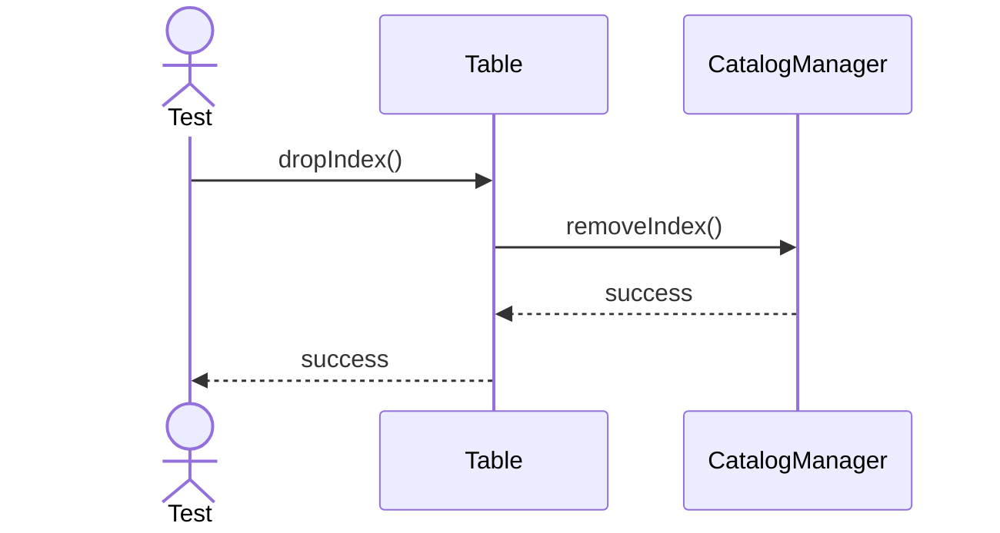

---

## 13. Analyze Table

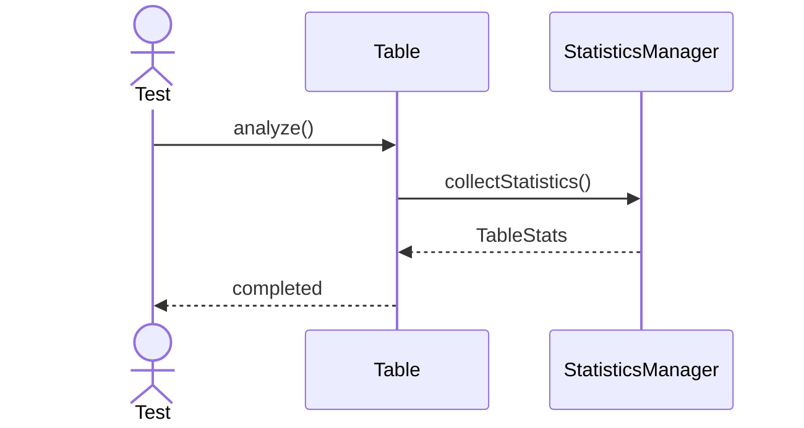

---

## 14. Vacuum Table

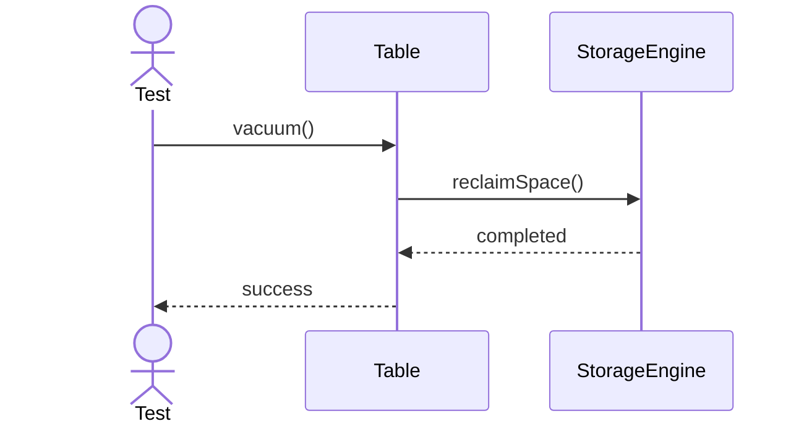

---

## 15. Compress Table

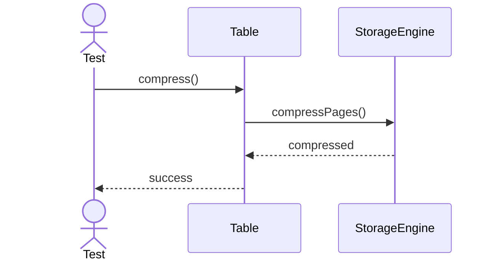

---

## 16. Encrypt Table

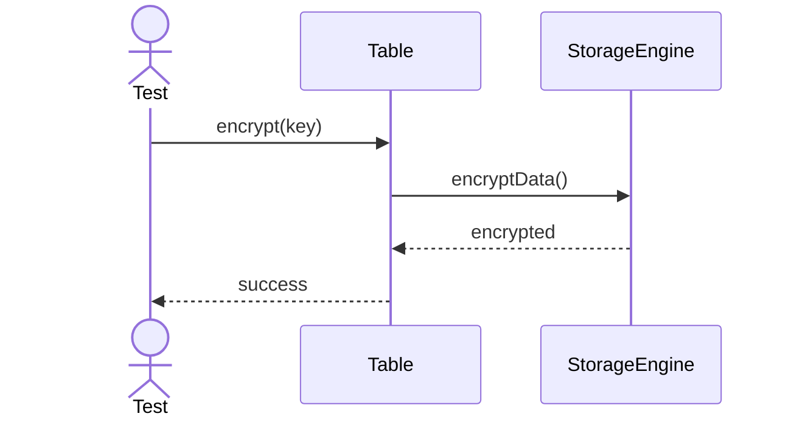

---

## 17. Primary Key Validation

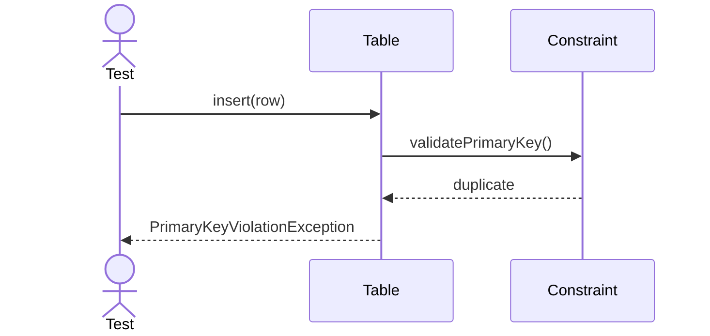

---

## 18. Foreign Key Validation

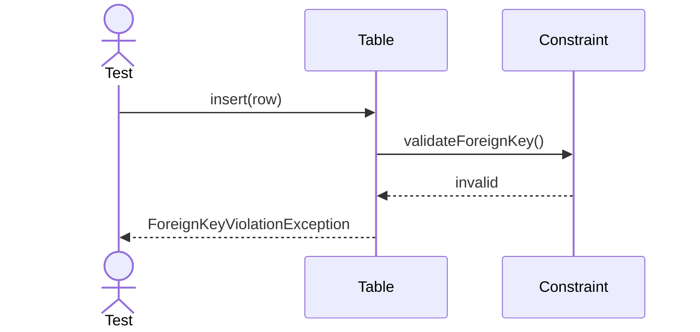

---

## 19. Concurrent Insert

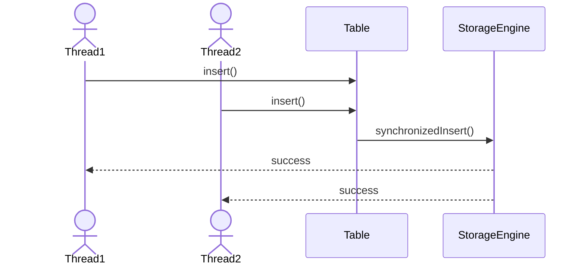

---

## 20. Concurrent Update

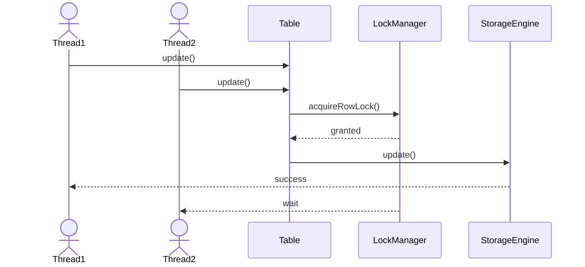