# Table Testing — Important Unit Test Sequence Diagrams

## 1. Constructor_ShouldCreateTable

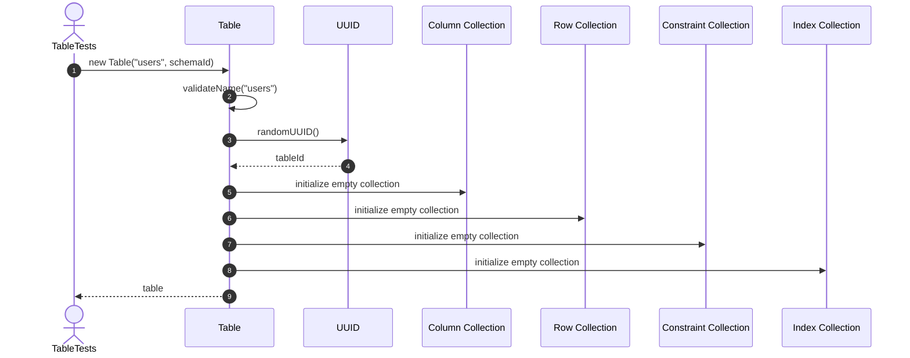
```mermaid
sequenceDiagram
    autonumber
    actor Test as TableTests
    participant Table as Table
    participant UUID as UUID
    participant Columns as Column Collection
    participant Rows as Row Collection
    participant Constraints as Constraint Collection
    participant Indexes as Index Collection

    Test->>Table: new Table("users", schemaId)
    Table->>Table: validateName("users")
    Table->>UUID: randomUUID()
    UUID-->>Table: tableId
    Table->>Columns: initialize empty collection
    Table->>Rows: initialize empty collection
    Table->>Constraints: initialize empty collection
    Table->>Indexes: initialize empty collection
    Table-->>Test: table
```

## 2. Constructor_ShouldGenerateTableId

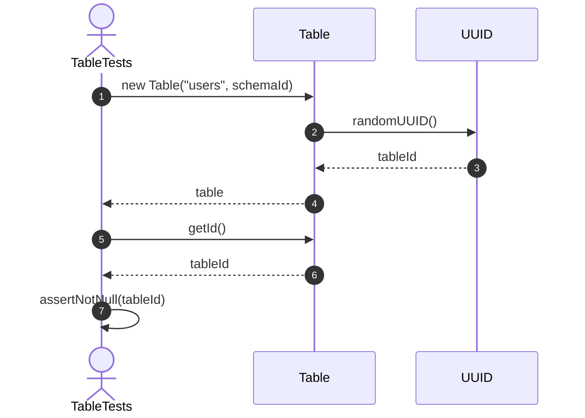
```mermaid
sequenceDiagram
    autonumber
    actor Test as TableTests
    participant Table as Table
    participant UUID as UUID

    Test->>Table: new Table("users", schemaId)
    Table->>UUID: randomUUID()
    UUID-->>Table: tableId
    Table-->>Test: table

    Test->>Table: getId()
    Table-->>Test: tableId
    Test->>Test: assertNotNull(tableId)
```

## 3. AddColumn_ShouldAppendColumn

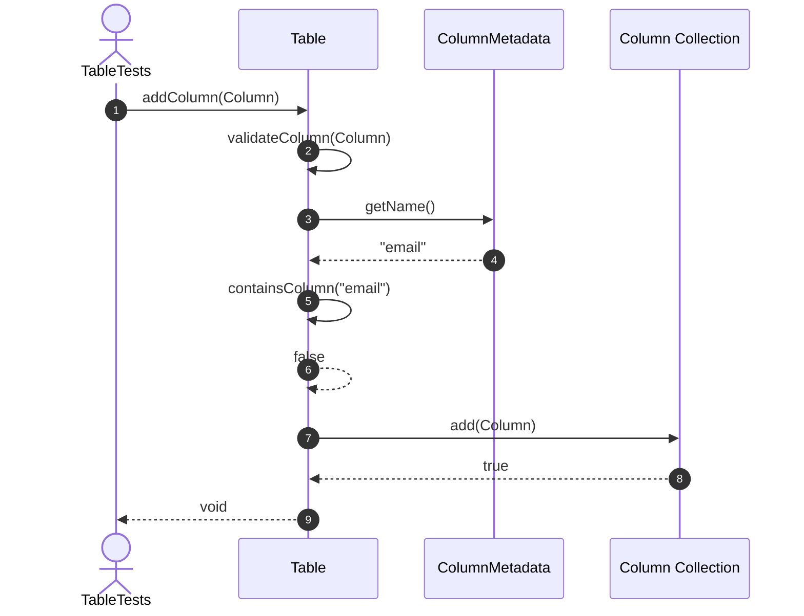
```mermaid
sequenceDiagram
    autonumber
    actor Test as TableTests
    participant Table as Table
    participant Column as ColumnMetadata
    participant Columns as Column Collection

    Test->>Table: addColumn(Column)
    Table->>Table: validateColumn(Column)
    Table->>Column: getName()
    Column-->>Table: "email"
    Table->>Table: containsColumn("email")
    Table-->>Table: false
    Table->>Columns: add(Column)
    Columns-->>Table: true
    Table-->>Test: void
```

## 4. AddColumn_ShouldRejectDuplicateColumnName

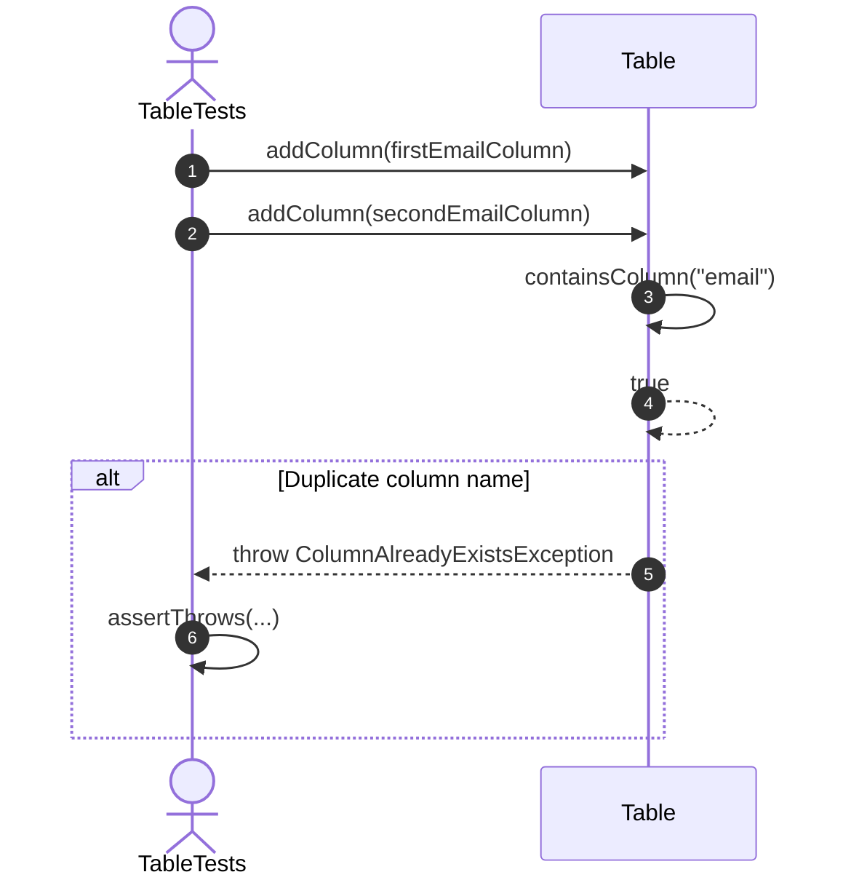
```mermaid
sequenceDiagram
    autonumber
    actor Test as TableTests
    participant Table as Table

    Test->>Table: addColumn(firstEmailColumn)
    Test->>Table: addColumn(secondEmailColumn)
    Table->>Table: containsColumn("email")
    Table-->>Table: true

    alt Duplicate column name
        Table-->>Test: throw ColumnAlreadyExistsException
        Test->>Test: assertThrows(...)
    end
```

## 5. GetColumn_ShouldReturnExistingColumn

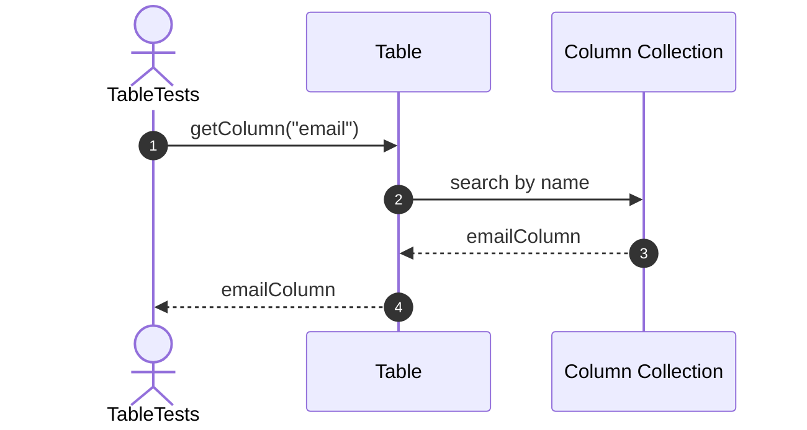
```mermaid
sequenceDiagram
    autonumber
    actor Test as TableTests
    participant Table as Table
    participant Columns as Column Collection

    Test->>Table: getColumn("email")
    Table->>Columns: search by name
    Columns-->>Table: emailColumn
    Table-->>Test: emailColumn
```

## 6. RemoveColumn_ShouldRemoveExistingColumn

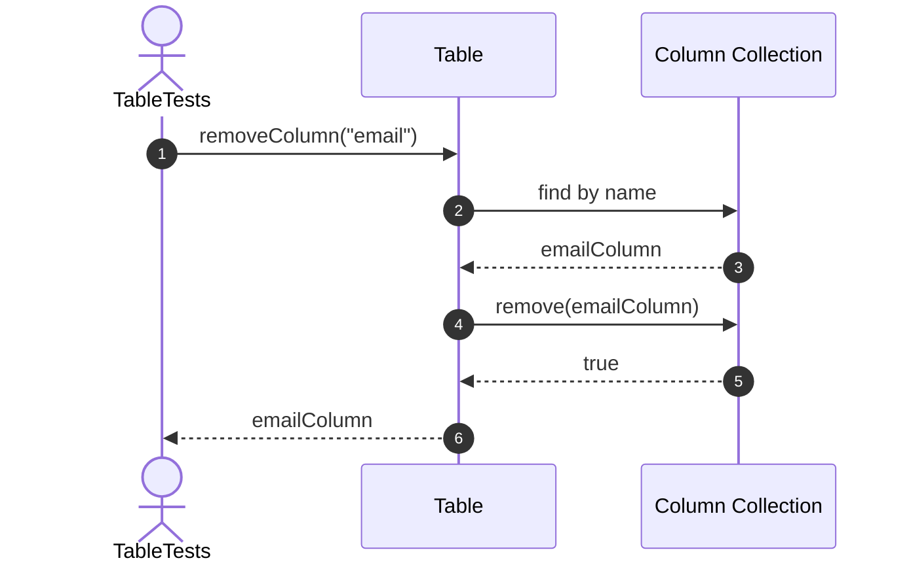
```mermaid
sequenceDiagram
    autonumber
    actor Test as TableTests
    participant Table as Table
    participant Columns as Column Collection

    Test->>Table: removeColumn("email")
    Table->>Columns: find by name
    Columns-->>Table: emailColumn
    Table->>Columns: remove(emailColumn)
    Columns-->>Table: true
    Table-->>Test: emailColumn
```

## 7. RenameColumn_ShouldRenameExistingColumn

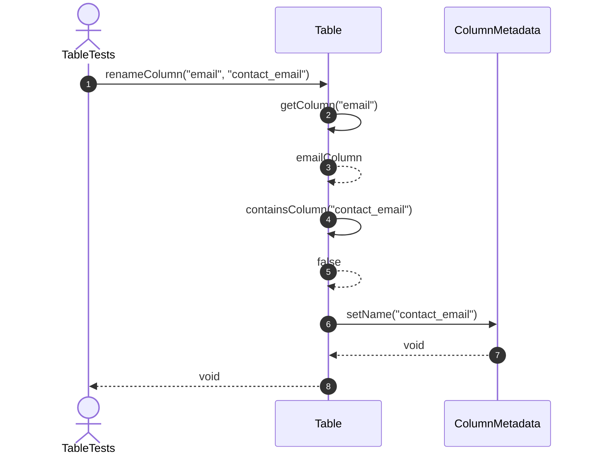
```mermaid
sequenceDiagram
    autonumber
    actor Test as TableTests
    participant Table as Table
    participant Column as ColumnMetadata

    Test->>Table: renameColumn("email", "contact_email")
    Table->>Table: getColumn("email")
    Table-->>Table: emailColumn
    Table->>Table: containsColumn("contact_email")
    Table-->>Table: false
    Table->>Column: setName("contact_email")
    Column-->>Table: void
    Table-->>Test: void
```

## 8. InsertRow_ShouldInsertSuccessfully

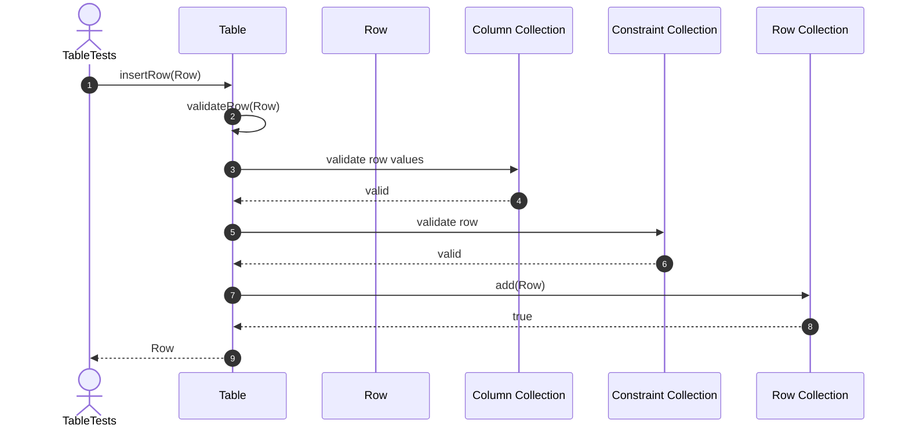
```mermaid
sequenceDiagram
    autonumber
    actor Test as TableTests
    participant Table as Table
    participant Row as Row
    participant Columns as Column Collection
    participant Constraints as Constraint Collection
    participant Rows as Row Collection

    Test->>Table: insertRow(Row)
    Table->>Table: validateRow(Row)
    Table->>Columns: validate row values
    Columns-->>Table: valid
    Table->>Constraints: validate row
    Constraints-->>Table: valid
    Table->>Rows: add(Row)
    Rows-->>Table: true
    Table-->>Test: Row
```

## 9. InsertRow_ShouldRejectInvalidColumnValue

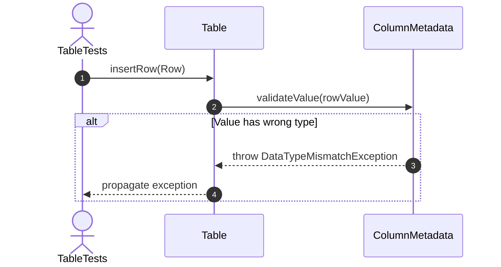
```mermaid
sequenceDiagram
    autonumber
    actor Test as TableTests
    participant Table as Table
    participant Column as ColumnMetadata

    Test->>Table: insertRow(Row)
    Table->>Column: validateValue(rowValue)

    alt Value has wrong type
        Column-->>Table: throw DataTypeMismatchException
        Table-->>Test: propagate exception
    end
```

## 10. InsertRow_ShouldRejectConstraintViolation

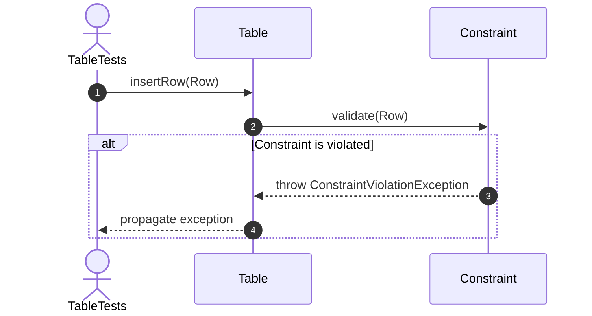
```mermaid
sequenceDiagram
    autonumber
    actor Test as TableTests
    participant Table as Table
    participant Constraint as Constraint

    Test->>Table: insertRow(Row)
    Table->>Constraint: validate(Row)

    alt Constraint is violated
        Constraint-->>Table: throw ConstraintViolationException
        Table-->>Test: propagate exception
    end
```

## 11. GetRow_ShouldReturnExistingRow

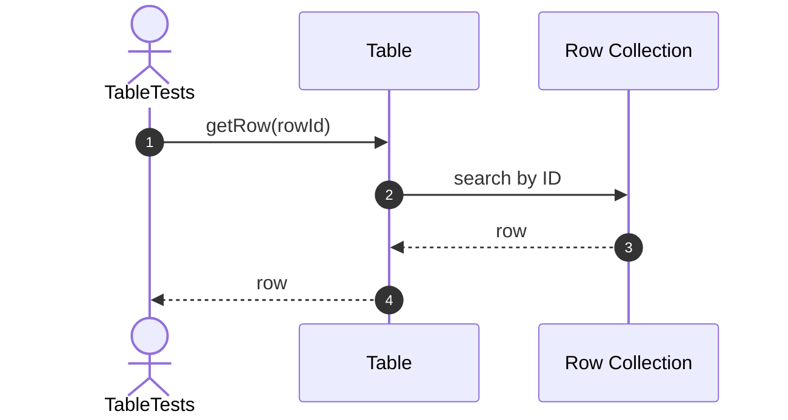
```mermaid
sequenceDiagram
    autonumber
    actor Test as TableTests
    participant Table as Table
    participant Rows as Row Collection

    Test->>Table: getRow(rowId)
    Table->>Rows: search by ID
    Rows-->>Table: row
    Table-->>Test: row
```

## 12. UpdateRow_ShouldUpdateExistingRow

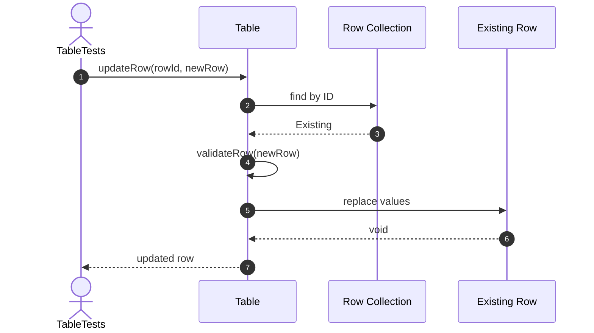
```mermaid
sequenceDiagram
    autonumber
    actor Test as TableTests
    participant Table as Table
    participant Rows as Row Collection
    participant Existing as Existing Row

    Test->>Table: updateRow(rowId, newRow)
    Table->>Rows: find by ID
    Rows-->>Table: Existing
    Table->>Table: validateRow(newRow)
    Table->>Existing: replace values
    Existing-->>Table: void
    Table-->>Test: updated row
```

## 13. DeleteRow_ShouldDeleteExistingRow

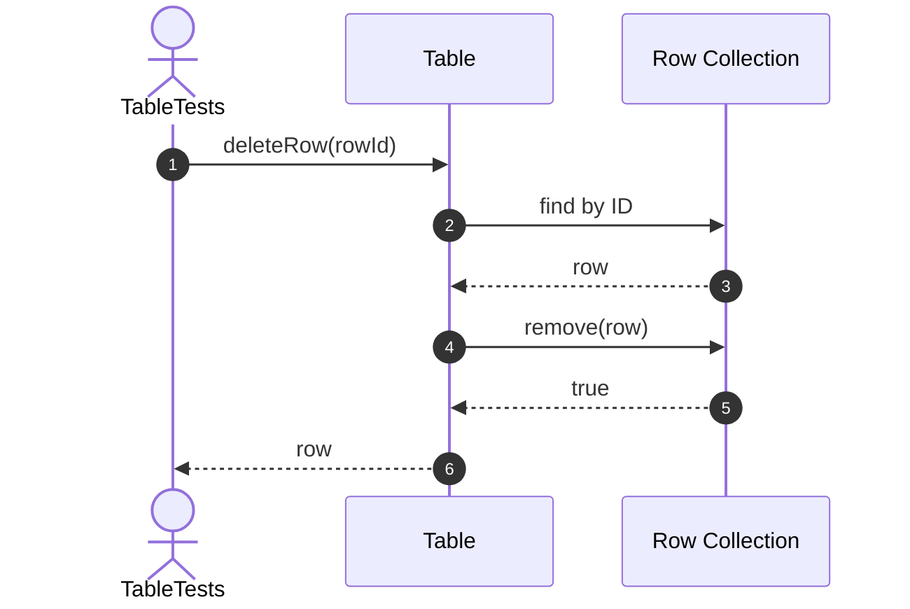
```mermaid
sequenceDiagram
    autonumber
    actor Test as TableTests
    participant Table as Table
    participant Rows as Row Collection

    Test->>Table: deleteRow(rowId)
    Table->>Rows: find by ID
    Rows-->>Table: row
    Table->>Rows: remove(row)
    Rows-->>Table: true
    Table-->>Test: row
```

## 14. Truncate_ShouldRemoveAllRows

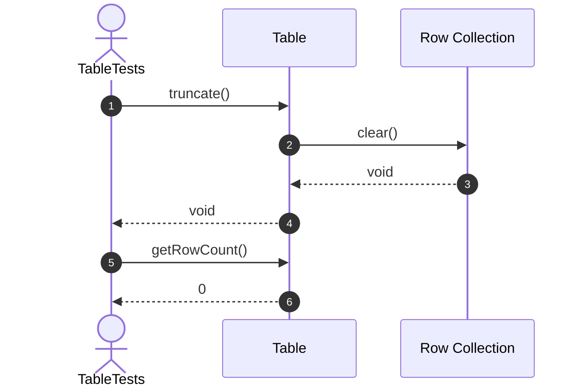
```mermaid
sequenceDiagram
    autonumber
    actor Test as TableTests
    participant Table as Table
    participant Rows as Row Collection

    Test->>Table: truncate()
    Table->>Rows: clear()
    Rows-->>Table: void
    Table-->>Test: void

    Test->>Table: getRowCount()
    Table-->>Test: 0
```

## 15. AddConstraint_ShouldRegisterConstraint

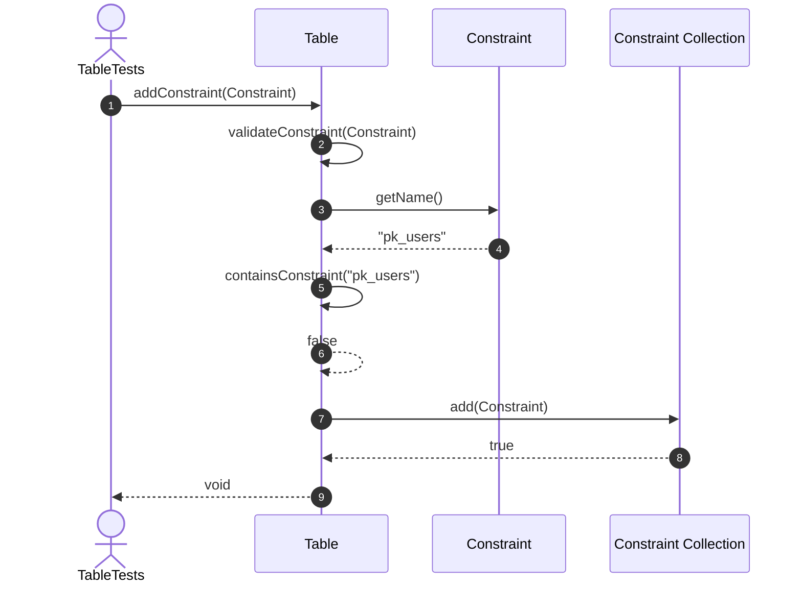
```mermaid
sequenceDiagram
    autonumber
    actor Test as TableTests
    participant Table as Table
    participant Constraint as Constraint
    participant Constraints as Constraint Collection

    Test->>Table: addConstraint(Constraint)
    Table->>Table: validateConstraint(Constraint)
    Table->>Constraint: getName()
    Constraint-->>Table: "pk_users"
    Table->>Table: containsConstraint("pk_users")
    Table-->>Table: false
    Table->>Constraints: add(Constraint)
    Constraints-->>Table: true
    Table-->>Test: void
```

## 16. AddConstraint_ShouldRejectDuplicateName

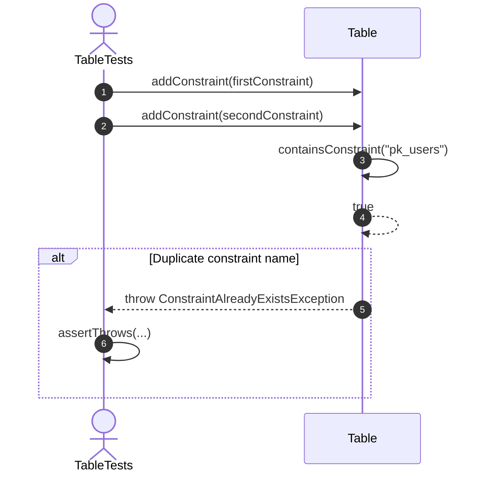
```mermaid
sequenceDiagram
    autonumber
    actor Test as TableTests
    participant Table as Table

    Test->>Table: addConstraint(firstConstraint)
    Test->>Table: addConstraint(secondConstraint)
    Table->>Table: containsConstraint("pk_users")
    Table-->>Table: true

    alt Duplicate constraint name
        Table-->>Test: throw ConstraintAlreadyExistsException
        Test->>Test: assertThrows(...)
    end
```

## 17. AddIndex_ShouldRegisterIndex

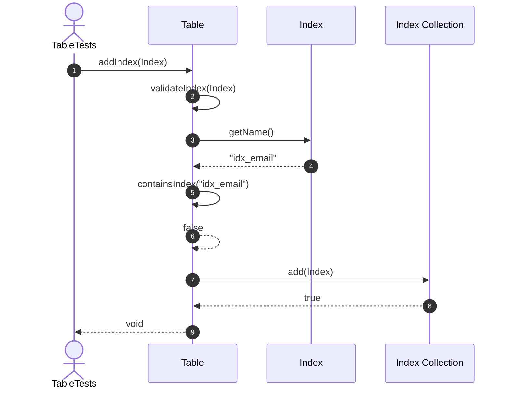
```mermaid
sequenceDiagram
    autonumber
    actor Test as TableTests
    participant Table as Table
    participant Index as Index
    participant Indexes as Index Collection

    Test->>Table: addIndex(Index)
    Table->>Table: validateIndex(Index)
    Table->>Index: getName()
    Index-->>Table: "idx_email"
    Table->>Table: containsIndex("idx_email")
    Table-->>Table: false
    Table->>Indexes: add(Index)
    Indexes-->>Table: true
    Table-->>Test: void
```

## 18. AddIndex_ShouldRejectDuplicateName

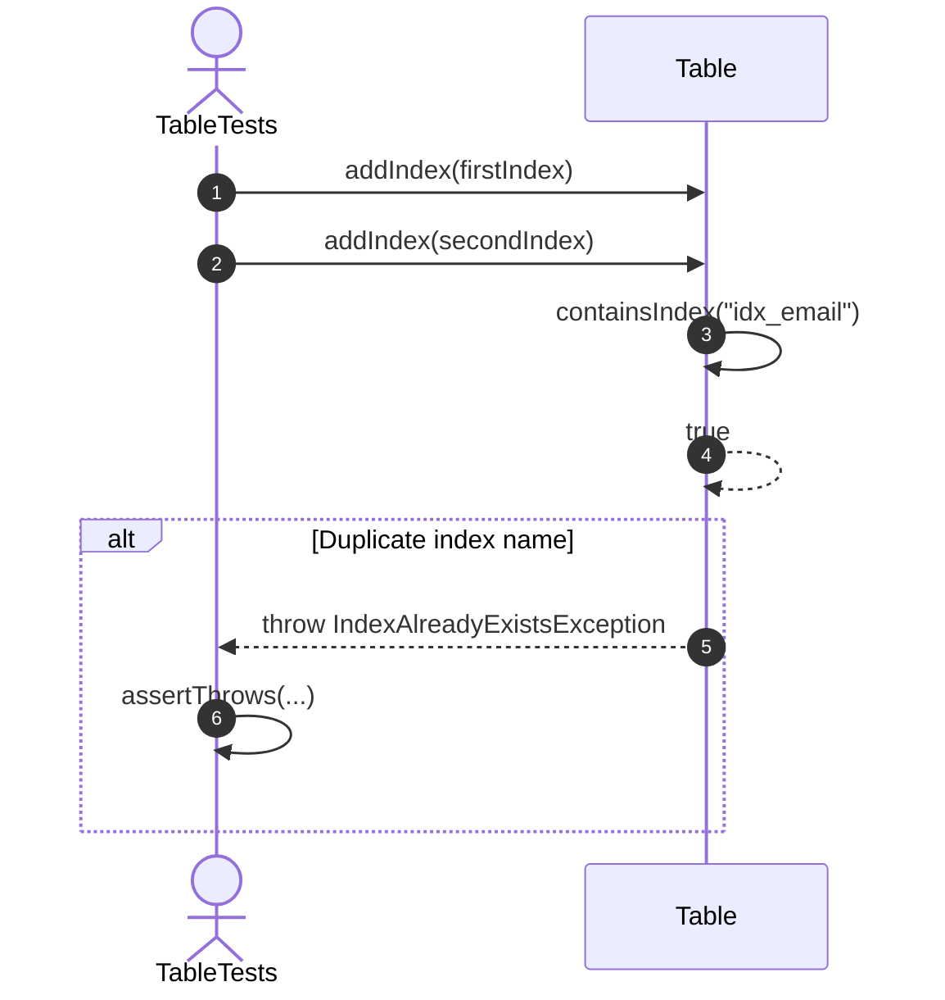
```mermaid
sequenceDiagram
    autonumber
    actor Test as TableTests
    participant Table as Table

    Test->>Table: addIndex(firstIndex)
    Test->>Table: addIndex(secondIndex)
    Table->>Table: containsIndex("idx_email")
    Table-->>Table: true

    alt Duplicate index name
        Table-->>Test: throw IndexAlreadyExistsException
        Test->>Test: assertThrows(...)
    end
```

## 19. GetCollections_ShouldReturnUnmodifiableCollections

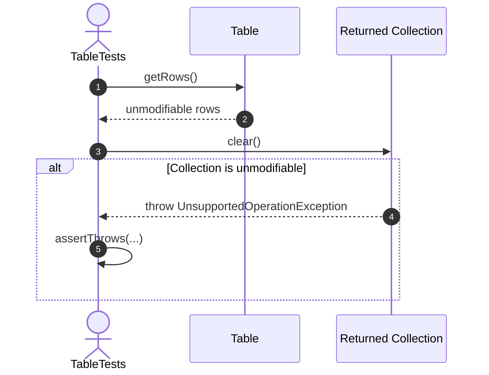
```mermaid
sequenceDiagram
    autonumber
    actor Test as TableTests
    participant Table as Table
    participant Returned as Returned Collection

    Test->>Table: getRows()
    Table-->>Test: unmodifiable rows
    Test->>Returned: clear()

    alt Collection is unmodifiable
        Returned-->>Test: throw UnsupportedOperationException
        Test->>Test: assertThrows(...)
    end
```

## 20. IsEmpty_ShouldReturnCorrectState

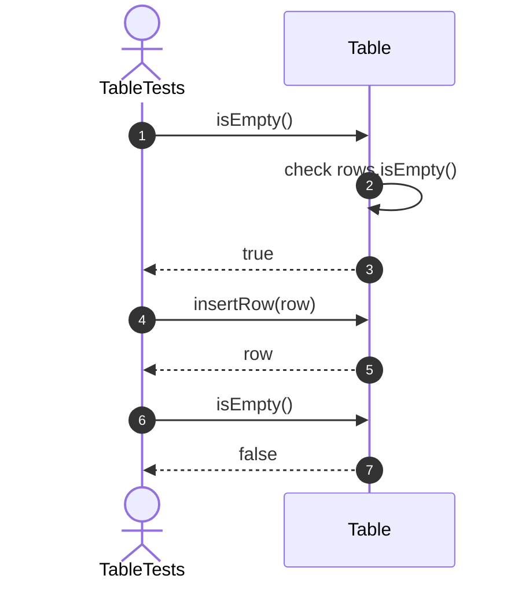
```mermaid
sequenceDiagram
    autonumber
    actor Test as TableTests
    participant Table as Table

    Test->>Table: isEmpty()
    Table->>Table: check rows.isEmpty()
    Table-->>Test: true

    Test->>Table: insertRow(row)
    Table-->>Test: row

    Test->>Table: isEmpty()
    Table-->>Test: false
```
