# View Testing - Main Functional Sequences

---

## 1. Create View

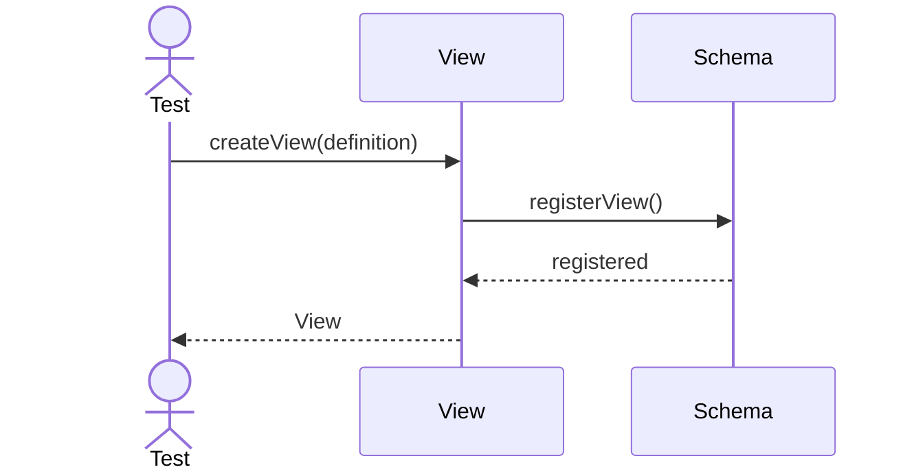

---

## 2. Refresh Materialized View

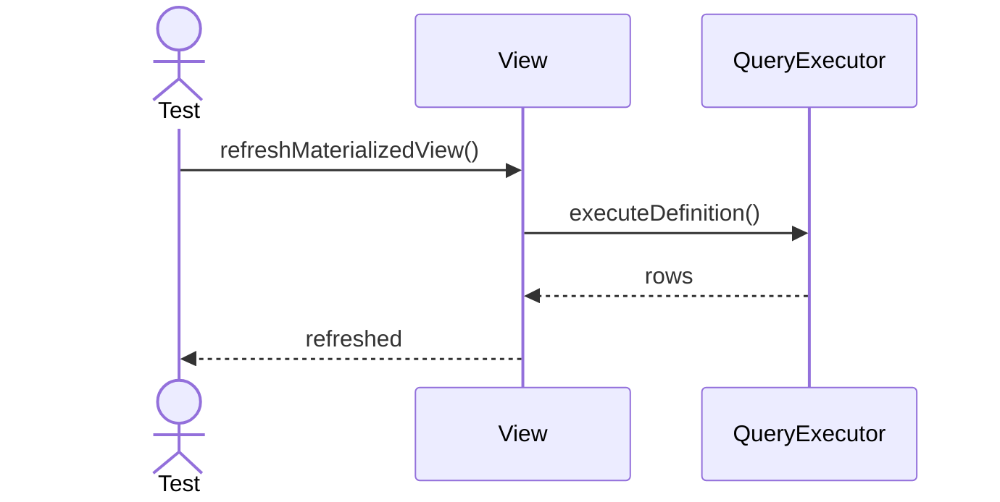

---

## 3. Resolve Dependencies

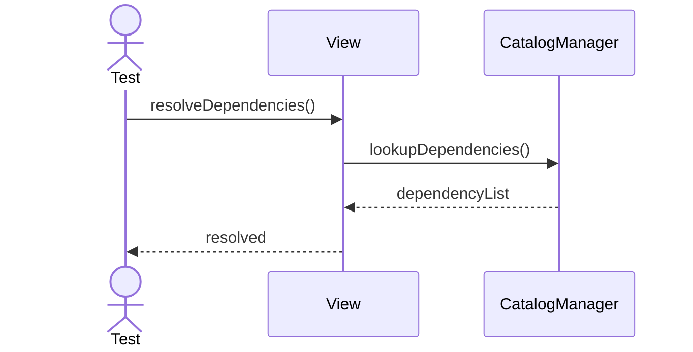

---

## 4. Validate Definition

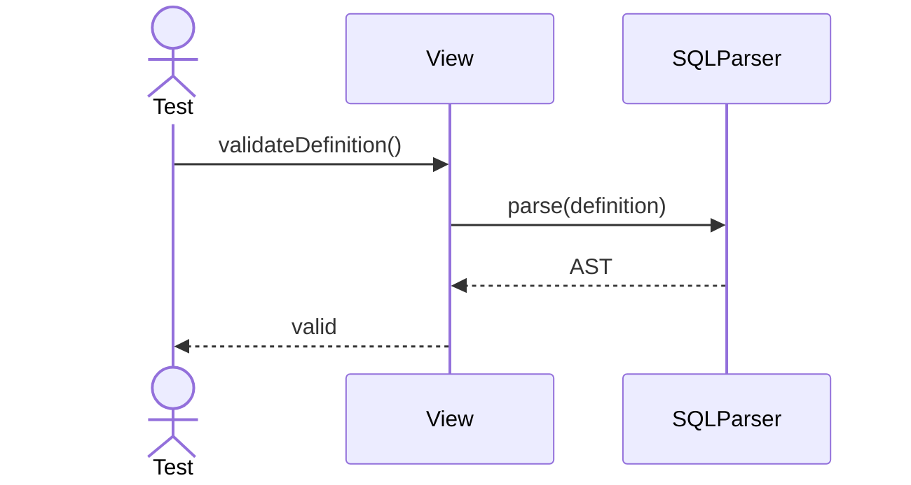

---

## 5. Drop View

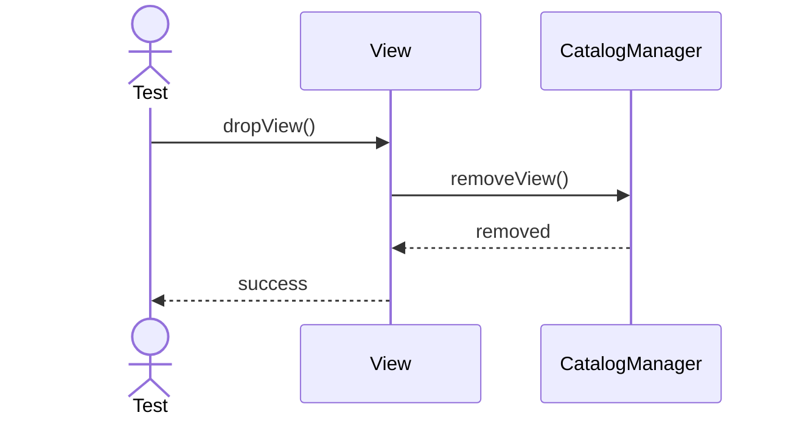

---

## 6. Rename View

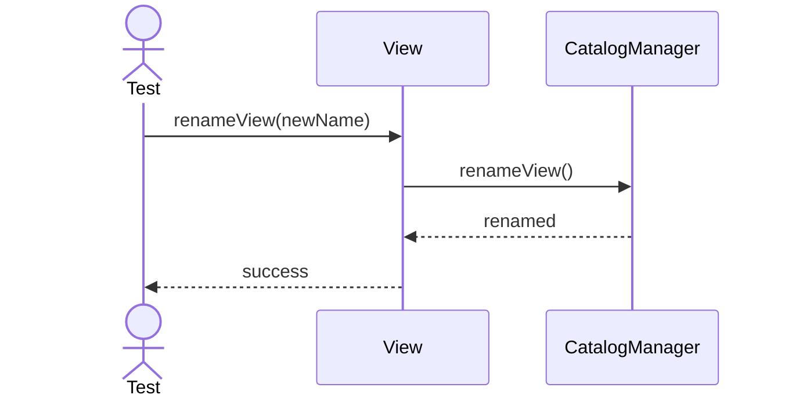

---

## 7. Bind Query Text

---

## 8. Unbind Query Text

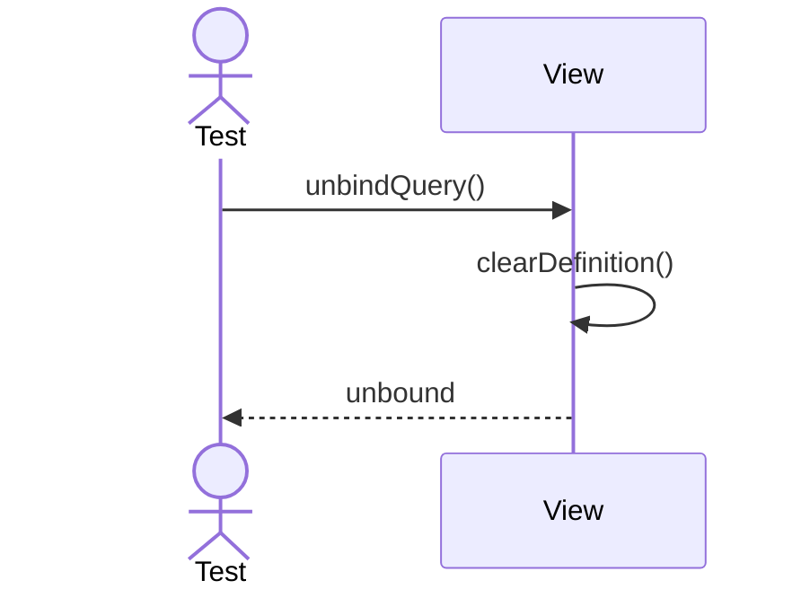

---

## 9. Check Materialized State

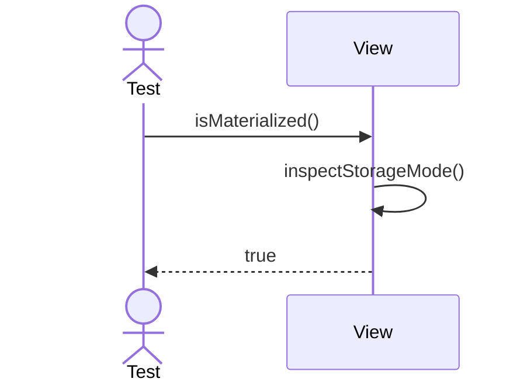

---

## 10. Check Up To Date

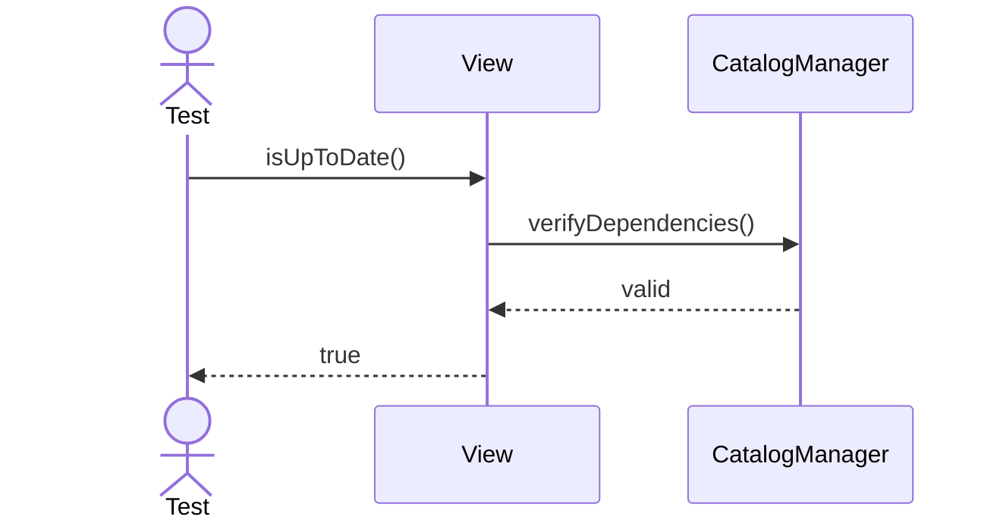

---

## 11. Resolve Schema

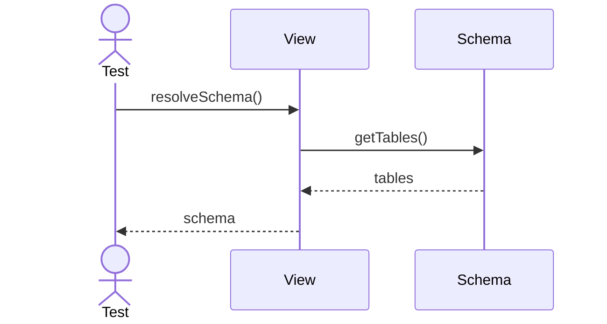

---

## 12. Resolve Columns

---

## 13. Export View Definition

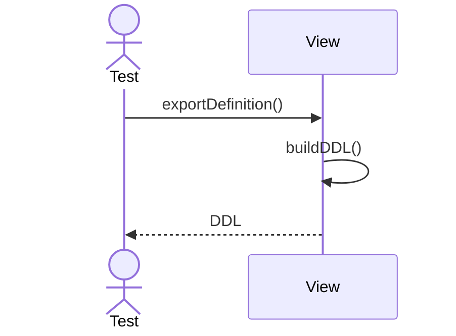

---

## 14. Refresh Cache

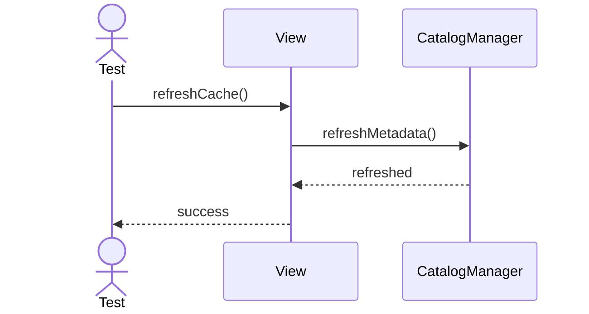

---

## 15. Compare Dependencies

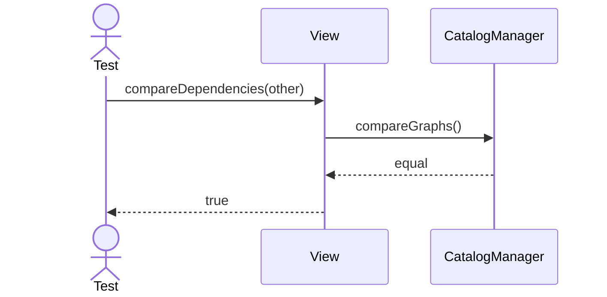

---

## 16. Validate Refresh SQL

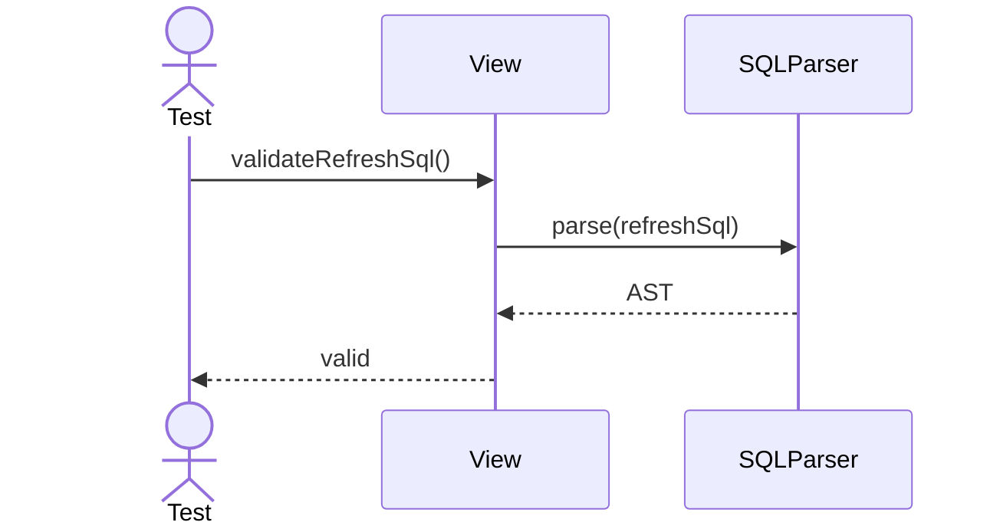

---

## 17. Capture Snapshot

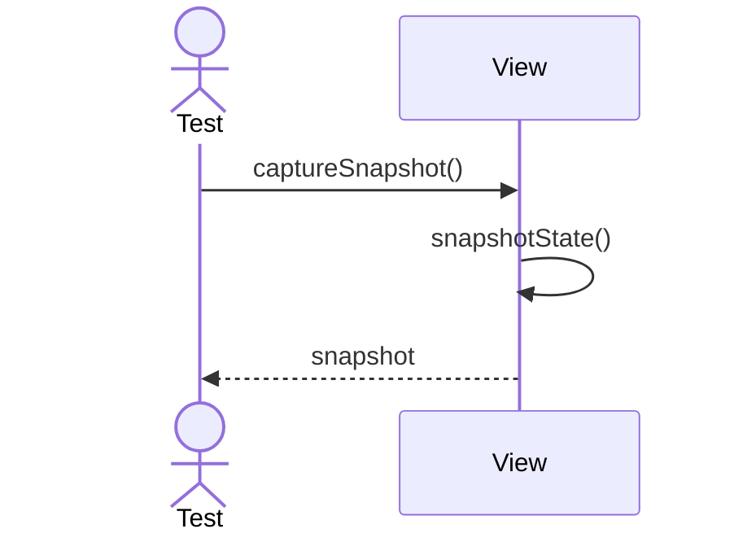

---

## 18. Restore Snapshot

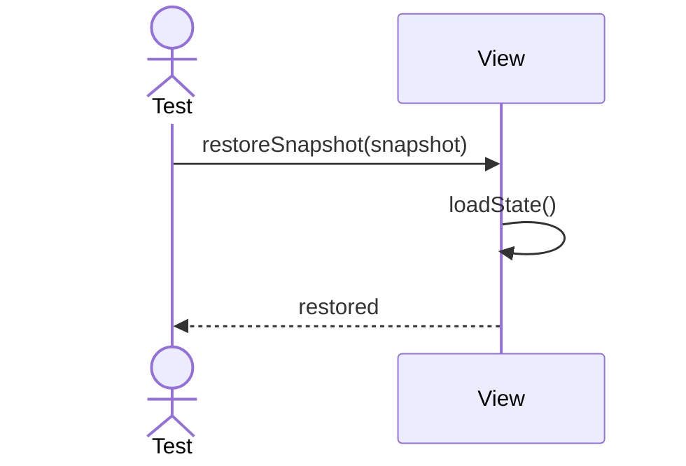

---

## 19. Export Dependency Graph

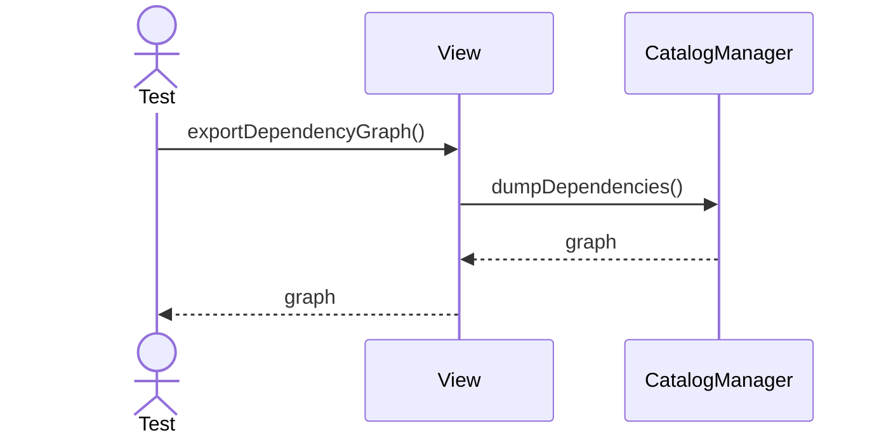

---

## 20. Reset View State

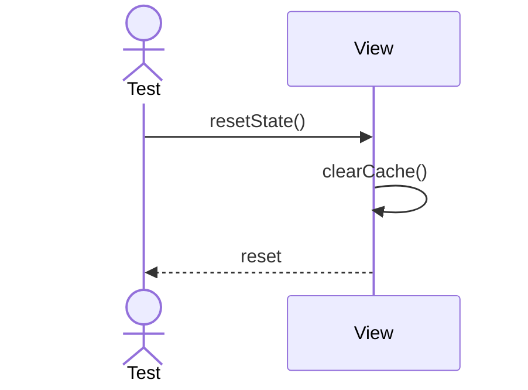
