# CatalogManager Testing - Main Functional Sequences

---

## 1. Register Object

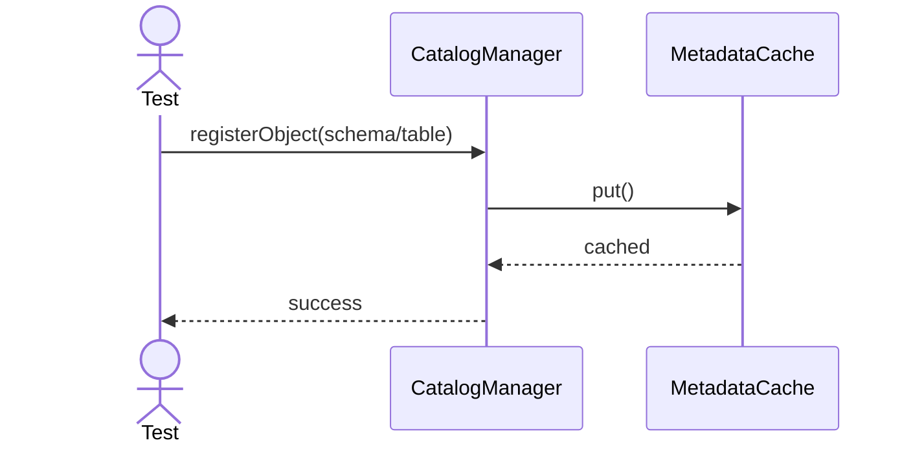

---

## 2. Lookup Object

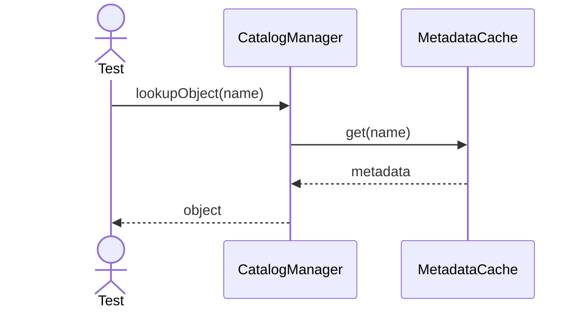

---

## 3. Refresh Metadata

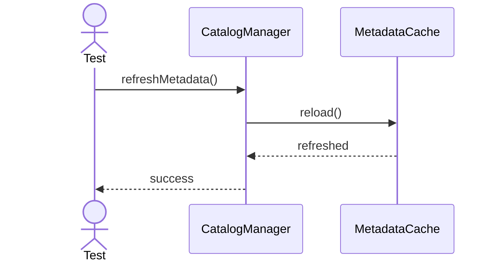

---

## 4. Resolve Dependency

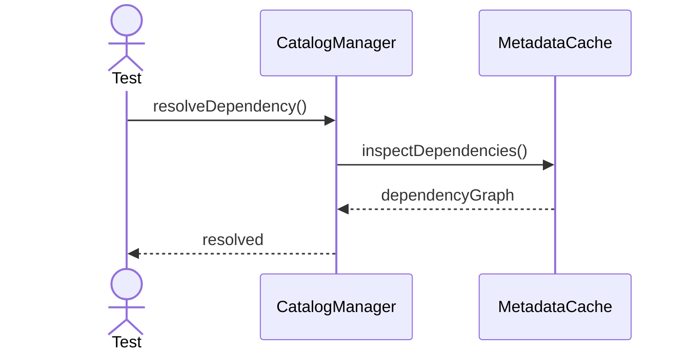

---

## 5. Register Table Schema

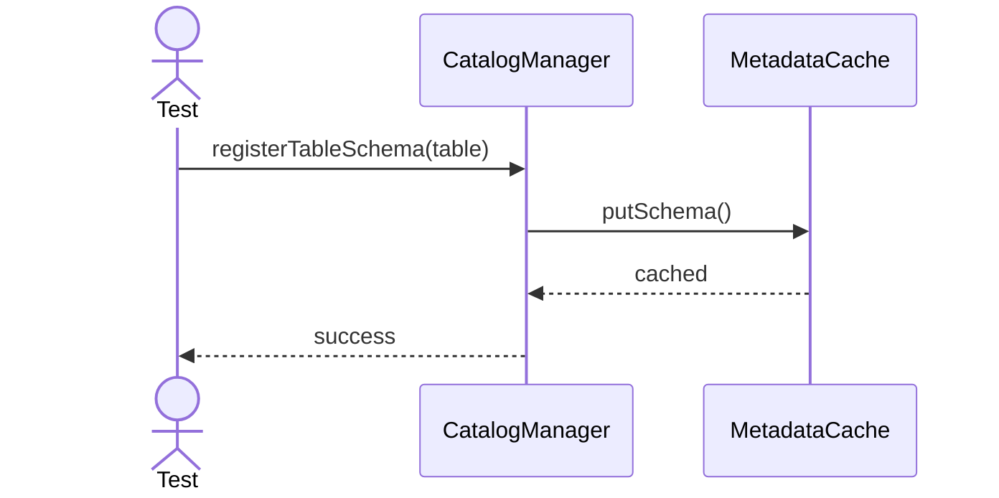

---

## 6. Lookup By Id

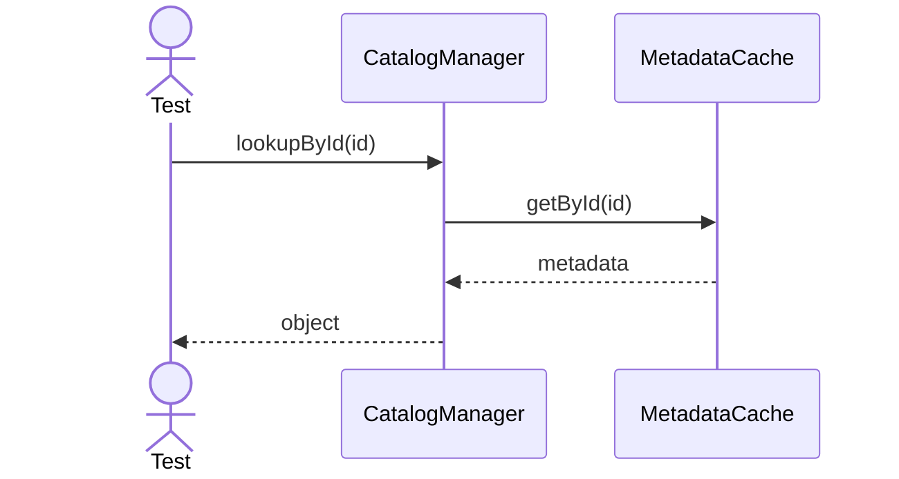

---

## 7. Lookup By Schema

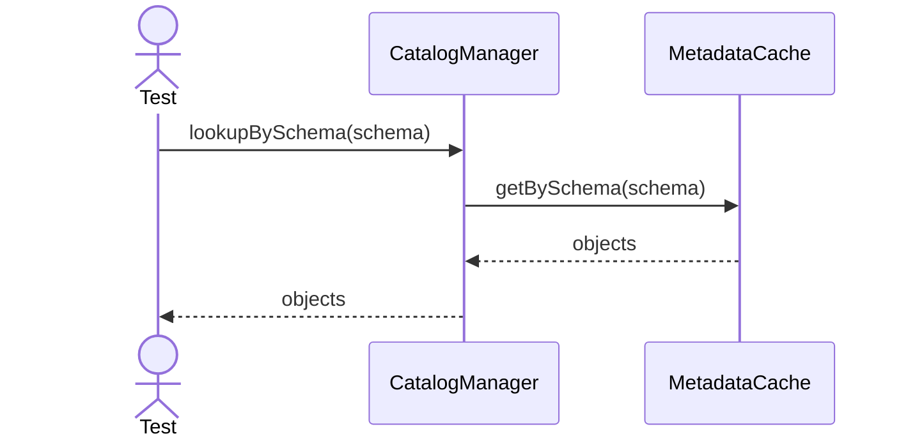

---

## 8. Remove Object

---

## 9. Clear Cache

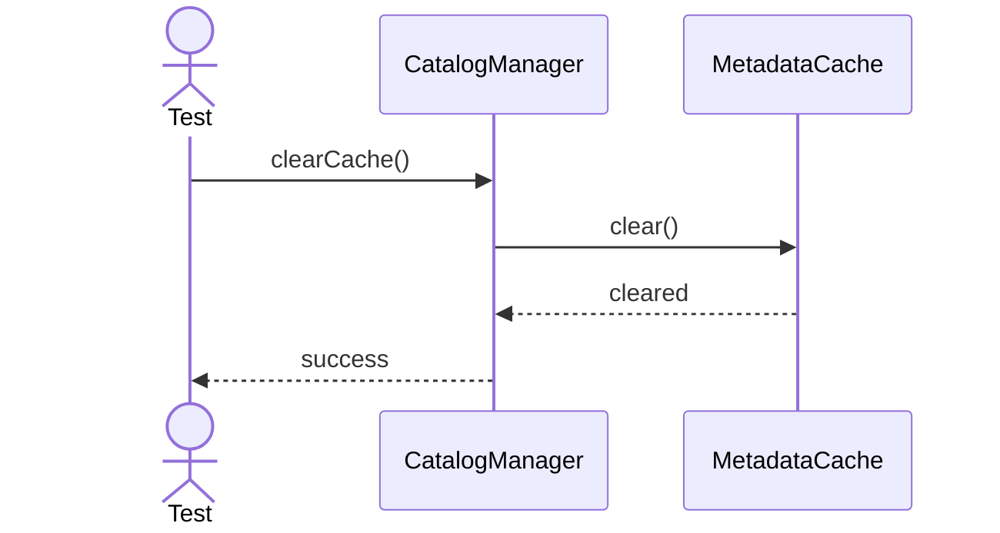

---

## 10. Reload Catalog

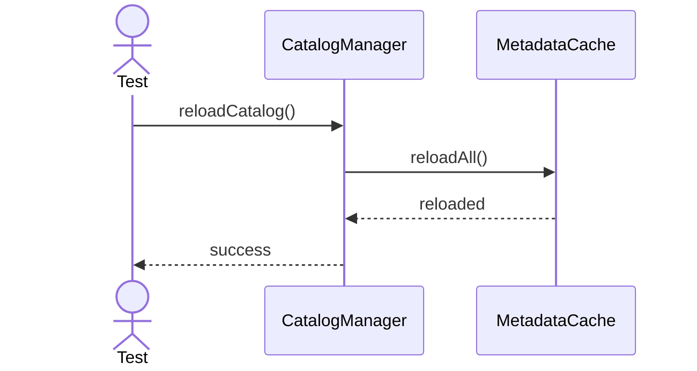

---

## 11. Update Statistics

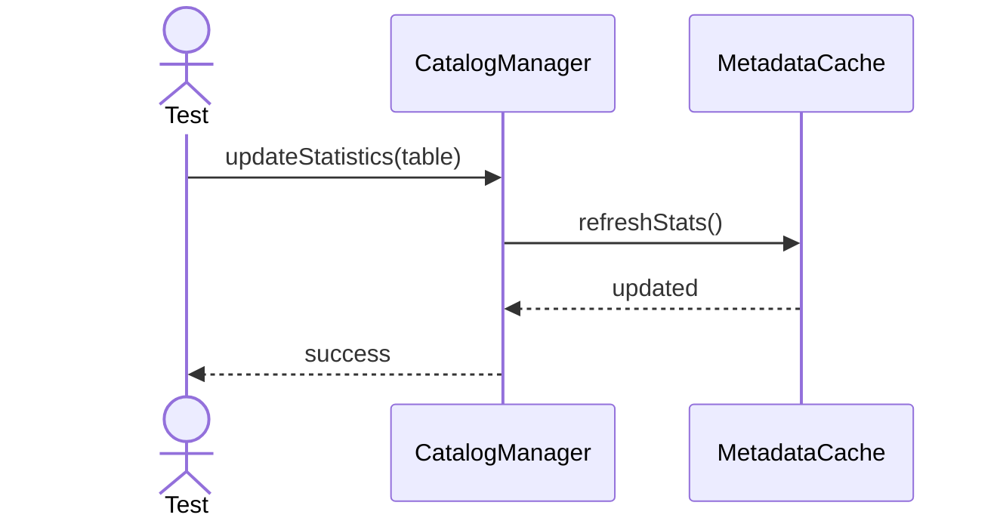

---

## 12. Resolve Foreign Key

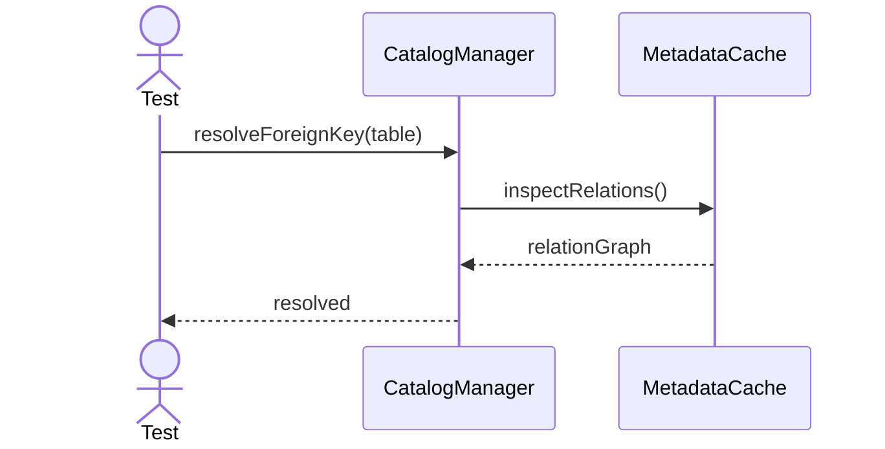

---

## 13. Resolve Index Metadata

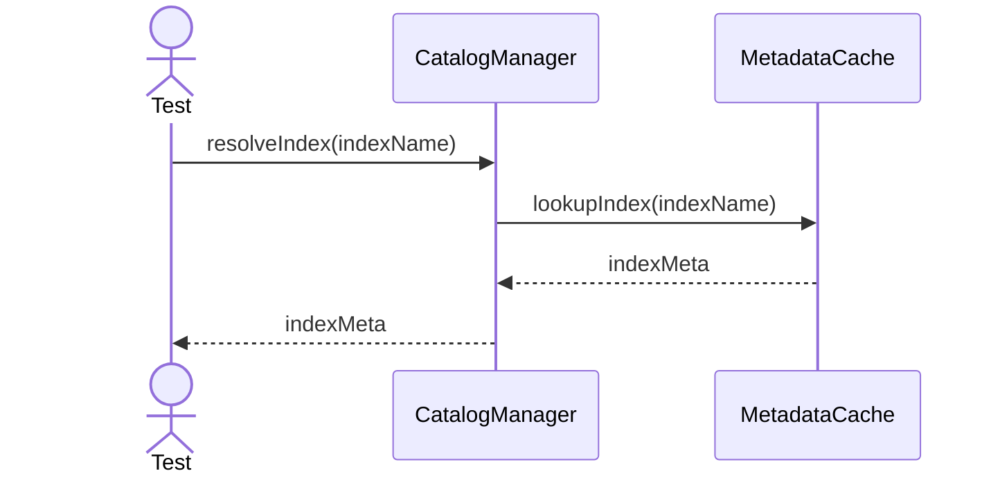

---

## 14. Resolve View Metadata

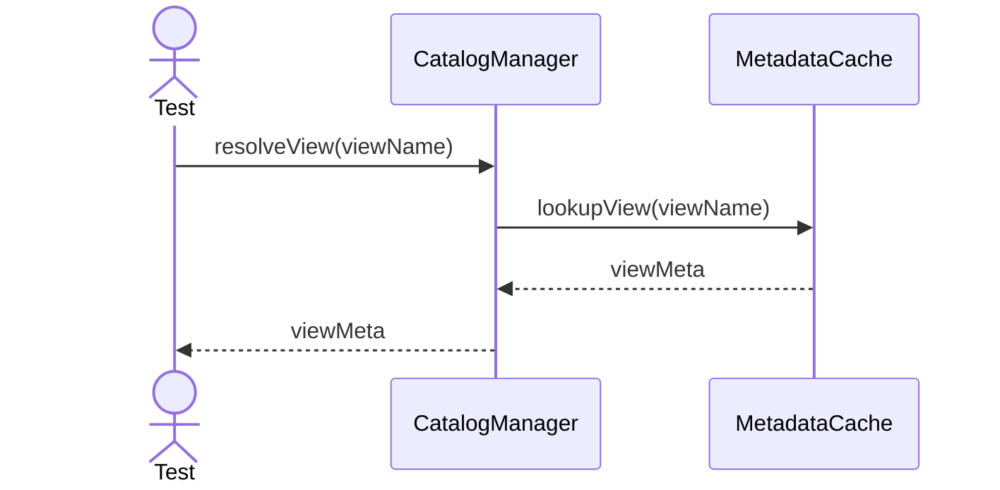

---

## 15. Resolve Procedure Metadata

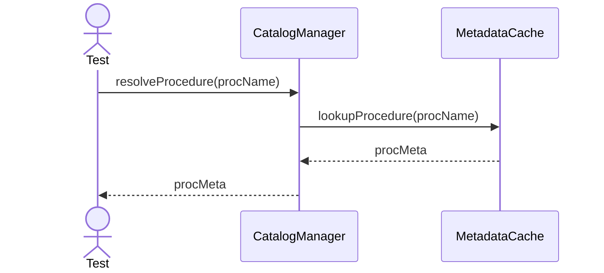

---

## 16. Resolve Trigger Metadata

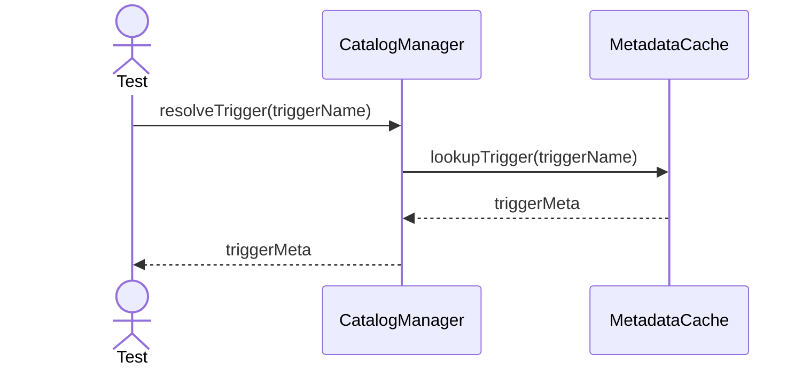

---

## 17. Resolve Sequence Metadata

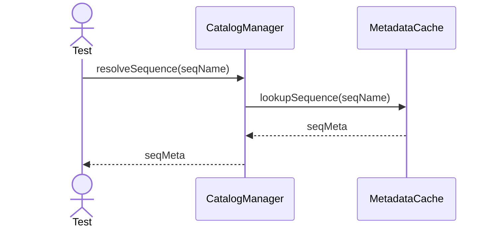

---

## 18. Refresh Object Cache

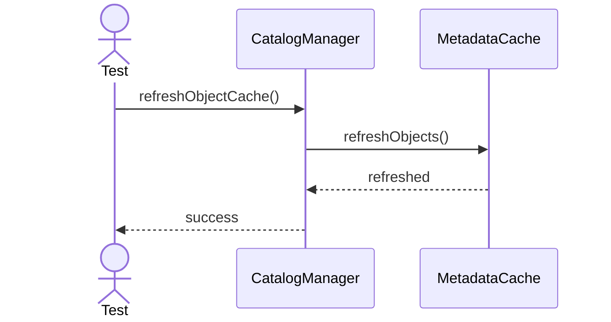

---

## 19. Verify Catalog Consistency

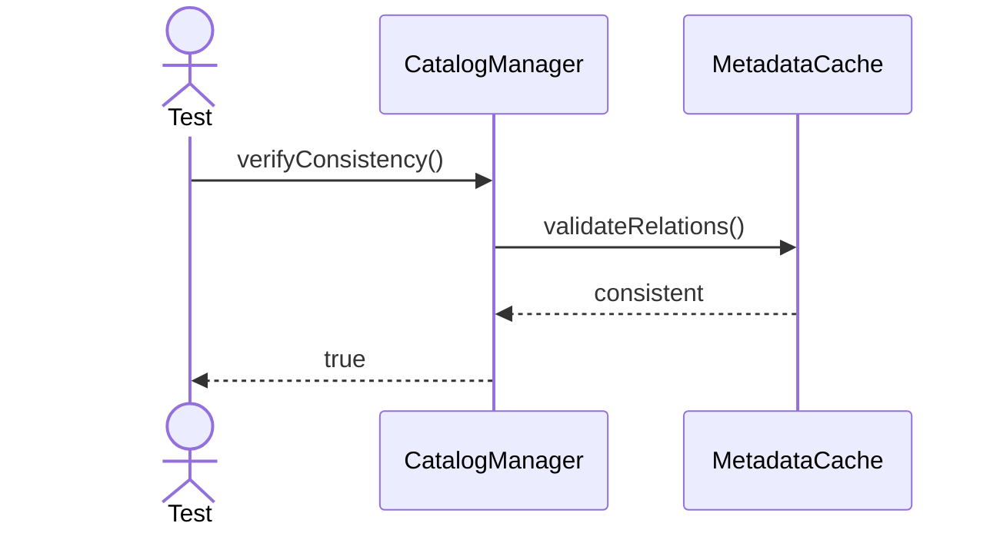

---

## 20. Export Catalog Snapshot

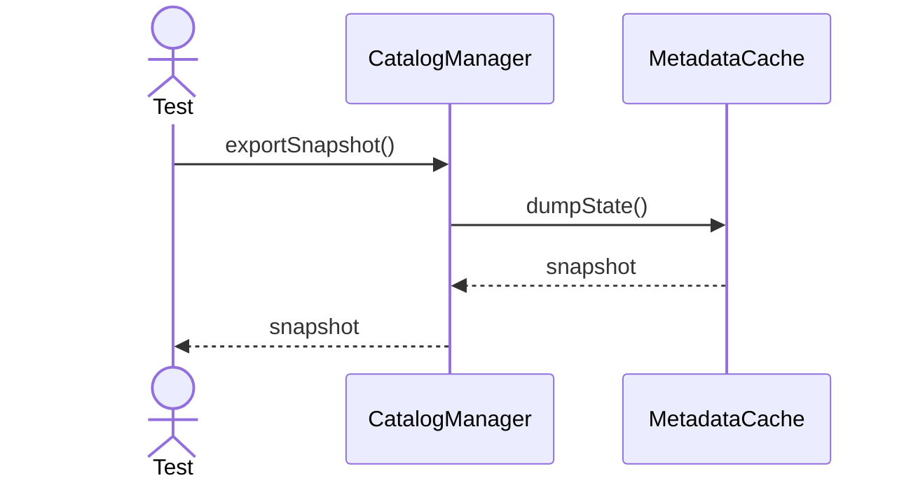
