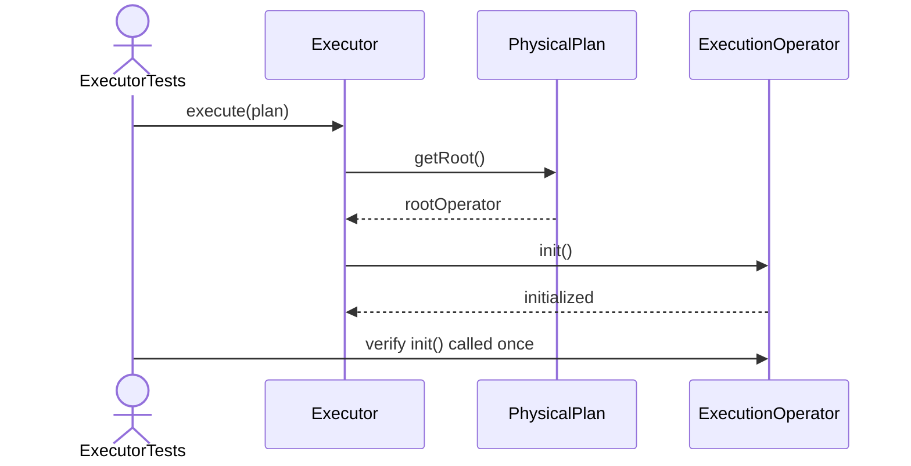
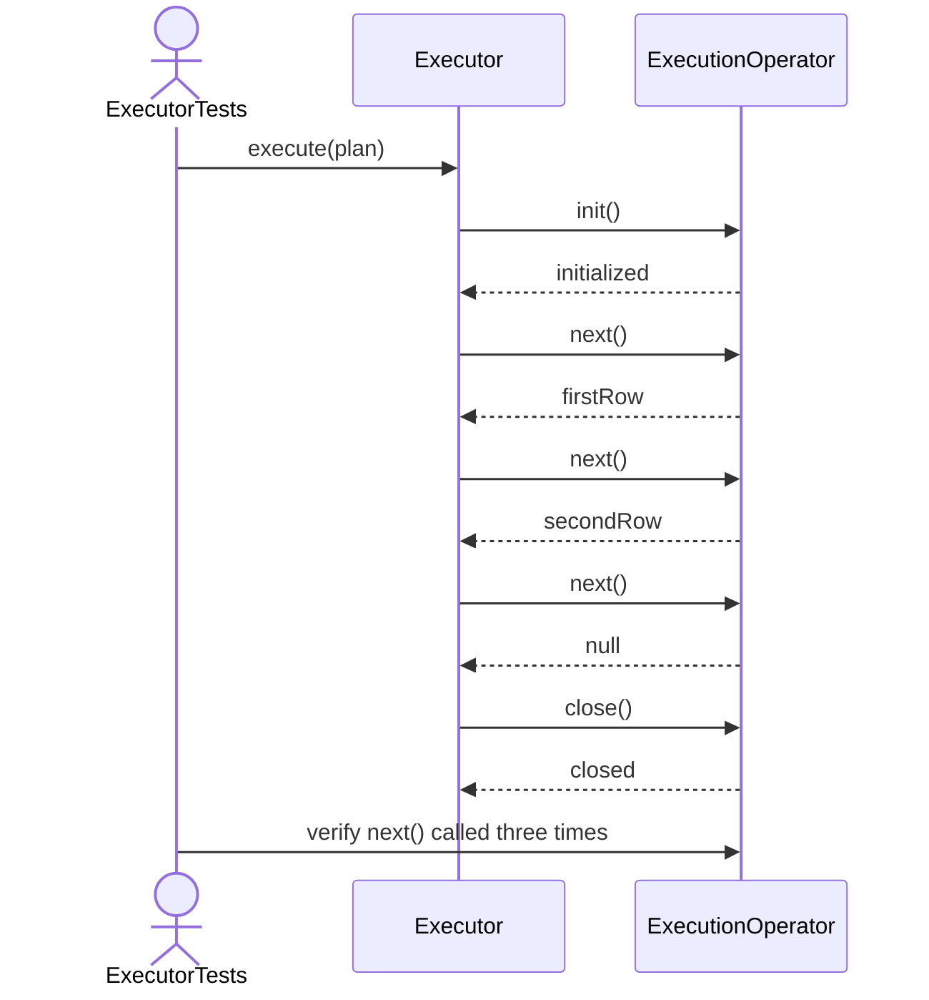
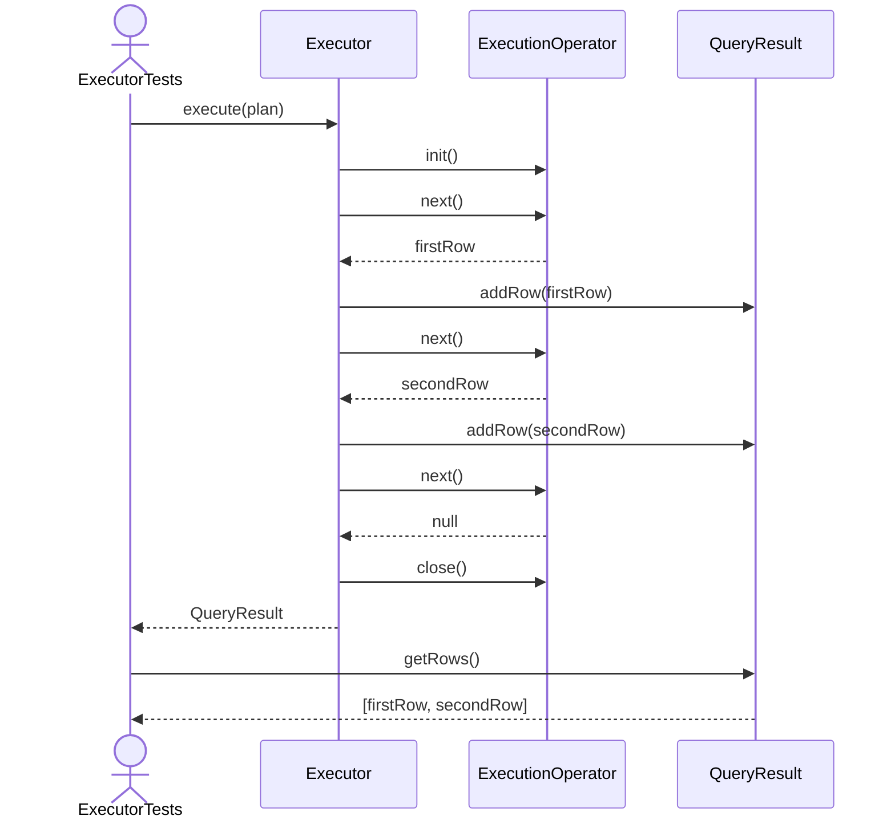
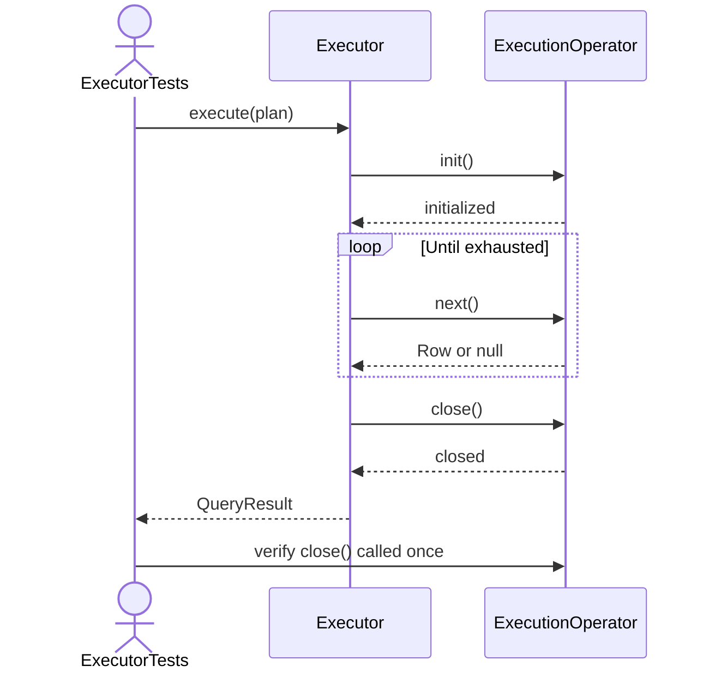

Executor Test Sequence Diagrams

1. Execute_ShouldInitializeRootOperator

2. Execute_ShouldPullRowsUntilNull

3. Execute_ShouldAddRowsToResult

4. Execute_ShouldCloseRootOperator

5. Execute_ShouldCloseOperatorWhenNextThrows
```mermaid
sequenceDiagram
    actor Test as ExecutorTests
    participant Executor
    participant Root as ExecutionOperator

    Test->>Executor: execute(plan)
    Executor->>Root: init()
    Root-->>Executor: initialized

    Executor->>Root: next()
    Root-->>Executor: RuntimeException

    Executor->>Root: close()
    Root-->>Executor: closed

    Executor-->>Test: rethrow RuntimeException
    Test->>Test: assertThrows(RuntimeException)
    Test->>Root: verify close() called once
    ```