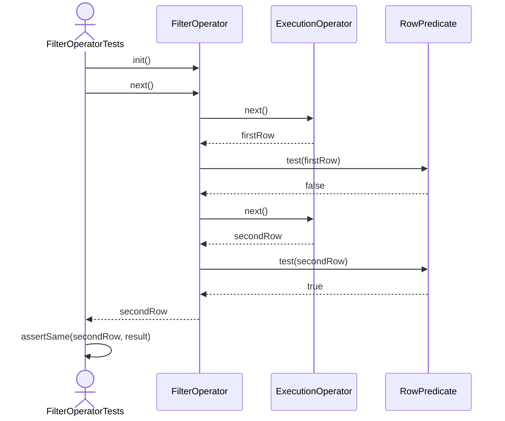
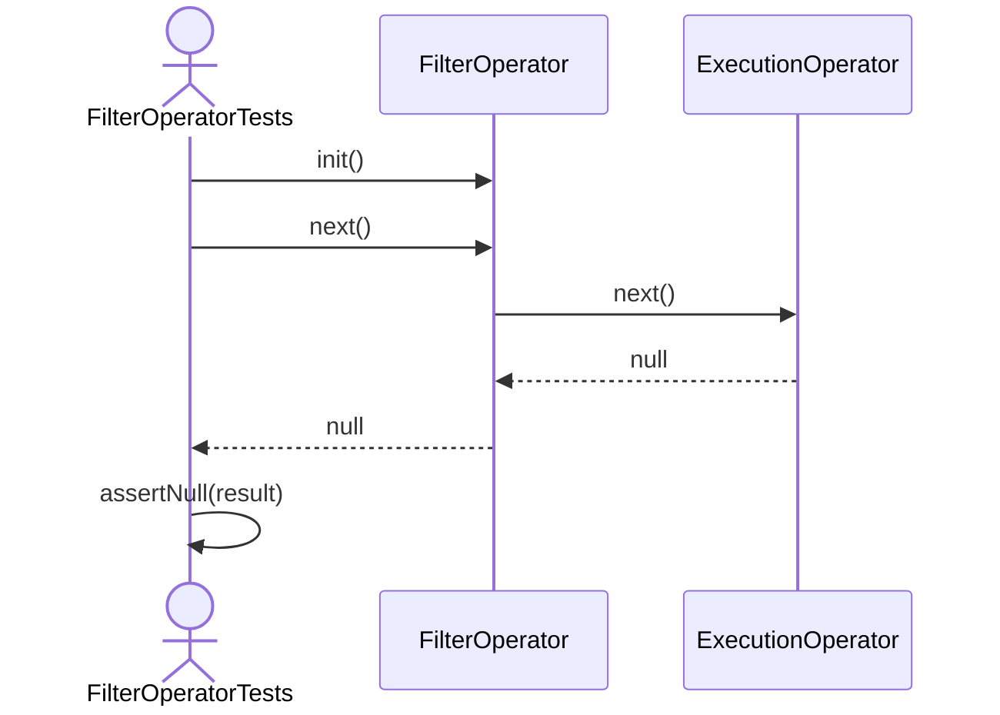
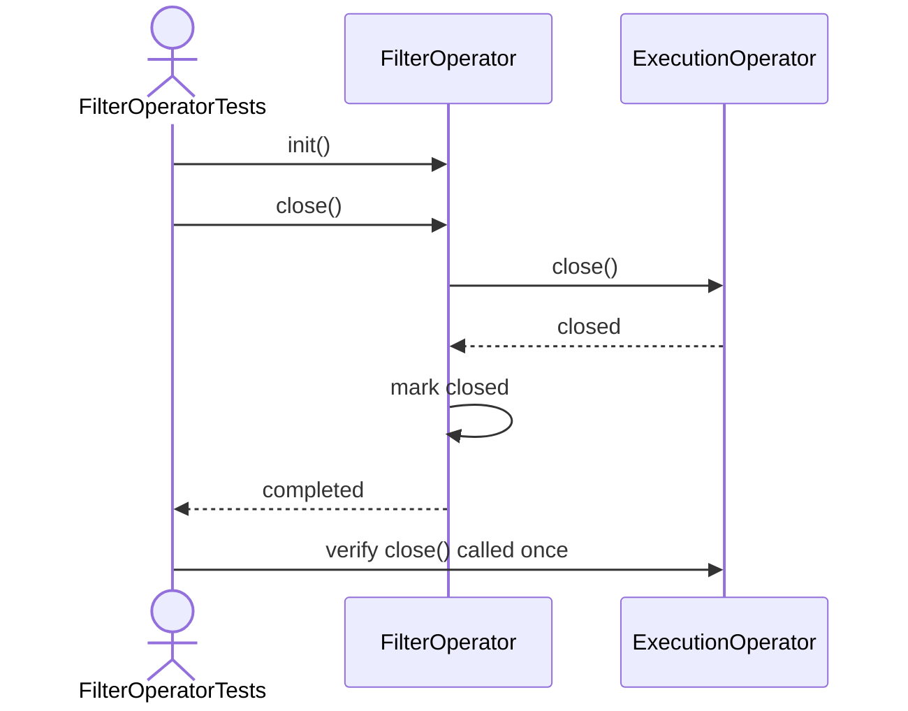

FilterOperator Test Sequence Diagrams

1. Init_ShouldInitializeChild
```mermaid

sequenceDiagram
    actor Test as FilterOperatorTests
    participant Filter as FilterOperator
    participant Child as ExecutionOperator

    Test->>Filter: new FilterOperator(child, predicate)
    Test->>Filter: init()
    Filter->>Child: init()
    Child-->>Filter: initialized
    Filter->>Filter: mark initialized
    Filter-->>Test: completed
    Test->>Child: verify init() called once
    ```
2. Next_ShouldReturnMatchingRow
```mermaid

sequenceDiagram
    actor Test as FilterOperatorTests
    participant Filter as FilterOperator
    participant Child as ExecutionOperator
    participant Predicate as RowPredicate

    Test->>Filter: init()
    Test->>Filter: next()
    Filter->>Child: next()
    Child-->>Filter: matchingRow
    Filter->>Predicate: test(matchingRow)
    Predicate-->>Filter: true
    Filter-->>Test: matchingRow
    Test->>Test: assertSame(matchingRow, result)
```
3. Next_ShouldSkipNonMatchingRows

4. Next_ShouldReturnNullWhenChildExhausted

5. Close_ShouldCloseChild

6. Predicate_ShouldReceiveEachRow
```mermaid
sequenceDiagram
    actor Test as FilterOperatorTests
    participant Filter as FilterOperator
    participant Child as ExecutionOperator
    participant Predicate as RowPredicate

    Test->>Filter: init()
    Test->>Filter: next()

    Child-->>Filter: firstRow
    Filter->>Predicate: test(firstRow)
    Predicate-->>Filter: false

    Child-->>Filter: secondRow
    Filter->>Predicate: test(secondRow)
    Predicate-->>Filter: false

    Child-->>Filter: thirdRow
    Filter->>Predicate: test(thirdRow)
    Predicate-->>Filter: true

    Filter-->>Test: thirdRow
    Test->>Predicate: verify test(firstRow)
    Test->>Predicate: verify test(secondRow)
    Test->>Predicate: verify test(thirdRow)
    ```