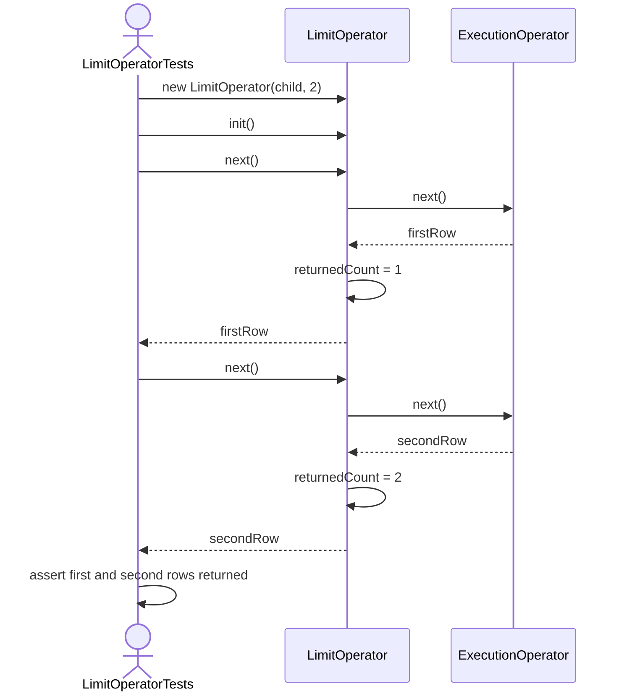
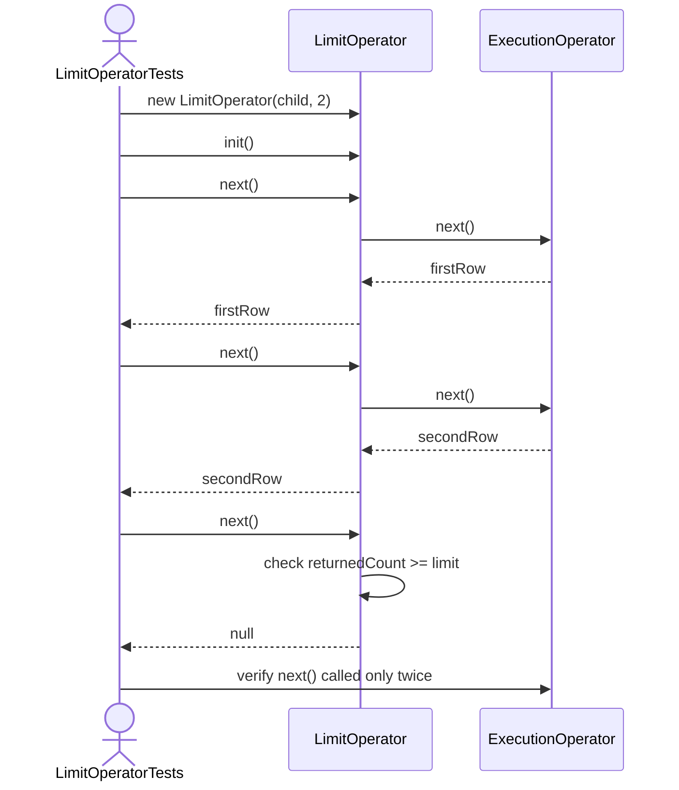
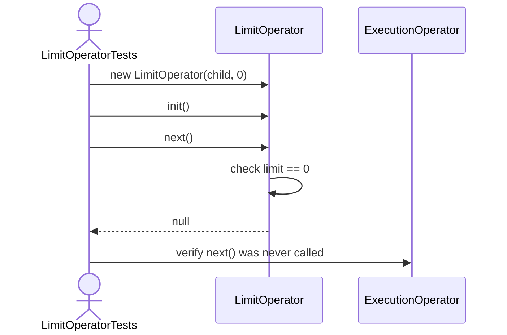
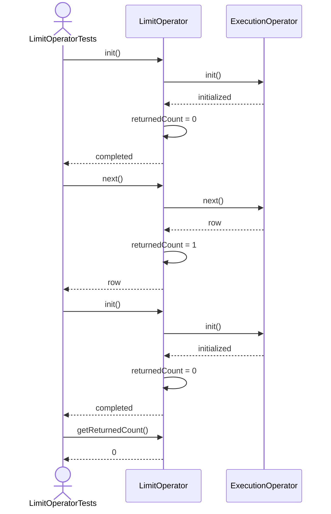

LimitOperator Test Sequence Diagrams

1. Next_ShouldReturnRowsUpToLimit

2. Next_ShouldReturnNullAfterLimitReached

3. LimitZero_ShouldReturnNoRows

4. Init_ShouldResetReturnedCount

5. Close_ShouldCloseChild
```mermaid
sequenceDiagram
    actor Test as LimitOperatorTests
    participant Limit as LimitOperator
    participant Child as ExecutionOperator

    Test->>Limit: init()
    Test->>Limit: close()
    Limit->>Child: close()
    Child-->>Limit: closed
    Limit->>Limit: mark closed
    Limit-->>Test: completed
    Test->>Child: verify close() called once
    ```