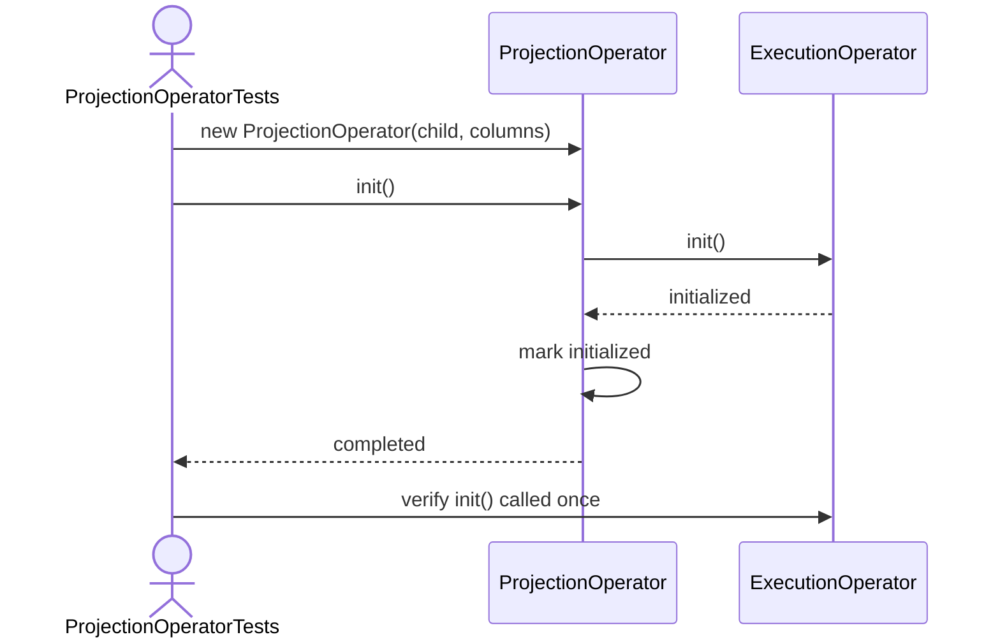
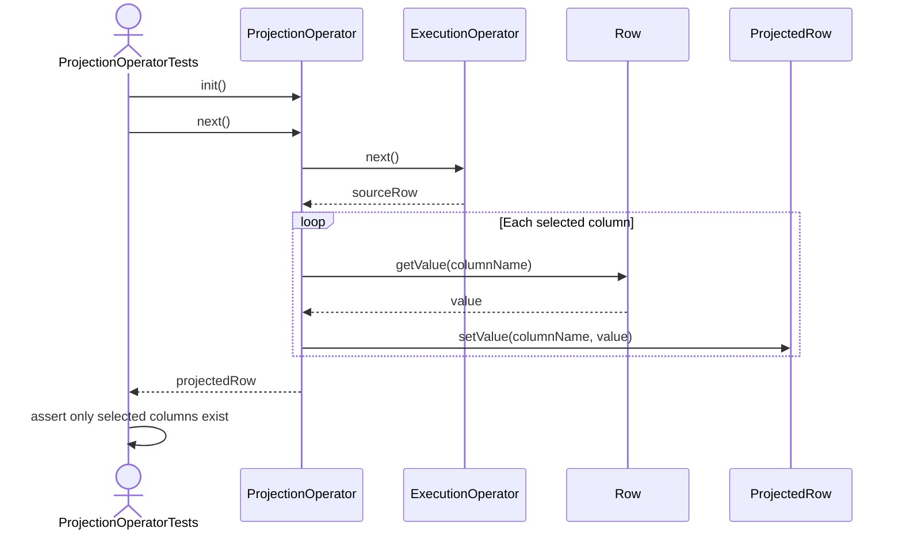
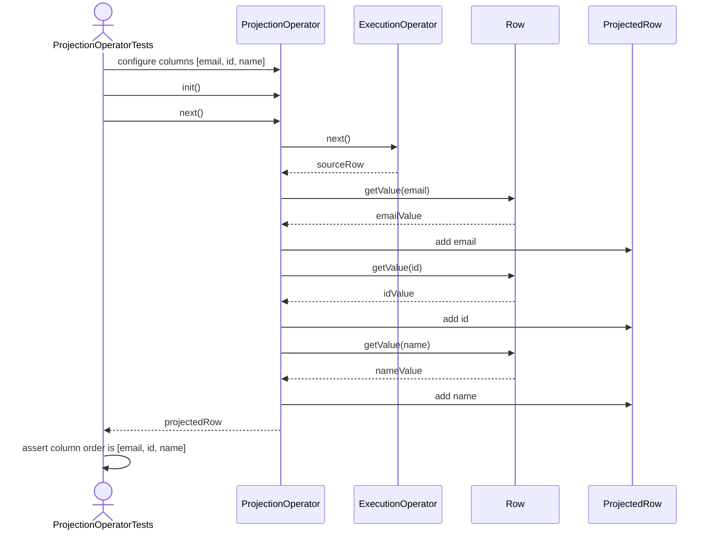
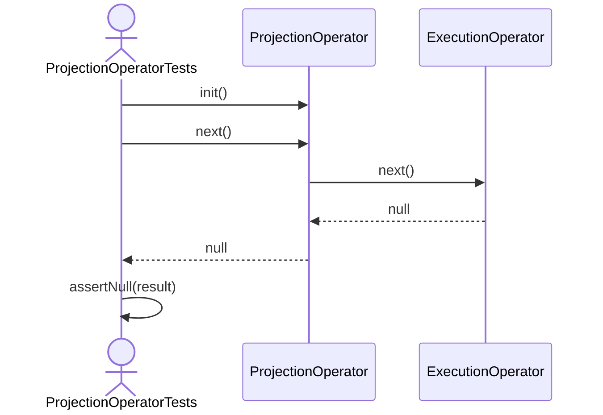

ProjectionOperator Test Sequence Diagrams

1. Init_ShouldInitializeChild

2. Next_ShouldReturnSelectedColumns

3. Next_ShouldPreserveColumnOrder

4. Next_ShouldReturnNullWhenChildExhausted

5. Close_ShouldCloseChild
```mermaid
sequenceDiagram
    actor Test as ProjectionOperatorTests
    participant Projection as ProjectionOperator
    participant Child as ExecutionOperator

    Test->>Projection: init()
    Test->>Projection: close()
    Projection->>Child: close()
    Child-->>Projection: closed
    Projection->>Projection: mark closed
    Projection-->>Test: completed
    Test->>Child: verify close() called once
    ```