# QueryExecutor Testing - Main Functional Sequences

---

## 1. Execute SELECT

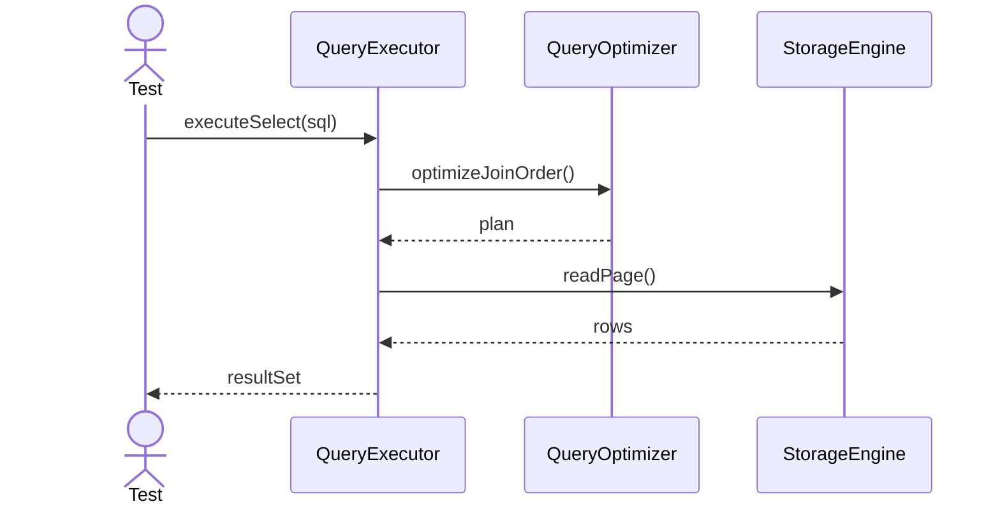

---

## 2. Execute INSERT

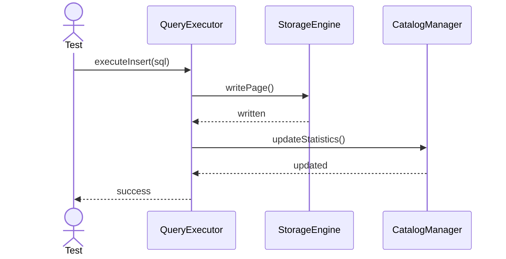

---

## 3. Execute JOIN

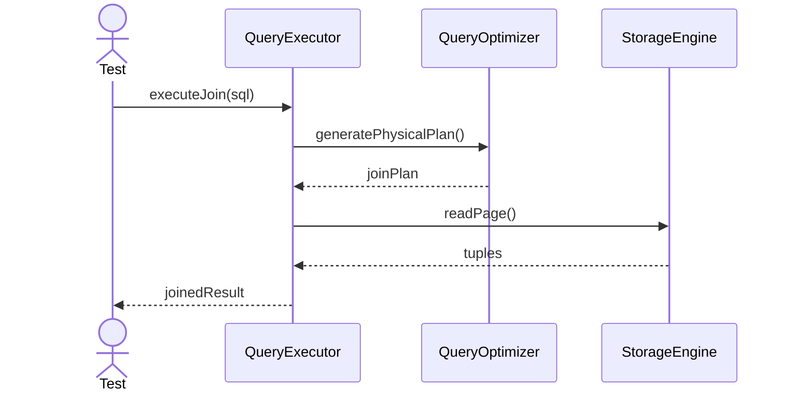

---

## 4. Cancel Execution

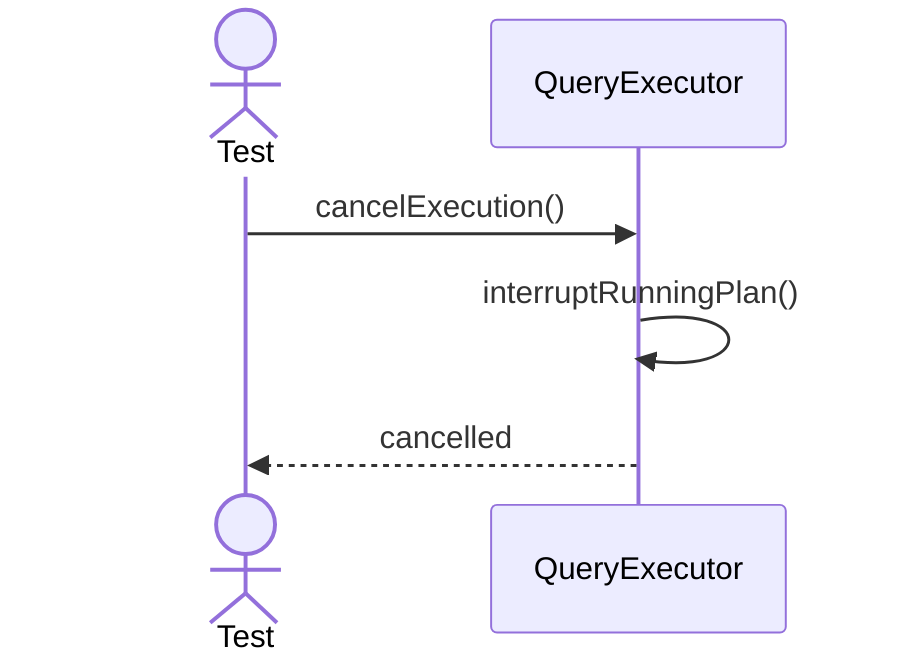

---

## 5. Execute UPDATE

---

## 6. Execute DELETE

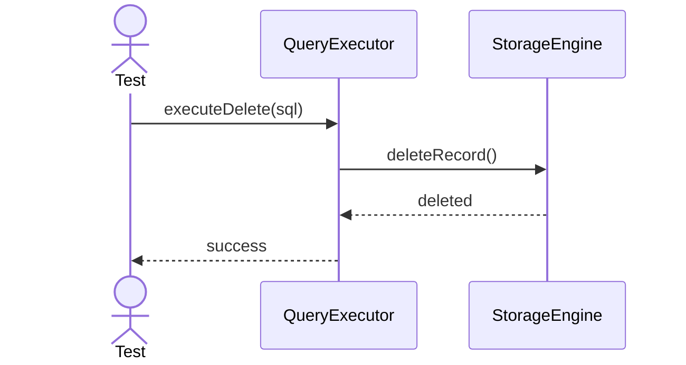

---

## 7. Execute AGGREGATE

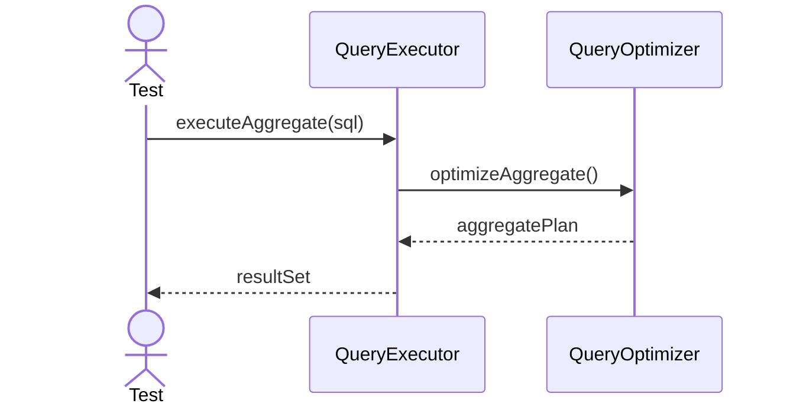

---

## 8. Execute GROUP BY

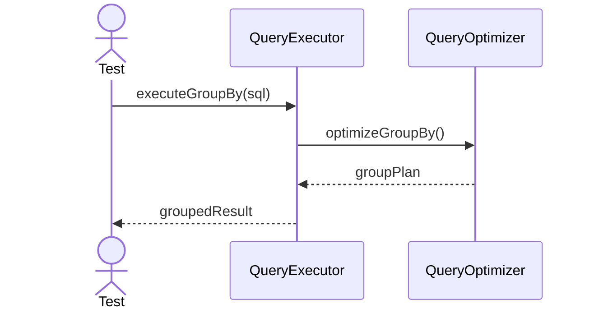

---

## 9. Execute SORT

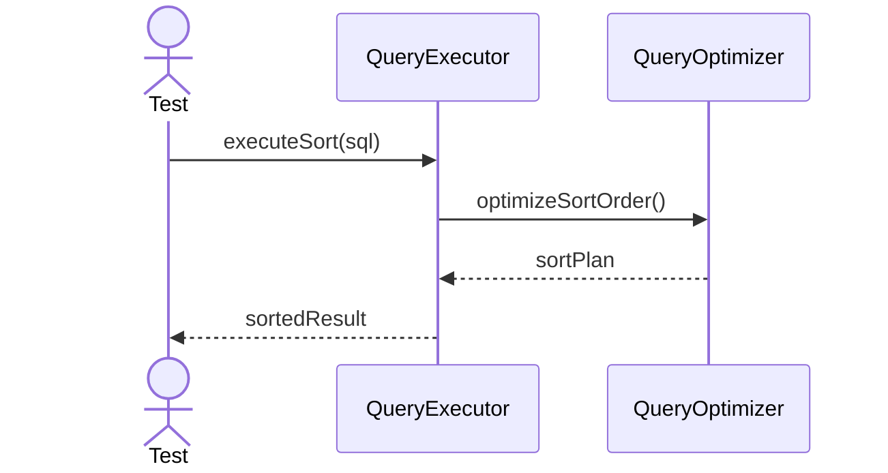

---

## 10. Execute PARALLEL

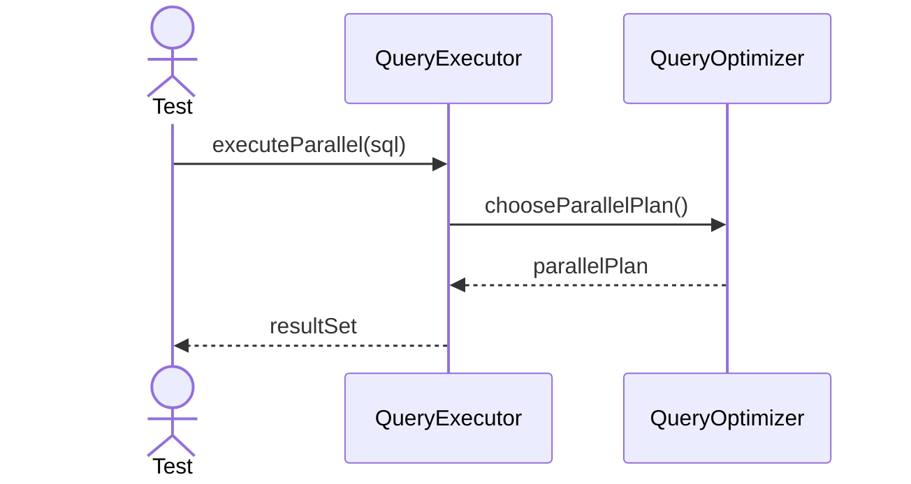

---

## 11. Execute SCAN

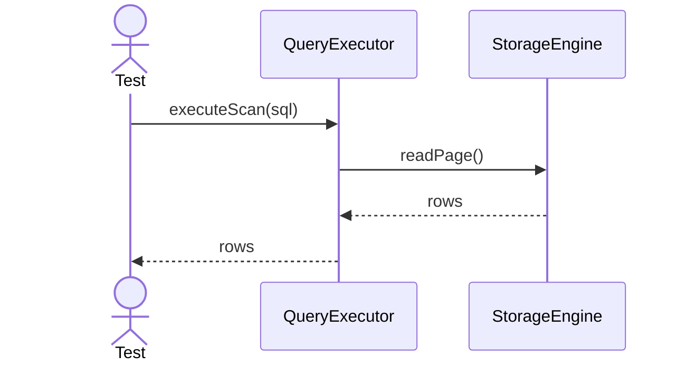

---

## 12. Execute FILTER

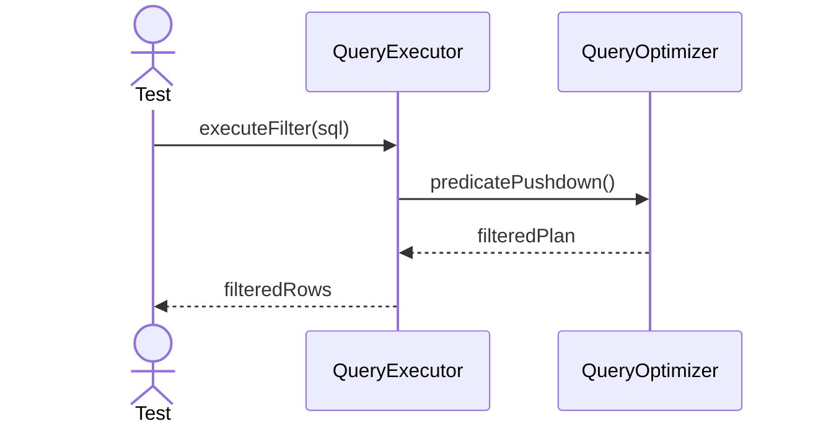

---

## 13. Execute DISTINCT

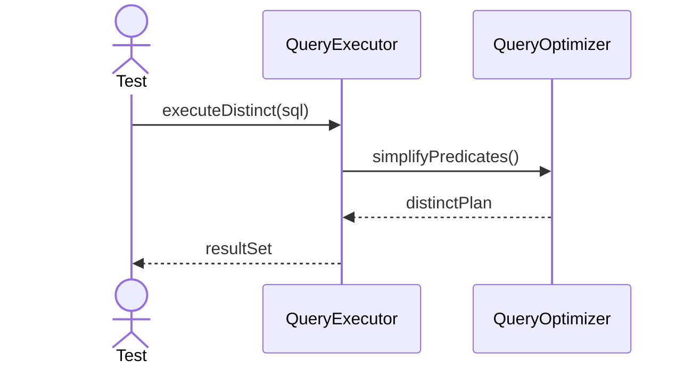

---

## 14. Execute LIMIT

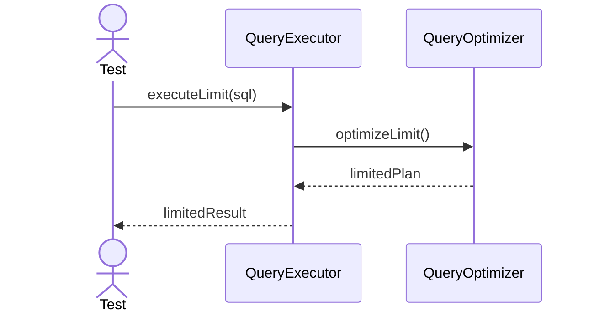

---

## 15. Execute OFFSET

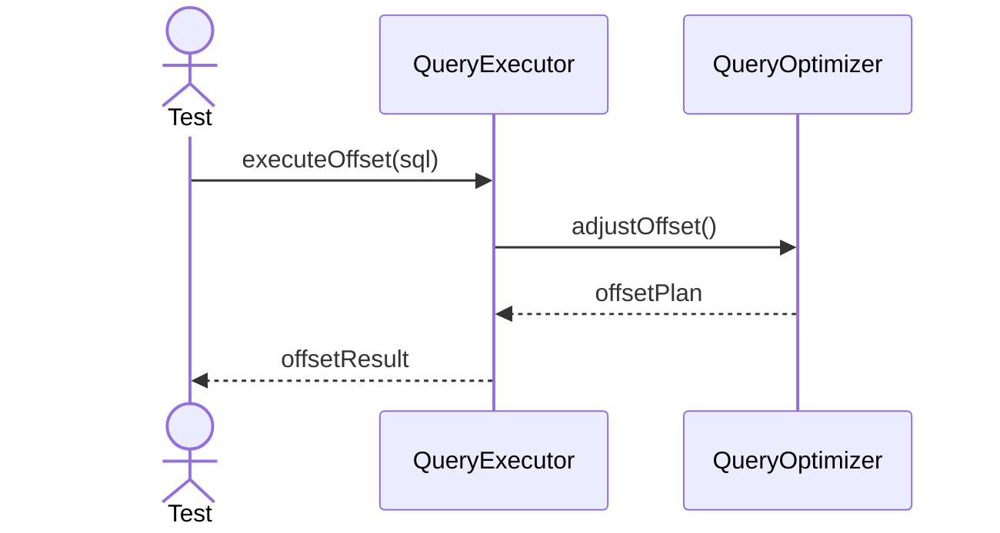

---

## 16. Execute READ ONLY

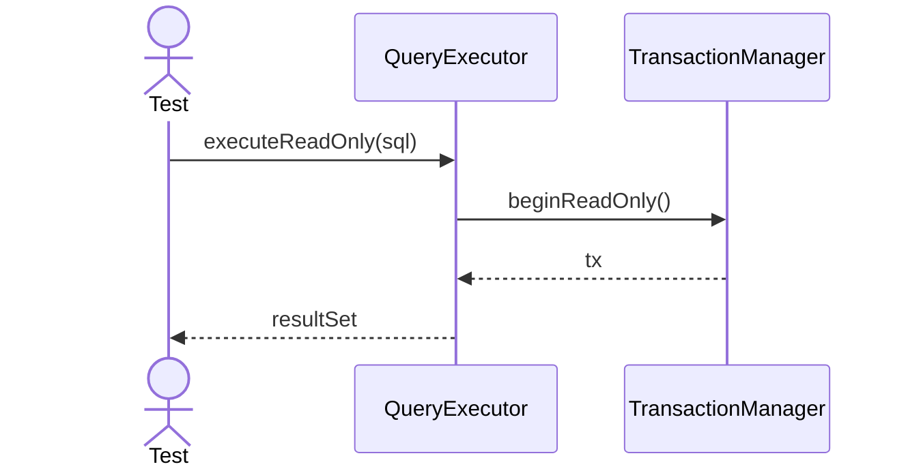

---

## 17. Execute With Savepoint

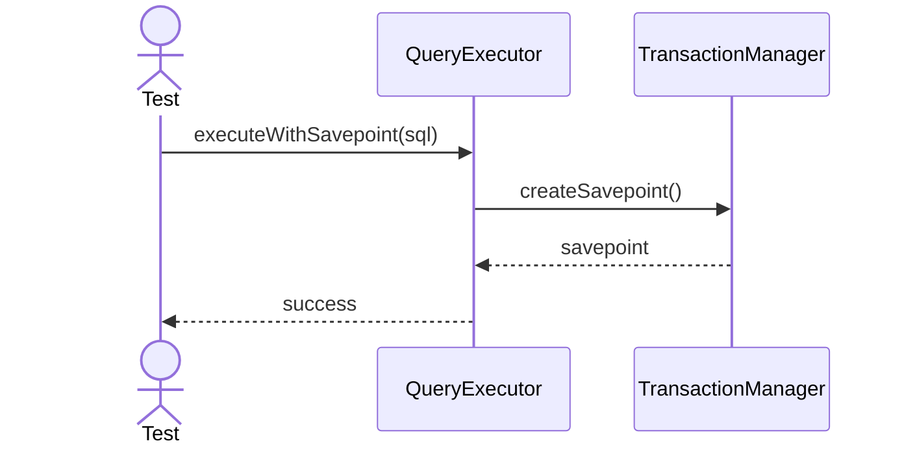

---

## 18. Execute Batch

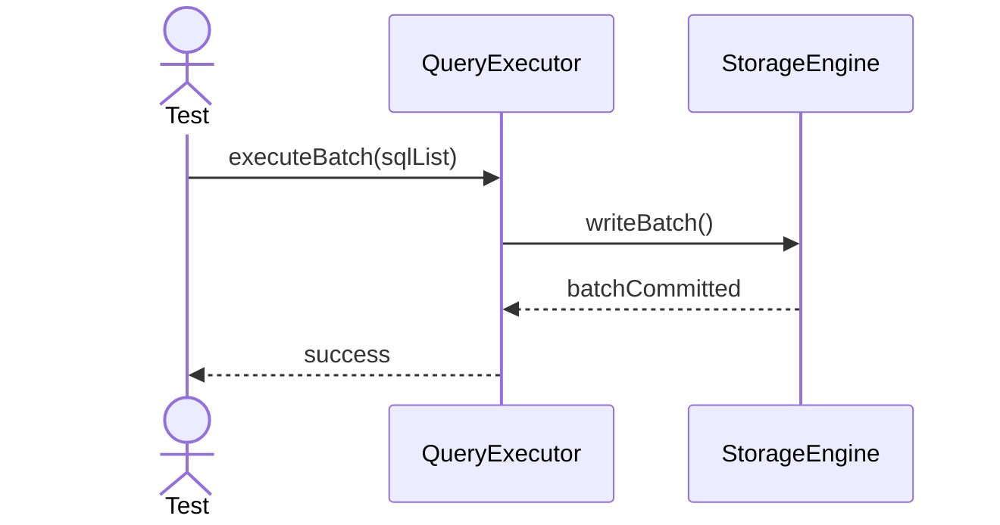

---

## 19. Execute Explain

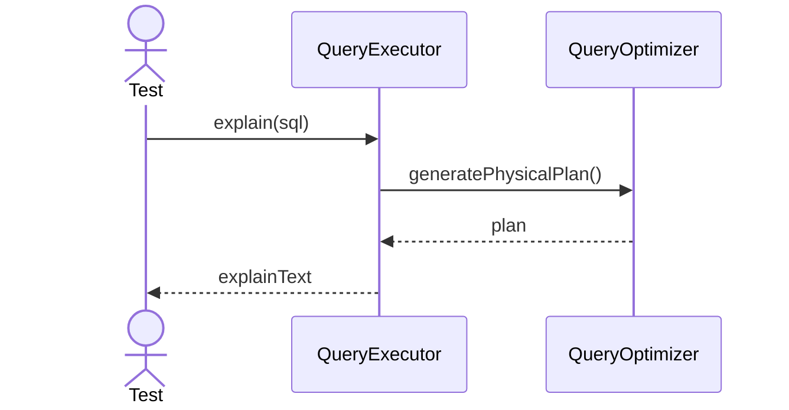

---

## 20. Execute Health Check

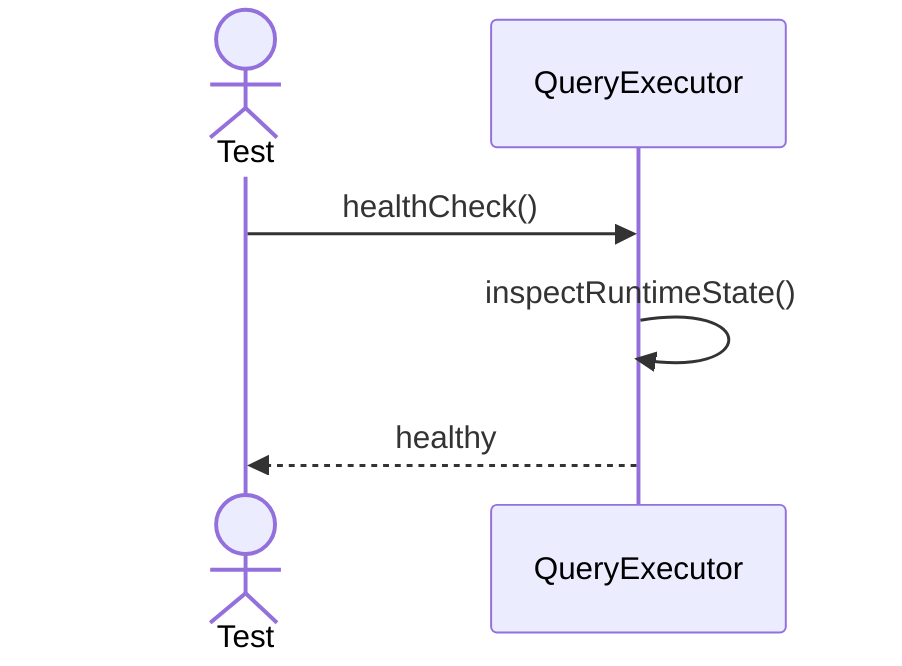
