# QueryOptimizer Testing - Main Functional Sequences

---

# Constructor Tests

## 1. Constructor_ShouldCreateOptimizer

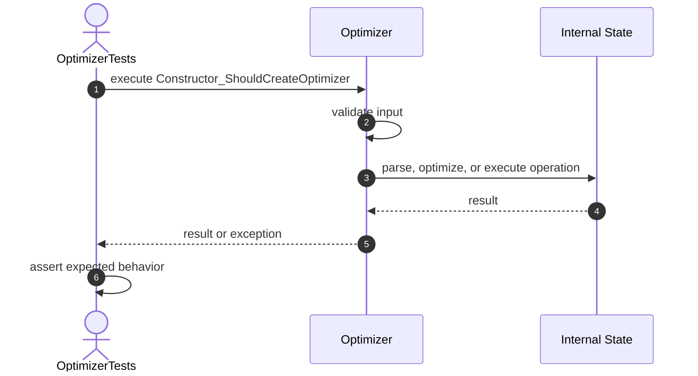

# QueryPlan Tests

## 2. QueryPlan_ShouldStoreOperations

## 3. QueryPlan_ShouldStoreEstimatedCost

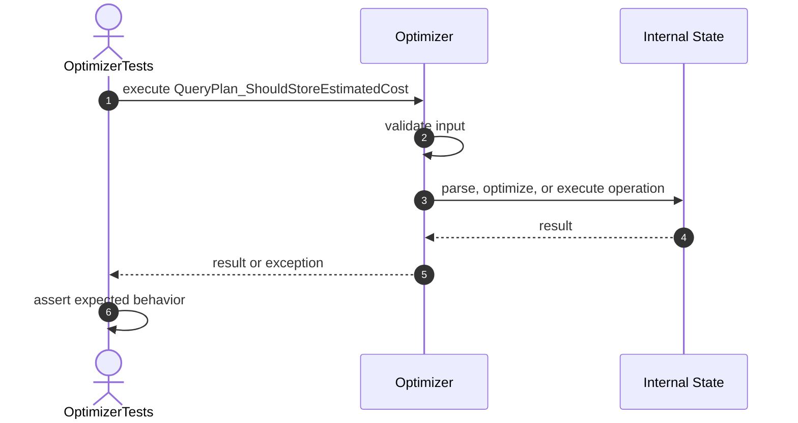

## 4. QueryPlan_ShouldRejectEmptyOperations

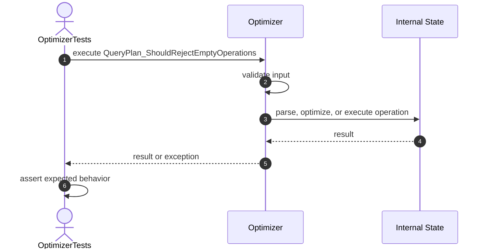

## 5. QueryPlan_ShouldRejectNegativeCost

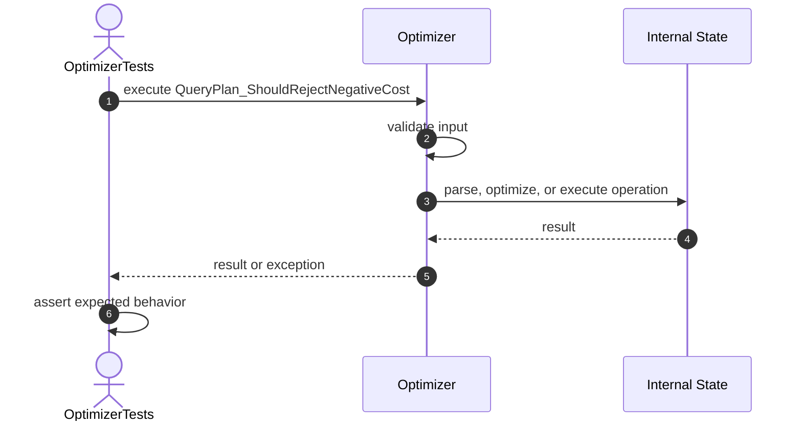

## 6. GetOperations_ShouldReturnUnmodifiableList

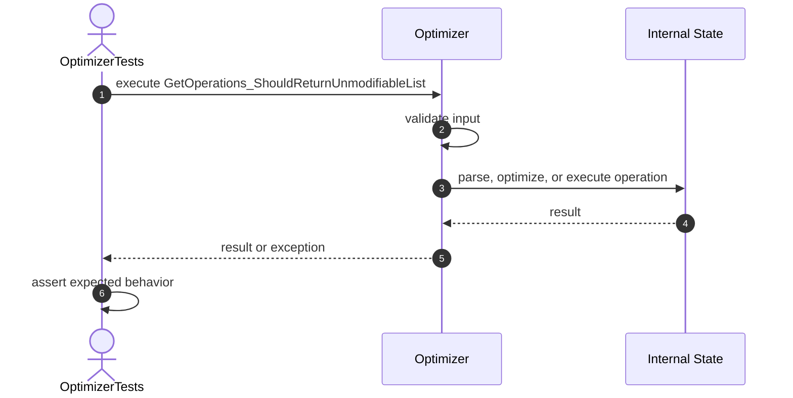

# Cost Tests

## 7. EstimateCost_ShouldCalculateTableScanCost

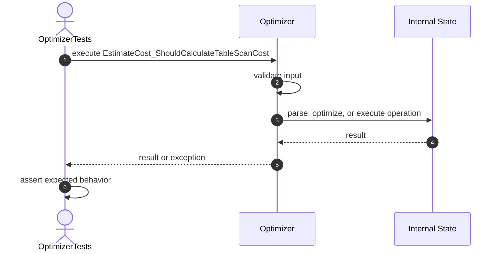

## 8. EstimateCost_ShouldCalculateIndexScanCost

## 9. EstimateCost_ShouldCalculateCombinedCost

## 10. EstimateCost_ShouldAssignHighCostToJoin

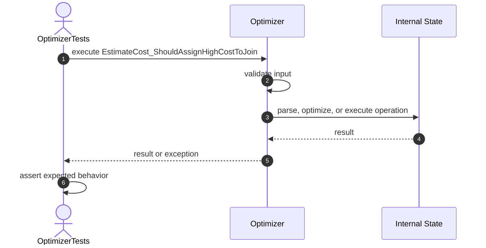

## 11. EstimateCost_ShouldRejectNullOperations

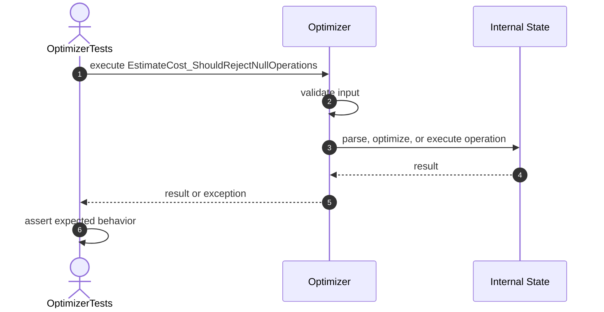

## 12. EstimateCost_ShouldRejectBlankOperation

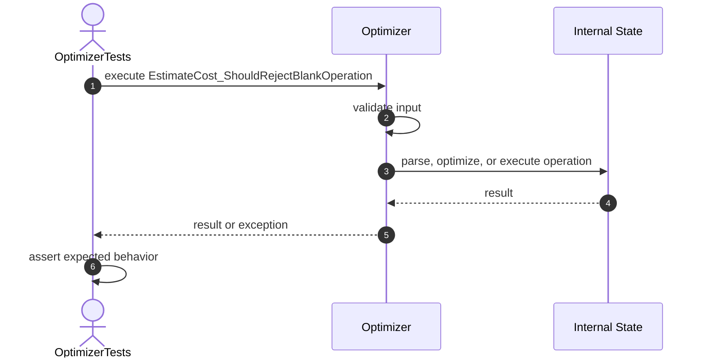

# Optimization Tests

## 13. Optimize_ShouldReturnNewPlan

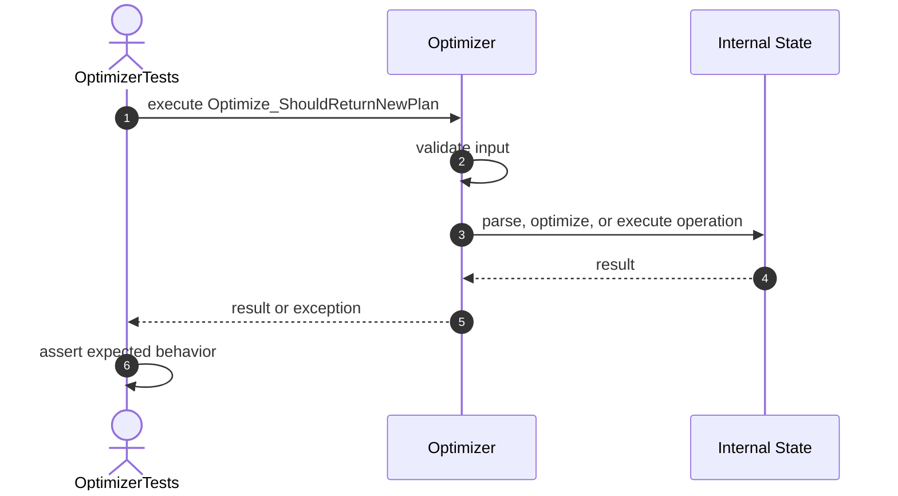

## 14. Optimize_ShouldMoveFilterBeforeTableScan

## 15. Optimize_ShouldRemoveDuplicateOperations

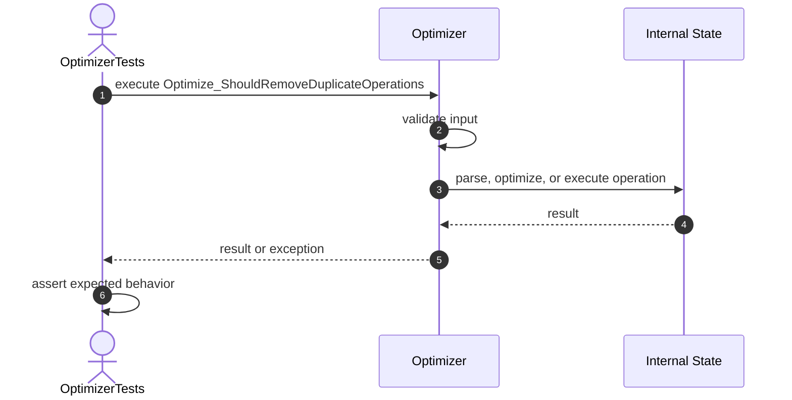

## 16. Optimize_ShouldRemoveRedundantSort

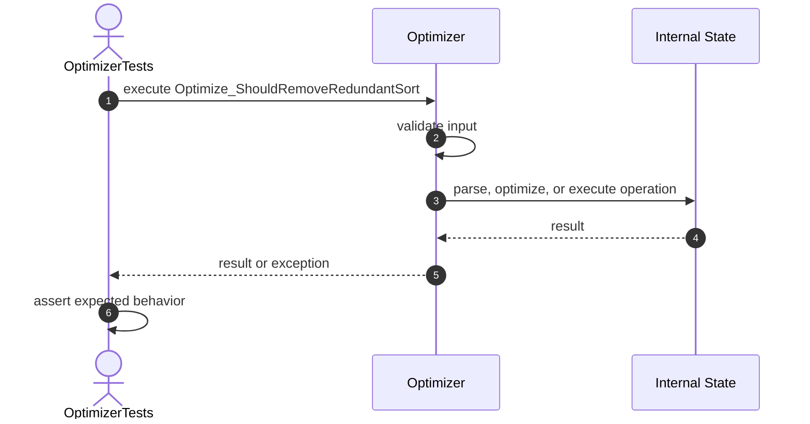

## 17. Optimize_ShouldReduceCostWhenOperationsRemoved

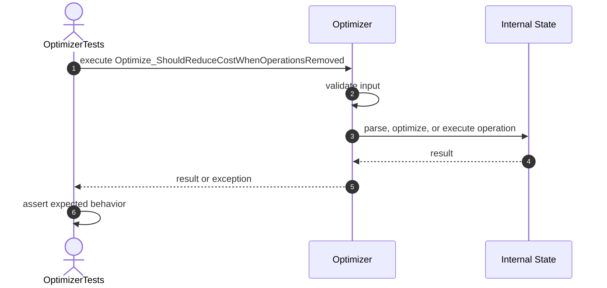

## 18. Optimize_ShouldPreserveNonRedundantOperations

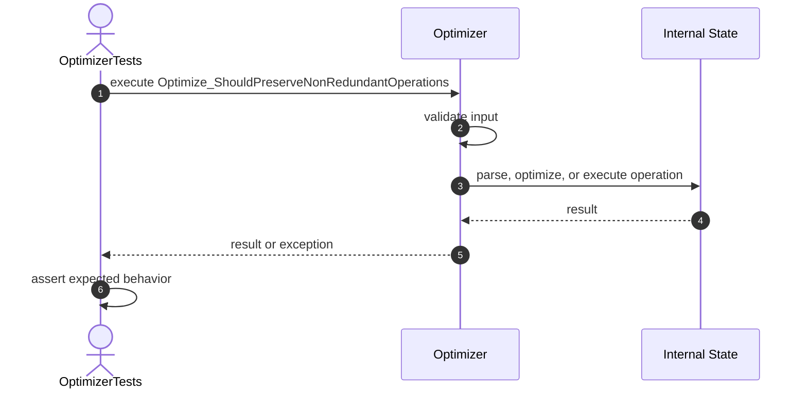

## 19. Optimize_ShouldRejectNullPlan

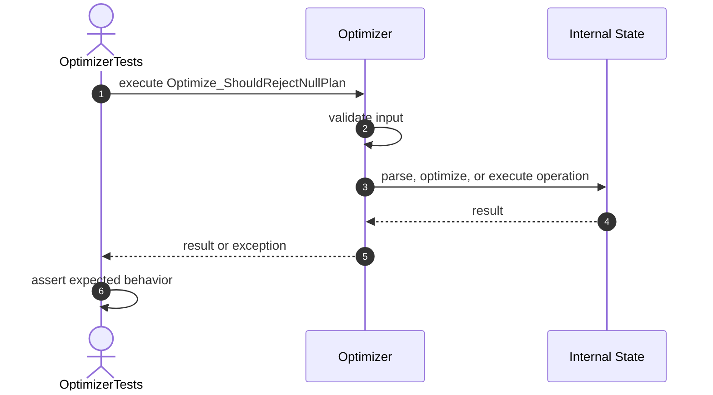