# QueryOptimizer Testing - Main Functional Sequences

---

## 1. Optimize Join Order

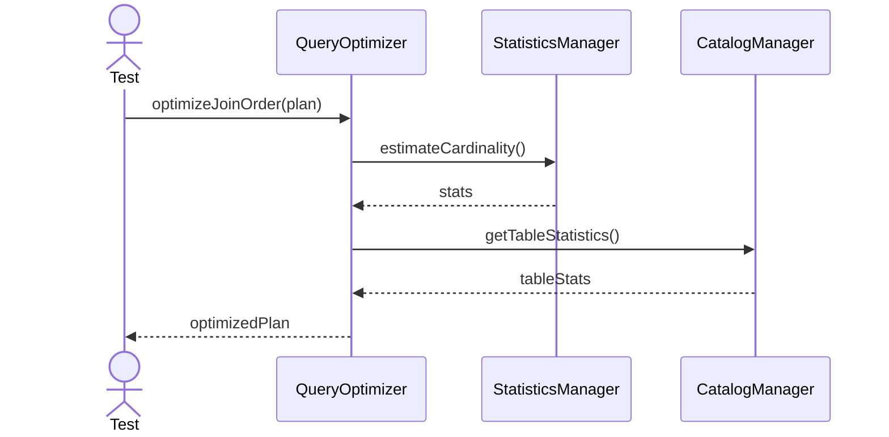
```mermaid
sequenceDiagram
actor Test
participant QueryOptimizer
participant StatisticsManager
participant CatalogManager

Test->>QueryOptimizer: optimizeJoinOrder(plan)
QueryOptimizer->>StatisticsManager: estimateCardinality()
StatisticsManager-->>QueryOptimizer: stats
QueryOptimizer->>CatalogManager: getTableStatistics()
CatalogManager-->>QueryOptimizer: tableStats
QueryOptimizer-->>Test: optimizedPlan
```

---

## 2. Predicate Pushdown

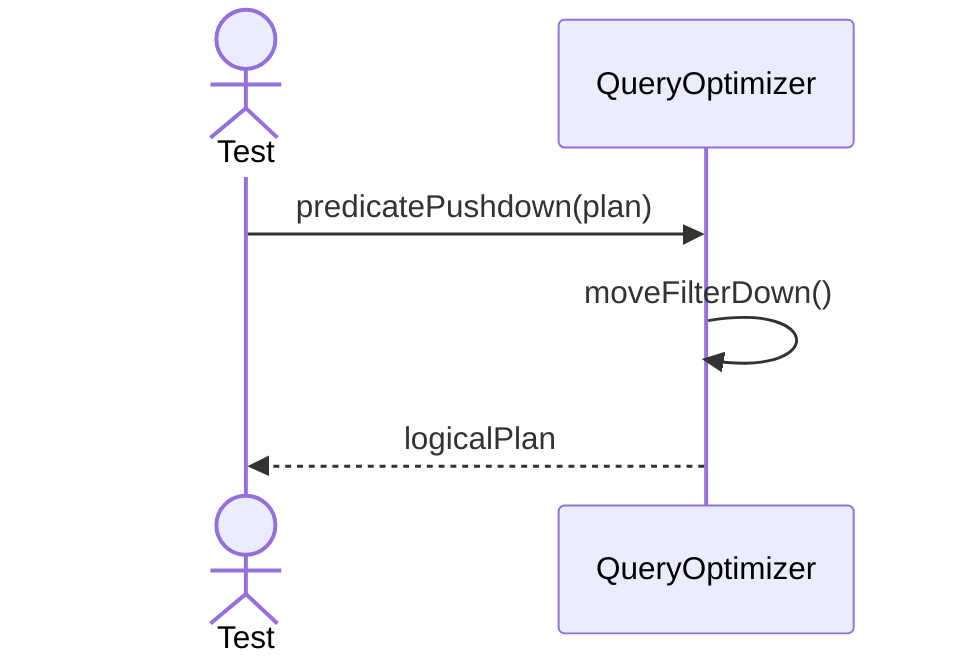
```mermaid
sequenceDiagram
actor Test
participant QueryOptimizer

Test->>QueryOptimizer: predicatePushdown(plan)
QueryOptimizer->>QueryOptimizer: moveFilterDown()
QueryOptimizer-->>Test: logicalPlan
```

---

## 3. Choose Index

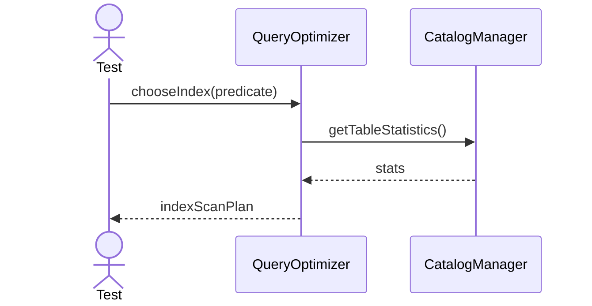
```mermaid
sequenceDiagram
actor Test
participant QueryOptimizer
participant CatalogManager

Test->>QueryOptimizer: chooseIndex(predicate)
QueryOptimizer->>CatalogManager: getTableStatistics()
CatalogManager-->>QueryOptimizer: stats
QueryOptimizer-->>Test: indexScanPlan
```

---

## 4. Generate Physical Plan

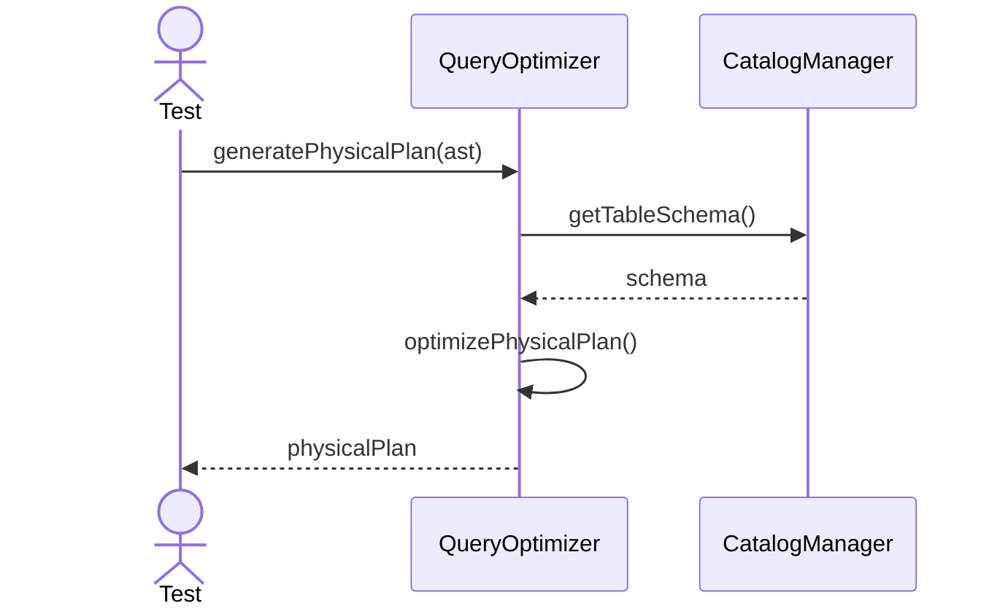
```mermaid
sequenceDiagram
actor Test
participant QueryOptimizer
participant CatalogManager

Test->>QueryOptimizer: generatePhysicalPlan(ast)
QueryOptimizer->>CatalogManager: getTableSchema()
CatalogManager-->>QueryOptimizer: schema
QueryOptimizer->>QueryOptimizer: optimizePhysicalPlan()
QueryOptimizer-->>Test: physicalPlan
```

---

## 5. Constant Folding

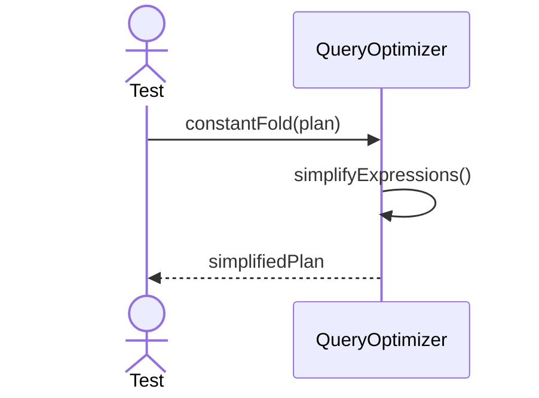
```mermaid
sequenceDiagram
actor Test
participant QueryOptimizer

Test->>QueryOptimizer: constantFold(plan)
QueryOptimizer->>QueryOptimizer: simplifyExpressions()
QueryOptimizer-->>Test: simplifiedPlan
```

---

## 6. Projection Pruning

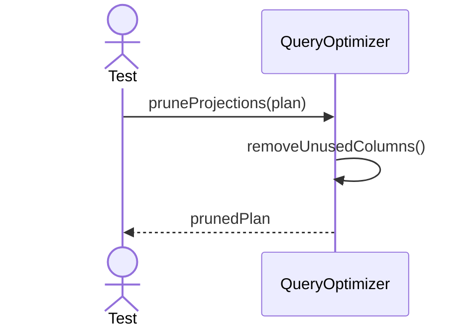
```mermaid
sequenceDiagram
actor Test
participant QueryOptimizer

Test->>QueryOptimizer: pruneProjections(plan)
QueryOptimizer->>QueryOptimizer: removeUnusedColumns()
QueryOptimizer-->>Test: prunedPlan
```

---

## 7. Estimate Cardinality

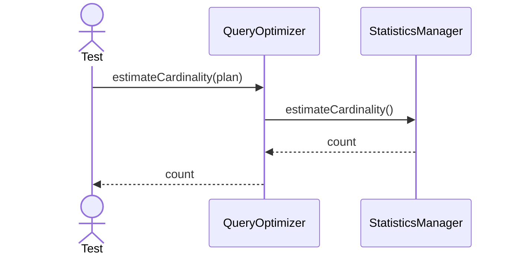
```mermaid
sequenceDiagram
actor Test
participant QueryOptimizer
participant StatisticsManager

Test->>QueryOptimizer: estimateCardinality(plan)
QueryOptimizer->>StatisticsManager: estimateCardinality()
StatisticsManager-->>QueryOptimizer: count
QueryOptimizer-->>Test: count
```

---

## 8. Estimate Cost

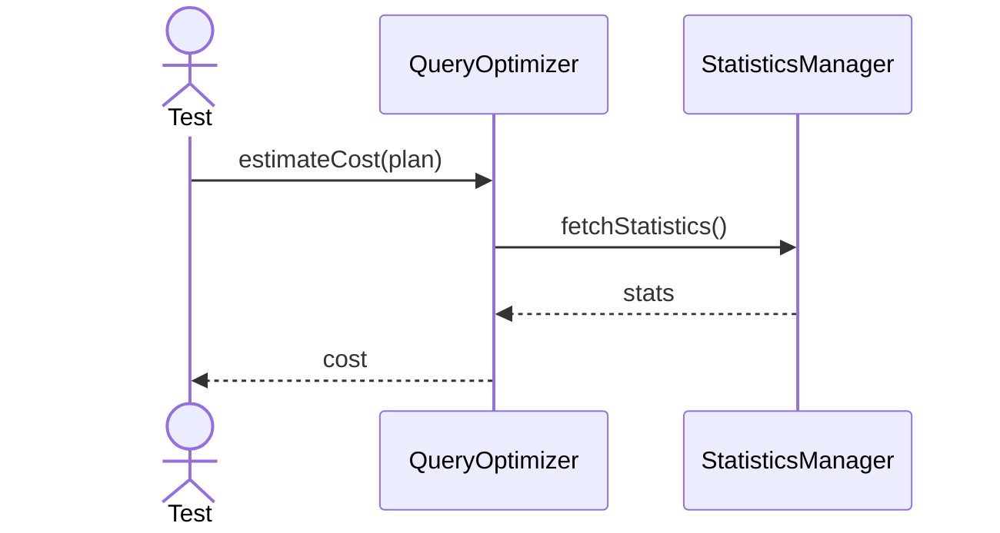
```mermaid
sequenceDiagram
actor Test
participant QueryOptimizer
participant StatisticsManager

Test->>QueryOptimizer: estimateCost(plan)
QueryOptimizer->>StatisticsManager: fetchStatistics()
StatisticsManager-->>QueryOptimizer: stats
QueryOptimizer-->>Test: cost
```

---

## 9. Choose Join Algorithm

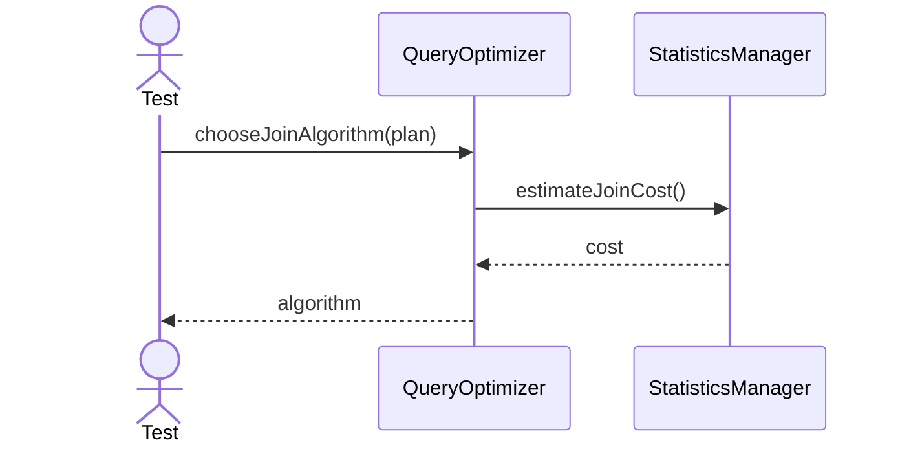
```mermaid
sequenceDiagram
actor Test
participant QueryOptimizer
participant StatisticsManager

Test->>QueryOptimizer: chooseJoinAlgorithm(plan)
QueryOptimizer->>StatisticsManager: estimateJoinCost()
StatisticsManager-->>QueryOptimizer: cost
QueryOptimizer-->>Test: algorithm
```

---

## 10. Reorder Predicates

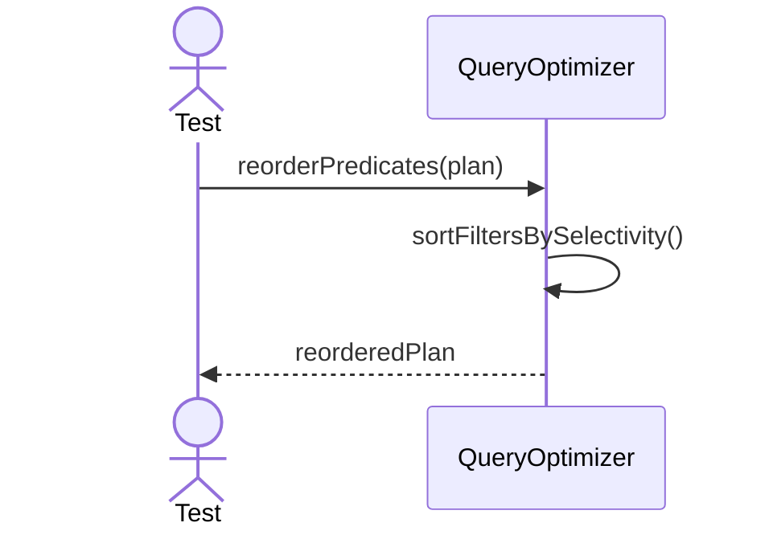
```mermaid
sequenceDiagram
actor Test
participant QueryOptimizer

Test->>QueryOptimizer: reorderPredicates(plan)
QueryOptimizer->>QueryOptimizer: sortFiltersBySelectivity()
QueryOptimizer-->>Test: reorderedPlan
```

---

## 11. Push Aggregation Down

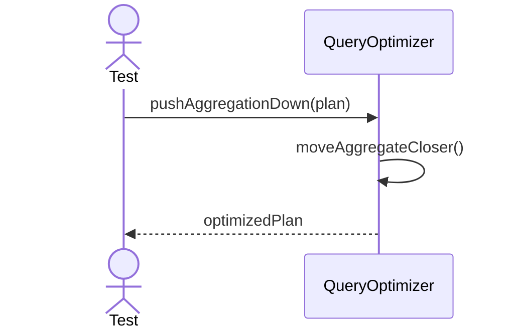
```mermaid
sequenceDiagram
actor Test
participant QueryOptimizer

Test->>QueryOptimizer: pushAggregationDown(plan)
QueryOptimizer->>QueryOptimizer: moveAggregateCloser()
QueryOptimizer-->>Test: optimizedPlan
```

---

## 12. Choose Parallel Plan

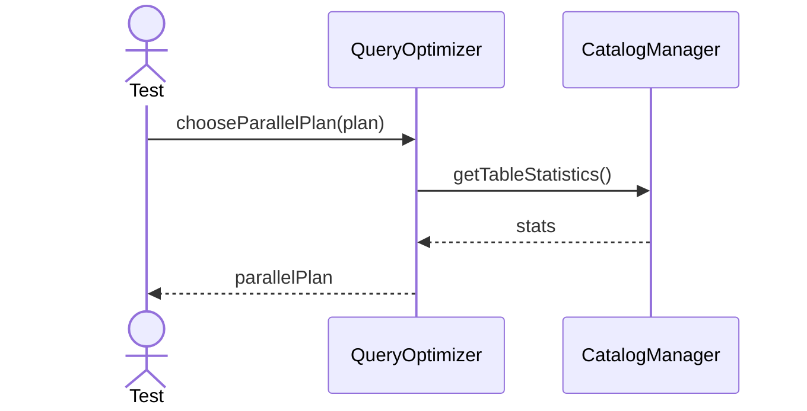
```mermaid
sequenceDiagram
actor Test
participant QueryOptimizer
participant CatalogManager

Test->>QueryOptimizer: chooseParallelPlan(plan)
QueryOptimizer->>CatalogManager: getTableStatistics()
CatalogManager-->>QueryOptimizer: stats
QueryOptimizer-->>Test: parallelPlan
```

---

## 13. Select Access Path

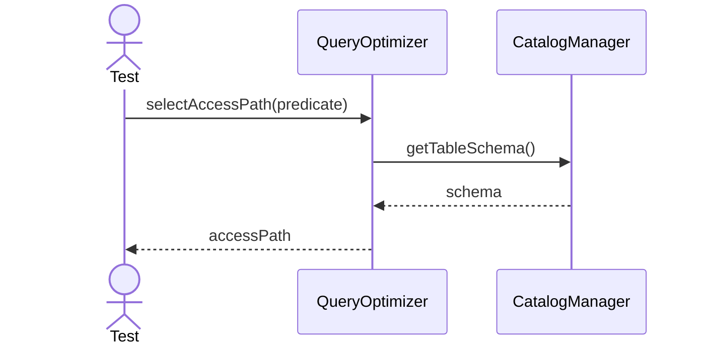
```mermaid
sequenceDiagram
actor Test
participant QueryOptimizer
participant CatalogManager

Test->>QueryOptimizer: selectAccessPath(predicate)
QueryOptimizer->>CatalogManager: getTableSchema()
CatalogManager-->>QueryOptimizer: schema
QueryOptimizer-->>Test: accessPath
```

---

## 14. Normalize Query

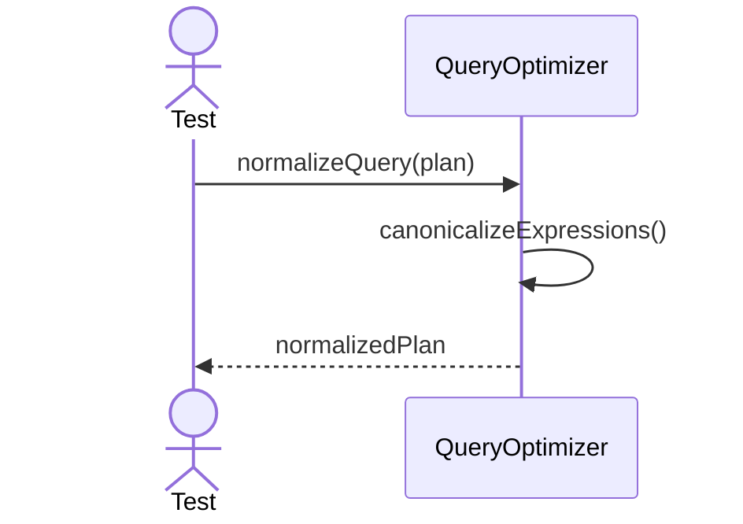
```mermaid
sequenceDiagram
actor Test
participant QueryOptimizer

Test->>QueryOptimizer: normalizeQuery(plan)
QueryOptimizer->>QueryOptimizer: canonicalizeExpressions()
QueryOptimizer-->>Test: normalizedPlan
```

---

## 15. Simplify Predicates

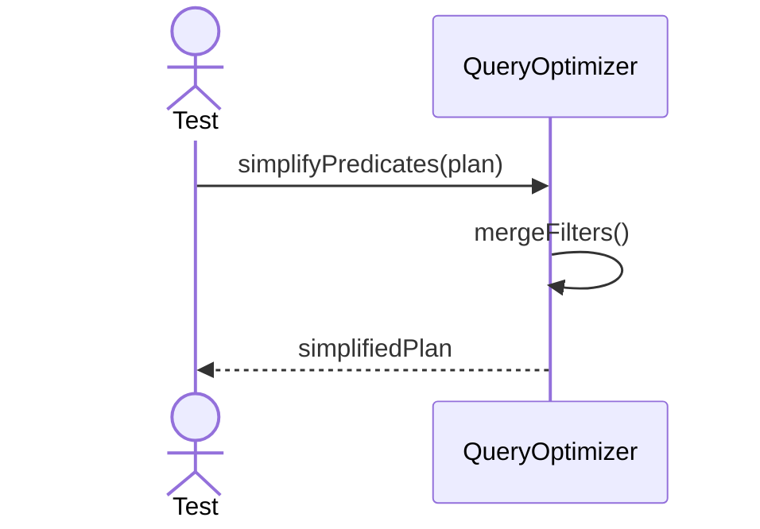
```mermaid
sequenceDiagram
actor Test
participant QueryOptimizer

Test->>QueryOptimizer: simplifyPredicates(plan)
QueryOptimizer->>QueryOptimizer: mergeFilters()
QueryOptimizer-->>Test: simplifiedPlan
```

---

## 16. Optimize Sort Order

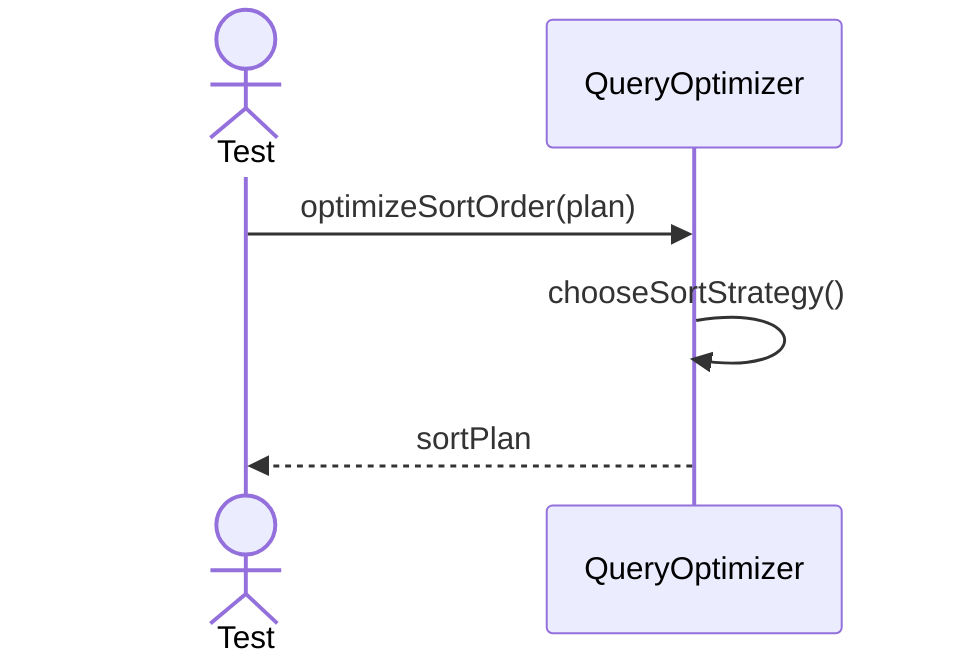
```mermaid
sequenceDiagram
actor Test
participant QueryOptimizer

Test->>QueryOptimizer: optimizeSortOrder(plan)
QueryOptimizer->>QueryOptimizer: chooseSortStrategy()
QueryOptimizer-->>Test: sortPlan
```

---

## 17. Optimize Group By

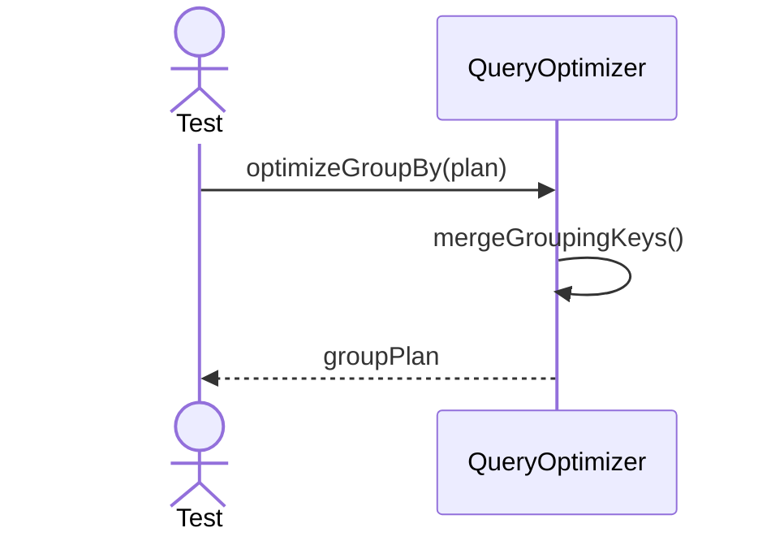
```mermaid
sequenceDiagram
actor Test
participant QueryOptimizer

Test->>QueryOptimizer: optimizeGroupBy(plan)
QueryOptimizer->>QueryOptimizer: mergeGroupingKeys()
QueryOptimizer-->>Test: groupPlan
```

---

## 18. Optimize Limit

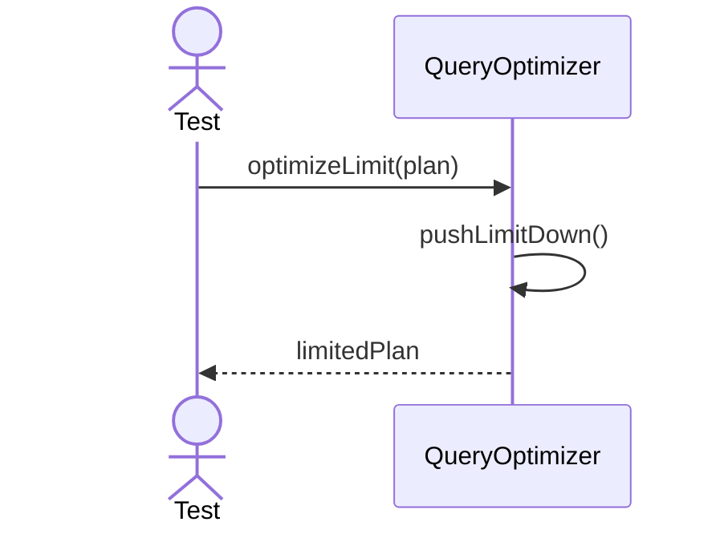
```mermaid
sequenceDiagram
actor Test
participant QueryOptimizer

Test->>QueryOptimizer: optimizeLimit(plan)
QueryOptimizer->>QueryOptimizer: pushLimitDown()
QueryOptimizer-->>Test: limitedPlan
```

---

## 19. Update Cost Model

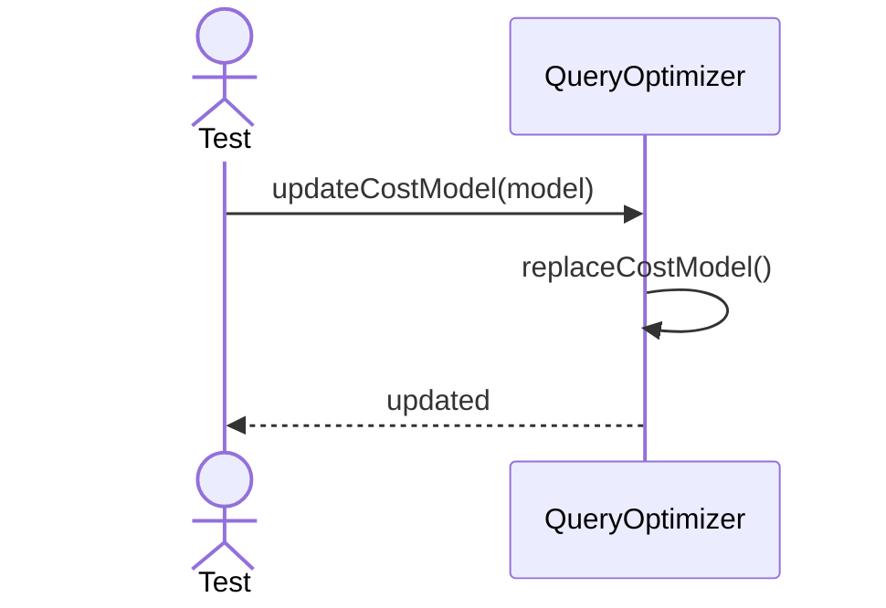
```mermaid
sequenceDiagram
actor Test
participant QueryOptimizer

Test->>QueryOptimizer: updateCostModel(model)
QueryOptimizer->>QueryOptimizer: replaceCostModel()
QueryOptimizer-->>Test: updated
```

---

## 20. Export Optimization Trace

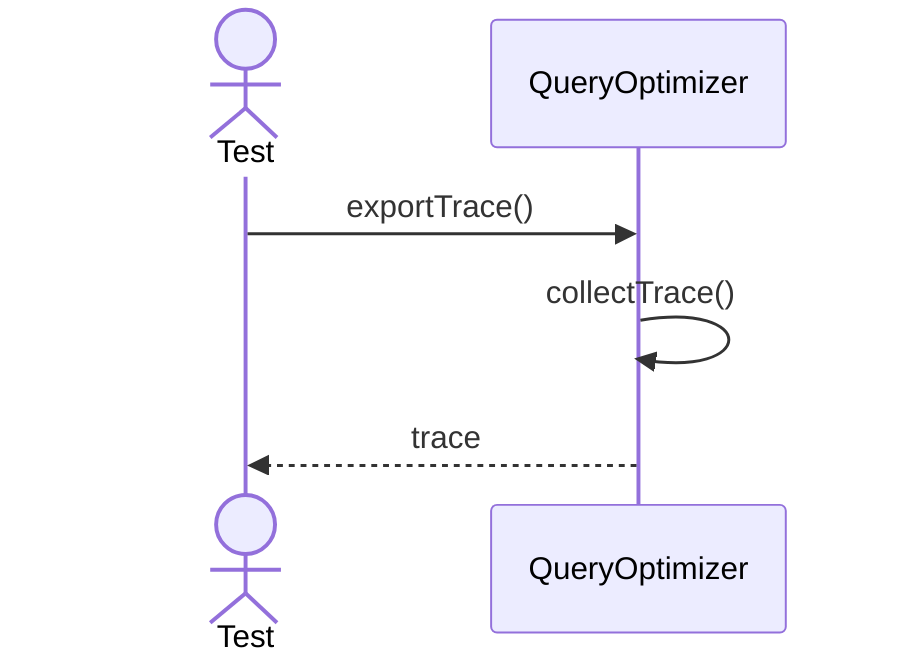
```mermaid
sequenceDiagram
actor Test
participant QueryOptimizer

Test->>QueryOptimizer: exportTrace()
QueryOptimizer->>QueryOptimizer: collectTrace()
QueryOptimizer-->>Test: trace
```
