# SQLParser Testing - Main Functional Sequences

---

## 1. Parse SELECT

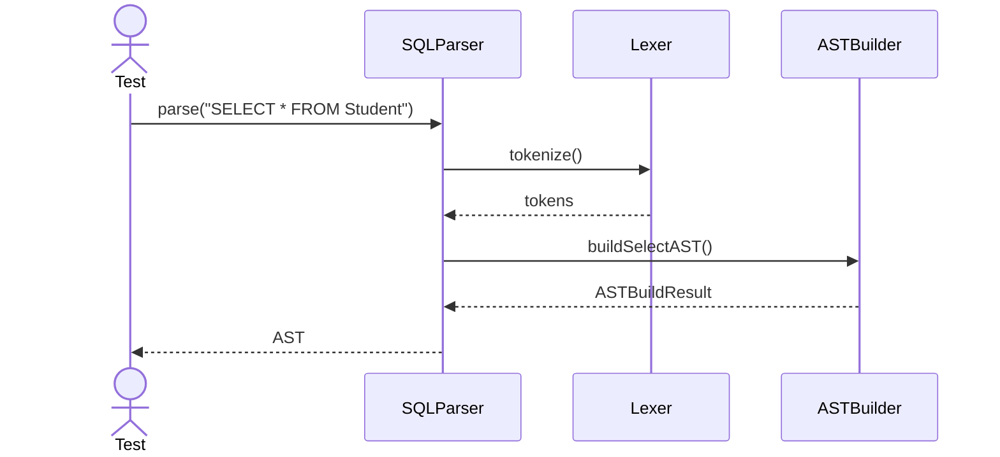

---

## 2. Parse INSERT

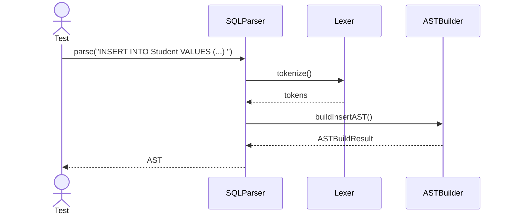

---

## 3. Parse JOIN

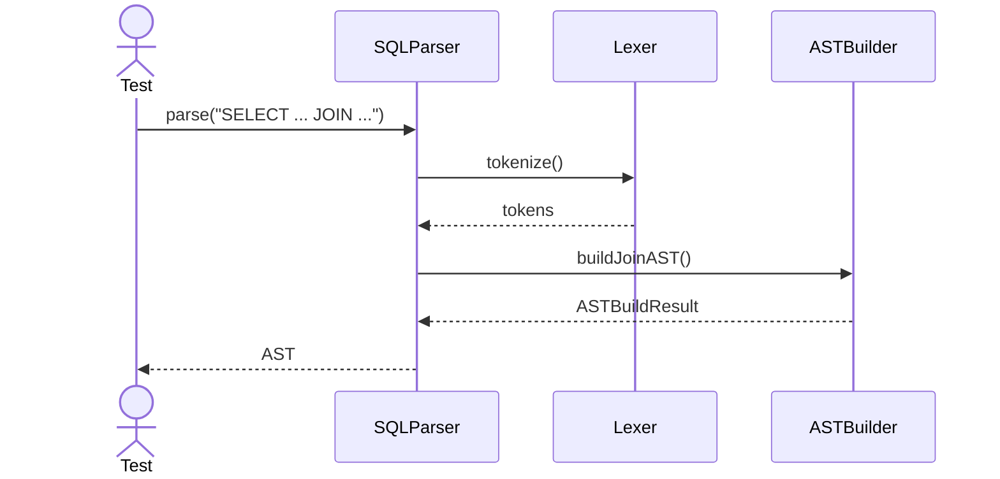

---

## 4. Parse Invalid Syntax

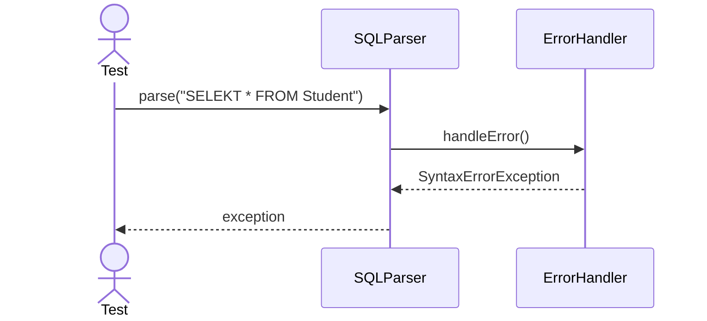

---

## 5. Parse UPDATE

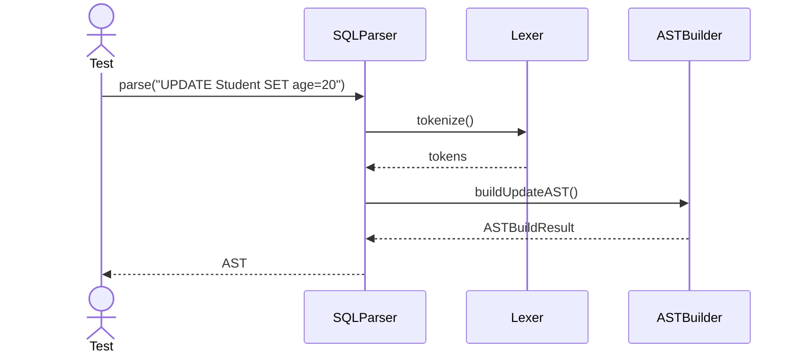

---

## 6. Parse DELETE

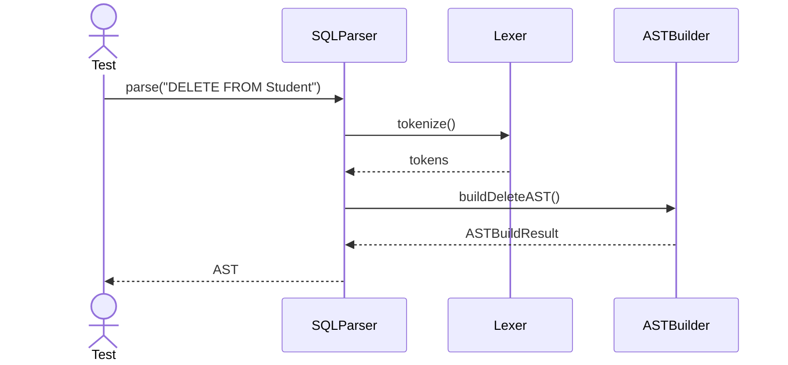

---

## 7. Parse CREATE TABLE

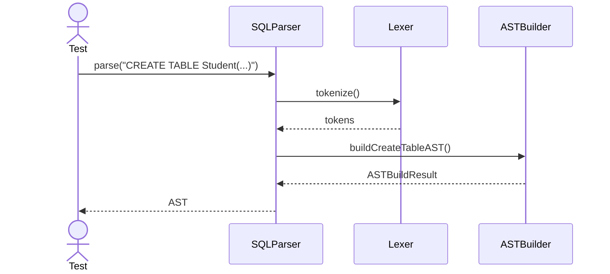

---

## 8. Parse ALTER TABLE

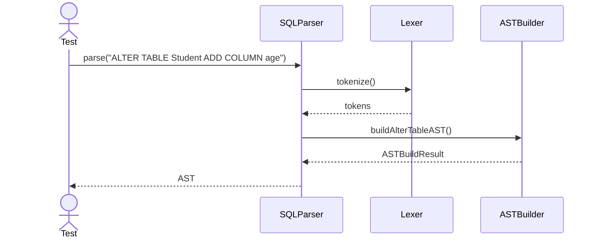

---

## 9. Parse DROP TABLE

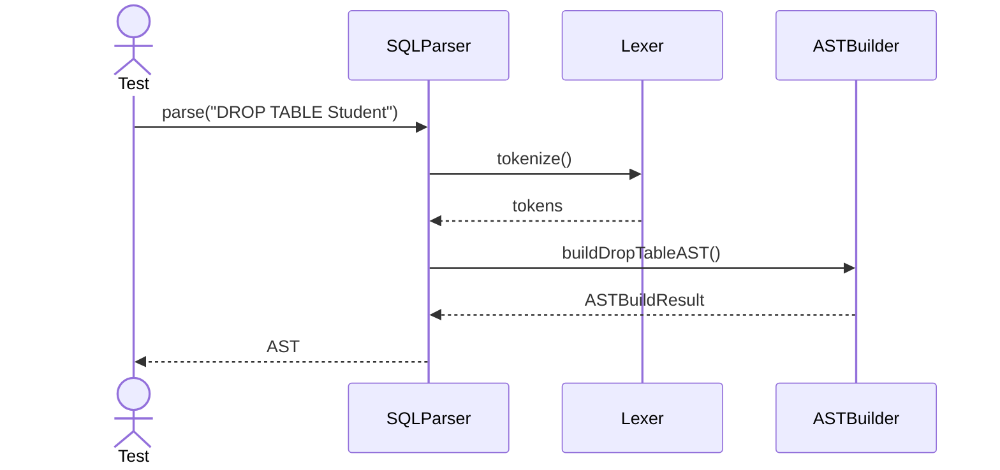

---

## 10. Parse GROUP BY

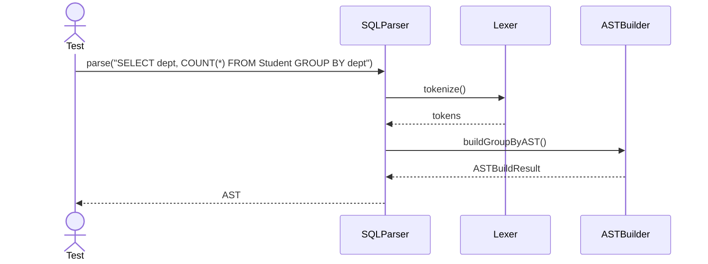

---

## 11. Parse HAVING

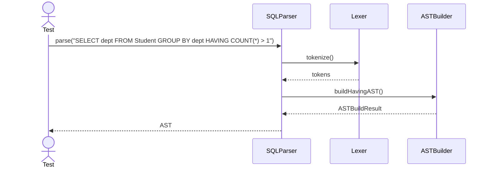

---

## 12. Parse ORDER BY

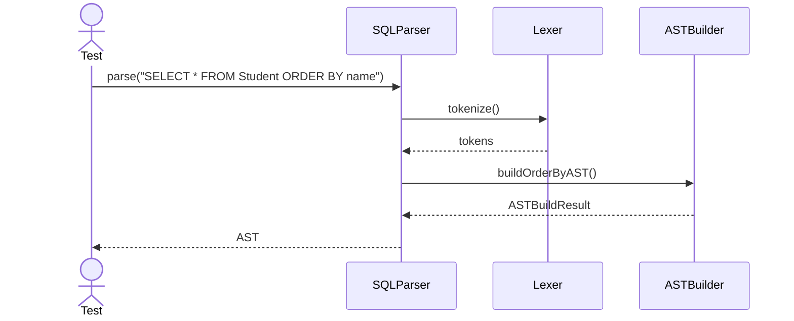

---

## 13. Parse JOIN Alias

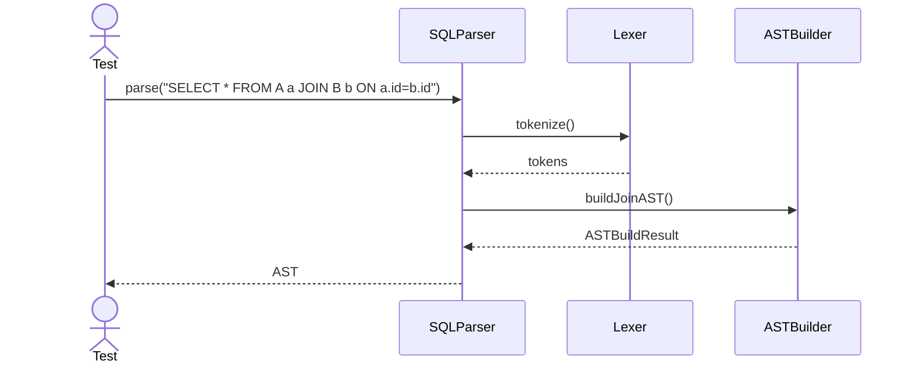

---

## 14. Parse Subquery

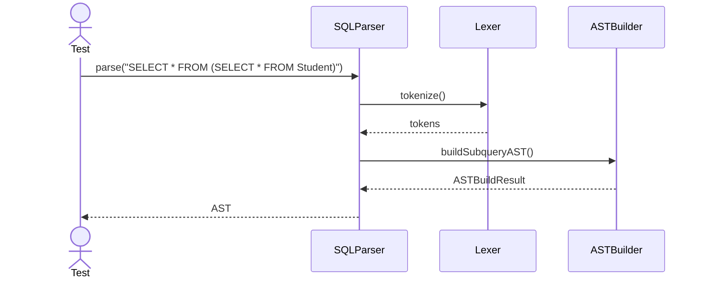

---

## 15. Parse CTE

---

## 16. Parse Window Function

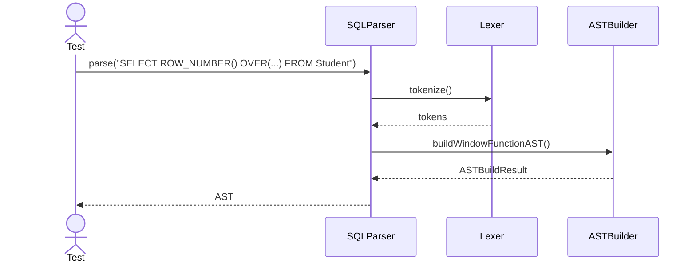

---

## 17. Parse Transaction Begin

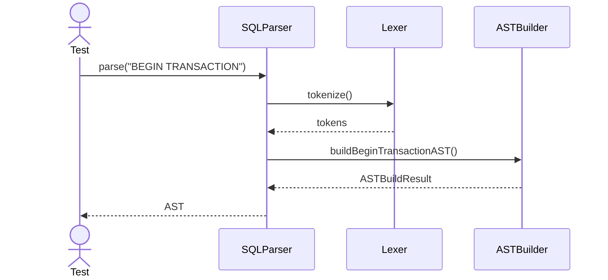

---

## 18. Parse Commit

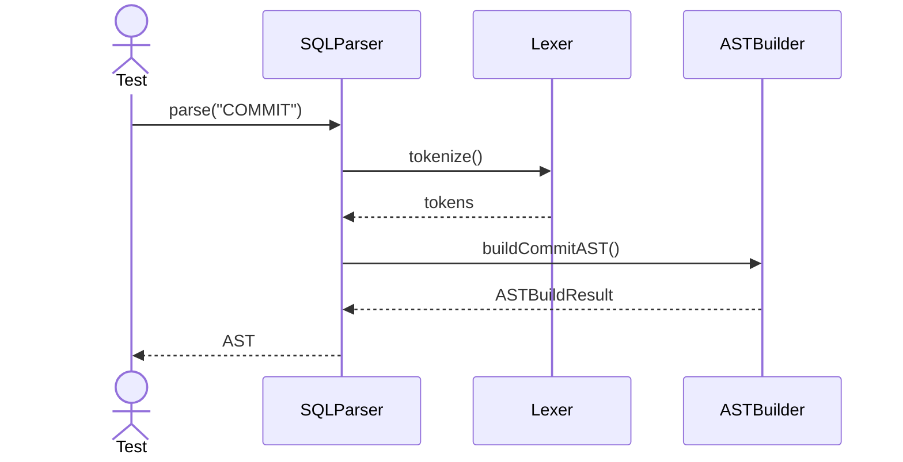

---

## 19. Parse Rollback

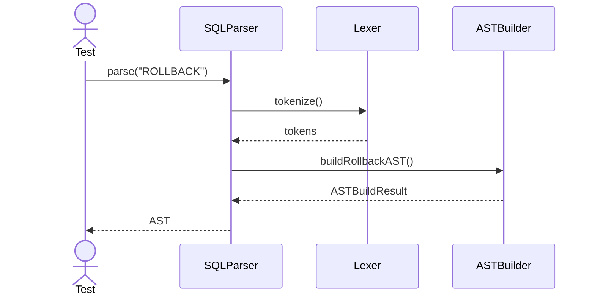

---

## 20. Parse Parameterized Query

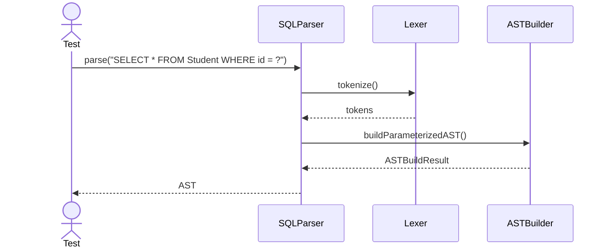
